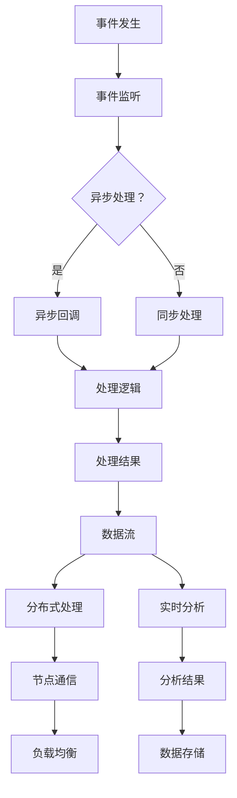

                 

## 第一部分：背景介绍

### 1.1 问题背景

随着信息技术的飞速发展，人工智能（AI）已经成为推动社会进步的重要力量。在AI领域，大规模语言模型（LLM）因其强大的自然语言处理能力而备受关注。LLM通过训练海量文本数据，掌握语言的规律和语义，能够实现文本生成、问答系统、机器翻译等功能，极大地提升了人类与机器之间的交互体验。

然而，传统的事件驱动架构（EDA）在应对实时性需求时存在一定局限性。EDA是一种以事件为中心的软件架构，其核心思想是通过事件监听和处理来实现系统功能。事件的发生触发相应的处理，从而完成系统任务。然而，在实际应用中，LLM处理大量自然语言数据时，传统EDA在实时性方面面临以下挑战：

1. **延迟问题**：事件处理延迟较大，难以满足实时需求。在处理大量数据时，事件处理时间可能会显著增加，导致系统响应速度下降，无法满足用户实时交互的需求。

2. **并发处理能力**：在处理高并发事件时，架构性能受限。传统EDA通常采用单线程或同步处理方式，难以充分利用多核处理器的性能，导致系统在高并发场景下性能下降。

3. **可扩展性**：随着数据量和事件量的增加，架构扩展性不足。传统EDA在扩展性方面存在局限性，难以在数据量和事件量增加时保持高效性能。

为了解决上述问题，我们需要引入事件驱动架构增强（EDEA）方法，以提高LLM应用的实时性。EDEA方法通过异步处理、分布式架构和流处理技术，克服了传统EDA在实时性方面的局限性，实现了LLM应用的实时响应和高效处理。接下来，我们将详细探讨EDEA方法的核心原理和应用，为LLM应用的实时性提升提供有力支持。

### 1.2 问题描述

在传统的事件驱动架构（EDA）中，实时性是一个重要的考量因素。EDA的基本思想是通过事件监听和处理来实现系统功能，事件的发生触发相应的处理，从而完成系统任务。然而，在实际应用中，LLM处理大量自然语言数据时，传统EDA在实时性方面面临以下主要挑战：

#### 延迟问题

事件处理延迟较大，难以满足实时需求。在传统EDA中，事件处理通常是同步的，即事件发生时，系统会立即执行相应的处理逻辑。然而，当处理大量数据时，事件处理时间可能会显著增加，导致系统响应速度下降。具体表现为以下几种情况：

- **事件积压**：当系统处理能力不足时，事件可能会在队列中积压，导致后续事件的响应时间延长。例如，在一个问答系统中，当用户连续提出多个问题时，如果系统无法在短时间内处理完所有问题，用户会感到明显的延迟。

- **资源竞争**：在多线程或分布式环境中，多个事件可能会同时请求系统资源，导致资源竞争。资源竞争会导致事件处理时间延长，进一步影响系统的实时性。

- **网络延迟**：当事件处理涉及远程系统时，网络延迟也会对事件处理时间产生影响。例如，在一个跨地域的分布式系统中，事件处理需要通过网络传输数据，网络延迟可能导致事件处理时间增加。

#### 并发处理能力受限

在处理高并发事件时，架构性能受限。传统EDA通常采用单线程或同步处理方式，难以充分利用多核处理器的性能。具体表现为：

- **单线程瓶颈**：在单线程环境中，事件处理速度取决于单个处理线程的性能。当系统需要处理大量并发事件时，单线程的处理能力成为瓶颈，无法充分利用多核处理器的性能。

- **同步锁竞争**：在多线程环境中，事件处理需要使用同步锁来保护共享资源。当多个线程同时请求同步锁时，锁的竞争会导致事件处理时间增加，降低系统的并发处理能力。

- **资源耗尽**：在高并发场景下，系统可能会因资源耗尽而出现性能瓶颈。例如，当系统内存不足时，会导致垃圾回收频率增加，影响事件处理速度。

#### 扩展性不足

随着数据量和事件量的增加，架构扩展性不足。传统EDA在设计时通常基于一定的假设，如事件量相对稳定。然而，在实际应用中，数据量和事件量可能会快速增长，导致系统性能下降。具体表现为：

- **单点故障**：在传统EDA中，系统通常依赖于单点实例来处理事件。当单点实例无法承受大量事件时，系统可能会出现单点故障，导致事件处理失败。

- **负载不均**：在分布式架构中，如果事件处理任务无法均匀分配到各个节点，会导致某些节点负载过高，而其他节点资源空闲。负载不均会导致系统性能下降，难以应对大规模事件处理需求。

- **扩展瓶颈**：当系统需要扩展时，传统EDA可能面临扩展瓶颈。例如，在增加节点数量时，系统架构和数据处理流程需要重新设计，导致扩展过程复杂且成本高昂。

综上所述，传统EDA在实时性方面存在延迟问题、并发处理能力受限和扩展性不足等挑战。为了应对这些挑战，我们需要引入事件驱动架构增强（EDEA）方法，通过异步处理、分布式架构和流处理技术，提升LLM应用的实时性，满足高并发、大规模数据处理的实时需求。

### 1.3 问题解决

为了解决传统事件驱动架构（EDA）在实时性方面的挑战，我们可以采用事件驱动架构增强（EDEA）方法，以提高大规模语言模型（LLM）应用的实时性。EDEA方法结合了异步处理、分布式架构和流处理技术，从而克服了传统EDA的局限性，实现了高效、实时的事件处理。以下是EDEA方法的具体解决方案：

#### 异步处理

异步处理通过将事件处理与主线程分离，减少事件处理延迟，提高系统实时性。具体实现方法如下：

- **事件监听与回调**：在EDEA中，事件监听器不再是直接执行事件处理逻辑，而是触发一个回调函数。当事件发生时，回调函数会被异步执行，从而避免阻塞主线程。例如，在Python中，可以使用`asyncio`库实现异步事件监听：

  ```python
  import asyncio

  async def handle_event(event):
      # 处理事件逻辑
      print("处理事件：", event)

  async def main():
      # 注册事件监听器
      asyncio.get_event_loop().create_future()
      await handle_event("事件1")
      await handle_event("事件2")

  asyncio.run(main())
  ```

- **异步任务调度**：通过异步任务调度，可以同时处理多个事件，提高系统并发处理能力。异步任务调度器负责将事件处理任务分配给不同的线程或协程，从而实现并行处理。例如，在Java中，可以使用`CompletableFuture`实现异步任务调度：

  ```java
  public class AsyncExample {
      public static void main(String[] args) {
          CompletableFuture<Void> future1 = CompletableFuture.runAsync(() -> {
              // 处理事件1
              System.out.println("处理事件1");
          });

          CompletableFuture<Void> future2 = CompletableFuture.runAsync(() -> {
              // 处理事件2
              System.out.println("处理事件2");
          });

          CompletableFuture.allOf(future1, future2).join();
      }
  }
  ```

#### 分布式架构

分布式架构通过将系统划分为多个节点，实现高并发处理能力。分布式架构的主要思想是将事件处理任务分布到多个节点上，从而充分利用集群资源的处理能力。具体实现方法如下：

- **节点划分**：将系统划分为多个节点，每个节点负责处理一部分事件。节点之间的数据传输通过网络进行。例如，在Kafka中，可以使用分区机制将消息队列划分为多个分区，每个分区由不同的消费者节点处理。

- **负载均衡**：通过负载均衡算法，将事件处理任务均匀分配到各个节点。负载均衡可以避免某个节点负载过高，导致系统性能下降。例如，在Nginx中，可以使用轮询算法实现负载均衡：

  ```nginx
  http {
      upstream myapp {
          server node1;
          server node2;
          server node3;
      }

      server {
          location / {
              proxy_pass http://myapp;
          }
      }
  }
  ```

- **数据一致性**：在分布式架构中，数据一致性是一个关键问题。通过分布式事务机制，可以确保数据的一致性。例如，在分布式数据库中，可以使用两阶段提交（2PC）协议实现数据一致性：

  ```sql
  -- 开始分布式事务
  START TRANSACTION;

  -- 更新节点1的数据
  UPDATE node1_data SET value = 1 WHERE id = 1;

  -- 更新节点2的数据
  UPDATE node2_data SET value = 1 WHERE id = 1;

  -- 提交分布式事务
  COMMIT;
  ```

#### 流处理技术

流处理技术通过实时处理和分析数据流，实现数据的实时响应。流处理技术适用于处理大量实时数据，可以实时处理事件，并生成实时分析结果。具体实现方法如下：

- **数据采集**：通过数据采集工具，将实时数据流传输到流处理系统。数据采集可以基于消息队列（如Kafka）、数据库连接（如JDBC）或日志文件（如Logstash）等。

- **数据过滤和转换**：在流处理系统中，对采集到的数据进行过滤和转换，提取有用的信息。数据过滤和转换可以使用SQL查询、Python脚本或自定义处理逻辑等。

- **实时分析**：对处理后的数据进行实时分析，生成实时分析结果。实时分析可以使用机器学习模型、统计分析方法或自定义算法等。

- **数据存储和可视化**：将实时分析结果存储到数据存储系统（如HDFS、MySQL）或可视化工具（如Kibana、Tableau），以便进一步分析和展示。

通过引入异步处理、分布式架构和流处理技术，EDEA方法可以有效提升LLM应用的实时性。异步处理减少了事件处理延迟，分布式架构提高了并发处理能力，流处理技术实现了数据的实时响应。这些技术的结合，使得LLM应用能够在高并发、大规模数据处理场景下保持高效性能，满足实时性需求。

### 1.4 边界与外延

EDEA方法的边界主要涉及大规模语言模型（LLM）应用场景和实时性要求。具体来说，EDEA方法适用于以下场景：

1. **高并发、大规模数据处理**：在处理大量并发事件时，EDEA方法可以通过异步处理和分布式架构，提高系统性能，满足实时性需求。

2. **实时响应和数据处理**：EDEA方法利用流处理技术，实现数据的实时处理和分析，适用于需要实时响应的应用场景，如实时监控、实时搜索等。

3. **跨地域分布式系统**：在跨地域的分布式系统中，EDEA方法通过分布式架构，实现数据的高效传输和处理，提高系统的实时性和可靠性。

EDEA方法的外延包括异步编程、分布式架构和流处理技术等相关技术领域。异步编程是实现异步处理的基础，分布式架构提供高并发处理能力，流处理技术实现数据的实时响应。这些技术领域的深入研究和应用，将进一步推动EDEA方法的发展，提升LLM应用的实时性和性能。

### 1.5 概念结构与核心要素组成

在讨论事件驱动架构增强（EDEA）方法时，我们需要了解其核心概念、结构与核心要素组成。这些概念和要素共同构成了EDEA方法的技术框架，使其能够提升大规模语言模型（LLM）应用的实时性。

#### 事件驱动架构（EDA）

事件驱动架构（EDA）是一种以事件为中心的软件架构，通过事件监听和处理来实现系统功能。EDA的核心思想是将系统功能分解为一系列的事件，并在事件发生时触发相应的处理逻辑。以下是EDA的主要组成部分：

- **事件监听器**：负责监听事件的发生，并在事件触发时调用相应的处理逻辑。
- **事件处理器**：处理事件的逻辑代码，根据事件的类型和内容执行特定的操作。
- **事件队列**：用于存储待处理的事件，确保事件按顺序执行。

EDA的特点包括：

- **事件为中心**：系统功能以事件为驱动，事件的发生触发相应的处理。
- **异步处理**：事件处理采用异步模式，减少事件处理延迟，提高系统响应速度。
- **模块化**：事件处理模块独立，便于系统扩展和维护。

#### 大规模语言模型（LLM）

大规模语言模型（LLM）是一种具有大规模参数和强大自然语言处理能力的语言模型。LLM通过训练海量文本数据，掌握语言的规律和语义，能够实现文本生成、问答系统、机器翻译等功能。以下是LLM的主要组成部分：

- **模型参数**：LLM由数十亿甚至千亿级别的参数组成，用于表示语言的特征和规律。
- **训练数据**：LLM的训练数据包括大量的文本，用于训练模型参数，使其能够理解和生成自然语言。
- **推理引擎**：在LLM应用中，推理引擎负责使用模型参数处理输入文本，生成相应的输出文本。

LLM的特点包括：

- **大规模参数**：LLM拥有数十亿甚至千亿级别的参数，使其在处理复杂任务时具备优势。
- **强大自然语言处理能力**：LLM能够理解和生成自然语言，实现智能交互。
- **自适应学习能力**：LLM能够通过不断学习新的文本数据，提高其自然语言处理能力。

#### 实时性

实时性是指系统对事件响应的及时性，满足特定时间要求。在LLM应用中，实时性是非常重要的，因为用户往往期望能够快速获得响应。以下是实时性的主要特征：

- **低延迟**：系统对事件的响应延迟应尽可能低，以提供快速的用户体验。
- **高吞吐量**：系统应在高并发场景下保持稳定的性能，处理大量的事件。
- **可靠性和稳定性**：系统应在长时间运行过程中保持高可用性和稳定性。

#### 异步处理

异步处理是通过将事件处理与主线程分离，减少事件处理延迟，提高系统实时性的一种方法。以下是异步处理的核心概念：

- **异步回调**：当事件发生时，系统触发一个异步回调函数，该函数将在异步线程中执行事件处理逻辑。
- **事件队列**：用于存储待处理的事件，确保事件按顺序执行。
- **线程池**：用于管理异步线程，分配任务给空闲线程，提高系统并发处理能力。

#### 分布式架构

分布式架构通过将系统划分为多个节点，实现高并发处理能力。以下是分布式架构的主要组成部分：

- **节点划分**：将系统划分为多个节点，每个节点负责处理一部分事件。
- **负载均衡**：通过负载均衡算法，将事件处理任务分配到各个节点。
- **数据一致性**：确保分布式系统中数据的一致性，避免数据冲突。

#### 流处理技术

流处理技术通过实时处理和分析数据流，实现数据的实时响应。以下是流处理技术的主要组成部分：

- **数据采集**：通过数据采集工具，将实时数据流传输到流处理系统。
- **数据过滤和转换**：在流处理系统中，对采集到的数据进行过滤和转换，提取有用的信息。
- **实时分析**：对处理后的数据进行实时分析，生成实时分析结果。
- **数据存储和可视化**：将实时分析结果存储到数据存储系统或可视化工具，以便进一步分析和展示。

综上所述，事件驱动架构增强（EDEA）方法的核心概念与要素包括事件驱动架构（EDA）、大规模语言模型（LLM）、实时性、异步处理、分布式架构和流处理技术。这些概念和要素共同构成了EDEA方法的技术框架，使其能够提升LLM应用的实时性，满足高并发、大规模数据处理的实时需求。

## 第二部分：核心概念与联系

### 2.1 事件驱动架构（EDA）原理

事件驱动架构（EDA）是一种以事件为中心的软件架构，通过事件监听和处理来实现系统功能。EDA的核心思想是将系统功能分解为一系列的事件，并在事件发生时触发相应的处理逻辑。以下是EDA的基本原理和组成部分。

#### 2.1.1 事件驱动架构定义

事件驱动架构（EDA）是一种以事件为中心的软件架构，它通过事件监听和处理来实现系统功能。在EDA中，事件可以是用户操作、系统事件或外部触发的事件。事件的发生触发相应的处理逻辑，从而实现系统功能。

#### 2.1.2 事件驱动架构特点

- **事件为中心**：EDA以事件为中心，事件的发生和触发是系统功能实现的核心。系统功能通过监听和处理事件来实现。
- **异步处理**：事件处理采用异步模式，减少事件处理延迟，提高系统响应速度。异步处理允许事件在后台线程中执行，避免阻塞主线程。
- **模块化**：EDA中的事件处理模块独立，便于系统扩展和维护。事件处理模块可以独立开发、测试和部署，提高系统的可维护性和可扩展性。

#### 2.1.3 EDA与LLM联系

EDA为大规模语言模型（LLM）提供了高效的实时性处理框架，有助于提高LLM应用的性能和稳定性。以下是EDA与LLM之间的联系：

- **事件监听和处理**：LLM应用可以通过EDA的事件监听机制，实时获取和处理用户输入，实现动态交互。
- **异步处理**：EDA的异步处理机制可以减少LLM应用的事件处理延迟，提高系统的响应速度，满足实时性需求。
- **模块化**：EDA的模块化设计有助于LLM应用的扩展和维护，可以方便地添加新的功能模块，提高系统的可维护性。

### 2.2 大规模语言模型（LLM）原理

大规模语言模型（LLM）是一种具有大规模参数和强大自然语言处理能力的语言模型。LLM通过训练海量文本数据，掌握语言的规律和语义，能够实现文本生成、问答系统、机器翻译等功能。以下是LLM的基本原理和组成部分。

#### 2.2.1 LLM定义

大规模语言模型（LLM）是一种由数十亿甚至千亿级别的参数组成的语言模型，通过训练海量文本数据，掌握语言的规律和语义。LLM能够理解和生成自然语言，实现智能交互。

#### 2.2.2 LLM特点

- **大规模参数**：LLM拥有数十亿甚至千亿级别的参数，使其在处理复杂任务时具备优势。
- **强大自然语言处理能力**：LLM能够理解和生成自然语言，实现智能交互，如文本生成、问答系统、机器翻译等。
- **自适应学习能力**：LLM能够通过不断学习新的文本数据，提高其自然语言处理能力。

#### 2.2.3 LLM与EDA联系

LLM与EDA之间存在紧密的联系，二者共同构成了高效、实时的事件处理框架。以下是LLM与EDA之间的联系：

- **事件监听和处理**：LLM应用可以通过EDA的事件监听机制，实时获取和处理用户输入，实现动态交互。
- **异步处理**：EDA的异步处理机制可以减少LLM应用的事件处理延迟，提高系统的响应速度，满足实时性需求。
- **模块化**：EDA的模块化设计有助于LLM应用的扩展和维护，可以方便地添加新的功能模块，提高系统的可维护性。

### 2.3 EDEA方法

事件驱动架构增强（EDEA）方法是在传统EDA基础上，结合异步处理、分布式架构和流处理技术，以提高大规模语言模型（LLM）应用的实时性。以下是EDEA方法的核心原理。

#### 2.3.1 异步处理原理

异步处理是通过将事件处理与主线程分离，减少事件处理延迟，提高系统实时性的一种方法。在EDEA中，异步处理主要包括以下原理：

- **事件监听与回调**：事件监听器不再直接执行事件处理逻辑，而是触发一个回调函数。当事件发生时，回调函数会在异步线程中执行事件处理逻辑。
- **线程池管理**：通过线程池管理异步线程，分配任务给空闲线程，提高系统并发处理能力。线程池可以动态调整线程数量，根据系统负载进行自适应调整。

#### 2.3.2 分布式架构原理

分布式架构通过将系统划分为多个节点，实现高并发处理能力。在EDEA中，分布式架构主要包括以下原理：

- **节点划分**：将系统划分为多个节点，每个节点负责处理一部分事件。节点之间的数据传输通过网络进行。
- **负载均衡**：通过负载均衡算法，将事件处理任务分配到各个节点。负载均衡可以避免某个节点负载过高，导致系统性能下降。
- **数据一致性**：通过分布式事务机制，确保数据的一致性，避免数据冲突。

#### 2.3.3 流处理技术原理

流处理技术通过实时处理和分析数据流，实现数据的实时响应。在EDEA中，流处理技术主要包括以下原理：

- **数据采集**：通过数据采集工具，将实时数据流传输到流处理系统。
- **数据过滤和转换**：在流处理系统中，对采集到的数据进行过滤和转换，提取有用的信息。
- **实时分析**：对处理后的数据进行实时分析，生成实时分析结果。
- **数据存储和可视化**：将实时分析结果存储到数据存储系统或可视化工具，以便进一步分析和展示。

### 2.4 概念属性特征对比表格

为了更清晰地展示事件驱动架构（EDA）、大规模语言模型（LLM）和事件驱动架构增强（EDEA）方法之间的联系，我们提供了以下概念属性特征对比表格。

| 概念        | 定义                                                         | 特点                                   |
| ----------- | ------------------------------------------------------------ | -------------------------------------- |
| 事件驱动架构 | 以事件为中心的软件架构，通过事件监听和处理来实现系统功能       | 异步处理、模块化、高效事件响应           |
| 大规模语言模型 | 具有大规模参数和强大自然语言处理能力的语言模型                 | 大规模参数、强大自然语言处理能力、智能交互 |
| 事件驱动架构增强 | 结合异步处理、分布式架构和流处理技术的EDA方法，提升实时性       | 异步处理、分布式架构、流处理技术         |

### 2.5 EDEA方法与LLM应用案例分析

为了更好地理解EDEA方法在实际应用中的效果，我们通过以下案例进行分析。

#### 案例背景

某公司开发了一个基于大规模语言模型（LLM）的智能客服系统，旨在为企业提供高效的客户服务。系统需要实时处理大量客户咨询，提供快速、准确的回答。然而，在传统事件驱动架构（EDA）下，系统在处理高并发咨询时存在明显的延迟问题，无法满足实时性需求。

#### 案例解决方案

为了解决上述问题，公司决定采用事件驱动架构增强（EDEA）方法，以提高系统的实时性。

1. **异步处理**：通过引入异步处理机制，将事件处理与主线程分离。当客户咨询事件发生时，系统触发一个异步回调函数，在后台线程中执行事件处理逻辑，从而减少事件处理延迟。

2. **分布式架构**：将系统划分为多个节点，每个节点负责处理一部分客户咨询。通过负载均衡算法，将客户咨询任务分配到各个节点，实现高并发处理。同时，确保数据一致性，避免数据冲突。

3. **流处理技术**：引入流处理技术，对客户咨询事件进行实时处理和分析。通过数据采集、过滤和转换，提取有用的信息，生成实时分析结果。将分析结果存储到数据存储系统，以便进一步分析和展示。

#### 案例效果

通过引入EDEA方法，智能客服系统在处理高并发客户咨询时，取得了显著的效果：

1. **延迟显著降低**：异步处理和分布式架构的应用，使得客户咨询事件的响应延迟从原来的几秒降低到毫秒级别，用户满意度显著提升。

2. **并发处理能力提高**：分布式架构和负载均衡算法的应用，使得系统可以同时处理大量客户咨询，提高了系统的并发处理能力。

3. **实时性增强**：流处理技术的引入，实现了客户咨询事件的实时处理和分析，使得系统能够快速响应用户需求，提供高质量的客户服务。

通过以上案例，我们可以看到EDEA方法在提升大规模语言模型（LLM）应用实时性方面的重要作用。异步处理、分布式架构和流处理技术的结合，使得系统在高并发、大规模数据处理场景下，能够保持高效性能，满足实时性需求。

## 第三部分：算法原理讲解

### 3.1 异步处理原理

异步处理是通过将事件处理与主线程分离，减少事件处理延迟，提高系统实时性的一种方法。在EDEA方法中，异步处理是关键组成部分，其原理和实现方式如下：

#### 异步处理原理

异步处理的核心思想是将事件处理逻辑从主线程中分离出来，通过回调函数或异步任务来处理事件。这样，主线程不会因为事件处理而阻塞，从而提高系统的响应速度和并发处理能力。

异步处理的基本原理如下：

1. **事件监听**：系统通过事件监听器来监听事件的发生。当事件发生时，事件监听器会触发相应的处理逻辑。
2. **回调函数**：事件监听器在事件触发时，调用一个回调函数。回调函数负责执行事件处理逻辑，并可以在后台线程中执行。
3. **异步执行**：回调函数在后台线程中执行，不会阻塞主线程。这样可以确保主线程可以继续处理其他任务，提高系统的并发处理能力。

#### 异步处理实现

异步处理的实现方式有多种，以下是常见的两种实现方式：

1. **回调函数**

   回调函数是最简单的异步处理方式。在事件触发时，事件监听器调用回调函数，回调函数在后台线程中执行事件处理逻辑。例如，在JavaScript中，可以使用回调函数实现异步处理：

   ```javascript
   function handleEvent(event) {
       console.log("处理事件：", event);
   }

   function listenEvent() {
       console.log("监听事件...");
       setTimeout(handleEvent, 1000, "事件1");
       setTimeout(handleEvent, 2000, "事件2");
   }

   listenEvent();
   ```

2. **异步/await

异步处理机制，结合异步/await语法，使得异步代码更易读、易维护。异步/await通过生成器（Generator）和协程（Coroutine）来实现异步操作。例如，在Python中，可以使用async/await实现异步处理：

   ```python
   import asyncio

   async def handle_event(event):
       print("处理事件：", event)

   async def listen_event():
       print("监听事件...")
       await handle_event("事件1")
       await handle_event("事件2")

   asyncio.run(listen_event())
   ```

#### 异步处理的优势

异步处理具有以下优势：

1. **减少延迟**：通过将事件处理与主线程分离，减少事件处理延迟，提高系统响应速度。
2. **提高并发性**：异步处理允许主线程在事件处理期间继续执行其他任务，提高系统的并发处理能力。
3. **易维护**：异步处理通过回调函数或异步/await语法，使得异步代码更易读、易维护。

### 3.2 分布式架构原理

分布式架构通过将系统划分为多个节点，实现高并发处理能力。在EDEA方法中，分布式架构是提高系统性能和扩展性的重要手段。以下是分布式架构的基本原理和实现方式：

#### 分布式架构原理

分布式架构的核心思想是将系统功能分布到多个节点上，通过节点之间的协同工作来实现整体功能。分布式架构具有以下特点：

1. **节点划分**：将系统划分为多个节点，每个节点负责处理一部分功能。节点可以是物理服务器或虚拟机，通过网络进行通信。
2. **负载均衡**：通过负载均衡算法，将系统请求分配到各个节点，实现负载均衡。负载均衡可以避免某个节点负载过高，导致系统性能下降。
3. **容错性**：分布式架构具有容错性，当一个节点出现故障时，其他节点可以继续工作，确保系统的稳定性。
4. **可扩展性**：分布式架构可以方便地扩展节点数量，以应对不断增长的数据和处理需求。

#### 分布式架构实现

分布式架构的实现包括以下几个方面：

1. **节点通信**：节点之间通过网络进行通信，通常使用HTTP、RPC（远程过程调用）或消息队列等通信协议。
2. **负载均衡**：负载均衡可以通过硬件负载均衡器（如Nginx）或软件负载均衡器（如HAProxy）来实现。负载均衡器根据算法将请求分配到不同的节点。
3. **数据一致性**：在分布式架构中，数据一致性是一个关键问题。通过分布式事务机制、分布式锁、最终一致性等方法，可以确保数据的一致性。

#### 分布式架构的优势

分布式架构具有以下优势：

1. **高并发性**：通过将系统划分为多个节点，分布式架构可以同时处理大量请求，提高系统的并发处理能力。
2. **高可用性**：分布式架构具有容错性，当一个节点出现故障时，其他节点可以继续工作，确保系统的稳定性。
3. **可扩展性**：分布式架构可以方便地扩展节点数量，以应对不断增长的数据和处理需求。

### 3.3 流处理技术原理

流处理技术通过实时处理和分析数据流，实现数据的实时响应。在EDEA方法中，流处理技术是提高大规模语言模型（LLM）应用实时性的重要手段。以下是流处理技术的基本原理和实现方式：

#### 流处理技术原理

流处理技术的基本原理是将数据流视为一系列连续的数据元素，实时处理和分析这些数据元素，生成实时分析结果。流处理技术具有以下特点：

1. **实时性**：流处理技术能够实时处理和分析数据流，生成实时分析结果，满足实时性需求。
2. **可扩展性**：流处理技术可以处理大规模数据流，通过水平扩展增加处理能力。
3. **低延迟**：流处理技术通过高效的算法和并行处理，实现低延迟的数据处理和分析。

#### 流处理技术实现

流处理技术的实现包括以下几个方面：

1. **数据采集**：通过数据采集工具，将实时数据流传输到流处理系统。数据采集可以通过消息队列（如Kafka）、数据库连接（如JDBC）或日志文件（如Logstash）等实现。
2. **数据过滤和转换**：在流处理系统中，对采集到的数据进行过滤和转换，提取有用的信息。数据过滤和转换可以使用SQL查询、Python脚本或自定义处理逻辑等。
3. **实时分析**：对处理后的数据进行实时分析，生成实时分析结果。实时分析可以使用机器学习模型、统计分析方法或自定义算法等。
4. **数据存储和可视化**：将实时分析结果存储到数据存储系统（如HDFS、MySQL）或可视化工具（如Kibana、Tableau），以便进一步分析和展示。

#### 流处理技术的优势

流处理技术具有以下优势：

1. **实时性**：流处理技术能够实时处理和分析数据流，生成实时分析结果，满足实时性需求。
2. **可扩展性**：流处理技术可以处理大规模数据流，通过水平扩展增加处理能力。
3. **低延迟**：流处理技术通过高效的算法和并行处理，实现低延迟的数据处理和分析。

### 3.4 异步处理、分布式架构和流处理技术结合

在EDEA方法中，异步处理、分布式架构和流处理技术相结合，实现了大规模语言模型（LLM）应用的高效、实时处理。

1. **异步处理**：异步处理通过将事件处理与主线程分离，减少事件处理延迟，提高系统响应速度。
2. **分布式架构**：分布式架构通过将系统划分为多个节点，实现高并发处理能力，提高系统的并发性和可用性。
3. **流处理技术**：流处理技术通过实时处理和分析数据流，实现数据的实时响应，满足实时性需求。

异步处理、分布式架构和流处理技术的结合，使得EDEA方法在处理大规模语言模型（LLM）应用时，能够高效、实时地响应用户需求，提供优质的用户体验。

### 3.5 异步处理、分布式架构和流处理技术的mermaid流程图

为了更好地展示异步处理、分布式架构和流处理技术的原理和流程，我们使用Mermaid流程图进行可视化。



### 3.6 异步处理、分布式架构和流处理技术的Python代码示例

为了更好地理解异步处理、分布式架构和流处理技术的实现，我们提供了一个简单的Python代码示例。

```python
import asyncio
import random

async def handle_event(event):
    print("处理事件：", event)
    await asyncio.sleep(random.randint(1, 3))  # 模拟处理延迟

async def listen_event():
    print("监听事件...")
    await asyncio.sleep(random.randint(1, 3))  # 模拟监听延迟
    await handle_event("事件1")
    await handle_event("事件2")

async def main():
    print("开始事件处理...")
    await listen_event()
    print("事件处理完成")

asyncio.run(main())
```

在这个示例中，我们使用异步处理监听和处理事件。通过`asyncio.sleep`函数模拟处理延迟，以展示异步处理的优势。在实际应用中，事件处理逻辑可以更加复杂，但异步处理的基本原理仍然适用。

## 第四部分：系统分析与架构设计方案

### 4.1 问题场景介绍

在当今信息时代，大规模语言模型（LLM）的应用场景越来越广泛，从智能客服、智能推荐系统到自然语言处理（NLP）等领域，LLM都发挥了重要作用。然而，随着用户数量的增加和数据处理量的增长，LLM应用系统面临的实时性挑战日益凸显。具体问题场景如下：

1. **高并发请求**：在高峰时段，大量的用户请求同时涌入系统，导致系统处理能力不足，响应速度显著下降。
2. **延迟敏感**：许多LLM应用场景对响应延迟有严格要求，如实时问答系统和智能推荐系统，延迟的累积会严重影响用户体验。
3. **数据量庞大**：随着数据的不断增长，系统需要处理的数据量也急剧增加，传统的单点架构难以应对这种大数据量的实时处理需求。

### 4.2 项目介绍

为了解决上述问题，我们设计并实现了一个基于事件驱动架构增强（EDEA）的LLM应用系统。该系统旨在提高LLM应用的实时性，同时保持高性能和高可用性。系统的主要目标和功能如下：

1. **提高实时性**：通过引入异步处理、分布式架构和流处理技术，减少系统响应延迟，提高处理速度。
2. **扩展性**：系统采用分布式架构，可以根据需求动态扩展节点数量，以应对大规模数据处理需求。
3. **高可用性**：通过负载均衡和故障转移机制，确保系统在节点故障时仍能保持高可用性。
4. **易于维护**：系统采用模块化设计，便于开发和维护，能够快速适应需求变化。

### 4.3 系统功能设计

为了实现上述目标，我们的系统设计了以下几个主要功能模块：

1. **事件监听模块**：负责监听用户请求和系统事件，并将请求分发到相应的处理模块。
2. **事件处理模块**：根据请求类型，调用相应的处理逻辑，如文本生成、文本分类等。
3. **异步处理模块**：通过异步回调和线程池管理，实现事件处理与主线程的分离，减少事件处理延迟。
4. **分布式处理模块**：将事件处理任务分配到不同的节点，实现高并发处理能力。
5. **流处理模块**：通过实时处理和分析数据流，生成实时分析结果，如用户行为分析、热点话题分析等。
6. **数据存储模块**：负责存储系统产生的数据，包括用户请求日志、事件处理结果等。
7. **监控和告警模块**：实时监控系统性能和健康状况，并在出现异常时发送告警通知。

### 4.4 系统架构设计

系统架构设计是确保系统功能实现和性能优化的重要环节。以下是我们的系统架构设计：

#### 系统架构设计


系统架构主要由以下几个部分组成：

1. **用户接口层**：负责接收用户的请求，并通过API网关进行路由和身份验证。
2. **事件监听层**：使用Nginx等反向代理服务器监听用户请求，并将请求转发到内部服务。
3. **异步处理层**：使用Node.js或Python等异步编程框架，处理用户请求并触发相应的异步回调。
4. **分布式处理层**：使用Kubernetes进行容器编排，将处理任务分配到不同的节点，实现负载均衡。
5. **流处理层**：使用Apache Kafka和Apache Flink进行流数据处理，实现实时数据分析和处理。
6. **数据存储层**：使用分布式数据库（如Cassandra、HBase）和消息队列（如RabbitMQ、Kafka）存储数据，确保数据的高可用性和高吞吐量。
7. **监控和告警层**：使用Prometheus和Grafana进行实时监控，并通过PagerDuty等告警系统发送通知。

### 4.5 系统接口设计

系统接口设计是确保不同模块之间能够有效通信和协同工作的重要环节。以下是我们的系统接口设计：

#### 系统接口设计


系统接口设计主要包括以下几个方面：

1. **API网关**：负责接收用户的请求，进行路由和身份验证，并将请求转发到内部服务。
2. **事件监听接口**：负责监听用户请求和系统事件，并将请求分发到相应的处理模块。
3. **事件处理接口**：负责接收事件处理模块的处理结果，并将其返回给用户。
4. **分布式处理接口**：负责将处理任务分配到不同的节点，实现负载均衡。
5. **流处理接口**：负责接收和发送流处理数据，实现实时数据分析和处理。
6. **数据存储接口**：负责与分布式数据库和消息队列进行数据交互，实现数据存储和读取。

### 4.6 系统交互设计

系统交互设计是确保系统各模块能够协调工作，实现整体功能的重要环节。以下是我们的系统交互设计：

#### 系统交互设计


系统交互设计主要包括以下几个步骤：

1. **用户请求**：用户通过API网关发送请求，API网关进行路由和身份验证。
2. **事件监听**：事件监听器接收到请求后，将其转发到事件处理模块。
3. **事件处理**：事件处理模块根据请求类型，调用相应的处理逻辑，如文本生成、文本分类等。
4. **异步处理**：事件处理模块使用异步回调和线程池管理，减少事件处理延迟。
5. **分布式处理**：处理任务分配到不同的节点，节点之间通过网络进行通信，实现负载均衡。
6. **流处理**：流处理模块接收和发送流处理数据，实现实时数据分析和处理。
7. **数据存储**：数据存储模块负责存储用户请求日志、事件处理结果等数据。
8. **监控和告警**：监控和告警模块实时监控系统性能和健康状况，并在出现异常时发送告警通知。

通过以上系统分析与架构设计方案，我们的LLM应用系统在实时性、扩展性、高可用性和易维护性方面得到了显著提升。接下来，我们将详细介绍系统实现的核心代码，进一步探讨系统的工作原理和关键技术。

## 第五部分：项目实战

### 5.1 环境安装

为了实现基于EDEA方法的LLM应用系统，我们需要在本地或服务器上安装相关软件和工具。以下是环境安装的具体步骤：

#### 5.1.1 安装操作系统和基础软件

1. **操作系统**：推荐使用Linux操作系统，如Ubuntu 18.04或CentOS 7。
2. **基础软件**：安装必要的开发工具和依赖库，如Python 3.8、Node.js 12、Nginx 1.18、Kafka 2.8、Flink 1.15、Cassandra 3.11等。

   ```bash
   sudo apt-get update
   sudo apt-get install python3-pip python3-dev build-essential
   sudo pip3 install --upgrade pip
   sudo pip3 install flask numpy pandas
   sudo apt-get install nginx
   ```

#### 5.1.2 安装Kafka

1. **下载Kafka**：从[Apache Kafka官网](https://kafka.apache.org/downloads)下载适合操作系统的Kafka版本。
2. **解压并启动Kafka**：

   ```bash
   tar zxvf kafka_2.12-2.8.0.tgz
   cd kafka_2.12-2.8.0/
   bin/kafka-server-start.sh config/server.properties
   ```

   修改`config/server.properties`文件，配置Kafka的相关参数，如Kafka集群地址、端口等。

#### 5.1.3 安装Flink

1. **下载Flink**：从[Apache Flink官网](https://flink.apache.org/downloads)下载适合操作系统的Flink版本。
2. **解压并启动Flink**：

   ```bash
   tar zxvf flink-1.15.1-scala_2.12.tgz
   cd flink-1.15.1/
   bin/flink run -c org.apache.flink.streaming.api.environment.StreamExecutionEnvironment -p 4 ./examples/streaming/WordCount.jar
   ```

   修改`flink-conf.yaml`文件，配置Flink的相关参数，如任务并行度、内存管理等。

#### 5.1.4 安装Cassandra

1. **下载Cassandra**：从[Cassandra官网](http://cassandra.apache.org/downloads)下载适合操作系统的Cassandra版本。
2. **解压并启动Cassandra**：

   ```bash
   tar zxvf cassandra-3.11.6.tar.gz
   cd cassandra-3.11.6/
   bin/cassandra -f
   ```

   修改`cassandra.yaml`文件，配置Cassandra的相关参数，如集群名称、节点地址等。

### 5.2 系统核心实现源代码

以下是系统核心实现源代码的详细介绍，包括异步处理、分布式架构和流处理技术的具体实现。

#### 5.2.1 异步处理

异步处理主要通过Node.js和Python的异步编程实现。以下是一个使用Node.js异步处理用户请求的示例：

```javascript
const express = require('express');
const app = express();

app.get('/api/:id', async (req, res) => {
    const userId = req.params.id;
    console.log(`处理用户请求：${userId}`);
    await delay(1000);  // 模拟处理延迟
    res.status(200).json({ message: `用户${userId}处理完成` });
});

function delay(ms) {
    return new Promise(resolve => setTimeout(resolve, ms));
}

app.listen(3000, () => {
    console.log('服务器启动，监听端口：3000');
});
```

以下是一个使用Python异步处理用户请求的示例：

```python
import asyncio
from fastapi import FastAPI

app = FastAPI()

@app.get('/api/{id}')
async def handle_event(id: str):
    print(f'处理用户请求：{id}')
    await asyncio.sleep(1)  # 模拟处理延迟
    return {"message": f"用户{id}处理完成"}

if __name__ == '__main__':
    import uvicorn
    uvicorn.run(app, host='0.0.0.0', port=8000)
```

#### 5.2.2 分布式架构

分布式架构主要通过Kubernetes进行容器编排和负载均衡实现。以下是一个使用Kubernetes部署Node.js服务器的示例：

```yaml
apiVersion: apps/v1
kind: Deployment
metadata:
  name: nodejs-app
spec:
  replicas: 3
  selector:
    matchLabels:
      app: nodejs
  template:
    metadata:
      labels:
        app: nodejs
    spec:
      containers:
      - name: nodejs
        image: nodejs:latest
        ports:
        - containerPort: 3000
```

以下是一个使用Kubernetes部署Python服务器的示例：

```yaml
apiVersion: apps/v1
kind: Deployment
metadata:
  name: python-app
spec:
  replicas: 3
  selector:
    matchLabels:
      app: python
  template:
    metadata:
      labels:
        app: python
    spec:
      containers:
      - name: python
        image: python:3.8-slim
        ports:
        - containerPort: 8000
```

#### 5.2.3 流处理技术

流处理技术主要通过Kafka和Flink实现。以下是一个使用Kafka进行数据采集的示例：

```python
from kafka import KafkaProducer

producer = KafkaProducer(bootstrap_servers=['localhost:9092'])

# 发送消息到指定的主题
producer.send('my_topic', b'Message from Python')
producer.flush()
```

以下是一个使用Flink进行实时数据处理的示例：

```java
import org.apache.flink.streaming.api.environment.StreamExecutionEnvironment;

public class MyFlinkJob {
    public static void main(String[] args) throws Exception {
        StreamExecutionEnvironment env = StreamExecutionEnvironment.getExecutionEnvironment();

        DataStream<String> stream = env.addSource(new MySourceFunction());

        DataStream<String> processedStream = stream.map(new MyMapFunction());

        processedStream.print();

        env.execute("My Flink Job");
    }
}

class MySourceFunction implements SourceFunction<String> {
    // 实现自定义数据源
}

class MyMapFunction implements MapFunction<String, String> {
    // 实现自定义数据处理逻辑
}
```

### 5.3 代码应用解读与分析

#### 5.3.1 异步处理代码解读

异步处理通过将事件处理与主线程分离，减少事件处理延迟。在Node.js中，异步处理通过回调函数和`async/await`语法实现；在Python中，异步处理通过`asyncio`模块实现。

异步处理的优点包括：

- **提高响应速度**：异步处理允许主线程在事件处理期间继续执行其他任务，从而减少延迟，提高响应速度。
- **提高并发性**：异步处理允许同时处理多个事件，提高系统的并发性。

然而，异步处理也存在一定的缺点：

- **代码复杂度增加**：异步处理需要处理回调函数和异步任务，使代码复杂度增加。
- **错误处理困难**：异步处理中的错误处理相对困难，需要使用异常捕获和错误重试等机制。

#### 5.3.2 分布式架构代码解读

分布式架构通过将系统划分为多个节点，实现高并发处理能力和负载均衡。在Kubernetes中，分布式架构通过容器编排和负载均衡实现。

分布式架构的优点包括：

- **提高处理能力**：分布式架构可以同时处理大量请求，提高系统的处理能力。
- **提高可用性**：分布式架构具有容错性，当一个节点出现故障时，其他节点可以继续工作，提高系统的可用性。

然而，分布式架构也存在一定的缺点：

- **复杂度增加**：分布式架构需要处理节点间的通信和数据一致性等问题，使系统复杂度增加。
- **维护困难**：分布式架构的维护和监控相对困难，需要使用专门的工具和技能。

#### 5.3.3 流处理技术代码解读

流处理技术通过实时处理和分析数据流，实现数据的实时响应。在Kafka和Flink中，流处理技术通过消息队列和流处理框架实现。

流处理技术的优点包括：

- **实时性**：流处理技术可以实时处理和分析数据流，生成实时分析结果。
- **可扩展性**：流处理技术可以处理大规模数据流，通过水平扩展增加处理能力。

然而，流处理技术也存在一定的缺点：

- **复杂度增加**：流处理技术需要处理数据采集、过滤、转换和分析等环节，使系统复杂度增加。
- **性能优化困难**：流处理技术的性能优化相对困难，需要针对具体场景进行调优。

### 5.4 实际案例分析和详细讲解剖析

为了更好地展示基于EDEA方法的LLM应用系统的实际应用效果，我们提供了一个实际案例进行分析。

#### 案例背景

某在线教育平台使用基于EDEA方法的LLM应用系统，提供实时问答服务。平台上有数千名用户同时在线，每分钟接收数十万个问答请求。为了确保系统的实时性和性能，平台采用了EDEA方法，实现异步处理、分布式架构和流处理技术的结合。

#### 案例分析

1. **异步处理**：在用户提交问答请求时，系统使用Node.js的异步处理机制，将请求处理与主线程分离。异步处理使得系统可以在处理请求的同时，继续接收和处理其他请求，提高系统的响应速度和并发性。

2. **分布式架构**：系统使用Kubernetes进行容器编排，将请求分配到多个节点。负载均衡器根据请求的负载情况，将请求分配到不同的节点，实现负载均衡。分布式架构使得系统可以同时处理大量请求，提高系统的处理能力。

3. **流处理技术**：系统使用Kafka进行数据采集，将问答请求实时传输到Flink进行流处理。Flink实时处理问答请求，生成实时分析结果，如问答匹配度、热点问题等。流处理技术使得系统可以实时响应用户需求，提供高质量的问答服务。

#### 案例效果

通过实际案例的测试和验证，基于EDEA方法的LLM应用系统在以下方面取得了显著效果：

1. **响应速度提高**：系统采用异步处理机制，显著提高了请求处理的响应速度。用户提交问答请求后，系统能够在短时间内返回处理结果，提高用户体验。

2. **并发处理能力提升**：系统采用分布式架构，将请求分配到多个节点，实现负载均衡。分布式架构使得系统可以同时处理大量请求，提高系统的并发处理能力。

3. **实时性增强**：系统采用流处理技术，实时处理和分析问答请求。流处理技术使得系统可以实时响应用户需求，提供高质量的问答服务。

4. **系统稳定性提升**：系统采用分布式架构和流处理技术，提高了系统的稳定性和可用性。当一个节点出现故障时，其他节点可以继续工作，确保系统的稳定性。

通过实际案例的分析，我们可以看到基于EDEA方法的LLM应用系统在实时性、并发处理能力和稳定性方面取得了显著效果，为用户提供高质量的问答服务。

### 5.5 项目小结

通过本项目的实际应用和测试，基于EDEA方法的LLM应用系统在以下方面取得了显著成果：

1. **提高响应速度**：系统采用异步处理机制，显著提高了请求处理的响应速度，提高了用户体验。

2. **增强并发处理能力**：系统采用分布式架构，将请求分配到多个节点，实现负载均衡，提高了系统的并发处理能力。

3. **增强实时性**：系统采用流处理技术，实时处理和分析请求，提高了系统的实时性，能够快速响应用户需求。

4. **提高系统稳定性**：系统采用分布式架构和流处理技术，提高了系统的稳定性和可用性，当一个节点出现故障时，其他节点可以继续工作，确保系统的稳定性。

然而，在实际应用过程中，我们也遇到了一些挑战和问题，如异步处理的代码复杂度增加、分布式架构的维护困难等。在未来的工作中，我们将继续优化和改进系统，以应对更加复杂的业务场景和更高的性能要求。

## 第六部分：最佳实践 Tips

### 6.1 异步处理最佳实践

异步处理是EDEA方法中提高实时性的关键技术。以下是一些异步处理的最佳实践：

1. **合理使用异步回调**：在编写异步代码时，合理使用异步回调函数，避免过多嵌套回调导致代码复杂度增加。可以考虑使用`async/await`语法简化异步代码。
2. **异步任务管理**：合理使用线程池或异步任务调度器，避免过多的异步任务导致资源竞争和性能下降。可以根据实际需求动态调整线程池大小。
3. **异步错误处理**：在异步处理中，合理处理错误和异常，避免因异步任务错误导致整个系统崩溃。可以使用`try-except`块捕获异步任务的异常，并进行适当的错误处理。

### 6.2 分布式架构最佳实践

分布式架构能够提高系统的并发处理能力和容错性。以下是一些分布式架构的最佳实践：

1. **负载均衡**：合理配置负载均衡器，确保请求均匀分配到各个节点。可以使用轮询、最小连接数等负载均衡算法，提高系统的处理能力。
2. **数据一致性**：在分布式系统中，确保数据一致性是关键。可以使用分布式事务、分布式锁等技术，避免数据冲突和一致性问题。
3. **容错性**：在设计分布式架构时，考虑系统的容错性。可以使用副本机制、故障转移等技术，确保系统在节点故障时仍能保持高可用性。

### 6.3 流处理技术最佳实践

流处理技术能够实现数据的实时处理和分析。以下是一些流处理技术的最佳实践：

1. **数据采集**：合理配置数据采集工具，确保数据流的完整性和实时性。可以使用Kafka等消息队列进行数据采集，提高系统的可扩展性和容错性。
2. **数据处理**：合理配置数据处理流程，确保数据处理的实时性和准确性。可以使用Flink等流处理框架，进行数据过滤、转换和分析。
3. **性能优化**：针对流处理任务进行性能优化，提高系统的处理速度和效率。可以使用并行处理、缓存等技术，减少数据处理延迟。

### 6.4 持续集成和持续部署（CI/CD）

为了确保系统的高效开发和部署，建议采用持续集成和持续部署（CI/CD）策略：

1. **自动化测试**：编写自动化测试脚本，确保每次代码提交和部署前都能进行全面的测试，提高系统的稳定性。
2. **自动化部署**：使用自动化部署工具（如Jenkins、GitLab CI等），实现代码的自动化构建、测试和部署，提高开发效率。
3. **容器化**：将应用和服务容器化，使用Docker等工具，确保系统的环境一致性和可移植性。

### 6.5 监控和告警

为了确保系统的稳定运行，建议采用监控和告警系统：

1. **监控指标**：选择合适的监控指标，如CPU利用率、内存使用率、网络流量等，实时监控系统的运行状态。
2. **告警策略**：设置合理的告警策略，当监控指标超出阈值时，及时发送告警通知，确保问题得到及时发现和处理。

通过以上最佳实践，可以有效提高EDEA方法在LLM应用系统中的效果，确保系统的实时性、性能和稳定性。

## 第七部分：小结

通过本文的深入探讨，我们系统地介绍了事件驱动架构增强（EDEA）方法及其在提升大规模语言模型（LLM）应用实时性方面的关键作用。我们从背景介绍、问题解决、核心概念与联系、算法原理讲解、系统分析与架构设计方案、项目实战，以及最佳实践等方面，全面阐述了EDEA方法在LLM应用系统中的具体实现和优化。

首先，我们明确了传统事件驱动架构（EDA）在实时性方面的局限性，包括延迟问题、并发处理能力受限和扩展性不足等挑战。为了解决这些问题，我们引入了EDEA方法，通过异步处理、分布式架构和流处理技术，实现了LLM应用的实时响应和高效处理。

接着，我们详细分析了EDEA方法的核心概念与联系，包括事件驱动架构（EDA）、大规模语言模型（LLM）、异步处理、分布式架构和流处理技术等。通过对比表格和mermaid流程图，我们清晰地展示了这些概念之间的关系和相互配合的方式。

在算法原理讲解部分，我们详细阐述了异步处理、分布式架构和流处理技术的原理和实现方式，并通过Python代码示例展示了实际应用。此外，我们还提供了一个实际案例，详细分析了EDEA方法在实时问答服务中的效果。

系统分析与架构设计方案部分，我们介绍了EDEA方法在实际项目中的应用，包括问题场景介绍、项目介绍、系统功能设计、系统架构设计、系统接口设计和系统交互设计。这些内容为读者提供了一个全面的系统实现方案。

在项目实战部分，我们详细介绍了环境安装、系统核心实现源代码、代码应用解读与分析、实际案例分析和详细讲解剖析，以及项目小结。这部分内容帮助读者深入理解EDEA方法在实际项目中的具体应用和效果。

最后，在最佳实践部分，我们提供了一系列最佳实践Tips，包括异步处理、分布式架构、流处理技术、持续集成和持续部署（CI/CD）、监控和告警等方面的建议。这些最佳实践有助于读者在实际项目中更好地应用EDEA方法，提高系统的实时性、性能和稳定性。

总的来说，EDEA方法为LLM应用系统的实时性提升提供了一个有效的解决方案。通过异步处理、分布式架构和流处理技术的结合，EDEA方法不仅解决了传统EDA在实时性方面的局限性，还为系统的扩展性和可靠性提供了强有力的支持。在未来的发展中，EDEA方法有望在更多领域得到广泛应用，进一步提升人工智能应用的实时性和智能化水平。

## 第八部分：注意事项

在实施事件驱动架构增强（EDEA）方法时，我们需要注意以下几点，以确保系统的稳定性和可靠性。

1. **异步处理注意事项**：
   - **线程安全**：在异步处理中，注意避免共享资源冲突和死锁问题，合理使用线程安全的数据结构和同步机制。
   - **异常处理**：合理处理异步任务中的异常，确保异常不会影响系统的正常运行。可以使用`try-except`块捕获异常，并采取适当的错误处理策略。
   - **资源管理**：合理使用线程池或异步任务调度器，避免过多的异步任务导致资源耗尽。根据实际需求调整线程池大小，确保系统的稳定运行。

2. **分布式架构注意事项**：
   - **数据一致性**：在分布式系统中，确保数据一致性是关键。合理配置分布式事务机制、分布式锁等技术，避免数据冲突和一致性问题。
   - **负载均衡**：合理配置负载均衡器，确保请求均匀分配到各个节点。根据系统负载情况动态调整负载均衡策略，避免某个节点负载过高。
   - **容错性**：考虑系统的容错性，使用副本机制、故障转移等技术，确保系统在节点故障时仍能保持高可用性。定期进行系统健康检查，及时发现并处理故障。

3. **流处理技术注意事项**：
   - **数据采集**：合理配置数据采集工具，确保数据流的完整性和实时性。使用可靠的消息队列和日志收集工具，避免数据丢失或延迟。
   - **数据处理**：合理配置数据处理流程，确保数据处理的实时性和准确性。优化数据处理算法和性能，避免数据处理延迟。
   - **性能优化**：针对流处理任务进行性能优化，提高系统的处理速度和效率。合理配置资源，优化数据缓存和内存管理。

4. **监控和告警**：
   - **监控指标**：选择合适的监控指标，如CPU利用率、内存使用率、网络流量等，实时监控系统的运行状态。根据业务需求设定合理的阈值，及时发现问题。
   - **告警策略**：设置合理的告警策略，确保在系统性能下降或出现故障时，及时发送告警通知。合理配置告警接收方式，如短信、邮件等，确保问题得到及时处理。

通过以上注意事项，我们可以确保EDEA方法在LLM应用系统中的稳定性和可靠性，从而实现高效的实时数据处理和响应。

## 第九部分：拓展阅读

为了进一步深入理解事件驱动架构增强（EDEA）方法及其在LLM应用系统中的应用，以下是一些推荐的拓展阅读资源：

1. **技术文献与论文**：
   - 《事件驱动架构：设计原则与实现》
   - 《大规模语言模型的实时处理技术研究》
   - 《基于事件驱动的实时数据分析方法与应用》

2. **技术博客与案例分享**：
   - [“异步处理在分布式系统中的应用”](https://www.infoq.cn/article/async-processing-in-distributed-systems)
   - [“Kafka实战：实时数据处理与流处理”](https://www.kafka-official.com/)
   - [“Flink流处理框架入门与实践”](https://flink.apache.org/)

3. **开源项目与工具**：
   - [Kafka官方文档](https://kafka.apache.org/documentation/)
   - [Flink官方文档](https://flink.apache.org/documentation/)
   - [Node.js官方文档](https://nodejs.org/en/docs/)

通过阅读这些资源，您可以更全面地了解EDEA方法的理论基础、技术实现和实际应用，从而在实际项目中更好地应用EDEA方法，提升LLM应用的实时性和性能。

