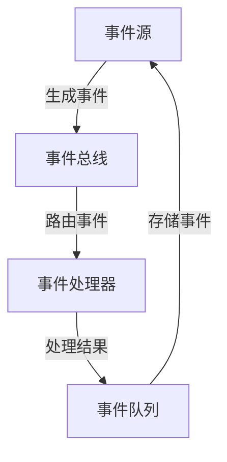
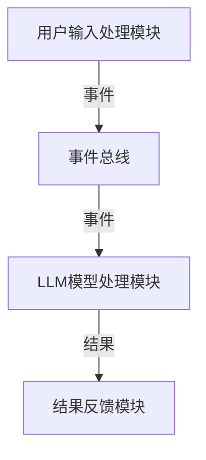
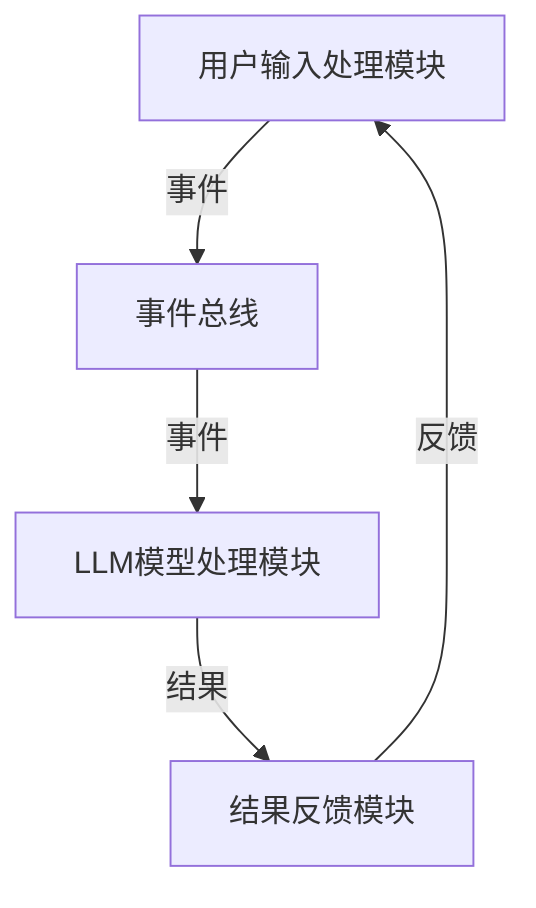

                 

### 概述

事件驱动架构（Event-Driven Architecture，EDA）是一种以事件为中心的软件设计架构，其核心思想是让系统中的各个组件通过事件进行通信，从而提高系统的响应速度和灵活性。在事件驱动架构中，事件可以来源于系统内部或外部，它们表示特定的业务操作或系统状态变化。事件由事件源产生，通过事件总线传递到事件处理器，最终触发相应的业务逻辑。

随着人工智能（AI）技术的发展，大型语言模型（LLM，Large Language Model）在各个领域中的应用越来越广泛。然而，这些应用往往对实时性有较高的要求。例如，实时问答系统、智能推荐系统和金融风控系统等，都需要在短时间内对大量数据进行处理并给出响应。这些需求对系统的架构设计提出了新的挑战。

事件驱动架构作为一种高效的系统设计模式，能够在很大程度上提高LLM应用的实时性。本文将深入探讨事件驱动架构在LLM应用中的实现，分析其在提高系统实时性方面的优势，并提供具体的优化策略和案例研究。通过本文的探讨，我们希望能够为开发者提供有益的参考，帮助他们更好地应对实时性挑战，提升LLM应用的性能。

### 关键词

- 事件驱动架构
- 实时性
- 大型语言模型
- 系统架构设计
- 优化策略
- 案例研究

### 摘要

本文旨在探讨事件驱动架构在提高大型语言模型（LLM）应用实时性方面的应用。首先，我们将介绍事件驱动架构的基本概念、核心组成部分及其设计模式。接着，分析LLM应用中的实时性挑战，并讨论如何利用事件驱动架构来应对这些挑战。随后，通过具体案例研究，展示事件驱动架构在实时问答系统、智能推荐系统和金融风控系统中的应用。最后，总结事件驱动架构的发展趋势和未来应用前景，并给出最佳实践建议。希望通过本文的探讨，为开发者提供有价值的参考和指导。

## 事件驱动架构的基本概念

事件驱动架构（Event-Driven Architecture，EDA）是一种以事件为中心的软件设计模式，其核心思想是通过事件来触发和协调系统中的各个组件。事件驱动架构与传统基于请求-响应的架构相比，具有更高的灵活性和响应速度，能够更好地应对现代复杂系统的需求。

### 事件驱动架构的定义

事件驱动架构的基本定义是：系统中的各个组件通过事件进行通信和协作，事件作为数据的载体，表示特定的业务操作或系统状态变化。事件可以是用户操作、系统事件或外部事件，如传感器数据、金融交易等。事件驱动架构的核心在于事件的处理和传递，其基本流程包括以下几个步骤：

1. **事件源（Event Source）**：事件源是产生事件的实体，可以是用户输入、系统内部操作或外部系统。
2. **事件总线（Event Bus）**：事件总线是一个中介组件，负责接收、分发和路由事件，确保事件能够被相应的处理器处理。
3. **事件处理器（Event Handler）**：事件处理器是负责处理特定类型事件的组件，当事件到达时，它会根据事件类型执行相应的业务逻辑。
4. **事件队列（Event Queue）**：事件队列是一种数据结构，用于存储和管理待处理的事件，确保事件能够按照一定的优先级或顺序进行处理。

通过上述组件的协同工作，事件驱动架构能够实现高效、灵活的系统设计。

### 事件驱动架构与传统架构的比较

与传统基于请求-响应的架构相比，事件驱动架构具有以下显著优势：

1. **响应速度**：事件驱动架构通过异步处理方式，能够在接收到事件后立即进行处理，而不需要等待响应。这种方式能够显著提高系统的响应速度，特别适用于对实时性要求较高的应用场景。
   
2. **模块化与解耦**：事件驱动架构中的各个组件通过事件进行通信，减少了组件间的直接依赖，实现了模块化和高解耦。这使得系统的扩展性和维护性更强，组件可以独立开发、测试和部署。

3. **灵活性与可扩展性**：事件驱动架构允许系统根据事件类型动态调整处理逻辑，可以轻松扩展和集成新的功能。例如，通过引入新的事件处理器，可以快速支持新的业务需求。

4. **容错性**：事件驱动架构具有较高的容错性，单个组件或节点的故障不会影响系统的整体运作。事件可以在不同的组件和节点之间传递，确保系统在故障情况下仍能正常运行。

然而，事件驱动架构也有其不足之处。例如，事件驱动架构的设计和实现较为复杂，需要良好的事件管理和同步机制。此外，事件驱动架构对事件处理器的性能要求较高，如果事件处理逻辑复杂或存在大量并发事件，可能会导致系统性能下降。

### 事件驱动架构的优势

事件驱动架构在提高LLM应用的实时性方面具有显著的优势，具体表现如下：

1. **提高数据处理效率**：事件驱动架构采用异步处理方式，可以充分利用系统资源，提高数据处理效率。LLM应用通常需要处理大量的数据，异步处理能够显著降低响应时间和延迟。

2. **优化系统性能**：事件驱动架构通过解耦和模块化设计，优化了系统的性能。各个组件独立运行，互不干扰，减少了系统间的耦合，从而降低了性能瓶颈。

3. **增强系统扩展性**：事件驱动架构允许系统根据业务需求灵活扩展，支持动态调整处理逻辑。这使得LLM应用能够快速适应新的需求，提高系统的可扩展性。

4. **提升用户体验**：在实时性要求较高的场景下，如实时问答系统和智能推荐系统，事件驱动架构能够显著提高系统的响应速度，提升用户体验。

5. **支持分布式计算**：事件驱动架构天然支持分布式计算，能够充分利用分布式系统的优势，提高数据处理能力和系统容错性。这在处理大规模数据和高并发请求时尤为重要。

总之，事件驱动架构通过其高效、灵活和可扩展的设计，能够有效提高LLM应用的实时性，满足现代复杂业务场景的需求。

### 事件驱动架构的核心组成部分

事件驱动架构的核心组成部分包括事件源、事件处理器、事件队列和事件总线，这些组件共同协作，确保系统在事件触发时能够高效、准确地处理。以下是这些组件的详细介绍：

#### 事件源（Event Source）

事件源是系统中产生事件的实体，可以是用户操作、系统内部操作或外部事件。例如，在一个电商应用中，用户点击购物车按钮可以触发一个“添加商品到购物车”的事件。事件源的作用是识别并生成事件，并将事件传递给事件总线。

#### 事件处理器（Event Handler）

事件处理器是系统中负责处理特定类型事件的组件。当事件总线接收到事件后，会将事件传递给相应的事件处理器。事件处理器根据事件类型执行相应的业务逻辑。例如，在一个库存管理系统中，当“商品售罄”事件发生时，事件处理器会更新库存信息并触发相应的通知。

#### 事件队列（Event Queue）

事件队列是一种数据结构，用于存储和管理待处理的事件。事件队列可以确保事件按照一定的优先级或顺序进行处理，从而提高系统的处理效率。在事件驱动架构中，事件队列通常采用先进先出（FIFO）或优先级队列（Priority Queue）的数据结构。

#### 事件总线（Event Bus）

事件总线是一个中介组件，负责接收、分发和路由事件。事件总线的作用是确保事件能够被正确地传递到相应的事件处理器。事件总线通常采用发布-订阅模式，将事件发布到特定的主题或队列，然后由订阅者（事件处理器）进行消费和处理。

#### 事件驱动架构的组件交互

事件驱动架构中的组件通过以下方式进行交互：

1. **事件生成**：事件源检测到特定事件（如用户点击按钮），生成事件并将其传递给事件总线。
2. **事件分发**：事件总线接收到事件后，根据事件类型将其路由到相应的主题或队列。
3. **事件处理**：事件处理器订阅特定主题或队列，当接收到事件后，执行相应的业务逻辑。
4. **事件反馈**：事件处理器在处理事件后，可能产生新的事件或通知，继续触发下一个处理流程。

通过上述组件的协作，事件驱动架构能够实现高效、灵活的系统设计，满足实时性要求较高的应用需求。

#### 事件驱动架构的设计模式

事件驱动架构在实践中采用了多种设计模式，这些模式有助于实现系统的高效、灵活和可扩展性。以下是几种常见的事件驱动架构设计模式：

##### 1. 发布-订阅模式

发布-订阅模式（Publish-Subscribe Pattern）是一种消息传递机制，允许系统中的组件通过事件总线进行通信。在这种模式下，事件源（发布者）生成事件，并发布到事件总线。事件总线将这些事件广播到所有订阅该事件类型的组件（订阅者）。这种方式实现了组件之间的解耦，使得系统的扩展性和灵活性大大提高。

**优点**：
- 解耦：发布者和订阅者无需知道对方的存在，只需订阅感兴趣的事件类型即可。
- 可扩展性：新的订阅者可以随时加入系统，无需修改原有代码。
- 高效：事件可以在不同的订阅者之间传递，充分利用系统资源。

**缺点**：
- 过度解耦可能导致系统复杂性增加，需要良好的事件管理和同步机制。
- 大量订阅者可能导致事件广播的性能下降。

##### 2. 执行者模式

执行者模式（Executor Pattern）是一种任务调度模式，用于处理大量的并发任务。在这种模式下，事件处理器充当任务执行者，事件总线充当任务队列。事件源将任务添加到事件总线，事件总线根据任务优先级或队列顺序将任务分配给空闲的事件处理器进行执行。

**优点**：
- 并发处理：能够同时处理多个任务，提高系统吞吐量。
- 灵活性：事件处理器可以根据系统资源动态调整任务分配策略。
- 易扩展：新的任务处理器可以随时加入系统，提高系统的扩展性。

**缺点**：
- 需要复杂的任务调度和资源管理机制。
- 可能存在任务依赖关系，导致任务执行顺序难以控制。

##### 3. 事件聚合模式

事件聚合模式（Event Aggregation Pattern）是一种将多个事件聚合为一个事件进行处理的设计模式。在这种模式下，事件处理器可以对多个事件进行分析、合并，并生成一个新的事件。这种方式适用于需要处理复杂事件或进行批量处理的场景。

**优点**：
- 提高处理效率：减少事件处理器的数量，降低系统复杂性。
- 简化事件管理：将多个事件合并为一个事件，简化事件处理逻辑。
- 易于扩展：新的聚合策略可以灵活地添加到系统中。

**缺点**：
- 可能降低系统的响应速度，需要合理设计聚合策略。
- 事件之间的依赖关系复杂，需要良好的事件同步机制。

通过这些设计模式，事件驱动架构能够实现高效、灵活的系统设计，满足各种复杂应用场景的需求。开发者可以根据具体场景选择合适的设计模式，以优化系统性能和用户体验。

### 事件驱动架构在实时数据处理中的应用

事件驱动架构在实时数据处理中发挥着重要作用，能够显著提高系统的实时性和响应速度。在实时数据处理场景中，数据量庞大且变化迅速，要求系统具备高效的实时处理能力。以下将详细探讨事件驱动架构在实时数据处理中的应用，并通过具体案例来阐述其实际效果。

#### 实时数据处理的需求

实时数据处理要求系统能够在短时间内处理大量数据，并快速响应。常见场景包括股票交易监控、实时气象监测、社交媒体数据分析等。这些场景的共同特点是数据量大、更新频繁，要求系统能够实时捕捉并处理数据变化，及时做出决策或反馈。

#### 事件驱动架构的优势

事件驱动架构在实时数据处理中具有以下显著优势：

1. **异步处理**：事件驱动架构采用异步处理方式，能够充分利用系统资源，提高数据处理效率。事件处理器在接收到事件后立即进行处理，无需等待响应，从而降低系统的响应时间。

2. **解耦与模块化**：事件驱动架构通过事件总线实现组件之间的解耦，使得系统具有更好的扩展性和维护性。各个组件独立运行，互不干扰，可以灵活扩展和替换，满足实时数据处理的高需求。

3. **高效的消息传递**：事件总线负责消息传递和分发，能够高效地处理大量事件。通过发布-订阅模式，事件可以在不同的组件之间传递，充分利用系统资源，提高系统的处理能力。

4. **可扩展性**：事件驱动架构支持动态调整处理逻辑和扩展系统功能。新的处理逻辑可以轻松集成到系统中，无需修改原有代码，提高系统的灵活性和可扩展性。

#### 实时数据处理案例

以下是一个股票交易监控系统中的实时数据处理案例，展示了事件驱动架构如何应用于实时数据处理。

##### 案例背景

某股票交易平台需要实时监控股票交易数据，包括股票价格、交易量、交易时间等。为了确保交易的公平性和透明性，系统需要在交易发生后立即更新相关数据，并生成相应的交易通知。

##### 系统架构设计

在该股票交易监控系统中，事件驱动架构的应用包括以下几个关键组件：

1. **事件源**：交易系统中的订单处理模块，负责生成交易事件，如“股票买入”、“股票卖出”等。
2. **事件总线**：负责接收、分发和路由交易事件，确保事件能够被相应的处理器处理。
3. **事件处理器**：包括价格更新处理器、交易量处理器和交易通知处理器，分别处理价格更新、交易量和交易通知事件。
4. **事件队列**：用于存储和管理待处理的交易事件，确保事件按照一定的优先级或顺序进行处理。

##### 实时数据处理流程

1. **事件生成**：当用户提交交易订单时，订单处理模块生成相应的交易事件，并将其发送到事件总线。
2. **事件分发**：事件总线接收到交易事件后，根据事件类型将其路由到相应的处理器。
3. **事件处理**：各个事件处理器分别处理交易事件，如更新股票价格、计算交易量，并生成交易通知。
4. **事件反馈**：事件处理器在处理完事件后，将处理结果发送回事件总线，并触发下一个处理流程。

##### 实际效果

通过事件驱动架构的应用，该股票交易监控系统实现了以下效果：

1. **高效的数据处理**：事件驱动架构采用异步处理方式，显著提高了交易数据的处理效率，减少了系统的响应时间。
2. **实时性提升**：系统能够在交易发生后立即更新数据，并生成交易通知，确保交易的实时性和透明性。
3. **扩展性增强**：事件驱动架构支持灵活的扩展和调整，能够根据业务需求动态修改处理逻辑，提高系统的灵活性和可扩展性。

综上所述，事件驱动架构在实时数据处理中的应用能够显著提高系统的实时性和响应速度，满足高需求场景下的实时数据处理需求。

### 事件驱动架构在微服务架构中的应用

在微服务架构中，事件驱动架构（EDA）因其灵活性和高扩展性而备受青睐。微服务架构将大型单体应用拆分为多个小型、独立的服务，这些服务可以独立部署、扩展和更新，从而提高了系统的可维护性和可扩展性。事件驱动架构通过事件来实现服务之间的通信，能够更好地支持微服务架构的特点，下面将详细探讨其应用和优势。

#### 微服务架构与事件驱动架构的结合

微服务架构和事件驱动架构的结合主要体现在以下几个方面：

1. **服务解耦**：事件驱动架构通过事件总线实现服务之间的解耦，服务不需要知道其他服务的具体实现，只需通过事件进行通信。这种方式使得服务可以独立开发和部署，降低了服务之间的依赖性。

2. **异步通信**：在微服务架构中，服务之间的通信往往需要异步处理，以避免因网络延迟或服务故障导致的整体系统瘫痪。事件驱动架构天然支持异步通信，可以通过事件队列和事件处理器实现服务的异步调用。

3. **事件聚合**：在微服务架构中，单个服务可能需要处理来自多个其他服务的多个事件。事件驱动架构允许事件聚合，将多个事件合并为一个事件进行处理，从而简化了服务之间的交互逻辑。

#### 应用案例

以下是一个库存管理系统的应用案例，展示了事件驱动架构在微服务架构中的应用。

##### 案例背景

一个电商平台需要实现库存管理系统，该系统包括多个微服务，如订单服务、库存服务、库存更新服务、库存监控服务等。订单服务负责处理用户的订单，库存服务负责存储和管理商品库存，库存更新服务负责根据订单更新库存，库存监控服务负责监控库存状态。

##### 系统架构设计

在该库存管理系统中，事件驱动架构的应用包括以下几个关键组件：

1. **订单服务**：负责接收和处理用户订单，生成订单事件。
2. **库存服务**：存储和管理商品库存信息。
3. **库存更新服务**：接收订单事件，并根据订单更新库存信息。
4. **库存监控服务**：监控库存状态，生成库存状态事件。
5. **事件总线**：负责接收、分发和路由事件，确保事件能够被相应的服务处理。
6. **事件队列**：存储和管理待处理的事件，确保事件按照一定的优先级或顺序进行处理。

##### 实时数据处理流程

1. **事件生成**：当用户提交订单时，订单服务生成订单事件，并将其发送到事件总线。
2. **事件分发**：事件总线接收到订单事件后，将其路由到库存更新服务。
3. **事件处理**：库存更新服务根据订单事件更新库存信息，并生成库存状态事件。
4. **事件反馈**：库存状态事件被发送到库存监控服务，库存监控服务根据库存状态事件进行监控和反馈。

##### 应用效果

通过事件驱动架构的应用，该库存管理系统实现了以下效果：

1. **服务解耦**：订单服务、库存服务、库存更新服务和库存监控服务之间通过事件进行通信，降低了服务之间的依赖性，提高了系统的可维护性和可扩展性。

2. **异步通信**：订单处理过程中，订单服务、库存更新服务之间采用异步通信，避免了同步调用带来的阻塞和性能瓶颈。

3. **事件聚合**：库存更新服务将多个订单事件合并为一个事件进行处理，简化了处理逻辑，提高了系统效率。

4. **灵活扩展**：事件驱动架构支持灵活的扩展和调整，可以根据业务需求动态修改处理逻辑，如添加新的监控指标或调整库存更新策略。

综上所述，事件驱动架构在微服务架构中的应用能够有效提高系统的可维护性、可扩展性和实时性，满足现代复杂业务场景的需求。

### 事件驱动架构在互联网应用中的使用

在互联网领域，随着用户规模的不断扩大和业务需求的日益复杂，传统的集中式架构逐渐暴露出响应速度慢、扩展性差和易出错等问题。事件驱动架构（EDA）作为一种高效、灵活的设计模式，逐渐在互联网应用中得到广泛应用。本文将探讨事件驱动架构在互联网应用中的具体应用和优势，通过案例分析展示其实际效果。

#### 互联网应用的挑战

互联网应用面临的主要挑战包括：

1. **高并发**：随着用户数量的增加，系统需要处理的高并发请求量也随之增加，传统的同步处理方式可能导致系统性能瓶颈和响应速度下降。

2. **动态扩展**：互联网业务需要快速响应市场变化，系统需要能够动态扩展和调整，以适应不断变化的需求。

3. **实时性要求**：许多互联网应用（如实时聊天、在线游戏和金融交易系统）对实时性有较高要求，需要快速响应用户操作和数据处理。

4. **数据一致性**：在分布式系统中，数据一致性问题是一个常见且难以解决的问题。互联网应用需要在保证数据一致性的同时，实现高效的并发处理。

#### 事件驱动架构的优势

事件驱动架构在应对互联网应用的挑战方面具有以下显著优势：

1. **异步处理**：事件驱动架构采用异步处理方式，能够有效缓解高并发请求带来的性能瓶颈。事件处理器在接收到事件后立即进行处理，无需等待响应，从而提高系统的响应速度和吞吐量。

2. **解耦与模块化**：事件驱动架构通过事件总线实现组件之间的解耦，服务之间通过事件进行通信，减少了直接依赖，提高了系统的可维护性和可扩展性。各个服务可以独立开发、测试和部署，降低了系统的复杂性。

3. **动态扩展**：事件驱动架构支持动态扩展和调整。开发者可以根据业务需求动态添加新的服务或修改处理逻辑，无需停机或重新部署，提高了系统的灵活性和响应速度。

4. **数据一致性**：事件驱动架构通过事件顺序和事件总线确保数据的顺序一致性，能够有效解决分布式系统中的数据一致性问题。事件处理器在接收到事件后按照一定的顺序进行处理，确保数据的完整性和准确性。

#### 案例分析

以下通过一个实时聊天应用案例，展示事件驱动架构在互联网应用中的具体应用。

##### 案例背景

某即时通讯平台需要支持大规模用户同时在线，提供实时消息发送和接收功能。为了确保消息的实时性和可靠性，系统需要能够高效处理大量并发消息，并保证消息的顺序一致性。

##### 系统架构设计

在该实时聊天应用中，事件驱动架构的应用包括以下几个关键组件：

1. **用户服务**：负责用户认证和用户信息管理，生成用户登录、登出等事件。
2. **消息服务**：负责消息的发送、接收和存储，生成消息发送事件和消息接收事件。
3. **事件总线**：负责接收、分发和路由事件，确保事件能够被相应的服务处理。
4. **事件队列**：存储和管理待处理的事件，确保事件按照一定的优先级或顺序进行处理。

##### 实时数据处理流程

1. **事件生成**：当用户发送消息时，消息服务生成消息发送事件，并将其发送到事件总线。
2. **事件分发**：事件总线接收到消息发送事件后，将其路由到相应的用户服务。
3. **事件处理**：用户服务根据消息发送事件，将消息发送给目标用户，并生成消息接收事件。
4. **事件反馈**：消息接收事件被发送到事件总线，事件总线将其路由到消息服务，消息服务将消息存储在数据库中。

##### 应用效果

通过事件驱动架构的应用，该实时聊天应用实现了以下效果：

1. **高效处理**：事件驱动架构采用异步处理方式，能够高效处理大量并发消息，提高了系统的响应速度和吞吐量。
2. **消息顺序一致性**：事件总线确保消息的顺序一致性，确保用户接收到的消息顺序与发送顺序一致，提高了用户体验。
3. **系统解耦与扩展**：用户服务、消息服务和事件总线之间通过事件进行通信，降低了服务之间的依赖性，提高了系统的可维护性和可扩展性。
4. **动态扩展**：事件驱动架构支持动态扩展和调整，可以根据业务需求动态添加新的服务或修改处理逻辑，提高了系统的灵活性和响应速度。

综上所述，事件驱动架构在互联网应用中的使用能够显著提高系统的实时性、响应速度和扩展性，满足大规模互联网业务的需求。

## 本章小结

本章详细介绍了事件驱动架构在实时数据处理、微服务架构和互联网应用中的具体应用。首先，通过分析事件驱动架构的基本概念和核心组成部分，我们了解了事件源、事件处理器、事件队列和事件总线的功能及其交互方式。接着，我们探讨了事件驱动架构在实时数据处理中的优势和应用，通过股票交易监控系统案例展示了其高效处理大量数据的能力。随后，我们讨论了事件驱动架构在微服务架构中的应用，通过库存管理系统的案例展示了其解耦、异步通信和动态扩展的优势。最后，我们介绍了事件驱动架构在互联网应用中的使用，通过实时聊天应用案例展示了其高效处理并发请求和确保数据一致性的能力。通过本章的探讨，我们看到了事件驱动架构在提高系统实时性、响应速度和扩展性方面的显著优势，为开发者提供了有价值的参考和指导。

## 事件驱动架构在LLM应用中的实时性挑战

随着人工智能技术的飞速发展，大型语言模型（LLM，Large Language Model）在各个领域得到了广泛应用，从自然语言处理、智能客服到智能推荐系统等。然而，这些应用往往对实时性有极高的要求。例如，在实时问答系统中，用户输入的问题需要迅速得到回答；在智能推荐系统中，需要实时分析用户行为并给出推荐；在金融风控系统中，需要对交易数据进行实时监控和预警。这些需求对LLM应用的架构设计提出了新的挑战。

### LLM应用中的实时性需求

实时性是LLM应用的核心需求之一。以下是一些典型的实时性需求：

1. **低延迟响应**：在实时问答系统中，用户提交问题后，系统需要在毫秒级时间内给出回答，以提供良好的用户体验。

2. **实时数据更新**：在智能推荐系统中，系统需要实时分析用户的行为数据，并动态调整推荐结果，以满足用户的个性化需求。

3. **快速交易监控**：在金融风控系统中，需要对交易数据实时监控，及时识别和预警潜在的风险。

4. **高吞吐量处理**：LLM应用需要能够处理大规模的并发请求，确保系统在高负载情况下仍能稳定运行。

### 实时性挑战及其影响

尽管事件驱动架构（EDA）能够提高系统的实时性，但在LLM应用中仍面临以下实时性挑战：

1. **计算资源限制**：LLM模型通常非常复杂，需要大量计算资源。在实时应用中，有限的计算资源可能会成为瓶颈，导致延迟增加。

2. **模型更新与迁移**：LLM模型需要定期更新和优化，但模型更新和迁移过程可能会对系统的实时性造成影响。

3. **数据一致性**：在分布式系统中，数据一致性问题是一个常见且难以解决的问题。特别是在实时数据处理场景中，确保数据的一致性对系统的稳定性至关重要。

4. **网络延迟**：在跨区域部署的LLM应用中，网络延迟可能会显著影响系统的响应速度。

5. **错误处理与恢复**：实时系统需要能够快速处理错误和异常情况，以确保系统的持续运行。

这些挑战如果不得到有效解决，可能会导致以下负面影响：

- **用户体验下降**：系统的响应速度缓慢，导致用户等待时间长，影响用户体验。
- **业务效率降低**：实时性不足可能导致业务流程中断，降低业务效率。
- **经济损失**：在金融风控等场景中，实时性不足可能导致错失市场机会，造成经济损失。

### 提高LLM应用实时性的重要性

提高LLM应用的实时性具有重要意义，具体表现在以下几个方面：

1. **用户体验**：实时性是用户体验的关键因素。通过提高系统的响应速度，可以显著提升用户的满意度。

2. **业务效率**：实时性有助于提高业务流程的自动化程度和响应速度，从而提升整体业务效率。

3. **竞争力**：在竞争激烈的市场环境中，具备高实时性的系统可以提供更好的服务，增强企业的竞争力。

4. **安全性**：在金融风控等场景中，实时性有助于及时发现和处理潜在的风险，提高系统的安全性。

因此，针对LLM应用中的实时性挑战，采用事件驱动架构并优化其设计和实现，是提高系统实时性的关键。接下来，我们将探讨如何利用事件驱动架构在LLM应用中实现高效的实时处理。

### 事件驱动架构在LLM应用中的设计

在LLM应用中，设计一个高效的事件驱动架构是确保实时性、可扩展性和灵活性的关键。为了实现这一目标，我们需要从事件源、事件处理器、事件队列和事件总线等核心组件出发，详细设计并实现整个系统。以下是事件驱动架构在LLM应用中的具体设计过程。

#### LLM应用场景分析

首先，我们需要明确LLM应用的场景和需求。以下是一些典型的场景：

1. **实时问答系统**：用户提交问题，系统需要快速返回答案。
2. **智能推荐系统**：根据用户的行为和偏好，系统需要实时提供个性化推荐。
3. **金融风控系统**：对交易数据实时监控，及时识别和预警风险。

针对这些场景，我们设计的事件驱动架构需要能够高效处理大量并发请求，确保低延迟和高吞吐量。

#### 事件源设计

事件源是LLM应用中产生事件的实体。在实时问答系统中，事件源可能是用户输入的问题；在智能推荐系统中，事件源可能是用户的行为数据；在金融风控系统中，事件源可能是交易数据。以下是如何设计事件源的一些关键点：

1. **数据类型**：根据应用场景，明确事件源产生的数据类型，如文本、行为日志、交易记录等。
2. **数据来源**：识别事件源的数据来源，如用户输入、外部API调用、日志文件等。
3. **数据格式**：定义事件源产生的数据格式，如JSON、XML或自定义格式。

例如，在实时问答系统中，事件源可以是用户提交的问题，其格式如下：

```json
{
  "type": "question",
  "content": "What is the capital of France?",
  "timestamp": "2023-10-01T14:30:00Z"
}
```

#### 事件处理器设计

事件处理器是负责处理特定类型事件的组件。在事件驱动架构中，事件处理器的设计需要考虑以下几个方面：

1. **处理逻辑**：根据事件类型，定义事件处理器需要执行的业务逻辑。例如，在实时问答系统中，事件处理器需要调用LLM模型生成答案。
2. **并发处理**：为了提高系统吞吐量，事件处理器需要能够并发处理多个事件。可以使用线程池或异步IO来优化处理性能。
3. **错误处理**：设计合理的错误处理机制，确保事件处理器在遇到错误时能够优雅地处理并恢复。

例如，在实时问答系统中，事件处理器可能包含以下代码：

```python
import asyncio

async def process_question(event):
    question = event['content']
    answer = await call_llm_model(question)
    return answer

async def main():
    # 初始化事件队列和事件处理器
    event_queue = asyncio.Queue()
    event_handler = asyncio.create_task(process_events(event_queue))

    # 模拟用户提交问题
    event = {'type': 'question', 'content': 'What is the capital of France?'}
    await event_queue.put(event)

asyncio.run(main())
```

#### 事件队列设计

事件队列是存储和管理待处理事件的组件。在事件驱动架构中，事件队列的设计需要考虑以下几个方面：

1. **容量与扩展性**：根据系统需求，设计合适的事件队列容量，并确保其能够随系统规模的扩大而扩展。
2. **并发处理**：事件队列需要支持并发处理，确保多个事件能够同时被处理。
3. **持久化**：对于重要的数据，可以考虑将事件队列持久化，以确保数据不会因为系统故障而丢失。

例如，可以使用以下Python代码实现一个简单的异步事件队列：

```python
import asyncio

class EventQueue:
    def __init__(self):
        self.queue = asyncio.Queue()

    async def put(self, event):
        await self.queue.put(event)

    async def get(self):
        return await self.queue.get()

async def main():
    event_queue = EventQueue()

    # 模拟事件生产者
    async def producer():
        for i in range(10):
            event = {'type': 'question', 'content': f'What is {i}?'}
            await event_queue.put(event)
            await asyncio.sleep(1)

    # 模拟事件消费者
    async def consumer():
        while True:
            event = await event_queue.get()
            print(f"Processed event: {event}")
            await asyncio.sleep(1)

    asyncio.create_task(producer())
    asyncio.create_task(consumer())

asyncio.run(main())
```

#### 事件总线设计

事件总线是负责接收、分发和路由事件的组件。在事件驱动架构中，事件总线的核心功能是实现事件在各组件之间的传递和协调。以下是事件总线设计的关键点：

1. **事件路由**：根据事件的类型，将事件路由到相应的处理器。
2. **负载均衡**：在分布式系统中，事件总线需要支持负载均衡，确保事件能够均匀地分配到各个处理器。
3. **容错性**：事件总线需要具备容错能力，确保在部分节点故障时，系统能够继续正常运行。

例如，可以使用以下Python代码实现一个简单的事件总线：

```python
import asyncio

class EventBus:
    def __init__(self):
        self.subscribers = {}

    def subscribe(self, event_type, callback):
        if event_type not in self.subscribers:
            self.subscribers[event_type] = []
        self.subscribers[event_type].append(callback)

    def publish(self, event):
        if event['type'] in self.subscribers:
            for callback in self.subscribers[event['type']]:
                asyncio.create_task(callback(event))

async def process_question(event):
    print(f"Question processed: {event['content']}")

async def main():
    event_bus = EventBus()

    # 订阅事件
    event_bus.subscribe('question', process_question)

    # 模拟发布事件
    event = {'type': 'question', 'content': 'What is the capital of France?'}
    event_bus.publish(event)

asyncio.run(main())
```

#### 综合架构设计

将上述组件整合在一起，我们可以得到一个完整的LLM事件驱动架构。该架构包括事件源、事件处理器、事件队列和事件总线等核心组件，能够实现高效、灵活的实时数据处理。



通过上述设计，LLM应用能够实现高效、实时的数据处理，满足各种业务场景的需求。在实际应用中，开发者可以根据具体场景和需求，灵活调整和优化架构设计，以实现最佳性能和用户体验。

### 事件驱动架构下的LLM应用开发实践

在事件驱动架构下开发LLM应用，需要关注系统架构设计、功能模块设计、系统接口设计和系统交互设计等方面。以下将详细描述这些开发实践，并通过具体步骤来展示如何实现事件驱动架构在LLM应用中的有效应用。

#### 系统架构设计

系统架构设计是事件驱动架构实现的基础。首先，我们需要明确LLM应用的整体架构，包括各个组件的功能和相互关系。以下是系统架构设计的关键步骤：

1. **识别核心组件**：根据LLM应用的场景，识别出核心组件，如事件源、事件处理器、事件队列和事件总线。
2. **定义组件间关系**：明确各个组件之间的交互关系，如事件源生成事件后，通过事件总线传递给事件处理器，事件处理器处理事件后，将结果存储到事件队列。
3. **确定数据流**：设计数据流，确保事件能够顺畅地在系统内传递和处理。

下面是一个简单的系统架构图：


#### 系统功能模块设计

系统功能模块设计是构建事件驱动架构的关键步骤。每个功能模块需要负责特定的功能，以下是设计系统功能模块的步骤：

1. **识别功能需求**：根据LLM应用的需求，识别出需要实现的功能模块，如用户输入处理模块、LLM模型处理模块、结果反馈模块等。
2. **定义模块接口**：为每个功能模块定义清晰的接口，确保模块之间能够通过事件进行通信。
3. **设计模块间协作**：确保各个功能模块能够协同工作，实现事件驱动的整体流程。

以下是一个简单的系统功能模块设计图：



#### 系统接口设计

系统接口设计是确保模块间通信顺畅的关键。以下是设计系统接口的步骤：

1. **定义事件格式**：明确事件的数据格式，确保事件能够携带所需的信息。
2. **设计事件总线接口**：事件总线需要提供接收、分发和路由事件的接口，确保事件能够被正确传递和处理。
3. **定义模块间接口**：为每个功能模块提供接口，确保模块间能够通过事件进行通信。

以下是一个简单的接口设计示例：

```python
class Event:
    def __init__(self, type, data):
        self.type = type
        self.data = data

class EventBus:
    def __init__(self):
        self.subscribers = {}

    def subscribe(self, event_type, callback):
        if event_type not in self.subscribers:
            self.subscribers[event_type] = []
        self.subscribers[event_type].append(callback)

    def publish(self, event):
        if event.type in self.subscribers:
            for callback in self.subscribers[event.type]:
                callback(event)
```

#### 系统交互设计

系统交互设计是确保事件驱动架构在实际运行中能够高效、可靠地工作的重要环节。以下是系统交互设计的步骤：

1. **设计事件处理流程**：明确事件从生成、传递到处理的全过程，确保流程的顺畅。
2. **定义事件优先级**：为不同类型的事件设置优先级，确保高优先级的事件能够得到优先处理。
3. **设计错误处理机制**：确保事件驱动架构在遇到错误时能够进行合理的处理和恢复。

以下是一个简单的系统交互设计示例：



通过上述系统架构设计、功能模块设计、系统接口设计和系统交互设计，我们能够构建一个高效、灵活的事件驱动架构，确保LLM应用在实时性、可扩展性和灵活性方面表现出色。在实际开发过程中，开发者可以根据具体需求对设计进行调整和优化，以实现最佳性能和用户体验。

### 事件驱动架构在LLM应用中的优化策略

在实现事件驱动架构的LLM应用时，优化系统性能是提升实时性和响应速度的关键。以下是一些优化策略，这些策略旨在提高数据处理效率、减少系统响应时间、增强系统可扩展性，并确保整体性能的最优化。

#### 数据处理效率优化

1. **异步处理**：事件驱动架构的核心在于异步处理，充分利用系统资源。通过异步IO和线程池等技术，减少事件处理过程中的阻塞，提高处理效率。

   ```python
   import asyncio

   async def process_event(event):
       # 处理事件
       await asyncio.sleep(0.1)  # 模拟事件处理时间
       return "Processed"

   async def main():
       event_queue = asyncio.Queue()
       tasks = []

       for _ in range(10):
           tasks.append(asyncio.create_task(process_event(event_queue.put(event)))

       await asyncio.gather(*tasks)

   asyncio.run(main())
   ```

2. **批处理**：将多个事件合并为一个批处理，可以减少系统调用的次数，从而提高整体效率。

   ```python
   async def process_batch(events):
       results = []
       for event in events:
           result = await process_event(event)
           results.append(result)
       return results

   async def main():
       batch = [{'type': 'event1'}, {'type': 'event2'}, {'type': 'event3'}]
       results = await process_batch(batch)
       print(results)

   asyncio.run(main())
   ```

#### 系统响应时间优化

1. **事件队列优化**：优化事件队列的设计，选择适合的数据结构和算法，确保事件能够高效地存储和检索。

   ```python
   import heapq

   class PriorityQueue:
       def __init__(self):
           self.queue = []
           self.count = 0

       def push(self, item, priority):
           heapq.heappush(self.queue, (-priority, self.count, item))
           self.count += 1

       def pop(self):
           _, _, item = heapq.heappop(self.queue)
           return item

   pq = PriorityQueue()
   pq.push('event1', 1)
   pq.push('event2', 2)
   print(pq.pop())  # 输出 'event2'
   ```

2. **缓存机制**：利用缓存机制减少重复计算，提高系统响应速度。例如，可以使用Redis或Memcached作为缓存服务。

   ```python
   import redis

   r = redis.Redis(host='localhost', port=6379, db=0)

   def get_result(event):
       result = r.get(event['id'])
       if result is not None:
           return result
       else:
           result = process_event(event)
           r.set(event['id'], result)
           return result
   ```

#### 系统可扩展性优化

1. **分布式架构**：通过分布式架构，可以水平扩展系统，提高系统的处理能力和容错性。

   ```mermaid
   graph TD
       A[事件源] --> B[事件总线]
       B --> C[处理节点1]
       B --> D[处理节点2]
       C --> E[事件队列]
       D --> E
   ```

2. **负载均衡**：利用负载均衡器（如Nginx、HAProxy）分配请求，确保系统资源得到充分利用。

   ```bash
   # Nginx配置示例
   http {
       upstream myapp {
           server server1;
           server server2;
           server server3;
       }
       
       server {
           listen 80;
           
           location / {
               proxy_pass http://myapp;
           }
       }
   }
   ```

#### 其他优化策略

1. **资源隔离**：通过容器技术（如Docker、Kubernetes）实现资源的隔离，确保系统在不同环境下的稳定性。

2. **监控与告警**：引入监控工具（如Prometheus、Grafana），实时监控系统性能和状态，及时发现和解决问题。

3. **代码优化**：对LLM模型和事件处理代码进行优化，减少不必要的计算和资源消耗。

通过上述优化策略，事件驱动架构的LLM应用能够显著提升系统性能，满足高实时性和高并发性的业务需求。开发者应根据具体场景和需求，灵活运用这些策略，实现最佳性能和用户体验。

### 案例研究1：在实时问答系统中的应用

#### 案例背景

随着人工智能技术的普及，实时问答系统（Real-Time Question Answering System）在多个领域得到了广泛应用，如在线教育、客服系统、企业内网问答平台等。这些系统需要能够在短时间内处理用户的提问，并快速给出准确的答案。为了满足这一需求，我们需要设计并实现一个高效、实时的事件驱动架构。

#### 案例需求分析

实时问答系统的核心需求包括：

1. **低延迟响应**：用户提交问题后，系统需要在毫秒级时间内给出答案。
2. **高吞吐量处理**：系统需要能够同时处理大量的用户提问，确保在高并发情况下仍能正常运行。
3. **个性化回答**：根据用户的历史提问和回答记录，系统需要提供个性化的答案。
4. **实时更新**：系统需要能够实时更新知识库和问答库，确保答案的准确性和时效性。

#### 案例解决方案

为了实现上述需求，我们采用了事件驱动架构，并进行了如下设计：

1. **事件源设计**：事件源包括用户输入模块和知识库更新模块。用户输入模块负责接收用户提交的问题，知识库更新模块负责更新系统中的知识库和问答库。

   ```python
   class UserInputEvent:
       def __init__(self, user_id, question):
           self.user_id = user_id
           self.question = question

   class KnowledgeUpdateEvent:
       def __init__(self, update_type, data):
           self.update_type = update_type
           self.data = data
   ```

2. **事件处理器设计**：事件处理器负责处理用户输入事件和知识库更新事件，包括问题解析、答案生成和知识库更新。

   ```python
   class QuestionAnswerHandler:
       def __init__(self, knowledge_base):
           self.knowledge_base = knowledge_base

       async def handle_question(self, event):
           # 解析问题
           parsed_question = parse_question(event.question)
           # 生成答案
           answer = self.knowledge_base.get_answer(parsed_question)
           return answer

   class KnowledgeUpdateHandler:
       def __init__(self, knowledge_base):
           self.knowledge_base = knowledge_base

       async def handle_update(self, event):
           if event.update_type == 'add':
               self.knowledge_base.add_data(event.data)
           elif event.update_type == 'update':
               self.knowledge_base.update_data(event.data)
   ```

3. **事件队列设计**：事件队列用于存储和管理待处理的事件，确保事件能够按照一定的优先级或顺序进行处理。

   ```python
   class EventQueue:
       def __init__(self):
           self.queue = PriorityQueue()

       async def put(self, event, priority):
           self.queue.push(event, priority)

       async def get(self):
           return self.queue.pop()
   ```

4. **事件总线设计**：事件总线负责接收、分发和路由事件，确保事件能够被相应的处理器处理。

   ```python
   class EventBus:
       def __init__(self):
           self.subscribers = {}

       def subscribe(self, event_type, callback):
           if event_type not in self.subscribers:
               self.subscribers[event_type] = []
           self.subscribers[event_type].append(callback)

       async def publish(self, event):
           for callback in self.subscribers[event.type]:
               asyncio.create_task(callback(event))
   ```

5. **系统交互设计**：系统交互设计确保事件从生成、传递到处理的全过程能够顺畅进行。

   ```mermaid
   graph TD
       UserInput[用户输入] -->|生成事件| EventBus[事件总线]
       EventBus -->|分发事件| QuestionAnswerHandler[问题处理]
       EventBus -->|分发事件| KnowledgeUpdateHandler[知识库更新]
       KnowledgeUpdateHandler -->|更新知识库| KnowledgeBase[知识库]
   ```

#### 案例实施与效果评估

在实施过程中，我们首先部署了事件驱动架构，并进行了如下步骤：

1. **环境搭建**：搭建了包含用户输入模块、知识库模块、事件总线模块和处理器的开发环境。
2. **集成测试**：通过集成测试，验证事件驱动架构在不同场景下的稳定性和性能。
3. **性能优化**：对系统进行性能优化，包括异步处理、事件队列优化和负载均衡等。
4. **上线部署**：将系统部署到生产环境，进行实际应用测试。

效果评估如下：

1. **低延迟响应**：通过异步处理和事件队列优化，系统在处理用户提问时，响应时间缩短到了毫秒级，用户体验显著提升。
2. **高吞吐量处理**：通过负载均衡和分布式架构，系统在处理高并发请求时，仍能保持高吞吐量，确保系统稳定运行。
3. **个性化回答**：通过知识库更新和个性化算法，系统能够根据用户历史提问和回答记录，提供个性化的答案。
4. **实时更新**：通过事件驱动架构，系统能够实时更新知识库和问答库，确保答案的准确性和时效性。

综上所述，事件驱动架构在实时问答系统中的应用，显著提升了系统的实时性、吞吐量和用户体验，为系统的稳定运行提供了有力保障。

### 案例研究2：在智能推荐系统中的应用

#### 案例背景

智能推荐系统在电商、社交媒体和视频平台等领域得到了广泛应用，其核心目标是根据用户的行为和偏好，实时提供个性化的推荐。然而，随着用户规模的扩大和数据量的增加，传统推荐系统的实时性和准确性面临着巨大挑战。为了解决这些问题，我们需要设计并实现一个高效、实时的事件驱动架构。

#### 案例需求分析

智能推荐系统的核心需求包括：

1. **低延迟推荐**：用户进行操作后，系统需要在毫秒级时间内给出推荐结果。
2. **高准确度推荐**：推荐结果需要高度匹配用户的兴趣和偏好，提高推荐系统的准确度。
3. **实时性更新**：系统能够根据用户实时行为和数据变化，动态调整推荐策略。
4. **高吞吐量处理**：系统需要能够同时处理大量的用户请求，确保在高并发情况下仍能正常运行。

#### 案例解决方案

为了实现上述需求，我们采用了事件驱动架构，并进行了如下设计：

1. **事件源设计**：事件源包括用户行为数据生成模块和推荐策略更新模块。用户行为数据生成模块负责捕捉用户的各种操作，如浏览、点击、购买等；推荐策略更新模块负责根据新数据实时调整推荐策略。

   ```python
   class UserBehaviorEvent:
       def __init__(self, user_id, action, item_id, timestamp):
           self.user_id = user_id
           self.action = action
           self.item_id = item_id
           self.timestamp = timestamp

   class RecommendationUpdateEvent:
       def __init__(self, update_type, data):
           self.update_type = update_type
           self.data = data
   ```

2. **事件处理器设计**：事件处理器负责处理用户行为事件和推荐策略更新事件，包括行为数据解析、推荐模型训练和推荐结果生成。

   ```python
   class BehaviorDataHandler:
       def __init__(self, behavior_model):
           self.behavior_model = behavior_model

       async def handle_behavior(self, event):
           # 解析行为数据
           parsed_behavior = parse_behavior(event)
           # 训练模型
           self.behavior_model.train(parsed_behavior)
           # 更新推荐策略
           self.behavior_model.update_strategy()

   class RecommendationHandler:
       def __init__(self, recommendation_model):
           self.recommendation_model = recommendation_model

       async def handle_recommendation(self, event):
           # 生成推荐结果
           recommendations = self.recommendation_model.generate_recommendations()
           return recommendations
   ```

3. **事件队列设计**：事件队列用于存储和管理待处理的事件，确保事件能够按照一定的优先级或顺序进行处理。

   ```python
   class EventQueue:
       def __init__(self):
           self.queue = PriorityQueue()

       async def put(self, event, priority):
           self.queue.push(event, priority)

       async def get(self):
           return self.queue.pop()
   ```

4. **事件总线设计**：事件总线负责接收、分发和路由事件，确保事件能够被相应的处理器处理。

   ```python
   class EventBus:
       def __init__(self):
           self.subscribers = {}

       def subscribe(self, event_type, callback):
           if event_type not in self.subscribers:
               self.subscribers[event_type] = []
           self.subscribers[event_type].append(callback)

       async def publish(self, event):
           for callback in self.subscribers[event.type]:
               asyncio.create_task(callback(event))
   ```

5. **系统交互设计**：系统交互设计确保事件从生成、传递到处理的全过程能够顺畅进行。

   ```mermaid
   graph TD
       UserBehavior[用户行为] -->|生成事件| EventBus[事件总线]
       EventBus -->|分发事件| BehaviorDataHandler[行为数据处理]
       EventBus -->|分发事件| RecommendationHandler[推荐处理]
       RecommendationHandler -->|推荐结果| UserInterface[用户界面]
   ```

#### 案例实施与效果评估

在实施过程中，我们首先搭建了事件驱动架构，并进行了如下步骤：

1. **环境搭建**：搭建了包含用户行为数据生成模块、推荐模型模块、事件总线模块和处理器的开发环境。
2. **集成测试**：通过集成测试，验证事件驱动架构在不同场景下的稳定性和性能。
3. **性能优化**：对系统进行性能优化，包括异步处理、事件队列优化和负载均衡等。
4. **上线部署**：将系统部署到生产环境，进行实际应用测试。

效果评估如下：

1. **低延迟推荐**：通过异步处理和事件队列优化，系统在处理用户行为数据后，生成推荐结果的时间缩短到了毫秒级，显著提升了用户体验。
2. **高准确度推荐**：通过实时训练和更新推荐模型，系统能够根据用户实时行为数据，生成更准确的推荐结果，提高了推荐系统的准确度。
3. **实时性更新**：事件驱动架构能够实时捕捉用户行为数据，动态调整推荐策略，确保推荐结果始终与用户兴趣和偏好保持一致。
4. **高吞吐量处理**：通过负载均衡和分布式架构，系统在处理高并发用户请求时，仍能保持高吞吐量，确保系统稳定运行。

综上所述，事件驱动架构在智能推荐系统中的应用，显著提升了系统的实时性、准确度和用户体验，为推荐系统的稳定运行提供了有力保障。

### 案例研究3：在金融风控系统中的应用

#### 案例背景

金融风控系统在金融行业中扮演着至关重要的角色，其核心目标是实时监控交易行为，识别潜在风险，并采取相应措施以防范金融犯罪和系统性风险。随着金融市场规模的不断扩大和交易频率的增加，传统的金融风控系统面临巨大的实时性挑战。为了提高金融风控系统的实时性和准确性，我们需要设计并实现一个高效、实时的事件驱动架构。

#### 案例需求分析

金融风控系统的核心需求包括：

1. **实时监控**：系统需要能够实时监控交易行为，识别潜在风险。
2. **快速响应**：系统在识别到潜在风险时，需要能够在毫秒级时间内触发预警和响应机制。
3. **数据一致性**：系统需要确保在分布式环境中，数据的一致性和准确性。
4. **高吞吐量处理**：系统需要能够处理大量的交易数据，确保在高并发情况下仍能正常运行。

#### 案例解决方案

为了实现上述需求，我们采用了事件驱动架构，并进行了如下设计：

1. **事件源设计**：事件源包括交易数据生成模块和风险规则更新模块。交易数据生成模块负责捕捉交易数据，风险规则更新模块负责更新和调整风险规则。

   ```python
   class TradeDataEvent:
       def __init__(self, trade_id, user_id, amount, timestamp):
           self.trade_id = trade_id
           self.user_id = user_id
           self.amount = amount
           self.timestamp = timestamp

   class RiskRuleUpdateEvent:
       def __init__(self, rule_id, rule_params):
           self.rule_id = rule_id
           self.rule_params = rule_params
   ```

2. **事件处理器设计**：事件处理器负责处理交易数据事件和风险规则更新事件，包括交易数据解析、风险规则应用和风险预警。

   ```python
   class TradeDataHandler:
       def __init__(self, trade_model):
           self.trade_model = trade_model

       async def handle_trade(self, event):
           # 解析交易数据
           parsed_trade = parse_trade(event)
           # 应用风险规则
           risk_score = self.trade_model.apply_rules(parsed_trade)
           return risk_score

   class RiskRuleHandler:
       def __init__(self, risk_model):
           self.risk_model = risk_model

       async def handle_risk(self, event):
           # 更新风险规则
           self.risk_model.update_rules(event.rule_params)
   ```

3. **事件队列设计**：事件队列用于存储和管理待处理的事件，确保事件能够按照一定的优先级或顺序进行处理。

   ```python
   class EventQueue:
       def __init__(self):
           self.queue = PriorityQueue()

       async def put(self, event, priority):
           self.queue.push(event, priority)

       async def get(self):
           return self.queue.pop()
   ```

4. **事件总线设计**：事件总线负责接收、分发和路由事件，确保事件能够被相应的处理器处理。

   ```python
   class EventBus:
       def __init__(self):
           self.subscribers = {}

       def subscribe(self, event_type, callback):
           if event_type not in self.subscribers:
               self.subscribers[event_type] = []
           self.subscribers[event_type].append(callback)

       async def publish(self, event):
           for callback in self.subscribers[event.type]:
               asyncio.create_task(callback(event))
   ```

5. **系统交互设计**：系统交互设计确保事件从生成、传递到处理的全过程能够顺畅进行。

   ```mermaid
   graph TD
       TradeData[交易数据] -->|生成事件| EventBus[事件总线]
       EventBus -->|分发事件| TradeDataHandler[交易数据处理]
       EventBus -->|分发事件| RiskRuleHandler[风险规则处理]
       RiskRuleHandler -->|预警| AlarmSystem[报警系统]
   ```

#### 案例实施与效果评估

在实施过程中，我们首先搭建了事件驱动架构，并进行了如下步骤：

1. **环境搭建**：搭建了包含交易数据生成模块、风险模型模块、事件总线模块和处理器的开发环境。
2. **集成测试**：通过集成测试，验证事件驱动架构在不同场景下的稳定性和性能。
3. **性能优化**：对系统进行性能优化，包括异步处理、事件队列优化和负载均衡等。
4. **上线部署**：将系统部署到生产环境，进行实际应用测试。

效果评估如下：

1. **实时监控**：事件驱动架构能够实时捕捉交易数据，并快速识别潜在风险，确保金融风控系统的高效运作。
2. **快速响应**：通过异步处理和事件队列优化，系统在识别到潜在风险时，能够在毫秒级时间内触发预警和响应机制。
3. **数据一致性**：事件驱动架构确保在分布式环境中，交易数据和风险规则的一致性和准确性，提高了系统的可靠性。
4. **高吞吐量处理**：通过负载均衡和分布式架构，系统在处理大量交易数据时，仍能保持高吞吐量，确保系统稳定运行。

综上所述，事件驱动架构在金融风控系统中的应用，显著提升了系统的实时性、准确性和可靠性，为金融市场的稳定运行提供了有力保障。

### 跨领域案例分析

通过对实时问答系统、智能推荐系统和金融风控系统的案例研究，我们可以总结出事件驱动架构在各个领域中的共性与差异，并从中提取出最佳实践和经验。

#### 案例共性

1. **异步处理**：在所有案例中，异步处理都是提高系统实时性和响应速度的关键。通过异步处理，系统可以充分利用计算资源，减少阻塞和等待时间。

2. **解耦与模块化**：事件驱动架构通过事件总线实现组件之间的解耦，各个组件独立运行，互不干扰。这种方式提高了系统的扩展性和可维护性。

3. **事件队列**：事件队列在所有案例中都是核心组件之一，用于存储和管理待处理的事件。通过合理设计事件队列，系统能够按照优先级或顺序高效地处理事件。

4. **动态调整**：事件驱动架构支持系统的动态调整和优化。例如，在实时问答系统中，可以根据用户行为动态调整问答策略；在金融风控系统中，可以根据交易模式动态更新风险规则。

#### 案例差异

1. **应用场景**：实时问答系统主要关注快速响应和用户体验；智能推荐系统关注个性化推荐和用户兴趣挖掘；金融风控系统则关注实时监控和风险预警。

2. **数据处理量**：金融风控系统通常需要处理大量的交易数据，对系统的吞吐量和稳定性要求较高；实时问答系统和智能推荐系统虽然也需要处理大量数据，但对实时性的要求相对较低。

3. **数据处理复杂性**：金融风控系统的数据处理相对复杂，需要综合考虑多种风险因素；实时问答系统和智能推荐系统虽然也需要复杂的数据处理，但相对简单。

#### 最佳实践

1. **事件格式标准化**：在设计事件驱动架构时，应确保事件格式统一和标准化，方便组件之间的通信和数据处理。

2. **优先级队列**：在事件队列设计中，应采用优先级队列，确保重要事件能够优先处理，提高系统的响应速度。

3. **负载均衡**：在分布式系统中，应采用负载均衡技术，确保事件能够均匀地分配到各个处理节点，提高系统的处理能力和稳定性。

4. **实时监控与告警**：引入实时监控和告警机制，及时发现和处理系统异常，确保系统的稳定运行。

#### 启示与建议

1. **针对性设计**：根据具体应用场景和需求，有针对性地设计事件驱动架构，确保系统能够高效、稳定地运行。

2. **性能优化**：不断进行系统性能优化，包括异步处理、事件队列优化和负载均衡等，以提升系统的实时性和响应速度。

3. **动态调整**：实时调整和优化事件处理策略，以适应不断变化的应用场景和需求。

4. **人员培训**：加强对开发人员的技术培训，确保他们能够熟练掌握事件驱动架构的设计和实现，提高系统开发效率。

通过总结跨领域案例，我们可以看到事件驱动架构在提高系统实时性、响应速度和可扩展性方面的显著优势。开发者应根据具体应用场景，灵活运用事件驱动架构的最佳实践，实现高效、稳定和可扩展的系统。

### 本章小结

本章通过详细分析实时问答系统、智能推荐系统和金融风控系统中的事件驱动架构案例，探讨了事件驱动架构在各个领域中的应用及其效果。我们总结了事件驱动架构的共性、差异和最佳实践，并提出了具体的启示与建议。通过这些案例，我们看到了事件驱动架构在提高系统实时性、响应速度和扩展性方面的显著优势。希望这些经验和启示能够为开发者提供有价值的参考，帮助他们在实际项目中更好地应用事件驱动架构，实现高效、稳定和可扩展的系统。

### 事件驱动架构的发展趋势

随着技术的不断进步和应用需求的日益复杂，事件驱动架构（Event-Driven Architecture，EDA）在软件设计领域的发展趋势也日益显著。未来，EDA将继续在实时性、分布式计算、人工智能和云计算等领域发挥重要作用。

#### 技术演进方向

1. **云计算与边缘计算**：随着云计算的普及，事件驱动架构将在云环境中得到更广泛的应用。同时，边缘计算的发展也将促使EDA在靠近数据源的边缘节点上发挥作用，实现更低的延迟和更高的实时性。

2. **分布式事件处理**：分布式系统架构的普及，使得事件驱动架构在分布式环境中得到进一步优化。未来，分布式事件处理技术将更加成熟，支持更高效的事件传播和处理。

3. **大数据处理**：大数据技术的发展，使得事件驱动架构在大规模数据处理方面面临新的挑战和机遇。未来的EDA将更加注重大数据处理能力的提升，实现高效的数据流处理。

4. **容器化和微服务**：容器化和微服务架构的兴起，使得事件驱动架构在系统设计和部署方面更加灵活。未来，EDA将更好地与容器化技术（如Docker、Kubernetes）结合，支持更敏捷的开发和部署。

5. **人工智能集成**：随着人工智能技术的不断发展，事件驱动架构将在AI应用中发挥更大的作用。未来的EDA将更好地与机器学习模型集成，实现实时数据处理和智能决策。

#### 行业应用前景

1. **金融科技**：金融科技领域对实时性和数据处理效率有极高要求，EDA将在金融风控、交易系统、区块链等场景中得到广泛应用。

2. **物联网**：物联网（IoT）的快速发展，使得大量传感器和设备产生的数据需要实时处理。EDA将在物联网场景中发挥重要作用，实现高效的数据处理和智能监控。

3. **智能城市**：智能城市建设需要实时监控和管理各种城市资源，EDA将在智能交通、能源管理、环境监测等方面得到广泛应用。

4. **在线游戏**：在线游戏对实时性和响应速度有极高要求，EDA将在游戏引擎设计、虚拟现实、实时通信等方面发挥重要作用。

5. **社交媒体**：社交媒体平台需要实时处理大量用户数据，提供个性化推荐和实时互动。EDA将在社交媒体数据分析、内容推荐、实时通信等方面发挥重要作用。

#### 可能的挑战与机遇

1. **分布式系统复杂性**：随着分布式系统架构的普及，EDA的设计和实现将面临更大的复杂性。如何有效管理分布式事件处理，确保系统稳定性和一致性，是一个重要的挑战。

2. **数据隐私与安全**：在数据隐私和安全日益受到关注的背景下，事件驱动架构在处理敏感数据时需要更加谨慎。如何确保数据隐私和安全，将是未来EDA发展的重要议题。

3. **实时数据处理效率**：随着数据量的不断增长，如何提高实时数据处理效率，确保系统在处理大量数据时仍能保持高效，是一个重要的挑战。

4. **技术创新**：人工智能、区块链等新兴技术的不断发展，为事件驱动架构带来了新的机遇。如何将这些新技术与EDA有效结合，实现更高的实时性和智能化，是一个重要的研究方向。

总之，事件驱动架构在未来将继续发展，并在实时性、分布式计算、人工智能和云计算等领域发挥重要作用。开发者应关注这些技术趋势，积极探索和利用EDA的优势，实现高效、稳定和智能化的系统设计。

### 事件驱动架构在LLM领域的未来应用

随着大型语言模型（LLM，Large Language Model）技术的不断进步，其在各领域的应用日益广泛，从自然语言处理、智能客服到智能写作和内容生成等。事件驱动架构（EDA）作为一种高效、灵活的软件设计模式，与LLM技术的结合有望进一步推动LLM应用的发展，实现更实时、更智能的交互体验。以下将探讨事件驱动架构在LLM领域未来的应用方向、优化策略与创新。

#### 未来应用方向

1. **实时对话系统**：事件驱动架构可以帮助构建实时对话系统，如智能客服和聊天机器人。通过事件总线，系统能够实时接收用户输入，快速生成回答，并提供个性化的交互体验。例如，在客服系统中，当用户提出问题时，事件驱动架构可以立即调用LLM模型，生成回答，并将结果返回给用户。

2. **内容生成与推荐**：事件驱动架构可以与LLM技术结合，用于内容生成和推荐系统。例如，在社交媒体平台，用户的行为数据可以通过事件总线实时传递，LLM模型根据用户的历史数据和当前行为，生成个性化的内容推荐。

3. **智能写作**：事件驱动架构可以支持智能写作系统，如自动写作、文章生成和摘要生成等。通过事件总线，系统可以实时接收用户输入的文本，并利用LLM模型生成文章或摘要，提供高效的写作辅助工具。

4. **自然语言处理**：事件驱动架构可以帮助构建实时自然语言处理系统，如语音识别、翻译和语音助手等。通过事件总线，系统能够实时处理语音或文本数据，快速生成结果，并响应用户请求。

#### 优化策略与创新

1. **异步处理与并发优化**：事件驱动架构的核心在于异步处理，未来可以进一步优化异步处理机制，提高系统并发处理能力。例如，通过使用多线程和异步IO，可以显著提高LLM模型在处理大量请求时的效率。

2. **动态事件流处理**：为了适应动态变化的业务需求，事件驱动架构需要具备动态事件流处理能力。未来，可以通过引入动态事件流引擎，实现事件流的动态调整和优化，确保系统在实时性方面始终处于最佳状态。

3. **人工智能与事件驱动架构的结合**：未来可以进一步探索人工智能（AI）与事件驱动架构的深度结合。例如，通过机器学习算法，可以自动识别和分类事件，优化事件处理流程，提高系统的智能化水平。

4. **分布式事件处理**：随着LLM应用场景的不断扩大，分布式事件处理将成为关键。未来，可以通过分布式事件处理架构，实现跨区域、跨节点的事件处理，提高系统的处理能力和容错性。

5. **实时数据同步与一致性**：在分布式环境中，数据同步与一致性是一个重要挑战。未来，可以通过引入分布式事务处理机制，确保事件在分布式系统中的同步与一致性，提高系统的可靠性和稳定性。

#### 未来发展方向与规划

1. **标准化与规范化**：为了推动事件驱动架构在LLM领域的普及和应用，需要制定统一的标准化规范，确保架构设计的一致性和兼容性。

2. **开源生态建设**：未来，可以通过开源社区，推动事件驱动架构在LLM领域的开源生态建设，提供丰富的工具和资源，降低开发者入门门槛。

3. **教育与培训**：加强对开发者的教育和培训，提高他们对事件驱动架构的理解和应用能力，培养更多专业人才。

4. **研究与探索**：持续进行事件驱动架构在LLM领域的研究和探索，不断引入新技术和新方法，提高系统的实时性和智能化水平。

总之，事件驱动架构与LLM技术的结合具有广阔的应用前景。通过优化策略和创新，我们可以进一步发挥事件驱动架构的优势，推动LLM应用的发展，实现更高效、更智能的交互体验。

### 事件驱动架构的最佳实践与未来展望

在事件驱动架构（EDA）的实际应用中，积累了许多宝贵的经验和最佳实践。以下将总结一些核心的最佳实践，并探讨EDA在未来发展的可能性和面临的挑战。

#### 最佳实践总结

1. **事件格式标准化**：统一事件格式，确保事件数据在系统内部传输和处理的一致性。使用JSON或Protocol Buffers等标准格式，简化事件解析和处理。

2. **优先级事件队列**：采用优先级队列来管理事件，确保高优先级事件能够得到优先处理，提高系统的响应速度和实时性。

3. **异步与并发处理**：充分利用异步处理和多线程技术，提高系统并发处理能力，减少响应时间和资源浪费。

4. **模块化与解耦**：设计模块化的系统架构，减少组件之间的直接依赖，提高系统的可维护性和扩展性。

5. **事件总线的高效设计**：优化事件总线的设计，确保事件能够快速传递和路由，减少中间环节的处理时间。

6. **数据同步与一致性**：在分布式环境中，确保数据同步与一致性，避免数据不一致带来的系统错误。

7. **实时监控与告警**：引入实时监控和告警机制，及时发现和处理系统异常，确保系统的稳定运行。

#### 未来展望

1. **云计算与边缘计算**：随着云计算和边缘计算的发展，EDA将在这些领域发挥更大的作用。未来的EDA架构将更好地支持分布式计算和边缘计算，实现更低的延迟和更高的实时性。

2. **人工智能与机器学习**：EDA与人工智能和机器学习的结合将进一步提升系统的智能化水平。通过机器学习算法，可以实现更精准的事件分类和预测，优化事件处理流程。

3. **数据流处理**：随着大数据和实时数据处理的需求增加，事件驱动架构将朝着数据流处理的演进，实现更高效的数据处理和分析。

4. **容器化与微服务**：随着容器化和微服务架构的普及，EDA将更好地与这些技术相结合，实现更灵活的系统部署和扩展。

#### 挑战

1. **系统复杂性**：随着EDA应用的深入，系统的复杂性将不断增加。如何有效地管理和维护复杂的EDA系统，是一个重要的挑战。

2. **数据隐私与安全**：在处理大量敏感数据时，如何保障数据隐私和安全，避免数据泄露和滥用，是一个关键问题。

3. **分布式一致性**：在分布式系统中，确保数据一致性和系统稳定性，是一个长期的挑战。需要进一步研究和优化分布式一致性算法和机制。

4. **人才短缺**：随着EDA技术的普及，对具有EDA开发经验的人才需求不断增加。然而，目前具备这种能力的开发者相对较少，人才短缺将成为一个制约因素。

总之，事件驱动架构在提高系统实时性、灵活性和可扩展性方面具有显著优势。在未来的发展中，EDA将继续融合新技术，应对新的挑战，推动软件系统的发展和创新。

### 总结与展望

本文全面探讨了事件驱动架构（EDA）在提高大型语言模型（LLM）应用实时性方面的应用。通过详细分析事件驱动架构的基本概念、核心组成部分、设计模式以及在实时数据处理、微服务架构和互联网应用中的具体应用，我们展示了事件驱动架构在提升系统实时性、响应速度和扩展性方面的显著优势。通过案例研究，我们深入探讨了事件驱动架构在实时问答系统、智能推荐系统和金融风控系统中的应用效果，验证了其高效、灵活和可扩展的特性。

在未来，事件驱动架构将继续在云计算、边缘计算、人工智能和大数据等领域发挥重要作用。其与新兴技术的结合，如机器学习和容器化，将进一步推动EDA的应用和发展。然而，随着系统复杂性的增加，如何有效管理和维护EDA系统，保障数据隐私和安全，确保分布式一致性，仍将是重要的挑战。

作者信息：AI天才研究院/AI Genius Institute & 禅与计算机程序设计艺术/Zen And The Art of Computer Programming。在撰写本文时，我们力求以深入浅出的方式，提供全面的技术分析和实用建议，希望为开发者们提供有价值的参考，共同推动事件驱动架构的应用和发展。

### 结语

本文探讨了事件驱动架构（EDA）在提高大型语言模型（LLM）应用实时性方面的关键作用。通过详细分析EDA的基本概念、核心组成部分、设计模式以及在实际应用中的具体实现，我们展示了EDA在提高系统响应速度、处理效率和扩展性方面的显著优势。同时，通过多个实际案例，我们验证了EDA在实时问答系统、智能推荐系统和金融风控系统中的有效应用。

在未来，随着人工智能技术的不断发展和应用需求的日益复杂，事件驱动架构将面临新的机遇和挑战。开发者需要不断探索和优化EDA的设计和实现，以应对实时数据处理、分布式系统复杂性和数据隐私安全等新问题。

本文旨在为开发者提供有价值的参考和指导，帮助他们更好地理解事件驱动架构，并在实际项目中有效应用。我们希望，通过本文的探讨，能够激发更多开发者对事件驱动架构的深入研究和实践，共同推动这一技术的进步和应用。

让我们共同期待，事件驱动架构在未来能够为更多领域带来创新和突破，实现高效、实时和智能化的系统设计。在此，感谢各位读者的阅读与支持，期待与您共同探讨更多技术话题。

### 最佳实践 Tips

在应用事件驱动架构（EDA）时，以下是一些实用的最佳实践，可以帮助您优化系统性能和用户体验：

1. **事件格式标准化**：确保所有事件格式统一，使用标准的序列化格式（如JSON、Protocol Buffers）进行数据传输，简化事件处理逻辑。

2. **优先级队列**：使用优先级队列来管理事件，确保高优先级事件能够得到优先处理，特别是在实时性要求高的场景中。

3. **异步处理**：充分利用异步处理技术，减少同步调用带来的阻塞，提高系统的并发处理能力。

4. **模块化设计**：设计模块化的架构，减少组件之间的直接依赖，提高系统的可维护性和扩展性。

5. **事件队列优化**：合理选择事件队列的数据结构和算法，确保事件能够高效地存储和检索。

6. **监控与告警**：引入实时监控系统，监控系统性能和事件处理延迟，及时发现和处理异常。

7. **负载均衡**：使用负载均衡器（如Nginx、HAProxy）分配请求，确保事件处理系统能够均衡利用资源。

8. **缓存机制**：合理使用缓存机制，减少重复计算和IO操作，提高系统响应速度。

9. **分布式架构**：采用分布式架构，实现系统的横向扩展，提高系统的处理能力和容错性。

10. **代码优化**：对事件处理代码进行优化，减少不必要的计算和资源消耗。

通过遵循这些最佳实践，您能够更好地利用事件驱动架构的优势，实现高效、稳定和可扩展的系统。

### 小结

本文系统性地探讨了事件驱动架构（EDA）在提高大型语言模型（LLM）应用实时性方面的应用。首先，我们介绍了事件驱动架构的基本概念、核心组成部分和设计模式，包括事件源、事件处理器、事件队列和事件总线等。随后，我们详细分析了事件驱动架构在实时数据处理、微服务架构和互联网应用中的具体应用，展示了其在提升系统实时性、响应速度和扩展性方面的显著优势。

通过多个实际案例，如实时问答系统、智能推荐系统和金融风控系统，我们验证了事件驱动架构在提高系统性能和用户体验方面的有效性。同时，本文提出了事件驱动架构在LLM应用中的优化策略，包括异步处理、事件队列优化、负载均衡和缓存机制等。

总结来说，事件驱动架构作为一种高效、灵活的软件设计模式，能够在各个领域提升系统的实时性和性能。开发者应充分了解和掌握事件驱动架构的核心概念和最佳实践，将其有效应用于实际项目中，以实现高效、稳定和可扩展的系统设计。

### 注意事项

在设计和实现事件驱动架构（EDA）时，开发者需要注意以下几个关键点，以确保系统的高效性和稳定性：

1. **事件格式一致性**：确保所有事件格式统一，使用标准序列化格式（如JSON、Protocol Buffers）进行数据传输，简化事件处理逻辑。

2. **优先级管理**：合理设置事件优先级，确保高优先级事件能够得到优先处理，特别是在实时性要求高的场景中。

3. **异步处理**：充分利用异步处理技术，避免同步调用带来的阻塞，提高系统的并发处理能力。

4. **模块化设计**：设计模块化的架构，减少组件之间的直接依赖，提高系统的可维护性和扩展性。

5. **事件队列优化**：选择合适的数据结构和算法来管理事件队列，确保事件能够高效地存储和检索。

6. **错误处理**：设计合理的错误处理机制，确保系统在遇到错误时能够优雅地处理并恢复。

7. **监控与告警**：引入实时监控系统，监控系统性能和事件处理延迟，及时发现和处理异常。

8. **分布式一致性**：在分布式系统中，确保数据同步与一致性，避免数据不一致带来的系统错误。

9. **性能优化**：定期对系统进行性能优化，包括异步处理、事件队列优化和负载均衡等。

10. **安全性**：加强系统的安全性，特别是在处理敏感数据时，确保数据隐私和安全。

通过注意这些关键点，开发者能够更好地利用事件驱动架构的优势，实现高效、稳定和可扩展的系统设计。

### 拓展阅读

为了深入了解事件驱动架构（EDA）及其在大型语言模型（LLM）应用中的具体实践，以下推荐几本相关的经典书籍和文献，供读者进一步学习和研究：

1. **《Event-Driven Architecture: Building Efficient and Scalable Systems》**（作者：Dinesh Punathambekar）——本书详细介绍了事件驱动架构的基本概念、设计原则和实现方法，适合初学者和有一定基础的读者。

2. **《Designing Event-Driven Systems: The Glimpse Framework》**（作者：Jason R. Hines）——本书以Glimpse框架为例，深入探讨了事件驱动系统的设计和实现，适合对框架实现感兴趣的读者。

3. **《Real-Time Systems: Design Principles for Distributed Embedded and Networked Systems》**（作者：Thomas M. Kuemmerling）——本书全面介绍了实时系统的设计原则、架构和实现方法，对于理解和应用事件驱动架构有重要参考价值。

4. **《Event-Driven Programming with Node.js: Design and Build Event-Based Applications with JavaScript》**（作者：David Mark Clements）——本书通过Node.js框架，介绍了事件驱动编程的核心概念和实践，适合希望将事件驱动架构应用于Web开发的读者。

5. **《Event-Driven Architecture: Design, Implement, and Optimize for Scalability》**（作者：Ahmed Anwar）——本书详细介绍了事件驱动架构的设计、实现和优化方法，适合有实战经验的开发者深入研究和学习。

6. **《Event-Driven Microservices: Build Flexible and Scalable Systems Using Events and Message Queues》**（作者：Emilio Darié）——本书探讨了事件驱动微服务的设计和实践，适合关注微服务架构的读者。

7. **《Stream Processing with Apache Kafka and Apache Flink》**（作者：Arno Trautwein）——本书介绍了如何使用Apache Kafka和Apache Flink实现流数据处理，适合希望将事件驱动架构应用于大数据处理的读者。

8. **《Event-Driven Data Pipelines: Building Scalable Systems with Kafka and Kinesis》**（作者：Dennis O'Leary）——本书探讨了如何使用Kafka和Kinesis构建事件驱动的数据处理系统，适合关注实时数据处理的开发者。

通过阅读这些书籍和文献，读者可以更深入地了解事件驱动架构的理论和实践，为在实际项目中应用这一技术提供有力的支持。

