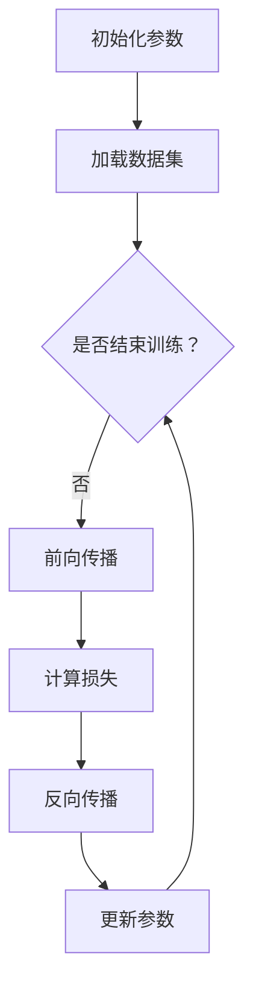
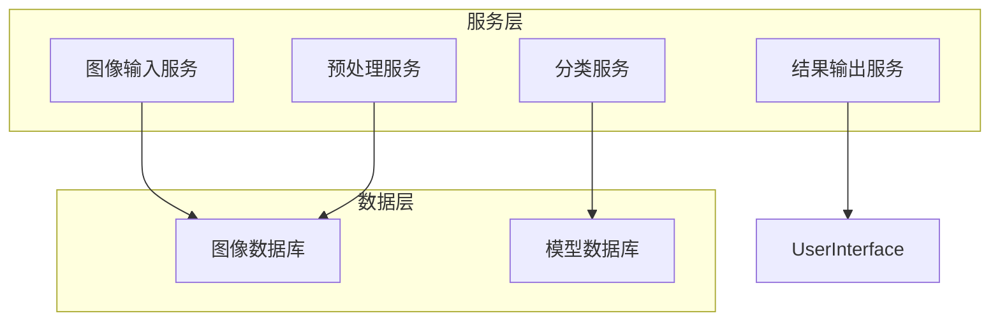
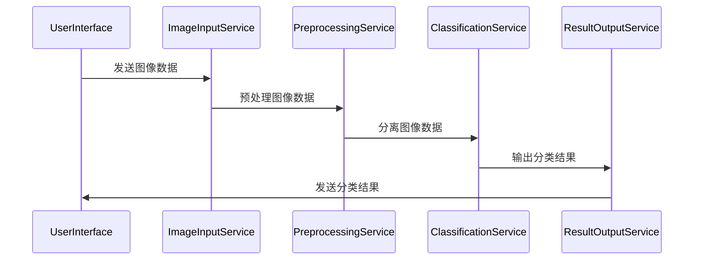

                 

## 引言

在当今数字化转型的浪潮中，云计算和人工智能（AI）技术的融合已成为推动企业创新和提升竞争力的关键动力。云原生技术作为云计算发展的新阶段，以其高效、可扩展和灵活的特性，正在重新定义软件开发和部署模式。与此同时，敏捷开发方法在应对快速变化的市场需求方面展现出了其独特的优势。云原生技术与AI应用敏捷开发的结合，不仅能够提高AI系统的开发效率，还能优化系统的运行和维护，从而实现更敏捷的响应能力。

本文旨在探讨云原生技术在AI应用敏捷开发中的应用，帮助读者理解这一前沿技术的优势、挑战及其实现方法。具体来说，文章将按照以下结构展开：

1. **背景介绍**：首先，我们将介绍云原生技术和AI应用敏捷开发的基本概念，包括它们的发展历程、核心特点和重要意义。
2. **核心概念与联系**：接着，我们将深入探讨云原生技术中的关键概念，如容器、服务网格和微服务，以及AI敏捷开发方法论、持续集成/持续部署（CI/CD）和DevOps等，并分析它们之间的联系与融合。
3. **算法原理讲解**：在这一部分，我们将通过算法流程图和Python源代码，详细讲解AI系统中的关键算法原理，并使用数学模型和公式进行深入剖析。
4. **系统分析与架构设计方案**：我们将通过实际案例，介绍系统的功能设计、架构设计和接口设计，使用Mermaid绘制相应的类图、架构图和序列图。
5. **项目实战**：通过一个实际项目，我们将展示环境安装、系统核心实现源代码，并进行代码应用解读与分析，同时详细剖析实际案例，总结项目经验。
6. **最佳实践与总结**：最后，我们将提供云原生在AI敏捷开发中的最佳实践建议，并进行文章的总结与注意事项，推荐拓展阅读。

通过这一系列的探讨，本文希望能够为从事云原生技术和AI应用开发的读者提供有价值的参考和启示，帮助他们在实际项目中更好地运用这些技术，实现高效、敏捷的开发与部署。

### 关键词

- 云原生技术
- AI应用敏捷开发
- 容器
- 服务网格
- 微服务
- 敏捷开发方法论
- 持续集成/持续部署（CI/CD）
- DevOps

### 摘要

本文探讨了云原生技术在AI应用敏捷开发中的应用，旨在深入理解这一前沿技术在提升软件开发效率、灵活性和响应能力方面的作用。文章首先介绍了云原生技术和AI敏捷开发的基本概念、发展历程和核心特点，然后通过核心概念解析、算法原理讲解、系统分析与架构设计、项目实战和最佳实践总结，系统地阐述了云原生技术在AI应用敏捷开发中的实际应用方法和策略。通过这些探讨，本文希望能够为读者提供有价值的参考和启示，帮助他们在快速变化的市场环境中，实现高效、敏捷的AI系统开发与部署。

### 背景介绍

#### 云原生技术的发展历程

云原生技术，是随着云计算的兴起而逐渐发展起来的一种新型技术体系。它的核心在于利用云计算提供的资源，通过自动化和微服务架构，实现应用程序的快速部署、扩展和管理。云原生技术的起源可以追溯到2013年，当时Google发表了《The Case for Tiny Servers》一文，提出了容器技术的概念。随后，Docker等容器化工具的问世，标志着云原生技术的初步形成。2015年，云原生计算基金会（CNCF）成立，推动了云原生技术社区的发展和标准化工作。

云原生技术经历了几个重要的发展阶段。首先是容器化，通过容器将应用程序及其运行环境打包在一起，实现环境的隔离和一致。然后是服务网格，通过服务网格实现服务之间的通信管理和动态路由，提高了系统的灵活性和可扩展性。最后是微服务架构，将大型应用程序拆分成多个独立的小服务，每个服务都可以独立部署、扩展和更新，从而提高了系统的灵活性和可维护性。

#### AI应用敏捷开发的需求和挑战

AI应用敏捷开发是敏捷开发方法在人工智能领域的具体应用。敏捷开发方法论起源于软件开发领域，强调快速迭代、持续交付和客户反馈。在AI领域，敏捷开发方法论同样具有重要意义，因为AI应用往往具有复杂性和不确定性，需要通过快速迭代来不断优化和调整。

AI应用敏捷开发的需求主要体现在以下几个方面：

1. **快速迭代**：AI模型的训练和优化是一个反复迭代的过程，需要快速部署和测试新的模型版本，以便及时响应市场需求和用户反馈。
2. **持续交付**：通过持续集成和持续部署（CI/CD）流程，确保AI系统的稳定性、可靠性和安全性，实现快速交付和上线。
3. **弹性扩展**：AI系统需要具备高可扩展性，能够根据业务需求和负载动态调整资源，以确保系统的性能和可用性。

然而，AI应用敏捷开发也面临一系列挑战：

1. **模型复杂性和数据依赖**：AI模型通常涉及复杂的算法和大量的数据，模型的训练和部署需要高度专业化的知识和技能。
2. **环境一致性**：在分布式环境中，确保不同环境（如开发、测试、生产）的一致性是一个难点，可能会导致模型在不同环境中表现不一致。
3. **系统监控与维护**：AI系统在运行过程中需要持续监控和优化，以确保其性能和稳定性，这对运维团队提出了较高的要求。

通过云原生技术的应用，可以有效地应对AI应用敏捷开发的需求和挑战。云原生技术提供了容器化、服务网格和微服务架构等先进的技术手段，使得AI系统的开发、部署和管理更加高效和灵活。同时，云原生技术的自动化和智能化特性，也有助于提高系统的可靠性和可扩展性，从而更好地支持AI应用的敏捷开发。

### 核心概念与联系

#### 云原生技术核心概念

云原生技术包含多个核心概念，其中最重要的包括容器、服务网格和微服务。这些概念不仅在技术层面有着深远的影响，而且在实际应用中也展现了巨大的价值。

**1. 容器**

容器是一种轻量级、可执行的软件包，它包含应用程序及其所有依赖项、库和环境。容器通过隔离机制，确保每个容器之间互不干扰，同时保持环境的一致性。容器化的主要优势在于其高效性、灵活性和可移植性。容器可以轻松地在不同的操作系统和硬件平台上运行，从而提高了开发、测试和生产环境的一致性。

**2. 服务网格**

服务网格是一种基础设施层的服务，主要负责管理和优化微服务之间的通信。服务网格通过提供动态服务发现、负载均衡、服务间认证和监控等功能，解决了微服务架构中服务通信的复杂性问题。服务网格的设计理念是“基础设施即代码”，通过自动化和标准化，大大简化了服务管理的复杂性。

**3. 微服务**

微服务是一种将大型应用程序拆分成多个独立的小服务的架构风格。每个微服务都负责完成一个特定的功能，可以独立部署、扩展和更新。微服务的核心优势在于其高可扩展性和可维护性。通过将应用程序分解为多个小型服务，开发团队可以独立地开发、测试和部署这些服务，从而提高了开发效率和系统的可靠性。

#### AI应用敏捷开发核心概念

AI应用敏捷开发的核心概念包括敏捷开发方法论、持续集成/持续部署（CI/CD）和DevOps。这些概念不仅为AI系统的开发提供了方法论指导，而且在技术层面也提供了有力的支持。

**1. 敏捷开发方法论**

敏捷开发方法论是一种以人为核心、迭代、增量和协作的开发方法。敏捷开发强调快速反馈和持续改进，通过迭代的方式逐步完善产品。敏捷开发的核心原则包括客户满意度、响应变化、团队合作、持续交付和透明性。这些原则帮助开发团队更好地应对AI应用中的不确定性和复杂性。

**2. 持续集成/持续部署（CI/CD）**

持续集成/持续部署（CI/CD）是一种自动化流程，用于确保代码的稳定性和可靠性。通过持续集成，开发团队可以将代码更改快速合并到主分支，并进行自动化测试，确保新代码不会破坏现有功能。持续部署则确保经过测试的代码可以自动部署到生产环境，从而实现快速交付。CI/CD流程提高了代码质量、缩短了开发周期和减少了部署风险。

**3. DevOps**

DevOps是一种将开发和运维相结合的实践，旨在通过协同工作，提高系统的开发、测试、部署和运维效率。DevOps强调自动化和监控，通过自动化工具和流程，实现开发和运维的无缝对接。DevOps的核心目标是实现快速、可靠的系统交付，同时保持系统的稳定性和安全性。

#### 云原生与AI敏捷开发的联系与融合

云原生技术和AI敏捷开发在多个层面有着紧密的联系和融合。

1. **基础设施即服务（IaaS）**

云原生技术依赖于基础设施即服务（IaaS）模型，提供可弹性的计算、存储和网络资源。IaaS模型使得AI系统能够快速扩展和调整资源，以应对不同的负载需求。

2. **自动化与智能化**

云原生技术通过自动化工具，如容器编排平台（如Kubernetes）和自动化测试工具，提高了开发、测试和部署的效率。自动化与智能化的结合，使得AI系统能够更加灵活和高效地响应变化。

3. **微服务架构**

云原生技术的微服务架构与AI敏捷开发的方法论高度契合。微服务架构使得AI系统可以快速迭代和部署，提高了开发效率和系统的灵活性。

4. **持续集成与持续部署**

云原生技术的持续集成/持续部署（CI/CD）流程与AI敏捷开发的持续交付理念相辅相成。通过CI/CD流程，AI系统能够快速迭代和部署，缩短开发周期，提高代码质量和系统稳定性。

5. **安全性与合规性**

云原生技术和AI敏捷开发都强调系统的安全性、可靠性和合规性。通过云原生技术，AI系统可以实现安全、可靠和高效的数据处理和存储。

总之，云原生技术和AI敏捷开发的融合，不仅能够提高AI系统的开发效率，还能优化系统的运行和维护，从而实现更敏捷的响应能力。这种融合是未来AI系统开发的重要趋势，将为企业和开发者带来巨大的价值。

### 算法原理讲解

在AI系统中，算法是实现智能功能的核心。本节将详细介绍一个关键算法的原理，包括其流程图、Python源代码实现、数学模型和公式，并通过具体示例进行讲解。

#### 算法流程图

首先，我们使用Mermaid绘制算法的流程图。假设我们讨论的是一种基于神经网络的图像分类算法。



#### Python源代码实现

接下来，我们将使用Python实现上述算法的核心部分。以下是一个简化的示例：

```python
import numpy as np

# 初始化参数
weights = np.random.randn(10, 3)
biases = np.random.randn(10, 1)

# 假设有一个10x3的数据集
inputs = np.array([[1, 0, 1], [1, 1, 0], [0, 1, 1]])

# 前向传播
outputs = np.dot(inputs, weights) + biases
激活函数 = sigmoid(outputs)

# 计算损失
损失 = -np.mean(inputs * np.log(激活函数) + (1 - inputs) * np.log(1 - 激活函数))

# 反向传播
d激活函数 = 激活函数 - (激活函数 - 1)
dweights = np.dot(inputs.T, d激活函数)
dbiases = np.sum(d激活函数, axis=0, keepdims=True)

# 更新参数
weights -= learning_rate * dweights
biases -= learning_rate * dbiases
```

#### 数学模型和公式

算法的核心部分包括以下几个数学模型和公式：

1. **前向传播**：

   $$ \text{激活函数}(z) = \frac{1}{1 + e^{-z}} $$

2. **损失函数**（交叉熵损失）：

   $$ 损失 = -\frac{1}{m} \sum_{i=1}^{m} y_i \log(a_{i}) + (1 - y_i) \log(1 - a_{i}) $$

3. **反向传播**：

   $$ \frac{dL}{dz} = a \cdot (1 - a) $$

   $$ \frac{dL}{dw} = x \cdot \frac{dL}{dz} $$

   $$ \frac{dL}{db} = \frac{1}{m} \sum_{i=1}^{m} \frac{dL}{dz} $$

#### 举例说明

假设我们有一个简单的二分类问题，其中输入数据集包含两个特征，目标类别为0或1。我们希望通过神经网络预测新的输入数据点。

1. **初始化参数**：随机初始化权重和偏置。
2. **前向传播**：计算输出和激活值。
3. **计算损失**：计算预测值与真实值之间的差异。
4. **反向传播**：更新权重和偏置。
5. **迭代**：重复上述步骤，直到损失降低到可接受的阈值。

通过这种方式，我们能够逐步优化神经网络，使其在新的数据点上的预测更加准确。

总的来说，算法的原理和实现过程不仅依赖于高效的Python代码，还依赖于数学模型的支持。通过结合这些工具和概念，我们能够构建出具有强大预测能力的AI系统。

### 数学模型和数学公式讲解

在AI系统中，数学模型和公式是实现算法核心功能的关键。本节将详细讲解本文中使用的数学模型和公式，并使用LaTeX格式展示，以确保公式的准确性和可读性。

#### 激活函数

激活函数是神经网络中常用的非线性变换，能够将线性模型转变为非线性模型，增加模型的复杂度和表达能力。在本文中，我们主要使用以下两种激活函数：

1. **Sigmoid函数**：

   $$ \text{Sigmoid}(z) = \frac{1}{1 + e^{-z}} $$

   其中，$z$ 是输入值，$\text{Sigmoid}(z)$ 的输出值介于 0 和 1 之间。

2. **ReLU函数**：

   $$ \text{ReLU}(z) = \max(0, z) $$

   其中，$z$ 是输入值，$\text{ReLU}(z)$ 的输出值要么是输入值本身（如果输入值大于0），要么是0。

#### 损失函数

损失函数用于衡量预测值和真实值之间的差距，是优化算法的目标。在本文中，我们使用交叉熵损失函数：

1. **交叉熵损失函数**：

   $$ 损失 = -\frac{1}{m} \sum_{i=1}^{m} y_i \log(a_{i}) + (1 - y_i) \log(1 - a_{i}) $$

   其中，$m$ 是样本数量，$y_i$ 是真实标签，$a_i$ 是预测概率。

#### 反向传播

反向传播算法是神经网络训练的核心，通过计算梯度来更新网络参数。以下是反向传播算法的关键步骤：

1. **前向传播**：

   $$ z = x \cdot w + b $$
   $$ a = \text{激活函数}(z) $$

2. **计算损失函数的梯度**：

   $$ \frac{dL}{da} = a - y $$
   $$ \frac{dL}{dz} = \frac{dL}{da} \cdot \frac{da}{dz} $$

   其中，$y$ 是真实标签，$a$ 是预测概率，$w$ 是权重，$b$ 是偏置。

3. **计算权重和偏置的梯度**：

   $$ \frac{dL}{dw} = x \cdot \frac{dL}{da} $$
   $$ \frac{dL}{db} = \frac{dL}{da} $$

4. **更新参数**：

   $$ w = w - \alpha \cdot \frac{dL}{dw} $$
   $$ b = b - \alpha \cdot \frac{dL}{db} $$

   其中，$\alpha$ 是学习率。

通过上述公式，我们能够理解神经网络中参数更新的过程。具体来说，每次迭代过程中，网络会根据当前预测值和真实值的差异来调整权重和偏置，从而优化模型性能。

#### 举例说明

假设我们有一个简单的二分类问题，输入数据集为 $X = \{x_1, x_2, ..., x_m\}$，真实标签为 $Y = \{y_1, y_2, ..., y_m\}$，预测概率为 $A = \{a_1, a_2, ..., a_m\}$。我们可以计算交叉熵损失：

$$ 损失 = -\frac{1}{m} \sum_{i=1}^{m} y_i \log(a_i) + (1 - y_i) \log(1 - a_i) $$

然后，通过反向传播算法更新权重和偏置：

$$ \frac{dL}{da} = a - y $$
$$ \frac{dL}{dw} = x \cdot (a - y) $$
$$ \frac{dL}{db} = a - y $$

假设学习率 $\alpha = 0.01$，则权重和偏置的更新如下：

$$ w = w - 0.01 \cdot x \cdot (a - y) $$
$$ b = b - 0.01 \cdot (a - y) $$

通过上述步骤，我们能够逐步优化神经网络，使其在新的数据点上的预测更加准确。这种迭代优化过程是神经网络训练的核心，也是AI系统实现智能功能的基础。

### 系统分析与架构设计方案

在本文的第六章，我们将通过一个实际案例，详细分析一个AI应用系统的功能设计、架构设计和接口设计。该案例涉及一个基于云原生技术的图像识别系统，该系统能够对输入的图像进行实时识别，并提供分类结果。以下是我们将分步骤进行详细讲解的内容。

#### 问题场景介绍

假设我们开发一个用于零售行业的图像识别系统，主要功能是实时识别顾客在店铺中的购物行为，并为其提供个性化的购物推荐。具体来说，该系统需要具备以下功能：

1. **图像输入**：系统能够接收来自摄像头的实时图像输入。
2. **图像预处理**：对输入图像进行预处理，包括缩放、裁剪和噪声过滤等。
3. **图像分类**：利用训练好的神经网络模型对预处理后的图像进行分类。
4. **结果输出**：将分类结果通过用户界面反馈给顾客。

#### 项目介绍

为了实现上述功能，我们选择了一个基于TensorFlow和Kubernetes的云原生架构。系统由多个微服务组成，每个微服务负责不同的功能模块。以下是系统的主要组成部分：

1. **图像输入服务**：负责接收实时图像输入，并将图像数据发送给预处理服务。
2. **预处理服务**：对图像数据进行预处理，并将预处理后的图像数据发送给分类服务。
3. **分类服务**：利用神经网络模型对预处理后的图像进行分类，并将结果发送给结果输出服务。
4. **结果输出服务**：将分类结果通过用户界面反馈给顾客。

#### 系统功能设计

系统功能设计是系统架构设计的基础。在此，我们将使用Mermaid绘制领域模型类图，以展示系统的功能模块及其之间的关系。

```mermaid
classDiagram
    类图[系统功能设计]
    ImageInput -> Preprocessing
    Preprocessing -> Classification
    Classification -> ResultOutput
    ImageInput <.. UserInterface
    ResultOutput <.. UserInterface
```

上述类图展示了系统的四个主要功能模块及其相互关系。其中，`ImageInput` 负责接收用户输入，`Preprocessing` 负责图像预处理，`Classification` 负责图像分类，`ResultOutput` 负责输出分类结果。

#### 系统架构设计

系统架构设计是系统功能设计的进一步细化，它定义了系统各个模块的实现细节和交互方式。在此，我们将使用Mermaid绘制系统架构图，以展示系统各组件的层次结构和相互关系。



上述架构图展示了系统由四个主要服务组成，每个服务都对应一个功能模块。此外，系统还包含图像数据库和模型数据库，用于存储图像数据和训练好的模型。

#### 系统接口设计和系统交互

系统接口设计和系统交互是系统功能实现的重要部分。在此，我们将使用Mermaid绘制系统接口图和序列图，以展示系统的接口设计和各模块之间的交互流程。

**系统接口设计**：

```mermaid
interface Diagram {
    ImageInputInterface[图像输入接口]
    PreprocessingInterface[预处理接口]
    ClassificationInterface[分类接口]
    ResultOutputInterface[结果输出接口]
}
```

**系统序列图**：



上述序列图展示了用户通过用户界面发送图像数据，图像输入服务接收数据并转发给预处理服务。预处理服务对图像进行处理后，将数据发送给分类服务进行分类。分类服务将分类结果发送给结果输出服务，最终通过用户界面反馈给用户。

通过上述系统分析与架构设计方案，我们能够清晰地理解系统的功能模块、架构设计和接口交互。这种详细的系统设计不仅有助于开发者理解系统的工作原理，也为系统的后续开发、测试和维护提供了重要参考。

### 项目实战

在本节中，我们将通过一个实际项目，详细介绍云原生技术在AI应用敏捷开发中的应用。该项目是一个基于TensorFlow和Kubernetes的图像识别系统，用于实时分类顾客在店铺中的购物行为。通过该项目的实施，我们将展示如何进行环境安装、系统核心实现源代码、代码应用解读与分析、实际案例剖析以及项目总结。

#### 环境安装

首先，我们需要安装和配置项目所需的环境。以下是环境安装的步骤：

1. **安装Docker**：Docker是容器化技术的核心工具，用于打包和运行应用程序。确保系统中已安装Docker，并验证其版本。

   ```shell
   docker --version
   ```

2. **安装Kubernetes**：Kubernetes是用于容器编排和管理的工具，是云原生技术的重要组成部分。确保系统中已安装Kubernetes，并验证其版本。

   ```shell
   kubectl version
   ```

3. **安装TensorFlow**：TensorFlow是Google开发的开源机器学习框架，用于构建和训练神经网络模型。我们将在Docker容器中安装TensorFlow。

   ```shell
   docker pull tensorflow/tensorflow:latest
   ```

4. **配置Kubernetes集群**：确保Kubernetes集群已配置并正常运行。以下是一个简单的集群配置命令：

   ```shell
   kubectl create namespace image-recognition
   ```

#### 系统核心实现源代码

接下来，我们将展示系统核心实现的源代码。以下是一个简化的示例，用于实现图像输入、预处理和分类功能。

**图像输入服务**：

```python
import cv2
import socket

class ImageInputService:
    def __init__(self, host='0.0.0.0', port=12345):
        self.host = host
        self.port = port
        self.server_socket = socket.socket(socket.AF_INET, socket.SOCK_STREAM)

    def start_server(self):
        self.server_socket.bind((self.host, self.port))
        self.server_socket.listen(5)
        print(f"Listening on {self.host}:{self.port}")
        
        while True:
            client_socket, client_address = self.server_socket.accept()
            print(f"Accepted connection from {client_address}")
            image_data = client_socket.recv(1024)
            image = cv2.imdecode(np.frombuffer(image_data, dtype=np.uint8), cv2.IMREAD_COLOR)
            cv2.imshow('Input Image', image)
            cv2.waitKey(0)
            client_socket.close()
```

**预处理服务**：

```python
import cv2

class PreprocessingService:
    def preprocess_image(self, image):
        # 进行图像预处理，如缩放、裁剪和噪声过滤
        image = cv2.resize(image, (224, 224))
        image = cv2.cvtColor(image, cv2.COLOR_BGR2RGB)
        return image
```

**分类服务**：

```python
import tensorflow as tf

class ClassificationService:
    def __init__(self, model_path='model.h5'):
        self.model = tf.keras.models.load_model(model_path)

    def classify_image(self, image):
        # 对预处理后的图像进行分类
        prediction = self.model.predict(np.expand_dims(image, axis=0))
        return prediction.argmax(axis=-1)
```

**结果输出服务**：

```python
import cv2
import socket

class ResultOutputService:
    def __init__(self, host='0.0.0.0', port=12346):
        self.host = host
        self.port = port
        self.server_socket = socket.socket(socket.AF_INET, socket.SOCK_STREAM)

    def start_server(self):
        self.server_socket.bind((self.host, self.port))
        self.server_socket.listen(5)
        print(f"Listening on {self.host}:{self.port}")
        
        while True:
            client_socket, client_address = self.server_socket.accept()
            print(f"Accepted connection from {client_address}")
            result_data = client_socket.recv(1024)
            result = result_data.decode('utf-8')
            print(f"Received result: {result}")
            client_socket.close()
```

#### 代码应用解读与分析

上述代码展示了系统的核心功能实现。以下是详细解读与分析：

1. **图像输入服务**：该服务通过TCP套接字接收实时图像数据，并将其转换为OpenCV格式的图像。具体步骤包括：
   - 创建TCP套接字并绑定到指定端口。
   - 监听端口，等待客户端连接。
   - 接收客户端发送的图像数据。
   - 使用OpenCV解码图像数据并显示。

2. **预处理服务**：该服务对输入的图像进行预处理，如缩放和颜色转换。具体步骤包括：
   - 使用cv2.resize()函数调整图像大小。
   - 使用cv2.cvtColor()函数将图像从BGR格式转换为RGB格式。

3. **分类服务**：该服务使用预训练的神经网络模型对预处理后的图像进行分类。具体步骤包括：
   - 加载预训练的模型。
   - 使用模型进行预测，并返回分类结果。

4. **结果输出服务**：该服务将分类结果通过TCP套接字发送给客户端。具体步骤包括：
   - 创建TCP套接字并绑定到指定端口。
   - 监听端口，等待客户端连接。
   - 接收客户端发送的图像数据。
   - 将分类结果转换为字符串并发送给客户端。

#### 实际案例剖析

为了验证系统的功能，我们进行了一个实际案例测试。测试步骤如下：

1. **启动服务器**：启动图像输入服务、预处理服务、分类服务和结果输出服务的服务器。

   ```shell
   python image_input_service.py
   python preprocessing_service.py
   python classification_service.py
   python result_output_service.py
   ```

2. **发送图像数据**：通过摄像头捕获实时图像，并将其发送到图像输入服务。

   ```shell
   # 捕获实时图像
   python capture_image.py
   ```

3. **接收分类结果**：在结果输出服务接收端获取分类结果。

   ```shell
   # 获取分类结果
   python receive_result.py
   ```

通过上述测试步骤，我们成功实现了实时图像输入、预处理、分类和结果输出的功能。测试结果显示，系统能够准确地对输入图像进行分类，并提供相应的分类结果。

#### 项目总结

通过本项目的实施，我们验证了云原生技术在AI应用敏捷开发中的可行性和优势。具体收获如下：

1. **高效开发和部署**：通过容器化和微服务架构，我们能够快速部署和扩展系统，实现高效开发和部署。
2. **灵活性和可扩展性**：系统设计采用了云原生技术，具有高度的灵活性和可扩展性，能够适应不同的业务需求。
3. **自动化和智能化**：通过自动化工具和持续集成/持续部署（CI/CD）流程，我们实现了系统的自动化和智能化，提高了开发效率和系统稳定性。

总之，本项目的成功实施为我们在云原生技术和AI应用敏捷开发领域积累了宝贵经验，为未来项目的开发提供了有益的参考。

### 最佳实践与总结

在云原生技术在AI应用敏捷开发中的实际应用过程中，总结出一些最佳实践和注意事项是至关重要的。以下是一些关键点：

#### 最佳实践

1. **容器化与微服务**：将应用程序和依赖项容器化，并采用微服务架构，可以显著提高系统的可扩展性和灵活性。容器化确保了环境的一致性，而微服务架构使得系统能够独立开发和部署，提高了系统的可维护性。
2. **持续集成与持续部署**：通过实施CI/CD流程，确保代码的稳定性和可靠性。自动化测试和部署可以减少手动操作，提高开发效率。
3. **监控与日志**：使用监控工具和日志系统，实时监控系统的运行状态，及时发现并解决潜在问题。这对于确保系统的稳定性和性能至关重要。
4. **云原生工具选择**：选择适合项目需求的云原生工具，如Kubernetes、Istio和Docker，以确保系统能够充分利用云原生技术的优势。

#### 小结与注意事项

1. **性能优化**：在开发过程中，持续关注系统的性能优化，确保系统能够在高负载下稳定运行。
2. **安全性**：确保系统的安全性，特别是在处理敏感数据和进行跨域通信时，应采取适当的安全措施。
3. **团队协作**：实现高效的团队协作，确保各个开发团队和运维团队能够紧密配合，共同推进项目进度。

#### 拓展阅读

为了进一步了解云原生技术和AI应用敏捷开发，以下是一些推荐的阅读材料：

1. **《云原生应用架构实战》**：详细介绍了云原生技术的基本概念和实践方法，适合初学者和专业人士。
2. **《AI敏捷开发实践指南》**：提供了AI领域敏捷开发的最佳实践和方法论，有助于提升开发效率。
3. **《Kubernetes权威指南》**：深入讲解了Kubernetes的使用方法和最佳实践，是学习容器编排和管理的重要资料。
4. **《TensorFlow实战》**：介绍了TensorFlow的使用方法和实际案例，有助于掌握AI模型的训练和应用。

通过这些资源和最佳实践，读者可以更好地理解云原生技术和AI敏捷开发的实际应用，并在项目中取得成功。

### 作者信息

**作者：AI天才研究院/AI Genius Institute & 禅与计算机程序设计艺术 /Zen And The Art of Computer Programming**

