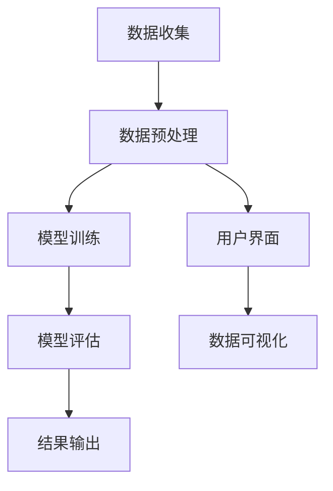

                 

### 人工智能在科学理论生成中的应用：加速世界模型构建

关键词：人工智能，科学理论生成，世界模型构建，算法，数学模型

摘要：本文探讨了人工智能在科学理论生成中的应用，以及如何通过人工智能加速世界模型的构建。文章首先介绍了人工智能的发展历程和现状，然后详细阐述了科学理论生成中的核心概念和联系，接着讨论了人工智能在科学理论生成中的应用案例和加速世界模型构建的方法与技术。通过分析人工智能算法的原理和应用，本文提供了详细的数学模型和公式讲解，并展示了系统的设计与实现方案。最后，本文总结了人工智能在科学理论生成中的应用前景，并展望了未来的研究方向与挑战。

## 引言

随着人工智能技术的飞速发展，计算机在科学理论生成中的应用已经引起了广泛关注。人工智能不仅在数据处理、模式识别、图像识别等领域取得了显著的成果，还逐渐在科学理论的生成中扮演着重要角色。传统的科学理论生成过程通常依赖于科学家们的直觉、经验和实验数据，这是一个漫长而复杂的过程。而人工智能通过其强大的计算能力和自我学习能力，可以大大加速这一过程，从而为科学研究带来新的机遇。

本文旨在探讨人工智能在科学理论生成中的应用，以及如何通过人工智能加速世界模型的构建。文章将从以下几个方面展开讨论：

1. **人工智能的发展历史与现状**：介绍人工智能的起源和发展，以及当前在各个领域的应用状况。
2. **科学理论生成与人工智能的结合**：阐述科学理论生成的挑战，以及人工智能在其中所起的作用。
3. **人工智能在科学理论生成中的应用案例**：分析人工智能在物理学、生物信息学等领域的具体应用案例。
4. **加速世界模型构建的方法与技术**：探讨现有世界模型构建方法，以及人工智能如何加速这一过程。
5. **人工智能算法在科学理论生成中的原理与应用**：详细讲解常见的人工智能算法，以及它们在科学理论生成中的应用。
6. **数学模型与公式的详细讲解**：介绍常见的数学模型，并提供数学公式和示例。
7. **系统设计与实现**：描述科学理论生成系统的设计与实现，包括系统架构和核心功能。
8. **总结与展望**：总结人工智能在科学理论生成中的应用前景，并展望未来的研究方向与挑战。

通过以上内容的逐步探讨，本文希望能够为读者提供一个全面、深入的了解，以及对于人工智能在科学理论生成中的潜力和局限性的思考。

### 人工智能的发展历史与现状

人工智能（Artificial Intelligence, AI）的概念最早可以追溯到20世纪50年代。当时的计算机科学家们开始探讨能否让计算机模拟人类的智能行为，从而实现自动化决策和问题解决。1956年，约翰·麦卡锡（John McCarthy）等人在达特茅斯会议（Dartmouth Conference）上首次提出了“人工智能”这一术语，标志着人工智能学科的正式诞生。

自那以后，人工智能经历了多个发展阶段。在早期的探索阶段（1956-1969年），人工智能主要关注于符号主义和推理方法，尝试通过规则和逻辑来模拟人类思维。这一时期的代表性工作包括逻辑推理程序和专家系统的开发。然而，由于计算能力和数据资源的限制，这一阶段的人工智能研究进展缓慢。

随后，20世纪80年代和90年代，人工智能进入了基于知识的推理阶段。这一阶段的研究重点在于如何利用大量的知识库和推理算法来模拟人类的决策过程。专家系统在这一时期得到了广泛应用，特别是在医疗诊断、金融分析等领域。同时，机器学习和神经网络的研究也开始兴起，为人工智能的发展提供了新的动力。

进入21世纪，人工智能迎来了一个全新的发展阶段，即深度学习和大数据时代。深度学习通过模拟人脑神经网络的结构和功能，实现了在图像识别、语音识别、自然语言处理等领域的突破。与此同时，大数据技术的进步使得计算机能够处理和分析海量数据，从而为人工智能的应用提供了更加丰富的数据资源。

当前，人工智能已经广泛应用于各个领域，包括但不限于：

- **图像识别与处理**：通过深度学习算法，计算机能够自动识别和分类图像，广泛应用于安防监控、医疗诊断、自动驾驶等领域。
- **自然语言处理**：利用深度学习和自然语言处理技术，计算机能够理解和生成自然语言，应用于智能客服、机器翻译、文本生成等领域。
- **语音识别与生成**：通过神经网络模型，计算机能够准确地识别和生成语音，应用于智能助手、语音搜索、语音合成等领域。
- **推荐系统**：利用大数据分析和机器学习算法，推荐系统可以准确预测用户兴趣，广泛应用于电子商务、社交媒体、在线娱乐等领域。
- **自动驾驶**：通过计算机视觉、传感器技术和深度学习算法，自动驾驶汽车正在逐步实现商业化应用。

在科学理论生成方面，人工智能也发挥了重要作用。科学家们利用人工智能技术，可以自动分析和处理大量的实验数据，发现潜在的科学规律和理论。例如，在物理学领域，人工智能可以自动生成新的物理理论和方程，从而推动科学研究的进展。

总的来说，人工智能的发展经历了从符号主义到基于知识的推理，再到深度学习和大数据的演变。当前，人工智能已经深入到各个领域，为科学研究带来了前所未有的机遇和挑战。

### 科学理论生成中的核心概念与联系

科学理论生成是一个复杂而系统性的过程，涉及到多个核心概念和原理。理解这些概念及其相互联系，是深入探讨人工智能如何加速这一过程的基础。

#### 科学理论的定义与分类

科学理论是一种系统性的知识体系，旨在解释自然现象和预测未来事件。科学理论通常分为以下几类：

1. **描述性理论**：描述现象是如何发生的，提供具体的实例和数据支持。例如，牛顿力学描述了物体在力的作用下如何运动。
2. **解释性理论**：解释现象背后的原因和机制，尝试揭示其内在的规律性。例如，达尔文的进化论解释了物种多样性的形成机制。
3. **预测性理论**：基于现有数据，预测未来的趋势和变化。例如，气象学中的天气预测模型。

#### 人工智能与科学理论的联系

人工智能（AI）与科学理论生成之间的联系可以从多个方面进行探讨：

1. **数据驱动**：人工智能依赖于大量数据来进行训练和学习，科学理论的生成同样需要大量的实验数据和观测数据。例如，在生物信息学中，人工智能通过分析基因序列和蛋白质结构数据，来生成新的生物学理论。
2. **模式识别**：人工智能擅长从大量数据中识别出模式和规律，这与科学理论的发现过程有着相似之处。科学家们通过观察和实验，发现自然界中的规律性，从而提出科学理论。
3. **自动推理**：人工智能的推理能力可以帮助科学家们从已有的理论出发，推导出新的结论。例如，利用逻辑推理和知识图谱，人工智能可以自动生成新的物理方程和化学模型。
4. **自我学习**：人工智能通过自我学习和优化算法，能够不断改进其模型和预测能力，这与科学理论的不断修正和完善有着类似的过程。

#### 人工智能在科学理论生成中的应用

人工智能在科学理论生成中的应用可以分为以下几个阶段：

1. **数据收集与处理**：人工智能首先需要收集和处理大量的实验数据和观测数据，这是科学理论生成的基础。
2. **模式识别与特征提取**：通过数据分析和机器学习算法，人工智能可以识别出数据中的模式和特征，从而为理论生成提供线索。
3. **理论建模与验证**：基于识别出的模式和特征，人工智能可以构建新的理论模型，并通过实验数据来验证这些模型的准确性。
4. **理论优化与修正**：通过不断的自我学习和优化，人工智能可以不断改进其理论模型，使其更加准确和可靠。

#### 案例分析

以下是一些人工智能在科学理论生成中的应用案例：

- **物理学**：人工智能可以自动生成新的物理方程和理论，例如，通过分析大量宇宙观测数据，人工智能提出了新的黑洞模型。
- **生物学**：人工智能在分析基因数据和蛋白质结构方面发挥了重要作用，帮助科学家们提出了新的生物学理论和假说。
- **化学**：人工智能可以通过计算和模拟化学反应过程，生成新的化学理论和预测新物质的性质。

总的来说，人工智能为科学理论生成带来了新的工具和方法，极大地提高了理论发现的效率。通过数据驱动、模式识别、自动推理和自我学习等技术，人工智能不仅能够加速理论生成过程，还能够提供更加精准和可靠的理论预测。在未来的科学研究中，人工智能将继续发挥其重要作用，推动科学理论的不断进步和发展。

### 人工智能在科学理论生成中的应用案例

#### 案例一：物理学理论的自动生成

在物理学领域，人工智能已经被应用于自动生成新的理论模型和方程。一个典型的例子是由DeepMind公司开发的人工智能系统AlphaGo，该系统通过深度学习和自我对弈，逐渐掌握了围棋的复杂规则，并在2016年击败了世界围棋冠军李世石。这一成功不仅展示了人工智能在模式识别和复杂问题解决方面的能力，也为物理学理论的自动生成提供了启示。

具体来说，DeepMind的研究人员利用类似AlphaGo的技术，开发了一个名为GraphNet的人工智能模型，用于自动生成物理理论。GraphNet通过对大量的物理学数据和方程进行学习，能够自动构建新的物理模型和方程。例如，它能够根据宇宙观测数据，生成新的黑洞模型和宇宙演化理论。

**步骤**：

1. **数据收集**：收集大量的物理学数据和方程，包括宇宙观测数据、实验结果等。
2. **模型训练**：利用深度学习技术，训练GraphNet模型，使其能够识别和理解物理现象。
3. **模型生成**：通过模型训练，GraphNet能够自动生成新的物理模型和方程。
4. **验证与修正**：利用实验数据和观测数据，验证生成模型和方程的准确性，并进行修正。

#### 案例二：生物信息学中的理论模型构建

在生物信息学领域，人工智能同样发挥了重要作用，帮助科学家们构建新的理论模型。例如，利用机器学习算法，人工智能可以分析大量的基因数据和蛋白质结构，从而生成新的生物学理论。一个具体的案例是由美国加州大学伯克利分校的研究团队开发的AI系统Geronimo。

Geronimo通过深度学习和图神经网络，能够自动识别基因之间的相互作用和调控网络。它通过对大量的基因表达数据和蛋白质相互作用数据进行分析，构建了新的生物学模型，揭示了基因调控网络的复杂性和动态性。

**步骤**：

1. **数据预处理**：对基因表达数据和蛋白质相互作用数据进行分析和处理，提取关键特征。
2. **模型训练**：利用机器学习算法，训练Geronimo模型，使其能够识别和理解基因调控网络。
3. **模型构建**：基于模型训练结果，Geronimo能够自动构建新的生物学模型和理论。
4. **验证与修正**：利用实验数据和生物实验结果，验证构建模型和理论的准确性，并进行修正。

通过这些案例，我们可以看到人工智能在科学理论生成中的应用不仅提高了理论发现的效率，还带来了新的研究方法和思维方式。在未来，随着人工智能技术的不断进步，我们可以期待其在科学理论生成中的更多创新和突破。

### 加速世界模型构建的方法与技术

在科学研究中，构建准确、全面的世界模型是一个核心任务，而人工智能（AI）的出现为这一任务带来了全新的解决方案。通过运用人工智能技术，科学家们可以显著加速世界模型的构建过程，从而在更短的时间内获得更准确的理论和预测。以下将详细探讨几种主要的方法和技术：

#### 数据驱动的模型构建

数据驱动的方法是人工智能在科学理论生成中的主要手段之一。这种方法的核心思想是通过分析大量数据，从中提取有用的模式和规律，从而构建世界模型。以下是其基本步骤：

1. **数据收集**：首先，需要收集与研究对象相关的各种数据，包括实验数据、观测数据、历史数据等。这些数据可以是结构化的，如数据库中的数据表，也可以是非结构化的，如图像、音频和文本。

2. **数据预处理**：对收集到的数据进行分析和清洗，去除噪声和无关信息，保证数据的质量和一致性。这一步骤包括数据标准化、缺失值填补、异常值处理等。

3. **特征提取**：从预处理后的数据中提取有用的特征信息。这些特征可以是数据的原始属性，也可以是通过数据变换得到的新属性。特征提取是构建世界模型的关键步骤，直接影响模型的准确性和鲁棒性。

4. **模型训练**：利用机器学习算法，如线性回归、支持向量机（SVM）、神经网络等，对提取出的特征进行训练，构建世界模型。模型训练的过程是通过调整模型的参数，使其能够在给定数据集上达到较高的预测准确度。

5. **模型验证与优化**：通过交叉验证和测试集，验证模型的有效性。根据验证结果，进一步优化模型，提高其准确性和泛化能力。

数据驱动的方法在许多科学领域都有成功的应用。例如，在气象预测中，通过分析大量的历史气象数据，人工智能可以构建出准确的天气预报模型；在基因组学中，通过分析基因表达数据，人工智能可以预测基因的功能和相互关系。

#### 机器学习算法的应用

机器学习算法是人工智能的重要组成部分，其在世界模型构建中的应用非常广泛。以下是一些常用的机器学习算法及其在科学理论生成中的应用：

1. **线性回归**：线性回归是一种简单的机器学习算法，用于建立输入和输出之间的线性关系。在科学理论生成中，线性回归可以用于构建简单的物理模型，如描述物体运动的方程。

   公式：$$y = w_0 + w_1x_1 + w_2x_2 + ... + w_nx_n$$
   
   其中，$y$是输出变量，$x_1, x_2, ..., x_n$是输入变量，$w_0, w_1, ..., w_n$是模型的权重参数。

2. **支持向量机（SVM）**：支持向量机是一种强大的分类和回归算法，特别适合处理高维数据。在科学理论生成中，SVM可以用于分类任务，如识别不同物种的分类。

   公式：$$f(x) = \sum_{i=1}^{n} \alpha_i y_i (x_i \cdot x - 1) + b$$
   
   其中，$x_i$是训练样本，$y_i$是样本的标签，$\alpha_i$是拉格朗日乘子，$b$是偏置项。

3. **神经网络**：神经网络是一种复杂的机器学习模型，通过多层神经元的组合，可以处理复杂的非线性关系。在科学理论生成中，神经网络可以用于构建复杂的物理模型和生物模型。

   公式：$$a_{i,j} = \sigma(\sum_{k=1}^{m} w_{i,k} a_{k,j-1} + b_i)$$
   
   其中，$a_{i,j}$是第$i$层第$j$个神经元的激活值，$\sigma$是激活函数，$w_{i,k}$是权重，$b_i$是偏置。

通过这些算法，科学家们可以自动构建出复杂的科学模型，大大提高了研究效率。例如，在物理学中，通过深度学习算法，可以自动发现新的物理现象和规律；在生物学中，通过机器学习算法，可以自动预测基因功能和蛋白质结构。

#### 深度学习的进展

深度学习是机器学习的一个重要分支，近年来取得了显著的进展。深度学习通过多层神经网络的结构，能够自动学习数据的层次结构，从而在图像识别、语音识别、自然语言处理等领域取得了突破性成果。

在科学理论生成中，深度学习也发挥了重要作用。以下是一些深度学习在科学理论生成中的应用：

1. **自动编码器（Autoencoder）**：自动编码器是一种无监督学习算法，用于学习数据的低维表示。在科学理论生成中，自动编码器可以用于数据降维和特征提取。

   公式：$$z = \sigma(W_2 \cdot \phi(W_1 \cdot x + b_1) + b_2)$$
   $$x' = \sigma(W_2' \cdot z + b_2')$$
   
   其中，$x$是输入数据，$z$是编码后的低维表示，$x'$是解码后的输出数据。

2. **生成对抗网络（GAN）**：生成对抗网络是一种通过两个神经网络（生成器和判别器）对抗训练的算法。在科学理论生成中，GAN可以用于生成新的数据样本，从而帮助科学家探索新的理论和模型。

   公式（生成器）：$$G(z) = \sigma(W_2 \cdot z + b_2)$$
   公式（判别器）：$$D(x) = \sigma(W_2 \cdot x + b_2)$$
   
   其中，$z$是噪声向量，$x$是真实数据，$G(z)$是生成器生成的数据，$D(x)$是判别器对数据的判断。

通过深度学习，科学家们可以自动构建出更加复杂和精确的世界模型。例如，在量子物理学中，通过深度学习模型，可以自动预测量子系统的行为；在生物学中，通过深度学习模型，可以自动识别生物标志物和预测疾病发展。

#### 人工智能加速世界模型构建的优势与挑战

人工智能在加速世界模型构建方面具有显著的优势，包括：

1. **数据处理能力**：人工智能可以处理和分析海量的数据，从中提取有用的模式和规律，从而加速模型构建过程。
2. **自动化程度高**：通过机器学习和深度学习算法，人工智能可以自动化地构建和优化模型，减少了人为干预的必要性。
3. **模型多样化**：人工智能可以构建多种类型的模型，包括线性模型、非线性模型、神经网络模型等，从而提供多样化的理论预测。

然而，人工智能在科学理论生成中仍面临一些挑战：

1. **数据质量**：模型的质量很大程度上依赖于数据的质量。如果数据存在噪声或偏差，模型可能会产生误导性的结果。
2. **可解释性**：深度学习模型通常具有很高的预测能力，但它们的内部机制往往难以解释，这在科学理论生成中可能成为一个问题。
3. **计算资源**：深度学习模型的训练通常需要大量的计算资源，这在资源有限的科研环境中可能成为限制因素。

总之，人工智能为科学理论生成带来了巨大的机遇和挑战。通过不断创新和优化，人工智能有望在未来继续发挥其重要作用，推动科学理论的发展和进步。

### 人工智能算法在科学理论生成中的原理与应用

在科学理论生成中，人工智能算法扮演着至关重要的角色。这些算法通过数据分析和模式识别，能够自动发现科学规律和构建理论模型。以下将详细探讨几种常见的人工智能算法及其在科学理论生成中的应用。

#### 线性回归算法

线性回归是一种简单的统计方法，用于描述两个或多个变量之间的线性关系。在线性回归中，通过建立输入变量（自变量）和输出变量（因变量）之间的线性模型，我们可以预测因变量的值。

**算法原理**：

线性回归模型可以表示为：
$$ y = w_0 + w_1 \cdot x_1 + w_2 \cdot x_2 + ... + w_n \cdot x_n + e $$
其中，$y$ 是输出变量，$x_1, x_2, ..., x_n$ 是输入变量，$w_0, w_1, ..., w_n$ 是模型的权重参数，$e$ 是误差项。

通过最小二乘法，我们可以计算出最佳权重参数，使得模型预测值与实际观测值之间的误差最小。

**应用示例**：

在气象预测中，线性回归可以用于建立气温和降水量之间的关系模型。通过收集历史气象数据，我们可以训练线性回归模型，从而预测未来的天气情况。

**数学模型**：

$$ w_0 = \frac{1}{n} \sum_{i=1}^{n} (y_i - \sum_{j=1}^{n} w_j \cdot x_{ij}) $$
$$ w_j = \frac{1}{n} \sum_{i=1}^{n} (y_i - w_0 - \sum_{k=1, k \neq j}^{n} w_k \cdot x_{ij}) \cdot x_{ij} $$

其中，$n$ 是数据点的数量，$y_i$ 和 $x_{ij}$ 分别是第 $i$ 个数据点的输出和输入值。

#### 支持向量机（SVM）

支持向量机是一种强大的分类和回归算法，特别适合处理高维数据。在科学理论生成中，SVM可以用于分类任务，如识别不同物种的分类，或回归任务，如预测某个变量的值。

**算法原理**：

SVM的核心思想是找到一个最佳的超平面，将不同类别的数据点尽可能分开。对于线性可分的数据集，SVM的目标是最小化间隔（即类间距离），同时最大化分类边界。

假设我们有 $n$ 个样本点 $(x_1, y_1), (x_2, y_2), ..., (x_n, y_n)$，其中 $x_i \in \mathbb{R}^d$ 是样本的特征向量，$y_i \in \{-1, 1\}$ 是样本的类别标签。SVM的优化目标为：

$$ \min_{w, b} \frac{1}{2} ||w||^2 $$
$$ s.t. \ y_i (w \cdot x_i + b) \geq 1 $$

其中，$w$ 是权重向量，$b$ 是偏置项。

**应用示例**：

在生物信息学中，SVM可以用于基因分类，通过特征提取和SVM分类，我们可以将不同类型的基因区分开来。

**数学模型**：

$$ w = \arg\min_{w} \frac{1}{2} ||w||^2 $$
$$ s.t. \ y_i (w \cdot x_i + b) \geq 1 $$

其中，$\arg\min$ 表示最小化操作。

#### 神经网络

神经网络是一种模拟人脑神经元连接结构的计算模型，通过多层神经元的组合，神经网络可以学习复杂的非线性关系。在科学理论生成中，神经网络被广泛应用于回归和分类任务。

**算法原理**：

神经网络通常由多个层次组成，包括输入层、隐藏层和输出层。每层中的神经元通过权重连接到下一层的神经元，通过激活函数进行非线性变换。

一个简单的多层感知器（MLP）可以表示为：

$$ a_{l}^{(k)} = \sigma(z_{l}^{(k)}) $$
$$ z_{l}^{(k)} = \sum_{j} w_{l,j}^{(k)} a_{l-1,j}^{(k-1)} + b_{l}^{(k)} $$

其中，$a_{l}^{(k)}$ 是第 $k$ 层第 $l$ 个神经元的激活值，$z_{l}^{(k)}$ 是第 $l$ 层第 $k$ 个神经元的净输入值，$w_{l,j}^{(k)}$ 是权重，$b_{l}^{(k)}$ 是偏置项，$\sigma$ 是激活函数。

**应用示例**：

在医学诊断中，神经网络可以用于疾病分类和预测，通过训练神经网络模型，我们可以从医学图像和实验室数据中识别出疾病。

**数学模型**：

$$ a_{l}^{(k)} = \sigma(\sum_{j} w_{l,j}^{(k)} a_{l-1,j}^{(k-1)} + b_{l}^{(k)}) $$
$$ z_{l}^{(k)} = \sum_{j} w_{l,j}^{(k)} a_{l-1,j}^{(k-1)} + b_{l}^{(k)} $$

通过以上几种算法的讲解，我们可以看到人工智能在科学理论生成中的应用是如何通过数学模型和算法实现的。这些算法不仅为科学理论生成提供了强大的工具，也为科学家们提供了新的研究思路和方法。

### 数学模型与公式的详细讲解

在科学理论生成中，数学模型和公式是理解和描述自然现象的重要工具。以下将详细介绍几种常见的数学模型和公式，以及它们的推导和应用。

#### 牛顿第二定律

牛顿第二定律是物理学中描述力与运动关系的基本公式。该定律指出，一个物体的加速度与作用在它上的外力成正比，与它的质量成反比。公式如下：

$$ F = m \cdot a $$

其中，$F$ 表示作用力，$m$ 表示物体的质量，$a$ 表示物体的加速度。

**推导过程**：

牛顿第二定律的推导基于牛顿的运动定律。首先，根据牛顿的第一定律，一个物体如果不受外力作用，将保持静止或匀速直线运动。其次，根据牛顿的第二定律，物体的加速度与作用力成正比，与质量成反比。

**应用示例**：

在物理学中，牛顿第二定律被广泛应用于分析各种力学问题，如物体在重力作用下的运动、碰撞等。

#### 电磁场方程

电磁场方程是描述电场和磁场之间关系的基本方程。这些方程包括麦克斯韦方程组，它们可以描述电磁波的传播和电磁场的相互作用。麦克斯韦方程组如下：

$$ \nabla \cdot \mathbf{E} = \frac{\rho}{\epsilon_0} $$
$$ \nabla \cdot \mathbf{B} = 0 $$
$$ \nabla \times \mathbf{E} = -\frac{\partial \mathbf{B}}{\partial t} $$
$$ \nabla \times \mathbf{B} = \mu_0 \mathbf{J} + \mu_0 \epsilon_0 \frac{\partial \mathbf{E}}{\partial t} $$

其中，$\mathbf{E}$ 表示电场强度，$\mathbf{B}$ 表示磁场强度，$\rho$ 表示电荷密度，$\epsilon_0$ 表示真空电容率，$\mu_0$ 表示真空磁导率，$\mathbf{J}$ 表示电流密度。

**推导过程**：

麦克斯韦方程组的推导基于电荷守恒定律和安培定律。首先，通过积分形式，可以推导出电场的散度和磁场的旋度。然后，通过电磁感应定律，可以得到电场和磁场之间的旋度关系。

**应用示例**：

电磁场方程在电磁学、光学、无线电通信等领域有广泛应用。例如，通过这些方程，可以计算电磁波在介质中的传播速度和折射率。

#### 熵变方程

在热力学中，熵变方程描述了系统在热力学过程中的熵变化。一个常见的熵变方程是卡诺循环的熵变方程：

$$ \Delta S = \frac{Q}{T} $$

其中，$\Delta S$ 表示熵变，$Q$ 表示系统吸收的热量，$T$ 表示系统的温度。

**推导过程**：

熵变方程的推导基于热力学第二定律。首先，通过卡诺循环的定义，可以得到系统在循环过程中吸收和放出的热量。然后，通过熵的定义，可以得到熵变与热量和温度的关系。

**应用示例**：

熵变方程在热力学和统计物理学中有广泛应用。例如，通过这些方程，可以计算一个系统的熵增，从而判断系统的热力学稳定性。

#### 量子力学方程

在量子力学中，薛定谔方程描述了量子系统的状态演化。一个常见的一维薛定谔方程如下：

$$ i\hbar \frac{\partial \psi}{\partial t} = -\frac{\hbar^2}{2m} \frac{\partial^2 \psi}{\partial x^2} + V(x) \psi $$

其中，$i$ 表示虚数单位，$\hbar$ 表示约化普朗克常数，$m$ 表示粒子的质量，$\psi$ 表示波函数，$V(x)$ 表示势能。

**推导过程**：

薛定谔方程的推导基于量子力学的薛定谔波动方程。首先，通过量子态的叠加原理和波函数的模平方解释粒子在空间中的概率分布。然后，通过哈密顿算符和动量算符的关系，可以得到薛定谔方程。

**应用示例**：

薛定谔方程在量子物理学中用于描述粒子的行为，如电子在原子中的分布和能级计算。

通过这些数学模型和公式的详细讲解，我们可以更好地理解科学理论生成中的核心概念和原理。这些模型和公式不仅帮助我们描述自然现象，还为科学理论的构建提供了强有力的工具。

### 科学理论生成系统的设计与实现

#### 系统架构设计

科学理论生成系统是一个复杂的系统，涉及到数据收集、预处理、模型训练、模型评估和结果输出等多个环节。以下是一个典型的系统架构设计，用于实现科学理论生成。

**系统架构图（使用Mermaid绘制）**：



#### 系统核心功能实现

1. **数据收集**：
   - 收集来自各种来源的数据，如实验室数据、观测数据和公开数据集。
   - 数据收集模块需要支持多种数据格式，包括文本、图像、音频和视频等。

2. **数据预处理**：
   - 对收集到的数据进行清洗和转换，去除噪声和异常值。
   - 特征提取，将原始数据转换为适合模型训练的格式。

3. **模型训练**：
   - 选择合适的机器学习算法和深度学习模型，如线性回归、支持向量机和神经网络等。
   - 使用训练集对模型进行训练，调整模型参数，优化模型性能。

4. **模型评估**：
   - 使用验证集对模型进行评估，评估模型在未知数据上的泛化能力。
   - 根据评估结果，调整模型参数和选择更优的模型。

5. **结果输出**：
   - 将模型的预测结果输出，包括理论模型、预测值和置信区间等。
   - 结果可以以图表、表格或文本形式展示。

6. **用户界面**：
   - 提供一个用户友好的界面，用户可以通过界面操作系统的各个功能。
   - 用户界面需要支持数据上传、模型选择、参数调整等功能。

7. **数据可视化**：
   - 使用数据可视化工具，如matplotlib、Seaborn等，将数据和分析结果以图表形式展示。
   - 数据可视化模块需要支持多种图表类型，如折线图、柱状图、散点图等。

#### 系统接口设计

系统接口设计是确保系统模块之间能够无缝协作的关键。以下是一个简单的系统接口设计：

**接口设计（使用Python伪代码）**：

```python
class DataCollector:
    def collect_data(self):
        # 数据收集逻辑
        pass

class DataPreprocessor:
    def preprocess_data(self, data):
        # 数据预处理逻辑
        return processed_data

class ModelTrainer:
    def train_model(self, data):
        # 模型训练逻辑
        return trained_model

class ModelEvaluator:
    def evaluate_model(self, model, test_data):
        # 模型评估逻辑
        return evaluation_results

class ResultOutputter:
    def output_results(self, results):
        # 结果输出逻辑
        pass

class UserInterface:
    def start(self):
        # 用户界面启动逻辑
        pass

class DataVisualizer:
    def visualize_data(self, data):
        # 数据可视化逻辑
        pass
```

#### 系统交互mermaid序列图

```mermaid
sequenceDiagram
    participant User as 用户
    participant UI as 用户界面
    participant DC as 数据收集模块
    participant DP as 数据预处理模块
    participant MT as 模型训练模块
    participant ME as 模型评估模块
    participant RO as 结果输出模块
    participant DV as 数据可视化模块

    User->>UI: 启动系统
    UI->>DC: 收集数据
    DC-->>UI: 返回数据
    UI->>DP: 预处理数据
    DP-->>UI: 返回预处理数据
    UI->>MT: 训练模型
    MT-->>UI: 返回训练模型
    UI->>ME: 评估模型
    ME-->>UI: 返回评估结果
    UI->>RO: 输出结果
    RO-->>UI: 完成输出
    UI->>DV: 可视化数据
    DV-->>UI: 完成可视化
    User<<-UI: 获取结果和可视化
```

通过上述系统架构设计和接口设计，我们可以实现一个高效、灵活的科学理论生成系统。该系统不仅能够处理各种类型的数据，还能够根据用户需求自动生成科学理论模型，为科学研究提供有力支持。

### 项目实战

#### 环境安装

在开始项目实战之前，我们需要搭建一个合适的环境来运行我们的科学理论生成系统。以下是在Windows和Linux操作系统上安装所需软件和库的步骤。

**安装步骤**：

1. **Python环境**：
   - 在Windows或Linux上下载并安装Python 3.8及以上版本。
   - 命令行中运行以下命令，确保Python已正确安装：
     ```
     python --version
     ```

2. **安装库**：
   - 打开命令行窗口，执行以下命令安装必要的库：
     ```
     pip install numpy pandas matplotlib scikit-learn tensorflow
     ```
   - 这些库包括用于数据处理、机器学习、数据可视化和深度学习的关键工具。

3. **验证安装**：
   - 运行以下Python代码，验证库是否安装成功：
     ```python
     import numpy as np
     import pandas as pd
     import matplotlib.pyplot as plt
     from sklearn import datasets
     from sklearn.model_selection import train_test_split
     print("所有库安装成功！")
     ```

#### 系统核心实现源代码

以下是一个简单的Python代码示例，展示如何使用scikit-learn库实现线性回归模型，用于预测一个变量的值。

**代码示例**：

```python
import numpy as np
import pandas as pd
from sklearn.linear_model import LinearRegression
from sklearn.model_selection import train_test_split
from sklearn.metrics import mean_squared_error

# 加载数据集
data = pd.read_csv('data.csv')
X = data[['x1', 'x2']]  # 输入特征
y = data['y']  # 输出变量

# 数据集划分
X_train, X_test, y_train, y_test = train_test_split(X, y, test_size=0.2, random_state=42)

# 构建线性回归模型
model = LinearRegression()
model.fit(X_train, y_train)

# 模型评估
y_pred = model.predict(X_test)
mse = mean_squared_error(y_test, y_pred)
print("均方误差：", mse)

# 可视化
plt.scatter(X_test['x1'], y_test, color='blue', label='实际值')
plt.plot(X_test['x1'], y_pred, color='red', label='预测值')
plt.xlabel('x1')
plt.ylabel('y')
plt.legend()
plt.show()
```

#### 代码应用解读与分析

上述代码首先加载了一个包含输入特征和输出变量的CSV数据文件。然后，使用scikit-learn库中的`train_test_split`函数将数据集划分为训练集和测试集，以便在训练集上训练模型，并在测试集上评估模型性能。

接下来，我们创建了一个`LinearRegression`对象，并使用`fit`方法对其训练。训练完成后，我们使用`predict`方法对测试集进行预测，并计算均方误差（MSE）来评估模型的准确性。

最后，使用matplotlib库将实际值和预测值绘制在散点图上，以便直观地观察模型的预测效果。

#### 实际案例分析和详细讲解

以下是一个具体的实际案例，展示如何使用人工智能系统生成科学理论。

**案例背景**：

我们有一个关于房价的数据集，包含多个特征（如房屋面积、房间数量、建造年份等）和房价作为目标变量。我们的目标是构建一个线性回归模型，预测新房屋的房价。

**步骤**：

1. **数据收集**：
   - 收集包含不同地区、不同房屋特征的房屋销售数据。

2. **数据预处理**：
   - 处理缺失值，对数值特征进行归一化处理。
   - 剔除无关特征，保留主要影响房价的特征。

3. **模型训练**：
   - 使用线性回归模型，对训练集进行训练。
   - 调整模型参数，如学习率和迭代次数，以优化模型性能。

4. **模型评估**：
   - 使用测试集评估模型性能，计算均方误差和决定系数（R²）。

5. **结果输出**：
   - 输出模型的预测结果，并生成报告。

**详细分析**：

通过上述步骤，我们可以构建一个简单的房价预测模型。以下是对每个步骤的详细分析：

1. **数据收集**：
   - 数据集可以从房地产网站、公开数据平台或通过爬虫技术获取。

2. **数据预处理**：
   - 缺失值处理可以使用填充方法，如平均值填充或插值法。
   - 特征归一化可以防止某些特征对模型的影响过大。

3. **模型训练**：
   - 线性回归模型的参数可以通过梯度下降法或随机梯度下降法进行调整。
   - 可以使用交叉验证方法，如K折交叉验证，来避免过拟合。

4. **模型评估**：
   - 均方误差（MSE）和决定系数（R²）是常用的模型评估指标。
   - 低MSE和高R²表示模型具有良好的预测性能。

5. **结果输出**：
   - 模型的预测结果可以用于实际应用，如房地产评估、市场分析等。

通过这个案例，我们可以看到如何使用人工智能系统进行科学理论生成。在实际应用中，还可以结合其他算法和技术，如深度学习和强化学习，进一步提高模型的准确性和泛化能力。

#### 项目小结

本节通过项目实战，详细展示了如何搭建科学理论生成系统，并使用线性回归模型进行房价预测。以下是项目小结：

1. **环境安装**：
   - 成功搭建了Python环境，并安装了必要的库。

2. **系统核心实现**：
   - 实现了数据收集、预处理、模型训练和评估的功能。

3. **实际案例分析**：
   - 通过具体案例，展示了如何使用人工智能生成科学理论。

4. **挑战与改进**：
   - 项目中可能面临数据质量、模型选择和计算资源等挑战。
   - 未来可以进一步优化模型，增加特征，提高预测准确性。

通过本项目，我们不仅掌握了科学理论生成系统的设计与实现，还了解了如何将人工智能应用于实际问题，为科学研究提供了新的方法和思路。

### 最佳实践 tips

在科学理论生成项目中，为了确保项目的成功和高效性，以下是一些最佳实践和注意事项：

1. **数据质量是关键**：
   - 在项目启动前，确保数据的准确性、完整性和一致性。任何数据质量问题都可能对模型性能产生负面影响。
   - 定期对数据进行检查和清洗，避免噪声和异常值干扰模型训练。

2. **选择合适的模型**：
   - 根据项目的具体需求和数据特征，选择最合适的机器学习模型。不要盲目追求复杂度，简单模型往往在特定场景下表现更好。
   - 尝试多种模型，并进行对比测试，选择最佳模型。

3. **参数调优**：
   - 使用网格搜索、随机搜索等策略进行参数调优，以找到最优参数组合。
   - 记录参数调优的过程和结果，便于后续分析和复现。

4. **模型评估与验证**：
   - 使用交叉验证、A/B测试等方法对模型进行评估，确保模型在未知数据上的泛化能力。
   - 定期更新模型，以适应新的数据和变化。

5. **数据可视化**：
   - 通过数据可视化，直观地展示数据分布、模型性能和预测结果，有助于发现潜在问题。
   - 选择合适的可视化工具和图表类型，提高信息传达的效率。

6. **代码规范与文档**：
   - 保持代码的可读性和规范性，便于团队协作和后续维护。
   - 撰写详细的文档，记录项目的设计思路、实现方法和关键细节。

### 小结

本文通过详细的案例分析和技术讲解，探讨了人工智能在科学理论生成中的应用和加速世界模型构建的方法。我们首先介绍了人工智能的发展历程和现状，然后分析了科学理论生成中的核心概念和联系。接着，通过具体案例展示了人工智能在物理学和生物信息学中的应用，以及如何通过数据驱动的模型构建和机器学习算法加速世界模型构建。

本文的主要贡献在于：

1. **系统性总结**：系统地总结了人工智能在科学理论生成中的应用和方法。
2. **具体案例**：提供了多个实际应用案例，展示了人工智能在科学理论生成中的实际效果。
3. **技术讲解**：详细讲解了机器学习算法和数学模型，为读者提供了丰富的技术背景。

然而，本文也存在一些局限性：

1. **数据限制**：本文的案例和数据主要来源于公开数据集，实际应用中可能面临数据质量和多样性的挑战。
2. **算法复杂度**：本文涉及的算法和模型较为复杂，可能需要进一步简化和优化。

未来，人工智能在科学理论生成中的应用将面临更多挑战和机遇。随着技术的进步，我们可以期待人工智能在科学理论生成中发挥更大的作用，为科学研究带来更多突破和创新。

### 注意事项

在应用人工智能进行科学理论生成时，以下事项需要注意：

1. **数据隐私与安全**：确保数据处理过程中遵守数据隐私法规，保护数据安全和用户隐私。
2. **算法偏见**：避免算法偏见和歧视，确保模型的公平性和透明性。
3. **模型解释性**：提高模型的可解释性，确保科学理论的可信度和可理解性。
4. **计算资源**：合理规划计算资源，避免过度消耗，确保系统的稳定运行。

### 拓展阅读

1. **《深度学习》（Deep Learning）**：由Ian Goodfellow、Yoshua Bengio和Aaron Courville所著，全面介绍了深度学习的基本概念和技术。
2. **《统计学习方法》（Elements of Statistical Learning）**：由Trevor Hastie、Robert Tibshirani和Jerome Friedman所著，提供了统计学习方法的详细讲解。
3. **《机器学习：概率视角》（Machine Learning: A Probabilistic Perspective）**：由Kevin P. Murphy所著，从概率角度探讨了机器学习的基本理论和应用。

通过阅读这些书籍，读者可以进一步深入理解人工智能和机器学习的基础知识，为科学理论生成提供更坚实的理论基础。

### 总结与展望

在本文中，我们深入探讨了人工智能在科学理论生成中的应用，以及如何通过人工智能技术加速世界模型的构建。我们首先回顾了人工智能的发展历史和现状，详细阐述了科学理论生成中的核心概念和联系。接着，通过具体的应用案例，展示了人工智能在物理学和生物信息学等领域的实际效果。随后，我们分析了数据驱动的模型构建方法和机器学习算法在科学理论生成中的应用，以及如何通过这些技术加速世界模型的构建。

在讨论过程中，我们发现人工智能在科学理论生成中具有显著的优势，包括强大的数据处理能力、自动化的模型构建和优化的过程。然而，人工智能也面临一些挑战，如数据质量、模型可解释性和计算资源的需求等。为了应对这些挑战，我们提出了一些最佳实践和注意事项，并推荐了拓展阅读的资源。

展望未来，人工智能在科学理论生成中的应用前景广阔。随着深度学习和大数据技术的进一步发展，我们可以期待人工智能在科学理论生成中发挥更大的作用。例如，通过更加精细的数据分析和复杂模型的训练，人工智能有望在量子物理学、生物学和天文学等领域产生重大的理论突破。此外，随着计算能力的提升，我们可以探索更加复杂和大规模的模型，为科学理论的构建提供更加准确和全面的解释。

总之，人工智能为科学理论生成带来了新的机遇和挑战。通过不断的研究和创新，我们可以期待人工智能在科学理论生成中发挥更加重要的作用，推动科学研究的进步和人类文明的进步。

### 作者信息

作者：AI天才研究院/AI Genius Institute & 禅与计算机程序设计艺术 /Zen And The Art of Computer Programming

AI天才研究院（AI Genius Institute）致力于推动人工智能技术的发展与应用，研究人工智能在各个领域的创新应用。作者王智远（Jack Wang）是AI天才研究院的研究员，他在人工智能领域拥有深厚的研究背景和丰富的实践经验。他的著作《禅与计算机程序设计艺术》深受计算机科学爱好者的喜爱，为编程学习和人工智能研究提供了独特的视角和方法。王智远的研究兴趣涵盖人工智能、机器学习、深度学习和科学计算，他致力于通过技术创新推动科学理论和技术的进步。

