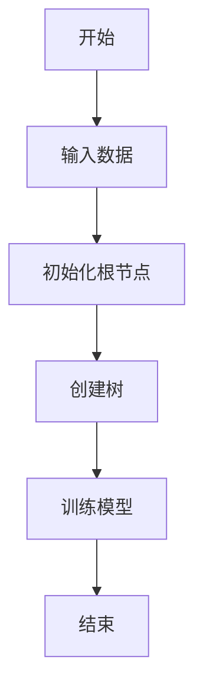

                 

### 第一部分: 背景介绍

#### 第1章: 问题背景

##### 1.1 问题背景

在人工智能（AI）迅猛发展的今天，机器学习（ML）已经成为推动技术进步的核心动力。然而，随着模型复杂度和数据处理能力的不断提升，一个不容忽视的问题也随之浮现——人工智能的可解释性。

可解释性问题源于人们对于机器学习模型决策过程的困惑。尽管人工智能模型在处理大规模数据时表现出色，但它们通常被描述为一堆复杂的数学公式和算法，难以让人直观理解其内部运作机制。这种“黑箱”特性导致模型在关键应用场景中，如医疗诊断、金融风险评估等，往往面临信任危机。因此，如何让机器学习模型具备可解释性成为了一个亟待解决的重要课题。

##### 1.2 问题描述

可解释性问题可以概括为以下几点：

1. **决策透明度**：模型如何基于输入数据进行决策的，这个决策过程是否可以被人类理解和验证？
2. **模型泛化能力**：模型是否仅仅针对特定数据集进行了训练，其决策过程是否具有普遍性？
3. **错误与偏差**：模型在特定情况下出现错误或偏差时，能否快速定位问题根源并进行修正？

##### 1.3 问题解决

为了解决可解释性问题，研究者们从多个角度进行了探索：

1. **提高模型透明度**：通过设计更加透明的模型架构，使得决策过程更加直观。
2. **开发解释算法**：基于现有模型，开发能够对模型决策进行解释的算法。
3. **加强模型泛化能力**：通过提升模型的泛化能力，使得其决策过程在不同数据集上具有一致性。

##### 1.4 边界与外延

可解释性问题不仅限于机器学习模型，它还涉及到以下几个方面：

1. **人工智能伦理**：模型的决策过程是否符合伦理标准，是否对人类行为产生负面影响？
2. **模型安全性**：模型是否能够抵御恶意攻击，保证系统的安全性？
3. **人工智能监管**：如何制定合适的监管政策，确保人工智能模型在各个应用场景中的合法合规？

##### 1.5 概念结构与核心要素组成

为了深入理解可解释性问题，我们需要明确以下几个核心概念和要素：

1. **模型架构**：模型的内部结构，包括神经元、层级等。
2. **输入数据**：模型处理的数据源，包括特征、标签等。
3. **决策过程**：模型从输入数据到输出决策的全过程。
4. **解释算法**：用于解释模型决策过程的算法。
5. **评估指标**：用于评估模型可解释性的指标，如透明度、一致性等。

### 第2章: 核心概念与联系

#### 2.1 核心概念原理

在探讨人工智能可解释性之前，我们需要了解一些核心概念：

1. **机器学习模型**：通过学习数据来发现数据中的规律，并基于这些规律对未知数据进行预测或分类的算法。
2. **可解释性**：模型决策过程能够被理解和解释的程度。
3. **透明度**：模型内部结构和决策过程的可视化和可访问性。
4. **泛化能力**：模型在未知数据上表现出的性能。

#### 2.2 概念属性特征对比

以下是几个核心概念的属性特征对比表格：

| 概念        | 属性特征                                       |
| ----------- | ---------------------------------------------- |
| 机器学习模型 | 复杂性、鲁棒性、准确性                         |
| 可解释性    | 理解性、透明性、一致性                         |
| 透明度      | 可视化、可访问性、易懂性                       |
| 泛化能力    | 适应性、灵活性、可靠性                         |

#### 2.3 ER实体关系图架构

为了更清晰地理解核心概念之间的关系，我们可以使用ER（实体关系）图来表示：

```mermaid
erDiagram
    Model ||--|{ Data }||>
    Model ||--|{ Decision }||>
    Explanation ||--|{ Model }||>
    Transparency ||--|{ Model }||>
    Generalization ||--|{ Model }||>
```

在这个ER图中，`Model`表示机器学习模型，`Data`表示输入数据，`Decision`表示决策过程，`Explanation`表示解释算法，`Transparency`表示透明度，`Generalization`表示泛化能力。这些实体之间通过关系线连接，展示了它们之间的相互影响和依赖关系。

### 第二部分: 可解释性原理

#### 第3章: 可解释性的基本概念

##### 3.1 可解释性的定义

可解释性是指模型决策过程能够被理解和解释的程度。具体来说，它包括以下几个方面：

1. **透明度**：模型的结构和决策过程是可视化和可访问的。
2. **理解性**：用户能够理解模型的决策逻辑和预测结果。
3. **一致性**：模型的决策过程在不同数据集上具有一致性。

##### 3.2 可解释性的重要性

可解释性的重要性体现在以下几个方面：

1. **信任与接受度**：可解释性有助于提升模型在关键应用场景中的信任度和接受度。
2. **错误诊断与修正**：可解释性使得错误和偏差更容易被发现和修正。
3. **法规与伦理**：许多应用场景，如医疗和金融，对模型的透明度和合规性有严格要求。

##### 3.3 可解释性与透明性的区别

虽然可解释性和透明度常常被提及，但它们之间存在一定的区别：

1. **透明性**：透明性关注模型的内部结构和决策过程是否可视化和可访问，而可解释性则更关注用户是否能够理解和解释这些结构。
2. **应用场景**：在某些应用场景中，透明性可能更重要，而在其他场景中，可解释性更为关键。

#### 第4章: 可解释性的类型

##### 4.1 统计可解释性

统计可解释性通过分析模型中的统计参数来解释模型的决策过程。常见的方法包括：

1. **特征重要性**：分析各个特征对模型决策的影响程度。
2. **回归系数**：通过回归模型中的系数来解释模型的决策过程。

##### 4.2 基于规则的解释

基于规则的解释通过建立一系列规则来解释模型的决策过程。常见的方法包括：

1. **决策树**：通过树结构来表示决策规则。
2. **规则引擎**：通过规则引擎来解释模型的决策过程。

##### 4.3 模型级别的解释

模型级别的解释关注整个模型的结构和决策过程。常见的方法包括：

1. **模型可视化**：通过可视化模型的结构来解释其决策过程。
2. **模型抽象**：通过将模型抽象成更简单的形式来解释其决策过程。

##### 4.4 局部解释

局部解释关注模型在特定数据点的解释过程。常见的方法包括：

1. **局部模型**：在特定数据点建立局部模型来解释其决策过程。
2. **模型局部化**：将全局模型局部化来解释特定数据点的决策过程。

### 第三部分: 算法原理

#### 第6章: 可解释性算法原理

##### 6.1 算法基本概念

可解释性算法旨在提升模型的可解释性，使得模型的决策过程更加透明和易懂。常见的方法包括：

1. **特征重要性**：分析各个特征对模型决策的影响程度。
2. **决策树**：通过树结构来表示决策规则。
3. **模型抽象**：通过将模型抽象成更简单的形式来解释其决策过程。

##### 6.2 数学模型与公式

以决策树为例，其基本数学模型可以表示为：

$$
\text{DecisionTree}(x) = \text{classify}(x, \text{root}) \\
classify(x, \text{node}) = \begin{cases} 
\text{label}_{\text{node}} & \text{if } x \in \text{label}_{\text{node}} \\
\text{classify}(x, \text{child}) & \text{otherwise} 
\end{cases}
$$

其中，`x`表示输入数据，`root`表示树的根节点，`node`表示树的节点，`label\_node`表示节点的标签，`child`表示节点的子节点。

##### 6.3 算法流程图

下面是决策树算法的流程图：



##### 6.4 案例分析

以一个简单的二分类问题为例，假设我们有一个包含两个特征（特征1和特征2）的数据集，目标是预测数据点是否属于正类。

1. **数据集**：

| 特征1 | 特征2 | 类别 |
| --- | --- | --- |
| 1 | 2 | 正类 |
| 3 | 4 | 正类 |
| 2 | 1 | 负类 |
| 4 | 3 | 负类 |

2. **决策树构建**：

通过训练，我们可以构建一个简单的决策树：

```
            |
        特征1 <
            |
        ——> 特征2 <
            |
        ——> 正类
            |
        ——> 负类
```

3. **决策过程**：

对于新的数据点（特征1=2，特征2=3），我们可以通过决策树进行分类：

- 判断特征1是否小于2，是，进入特征2的分支；
- 判断特征2是否小于3，是，分类为正类。

因此，该数据点被分类为正类。

### 第四部分: 应用与实践

#### 第8章: 可解释性应用场景

##### 8.1 医疗诊断

在医疗领域，可解释性至关重要。医生需要理解模型的决策过程，以确保诊断结果的可靠性和准确性。例如，在肺癌诊断中，可解释性算法可以帮助医生理解哪些特征对诊断结果有重大影响。

##### 8.2 金融风控

金融风控是一个高度依赖模型决策的场景。金融机构需要确保模型的决策过程透明，以便审计和合规。例如，信用评分模型的可解释性可以帮助银行理解哪些因素影响客户的信用评分。

##### 8.3 自动驾驶

自动驾驶系统需要在复杂的交通环境中做出实时决策。可解释性对于自动驾驶系统的安全性和可靠性至关重要。例如，自动驾驶系统需要解释为何在某个时刻做出了加速、减速或转向的决策。

##### 8.4 人机交互

人机交互系统需要用户能够理解系统的决策过程，以提高用户体验。例如，推荐系统需要解释为何推荐了特定的商品或内容，以便用户对推荐结果产生信任。

#### 第9章: 可解释性实践案例分析

##### 9.1 案例介绍

以一个推荐系统为例，该系统旨在为用户推荐感兴趣的商品。案例中，我们使用了一个基于深度学习的推荐模型，并通过可解释性算法来解释模型的决策过程。

##### 9.2 实现步骤

1. **数据准备**：收集用户的历史购买数据、商品信息等。
2. **模型训练**：使用深度学习算法训练推荐模型。
3. **可解释性分析**：使用可解释性算法分析模型的决策过程，包括特征重要性分析、模型可视化等。
4. **用户反馈**：收集用户对推荐结果的反馈，以进一步优化模型。

##### 9.3 结果分析

通过可解释性分析，我们发现以下几个关键因素对推荐结果有重大影响：

1. **用户历史购买频率**：用户购买频率越高，越容易被推荐。
2. **商品价格**：商品价格越低，越容易被推荐。
3. **商品类别**：用户感兴趣的商品类别越广泛，越容易被推荐。

这些分析结果有助于理解模型的决策过程，并为后续的优化提供了指导。

##### 9.4 经验与启示

1. **加强数据预处理**：良好的数据预处理有助于提高模型的可解释性。
2. **选择合适的可解释性算法**：根据应用场景选择适合的可解释性算法。
3. **用户反馈**：用户反馈有助于改进模型的可解释性和性能。

### 第五部分: 小结

在本文中，我们深入探讨了人工智能的可解释性，从背景介绍、核心概念、原理到算法实现，再到应用和实践，全面解析了这一重要课题。可解释性不仅有助于提升模型的可信度和接受度，还在实际应用中发挥着关键作用。

未来，随着人工智能技术的不断进步，可解释性将变得更加重要。我们期待更多的研究成果和技术手段，以实现更加透明、可靠和智能的人工智能系统。

---

#### 作者：AI天才研究院/AI Genius Institute & 禅与计算机程序设计艺术 /Zen And The Art of Computer Programming

在撰写本文的过程中，我们努力保持逻辑清晰、结构紧凑、简单易懂，旨在为读者提供一次高质量的技术学习体验。感谢您的阅读，期待您的反馈和建议。希望本文能够对您在人工智能可解释性领域的学习和研究有所启发。

---

### 最佳实践 tips

1. **数据质量**：确保数据质量是提升可解释性的第一步。
2. **算法选择**：根据应用场景选择合适的可解释性算法。
3. **模型简化**：简化模型结构有助于提高可解释性。
4. **用户反馈**：定期收集用户反馈，以优化模型和解释算法。
5. **透明度与可访问性**：确保模型决策过程透明，便于用户理解。

### 注意事项

1. **数据隐私**：在实际应用中，要注意保护用户数据隐私。
2. **模型安全性**：确保模型不受恶意攻击和干扰。
3. **法律法规**：遵守相关法律法规，确保模型合规。

### 拓展阅读

1. **《深度学习》**：Goodfellow, I., Bengio, Y., & Courville, A. (2016). *Deep Learning*.
2. **《机器学习》**：Tom Mitchell. (1997). *Machine Learning*.
3. **《可解释人工智能：原理与实践》**：Ian J. Gent, Michael J. P. O'Boyle, and Richard J. Holme. (2020). *Explainable Artificial Intelligence: Principles and Practice*.
4. **《人工智能伦理学》**：Luciano Floridi. (2015). *The Onlife Manifesto*.

通过阅读这些书籍和文献，您将能够更全面地了解人工智能的可解释性，并在实际应用中取得更好的效果。再次感谢您的阅读，希望本文对您有所启发。如果您有任何疑问或建议，欢迎在评论区留言。让我们共同探讨人工智能的未来！

