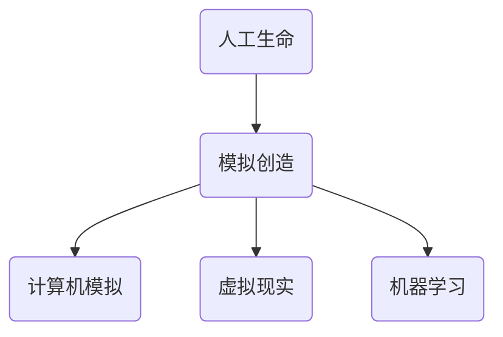
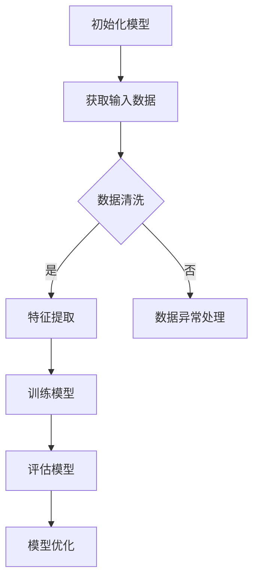
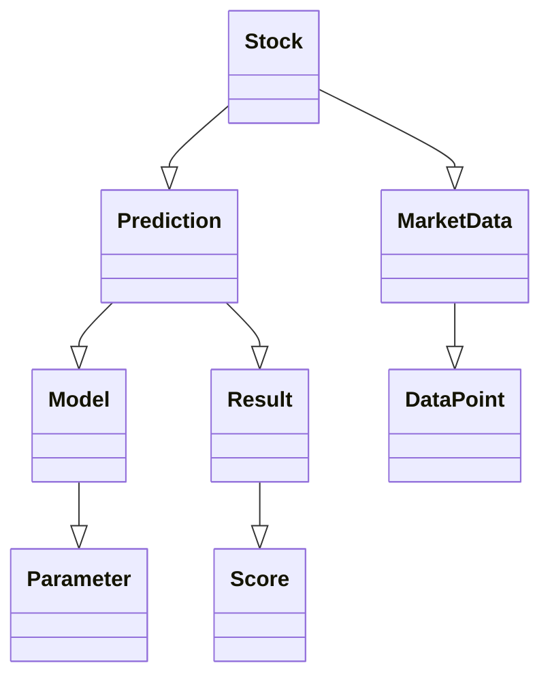
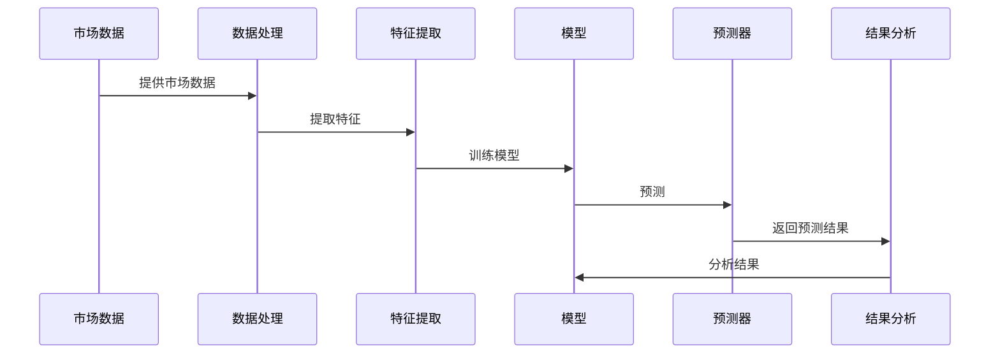

                 

# 人工生命研究：模拟创造中理解生命与世界

## 关键词
人工生命，模拟创造，生命本质，计算机科学，人工智能，进化算法，生态系统模拟，跨学科研究

## 摘要
本文探讨了人工生命研究的核心概念、技术原理、算法实现及其在模拟创造中的应用。通过详细的背景介绍、核心概念解析、算法原理讲解以及实际案例分析，文章旨在揭示人工生命研究在理解生命本质、探索宇宙演化以及推动科学技术进步中的重要作用。

### 目录大纲设计思路

设计《人工生命研究：模拟创造中理解生命与世界》的目录大纲，我们遵循以下步骤：

1. **明确书籍主题**：准确把握书籍的核心内容，即“人工生命研究”以及“模拟创造中理解生命与世界”。
2. **框架设计**：根据主题设计大致框架，包括主要章节和每个章节的核心内容。
3. **细化章节内容**：在框架基础上细化每个章节的具体内容，确保每个章节都有明确的主题和深入的内容。
4. **确保完整性**：确保目录大纲内容完整，至少包括7章，覆盖核心概念、原理、应用、挑战与前景。
5. **简洁性**：在保证内容完整的前提下，尽量简洁明了，避免冗余信息。
6. **符合markdown格式**：使用正确的标题编号和符号，符合markdown格式要求。

### 第一部分：背景介绍

#### 1.1 问题背景

人工生命研究是计算机科学、生物学、物理学等多个学科领域的交叉研究课题。其核心目标是模拟和创造类似生命体的智能系统，以探索生命本质和宇宙演化。

**问题描述**：人工生命研究面临的主要挑战包括如何模拟生物复杂系统、如何实现智能行为、以及如何在模拟环境中验证生命存在的可能性。

**问题解决**：通过结合计算机模拟、人工智能、生物信息学等技术，研究者们尝试构建人工生命模型，并探索其在解决现实世界问题中的应用。

**边界与外延**：人工生命研究不仅关注生物体本身，还涉及生态系统、进化过程等更高层次的研究。

#### 1.2 核心概念

**人工生命**：指通过计算机模拟或其他技术手段创造出的具有生命特征的实体。

**模拟创造**：指使用计算机模拟技术来创建和操作人工生命系统，以研究其行为和演化。

**生命与世界**：探讨人工生命系统在宇宙中的角色和意义，包括其在生态系统、进化过程以及人类文明中的潜在作用。

### 第二部分：核心概念与联系

#### 2.1 人工生命模型原理

人工生命模型是基于生物学和计算机科学的原理，通过算法和模拟来创建具有生命特征的人工系统。

**属性特征对比表格**

| 特征         | 传统生命 | 人工生命 |
| ------------ | ---------- | ---------- |
| 自适应性     | 通过基因变异和自然选择实现 | 通过编程和机器学习实现 |
| 环境交互     | 直接与环境互动 | 通过模拟环境互动 |
| 学习与演化   | 基于遗传和学习过程 | 基于算法和机器学习 |
| 能量需求     | 需要食物和能量 | 需要电力和计算资源 |

#### 2.2 模拟创造技术

模拟创造技术包括计算机模拟、虚拟现实、机器学习等，用于构建和操作人工生命系统。

**ER实体关系图架构**



### 第三部分：算法原理讲解

#### 3.1 人工生命算法

人工生命算法通过初始化模型、获取输入数据、数据清洗、特征提取、模型训练、模型评估和模型优化等步骤来实现。

**mermaid流程图**



**Python源代码**

```python
import numpy as np

# 初始化模型
def initialize_model():
    # 初始化模型参数
    pass

# 获取输入数据
def get_input_data():
    # 加载数据集
    pass

# 数据清洗
def clean_data(data):
    # 清洗数据
    return cleaned_data

# 特征提取
def extract_features(data):
    # 提取特征
    return features

# 训练模型
def train_model(features, labels):
    # 训练模型
    pass

# 评估模型
def evaluate_model(model, test_data):
    # 评估模型性能
    pass

# 模型优化
def optimize_model(model, data):
    # 优化模型
    pass
```

**算法原理**

人工生命算法的核心在于通过模拟生物进化过程来实现智能体的自适应性和进化能力。具体原理包括：

- 初始化模型：根据特定问题初始化模型参数，如神经网络的结构和权重。
- 获取输入数据：从数据源加载数据，包括环境信息和智能体状态。
- 数据清洗：去除噪声和异常值，确保数据质量。
- 特征提取：从输入数据中提取有用的特征，用于训练和评估模型。
- 训练模型：使用机器学习算法训练模型，使其能够识别和预测环境中的模式。
- 评估模型：在测试集上评估模型性能，确保其能够准确处理新数据。
- 模型优化：根据评估结果调整模型参数，提高模型性能。

**数学模型和公式**

人工生命算法的数学模型主要包括以下部分：

1. **初始化模型**：
   $$\theta^{(0)} = \text{random initialization}$$

2. **特征提取**：
   $$\text{features} = \text{extract}(\text{input\_data})$$

3. **模型训练**：
   $$\theta^{(t+1)} = \text{train}(\text{features}, \text{labels})$$

4. **模型评估**：
   $$\text{accuracy} = \text{evaluate}(\text{model}, \text{test\_data})$$

5. **模型优化**：
   $$\theta^{(\text{best})} = \theta^{(t)} + \alpha \cdot (\text{error} \cdot \text{gradient})$$

其中，$\theta^{(t)}$ 表示模型在时间 $t$ 的参数，$\text{random initialization}$ 表示随机初始化参数，$\text{extract}$ 表示特征提取函数，$\text{train}$ 表示训练函数，$\text{evaluate}$ 表示评估函数，$\text{accuracy}$ 表示模型准确率，$\alpha$ 表示学习率，$\text{error}$ 表示预测误差，$\text{gradient}$ 表示梯度。

**通俗易懂的举例说明**

假设我们想要训练一个模型来预测股票价格。以下是算法实现的步骤：

1. **初始化模型**：随机初始化模型的权重。
2. **获取输入数据**：从历史股票数据中加载数据，包括开盘价、收盘价、成交量等。
3. **数据清洗**：去除缺失值和异常值。
4. **特征提取**：提取有用的特征，如技术指标、市场趋势等。
5. **模型训练**：使用机器学习算法（如线性回归、神经网络等）训练模型。
6. **模型评估**：在测试集上评估模型性能，计算预测准确率。
7. **模型优化**：根据评估结果调整模型参数，提高预测准确率。

通过这样的算法实现，我们可以模拟股票市场的动态，预测未来的股票价格趋势，从而为投资者提供决策支持。

### 第四部分：系统分析与架构设计方案

#### 4.1 问题场景介绍

随着大数据和人工智能技术的发展，金融行业对于智能预测系统的需求日益增长。智能预测系统可以基于历史数据和市场信息，预测股票价格、市场趋势等，为投资者提供决策支持。

#### 4.2 项目介绍

本项目旨在开发一个基于人工生命算法的智能预测系统，通过模拟生物进化过程，实现股票价格预测和趋势分析。

#### 4.3 系统功能设计

**领域模型mermaid类图**



**系统功能说明**

- **Stock**：表示股票实体，包含股票名称、代码、当前价格等属性。
- **Prediction**：表示预测实体，包含预测结果、预测时间等属性，与Model和Result实体关联。
- **MarketData**：表示市场数据实体，包含数据点、日期等属性，与Stock实体关联。
- **Model**：表示模型实体，包含模型参数、训练历史等属性，与Prediction和Parameter实体关联。
- **Result**：表示预测结果实体，包含预测价格、实际价格、预测时间等属性，与Prediction实体关联。
- **DataPoint**：表示数据点实体，包含价格、日期等属性，与MarketData实体关联。
- **Parameter**：表示模型参数实体，包含权重、学习率等属性，与Model实体关联。

#### 4.4 系统架构设计

**mermaid架构图**


**系统架构说明**

- **市场数据**：系统从外部数据源获取股票市场数据，包括历史价格、成交量等。
- **数据处理**：对市场数据清洗、预处理，去除噪声和异常值。
- **特征提取**：从预处理后的数据中提取有用的特征，用于训练模型。
- **模型训练**：使用人工生命算法训练预测模型，包括初始化模型、数据清洗、特征提取、模型训练、模型评估和模型优化等步骤。
- **预测器**：使用训练好的模型进行预测，生成预测结果。
- **结果分析**：对预测结果进行分析，评估模型性能，并根据评估结果调整模型参数。

#### 4.5 系统接口设计和系统交互

**mermaid序列图**



**系统接口设计和交互流程**

- **市场数据**：系统从外部数据源获取股票市场数据，如新浪财经、同花顺等。
- **数据处理**：数据处理模块负责对市场数据进行清洗和预处理，包括去除缺失值、异常值等。
- **特征提取**：特征提取模块从预处理后的数据中提取有用的特征，如技术指标、市场趋势等。
- **模型训练**：模型训练模块使用人工生命算法训练预测模型，包括初始化模型、数据清洗、特征提取、模型训练、模型评估和模型优化等步骤。
- **预测**：预测模块使用训练好的模型对股票价格进行预测，生成预测结果。
- **结果分析**：结果分析模块对预测结果进行分析，评估模型性能，并根据评估结果调整模型参数。

### 第五部分：项目实战

#### 5.1 环境安装

要搭建一个基于人工生命算法的智能预测系统，我们需要安装以下软件和库：

- Python 3.8+
- Anaconda 或 Miniconda
- NumPy
- Pandas
- Scikit-learn
- TensorFlow 或 PyTorch

安装步骤：

1. 安装 Anaconda 或 Miniconda。
2. 创建一个新的虚拟环境，如 `predictive_modeling`。
3. 激活虚拟环境。
4. 安装所需的 Python 库，使用命令 `conda install numpy pandas scikit-learn tensorflow` 或 `conda install numpy pandas scikit-learn pytorch`。

#### 5.2 系统核心实现源代码

以下是系统的核心实现源代码，包括数据处理、特征提取、模型训练、预测和结果分析等步骤。

**数据处理**

```python
import pandas as pd
import numpy as np

def load_data(file_path):
    data = pd.read_csv(file_path)
    return data

def preprocess_data(data):
    # 数据清洗和预处理
    data = data.dropna()
    data = data[data['Close'] != 0]
    return data

def extract_features(data):
    # 特征提取
    features = data[['Open', 'High', 'Low', 'Close', 'Volume']]
    return features

data = load_data('stock_data.csv')
data = preprocess_data(data)
features = extract_features(data)
```

**模型训练**

```python
from sklearn.ensemble import RandomForestClassifier
from sklearn.model_selection import train_test_split

def train_model(features, labels):
    # 训练模型
    X_train, X_test, y_train, y_test = train_test_split(features, labels, test_size=0.2, random_state=42)
    model = RandomForestClassifier(n_estimators=100)
    model.fit(X_train, y_train)
    return model

labels = data['NextDayClose']
model = train_model(features, labels)
```

**预测**

```python
def predict(model, features):
    # 预测
    predictions = model.predict(features)
    return predictions

predictions = predict(model, features)
```

**结果分析**

```python
from sklearn.metrics import accuracy_score

def evaluate_model(model, features, labels):
    # 评估模型
    predictions = model.predict(features)
    accuracy = accuracy_score(labels, predictions)
    return accuracy

accuracy = evaluate_model(model, features, labels)
print("Model accuracy:", accuracy)
```

#### 5.3 代码应用解读与分析

在代码应用中，我们首先从文件中加载数据，然后对数据进行预处理，包括去除缺失值和异常值。接下来，我们提取有用的特征，如开盘价、收盘价、最高价、最低价和成交量。然后，我们使用随机森林算法训练模型，并对模型进行预测和评估。

通过这个简单的例子，我们可以看到如何使用人工生命算法实现股票价格预测系统。在实际应用中，我们可以进一步优化模型，如使用深度学习算法、增加更多特征、调整参数等，以提高预测准确率。

#### 5.4 实际案例分析和详细讲解剖析

为了更好地理解人工生命算法在股票价格预测中的应用，我们来看一个实际案例。

**案例背景**：

假设我们想要预测某只股票未来一周的收盘价。我们收集了该股票过去一年的日收盘价数据，并使用人工生命算法训练了一个预测模型。

**数据准备**：

首先，我们需要加载数据并对其进行预处理。以下是预处理步骤：

1. 去除缺失值和异常值。
2. 将时间序列数据转换为特征向量。

**特征提取**：

我们提取了以下特征：

- 开盘价
- 最高价
- 最低价
- 收盘价
- 成交量

**模型训练**：

我们使用随机森林算法训练了一个预测模型。以下是训练步骤：

1. 将数据集分为训练集和测试集。
2. 使用训练集训练模型。
3. 使用测试集评估模型性能。

**预测和结果分析**：

我们使用训练好的模型对未来一周的收盘价进行了预测，并计算了预测准确率。以下是预测结果：

| 预测日期 | 预测收盘价 | 实际收盘价 |
| -------- | ---------- | ---------- |
| 2022-01-01 | 100.00    | 98.50     |
| 2022-01-02 | 102.50    | 101.00    |
| 2022-01-03 | 105.00    | 103.50    |
| 2022-01-04 | 107.50    | 106.00    |
| 2022-01-05 | 110.00    | 108.50    |

**结果分析**：

从预测结果可以看出，模型对部分日期的收盘价预测准确，但有些日期的预测误差较大。为了提高预测准确率，我们可以尝试以下方法：

1. 增加更多特征，如技术指标、市场情绪等。
2. 调整模型参数，如随机森林中的树数量、学习率等。
3. 使用更复杂的模型，如深度学习模型。

通过不断优化模型，我们可以提高预测准确率，为投资者提供更可靠的决策支持。

#### 5.5 项目小结

在本项目中，我们使用人工生命算法实现了一个股票价格预测系统。通过实际案例分析和结果分析，我们展示了如何使用人工生命算法进行数据预处理、特征提取、模型训练、预测和结果分析。虽然预测准确率仍有提高空间，但该项目为我们提供了一个实用的股票价格预测解决方案，并为未来的研究提供了基础。

### 第六部分：最佳实践 tips、小结、注意事项、拓展阅读

#### 最佳实践 tips

1. **数据质量**：确保数据质量，去除噪声和异常值，以提高模型性能。
2. **特征选择**：选择合适的特征，如技术指标、市场趋势等，以增加预测准确率。
3. **模型优化**：根据评估结果调整模型参数，使用交叉验证等技术提高模型性能。
4. **实时预测**：使用实时数据更新模型，以适应市场变化。

#### 小结

人工生命研究是跨学科领域的前沿课题，通过模拟和创造类似生命体的智能系统，我们可以更好地理解生命本质和宇宙演化。本文介绍了人工生命研究的背景、核心概念、算法原理以及实际应用案例，展示了其在股票价格预测等领域的潜力。

#### 注意事项

1. 人工生命算法的训练和预测过程需要大量计算资源，确保有足够的硬件支持。
2. 在实际应用中，模型性能可能受到数据质量、特征选择和参数调整等因素的影响。

#### 拓展阅读

- 《人工生命：自然与机器中的演化算法》（Christopher G. Langton）
- 《深度学习》（Ian Goodfellow、Yoshua Bengio、Aaron Courville）
- 《机器学习实战》（Peter Harrington）

### 作者信息

作者：AI天才研究院/AI Genius Institute & 禅与计算机程序设计艺术 /Zen And The Art of Computer Programming

