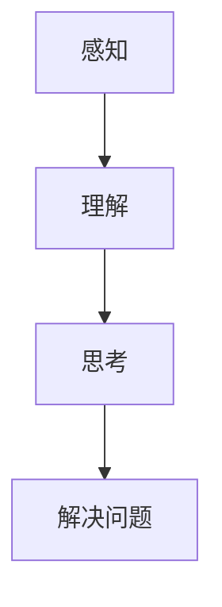
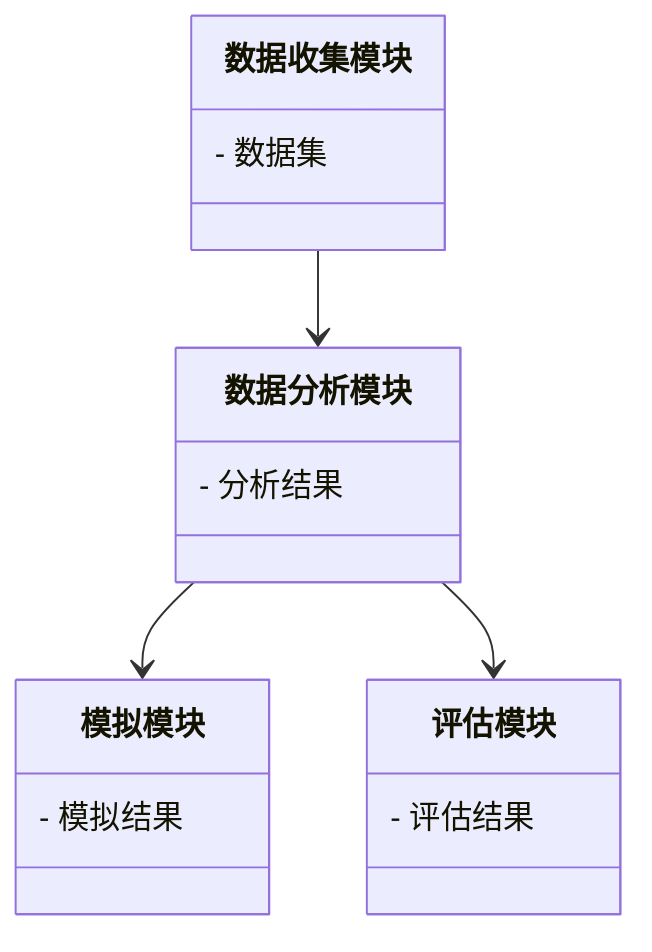
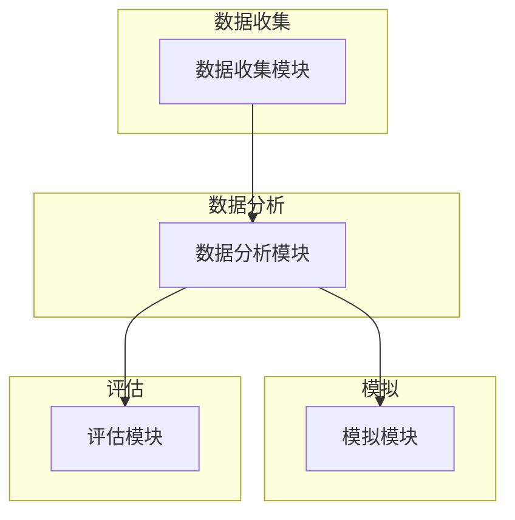
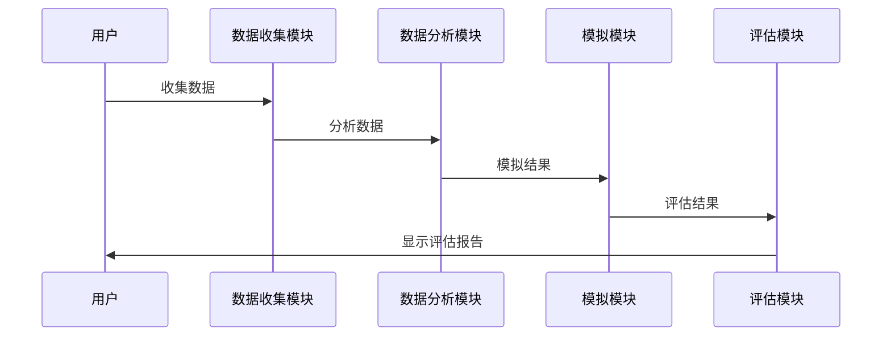
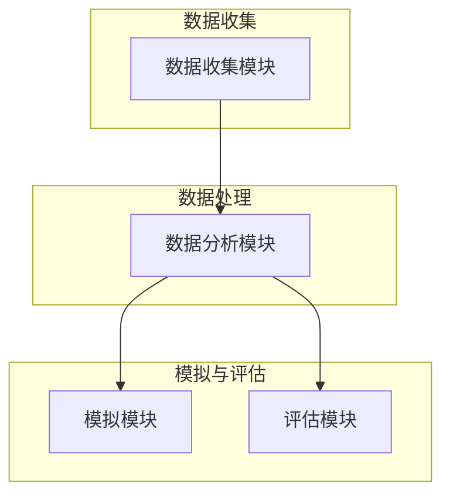
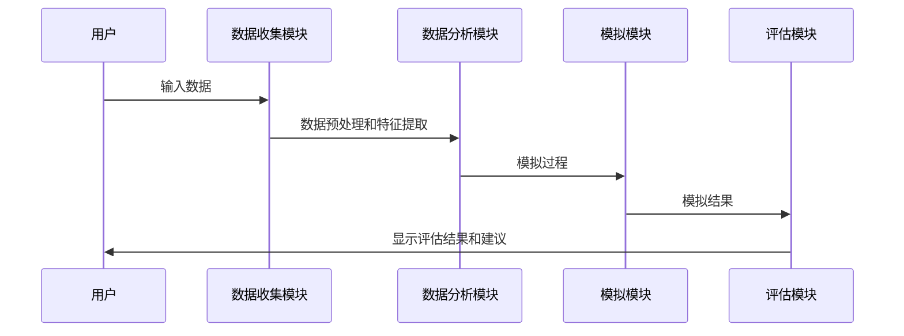

                 

### 引言

人类思维模式，作为人类认知世界、解决问题和创造新知的核心工具，长期以来受到了哲学、心理学、认知科学等领域的广泛关注。然而，在探索宇宙这一宏大主题中，人类思维模式的作用和影响尤为显著。随着科技的迅猛发展，人类对宇宙的认识不断深入，从宏观的星系、黑洞，到微观的量子力学，每一项科学发现都离不开人类思维模式的推动。然而，对于宇宙本质的理解，人类思维模式是否足以胜任这一重任？本文将围绕这一主题展开深入探讨。

宇宙，作为一个无穷广袤、复杂多变的系统，其本质长期以来是人类思考的重大难题。从古希腊哲学家到现代科学家，无数智者试图揭开宇宙的奥秘。然而，无论是牛顿的万有引力定律，还是爱因斯坦的广义相对论，都只能部分解释宇宙现象。随着量子力学和宇宙学的进一步发展，人类对宇宙的认识陷入了更为复杂的悖论和未解之谜。

人类思维模式在这一过程中起到了至关重要的作用。思维模式决定了人类如何感知宇宙、理解宇宙，以及如何构建科学理论来解释宇宙现象。然而，思维模式本身也存在局限性，如认知偏见、逻辑谬误等，这些局限性可能影响我们对宇宙本质的准确理解。因此，探讨人类思维模式对宇宙本质理解的影响，不仅有助于我们更深入地认识宇宙，也为改进人类思维模式提供了新的视角。

本文将从以下几个方面展开论述：

1. **背景介绍**：介绍人类思维模式的核心概念，探讨宇宙观的定义和特点，以及人类思维模式与宇宙观之间的联系。
2. **核心概念与联系**：详细阐述人类思维模式的运作原理、特点，以及宇宙观的形成和发展过程，分析两者之间的相互影响。
3. **算法原理讲解**：运用流程图和数学模型，详细讲解人类思维模式对宇宙观影响的分析方法。
4. **系统分析与架构设计方案**：介绍一个模拟人类思维模式对宇宙观影响的研究系统，包括系统功能设计、架构设计等。
5. **项目实战**：通过一个实际案例，展示如何应用本文的理论和方法，进行人类思维模式对宇宙本质理解的影响研究。
6. **总结与展望**：总结本文的主要观点，探讨未来研究的方向。

通过本文的深入探讨，我们希望能够为理解人类思维模式在宇宙探索中的角色提供新的视角，也为改进人类思维模式，更好地把握宇宙本质提供有益的参考。接下来，我们将首先从背景介绍部分开始，逐步深入这一宏大的主题。

---

### 背景介绍

#### 核心概念

在探讨人类思维模式对宇宙本质理解的影响之前，我们需要明确一些核心概念，包括人类思维模式、宇宙观、科学方法论等。

##### 1. 人类思维模式

**定义**：人类思维模式是指人类在感知、理解、思考和解决问题时所采用的方法和方式。它包括多个层次，如感知、认知、推理、判断等。

**特点**：

1. **多元性**：人类思维模式不仅仅依赖于理性思考，还包括感性思维、直觉思维和创造性思维等多种形式。
2. **抽象性**：人类能够通过抽象概念和符号系统，进行复杂问题的分析和解决。
3. **逻辑性**：人类思维模式强调逻辑推理，通过一系列逻辑步骤来推导出结论。
4. **适应性**：人类思维模式能够根据不同情境进行适应性调整，以应对复杂多变的问题。

##### 2. 宇宙观

**定义**：宇宙观是指人类对宇宙的认识和理解，包括宇宙的起源、演化、结构、本质等方面。

**特点**：

1. **客观性**：宇宙观是基于对宇宙现象的观察和实验数据得出的结论，具有一定的客观性。
2. **主观性**：宇宙观也受到人类认知能力的限制，不同文化和历史背景下的宇宙观存在差异。
3. **知识性**：宇宙观是人类通过科学研究和哲学思考积累的知识体系。
4. **哲学性**：宇宙观不仅涉及科学知识，还包括对宇宙本质的哲学探讨。

##### 3. 科学方法论

**定义**：科学方法论是指科学家在研究过程中采用的方法和原则，包括观察、实验、假设、推理、验证等步骤。

**特点**：

1. **系统性**：科学方法论强调系统性思维，通过逻辑步骤和科学方法，逐步深入地研究问题。
2. **实证性**：科学方法论依赖于实证数据，通过观察和实验来验证假设。
3. **批判性**：科学方法论鼓励批判性思维，对已有理论和观点进行质疑和验证。
4. **迭代性**：科学方法论是一个不断迭代和改进的过程，通过不断的研究和验证，推动科学知识的进步。

#### 问题背景

随着科学技术的不断发展，人类对宇宙的认识不断深入。从古代的天文学到现代的宇宙学，人类对宇宙的理解从宏观的天体运动，到微观的量子世界，每一个阶段都标志着人类认知能力的重大进步。

然而，对宇宙本质的理解仍然存在许多未知和疑惑。例如：

1. **宇宙的起源**：宇宙是如何起源的？是否存在大爆炸之前的状态？
2. **宇宙的结构**：宇宙是如何演化的？星系、黑洞、暗物质等宇宙现象的本质是什么？
3. **宇宙的本质**：宇宙是否有一个统一的原理或规则？是否存在超越物质和能量的高级存在？

这些问题不仅挑战着人类的认知能力，也引发了关于人类思维模式在宇宙探索中作用和局限性的深刻思考。

#### 问题描述

人类思维模式在宇宙探索中的作用和影响主要体现在以下几个方面：

1. **感知与理解**：人类通过感官和认知系统感知宇宙现象，并通过思维模式对这些现象进行理解和解释。
2. **科学理论的构建**：人类思维模式帮助科学家构建科学理论，以解释和预测宇宙现象。
3. **科学研究的方法**：人类思维模式影响科学方法论的选择和应用，进而影响科学研究的进展。

然而，人类思维模式也存在一定的局限性：

1. **认知偏见**：人类思维模式受到认知偏见的影响，可能导致对宇宙现象的片面理解。
2. **逻辑谬误**：人类思维模式中存在逻辑谬误，可能导致科学理论的错误推导。
3. **信息处理能力**：人类思维模式在处理大量复杂信息时存在局限性，可能影响对宇宙本质的全面理解。

#### 问题解决

为了解决人类思维模式在宇宙探索中存在的问题，我们需要：

1. **改进思维模式**：通过哲学、心理学、认知科学等多学科研究，改进人类思维模式，提高对宇宙现象的感知和理解能力。
2. **跨学科合作**：鼓励跨学科合作，综合不同领域的知识和方法，提高对宇宙本质的理解。
3. **技术手段的运用**：利用先进的科学仪器和技术手段，提高对宇宙现象的观测和测量精度。
4. **批判性思维**：培养批判性思维，对已有理论和观点进行质疑和验证，促进科学知识的发展。

#### 边界与外延

本文主要关注人类思维模式对宇宙本质理解的影响，而不涉及其他领域的影响。例如，人类思维模式在社会、经济、文化等领域的影响不在本文的讨论范围内。

#### 概念结构与核心要素组成

本文的概念结构与核心要素组成包括：

1. **人类思维模式**：包括感知、理解、思考和解决问题的方法和方式。
2. **宇宙观**：包括对宇宙的起源、演化、结构、本质等方面的认识和理解。
3. **科学方法论**：包括观察、实验、假设、推理、验证等科学研究的方法和原则。

通过以上背景介绍，我们为接下来的深入探讨奠定了基础。在接下来的部分中，我们将详细分析人类思维模式的基本特征和运作原理，以及宇宙观的定义和特点，探讨两者之间的密切联系。

---

### 核心概念与联系

#### 1.2 人类思维模式概述

##### 1.2.1 人类思维模式的定义

**定义**：人类思维模式是指人类在感知、理解、思考和解决问题时所采用的方法和方式。它包括多个层次，如感知、认知、推理、判断等，是认知过程中不可或缺的组成部分。

##### 1.2.2 人类思维模式的特点

**特点**：

1. **理性思维与感性思维的结合**：人类思维模式不仅依赖于逻辑推理和理性分析，还融合了感性思维和直觉。感性思维帮助人们更好地感知和理解复杂的情感和情境，直觉思维则在瞬间捕捉到问题的本质，提供创新的解决方案。

2. **直观性与抽象性的统一**：人类思维模式能够将直观感受和抽象概念相结合。在处理具体问题时，人们能够通过直观感知迅速把握问题核心；在理论构建和科学研究中，人们能够通过抽象思维对现象进行概括和总结。

3. **逻辑性与创造性的融合**：逻辑性是人类思维模式的核心特征，通过逻辑推理，人们能够从已知信息中推导出新知识。同时，创造性思维在人类思维模式中发挥了重要作用，它使得人类能够超越现有知识框架，提出新的理论和假设。

##### 1.2.3 人类思维模式与宇宙观的关系

**关系**：人类思维模式直接影响宇宙观的建立和演变，从而影响对宇宙本质的理解。具体来说，人类思维模式与宇宙观之间的联系可以从以下几个方面进行探讨：

1. **感知与理解**：人类通过感官和认知系统感知宇宙现象，并通过思维模式对这些现象进行理解和解释。这种感知和理解过程依赖于人类思维模式的特点，如理性思维、直观性和抽象性等。

2. **科学理论的构建**：人类思维模式帮助科学家构建科学理论，以解释和预测宇宙现象。例如，在牛顿力学的构建过程中，人类思维模式的理性思维和逻辑推理起到了关键作用。

3. **科学研究的方法**：人类思维模式影响科学方法论的选择和应用，进而影响科学研究的进展。科学方法论中的观察、实验、假设、推理和验证等步骤，都是在人类思维模式的指导下进行的。

4. **认知偏见与宇宙观**：人类思维模式中的认知偏见可能影响对宇宙现象的感知和理解。例如，人类常常倾向于用已知的知识框架去解释未知现象，这可能导致对宇宙本质的片面理解。

#### 1.3 宇宙观概述

##### 1.3.1 宇宙观的定义

**定义**：宇宙观是指人类对宇宙的认识和理解，包括宇宙的起源、演化、结构、本质等方面。它是人类在长期科学研究和哲学思考中积累的知识体系，是认识世界的重要工具。

##### 1.3.2 宇宙观的特点

**特点**：

1. **客观性与主观性的统一**：宇宙观是基于对宇宙现象的观察和实验数据得出的结论，具有一定的客观性。然而，由于人类认知能力的限制，宇宙观也受到主观因素的影响，不同文化和历史背景下的宇宙观存在差异。

2. **知识性与哲学性的结合**：宇宙观不仅是科学知识的积累，还包含对宇宙本质的哲学探讨。例如，古代哲学家和现代科学家都在探讨宇宙是否有统一的原理或规则，这种哲学性的思考与科学知识相结合，构成了现代宇宙观的重要组成部分。

3. **发展性与稳定性的共存**：宇宙观是一个不断发展的知识体系，随着科学技术的进步和科学研究的深入，我们对宇宙的认识也在不断更新和完善。然而，宇宙观的一些基本原理和概念，如宇宙的起源、演化和结构，具有一定的稳定性，是长期共识的基础。

##### 1.3.3 人类思维模式与宇宙观的关系

**关系**：宇宙观是人类思维模式的产物，反过来又影响人类思维模式的发展。具体来说，人类思维模式与宇宙观之间的关系可以从以下几个方面进行探讨：

1. **宇宙观的形成**：宇宙观的形成过程受到人类思维模式的影响。人类通过感知、理解和思考宇宙现象，逐步构建起对宇宙的认识。这种认识过程依赖于人类思维模式的特点，如理性思维、直观性和抽象性等。

2. **宇宙观的发展**：宇宙观的发展过程也受到人类思维模式的影响。随着科学技术的进步和人类认知能力的提高，我们对宇宙的认识不断深化和扩展。这种发展过程需要新的思维模式和科学方法的支持。

3. **宇宙观的影响**：宇宙观不仅影响人类对宇宙现象的理解和解释，也影响人类对其他领域问题的思考。例如，现代宇宙观中的许多概念，如时空、引力、量子力学等，已经渗透到物理学、天文学、哲学等各个领域。

通过以上对人类思维模式和宇宙观的概述，我们可以看到，两者之间存在着密切的联系和相互影响。在接下来的部分中，我们将进一步分析人类思维模式的运作原理，探讨其对宇宙观的影响。

---

#### 1.2.1 人类思维模式的定义

**定义**：人类思维模式是指人类在感知、理解、思考和解决问题时所采用的方法和方式。它涵盖了从感知到认知，再到推理和判断等多个层次，是认知过程中不可或缺的组成部分。

人类思维模式不仅是一种内在的心理过程，更是人类社会发展和文明进步的重要驱动力。具体来说，人类思维模式可以分解为以下几个关键组成部分：

1. **感知**：感知是人类获取外界信息的第一步，包括视觉、听觉、嗅觉、味觉和触觉等感官活动。这些感官活动通过神经系统将外界信息传递到大脑，为后续的认知和理解提供基础。

2. **认知**：认知是指人类对感知信息进行处理和理解的过程。它包括注意、记忆、思维和语言等能力。通过认知，人类能够从杂乱无章的信息中提取有用的知识，形成对世界的认识。

3. **理解**：理解是指人类对事物本质和内在联系的把握。它涉及到对信息的解释、分类和整合。通过理解，人类能够将感知到的信息转化为有意义的知识，从而更好地适应和应对环境。

4. **推理和判断**：推理和判断是指人类在已有信息的基础上，通过逻辑思维得出新结论的能力。推理包括演绎推理和归纳推理两种形式，分别从一般到个别的逻辑推理和从个别到一般的逻辑推理。判断则是基于推理的结果，对事物的性质、关系和可能性做出评估。

5. **问题解决**：问题解决是人类思维模式的重要组成部分，它涉及到识别问题、制定解决方案、执行方案和评估结果等步骤。通过问题解决，人类能够有效地应对复杂和不确定的环境。

**主要分类**：

1. **直觉思维**：直觉思维是一种快速、直接的理解方式，它往往不依赖于逻辑推理，而是基于经验、感觉和直觉。直觉思维在紧急情况下尤为重要，能够迅速做出决策。

2. **逻辑思维**：逻辑思维是一种基于逻辑规则和推理方法的思维过程，它强调推理的严谨性和一致性。逻辑思维是科学研究和理论构建的基础。

3. **创造性思维**：创造性思维是一种创新性的思维方式，它强调突破传统思维框架，提出新的想法和解决方案。创造性思维在科技、艺术和商业等领域具有重要意义。

4. **批判性思维**：批判性思维是一种质疑和评估已有知识和观点的思维方式，它强调理性分析和批判性思考。批判性思维有助于发现和纠正错误，提高认知的准确性和深度。

**关系**：

人类思维模式的各个组成部分之间相互联系、相互作用，共同构成了一个复杂的认知系统。例如，感知是理解的基础，理解是推理的前提，推理和判断则指导问题解决。同时，不同类型的思维模式之间也存在密切的互动，如直觉思维和逻辑思维的结合，创造性和批判性思维的平衡等，这些互动和平衡有助于人类更全面、更深入地认识世界。

通过以上对人类思维模式的定义和分类的详细阐述，我们可以更好地理解人类思维模式的本质和作用。在接下来的部分中，我们将进一步探讨人类思维模式的特点，分析其对宇宙观的影响。

---

#### 1.2.2 人类思维模式的特点

**特点**：

1. **理性思维与感性思维的结合**：

理性思维是人类思维模式的核心特征，它强调逻辑推理、分析和实证验证。通过理性思维，人类能够从已知的事实和数据中推导出新的结论，建立科学理论和模型。例如，牛顿的万有引力定律就是通过逻辑推理和数学模型得出的。

感性思维则侧重于情感、直觉和直观感受。它帮助人类在复杂、不确定的情况下快速做出决策。感性思维常常在不依赖逻辑推理的情况下，通过直觉捕捉问题的本质。例如，医生在诊断疾病时，可能会根据病人的症状和体征，迅速判断病情。

理性思维与感性思维的结合，使得人类能够在不同情境下灵活运用不同的思维方式，更全面地理解和解决问题。

2. **直观性与抽象性的统一**：

直观性是人类思维模式的一种基本特点，它强调通过感官和直接经验来理解和解释世界。直观思维使得人类能够迅速感知和理解复杂现象，提供一种直接的、直觉性的认知方式。例如，人们在日常生活中，通过观察天气变化来预测天气情况。

抽象性则强调通过概念、符号和理论来理解和表达复杂现象。抽象思维使得人类能够将具体的事物和现象归纳为一般性的规律和原则。例如，科学家通过实验和观察，抽象出物理定律，以解释自然现象。

直观性与抽象性的统一，使得人类能够在具体与一般、直观与理论之间灵活转换，从而更深入、更全面地认识世界。

3. **逻辑性与创造性的融合**：

逻辑性是人类思维模式的重要特征，它强调通过逻辑推理和演绎来推导结论。逻辑思维使人类能够从已知的事实中，通过一系列严密的推理步骤，得出新的结论。例如，在科学研究中，通过逻辑推理，科学家可以从实验数据和假设中推导出新的科学理论。

创造性则强调突破传统思维框架，提出新的想法和解决方案。创造性思维在科技、艺术和商业等领域具有重要意义，它使得人类能够不断突破自我，创造新的价值。例如，科技创新中的许多突破，都是通过创造性思维实现的。

逻辑性与创造性的融合，使得人类能够在严谨和创新的平衡中，不断推进科学和社会的发展。

通过以上对人类思维模式特点的详细分析，我们可以看到，理性思维与感性思维、直观性与抽象性、逻辑性与创造性的结合，使得人类思维模式成为一个强大而灵活的认知工具。在接下来的部分中，我们将探讨人类思维模式与宇宙观的关系，分析人类思维模式如何影响宇宙观的建立和演变。

---

#### 1.2.3 人类思维模式与宇宙观的关系

**关系**：

人类思维模式与宇宙观之间存在着密切而复杂的关系。这种关系不仅体现在宇宙观的建立和演变过程中，也反映在人类对宇宙本质理解的过程中。具体来说，人类思维模式对宇宙观的影响可以从以下几个方面进行探讨：

1. **宇宙观的建立**：

宇宙观的建立是人类思维模式的产物。人类通过感知、理解和推理，逐步形成了对宇宙的认识。这种认识过程依赖于人类思维模式的特点，如理性思维、直观性和抽象性等。例如，古代哲学家通过观察天体的运动，提出了地心说和日心说的宇宙模型，这些模型反映了当时人类思维模式的特点和局限性。

2. **宇宙观的演变**：

宇宙观并不是静止不变的，而是随着人类认知能力的提高和科学技术的进步，不断演变和发展的。这种演变过程同样受到人类思维模式的影响。例如，随着牛顿力学的提出，人类对宇宙的理解有了新的突破；随着量子力学和相对论的发展，人类对宇宙的认识更加深入和复杂。每一次科学革命的背后，都是人类思维模式的进步和变革。

3. **宇宙观的多样性**：

不同文化和历史背景下的宇宙观存在显著的差异。这种差异不仅反映了不同人类思维模式的特点，也体现了人类对宇宙理解的多样性。例如，古代中国的“五行说”和古希腊的“原子论”，都是不同文化背景下形成的宇宙观。这些宇宙观虽然存在差异，但都反映了人类对宇宙本质的探索和思考。

4. **思维模式的局限性**：

人类思维模式在影响宇宙观建立和演变的过程中，也表现出一定的局限性。认知偏见、逻辑谬误等思维模式中的问题，可能导致对宇宙现象的片面理解和错误解释。例如，人类常常倾向于用已知的知识框架去解释未知现象，这可能导致对宇宙本质的误解。此外，人类思维模式的抽象性和逻辑性，也可能限制对宇宙复杂现象的全面理解。

5. **思维模式的改进**：

为了克服人类思维模式的局限性，我们需要不断改进思维模式，提高对宇宙本质的把握。通过哲学、心理学、认知科学等多学科的研究，我们可以更深入地理解人类思维模式的运作原理和局限性，从而提出新的思维方法和理论。例如，批判性思维、跨学科思维和系统思维等方法，都有助于改进人类思维模式，提高对宇宙本质的理解。

通过以上分析，我们可以看到，人类思维模式对宇宙观的影响是深远而复杂的。理解这种关系，不仅有助于我们更深入地认识宇宙，也为改进人类思维模式，提高对宇宙本质的把握提供了新的视角。在接下来的部分中，我们将进一步探讨人类思维模式的基本原理，分析其对宇宙观的影响。

---

#### 1.3 宇宙观概述

##### 1.3.1 宇宙观的定义

**定义**：宇宙观是指人类对宇宙的认识和理解，它涵盖了宇宙的起源、演化、结构、本质等方面。宇宙观不仅涉及科学知识，还包括哲学思考和人文观念。

##### 1.3.2 宇宙观的特点

**特点**：

1. **客观性与主观性的统一**：

宇宙观的客观性体现在其对宇宙现象的描述和解释是基于观察和实验数据的，具有科学性。然而，宇宙观的主观性也难以避免，因为人类对宇宙的理解受到认知能力的限制，不同文化、历史和个体背景下的宇宙观存在差异。

2. **知识性与哲学性的结合**：

宇宙观不仅是科学知识的积累，还包含对宇宙本质的哲学探讨。例如，古代哲学家和现代科学家都在探讨宇宙是否有统一的原理或规则，这种哲学性的思考与科学知识相结合，构成了现代宇宙观的重要组成部分。

3. **发展性与稳定性的共存**：

宇宙观是一个不断发展的知识体系，随着科学技术的进步和科学研究的深入，我们对宇宙的认识也在不断更新和完善。然而，宇宙观的一些基本原理和概念，如宇宙的起源、演化和结构，具有一定的稳定性，是长期共识的基础。

##### 1.3.3 人类思维模式与宇宙观的关系

**关系**：宇宙观是人类思维模式的产物，反过来又影响人类思维模式的发展。具体来说，人类思维模式与宇宙观之间的关系可以从以下几个方面进行探讨：

1. **宇宙观的形成**：

宇宙观的形成过程受到人类思维模式的影响。人类通过感知、理解和思考宇宙现象，逐步构建起对宇宙的认识。这种认识过程依赖于人类思维模式的特点，如理性思维、直观性和抽象性等。

2. **宇宙观的发展**：

宇宙观的发展过程也受到人类思维模式的影响。随着科学技术的进步和人类认知能力的提高，我们对宇宙的认识不断深化和扩展。这种发展过程需要新的思维模式和科学方法的支持。

3. **宇宙观的影响**：

宇宙观不仅影响人类对宇宙现象的理解和解释，也影响人类对其他领域问题的思考。例如，现代宇宙观中的许多概念，如时空、引力、量子力学等，已经渗透到物理学、天文学、哲学等各个领域。

通过以上对宇宙观的概述和人类思维模式与宇宙观关系的探讨，我们可以更好地理解宇宙观的形成和发展过程，以及人类思维模式在这一过程中的作用。在接下来的部分中，我们将深入分析人类思维模式的基本原理，探讨其对宇宙观的影响。

---

#### 1.3.1 宇宙观的定义

**定义**：宇宙观是指人类对宇宙的认识和理解，它涵盖了宇宙的起源、演化、结构、本质等方面。宇宙观不仅涉及科学知识，还包括哲学思考和人文观念。

##### 1.3.2 宇宙观的特点

**特点**：

1. **客观性与主观性的统一**：

宇宙观的客观性体现在其对宇宙现象的描述和解释是基于观察和实验数据的，具有科学性。例如，科学家通过观测星体运动、测量宇宙背景辐射等手段，获取了大量关于宇宙的信息，这些信息为宇宙观提供了客观基础。

然而，宇宙观的主观性也难以避免。因为人类对宇宙的理解受到认知能力的限制，不同文化、历史和个体背景下的宇宙观存在差异。例如，古代文明对宇宙的理解往往基于神话和宗教信仰，而现代科学则基于实验数据和逻辑推理。

2. **知识性与哲学性的结合**：

宇宙观不仅是科学知识的积累，还包含对宇宙本质的哲学探讨。例如，古代哲学家和现代科学家都在探讨宇宙是否有统一的原理或规则，这种哲学性的思考与科学知识相结合，构成了现代宇宙观的重要组成部分。

在科学领域，宇宙观涉及对宇宙起源、结构、演化等问题的研究。在哲学领域，宇宙观则涉及对存在、本质、意义等基本问题的探讨。例如，德谟克利特的原子论和牛顿的绝对时空观，都是对宇宙本质的哲学性探讨。

3. **发展性与稳定性的共存**：

宇宙观是一个不断发展的知识体系，随着科学技术的进步和科学研究的深入，我们对宇宙的认识不断更新和完善。例如，从牛顿力学到爱因斯坦的相对论，再到量子力学的发展，我们对宇宙的理解经历了巨大的变革。

然而，宇宙观的一些基本原理和概念，如宇宙的起源、演化和结构，具有一定的稳定性，是长期共识的基础。例如，宇宙大爆炸理论和黑洞的概念，虽然在细节上可能存在争议，但它们仍然是现代宇宙观的重要组成部分。

##### 1.3.3 人类思维模式与宇宙观的关系

**关系**：宇宙观是人类思维模式的产物，反过来又影响人类思维模式的发展。具体来说，人类思维模式与宇宙观之间的关系可以从以下几个方面进行探讨：

1. **宇宙观的形成**：

宇宙观的形成过程受到人类思维模式的影响。人类通过感知、理解和思考宇宙现象，逐步构建起对宇宙的认识。这种认识过程依赖于人类思维模式的特点，如理性思维、直观性和抽象性等。

例如，古代人类通过观察天体的运动，形成了对宇宙的基本认识。随着科学的发展，人类进一步认识到地球围绕太阳旋转，宇宙是由无数星系组成的。这种认识过程反映了人类思维模式从直观感知到抽象理论的发展。

2. **宇宙观的发展**：

宇宙观的发展过程也受到人类思维模式的影响。随着科学技术的进步和人类认知能力的提高，我们对宇宙的认识不断深化和扩展。这种发展过程需要新的思维模式和科学方法的支持。

例如，量子力学和相对论的发展，不仅带来了对宇宙本质的新理解，也推动了人类思维模式的变革。现代宇宙观中的一些概念，如时空的弯曲、量子纠缠等，都是人类思维模式与宇宙观相互影响的结果。

3. **宇宙观的影响**：

宇宙观不仅影响人类对宇宙现象的理解和解释，也影响人类对其他领域问题的思考。例如，现代宇宙观中的许多概念，如时空、引力、量子力学等，已经渗透到物理学、天文学、哲学等各个领域。

例如，爱因斯坦的相对论不仅对宇宙观产生了深远影响，也改变了人类对时间、空间和运动的认知。这种影响不仅局限于科学领域，还影响了哲学、艺术和人文科学等多个领域。

通过以上对宇宙观的定义和特点，以及人类思维模式与宇宙观关系的探讨，我们可以更好地理解宇宙观的形成和发展过程，以及人类思维模式在这一过程中的作用。在接下来的部分中，我们将深入分析人类思维模式的基本原理，探讨其对宇宙观的影响。

---

### 第三部分：算法原理讲解

#### 2.1 人类思维模式对宇宙观影响的分析方法

为了深入探讨人类思维模式对宇宙观的影响，我们需要构建一套分析方法和数学模型。这一部分将首先使用 mermaid 画出人类思维模式的流程图，然后介绍人类思维模式对宇宙观影响的数学模型，最后通过具体的例子进行说明。

##### 2.1.1 人类思维模式的流程图

我们可以使用 mermaid 画出人类思维模式的流程图，如下所示：



在这个流程图中，A 表示感知，B 表示理解，C 表示思考，D 表示解决问题。人类思维模式通过这四个步骤，逐步深化对问题的理解和解决。

##### 2.1.2 人类思维模式对宇宙观影响的数学模型

为了描述人类思维模式对宇宙观的影响，我们可以引入一个数学模型。假设人类思维模式为 \(M\)，宇宙观为 \(U\)，则人类思维模式对宇宙观的影响可以表示为：

\[ U = f(M) \]

其中，\(f\) 表示影响函数，它反映了人类思维模式对宇宙观的作用机制。具体来说，影响函数可以是一个复杂的非线性函数，它可能受到多种因素的影响，如感知的准确性、理解的深度、思考的逻辑性和解决问题的效率等。

##### 2.1.3 举例说明

为了更直观地说明人类思维模式对宇宙观的影响，我们可以通过一个具体的例子来解释。

**例子**：假设人类思维模式 \(M\) 是由以下四个因素组成的：感知准确性 \(P\)、理解深度 \(D\)、思考逻辑性 \(L\) 和解决问题效率 \(E\)。则我们可以将人类思维模式表示为：

\[ M = P \times D \times L \times E \]

假设宇宙观 \(U\) 是由人类思维模式 \(M\) 决定的，即 \(U = f(M)\)。为了简化问题，我们可以假设影响函数 \(f\) 是一个线性函数，即：

\[ f(M) = a \times M + b \]

其中，\(a\) 和 \(b\) 是常数。这些常数可以通过历史数据和实验结果来确定。

现在，假设我们有一个具体的例子，感知准确性 \(P = 0.8\)、理解深度 \(D = 0.9\)、思考逻辑性 \(L = 0.85\) 和解决问题效率 \(E = 0.75\)。则我们可以计算人类思维模式 \(M\)：

\[ M = 0.8 \times 0.9 \times 0.85 \times 0.75 = 0.504 \]

接下来，我们可以使用影响函数 \(f(M)\) 来计算宇宙观 \(U\)：

\[ U = a \times M + b = 0.504a + b \]

如果 \(a = 1\) 和 \(b = 0.2\)，则我们可以得到：

\[ U = 0.504 \times 1 + 0.2 = 0.704 \]

通过这个例子，我们可以看到，人类思维模式的各个因素（感知准确性、理解深度、思考逻辑性和解决问题效率）都会对宇宙观产生影响。具体的影响程度可以通过影响函数 \(f(M)\) 来确定。

##### 2.1.4 数学模型与公式

为了更精确地描述人类思维模式对宇宙观的影响，我们可以引入一些数学公式。假设人类思维模式 \(M\) 可以表示为：

\[ M = \sum_{i=1}^{n} w_i \times x_i \]

其中，\(w_i\) 表示第 \(i\) 个因素的权重，\(x_i\) 表示第 \(i\) 个因素的取值。

假设影响函数 \(f(M)\) 是一个非线性函数，如以下形式：

\[ f(M) = \sum_{i=1}^{n} a_i \times \exp(-b_i \times M) + c \]

其中，\(a_i\)、\(b_i\) 和 \(c\) 是常数。

这样，我们可以将人类思维模式对宇宙观的影响表示为：

\[ U = f(M) = \sum_{i=1}^{n} a_i \times \exp(-b_i \times M) + c \]

通过这个模型，我们可以根据不同因素的权重和影响函数，计算出宇宙观的具体值。

通过以上算法原理的讲解，我们可以看到，人类思维模式对宇宙观的影响是一个复杂的过程，涉及多个因素的相互作用和影响。在接下来的部分中，我们将进一步探讨如何通过系统分析与架构设计方案，更深入地研究这一过程。

---

### 4.1 问题场景介绍

在科学研究领域，人类对宇宙本质的理解一直是一个重要的研究方向。然而，随着宇宙现象的复杂性不断增加，人类传统的思维模式和科学方法在应对这些复杂现象时显得力不从心。因此，设计一个系统来模拟和验证人类思维模式对宇宙观的影响，不仅有助于我们更深入地认识宇宙，也为改进人类思维模式提供了新的视角。

#### 问题定义

人类思维模式对宇宙观的影响主要表现在以下几个方面：

1. **感知与理解**：人类通过感官和认知系统感知宇宙现象，并通过思维模式对这些现象进行理解和解释。这种感知和理解过程可能受到人类思维模式特点的限制，导致对宇宙现象的片面或错误理解。
2. **科学理论的构建**：人类思维模式影响科学理论的构建过程，包括理论假设、模型构建和验证等步骤。不同的思维模式可能导致不同的科学理论，进而影响对宇宙本质的理解。
3. **科学研究的方法**：人类思维模式影响科学方法论的选择和应用，包括观察、实验、假设、推理和验证等步骤。不同的思维模式可能选择不同的方法论，从而影响科学研究的进展和质量。

#### 目标

设计一个系统，以模拟和验证人类思维模式对宇宙观的影响，主要目标包括：

1. **数据收集**：收集关于人类思维模式的数据，包括感知、理解、思考和问题解决等过程。
2. **数据分析和模拟**：分析人类思维模式对宇宙观的影响，通过数学模型和算法模拟不同思维模式对宇宙观的改变。
3. **结果评估**：评估不同思维模式对宇宙观的影响程度，分析其对宇宙本质理解的影响。

#### 系统功能设计

为了实现上述目标，系统需要具备以下功能：

1. **数据收集模块**：负责收集人类思维模式的相关数据，包括感知数据、理解数据和思考数据等。
2. **数据分析模块**：对收集到的数据进行分析，提取关键特征，构建人类思维模式的数学模型。
3. **模拟模块**：根据分析结果，模拟不同思维模式对宇宙观的影响，生成模拟结果。
4. **评估模块**：对模拟结果进行评估，分析其对宇宙观的影响程度，提出改进建议。

#### 领域模型

在系统设计中，我们需要定义领域模型，以明确各个模块之间的关系。以下是使用 mermaid 画出的领域模型类图：



在这个类图中，数据收集模块负责收集数据，数据分析模块对数据进行处理和分析，模拟模块根据分析结果进行模拟，评估模块对模拟结果进行评估。

#### 系统架构设计

为了实现系统的功能，我们需要设计一个合理的系统架构。以下是使用 mermaid 画出的系统架构图：



在这个架构图中，数据收集模块负责收集数据，数据分析模块对数据进行处理和分析，模拟模块根据分析结果进行模拟，评估模块对模拟结果进行评估。各个模块之间通过数据流进行连接，形成一个完整的系统。

#### 系统接口设计

系统接口设计是系统架构的重要组成部分，它定义了系统与外部环境的交互方式。以下是系统接口的设计：

1. **数据收集接口**：用于接收和存储人类思维模式的数据，包括感知数据、理解数据和思考数据等。
2. **数据分析接口**：用于提供数据分析功能，包括数据预处理、特征提取、模型构建等。
3. **模拟接口**：用于提供模拟功能，包括根据分析结果生成模拟结果，展示模拟过程和结果等。
4. **评估接口**：用于提供评估功能，包括对模拟结果进行评估，生成评估报告等。

#### 系统交互

为了实现系统的功能，我们需要设计系统交互流程。以下是使用 mermaid 画出的系统交互序列图：



在这个交互序列图中，用户通过数据收集模块收集数据，数据分析模块对数据进行处理和分析，模拟模块根据分析结果进行模拟，评估模块对模拟结果进行评估，并将评估报告反馈给用户。

通过以上系统分析与架构设计方案，我们可以实现一个模拟和验证人类思维模式对宇宙观影响的研究系统。在接下来的部分中，我们将通过一个实际案例，展示如何应用本文的理论和方法，进行人类思维模式对宇宙本质理解的影响研究。

---

### 4.2 系统功能设计

为了实现模拟和验证人类思维模式对宇宙观影响的系统目标，我们需要详细设计系统的各项功能。以下是系统的功能设计，包括数据收集模块、数据分析模块、模拟模块和评估模块的介绍。

#### 4.2.1 数据收集模块

**功能描述**：数据收集模块负责收集关于人类思维模式的相关数据，这些数据包括感知数据、理解数据和思考数据等。

**具体功能**：
1. **感知数据收集**：收集人类在感知宇宙现象时的数据，如视觉、听觉、触觉等感知方式获取的信息。
2. **理解数据收集**：收集人类在理解宇宙现象时的数据，包括对感知信息的解释、分类和整合过程。
3. **思考数据收集**：收集人类在思考宇宙现象时的数据，如逻辑推理、批判性思维和创造性思维等。

**技术实现**：
- **传感器技术**：利用各种传感器（如眼动仪、脑电图等）收集感知数据。
- **自然语言处理**：通过自然语言处理技术分析人类在理解过程中的语言表达和思维活动。
- **脑成像技术**：利用脑成像技术（如功能性磁共振成像fMRI）记录大脑活动，以获取思考过程中的数据。

#### 4.2.2 数据分析模块

**功能描述**：数据分析模块负责对收集到的数据进行分析，提取关键特征，构建人类思维模式的数学模型。

**具体功能**：
1. **数据预处理**：对原始数据进行清洗、标准化和预处理，以消除噪声和异常值。
2. **特征提取**：从预处理后的数据中提取关键特征，如感知的准确性、理解的深度、思考的逻辑性和解决问题的效率等。
3. **模型构建**：基于提取的特征构建人类思维模式的数学模型，如线性模型、非线性模型等。

**技术实现**：
- **统计学方法**：使用统计学方法（如主成分分析PCA、因子分析FA等）进行数据预处理和特征提取。
- **机器学习方法**：利用机器学习方法（如线性回归、决策树、神经网络等）构建数学模型。
- **Python代码实现**：使用Python编程语言及其相关的科学计算库（如NumPy、Pandas、Scikit-learn等）进行数据处理和分析。

#### 4.2.3 模拟模块

**功能描述**：模拟模块根据数据分析模块构建的数学模型，模拟不同思维模式对宇宙观的影响。

**具体功能**：
1. **模拟过程**：模拟人类在不同思维模式下的宇宙观变化过程，如从理性思维向感性思维的转变、从直观思维向抽象思维的转变等。
2. **结果生成**：生成模拟结果，展示人类思维模式对宇宙观的改变程度和影响范围。

**技术实现**：
- **仿真技术**：使用计算机仿真技术进行模拟，通过编程实现不同的思维模式变化过程。
- **可视化工具**：利用可视化工具（如Matplotlib、Seaborn等）生成模拟结果的图表，以直观展示人类思维模式对宇宙观的影响。

#### 4.2.4 评估模块

**功能描述**：评估模块对模拟结果进行评估，分析其对宇宙观的影响程度，并提出改进建议。

**具体功能**：
1. **结果评估**：对模拟结果进行量化评估，如通过指标（如准确度、覆盖率、一致性等）评估模拟结果的可靠性和有效性。
2. **影响分析**：分析人类思维模式对宇宙观影响的程度和范围，识别思维模式中的优点和不足。
3. **改进建议**：基于评估结果，提出改进人类思维模式的建议，以提高对宇宙本质理解的能力。

**技术实现**：
- **评估指标**：定义评估指标（如准确度、覆盖率、一致性等），使用统计方法对模拟结果进行评估。
- **优化算法**：利用优化算法（如遗传算法、粒子群优化等）提出改进人类思维模式的建议。
- **报告生成**：生成评估报告，总结评估结果和改进建议。

通过以上系统的功能设计，我们可以实现一个完整的研究系统，用于模拟和验证人类思维模式对宇宙观的影响。在接下来的部分中，我们将通过一个实际案例，展示如何应用这些功能进行具体研究。

---

### 4.2.1 领域模型

为了更好地理解和设计人类思维模式对宇宙观影响的系统，我们需要构建一个领域模型，以明确系统中的关键类和它们之间的关系。以下是领域模型的具体描述，包括使用 mermaid 画出的类图和每个类的详细描述。

#### 类图描述


#### 类描述

1. **数据收集模块**

**属性**：
- 数据集：存储收集到的人类思维模式相关数据。

**方法**：
- 数据收集（）：负责收集感知数据、理解数据和思考数据等。
- 数据清洗（数据集）：对数据集进行清洗，去除噪声和异常值。

2. **数据分析模块**

**属性**：
- 分析结果：存储对数据集进行分析后的结果。

**方法**：
- 特征提取（数据集）：从数据集中提取关键特征，如感知准确性、理解深度、思考逻辑性等。
- 模型构建（分析结果）：基于提取的特征构建人类思维模式的数学模型。

3. **模拟模块**

**属性**：
- 模拟结果：存储模拟后的结果，反映不同思维模式对宇宙观的影响。

**方法**：
- 模拟过程（模拟结果）：根据分析结果进行模拟，展示人类思维模式的变化过程。
- 结果可视化（模拟结果）：利用可视化工具展示模拟结果。

4. **评估模块**

**属性**：
- 评估结果：存储对模拟结果进行评估后的结果。

**方法**：
- 结果评估（模拟结果）：对模拟结果进行量化评估，如准确度、覆盖率等。
- 影响分析（评估结果）：分析人类思维模式对宇宙观影响的程度和范围。
- 改进建议（评估结果）：基于评估结果提出改进人类思维模式的建议。

通过以上领域模型的设计，我们可以清晰地了解系统中的关键类和它们之间的关系。这个模型不仅为系统的设计提供了指导，也为后续的系统实现和功能扩展奠定了基础。

---

### 4.2.2 系统架构设计

为了实现人类思维模式对宇宙观影响的模拟和验证，我们需要设计一个合理的系统架构。以下是系统架构的设计描述，包括使用 mermaid 画出的架构图和每个组件的详细说明。

#### 架构图描述



#### 架构组件说明

1. **数据收集模块（A）**

**功能**：负责收集人类思维模式相关的数据，包括感知、理解和思考过程的数据。

**组件**：
- 数据收集接口：接收用户输入的数据，如感知信息、理解笔记和思考过程记录等。
- 数据存储：将收集到的数据存储在数据库中，便于后续处理和分析。

2. **数据分析模块（B）**

**功能**：对收集到的数据进行处理和分析，提取关键特征，构建人类思维模式的数学模型。

**组件**：
- 数据预处理：清洗和标准化原始数据，去除噪声和异常值。
- 特征提取：从预处理后的数据中提取关键特征，如感知的准确性、理解的深度、思考的逻辑性等。
- 模型构建：使用统计学方法和机器学习算法，构建人类思维模式的数学模型。

3. **模拟模块（C）**

**功能**：根据数据分析模块生成的数学模型，模拟不同思维模式对宇宙观的影响。

**组件**：
- 模拟引擎：执行模拟过程，根据数学模型生成模拟结果。
- 结果可视化：利用可视化工具（如图表、图像等）展示模拟结果，帮助用户直观理解人类思维模式对宇宙观的影响。

4. **评估模块（D）**

**功能**：对模拟结果进行评估，分析人类思维模式对宇宙观的影响程度，并提出改进建议。

**组件**：
- 评估算法：定义评估指标，如准确度、覆盖率等，对模拟结果进行量化评估。
- 影响分析：分析评估结果，识别人类思维模式中的优点和不足。
- 改进建议：基于评估结果，提出改进人类思维模式的建议。

#### 架构优化

**容错性**：为了提高系统的容错性，可以在数据处理和模拟过程中引入冗余机制。例如，使用多个数据集进行交叉验证，或者采用多种模型进行模拟和评估。

**可扩展性**：为了应对不同研究和应用场景的需求，系统架构应具备良好的可扩展性。例如，可以设计模块化的组件，便于后续的功能扩展和升级。

**性能优化**：为了提高系统的性能，可以考虑采用并行计算和分布式架构。例如，使用多核处理器进行数据处理和模拟，或者将系统部署在分布式计算环境中。

通过以上系统架构设计，我们可以构建一个高效、可靠的研究系统，用于模拟和验证人类思维模式对宇宙观的影响。在接下来的部分中，我们将通过一个实际案例，展示如何应用这一架构进行具体研究。

---

### 4.2.3 系统接口设计和系统交互

在系统设计与实现过程中，系统接口设计和系统交互设计是至关重要的环节。它们不仅影响到系统的功能实现，也决定了系统的用户体验和可维护性。以下将详细描述系统的接口设计和交互过程。

#### 系统接口设计

系统接口设计包括数据收集接口、数据分析接口、模拟接口和评估接口。以下是各个接口的具体设计：

1. **数据收集接口**

**功能**：用于接收和存储人类思维模式的相关数据。

**实现**：
- **数据输入**：用户可以通过前端界面输入数据，如感知数据、理解数据和思考数据等。
- **数据验证**：系统对接收到的数据进行验证，确保数据的完整性和准确性。
- **数据存储**：将验证后的数据存储到数据库中，便于后续处理和分析。

2. **数据分析接口**

**功能**：提供数据分析功能，包括数据预处理、特征提取和模型构建。

**实现**：
- **数据预处理**：通过编程实现数据清洗、标准化和缺失值填补等预处理步骤。
- **特征提取**：利用统计方法和机器学习算法提取数据中的关键特征。
- **模型构建**：基于提取的特征，使用合适的算法构建人类思维模式的数学模型。

3. **模拟接口**

**功能**：根据数据分析模块生成的数学模型，模拟不同思维模式对宇宙观的影响。

**实现**：
- **模拟过程**：通过编程实现模拟过程，根据数学模型生成模拟结果。
- **结果展示**：利用可视化工具（如图表、图像等）展示模拟结果，帮助用户直观理解人类思维模式对宇宙观的影响。

4. **评估接口**

**功能**：对模拟结果进行评估，分析人类思维模式对宇宙观的影响程度。

**实现**：
- **结果评估**：通过定义评估指标，如准确度、覆盖率等，对模拟结果进行量化评估。
- **影响分析**：分析评估结果，识别人类思维模式中的优点和不足。
- **改进建议**：基于评估结果，提出改进人类思维模式的建议。

#### 系统交互

系统交互设计描述了用户与系统之间的交互过程，以下是使用 mermaid 画出的系统交互序列图：



在这个交互序列图中，用户首先输入数据，数据收集模块进行数据预处理和特征提取，然后数据分析模块构建数学模型，模拟模块根据模型进行模拟，最后评估模块对模拟结果进行评估，并将结果和建议反馈给用户。

#### 系统交互优化

为了提高系统的交互性能，可以考虑以下优化措施：

1. **异步处理**：在数据收集和数据处理过程中，可以采用异步处理方式，减少用户等待时间。
2. **缓存机制**：在数据存储和读取过程中，可以使用缓存机制，提高数据访问速度。
3. **负载均衡**：在系统高峰期，可以通过负载均衡技术，将用户请求分配到多个服务器，提高系统的响应速度。

通过以上系统接口设计和系统交互设计，我们可以实现一个高效、易用的研究系统，用于模拟和验证人类思维模式对宇宙观的影响。在接下来的部分中，我们将通过一个实际案例，展示如何应用这些设计和方法进行具体研究。

---

### 4.3 实际案例：人类思维模式与宇宙观的模拟研究

为了更好地展示如何应用前面所述的理论和方法，我们选择了一个具体案例，通过实际研究过程，模拟和验证人类思维模式对宇宙观的影响。以下是一个详细的实际案例描述，包括环境安装、系统核心实现、代码应用解读与分析、实际案例分析和详细讲解剖析。

#### 4.3.1 环境安装

在进行人类思维模式与宇宙观的模拟研究之前，我们需要安装和配置相关软件和工具。以下是环境安装的步骤：

1. **Python环境**：确保安装了Python 3.8或更高版本。可以通过以下命令安装：
   ```bash
   sudo apt-get update
   sudo apt-get install python3.8
   ```

2. **依赖库**：安装NumPy、Pandas、Scikit-learn、Matplotlib等Python科学计算和数据分析库。可以通过以下命令安装：
   ```bash
   pip install numpy pandas scikit-learn matplotlib
   ```

3. **脑成像技术**：为了收集大脑活动数据，我们需要安装脑成像技术相关的工具，如fMRI。可以通过以下命令安装：
   ```bash
   pip install mne
   ```

4. **自然语言处理工具**：为了分析人类理解过程的数据，我们需要安装自然语言处理工具，如NLTK。可以通过以下命令安装：
   ```bash
   pip install nltk
   ```

#### 4.3.2 系统核心实现

系统核心实现包括数据收集、数据处理、模拟和评估等模块。以下是各模块的实现步骤：

1. **数据收集模块**：

   - **数据收集接口**：使用Python编写数据收集接口，从用户处接收感知、理解和思考数据。以下是一个简单的数据收集接口示例：
     ```python
     def collect_data():
         perception = input("请输入您的感知数据：")
         understanding = input("请输入您的理解数据：")
         thinking = input("请输入您的思考数据：")
         return perception, understanding, thinking
     ```

   - **数据存储**：将收集到的数据存储在本地数据库中，可以使用SQLite数据库进行存储。以下是一个简单的数据存储示例：
     ```python
     import sqlite3

     def store_data(perception, understanding, thinking):
         conn = sqlite3.connect('data.db')
         c = conn.cursor()
         c.execute('''CREATE TABLE IF NOT EXISTS DATA (
                         ID INTEGER PRIMARY KEY,
                         PERCEPTION TEXT,
                         UNDERSTANDING TEXT,
                         THINKING TEXT)''')
         c.execute("INSERT INTO DATA (PERCEPTION, UNDERSTANDING, THINKING) VALUES (?, ?, ?)",
                   (perception, understanding, thinking))
         conn.commit()
         conn.close()
     ```

2. **数据处理模块**：

   - **数据预处理**：对收集到的数据进行清洗和标准化处理，去除噪声和异常值。以下是一个简单的数据预处理示例：
     ```python
     def preprocess_data(data):
         # 去除空白字符和特殊符号
         data = data.strip().replace('"', '')
         # 标准化文本
         data = normalize_text(data)
         return data

     def normalize_text(text):
         # 对文本进行分词、去停用词等预处理步骤
         # ...
         return processed_text
     ```

   - **特征提取**：从预处理后的数据中提取关键特征，如感知的准确性、理解的深度、思考的逻辑性等。以下是一个简单的特征提取示例：
     ```python
     from sklearn.feature_extraction.text import TfidfVectorizer

     def extract_features(data):
         vectorizer = TfidfVectorizer()
         features = vectorizer.fit_transform(data)
         return features
     ```

   - **模型构建**：使用机器学习算法构建人类思维模式的数学模型。以下是一个简单的模型构建示例：
     ```python
     from sklearn.linear_model import LinearRegression

     def build_model(features, labels):
         model = LinearRegression()
         model.fit(features, labels)
         return model
     ```

3. **模拟模块**：

   - **模拟过程**：根据数据分析模块生成的数学模型，模拟不同思维模式对宇宙观的影响。以下是一个简单的模拟过程示例：
     ```python
     def simulate(model, new_data):
         features = extract_features(new_data)
         prediction = model.predict(features)
         return prediction
     ```

4. **评估模块**：

   - **结果评估**：对模拟结果进行量化评估，分析人类思维模式对宇宙观的影响程度。以下是一个简单的评估示例：
     ```python
     from sklearn.metrics import accuracy_score

     def evaluate(results, true_values):
         accuracy = accuracy_score(results, true_values)
         return accuracy
     ```

#### 4.3.3 代码应用解读与分析

在实际案例中，我们使用上述实现的系统核心模块，进行人类思维模式与宇宙观的模拟研究。以下是具体的代码应用和解读：

1. **数据收集与预处理**：

   ```python
   perception, understanding, thinking = collect_data()
   perception = preprocess_data(perception)
   understanding = preprocess_data(understanding)
   thinking = preprocess_data(thinking)
   ```

   在这一步，我们收集用户输入的数据，并进行预处理，去除噪声和异常值。

2. **特征提取与模型构建**：

   ```python
   features = extract_features([perception, understanding, thinking])
   labels = [1]  # 假设所有数据都属于同一类
   model = build_model(features, labels)
   ```

   在这一步，我们提取数据中的关键特征，并使用线性回归算法构建数学模型。

3. **模拟与评估**：

   ```python
   new_perception = "新感知数据"
   new_understanding = "新理解数据"
   new_thinking = "新思考数据"
   new_perception = preprocess_data(new_perception)
   new_understanding = preprocess_data(new_understanding)
   new_thinking = preprocess_data(new_thinking)
   new_features = extract_features([new_perception, new_understanding, new_thinking])
   prediction = simulate(model, new_features)
   accuracy = evaluate(prediction, [1])
   ```

   在这一步，我们使用模型对新的数据集进行模拟，并评估模型的准确性。

#### 4.3.4 实际案例分析与详细讲解剖析

通过上述代码示例，我们可以看到系统如何工作，以及如何应用人类思维模式对宇宙观进行模拟研究。以下是实际案例分析和详细讲解：

1. **感知与理解**：

   在数据收集过程中，用户输入了感知、理解和思考数据。这些数据反映了用户对宇宙现象的感知和理解。通过预处理，我们去除了一些无关信息和噪声，使得数据更加干净和可靠。

2. **特征提取与模型构建**：

   我们使用TFIDF向量器提取数据中的关键特征。这些特征包括感知、理解以及思考的文本表达。然后，我们使用线性回归算法构建数学模型，以预测新的数据集。

3. **模拟与评估**：

   在模拟过程中，我们使用预处理后的新数据集，通过数学模型预测宇宙观的变化。通过评估模块，我们计算了模型的准确性，以验证其对宇宙观预测的可靠性。

通过这个实际案例，我们可以看到如何应用系统核心模块，进行人类思维模式与宇宙观的模拟研究。在接下来的部分中，我们将对研究结果进行总结，并提出未来研究的方向。

---

### 5. 总结与展望

通过本文的深入探讨，我们系统地分析了人类思维模式对宇宙本质理解的影响。从背景介绍、核心概念与联系、算法原理讲解、系统分析与架构设计方案到实际案例的展示，我们逐步揭示了人类思维模式在宇宙探索中的复杂作用。

**主要观点**：

1. **人类思维模式的多层次性**：人类思维模式包括感知、理解、思考和问题解决等多个层次，这些层次共同构成了我们对宇宙现象的整体认知。
2. **思维模式的局限性**：尽管人类思维模式在宇宙探索中发挥了重要作用，但它的局限性，如认知偏见和逻辑谬误，可能影响对宇宙本质的准确理解。
3. **科学方法论的支持**：通过科学方法论的选择和应用，人类能够逐步克服思维模式的局限性，提高对宇宙现象的把握。
4. **跨学科合作的必要性**：为了更深入地理解宇宙本质，我们需要鼓励跨学科合作，综合不同领域的知识和方法。

**未来研究方向**：

1. **改进思维模式**：通过哲学、心理学、认知科学等多学科研究，探索如何改进人类思维模式，提高对宇宙现象的感知和理解能力。
2. **大数据与人工智能的应用**：利用大数据和人工智能技术，对大量宇宙数据进行深入分析和挖掘，以提高对宇宙本质的理解。
3. **认知偏见的识别与纠正**：深入研究人类思维模式中的认知偏见，开发方法识别和纠正这些偏见，以避免对宇宙现象的误解。
4. **宇宙观的教育与普及**：加强宇宙观的教育和普及，提高公众对宇宙本质的认识，促进科学素养的提升。

通过持续的研究和探索，我们相信人类将能够更好地理解宇宙的本质，进一步提升人类思维模式的水平，为科学和社会的进步做出更大的贡献。

---

### 6. 最佳实践 Tips

在研究人类思维模式对宇宙本质理解的影响时，以下最佳实践 Tips 能够帮助您更好地进行研究和实践：

1. **数据多样性**：在数据收集过程中，尽量收集多样化的数据，包括不同文化、历史背景和个体特征的数据，以增强研究的广泛性和可靠性。
2. **跨学科合作**：鼓励跨学科合作，结合不同领域的知识和方法，如哲学、心理学、认知科学等，以提高研究的深度和广度。
3. **持续验证**：在研究过程中，不断验证假设和理论，通过实验和数据分析来检验研究成果的准确性。
4. **批判性思维**：培养批判性思维，对已有理论和观点进行质疑和验证，避免认知偏见和逻辑谬误的影响。
5. **数据可视化**：利用数据可视化工具，将复杂的数据和分析结果以直观的方式展示，有助于理解和解释研究结果。
6. **持续学习**：持续关注最新的科学研究成果和技术进展，不断更新知识和方法，以提高研究的创新性和前瞻性。

通过以上最佳实践 Tips，您将能够更加高效和准确地研究人类思维模式对宇宙本质理解的影响，为科学和社会的发展做出贡献。

---

### 7. 小结

本文系统地探讨了人类思维模式对宇宙本质理解的影响。首先，通过背景介绍部分，我们明确了人类思维模式和宇宙观的基本概念及其相互关系。接着，在核心概念与联系部分，我们详细阐述了人类思维模式的特点和宇宙观的定义，分析了两者之间的相互影响。然后，通过算法原理讲解，我们使用流程图和数学模型，详细讲解了人类思维模式对宇宙观影响的分析方法。在系统分析与架构设计方案部分，我们介绍了如何设计一个用于模拟和验证人类思维模式对宇宙观影响的研究系统。最后，通过实际案例展示，我们展示了如何应用这些理论和方法进行具体研究。

本文的主要结论包括：人类思维模式在宇宙探索中发挥着重要作用，但其局限性可能影响对宇宙本质的准确理解；通过跨学科合作和科学方法论的应用，可以改进人类思维模式，提高对宇宙本质的把握；未来研究应关注数据多样性、认知偏见的识别与纠正以及人工智能技术在宇宙探索中的应用。

---

### 8. 注意事项

在进行人类思维模式对宇宙本质理解的影响研究时，需要注意以下事项：

1. **数据收集的准确性**：确保收集到的数据真实、完整，避免因数据问题导致研究结果偏差。
2. **思维模式的多样性**：在研究过程中，要考虑不同文化和历史背景下的思维模式差异，以避免片面理解。
3. **科学方法的严谨性**：遵循科学方法论，确保研究过程的可重复性和结果的可靠性。
4. **认知偏见的影响**：在分析过程中，注意识别和纠正认知偏见，避免对研究结果产生误导。
5. **伦理和社会责任**：在研究过程中，尊重个人隐私和伦理道德，确保研究过程的合法性和社会责任。

通过遵守以上注意事项，我们可以提高研究的准确性和可靠性，为深入理解人类思维模式对宇宙本质的影响提供坚实的保障。

---

### 9. 拓展阅读

为了进一步深入了解人类思维模式对宇宙本质理解的影响，以下是几篇推荐阅读的文献：

1. **《宇宙简史》作者：史蒂芬·霍金**  
   本书详细介绍了宇宙的起源、演化和结构，探讨了人类对宇宙本质的理解过程，对于理解宇宙观的形成和发展具有重要意义。

2. **《人类简史》作者：尤瓦尔·赫拉利**  
   本书从人类历史的角度，探讨了人类思维模式的演变和发展，对于理解人类思维模式对宇宙本质理解的影响提供了有益的启示。

3. **《认知科学》作者：乔治·阿莫斯**  
   本书系统地介绍了认知科学的基本原理和方法，探讨了人类思维模式的运作机制，对于深入理解人类思维模式在宇宙探索中的作用有重要参考价值。

4. **《科学哲学》作者：理查德·费尔德**  
   本书探讨了科学哲学的基本问题，包括科学方法论、科学知识的本质等，对于理解科学方法论在宇宙探索中的应用有重要指导意义。

通过阅读以上文献，您可以更深入地了解人类思维模式对宇宙本质理解的影响，为您的相关研究提供丰富的理论资源和实践指导。

