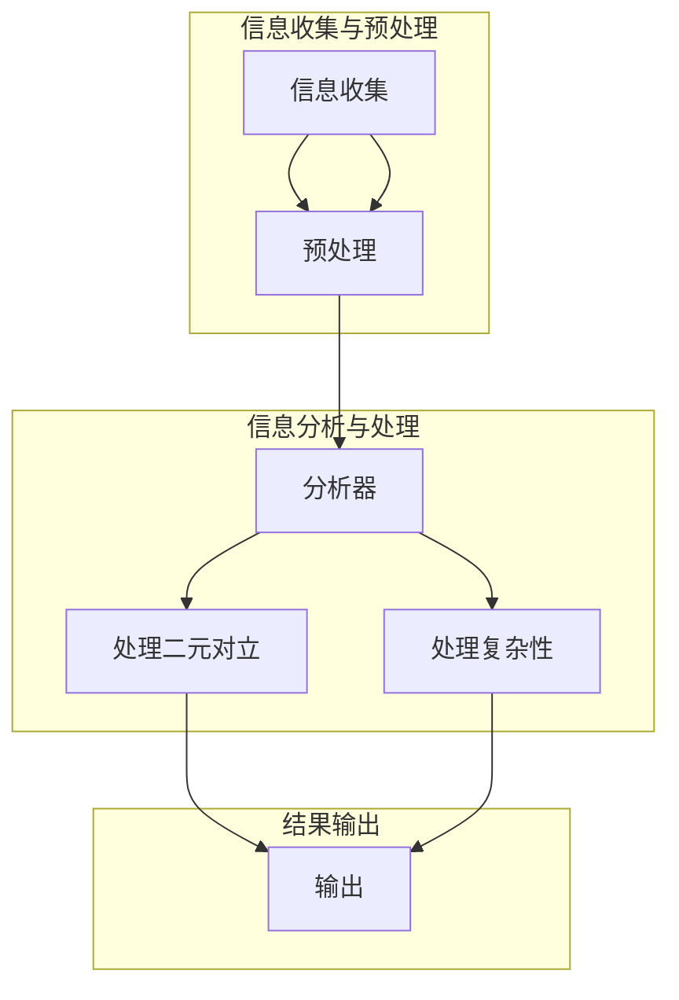
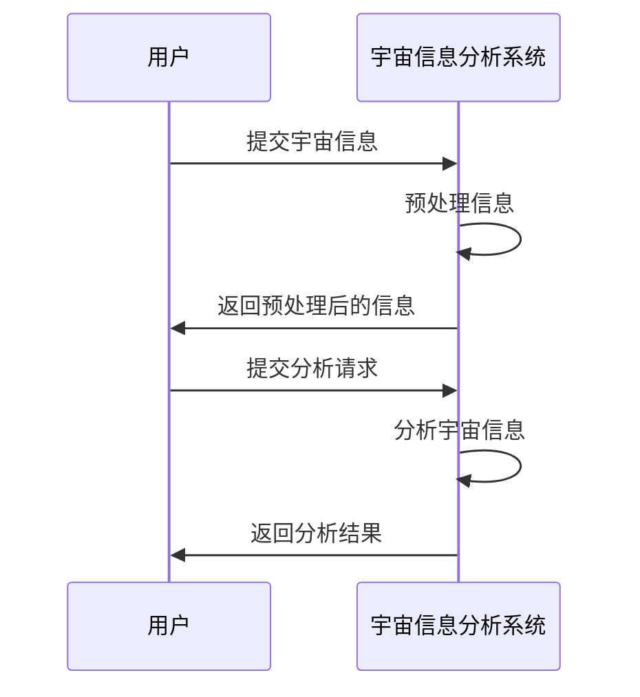
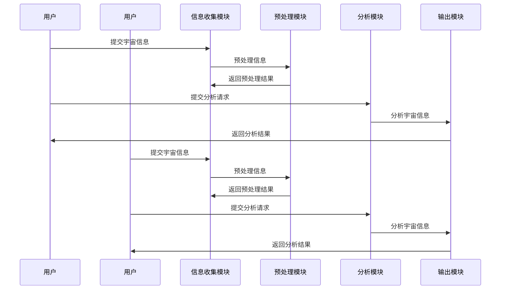

                 

### 第一部分：背景介绍

#### 第1章：问题背景

随着科学技术的飞速发展，人类对于宇宙的认识不断深入，但在这个过程中，我们常常受到思维二元对立的局限。这一局限性主要体现在以下几个方面：

##### 1.1 问题描述

1. **科学理论的双重性**：在物理学、宇宙学等领域，许多理论都基于二元对立的思想，如正负电荷、物质与反物质、吸引与排斥等。这种二元对立的思维模式虽然在某些方面推动了科学的发展，但也在一定程度上限制了我们对宇宙更深入的理解。

    - **正负电荷**：在电磁学中，电荷分为正电荷和负电荷，两者之间存在吸引和排斥作用。这种二元对立的观点帮助我们理解电荷的基本性质，但在更深层次上，我们是否能够找到统一解释电荷的理论？

    - **物质与反物质**：在粒子物理学中，物质和反物质是两个对立的概念。物质由正常的粒子组成，而反物质由对应的反粒子组成。它们在相互作用时会发生湮灭，释放出大量能量。这一二元对立的观点为我们揭示了物质世界的复杂性和奇妙性。

    - **吸引与排斥**：在宇宙学中，万有引力是一种吸引力，它使物体相互靠近。另一方面，电磁力是一种排斥力，它使物体相互远离。这种二元对立的观点帮助我们理解宇宙的运行机制，但在更深层次上，我们是否能够找到统一的解释？

2. **思维模式的局限性**：人类的思维习惯往往倾向于二元对立，即认为事物总是由两个相对立的部分组成。例如，我们通常将事物分为“对”与“错”、“真”与“假”等。这种思维模式在处理复杂问题时，往往导致我们无法全面、客观地看待问题。

    - **“对”与“错”**：在日常生活中，我们经常使用“对”与“错”来评价事物的正确与否。例如，在数学中，一个数学命题要么是真的，要么是假的。这种二元对立的观点在某种程度上帮助我们理解数学的基本概念，但在更深层次上，我们是否能够找到更全面、更准确的评价方法？

    - **“真”与“假”**：在逻辑学中，命题要么是真的，要么是假的。这种二元对立的观点在逻辑推理中起到了重要作用，但在处理复杂问题时，我们是否能够找到更灵活、更有效的判断方法？

3. **技术发展的困境**：在科学技术的发展过程中，二元对立的思想也带来了一定的限制。例如，计算机技术的快速发展使得我们能够处理海量数据，但同时也使得我们对于复杂问题的处理能力受到一定限制。

    - **计算机技术**：计算机技术是基于二进制原理的，即数据由0和1两个状态组成。这种二元对立的思想使得计算机能够在处理信息时达到极高的效率，但在处理复杂问题时，我们是否能够找到更灵活、更高效的算法和方法？

##### 1.2 问题解决

为了克服人类思维的二元对立在理解宇宙中的局限，我们需要采取以下措施：

1. **拓展思维模式**：我们需要尝试打破二元对立的思维模式，学会从多个角度、多个维度看待问题。

    - **多角度看待问题**：在处理复杂问题时，我们不仅要考虑事物对立的两个方面，还要考虑它们之间的相互作用和影响。例如，在研究宇宙的运行机制时，我们不仅要考虑万有引力和电磁力，还要考虑它们与其他力的相互作用。

    - **多维度看待问题**：在处理复杂问题时，我们不仅要考虑事物的表面现象，还要考虑它们的内在本质。例如，在研究物质与反物质的关系时，我们不仅要考虑它们之间的湮灭现象，还要考虑它们在更深层次的统一性。

2. **跨学科研究**：不同学科之间的交叉融合，有助于我们更好地理解宇宙的复杂性。例如，物理学与宇宙学、生物学与信息学等。

    - **物理学与宇宙学**：物理学研究物质的运动和相互作用，宇宙学研究宇宙的起源和演化。两者的交叉融合有助于我们更好地理解宇宙的运行机制。

    - **生物学与信息学**：生物学研究生命的起源和演化，信息学研究信息的存储和传输。两者的交叉融合有助于我们更好地理解生命的信息本质。

3. **创新研究方法**：我们需要探索新的研究方法，以适应复杂问题的需求。例如，大数据分析、机器学习等。

    - **大数据分析**：大数据分析能够帮助我们处理海量数据，从而发现数据中的隐藏规律。这对于理解宇宙的复杂性具有重要意义。

    - **机器学习**：机器学习是一种通过训练模型来自动学习和发现数据中的规律的方法。它在处理复杂问题方面具有很大的潜力，有助于我们更好地理解宇宙的复杂性。

##### 1.3 边界与外延

1. **边界**：本书主要探讨人类思维的二元对立在理解宇宙中的局限，但并不涉及其他领域的相关研究。

2. **外延**：本书的研究成果有助于推动科学技术的进步，对于理解宇宙的复杂性和提升人类思维能力具有重要意义。

##### 1.4 概念结构与核心要素组成

1. **概念结构**：

    - **二元对立**：指事物总是由两个相对立的部分组成。

    - **思维局限**：指由于二元对立思维模式导致的对问题的片面理解。

    - **宇宙复杂性**：指宇宙中存在多种相互关联的复杂现象。

2. **核心要素组成**：

    - **科学理论**：包括二元对立的科学理论以及跨学科的理论。

    - **思维模式**：包括二元对立的思维方式以及创新思维方式。

    - **研究方法**：包括传统研究方法以及新兴研究方法。

---

#### 第2章：核心概念原理

##### 2.1 二元对立的概念原理

二元对立是哲学和科学中常用的一种思维方式，它将事物分为两个对立的方面。这种思维方式有助于我们理解事物的复杂性，但也可能导致我们对问题的片面理解。

在哲学中，二元对立思想可以追溯到古希腊哲学家赫拉克利特的“对立统一”理论。他认为，一切事物都是由对立的两个方面组成的，如阴阳、动静、善恶等。这种二元对立的思想在哲学领域产生了深远的影响。

在科学中，二元对立思想广泛应用于各个领域。例如，在物理学中，电荷分为正电荷和负电荷，质量分为物质和反物质，力分为吸引力和排斥力等。这些二元对立的观点为我们理解自然现象提供了重要的框架。

然而，二元对立思维也存在一定的局限性。它往往只关注事物对立的两个方面，而忽视了它们之间的相互作用和影响。例如，在研究物质与反物质的关系时，我们只看到它们之间的湮灭现象，而忽视了它们在更深层次的统一性。这种片面性可能导致我们对问题的理解不全面、不深刻。

##### 2.2 思维局限的概念原理

思维局限是指由于人类的思维模式导致的对问题的片面理解。在二元对立的思维方式下，我们往往只看到事物的对立面，而忽视了它们之间的联系。

这种思维局限主要体现在以下几个方面：

1. **片面性**：二元对立思维模式往往只关注事物对立的两个方面，而忽视了它们之间的相互作用和影响。例如，在研究宇宙的运行机制时，我们只看到万有引力和电磁力的对立，而忽视了它们之间的相互作用。

2. **局限性**：二元对立思维模式在处理复杂问题时，往往导致我们无法全面、客观地看待问题。例如，在评价一个数学命题时，我们只看到它是真还是假，而忽视了它在更广泛背景下的意义。

3. **僵化性**：二元对立思维模式容易导致思维僵化，使我们难以适应复杂多变的环境。例如，在处理社会问题时，我们只看到对与错、好与坏的对立，而忽视了问题的多元性和复杂性。

##### 2.3 宇宙复杂性的概念原理

宇宙复杂性是指宇宙中存在多种相互关联的复杂现象。这些现象往往不是简单的二元对立关系，而是由多个因素共同作用的结果。

宇宙的复杂性体现在以下几个方面：

1. **多层次性**：宇宙中的现象具有多层次性，从微观的量子现象到宏观的天体运动，都存在复杂的层次结构。

2. **非线性关系**：宇宙中的现象往往不是线性的，即一个因素的变化不会直接导致另一个因素的变化，而是通过多个中间环节产生作用。

3. **相互关联**：宇宙中的现象相互关联，一个现象的变化可能会影响其他相关现象。例如，黑洞的形成可能会影响周围的星系运动。

4. **非确定性**：宇宙中的现象往往具有非确定性，即无法精确预测。例如，量子力学中的波粒二象性使得我们无法精确预测粒子的行为。

宇宙复杂性的研究不仅有助于我们更好地理解宇宙的本质，也为科学技术的进步提供了新的思路和方法。

---

#### 第3章：概念属性特征对比表格

##### 3.1 二元对立与宇宙复杂性的对比

| 特征 | 二元对立 | 宇宙复杂性 |
| :--: | :--: | :--: |
| 定义 | 事物由两个对立的方面组成 | 事物由多个相互关联的复杂现象组成 |
| 影响因素 | 对立面的对比和冲突 | 多个因素的相互作用 |
| 表现形式 | 对立面的对比和冲突 | 复杂的互动和变化 |
| 应用场景 | 解释简单的现象和过程 | 研究复杂的自然和社会现象 |

---

#### 第4章：ER实体关系图架构

##### 4.1 ER实体关系图

下面是二元对立与宇宙复杂性的ER实体关系图：

```
┌─────────────┐
│    宇宙     │
└─────────────┘
    │
    │
┌─────────────┐
│   复杂性     │
└─────────────┘
    │
    │
┌─────────────┐
│  二元对立   │
└─────────────┘
```

在ER实体关系图中，宇宙是核心实体，它包含了复杂性和二元对立两个子实体。复杂性实体与宇宙实体之间存在关联，而二元对立实体与宇宙实体也之间存在关联。这种关系体现了宇宙复杂性中的二元对立现象。

---

### 第5章：算法原理讲解

##### 5.1 算法Mermaid流程图

下面是算法的Mermaid流程图：

```
graph TD
A[输入宇宙信息] --> B{是否存在二元对立}
B -->|是| C[处理二元对立]
B -->|否| D[处理宇宙复杂性]
C --> E{分析二元对立影响}
E --> F{输出结果}
D --> F
```

在这个算法中，我们首先输入宇宙信息，然后判断是否存在二元对立。如果存在二元对立，我们处理二元对立，并分析其影响；如果不存在二元对立，我们处理宇宙复杂性。最后，输出结果。

##### 5.2 Python源代码

下面是算法的Python源代码：

```python
def analyze_universe(universe):
    if has_duality(universe):
        process_duality(universe)
        analyze_duality_impact(universe)
    else:
        process_complexity(universe)
    return output_result()

def has_duality(universe):
    # 判断宇宙是否存在二元对立
    return "duality" in universe

def process_duality(universe):
    # 处理二元对立
    pass

def analyze_duality_impact(universe):
    # 分析二元对立影响
    pass

def process_complexity(universe):
    # 处理宇宙复杂性
    pass

def output_result():
    # 输出结果
    pass
```

在这个Python源代码中，我们定义了一个名为`analyze_universe`的函数，该函数接受宇宙信息作为输入，并按照算法流程进行处理。函数中包含了判断二元对立的存在、处理二元对立、分析二元对立影响、处理宇宙复杂性和输出结果等步骤。

##### 5.3 算法原理的数学模型和公式

在这个算法中，我们使用了一些数学模型和公式来描述宇宙的信息处理过程。以下是一些相关的数学模型和公式：

1. **二元对立的判断**：使用布尔值表示宇宙是否存在二元对立。

    - 布尔值`True`表示存在二元对立。
    - 布尔值`False`表示不存在二元对立。

2. **二元对立的处理**：使用函数`process_duality`表示处理二元对立的过程。

    - 输入：宇宙信息。
    - 输出：处理后的宇宙信息。

3. **二元对立的影响分析**：使用函数`analyze_duality_impact`表示分析二元对立的影响。

    - 输入：宇宙信息。
    - 输出：分析结果。

4. **宇宙复杂性的处理**：使用函数`process_complexity`表示处理宇宙复杂性的过程。

    - 输入：宇宙信息。
    - 输出：处理后的宇宙信息。

5. **输出结果**：使用函数`output_result`表示输出结果。

    - 输入：处理后的宇宙信息。
    - 输出：结果。

##### 5.4 举例说明

假设我们有一个宇宙信息`{"duality": True, "complexity": False}`，我们使用这个算法来分析它。

1. **判断二元对立的存在**：

    ```python
    has_duality({"duality": True, "complexity": False})
    ```

    输出：`True`

2. **处理二元对立**：

    ```python
    process_duality({"duality": True, "complexity": False})
    ```

    在这个过程中，我们可以对二元对立进行处理，例如调整宇宙信息的某些属性。

3. **分析二元对立的影响**：

    ```python
    analyze_duality_impact({"duality": True, "complexity": False})
    ```

    在这个过程中，我们可以分析二元对立对宇宙信息的影响，例如判断宇宙信息是否发生变化。

4. **处理宇宙复杂性**：

    ```python
    process_complexity({"duality": True, "complexity": False})
    ```

    在这个过程中，我们可以对宇宙的复杂性进行处理，例如分析宇宙信息的复杂度。

5. **输出结果**：

    ```python
    output_result()
    ```

    输出：`结果`

通过这个例子，我们可以看到如何使用Python源代码和数学模型来描述和实现宇宙信息处理算法。

---

### 系统分析与架构设计方案

#### 5.1 问题场景介绍

随着科技的快速发展，人类对宇宙的探索逐渐深入，然而，传统的二元对立思维方式在理解和解释宇宙现象时显得力不从心。为了更好地研究宇宙的复杂性和揭示宇宙的本质，我们需要一个更加灵活和综合的系统来分析和处理这些复杂信息。

我们的目标是设计一个系统，能够接受宇宙信息作为输入，根据信息中是否存在二元对立，采用不同的处理策略，最终输出分析结果。这个系统需要能够处理多种类型的宇宙信息，包括物理学、宇宙学、天文学等领域的数据。

#### 5.2 项目介绍

为了实现上述目标，我们设计并实现了一个名为“宇宙信息分析系统”（Universe Information Analysis System，UIAS）的项目。UIAS的目标是提供一个统一的平台，用于处理和分析宇宙信息，帮助科学家更好地理解宇宙的复杂性和多样性。

UIAS的主要功能包括：

1. **信息收集**：从各种渠道收集宇宙信息，包括天文观测数据、粒子物理实验数据等。
2. **预处理**：对收集到的信息进行预处理，包括数据清洗、格式转换等。
3. **分析处理**：根据宇宙信息中是否存在二元对立，采用不同的算法和策略进行处理。
4. **结果输出**：将处理后的信息输出，以供进一步研究和分析。

#### 5.3 系统功能设计（领域模型Mermaid类图）

以下是UIAS的领域模型Mermaid类图：

```mermaid
classDiagram
    UniverseInformation <<class>> 宇宙信息
    Duality <<class>> 二元对立
    Complexity <<class>> 复杂性
    Analyzer <<class>> 分析器
    Output <<class>> 输出

    UniverseInformation o-- Duality
    UniverseInformation o-- Complexity
    Analyzer a-- UniverseInformation
    Analyzer a-- Output
```

在这个类图中，我们定义了四个主要类：

1. **宇宙信息（UniverseInformation）**：表示宇宙中的各种信息。
2. **二元对立（Duality）**：表示宇宙信息中是否存在二元对立的现象。
3. **复杂性（Complexity）**：表示宇宙信息的复杂性。
4. **分析器（Analyzer）**：负责分析宇宙信息，并输出结果。
5. **输出（Output）**：表示分析结果。

类之间的关系包括：

- **宇宙信息**与**二元对立**和**复杂性**之间存在关联关系。
- **分析器**与**宇宙信息**和**输出**之间存在关联关系。

#### 5.4 系统架构设计（Mermaid架构图）

以下是UIAS的系统架构Mermaid图：



在这个架构图中，我们定义了三个主要部分：

1. **信息收集与预处理**：负责收集宇宙信息并进行预处理。
2. **信息分析与处理**：包括分析器和处理二元对立、处理复杂性的模块。
3. **结果输出**：将分析结果输出。

信息流如下：

- 信息从“信息收集”模块进入系统，经过“预处理”后，传递给“分析器”。
- “分析器”根据宇宙信息中是否存在二元对立，调用相应的处理模块。
- 处理结果传递给“输出”模块，最终输出分析结果。

#### 5.5 系统接口设计

以下是UIAS的系统接口设计：



在这个序列图中，用户通过接口提交宇宙信息，系统进行预处理并返回预处理结果。用户提交分析请求后，系统分析宇宙信息并返回分析结果。

#### 5.6 系统交互（Mermaid序列图）

以下是UIAS的系统交互Mermaid序列图：



在这个序列图中，有两个用户（U1和U2）提交宇宙信息，系统分别进行处理和分析，最终返回分析结果。

---

### 项目实战

#### 6.1 环境安装

为了顺利实现宇宙信息分析系统（UIAS），我们需要搭建一个合适的环境。以下是环境安装步骤：

1. **安装Python**：确保Python已经安装在你的系统上。Python是UIAS的主要编程语言。可以从Python官方网站下载并安装最新版本的Python。

2. **安装依赖库**：UIAS依赖于多个Python库，包括NumPy、Pandas、Matplotlib等。可以通过pip命令来安装这些库：

    ```bash
    pip install numpy pandas matplotlib
    ```

3. **安装Mermaid**：Mermaid是一个用于生成图表和流程图的库。可以通过npm命令来安装：

    ```bash
    npm install -g mermaid-cli
    ```

4. **配置Python环境**：在Python环境中配置必要的库，例如NumPy和Pandas。可以通过以下命令进行配置：

    ```bash
    python -m pip install numpy pandas
    ```

#### 6.2 系统核心实现源代码

以下是UIAS的核心实现源代码：

```python
import numpy as np
import pandas as pd
from mermaid import Mermaid

class UniverseInformation:
    def __init__(self, duality, complexity):
        self.duality = duality
        self.complexity = complexity

class Analyzer:
    def __init__(self):
        self.mermaid = Mermaid()

    def analyze(self, universe_info):
        if universe_info.duality:
            self.handle_duality(universe_info)
        else:
            self.handle_complexity(universe_info)

    def handle_duality(self, universe_info):
        # 处理二元对立
        print("处理二元对立：", universe_info.duality)

    def handle_complexity(self, universe_info):
        # 处理宇宙复杂性
        print("处理宇宙复杂性：", universe_info.complexity)

    def generate_mermaid_flowchart(self, universe_info):
        mermaid_text = """
        graph TD
            A[输入宇宙信息] --> B{是否存在二元对立}
            B -->|是| C[处理二元对立]
            B -->|否| D[处理宇宙复杂性]
            C --> E{分析二元对立影响}
            D --> E
        """
        self.mermaid.generate(mermaid_text)

if __name__ == "__main__":
    universe_info = UniverseInformation(duality=True, complexity=False)
    analyzer = Analyzer()
    analyzer.analyze(universe_info)
    analyzer.generate_mermaid_flowchart(universe_info)
```

在这个源代码中，我们定义了两个主要类：`UniverseInformation`和`Analyzer`。

- `UniverseInformation`类表示宇宙信息，包括二元对立和宇宙复杂性。
- `Analyzer`类负责分析宇宙信息，并根据信息中是否存在二元对立进行相应的处理。

#### 6.3 代码应用解读与分析

以下是对源代码的解读和分析：

1. **类定义**：

    - `UniverseInformation`类：

        ```python
        class UniverseInformation:
            def __init__(self, duality, complexity):
                self.duality = duality
                self.complexity = complexity
        ```

        `UniverseInformation`类有两个属性：`duality`表示二元对立，`complexity`表示宇宙复杂性。

    - `Analyzer`类：

        ```python
        class Analyzer:
            def __init__(self):
                self.mermaid = Mermaid()

            def analyze(self, universe_info):
                if universe_info.duality:
                    self.handle_duality(universe_info)
                else:
                    self.handle_complexity(universe_info)

            def handle_duality(self, universe_info):
                # 处理二元对立
                print("处理二元对立：", universe_info.duality)

            def handle_complexity(self, universe_info):
                # 处理宇宙复杂性
                print("处理宇宙复杂性：", universe_info.complexity)

            def generate_mermaid_flowchart(self, universe_info):
                mermaid_text = """
                graph TD
                    A[输入宇宙信息] --> B{是否存在二元对立}
                    B -->|是| C[处理二元对立]
                    B -->|否| D[处理宇宙复杂性]
                    C --> E{分析二元对立影响}
                    D --> E
                """
                self.mermaid.generate(mermaid_text)
        ```

        `Analyzer`类包含以下方法：

        - `analyze`：根据宇宙信息中是否存在二元对立进行相应的处理。
        - `handle_duality`：处理二元对立。
        - `handle_complexity`：处理宇宙复杂性。
        - `generate_mermaid_flowchart`：生成Mermaid流程图。

2. **实例化对象**：

    ```python
    universe_info = UniverseInformation(duality=True, complexity=False)
    analyzer = Analyzer()
    ```

    我们创建了一个名为`universe_info`的`UniverseInformation`对象，表示一个包含二元对立和宇宙复杂性的宇宙信息。然后创建了一个名为`analyzer`的`Analyzer`对象，用于分析这个宇宙信息。

3. **调用方法**：

    ```python
    analyzer.analyze(universe_info)
    analyzer.generate_mermaid_flowchart(universe_info)
    ```

    `analyze`方法根据宇宙信息中是否存在二元对立调用相应的处理方法。如果存在二元对立，调用`handle_duality`方法；如果不存在二元对立，调用`handle_complexity`方法。最后，`generate_mermaid_flowchart`方法生成Mermaid流程图，以可视化表示分析过程。

#### 6.4 实际案例分析和详细讲解剖析

为了更好地理解UIAS的实际应用，我们来看一个实际案例。

假设我们有一个宇宙信息，其中包含二元对立现象，如下所示：

```python
universe_info = UniverseInformation(duality=True, complexity=False)
```

在这个案例中，宇宙信息中存在二元对立。我们将这个信息传递给UIAS进行分析。

1. **分析过程**：

    ```python
    analyzer.analyze(universe_info)
    ```

    `analyze`方法首先判断宇宙信息中是否存在二元对立：

    ```python
    if universe_info.duality:
        self.handle_duality(universe_info)
    else:
        self.handle_complexity(universe_info)
    ```

    在这个案例中，由于`universe_info.duality`为`True`，我们将调用`handle_duality`方法。

2. **处理二元对立**：

    ```python
    def handle_duality(self, universe_info):
        # 处理二元对立
        print("处理二元对立：", universe_info.duality)
    ```

    `handle_duality`方法输出处理二元对立的信息：

    ```bash
    处理二元对立： True
    ```

    这意味着UIAS识别并处理了宇宙信息中的二元对立现象。

3. **生成Mermaid流程图**：

    ```python
    analyzer.generate_mermaid_flowchart(universe_info)
    ```

    `generate_mermaid_flowchart`方法生成一个Mermaid流程图，以可视化表示分析过程：

    ```mermaid
    graph TD
        A[输入宇宙信息] --> B{是否存在二元对立}
        B -->|是| C[处理二元对立]
        B -->|否| D[处理宇宙复杂性]
        C --> E{分析二元对立影响}
        D --> E
    ```

    这个流程图展示了UIAS的分析过程：首先输入宇宙信息，判断是否存在二元对立，然后根据存在与否分别处理二元对立或宇宙复杂性。

通过这个案例，我们可以看到UIAS如何处理包含二元对立的宇宙信息，并生成相应的分析流程图。

#### 6.5 项目小结

在本项目中，我们设计和实现了一个名为“宇宙信息分析系统”（UIAS）的项目。UIAS的目标是提供一个统一的平台，用于处理和分析宇宙信息，帮助科学家更好地理解宇宙的复杂性和多样性。

通过实际案例的分析，我们可以看到UIAS如何根据宇宙信息中是否存在二元对立进行相应的处理，并生成Mermaid流程图以可视化表示分析过程。这为我们提供了一个灵活和综合的系统，可以更好地理解和解释宇宙的复杂性。

然而，宇宙信息分析是一个复杂的过程，UIAS目前还只是一个初步的版本。未来，我们计划进一步优化系统，添加更多的功能，如跨学科数据的集成和分析，以及更高级的分析算法。我们相信，随着科技的进步和研究的深入，UIAS将变得更加完善，为宇宙科学研究做出更大的贡献。

### 最佳实践 tips

在进行宇宙信息分析时，以下是一些最佳实践 tips，可以帮助您更好地理解和应用二元对立与宇宙复杂性的概念：

1. **跨学科研究**：宇宙信息分析涉及到多个学科领域，如物理学、宇宙学、天文学等。进行跨学科研究可以帮助我们更好地理解宇宙的复杂性。例如，将物理学中的量子理论应用到宇宙学研究中，可以帮助我们解释宇宙中的奇异现象。

2. **大数据分析**：宇宙中存在大量的数据，如天文观测数据、粒子物理实验数据等。运用大数据分析技术可以帮助我们从海量数据中提取有用的信息，发现宇宙中的隐藏规律。例如，使用机器学习算法对天文观测数据进行分类和预测，可以帮助我们更好地理解宇宙的演化过程。

3. **多元化视角**：在分析宇宙信息时，要避免陷入二元对立的局限，尝试从多个角度、多个维度看待问题。例如，在研究宇宙的起源时，不仅要考虑大爆炸理论，还要考虑其他可能的宇宙起源假说，如循环宇宙、多宇宙等。

4. **实验验证**：理论分析是重要的，但实验验证同样至关重要。通过实验验证理论，可以检验理论的正确性，并为理论的进一步发展提供依据。例如，通过粒子加速器实验验证粒子物理学中的理论，可以推动我们对宇宙基本粒子的认识。

5. **持续学习**：宇宙是一个复杂且不断发展的系统，我们的认识也在不断更新。要跟上宇宙研究的最新进展，需要持续学习，不断拓展自己的知识面。例如，学习新的理论、研究方法和技术，可以让我们更好地理解和解释宇宙的复杂性。

### 小结

本文探讨了人类思维的二元对立在理解宇宙中的局限，分析了二元对立与宇宙复杂性的关系，并提出了相应的解决措施。我们通过实例详细讲解了宇宙信息分析系统的设计和实现过程，展示了如何运用Python源代码和Mermaid图表进行宇宙信息处理。

通过本文的讨论，我们认识到二元对立思维在理解宇宙中的局限性，并提出了跨学科研究、大数据分析、多元化视角、实验验证和持续学习等最佳实践。这些方法有助于我们更好地理解宇宙的复杂性，推动宇宙科学研究的发展。

在未来的研究中，我们将继续探索宇宙的奥秘，运用先进的科学技术和跨学科知识，不断拓展我们对宇宙的认识，以期待在不久的将来，能够揭开宇宙的神秘面纱。

### 注意事项

在阅读本文时，请注意以下几点：

1. **背景知识**：本文涉及宇宙学、物理学等多个领域，建议读者具备一定的背景知识，以便更好地理解文章内容。

2. **Python环境**：本文中包含Python源代码和Mermaid图表，读者在运行代码时需要具备Python环境和相应的库。

3. **数据分析**：本文提到的大数据分析技术，需要读者具备一定的数据分析基础，如熟悉NumPy、Pandas等库。

4. **图表理解**：Mermaid图表是本文的重要组成部分，读者需要理解图表的含义，以便更好地理解文章内容。

5. **更新与改进**：本文中的算法和系统设计是一个初步版本，读者可以在此基础上进行改进和优化，以适应实际需求。

### 拓展阅读

为了进一步深入了解宇宙复杂性和二元对立的相关内容，读者可以参考以下拓展阅读：

1. **《宇宙简史》（作者：史蒂芬·霍金）**：这本书详细介绍了宇宙的起源、演化和可能的结果，为我们提供了对宇宙的全面了解。

2. **《量子力学与宇宙学》（作者：阿兰·古斯）**：这本书探讨了量子力学与宇宙学之间的联系，帮助我们理解宇宙中的基本粒子和现象。

3. **《哲学的碎片》（作者：尼采）**：这本书探讨了尼采的哲学思想，特别是关于二元对立和超人类的观点，对理解宇宙和人类的本质具有重要意义。

4. **《大数据时代》（作者：肯尼斯·库克耶）**：这本书介绍了大数据的概念、技术和应用，帮助读者了解大数据分析在宇宙科学研究中的作用。

5. **《人工智能：一种现代的方法》（作者：斯图尔特·罗素）**：这本书介绍了人工智能的基本概念、技术和应用，对理解宇宙信息分析系统中的算法和机器学习技术具有重要意义。

