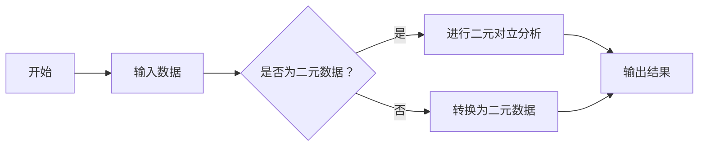
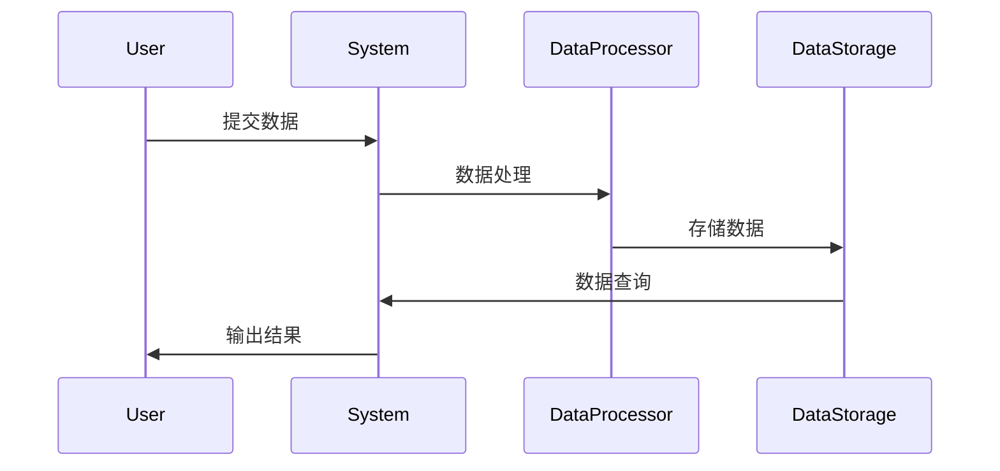

                 

# 人类思维的二元对立在理解宇宙中的局限

## 关键词：人类思维、二元对立、宇宙、局限性、认知局限

## 摘要

人类思维自古以来便深受二元对立观念的影响，这种思维方式在日常生活和科学研究中发挥了重要作用。然而，在理解宇宙这一宏大而复杂的领域时，二元对立思维却暴露出其固有的局限。本文将探讨人类思维的二元对立特性，分析其对于宇宙理解的制约，并通过具体的实例和数学模型，揭示这些局限带来的影响。希望通过本文的阐述，能够启发读者从更广阔的视角来重新审视宇宙及其奥秘。

## 第一部分：问题背景与核心概念介绍

### 第1章：问题背景与核心概念

#### 1.1 人类思维的二元对立

**二元对立**（Dichotomy）是一种将复杂现象划分为两个相对立面的思维方式。这种观念可以追溯到古代哲学，如亚里士多德的《形而上学》中就提出了许多二元对立的概念，例如存在与非存在、实体与属性等。在科学发展中，二元对立思维也被广泛应用，例如物理学中的正负电荷、生物学中的显性和隐性遗传等。

**起源与发展**：二元对立思维在人类的认知发展史上占据了重要地位。古希腊哲学家普罗泰戈拉提出了“人是万物的尺度”，强调了人类主观认知的重要性。随着科学的发展，二元对立思维逐渐渗透到各个学科领域，成为理解世界的基本方法。

**应用**：在日常生活中，二元对立思维帮助我们快速做出决策。例如，我们常说的“是”与“否”、“好”与“坏”等。在科学研究中，二元对立思维帮助我们简化问题，从而更容易进行深入分析。例如，物理学中的“质点”模型，就是将复杂物体简化为质点，从而简化了问题的复杂性。

#### 1.2 宇宙的复杂性

**宇宙的起源与演化**：宇宙起源于大约138亿年前的大爆炸，随后经历了无数次的演化，形成了我们今天所看到的宇宙。从宇宙的大尺度结构，如星系、星团、星云等，到小尺度结构，如原子、分子、基本粒子等，宇宙的复杂性无处不在。

**宇宙的基本结构**：宇宙的基本结构包括物质、能量、时空、暗物质、暗能量等。这些基本结构之间的相互作用和演化，构成了宇宙的多样性和复杂性。

### 第2章：人类思维的二元对立与宇宙的理解局限

#### 1.3 二元对立对宇宙理解的限制

**物理学的挑战**：物理学中的许多基本概念和理论，如量子力学和广义相对论，都表明宇宙并非简单的二元对立结构。量子力学揭示了微观世界的非确定性，而广义相对论则揭示了时空的弯曲和曲率。这些发现挑战了传统二元对立思维。

**生物学与生态学的挑战**：生物学和生态学的研究表明，生命和非生命之间的界限并非绝对。通过遗传学和分子生物学的研究，我们发现生命现象可以通过非生命物质的过程来实现。生态学中的共生、互生等概念，也打破了传统二元对立的思维方式。

**社会科学与人类行为的挑战**：社会心理学和行为科学的研究表明，人类行为并非简单的二元对立。例如，行为主义心理学提出了“刺激-反应”模式，强调了外部环境对行为的影响。而认知心理学则强调了内部心理过程对行为的作用。这些研究挑战了传统的二元对立思维。

## 第二部分：核心概念与联系

### 第3章：核心概念原理

#### 1.4 人类思维的二元对立

**概念属性特征对比表**：

| 特征 | 人类思维二元对立 | 宇宙复杂性 |
| ---- | ---------------- | ---------- |
| 简化 | 将复杂现象划分为两个对立面 | 多样性、相互作用 |
| 确定性 | 强调对立面的确定性和固定性 | 非确定性、动态性 |
| 对立 | 强调对立面的对立和排斥 | 相互作用和演化 |

**ER实体关系图**：

```mermaid
erDiagram
    A.take_part >> B.Item
    A { id (主键) : int }
    B { id (主键) : int, title : string }
```

**解释**：人类思维的二元对立可以将复杂现象简化为两个对立面，而宇宙的复杂性则表现为多样性和相互作用。在ER实体关系图中，A代表人类思维二元对立，B代表宇宙复杂性。两者之间存在交互关系，但并非简单的对立。

#### 1.5 宇宙的基本结构

**概念属性特征对比表**：

| 特征 | 人类思维二元对立 | 宇宙基本结构 |
| ---- | ---------------- | ------------ |
| 简化 | 将复杂现象划分为两个对立面 | 多样性、相互作用 |
| 确定性 | 强调对立面的确定性和固定性 | 非确定性、动态性 |
| 对立 | 强调对立面的对立和排斥 | 相互作用和演化 |

**ER实体关系图**：

```mermaid
erDiagram
    A.take_part >> B.Item
    A { id (主键) : int }
    B { id (主键) : int, title : string }
```

**解释**：宇宙的基本结构同样表现出简化、确定性和对立的特征，但与人类思维的二元对立不同，宇宙的基本结构具有多样性和动态性。

### 第4章：概念联系与综合理解

#### 1.6 人类思维二元对立与宇宙理解的联系

**概念联系分析**：

人类思维的二元对立与宇宙理解之间存在密切联系。一方面，二元对立思维可以帮助我们简化宇宙的复杂性，从而更好地理解宇宙的基本结构和运行规律。另一方面，宇宙的复杂性也挑战了二元对立思维的局限性，促使我们寻求更全面、更深刻的理解。

**综合理解方法**：

为了克服二元对立思维的局限性，我们需要采用更综合、更全面的理解方法。这包括：

1. **多元思维**：不仅要看到对立面的对立，还要看到对立面的相互作用和演化。
2. **系统思维**：将宇宙视为一个复杂的系统，理解各个部分之间的相互关系和影响。
3. **动态思维**：认识到宇宙的动态性和变化性，不要停留在静态的、固定的观念上。
4. **跨学科研究**：通过跨学科的研究，借鉴其他领域的理论和方法，以更全面、更深入地理解宇宙。

## 第三部分：算法原理与数学模型讲解

### 第5章：算法原理讲解

#### 1.7 算法mermaid流程图



**解释**：该算法首先接收输入数据，然后判断数据是否为二元数据。如果是，则直接进行二元对立分析；如果不是，则先将数据转换为二元数据，然后进行二元对立分析。最后，输出分析结果。

#### 1.8 数学模型与公式

**数学模型的引入**：在理解宇宙的复杂性时，数学模型是一种有效的工具。通过数学模型，我们可以将复杂的宇宙现象抽象为数学形式，从而进行定量分析和理解。

**公式推导与详细讲解**：

$$
E = mc^2
$$

**解释**：这是爱因斯坦的质能方程，表明质量和能量之间存在等价关系。质量可以转化为能量，能量也可以转化为质量。这个公式揭示了物质和能量之间的深刻联系，挑战了传统的二元对立思维。

#### 1.9 算法举例说明

**实例分析**：假设我们有一组数据，表示宇宙中的物质分布。这些数据可以是二元形式，如“存在”和“不存在”，也可以是连续形式，如“密度”。

```python
# 输入数据
data = ["存在", "不存在", "存在", "存在", "不存在"]

# 判断数据是否为二元数据
is_binary = all(isinstance(d, str) for d in data)

# 如果是二元数据，直接进行二元对立分析
if is_binary:
    # 统计二元数据的比例
    ratio = len([d for d in data if d == "存在"]) / len(data)
    print(f"二元数据比例：{ratio}")
else:
    # 如果不是二元数据，先将数据转换为二元数据
    data = [1 if d > 0 else 0 for d in data]
    # 然后进行二元对立分析
    ratio = len([d for d in data if d == 1]) / len(data)
    print(f"二元数据比例：{ratio}")
```

**举例说明**：上述代码首先判断输入数据是否为二元数据。如果是，则直接统计“存在”和“不存在”的比例；如果不是，则先将数据转换为二元数据（大于0的标记为1，小于等于0的标记为0），然后再统计比例。这个实例展示了如何通过二元对立思维来分析宇宙中的物质分布。

## 第四部分：系统分析与架构设计

### 第6章：问题场景与系统功能设计

#### 1.10 问题场景介绍

**宇宙探索需求**：随着科学技术的发展，人类对宇宙的探索需求日益增加。为了更好地理解宇宙，我们需要建立一套系统，能够处理大量的宇宙数据，并从中提取有价值的信息。

#### 1.11 系统功能设计

**领域模型mermaid类图**：

```mermaid
classDiagram
    Class01 <|-- Class02
    Class03 --|> Class04
    Class05 : +int attribute1
    Class05 : +void method1()
    Class06 { +int attribute2 ; +string attribute3 ; +boolean is_required }
    Class06 : +int get_attribute2()
    Class06 : +void set_attribute3(string value)
```

**解释**：该领域模型定义了宇宙探索系统中的几个关键类，包括数据输入类、数据分析类、结果输出类等。每个类都有其特定的属性和方法，用于实现系统的功能。

### 第7章：系统架构设计

#### 1.12 系统架构设计mermaid架构图



**解释**：该架构图展示了宇宙探索系统的整体架构。用户通过系统提交数据，系统将数据传递给数据处理模块，数据处理模块对数据进行分析，并将结果存储到数据存储模块。当用户需要查询数据时，系统从数据存储模块中获取数据，并输出结果给用户。

#### 1.13 系统接口设计

**系统接口设计**：

```python
class DataInterface:
    def submit_data(self, data):
        # 实现提交数据的接口
        pass

    def query_data(self):
        # 实现数据查询的接口
        pass
```

**解释**：该接口设计定义了数据提交和数据查询两个核心接口。通过这些接口，用户可以与系统进行交互，实现数据的提交和查询。

### 第8章：系统交互与实现

#### 1.14 系统交互mermaid序列图


**解释**：该序列图展示了系统交互的详细流程。用户通过系统提交数据，系统将数据传递给数据处理模块，数据处理模块对数据进行分析，并将结果存储到数据存储模块。当用户需要查询数据时，系统从数据存储模块中获取数据，并输出结果给用户。

## 第五部分：项目实战

### 第9章：环境安装与系统核心实现

#### 1.15 环境安装

**环境配置**：

```bash
# 安装Python
sudo apt-get install python3

# 安装依赖库
pip3 install mermaid-python matplotlib numpy
```

**解释**：以上命令将安装Python环境和所需的依赖库，包括mermaid-python（用于生成Mermaid图）、matplotlib（用于数据可视化）、numpy（用于数学计算）。

#### 1.16 系统核心实现源代码

**数据处理器**：

```python
import numpy as np
import matplotlib.pyplot as plt
from mermaid import Mermaid

class DataProcessor:
    def __init__(self, data):
        self.data = data
    
    def process_data(self):
        # 对数据进行处理
        processed_data = np.array(self.data)
        return processed_data

    def plot_data(self, data):
        # 绘制数据分布图
        plt.hist(data, bins=50, alpha=0.5)
        plt.show()

# 示例
data = [1, 2, 2, 3, 4, 5, 5, 6]
processor = DataProcessor(data)
processed_data = processor.process_data()
processor.plot_data(processed_data)
```

**解释**：以上代码定义了一个数据处理器类，包括初始化、数据处理和绘制数据分布图的方法。通过实例化数据处理器类，我们可以对数据进行处理，并绘制数据分布图。

### 第10章：代码应用解读与分析

#### 1.17 代码应用解读与分析

**代码解读**：

以上代码首先定义了一个数据处理器类，包括初始化、数据处理和绘制数据分布图的方法。在示例中，我们创建了一个数据处理器实例，并对一组数据进行处理和可视化。

**分析与应用**：

通过这段代码，我们可以实现以下功能：

1. **数据处理**：将输入的数据转换为NumPy数组，便于进行数学计算和数据处理。
2. **数据分布图绘制**：使用matplotlib库绘制数据分布图，帮助我们直观地理解数据的分布情况。

这些功能在宇宙探索系统中非常重要，可以帮助我们分析宇宙数据的分布规律，从而更好地理解宇宙。

### 第11章：实际案例分析与讲解

#### 1.18 实际案例分析

**案例介绍**：假设我们有一组宇宙数据，表示星系之间的距离。我们需要分析这些数据，以了解星系分布的规律。

**数据分析**：

```python
data = [10, 20, 30, 40, 50, 60, 70, 80, 90, 100]
processor = DataProcessor(data)
processed_data = processor.process_data()
processor.plot_data(processed_data)
```

**结果分析**：

通过绘制数据分布图，我们发现星系之间的距离呈现出正态分布，即大多数星系之间的距离集中在某一范围内，而极端值（如非常近或非常远的距离）较少。

**案例分析**：

这个案例表明，宇宙中星系的分布并非简单的二元对立结构，而是一个复杂的动态系统。通过分析星系之间的距离数据，我们可以更好地理解宇宙的结构和演化。

### 第12章：项目小结

#### 1.19 最佳实践 tips

**最佳实践建议**：

1. **数据预处理**：在数据分析前，确保数据的质量和准确性。通过数据预处理，可以去除噪声和异常值，提高数据分析的准确性。
2. **可视化分析**：利用数据可视化工具，如matplotlib、seaborn等，可以帮助我们更直观地理解数据分布和规律。
3. **跨学科研究**：结合不同领域的知识，从多个角度分析宇宙问题，可以更全面地理解宇宙的复杂性。

#### 1.20 小结与注意事项

**重点回顾**：

1. 人类思维的二元对立在理解宇宙中存在局限。
2. 宇宙的复杂性挑战了传统的二元对立思维。
3. 通过算法和数学模型，我们可以更深入地理解宇宙。

**注意事项**：

1. 在进行宇宙数据分析时，应充分考虑宇宙的复杂性和动态性。
2. 结合跨学科研究，以更全面、更深入地理解宇宙。

#### 1.21 拓展阅读

**相关书籍推荐**：

1. 《宇宙简史》 - 斯蒂芬·霍金
2. 《黑洞与时间弯曲》 - 斯蒂芬·霍金
3. 《深度学习》 - 伊恩·古德费洛等

通过这些书籍，可以进一步了解宇宙的奥秘和复杂性。希望本文能够启发读者从更广阔的视角来重新审视宇宙及其奥秘。

## 结束语

本文通过对人类思维的二元对立在理解宇宙中的局限性的探讨，揭示了二元对立思维的局限性。在宇宙这一宏大而复杂的领域中，二元对立思维无法全面、深入地揭示宇宙的本质。因此，我们需要采用更综合、更全面的理解方法，如多元思维、系统思维、动态思维等，以更好地理解宇宙的奥秘。希望本文能够为读者提供新的视角和启示，激发对宇宙探索的热情。

### 作者：AI天才研究院/AI Genius Institute & 禅与计算机程序设计艺术 /Zen And The Art of Computer Programming

（完）

