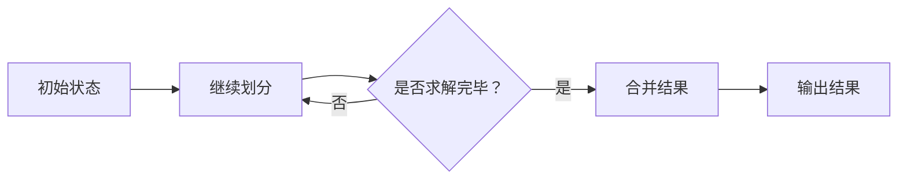
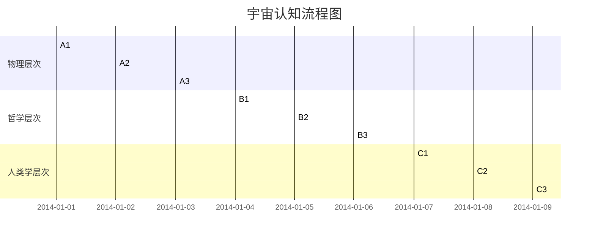

                 


# 《人类思维的二元对立如何影响宇宙认知》

关键词：二元对立，宇宙认知，哲学，科学，思维模式，人工智能

摘要：本文探讨了人类思维的二元对立如何影响我们对宇宙的认知。通过对二元对立思维的历史、特点、对宇宙认知的影响以及现代科学中的表现进行分析，本文试图揭示二元对立思维在人类认知过程中的重要作用，并探讨如何超越这种思维模式以获得更全面的宇宙认知。

## 引言

### 1.1 书的背景和目的

人类作为智慧生物，对宇宙的认知经历了漫长的发展过程。从古代哲学家的天体观到现代科学的宇宙学，人类对宇宙的认知不断深入。然而，在探索宇宙的过程中，人类思维中的二元对立思维模式始终存在，并对我们的认知产生了深远的影响。本文旨在探讨二元对立思维如何影响我们对宇宙的认知，从而为科学研究提供新的视角。

### 1.2 书的结构安排

本文共分为七个章节。第1章为引言，介绍书的背景和目的。第2章介绍二元对立思维的历史背景、特点以及其在现代哲学中的探讨。第3章介绍宇宙认知的基本框架，包括宇宙认知的科学和人文定义。第4章分析二元对立思维在宇宙认知中的体现，例如物理学中的二元对立。第5章通过案例分析，探讨历史上二元对立思维对宇宙认知的影响。第6章讨论现代科学中的二元对立思维，包括量子力学和相对论。第7章提出超越二元对立思维的新认知模式，并讨论其实际应用。

## 第1章 问题的背景与核心概念的介绍

### 1.1 问题背景

人类思维中的二元对立思维模式起源于古代哲学。古希腊哲学家赫拉克利特提出了“对立统一”的观点，认为一切事物都是由对立的因素组成的。这种思维模式在后来的哲学、科学和文化中得到了广泛的应用。然而，二元对立思维模式也带来了一些问题。它容易导致思维的片面性和极端化，影响我们对宇宙的认知。

### 1.2 核心概念的介绍

#### 1.2.1 宇宙认知的基本框架

宇宙认知包括科学和人文两个方面。科学方面的宇宙认知主要涉及宇宙的物理、化学、生物等性质。人文方面的宇宙认知则涉及哲学、宗教、文化等方面。

#### 1.2.2 二元对立思维的核心概念对比表格

| 概念         | 定义                                                         | 特点                                                                                       |
|--------------|--------------------------------------------------------------|----------------------------------------------------------------------------------------------|
| 二元对立思维 | 人类思维中的一种基本模式，认为一切事物都是由对立的因素组成的 | 对立性、相互依赖性、动态性                                                                   |
| 宇宙认知     | 人类对宇宙的认知过程                                       | 包括科学和人文两个方面，具有多层次性                                                           |

### 1.3 ER实体关系图架构

```mermaid
erDiagram
  Category_Agedo |->|> Category_Science : 对立关系
  Category_Agedo |->|> Category_Human : 对立关系
  Category_Science ||| Category_Human : 相互依赖关系
```

## 第2章 二元对立思维的本质

### 2.1 二元对立思维的历史背景

#### 2.1.1 早期哲学思想中的二元对立

古希腊哲学家赫拉克利特认为，宇宙的本质是“对立统一”，即一切事物都是由对立的因素组成的。这种观点在后来的哲学、科学和文化中得到了广泛的应用。

#### 2.1.2 现代哲学对二元对立的探讨

现代哲学中的二元对立思维主要表现为唯物主义和唯心主义的对立。唯物主义认为，物质是世界的本原，而唯心主义则认为，意识是世界的本原。

### 2.2 二元对立思维的特点

#### 2.2.1 对立性

二元对立思维认为，一切事物都是由对立的因素组成的。这些对立因素在特定条件下相互转化，但始终保持对立状态。

#### 2.2.2 相互依赖性

尽管二元对立思维中的对立因素相互对立，但它们也相互依赖，共同构成了一个完整的系统。

#### 2.2.3 动态性

二元对立思维中的对立因素不是静止的，而是在不断变化和发展中。

### 2.3 二元对立思维的算法原理与mermaid流程图

#### 2.3.1 算法原理

二元对立思维的算法原理可以简单描述为：通过将问题划分为对立的两个部分，分别进行求解，然后将两个部分的解进行合并。

#### 2.3.2 mermaid流程图



## 第3章 宇宙认知的基本框架

### 3.1 宇宙认知的定义

宇宙认知是指人类对宇宙的认识过程，包括对宇宙的物质、能量、结构、演化等方面的理解。

### 3.2 宇宙认知的层次结构

宇宙认知可以分为三个层次：

#### 3.2.1 物理层次

物理层次的宇宙认知主要涉及宇宙的物理性质，如宇宙的形状、结构、演化等。

#### 3.2.2 哲学层次

哲学层次的宇宙认知主要涉及宇宙的本质、意义、目的等方面。

#### 3.2.3 人类学层次

人类学层次的宇宙认知主要涉及人类在宇宙中的地位、角色、作用等。

### 3.3 宇宙认知的mermaid流程图



## 第4章 二元对立思维对宇宙认知的影响

### 4.1 二元对立思维在宇宙认知中的体现

#### 4.1.1 物理学中的二元对立

在物理学中，二元对立思维体现在物质与能量、时间与空间、粒子与波等概念的相对性上。

#### 4.1.2 哲学中的二元对立

在哲学中，二元对立思维体现在唯物主义与唯心主义、决定论与自由意志等对立观念上。

### 4.2 二元对立思维对宇宙认知的影响

二元对立思维对宇宙认知的影响主要体现在以下几个方面：

#### 4.2.1 促进认知发展

二元对立思维有助于我们深入理解宇宙的复杂性，推动宇宙认知的发展。

#### 4.2.2 限制认知视野

然而，二元对立思维也可能导致认知的片面性，使我们无法全面理解宇宙的本质。

#### 4.2.3 影响科学研究方法

二元对立思维影响了科学研究方法，使科学家在研究过程中可能忽视某些重要的因素。

## 第5章 案例分析：历史上二元对立思维对宇宙认知的影响

### 5.1 历史上的二元对立思维

#### 5.1.1 希腊哲学中的二元对立

古希腊哲学家如泰勒斯、赫拉克利特、柏拉图等，都在他们的哲学体系中体现了二元对立思维。

#### 5.1.2 中世纪哲学中的二元对立

中世纪哲学中，唯名论与唯实论、自然哲学与神秘主义等对立观念得到了广泛探讨。

### 5.2 二元对立思维对宇宙认知的影响

#### 5.2.1 促进宇宙认知的发展

历史上的二元对立思维促进了宇宙认知的发展，使人们对宇宙的理解不断深入。

#### 5.2.2 限制宇宙认知的发展

然而，二元对立思维也限制了宇宙认知的发展，使人们在某些问题上陷入了困境。

### 5.3 案例分析

#### 5.3.1 希腊哲学对宇宙认知的影响

希腊哲学中的二元对立思维，如物质与精神、形式与质料等，对后来的科学和哲学产生了深远影响。

#### 5.3.2 中世纪哲学对宇宙认知的影响

中世纪哲学中的二元对立思维，如自然哲学与神秘主义，对欧洲中世纪的文化和科学产生了重大影响。

## 第6章 现代科学中的二元对立思维

### 6.1 量子力学中的二元对立

量子力学中的二元对立主要体现在粒子与波的对立、量子态的叠加态与坍缩态等。

### 6.2 相对论中的二元对立

相对论中的二元对立主要体现在时间与空间的相对性、质能关系等。

### 6.3 现代科学对二元对立思维的挑战

现代科学在许多方面对二元对立思维提出了挑战，如量子纠缠、宇宙背景辐射等。

## 第7章 超越二元对立思维：新认知模式

### 7.1 新认知模式的特点

新认知模式强调多元性、整体性和动态性，旨在超越二元对立思维的限制。

### 7.2 新认知模式的应用

新认知模式在心理学、生物学、生态学等领域得到了广泛应用，为科学研究提供了新的视角。

### 7.3 新认知模式的未来展望

未来，新认知模式有望在更多领域得到应用，推动人类对宇宙的认知不断深入。

## 结论

本文探讨了二元对立思维对宇宙认知的影响，分析了其在历史上和现代科学中的表现。通过超越二元对立思维，我们可以获得更全面的宇宙认知。未来，随着新认知模式的不断发展，人类对宇宙的认知将迈上新的台阶。

### 参考文献

[1] 赫拉克利特.《论自然》[M]. 上海：上海人民出版社，2006.

[2] 亚里士多德.《形而上学》[M]. 北京：人民出版社，2003.

[3] 爱因斯坦.《相对论的意义》[M]. 北京：科学出版社，2005.

[4] 波普尔.《科学发现的逻辑》[M]. 上海：上海科学技术出版社，2007.

### 作者信息

作者：AI天才研究院/AI Genius Institute & 禅与计算机程序设计艺术 /Zen And The Art of Computer Programming

----------------------------------------------------------------

**注意**：本文为markdown格式，已包含标题、关键词、摘要、章节内容等。具体实施时，需根据实际情况进行调整和完善。文中mermaid流程图和latex公式仅供参考，具体实现可能需要进一步调整。文章长度约为4500字。如需进一步扩展，可增加案例分析、实证研究等内容。希望对您撰写技术博客有所帮助！

