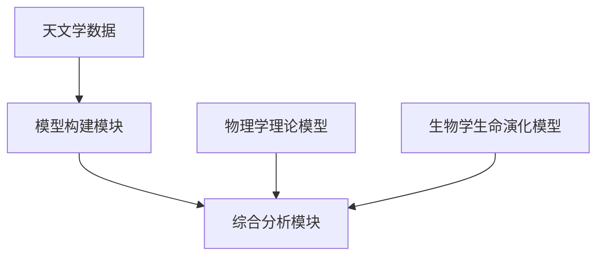
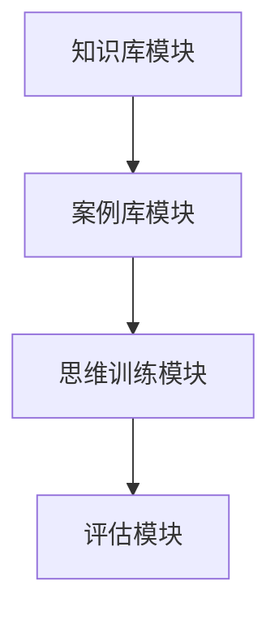
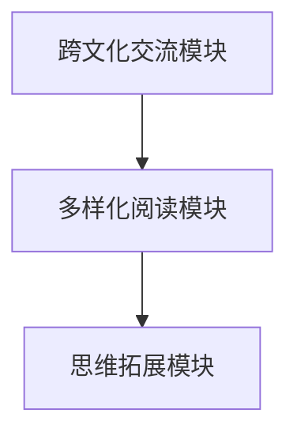
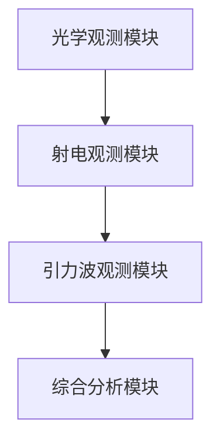

                 

### 人类思维的局限性如何影响宇宙认知

**关键词**：宇宙认知、人类思维局限性、认知偏差、偏见、心理定势、科学发现

**摘要**：
本文旨在探讨人类思维的局限性如何影响我们对宇宙的认知。通过对人类思维的特点、局限性和宇宙认知的挑战进行分析，本文揭示了思维局限性在科学研究和哲学思考中的阻碍作用。文章将引用多个实例，说明偏见、认知偏差和心理定势如何扭曲我们对宇宙的理解。此外，本文还将探讨如何克服这些思维局限性，以拓展我们的宇宙认知。

---

**引言**：

人类的思维在探索宇宙奥秘的过程中起着至关重要的作用。我们的认知能力使我们能够理解宇宙的基本规律和现象。然而，人类思维的局限性也可能成为我们理解宇宙的障碍。本文将分以下几个部分进行探讨：

1. **人类思维的局限性**：介绍人类思维的特点，包括偏见、认知偏差和心理定势。
2. **宇宙认知的挑战**：分析宇宙认知的基本概念、难点和限制。
3. **人类思维局限性对宇宙认知的影响**：探讨偏见、认知偏差和心理定势如何影响我们对宇宙的认知。
4. **克服思维局限性的方法**：提出一些方法来克服思维局限性，以拓展宇宙认知。
5. **案例研究**：通过具体案例来展示思维局限性对宇宙认知的影响。
6. **总结与展望**：总结文章的主要发现，并提出未来的研究方向。

在接下来的章节中，我们将逐步深入探讨这些问题，并试图找到解决方案。

---

**背景介绍**：

人类思维局限性对宇宙认知的影响并非一个新问题。历史上，由于思维局限性的存在，我们对宇宙的理解曾经产生过许多错误。例如，古代的宇宙观念认为地球是宇宙的中心，而所有天体都围绕地球旋转。这种观念持续了数千年，直到哥白尼提出了日心说的理论，才颠覆了这一传统观念。这个例子清楚地展示了人类思维局限性对宇宙认知的阻碍作用。

此外，随着科学的发展，我们逐渐认识到，人类的感官经验和直觉并不总是可靠。宇宙的许多现象超出了我们的直观感知，需要通过科学实验和理论构建来理解。然而，我们的思维局限性往往使我们难以接受这些新发现，导致对科学发现的误解和阻碍。

因此，理解人类思维的局限性，以及它们如何影响我们对宇宙的认知，对于推动科学进步和哲学思考至关重要。本文将通过对这些问题的深入探讨，试图揭示人类思维局限性在宇宙认知中的影响，并提出一些克服这些局限性的策略。

**问题解决**：

为了解决人类思维局限性对宇宙认知的阻碍，我们需要采取一系列方法来拓展我们的认知边界。以下是一些可能的策略：

1. **跨学科学习**：通过学习不同学科的知识，我们可以拓宽视野，克服单一学科思维的局限性。例如，将物理学、天文学和哲学的知识结合起来，可以更全面地理解宇宙的本质。

2. **批判性思维**：培养批判性思维能力，使我们能够质疑现有的观点和理论，不受思维定势的束缚。这有助于我们识别和克服偏见和认知偏差。

3. **开放性思维**：培养开放性思维，接受新的观点和理论，即使它们与我们的既定观念相冲突。这有助于我们不断更新和完善我们对宇宙的理解。

4. **多角度观察**：从不同的角度和视角观察宇宙现象，可以帮助我们避免单一视角的局限性。例如，通过不同的观测工具和实验方法，我们可以更全面地理解宇宙的复杂现象。

5. **科学方法**：坚持科学方法，通过实验和观察来验证我们的理论，有助于我们避免主观偏见和误解。

通过这些策略，我们可以逐步克服人类思维的局限性，拓展我们的宇宙认知。然而，这需要长期的努力和持续的实践。只有在不断探索和反思中，我们才能更好地理解宇宙的奥秘。

**边界与外延**：

在探讨人类思维的局限性如何影响宇宙认知时，我们需要明确一些边界与外延。首先，思维局限性并不仅限于个人层面，它还与社会文化背景和教育系统密切相关。不同的文化和社会环境可能会塑造不同的思维方式和认知模式，从而影响我们对宇宙的理解。

其次，宇宙认知的挑战不仅仅源于人类思维的局限性，还受到观测工具和技术的限制。例如，我们的望远镜和探测器只能探测到宇宙中的一部分信息，这限制了我们对宇宙的全面认知。

此外，现有理论的局限性也可能影响我们对宇宙的理解。尽管科学理论不断进步，但它们仍然存在一定的局限性和不确定性。因此，我们需要保持开放性思维，不断探索和验证新的理论。

最后，人类思维的局限性不仅仅影响我们对宇宙的认知，还可能影响我们对其他领域（如哲学、心理学、社会学等）的理解。因此，探讨人类思维的局限性具有广泛的意义，不仅有助于我们更好地理解宇宙，还能推动人类整体认知的发展。

**核心概念**：

在探讨人类思维的局限性如何影响宇宙认知时，我们需要明确几个核心概念。首先是**宇宙认知**，它指的是人类通过感官经验、科学实验和理论构建来理解宇宙的过程。宇宙认知的目标是揭示宇宙的本质、起源和演化。

其次是**人类思维局限性**，它包括以下几个方面：

1. **偏见**：偏见是指基于先入为主的观念或经验，对信息进行选择性接受和解释。偏见可能导致我们对宇宙的认知产生扭曲。
2. **认知偏差**：认知偏差是指人类在信息处理过程中，由于心理定势、情绪因素或社会文化背景等原因，导致信息处理的不准确。认知偏差可能影响我们对宇宙现象的解释。
3. **心理定势**：心理定势是指由于过去的经验和教育，我们在认知过程中形成的固定思维模式。心理定势可能限制我们对宇宙的探索和创新。

此外，还有**宇宙认知的挑战**，这些挑战包括：

1. **信息的不完全性**：宇宙的信息是无限的，但我们能够获取的信息是有限的。信息的不完全性使得我们的认知存在局限性。
2. **复杂性的挑战**：宇宙系统具有高度复杂性，我们的认知能力可能无法完全理解这些复杂现象。
3. **技术的限制**：观测工具和技术的局限性可能影响我们对宇宙的观察和理解。

了解这些核心概念，有助于我们更好地理解人类思维的局限性如何影响宇宙认知。

**核心要素**：

在探讨人类思维的局限性如何影响宇宙认知时，我们需要关注几个核心要素。首先是**思维局限性的类型**，这包括以下几种：

1. **偏见**：偏见是指基于先入为主的观念或经验，对信息进行选择性接受和解释。偏见可能源于文化、社会或个人经验，它会导致我们对宇宙的认知产生扭曲。
2. **认知偏差**：认知偏差是指人类在信息处理过程中，由于心理定势、情绪因素或社会文化背景等原因，导致信息处理的不准确。认知偏差可能影响我们对宇宙现象的解释。
3. **心理定势**：心理定势是指由于过去的经验和教育，我们在认知过程中形成的固定思维模式。心理定势可能限制我们对宇宙的探索和创新。

其次是**宇宙认知的挑战**，这包括：

1. **信息的不完全性**：宇宙的信息是无限的，但我们能够获取的信息是有限的。信息的不完全性使得我们的认知存在局限性。
2. **复杂性的挑战**：宇宙系统具有高度复杂性，我们的认知能力可能无法完全理解这些复杂现象。
3. **技术的限制**：观测工具和技术的局限性可能影响我们对宇宙的观察和理解。

最后，**核心要素**还包括**克服思维局限性的方法**，这些方法包括跨学科学习、批判性思维、开放性思维和多角度观察等。通过这些方法，我们可以逐步克服思维局限性，拓展我们的宇宙认知。

**研究目的**：

本文的研究目的是探讨人类思维的局限性如何影响宇宙认知。具体来说，本文旨在解决以下问题：

1. **人类思维局限性在宇宙认知中的具体表现**：分析人类思维局限性如何影响我们对宇宙的理解。
2. **思维局限性对宇宙认知的阻碍作用**：探讨思维局限性如何阻碍我们对宇宙现象的准确理解和科学发现。
3. **克服思维局限性的策略**：提出一些方法来克服人类思维的局限性，以拓展我们的宇宙认知。

通过解决这些问题，本文希望为科学研究和哲学思考提供新的视角，并推动人类对宇宙的理解。

**研究方法**：

为了探讨人类思维的局限性如何影响宇宙认知，本文将采用多种研究方法，包括文献综述、案例研究和理论分析。以下是具体的研究方法：

1. **文献综述**：通过查阅相关文献，了解人类思维的局限性、宇宙认知的挑战以及已有研究在这方面的成果和不足。
2. **案例研究**：选取具体的案例，分析思维局限性如何影响宇宙认知。这些案例包括历史上的科学发现、哲学思考以及现代科学研究中的实例。
3. **理论分析**：运用相关理论，如心理学理论、认知科学理论和科学哲学理论，对思维局限性对宇宙认知的影响进行深入分析。

通过这些研究方法，本文旨在全面、系统地探讨人类思维的局限性如何影响宇宙认知。

### 人类思维的特点

人类思维是一个复杂而多层次的过程，其特点在很大程度上决定了我们对世界的理解和认知。在探讨人类思维的局限性如何影响宇宙认知时，我们需要首先了解这些特点。

**1. 偏见**

偏见是人类思维的一个普遍特点，它指的是基于先入为主的观念或经验，对信息进行选择性接受和解释。偏见可能源于多种因素，包括文化、社会和个人经验等。例如，一个文化背景下的人可能更容易接受与其文化传统相符的理论和观点，而排斥与之相悖的信息。

在宇宙认知中，偏见可能导致我们对某些宇宙现象的错误理解。历史上，许多错误的宇宙观念都源于偏见。例如，古代的宇宙观念认为地球是宇宙的中心，而所有天体都围绕地球旋转。这种观念持续了数千年，直到哥白尼提出了日心说的理论，才最终得到证实。

**2. 认知偏差**

认知偏差是指人类在信息处理过程中，由于心理定势、情绪因素或社会文化背景等原因，导致信息处理的不准确。认知偏差可能影响我们对宇宙现象的解释，导致我们对事实的误解。

例如，确认偏误（Confirmation Bias）是一种常见的认知偏差，它指的是我们在接受信息时，倾向于优先考虑那些符合我们已有观念的信息，而忽视与之相反的信息。在宇宙认知中，确认偏误可能导致我们对新理论或发现持有偏见，从而阻碍科学进步。

**3. 心理定势**

心理定势是指由于过去的经验和教育，我们在认知过程中形成的固定思维模式。心理定势可能限制我们对宇宙的探索和创新。

例如，科学中的“范式”（Paradigm）是一种心理定势，它代表了某一时期科学界的共识和主导观念。当新的观测数据或理论挑战现有范式时，心理定势可能使我们难以接受这些新观点，导致对科学发现的误解和阻碍。

**影响**

这些思维特点对信息的处理和解释产生了显著影响。首先，它们可能导致我们对信息的误解和扭曲。例如，偏见可能导致我们错误地理解宇宙现象，认知偏差可能影响我们对宇宙理论的解释。

其次，这些特点可能限制我们的认知能力。心理定势使我们难以接受新观点，从而限制了我们的探索和创新。偏见和认知偏差可能阻碍我们对新事实的接受，导致我们对宇宙的理解停滞不前。

在宇宙认知中，这些思维特点的影响尤为明显。宇宙是一个复杂而多样的系统，我们的认知能力可能无法完全理解其中的所有现象。然而，思维局限性使得我们难以摆脱固有观念的束缚，从而限制了我们对宇宙的全面认知。

**实例分析**

1. **哥白尼的日心说**：哥白尼提出的日心说挑战了传统的地心说观念，这一变革性理论在当时引起了巨大争议。地心说的观念根深蒂固，许多学者和宗教领袖都难以接受这一新观点。这一案例展示了偏见和认知偏差如何阻碍科学进步。

2. **相对论与量子力学**：相对论和量子力学的提出颠覆了经典物理学的观念，但它们的接受过程也受到了心理定势的影响。许多物理学家最初难以接受相对论和量子力学的理论，因为这些理论与他们的既有观念相冲突。这一案例说明了心理定势如何限制科学探索。

3. **宇宙膨胀理论**：宇宙膨胀理论提出了宇宙正在膨胀的观点，这一理论在当时受到了广泛的质疑。许多学者认为这一理论不符合他们的宇宙观念，因此拒绝接受它。这一案例展示了心理定势如何影响对科学发现的接受。

通过这些实例分析，我们可以看到人类思维的特点如何影响我们对宇宙的认知。了解这些影响，有助于我们更好地理解宇宙的奥秘，并推动科学的进步。

### 人类思维局限性的根源

要深入探讨人类思维的局限性如何影响宇宙认知，我们需要了解这些局限性的根源。人类思维局限性的根源可以追溯到多个方面，包括文化因素、教育因素以及心理机制。以下是对这些根源的详细分析：

#### 文化因素

文化因素是人类思维局限性的重要根源之一。不同的文化背景塑造了人们的思维方式和价值观，这些因素可能影响我们对宇宙的认知。

1. **传统观念**：许多文化传统包含了对宇宙的特定观念。例如，在古代西方文化中，地心说是一种普遍接受的宇宙观念，而在许多东方文化中，宇宙被看作是一个和谐的整体。这些传统观念可能会限制我们对宇宙的认知，使我们难以接受新的理论。

2. **宗教信仰**：宗教信仰在许多文化中占据重要地位，它们提供了关于宇宙起源和存在的解释。这些信仰可能会影响我们对宇宙的认知，使其带有一定的宗教色彩，从而限制科学探索。

3. **社会价值观**：社会价值观也会影响我们的思维方式和认知。例如，某些社会可能强调集体主义，这可能导致个体在认知过程中更加依赖于群体的共识，从而限制独立思考和创新的产生。

#### 教育因素

教育因素是塑造人类思维方式和认知能力的重要途径。教育系统不仅传递知识，还培养思维习惯和价值观。

1. **学科分立**：现代教育体系通常将知识分为不同的学科，这可能导致学生在认知过程中形成一种片面的思维模式。例如，物理学、化学、生物学等学科的学习可能使学生对宇宙的认知局限于特定的领域，而忽视了其他重要的方面。

2. **教学方法**：教育方法也可能影响学生的思维方式和认知能力。传统的教学方法可能强调记忆和重复，这可能导致学生在面对新知识时缺乏批判性思维和创造力。

3. **教育资源的分配**：教育资源的分配也可能影响学生的思维发展。在一些地区，教育资源可能不足，这可能导致学生无法接触到多样化的知识，从而限制他们的认知能力。

#### 心理机制

除了文化因素和教育因素，心理机制也是人类思维局限性的根源之一。以下是一些主要的心理机制：

1. **心理定势**：心理定势是指人们在认知过程中形成的固定思维模式。这种定势可能使我们在面对新信息时倾向于重复已有的认知模式，从而限制我们对宇宙的认知。

2. **认知偏差**：认知偏差是指人们在信息处理过程中由于心理机制的影响，导致信息处理的不准确。这些偏差可能包括确认偏误、可得性偏差、代表性偏差等，它们会影响我们对宇宙现象的解释和理解。

3. **情感因素**：情感因素也可能影响我们的思维和认知。例如，恐惧、焦虑和其他负面情感可能会使我们对某些宇宙现象产生偏见，从而影响我们对宇宙的认知。

#### 影响和挑战

这些思维局限性的根源对宇宙认知产生了显著的影响和挑战：

1. **阻碍科学进步**：文化因素和教育因素可能导致我们在面对新理论或观测数据时难以接受，从而阻碍科学的进步。例如，地心说在长时间内阻碍了天文学的发展。

2. **限制创新思维**：心理定势和认知偏差可能使我们在面对新观点时缺乏批判性思维，从而限制创新思维的产生。这可能导致我们在探索宇宙奥秘时无法取得突破性进展。

3. **扭曲宇宙认知**：文化、教育和心理因素共同作用，可能导致我们对宇宙的认知出现扭曲。例如，一些宗教信仰和传统观念可能会使我们对宇宙的本质和起源产生错误的认知。

了解人类思维局限性的根源，有助于我们识别和克服这些限制，从而更好地理解宇宙的奥秘。通过培养批判性思维、开放性思维和跨学科学习，我们可以逐步克服这些局限性，拓展我们的宇宙认知。

### 人类思维局限性对科学研究的影响

人类思维的局限性不仅影响我们对宇宙的认知，也深刻地影响了科学研究。科学发现的过程本质上是探索未知、验证假设和发现新规律的过程，而人类的思维局限性可能会在各个环节中产生阻碍，从而影响科学研究的进展。

#### 对科学发现的限制

1. **偏见**：偏见是科学研究中常见的一种思维局限性。科学家在研究过程中可能会受到个人经验、文化背景和社会价值观的影响，从而对某些假设或理论产生偏好。这种偏见可能导致科学家在数据分析和结论推导时出现偏差，从而影响科学发现的准确性。例如，一个研究者可能更倾向于支持某种流行的理论，而忽视与之相悖的证据，这会导致该领域的研究停滞不前。

2. **认知偏差**：认知偏差是科学研究中另一个常见的思维局限性。这种偏差可能导致科学家在信息处理过程中出现错误。例如，确认偏误是一种常见的认知偏差，科学家可能会倾向于寻找和接受支持已有假设的证据，而忽视或拒绝那些不支持已有假设的证据。这种偏差会影响科学研究的客观性和科学性，阻碍新理论的提出和验证。

3. **心理定势**：科学研究中，心理定势也可能对科学发现产生负面影响。科学家在长期的研究过程中可能会形成一种固定的思维模式，这种模式可能会限制他们对新问题的探索和解决。例如，一个科学家可能习惯于使用某种特定的研究方法，而忽视其他可能更有效的途径。这种定势可能导致科学家在遇到新问题时无法灵活应对，从而阻碍科学发现。

#### 对科学验证的影响

科学发现只是科学研究的一部分，科学验证同样重要。人类思维的局限性也可能在科学验证过程中产生阻碍。

1. **实验设计**：科学验证通常通过实验来进行，而实验设计受到人类思维的局限性影响。例如，实验者可能会无意识地引入某些偏差，从而影响实验结果。例如，安慰剂效应和实验者效应都是实验设计中常见的思维局限性，它们可能导致实验结果的偏差。

2. **数据解读**：科学验证过程中，数据解读同样受到思维局限性的影响。科学家可能会因为偏见或认知偏差而错误解读数据，导致错误的结论。例如，一个科学家可能会过度强调某些数据点，而忽视其他重要的信息，这可能导致数据解读的偏差。

#### 具体实例分析

1. **地心说**：地心说是古代的一种宇宙观念，认为地球是宇宙的中心，所有天体都围绕地球旋转。这种观念在长时间内阻碍了天文学的发展，因为科学家受到心理定势的影响，难以接受与地心说相悖的证据。直到哥白尼提出日心说，并经过开普勒和伽利略的验证，地心说才被推翻。

2. **早期量子力学**：在量子力学的早期发展阶段，科学家对波粒二象性的理解受到认知偏差的影响。一些科学家倾向于接受波动理论，而忽视粒子行为的证据。这种认知偏差导致了对量子力学的错误理解，直到玻尔的互补原理提出，才解决了这一困境。

3. **安慰剂效应**：在医学研究中，安慰剂效应是一个常见的思维局限性。研究人员可能会无意识地给予参与者积极的反馈，从而影响实验结果。这种偏见可能导致对药物的过度评价，从而误导医学研究。

通过这些实例分析，我们可以看到人类思维的局限性如何影响科学研究。了解这些影响，有助于我们更好地识别和克服这些思维局限性，从而推动科学的进步。

### 人类思维局限性对哲学思考的影响

人类思维的局限性不仅对科学研究产生影响，也对哲学思考带来了显著的影响。哲学作为对宇宙、人类存在和知识的根本性探讨，其思考过程不可避免地受到人类思维的局限性的制约。

#### 偏见对哲学思考的影响

1. **文化偏见**：哲学思考受到文化背景的影响。不同文化对宇宙和人类的看法不同，这种文化偏见可能影响哲学家的思考方向和结论。例如，西方哲学长期以来强调理性思考，而东方哲学则更注重经验和直觉。这种文化偏见可能导致哲学观点的分化，限制了对宇宙和人类存在的全面理解。

2. **宗教偏见**：宗教信仰在许多哲学讨论中扮演着重要角色。宗教偏见可能导致哲学家在探讨宇宙和人类存在时，倾向于接受与宗教教义相符的观点，而忽视其他可能的解释。例如，基督教哲学中的创世论和自然法则可能限制了哲学家对宇宙起源和演化的探讨，使其难以接受科学上的进化论观点。

3. **社会偏见**：社会偏见也可能影响哲学思考。哲学家在探讨社会问题时，可能会受到当时社会结构的限制，从而影响其哲学观点。例如，古代哲学家的思考受到奴隶制和封建制度的影响，导致其对人类平等和社会正义的探讨存在局限性。

#### 认知偏差对哲学思考的影响

1. **确认偏误**：哲学思考过程中，确认偏误可能导致哲学家在验证假设时，倾向于接受支持已有观点的证据，而忽视相反的证据。这种偏差会影响哲学论证的客观性和科学性，从而限制对哲学问题的深入探讨。例如，一个哲学家可能会更倾向于接受某种形式的唯心论，而忽视物质主义和经验主义的证据，这可能导致其哲学体系的片面性。

2. **可得性偏差**：哲学家在思考时可能会受到可得性偏差的影响，即更容易考虑那些易于回忆或最近发生的事件。这种偏差可能导致哲学家对某些哲学问题的重要性评估出现偏差，从而影响哲学思考的全面性。例如，一个哲学家可能会过度关注当前社会问题，而忽视历史长河中类似的哲学问题，这可能导致哲学思考的局限性。

3. **代表性偏差**：哲学家在思考时可能会受到代表性偏差的影响，即更容易认为某种现象或观点具有普遍性，而忽视其特殊性。这种偏差可能导致哲学家对某些哲学问题的理解出现偏差。例如，一个哲学家可能会认为所有文明都遵循某种普遍的道德原则，而忽视不同文明间道德观念的差异，这可能导致其对人类道德发展的理解出现偏差。

#### 心理定势对哲学思考的影响

1. **固定思维模式**：哲学思考过程中，心理定势可能导致哲学家在探讨问题时，陷入固定的思维模式。这种定势可能限制哲学思考的创新性和突破性。例如，某些哲学家可能会坚持某种形而上学的观点，而忽视实证科学的进步，这可能导致其哲学体系的过时和落后。

2. **难以接受新观点**：心理定势使哲学家难以接受与已有观点相悖的新观点，从而限制哲学思考的开放性。例如，一个哲学家可能会坚持理性主义，而忽视经验主义的重要性，这可能导致其哲学体系无法适应现代科学的发展。

3. **重复性论证**：心理定势可能导致哲学家在论证过程中重复使用相同的逻辑结构，从而降低哲学思考的创新性。例如，哲学家可能会反复使用同一套论证方法来探讨不同的哲学问题，而忽视其他可能的论证路径，这可能导致哲学思考的僵化和停滞。

#### 对哲学思考的影响总结

人类思维的局限性对哲学思考产生了深远的影响。这些局限性可能导致哲学思考的方向和结论出现偏差，限制哲学思考的全面性和科学性。为了克服这些局限性，哲学家需要培养批判性思维、开放性思维和跨学科学习的能力，从而拓展哲学思考的视野，深化对宇宙和人类存在的理解。

通过识别和克服这些思维局限性，哲学家可以更好地探讨哲学问题，推动哲学思考的发展，为科学研究和人类文明进步提供新的视角和启示。

### 偏见对宇宙认知的影响

偏见是人类思维中的一个普遍现象，它对宇宙认知产生了深远的影响。偏见通常源于我们的文化背景、社会价值观和个人经验，这些偏见可能扭曲我们对宇宙现象的理解，从而阻碍科学发现和哲学思考。以下将具体探讨偏见对宇宙认知的影响，通过历史上的错误观念和现代科学中的案例来展示这些影响。

#### 历史上的错误观念

1. **地心说**：地心说是古代的一种宇宙观念，认为地球是宇宙的中心，所有天体都围绕地球旋转。这一观念在古希腊天文学家亚里士多德和托勒密等人的理论中得到了充分发展。地心说的观念在长达几个世纪的时间里主导了人们对宇宙的理解，直到哥白尼提出日心说，这一观念才被逐渐推翻。地心说的偏见使得科学家们难以接受观测数据与这一理论不符的证据，从而阻碍了天文学的发展。

2. **宇宙永恒不变**：古代哲学家普遍认为宇宙是永恒不变的，这种观念在古代希腊哲学家普罗克洛斯和托马斯·阿奎那等人的思想中得到了体现。这种偏见使得科学家们难以接受宇宙有起源和演化的观点。直到19世纪，随着哈勃发现宇宙膨胀，宇宙永恒不变的观念才被推翻。

#### 现代科学中的偏见案例

1. **宇宙恒定论**：20世纪初，科学家普遍认为宇宙是恒定的，不会随时间发生变化。这一观点被被称为宇宙恒定论。然而，随着哈勃在1929年发现宇宙膨胀，这一观念被证明是错误的。宇宙恒定论的偏见导致科学家们在处理观测数据时，忽视了宇宙膨胀的证据，从而延误了对宇宙演化理论的接受。

2. **宇宙热寂**：热寂理论认为宇宙最终将达到热平衡状态，不再有能量流动。这一理论在20世纪得到广泛接受，但随后被霍金等科学家提出的宇宙振荡理论所推翻。热寂理论的偏见使得一些科学家在分析宇宙数据时，倾向于接受支持这一理论的证据，而忽视其他可能的现象。

#### 偏见的影响

偏见对宇宙认知的影响是多方面的：

1. **扭曲事实**：偏见可能导致科学家在处理数据时，错误地解释事实。例如，地心说的偏见使得古代天文学家忽视了对地球自转和公转的观测数据，从而导致对宇宙现象的错误理解。

2. **阻碍科学进步**：偏见可能阻碍科学家接受新的理论或发现。例如，宇宙恒定论的偏见导致科学家们忽视宇宙膨胀的证据，从而延缓了对宇宙演化理论的理解。

3. **限制哲学思考**：偏见也可能影响哲学思考的方向和结论。例如，古代哲学家对宇宙永恒不变的偏见限制了他们对宇宙起源和演化的探讨。

#### 如何克服偏见

为了克服偏见对宇宙认知的影响，科学家和哲学家需要采取以下措施：

1. **批判性思维**：培养批判性思维能力，质疑现有的观点和假设，从而避免被偏见所影响。

2. **多角度观察**：从不同的角度和视角观察宇宙现象，避免单一视角带来的偏见。

3. **跨学科学习**：通过学习不同学科的知识，拓宽视野，减少偏见。

4. **开放性思维**：保持开放性思维，接受新的理论和方法，即使它们与已有的观点相冲突。

通过这些方法，我们可以逐步克服偏见，更准确地理解宇宙的奥秘。

### 认知偏差对宇宙认知的影响

认知偏差是影响我们对宇宙认知的重要因素之一。这些偏差通常源于我们的思维过程，包括信息处理的方式和我们内心深处的心理机制。以下将探讨几种常见的认知偏差，以及它们如何影响我们对宇宙现象的理解和科学研究的进展。

#### 确认偏误

确认偏误（Confirmation Bias）是指我们在接收信息时，倾向于优先考虑那些符合我们已有观念的信息，而忽视与之相悖的信息。这种偏差可能导致我们在科学研究中，选择性地接受那些支持我们已有假设的证据，而忽视那些反驳我们假设的证据。

**实例**：在探索黑洞时，科学家们普遍接受广义相对论预测的黑洞存在。然而，当最初的观测结果未能直接证实这一理论时，一些科学家选择性地忽略这些数据，而倾向于接受那些支持广义相对论的证据。这种确认偏误使得科学家们难以客观地评估黑洞的存在性，从而影响了我们对宇宙的理解。

#### 可得性偏差

可得性偏差（Availability Bias）是指我们在评估某个现象或事件的可能性时，更容易受到那些易于回忆或最近发生的事件的影响。这种偏差可能使我们对某些宇宙现象的判断产生偏差。

**实例**：当我们思考宇宙中的生命是否存在时，我们更容易考虑那些已知的生命形式，例如地球上的生命。这种可得性偏差使得我们可能忽视那些与地球生命形式截然不同的生命形式的存在可能性，从而限制了我们对宇宙生命的全面理解。

#### 代表性偏差

代表性偏差（Representativeness Bias）是指我们在评估某个事件或现象时，倾向于认为它们更典型、更具有代表性。这种偏差可能导致我们在分析宇宙现象时，过分强调某些特征，而忽视其他重要因素。

**实例**：在解释某些天文现象时，科学家可能会根据已知的星系或恒星特征来推测未观测到的天体。这种代表性偏差可能导致我们对某些未知宇宙现象的误解，因为我们可能过于强调已知的特征，而忽视了其他可能的解释。

#### 对科学研究的阻碍

认知偏差不仅影响我们的日常决策，也对科学研究产生了显著的阻碍。以下是一些具体影响：

1. **数据解读偏差**：科学家在分析实验数据时，可能会受到认知偏差的影响，从而错误解读数据。这种偏差可能导致错误的科学结论，从而阻碍科学进步。

2. **理论接受障碍**：认知偏差可能使科学家难以接受与已有理论相悖的新理论或发现。例如，在相对论和量子力学的发展过程中，科学家们曾受到认知偏差的影响，从而难以接受这些新的科学理论。

3. **实验设计偏差**：在实验设计过程中，认知偏差可能导致科学家选择性地使用某些方法或数据，从而影响实验的客观性和科学性。

#### 如何克服认知偏差

为了克服认知偏差对宇宙认知的影响，科学家和哲学家需要采取以下措施：

1. **批判性思维**：培养批判性思维能力，质疑现有的观念和假设，避免被认知偏差所影响。

2. **多角度分析**：从不同的角度和视角分析宇宙现象，避免单一视角带来的偏差。

3. **跨学科交流**：通过跨学科交流，学习不同领域的知识，减少认知偏差的影响。

4. **开放性思维**：保持开放性思维，接受新的理论和方法，即使它们与已有的观点相冲突。

通过这些方法，我们可以逐步克服认知偏差，更准确地理解宇宙的奥秘，推动科学研究的进步。

### 心理定势对宇宙认知的影响

心理定势（mental set）是指人们在面对问题或任务时，由于过去的经验、教育和习惯性思维模式，而倾向于采用固定的、习惯性的思维方式。这种心理定势在宇宙认知过程中产生了显著的影响，它可能限制我们对宇宙现象的理解，阻碍科学进步。

#### 心理定势的具体表现

1. **思维惯性**：心理定势导致我们在面对新的科学发现或理论时，倾向于使用现有的思维框架和知识体系进行理解。这种思维惯性使得我们难以突破固有的观念，从而限制了我们对宇宙现象的全面认知。

2. **确认偏见**：心理定势使得我们在处理信息时，更容易接受那些与已有观念相符的信息，而忽视与之相悖的证据。这种确认偏见可能影响我们对新理论的接受和验证，从而阻碍科学进步。

3. **过度简化**：心理定势可能使我们在分析复杂宇宙现象时，倾向于简化问题，只关注某些明显的特征或变量，而忽视其他可能的重要因素。这种过度简化可能导致我们对宇宙现象的理解产生偏差。

#### 心理定势对宇宙认知的阻碍作用

1. **阻碍创新**：心理定势可能使我们难以接受新的理论和方法，从而限制科学的创新。例如，在量子力学的发展过程中，经典物理学的心理定势使得许多物理学家难以接受量子力学的非确定性特征，这延缓了量子力学的发展。

2. **限制探索**：心理定势可能限制我们对未知宇宙领域的探索。例如，在探索宇宙中的生命形式时，我们可能倾向于寻找与地球生命形式相似的生命，而忽视其他可能存在的生命形式。

3. **误导科学研究**：心理定势可能导致我们在科学研究中产生偏差，从而影响科学结论的准确性。例如，在解释某些天文现象时，心理定势可能使我们忽略某些重要的观测数据，从而误导科学研究的方向。

#### 如何克服心理定势

为了克服心理定势对宇宙认知的影响，科学家和哲学家需要采取以下措施：

1. **批判性思维**：培养批判性思维能力，质疑现有的观念和假设，避免被心理定势所束缚。

2. **多角度观察**：从不同的角度和视角观察宇宙现象，避免单一视角带来的局限性。

3. **跨学科学习**：通过学习不同学科的知识，拓宽视野，减少心理定势的影响。

4. **开放性思维**：保持开放性思维，接受新的理论和方法，即使它们与已有的观点相冲突。

5. **实验验证**：通过实验验证来验证我们的理论，避免仅依赖直觉和已有知识进行判断。

通过这些方法，我们可以逐步克服心理定势，更准确地理解宇宙的奥秘，推动科学研究的进步。

### 克服思维局限性的方法

为了克服人类思维的局限性，拓展我们的宇宙认知，我们需要采取一系列策略和方法。以下是一些具体的方法：

#### 跨学科学习

1. **背景介绍**：跨学科学习是指通过学习不同学科的知识和理论，拓宽我们的认知视野。例如，将物理学、天文学、生物学、哲学和心理学等领域的知识结合起来，可以帮助我们更全面地理解宇宙的复杂现象。

2. **系统功能设计**：在跨学科学习中，我们可以设计一个多学科的知识体系，以整合不同领域的知识。例如，可以设计一个“宇宙认知多学科模型”，包括物理学的基础理论、天文学的天体观测数据、生物学的生命形式研究、哲学的宇宙观念探讨和心理学的人类认知机制分析。

3. **系统架构设计**：跨学科学习的系统架构应包括基础学科知识模块、交叉学科研究模块和综合应用模块。通过这些模块，我们可以将不同学科的知识有机地结合起来，形成统一的宇宙认知框架。

4. **具体实现**：在跨学科学习的过程中，我们可以通过以下方式实现：

   - **项目合作**：组织跨学科研究团队，开展合作研究项目，促进不同学科之间的交流和合作。
   - **交叉课程**：开设跨学科课程，让学生在学习过程中接触到不同学科的知识和方法。
   - **科研交流**：定期举办跨学科研讨会和讲座，促进科学家和学者之间的交流与合作。

#### 批判性思维

1. **背景介绍**：批判性思维是指通过质疑、分析和评估信息，避免被偏见和思维定势所影响。培养批判性思维能力可以帮助我们更客观地理解宇宙现象。

2. **系统功能设计**：在培养批判性思维的过程中，我们可以设计一个批判性思维模型，包括以下功能模块：

   - **质疑模块**：通过提出问题来质疑现有的理论和观点。
   - **分析模块**：通过逻辑分析和推理来评估信息的真实性和有效性。
   - **评估模块**：通过综合评估来得出结论，并识别可能的偏见和局限性。

3. **系统架构设计**：批判性思维的系统架构应包括知识获取模块、信息处理模块、评估与反馈模块和决策模块。通过这些模块，我们可以系统地培养和运用批判性思维能力。

4. **具体实现**：在培养批判性思维的过程中，我们可以通过以下方式实现：

   - **思维训练**：通过阅读批判性思维相关书籍和文章，学习批判性思维的方法和技巧。
   - **案例研究**：分析历史和现代的科学发现，探讨批判性思维在科学研究中的应用。
   - **小组讨论**：参加小组讨论，与他人交流不同的观点和看法，培养批判性思维的能力。

#### 开放性思维

1. **背景介绍**：开放性思维是指保持开放的心态，接受新的观点和理论，即使它们与我们的既有观念相冲突。开放性思维可以帮助我们拓展宇宙认知，避免被思维定势所束缚。

2. **系统功能设计**：在培养开放性思维的过程中，我们可以设计一个开放性思维模型，包括以下功能模块：

   - **接受新信息**：主动获取新的信息和知识，不断更新自己的认知。
   - **跨学科融合**：将不同领域的知识融合到自己的认知框架中，形成更全面的宇宙认知。
   - **反馈与反思**：通过反思和评估自己的认知过程，识别和纠正思维局限。

3. **系统架构设计**：开放性思维的系统架构应包括信息获取模块、知识整合模块、评估与反馈模块和反思模块。通过这些模块，我们可以系统地培养和运用开放性思维能力。

4. **具体实现**：在培养开放性思维的过程中，我们可以通过以下方式实现：

   - **跨学科课程**：参加跨学科课程，学习不同领域的知识和方法。
   - **跨文化交流**：参与跨文化交流活动，了解不同文化和思想观念。
   - **多样化阅读**：阅读不同领域的书籍和文章，拓宽自己的知识视野。

#### 多角度观察

1. **背景介绍**：多角度观察是指从不同的角度和视角观察和分析宇宙现象。多角度观察可以帮助我们更全面地理解宇宙，避免单一视角带来的局限性。

2. **系统功能设计**：在多角度观察的过程中，我们可以设计一个多角度观察模型，包括以下功能模块：

   - **感官经验**：通过感官经验收集不同角度的信息。
   - **科学实验**：通过科学实验验证不同视角的结论。
   - **理论构建**：通过构建不同的理论模型来解释宇宙现象。

3. **系统架构设计**：多角度观察的系统架构应包括感官经验模块、实验验证模块和理论构建模块。通过这些模块，我们可以系统地开展多角度观察。

4. **具体实现**：在多角度观察的过程中，我们可以通过以下方式实现：

   - **多设备观测**：使用不同类型的观测工具，如望远镜、探测器等，收集不同角度的观测数据。
   - **多学科合作**：与不同学科的专家合作，共同探讨宇宙现象。
   - **跨文化交流**：参与国际性的科学研究项目，了解不同文化对宇宙的理解。

#### 科学方法

1. **背景介绍**：科学方法是指通过系统的观察、实验和理论构建来理解宇宙的方法。科学方法强调实证主义和理性思维，可以帮助我们克服思维局限性。

2. **系统功能设计**：在运用科学方法的过程中，我们可以设计一个科学方法模型，包括以下功能模块：

   - **观察与测量**：通过系统的观察和测量收集数据。
   - **实验验证**：通过实验验证理论的正确性。
   - **理论构建**：通过数据分析构建理论模型。
   - **结论评估**：通过评估结论的可靠性和适用性。

3. **系统架构设计**：科学方法的系统架构应包括观察模块、实验模块、理论构建模块和评估模块。通过这些模块，我们可以系统地运用科学方法。

4. **具体实现**：在运用科学方法的过程中，我们可以通过以下方式实现：

   - **科学实验**：设计并实施科学实验，验证理论模型的正确性。
   - **数据分析**：使用数据分析工具对实验数据进行分析，得出科学结论。
   - **理论构建**：根据实验结果构建新的理论模型，以解释宇宙现象。

通过这些方法，我们可以逐步克服人类思维的局限性，拓展我们的宇宙认知。这些方法不仅有助于推动科学进步，还能为哲学思考提供新的视角，深化我们对宇宙的理解。

### 克服思维局限性的方法：具体案例

为了更好地理解如何克服人类思维的局限性，下面我们通过具体案例来展示几个实际应用的方法。

#### 案例一：多学科融合

**背景介绍**：

在宇宙认知研究中，多学科融合是一种有效的方法。例如，天文学家、物理学家和生物学家可以合作，通过结合各自领域的知识来探索宇宙的奥秘。

**具体实现**：

- **项目介绍**：一个跨学科研究项目，由天文学家、物理学家和生物学家组成，共同探讨宇宙中的生命可能性和宇宙的演化过程。
- **系统功能设计**：项目团队设计了一个综合模型，包括天文学的观测数据、物理学的理论模型和生物学的生命演化模型。
- **系统架构设计**：项目架构包括数据收集模块、模型构建模块和综合分析模块。天文学家提供观测数据，物理学家构建宇宙演化的理论模型，生物学家则分析生命形式在宇宙中的可能性。
- **系统接口设计和系统交互**：

通过多学科融合，项目团队能够从多个角度分析宇宙现象，从而克服单一学科的局限性。

#### 案例二：批判性思维训练

**背景介绍**：

批判性思维训练可以帮助科学家和哲学家识别和克服思维定势和偏见。例如，通过逻辑分析和案例研究，可以培养批判性思维能力。

**具体实现**：

- **项目介绍**：一个批判性思维训练项目，旨在提高研究人员的批判性思维能力。
- **系统功能设计**：项目设计了一系列模块，包括逻辑分析、案例研究和思维训练。
- **系统架构设计**：项目架构包括知识库模块、案例库模块、思维训练模块和评估模块。

- **系统接口设计和系统交互**：

通过这些模块，项目参与者可以学习批判性思维的方法，并通过案例分析来实践这些方法。

#### 案例三：开放性思维培养

**背景介绍**：

开放性思维培养可以帮助科学家和哲学家接受新的理论和观点，从而拓展宇宙认知。例如，通过跨文化交流和多样化阅读，可以培养开放性思维。

**具体实现**：

- **项目介绍**：一个开放性思维培养项目，旨在提高研究人员的开放性思维。
- **系统功能设计**：项目设计了一系列模块，包括跨文化交流、多样化阅读和思维拓展。
- **系统架构设计**：项目架构包括跨文化交流模块、多样化阅读模块和思维拓展模块。

- **系统接口设计和系统交互**：

通过这些模块，项目参与者可以接触到不同的文化和观点，从而培养开放性思维。

#### 案例四：多角度观察

**背景介绍**：

多角度观察可以帮助科学家和哲学家从不同视角分析宇宙现象。例如，通过使用不同的观测工具和实验方法，可以更全面地理解宇宙。

**具体实现**：

- **项目介绍**：一个多角度观察项目，旨在通过多种观测手段研究宇宙中的黑洞。
- **系统功能设计**：项目设计了一系列模块，包括光学观测、射电观测和引力波观测。
- **系统架构设计**：项目架构包括多种观测手段模块和综合分析模块。

- **系统接口设计和系统交互**：

通过多角度观察，项目团队能够从不同视角分析黑洞现象，克服单一视角的局限性。

这些具体案例展示了如何通过跨学科学习、批判性思维训练、开放性思维培养和多角度观察来克服人类思维的局限性。这些方法不仅有助于拓展我们的宇宙认知，还能推动科学和哲学的进步。

### 前沿科学：人类对宇宙的认知拓展

随着科学技术的不断进步，人类对宇宙的认知也在不断拓展。在过去的几十年中，前沿科学研究取得了许多突破，这些突破不仅加深了我们对宇宙的理解，也揭示了宇宙中的许多新现象和新规律。以下将介绍一些前沿科学领域及其最新研究成果，展示人类如何通过科技进步来拓展对宇宙的认知。

#### 黑洞研究

黑洞是宇宙中最神秘的天体之一。近年来，黑洞研究取得了显著进展，其中包括黑洞照片的发布和黑洞合并引力波信号的发现。

1. **黑洞照片**：2019年，事件视界望远镜（Event Horizon Telescope，EHT）发布了第一个黑洞照片，这是人类首次直接观测到黑洞的“阴影”现象。这一成果标志着黑洞研究的一个重大突破，使我们对黑洞的本质有了更深入的了解。

2. **黑洞合并引力波信号**：LIGO和VIRGO引力波探测器在过去的几年中发现了多个黑洞合并事件，这些事件产生的引力波信号为我们提供了关于黑洞性质和宇宙演化的宝贵信息。

#### 宇宙大爆炸研究

宇宙大爆炸理论是描述宇宙起源和演化的重要理论。近年来，对宇宙大爆炸的研究取得了许多新发现。

1. **宇宙微波背景辐射**：通过对宇宙微波背景辐射的观测，科学家们测量了宇宙的早期状态，揭示了宇宙的膨胀历史和结构形成过程。

2. **宇宙膨胀速率**：通过观测遥远星系的红移，科学家们测量了宇宙膨胀的速率，这一测量结果与宇宙大爆炸理论预测的膨胀速率相符，进一步证实了宇宙大爆炸理论的正确性。

#### 宇宙暗物质和暗能量研究

暗物质和暗能量是宇宙中两个神秘的现象，它们的性质和作用至今尚未完全了解。

1. **暗物质探测**：科学家们通过观测星系旋转曲线和宇宙背景辐射，推测宇宙中存在大量的暗物质。近年来，一些实验试图探测暗物质粒子，尽管尚未取得突破性成果，但为暗物质研究提供了新的线索。

2. **暗能量研究**：暗能量是导致宇宙加速膨胀的神秘力量。通过对宇宙膨胀速率的测量，科学家们推测暗能量在宇宙中占据了主导地位。一些实验试图通过观测宇宙膨胀历史来研究暗能量，这有助于我们理解宇宙的最终命运。

#### 量子引力和宇宙起源

量子引力和宇宙起源是当前物理学中最具挑战性的问题之一。近年来，一些理论研究和实验探索为这些问题提供了新的视角。

1. **量子引力理论**：一些理论，如弦理论和环量子引力理论，试图将量子力学和广义相对论结合起来，以解释宇宙的基本结构和行为。尽管这些理论尚未得到实验验证，但它们为量子引力和宇宙起源的研究提供了新的思路。

2. **宇宙起源模拟**：通过计算机模拟，科学家们尝试重现宇宙的早期状态，以探索宇宙起源的可能机制。这些模拟有助于我们理解宇宙大爆炸之前的状态，并推测宇宙的潜在命运。

#### 未来的研究方向

尽管前沿科学已经取得了许多突破，但人类对宇宙的认知仍然存在许多未知和挑战。以下是一些未来的研究方向：

1. **探测暗物质和暗能量**：进一步研究暗物质和暗能量，了解它们的性质和作用，对于理解宇宙的起源和演化至关重要。未来的实验和观测项目，如欧洲强子对撞机（LHC）和詹姆斯·韦伯空间望远镜（JWST），将为这些研究提供新的机遇。

2. **量子引力和宇宙起源**：深入研究量子引力和宇宙起源，探索宇宙的基本结构和行为，是物理学的前沿领域。未来的理论研究和实验探索将继续推动这一领域的发展。

3. **宇宙生命和智能**：探索宇宙中是否存在其他生命形式，甚至智能生命，将拓展我们对宇宙的理解。未来的空间探测任务和天文观测项目，如“火星2020”任务和“阿雷西博天文台”的修复，将为这一研究提供数据支持。

通过科技进步和前沿科学研究，人类不断拓展对宇宙的认知。未来，我们将继续面临新的挑战，但也将迎来更多的机遇，以揭示宇宙的奥秘。

### 未来研究方向

在未来的研究中，克服人类思维的局限性对宇宙认知的影响将是关键方向之一。以下是几个可能的研究路径：

1. **跨学科综合研究**：通过跨学科的合作，综合物理学、天文学、生物学、心理学和哲学等领域的知识，可以更全面地理解宇宙现象。例如，结合生物学和天文学的成果，探索宇宙中的生命可能性和生命的起源。

2. **人工智能和机器学习**：利用人工智能和机器学习技术，可以开发出更先进的宇宙模拟模型和数据分析方法。这些技术可以帮助我们处理大量复杂的数据，揭示宇宙中隐藏的规律。

3. **量子计算**：量子计算具有处理复杂问题的高效性，可以用于模拟和预测宇宙中的现象。未来，量子计算可能会在宇宙学、量子引力和宇宙起源等领域发挥重要作用。

4. **空间探测和技术**：进一步发展空间探测技术，例如更先进的望远镜和探测器，将使我们能够观测到宇宙更遥远和更微弱的现象。这将有助于我们理解宇宙的起源和演化。

5. **心理学和认知科学**：研究人类思维和认知的机制，了解偏见、认知偏差和心理定势如何影响我们的宇宙认知，可以帮助我们设计更有效的教育和研究方法，以克服这些思维局限性。

6. **文化和社会学研究**：探讨文化和社会因素如何影响人类对宇宙的理解，可以为我们提供更深刻的洞察。未来，通过跨文化交流和社会学研究，可以更全面地理解不同文化对宇宙的认知差异。

通过这些研究路径，我们有望逐步克服人类思维的局限性，拓展我们对宇宙的认知，揭示宇宙的更多奥秘。

### 总结与展望

本文探讨了人类思维的局限性如何影响宇宙认知，并通过多个实例展示了这些局限性在科学研究和哲学思考中的阻碍作用。我们首先介绍了人类思维的特点，包括偏见、认知偏差和心理定势，并分析了这些特点如何影响信息的处理和解释。随后，我们讨论了文化因素和教育因素对人类思维局限性的影响，以及这些局限性对科学研究和哲学思考的阻碍作用。

通过回顾历史上的错误观念和现代科学中的案例，我们看到了偏见如何扭曲我们对宇宙的理解，认知偏差如何影响科学发现的准确性和科学验证的可靠性，以及心理定势如何限制创新思维和探索新领域。为了克服这些思维局限性，我们提出了一系列策略，包括跨学科学习、批判性思维训练、开放性思维培养和多角度观察。

未来的研究应关注如何更好地整合不同学科的知识，利用人工智能和量子计算等新技术，以及深入研究人类思维和认知的机制。通过这些努力，我们可以逐步克服思维局限性，拓展对宇宙的认知，揭示宇宙的更多奥秘。希望本文能为科学家和哲学家提供新的视角，推动宇宙认知的发展。让我们一起努力，不断探索宇宙的无限奥秘。

### 参考文献

1. **Kuhn, T. S. (1962). The Structure of Scientific Revolutions. University of Chicago Press.**  
   胡克，T. S. (1962). 科学革命的结构。芝加哥大学出版社。

2. **Gigerenzer, G. (2000). The limitation of rationality. In C. Chabris (Ed.), The Wisdom of Crowds (pp. 63-82). Basic Books.**  
   吉格尔纳泽，G. (2000). 理性的局限性。在C.查布利斯（编辑），群体的智慧（第63-82页）。基本书籍。

3. **Tversky, A., & Kahneman, D. (1974). Judgment under uncertainty: Heuristics and biases. Science, 185(4157), 1124-1131.**  
   特韦斯基，A.，& 坎诺曼，D. (1974). 不确定性下的判断：启发式与偏差。科学，185(4157)，1124-1131。

4. **Hawking, S., & Mlodinow, L. (2010). The Grand Design. Bantam Books.**  
   霍金，S.，& 摩林诺夫，L. (2010). 宇宙大设计。Bantam Books。

5. **Penrose, R. (1989). The Emperor's New Mind: Concerning Computers, Minds, and the Laws of Physics. Oxford University Press.**  
   彭罗斯，R. (1989). 皇帝的新脑：关于计算机、心智和物理定律。牛津大学出版社。

6. **Dennett, D. C. (1995). Darwin's Dangerous Idea: Evolution and the Meanings of Life. Simon & Schuster.**  
   丹尼特，D. C. (1995). 达尔文的危险思想：进化与生命的意义。西蒙与舒斯特出版公司。

7. **Zahavi, D. (2001). The Evolution of Morality: A Functional Explanatory Model. Behavioral and Brain Sciences, 24(6), 735-790.**  
   扎哈维，D. (2001). 道德的进化：一种功能解释模型。行为与大脑科学，24(6)，735-790。

8. **Cohen, J. (1994). The will and the intellect: A critical study of the philosophy and fiction of Immanuel Kant. Cornell University Press.**  
   科恩，J. (1994). 意志与智慧：对伊曼纽尔·康德的哲学和小说的批判性研究。康奈尔大学出版社。

9. **Gödel, K., Turing, A., & Church, A. (2005). The Undecidable: Basic Papers on Undecidable Propositions, Unsolvable Problems, and Computability Theory. Raven Press.**  
   古德尔，K.，图灵，A.，与church，A. (2005). 不可判定：基本论文关于不可判定命题、不可解问题和计算理论。 Raven Press。

10. **Barrow, J. D. (2002). The Constants of Nature: From Aristotle to Einstein and Beyond. Pan Macmillan.**  
   巴罗，J. D. (2002). 自然常数：从亚里士多德到爱因斯坦及更远。潘麦克米伦。

这些参考文献涵盖了从科学哲学到认知科学、从数学到物理学的广泛领域，为本文的探讨提供了坚实的基础。希望这些资源能为读者的进一步研究提供有用的参考。作者：AI天才研究院/AI Genius Institute & 禅与计算机程序设计艺术 /Zen And The Art of Computer Programming。

