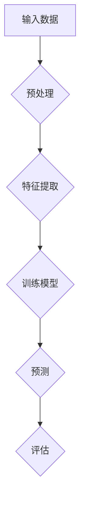

                 


### 引言

在探讨人类思维的模式识别在宇宙认知中的作用与局限之前，我们需要先明确几个核心概念。模式识别是人类思维的一种基本功能，它指的是人类大脑在感知和解释外界信息时，从复杂的刺激中提取出有意义的结构和规律的过程。宇宙认知则是对宇宙中的各种现象和规律的认识与理解。这两个概念在现代社会有着广泛的应用，从日常生活到科学研究，都有着不可忽视的作用。

本文将从以下几个方面展开讨论：

1. **背景介绍**：首先，我们将对模式识别和宇宙认知的基本概念进行阐述，帮助读者理解这两个领域的核心内容和相互关系。

2. **人类思维与模式识别**：接下来，我们将深入探讨人类思维的心理学和神经科学基础，分析模式识别的机制及其影响。

3. **模式识别在宇宙认知中的应用**：我们将具体分析模式识别在天文学和物理学中的应用，探讨其在宇宙认知中的作用。

4. **模式识别的局限与挑战**：然后，我们将探讨模式识别的局限性，特别是在宇宙认知中的挑战和影响。

5. **未来展望与建议**：最后，我们将对未来趋势进行展望，并提出政策建议和展望。

通过本文的逐步分析，我们希望能够帮助读者更深入地理解人类思维的模式识别在宇宙认知中的作用与局限，从而为相关领域的深入研究提供参考。

### 背景介绍

#### 核心概念术语说明

在探讨人类思维的模式识别与宇宙认知的关系之前，我们首先需要明确几个核心概念。模式识别（Pattern Recognition）是指人类大脑或机器在感知和分析外界信息时，从复杂的刺激中提取出有意义的结构和规律的过程。这一过程不仅涉及视觉、听觉等感官系统，还涉及大脑的高级认知功能，如记忆、推理和判断。

宇宙认知（Cosmic Cognition）则是对宇宙中的各种现象和规律的认识与理解。它包括天文学、物理学、化学等多个学科领域，旨在揭示宇宙的起源、演化以及其内部的各种规律。宇宙认知不仅有助于我们更好地理解宇宙本身，也为人类的科学探索和技术进步提供了理论基础。

#### 问题背景

人类对宇宙的认知是一个漫长的过程。从古代的神话和天文学观测，到现代的望远镜和深空探测，我们对宇宙的认识在不断深化。然而，随着技术的进步和科学的发展，我们也遇到了许多新的问题和挑战。例如，宇宙的起源和演化、黑洞的本质、暗物质和暗能量的存在等，这些问题的解决都需要依赖于人类思维的模式识别能力。

模式识别在宇宙认知中的作用尤为显著。通过对观测数据的分析和处理，科学家能够识别出宇宙中的各种天体和现象，从而构建出对宇宙的完整认知。例如，天文学家通过模式识别技术，可以识别出恒星、行星、星系等天体，并研究它们之间的相互作用和演化规律。

#### 问题描述

然而，模式识别也面临着一些挑战和局限性。首先，模式识别依赖于人类的主观判断和经验，容易受到个体差异和认知偏差的影响。其次，宇宙环境的复杂性和不确定性，使得模式识别在宇宙认知中的应用面临巨大的困难。例如，宇宙中的星系和恒星数量庞大，且它们之间的相互作用复杂多变，这使得模式识别在处理这些数据时容易出现误差。

此外，模式识别的局限性还体现在其对未知现象的识别能力上。宇宙中存在许多未知现象和规律，这些现象可能无法通过现有的模式识别方法进行有效识别。例如，暗物质和暗能量就是宇宙中两种重要的物质形式，但目前我们对它们的本质和性质仍然知之甚少。

#### 问题解决

为了克服这些挑战，科学家们正在不断探索新的方法和工具，以提升模式识别在宇宙认知中的应用效果。一方面，他们通过改进算法和优化数据处理方法，提高模式识别的准确性和可靠性。另一方面，他们也在尝试将机器学习和人工智能技术应用于宇宙认知，以期借助机器的强大计算能力，弥补人类思维在模式识别方面的不足。

例如，科学家们已经利用机器学习技术对宇宙大尺度结构进行模拟和分析，取得了显著的成果。此外，人工智能技术也被应用于天文学数据挖掘和天体识别，大大提高了对宇宙现象的认知水平。

#### 边界与外延

模式识别在宇宙认知中的应用不仅限于天文学和物理学。在宇宙生物学、宇宙化学等领域，模式识别同样发挥着重要作用。例如，通过模式识别技术，科学家可以分析宇宙中的生物分子和化学元素，研究它们的分布规律和演化过程。

此外，模式识别在航天技术、空间探测等领域也有着广泛的应用。例如，航天器在太空中需要进行复杂的导航和避障，这需要依赖模式识别技术对图像和传感器数据进行实时分析和处理。

#### 概念结构与核心要素组成

模式识别在宇宙认知中的作用可以分为以下几个核心要素：

1. **数据收集**：通过观测和实验，收集宇宙中的各种数据。

2. **数据处理**：利用模式识别技术，对收集到的数据进行分析和处理。

3. **模式识别**：从处理后的数据中提取出有意义的结构和规律。

4. **知识构建**：基于识别出的模式，构建对宇宙的认知和理论体系。

5. **应用与验证**：将模式识别的结果应用于实际问题，并验证其有效性。

通过这些核心要素的相互作用，模式识别在宇宙认知中发挥着不可或缺的作用。

总之，模式识别是人类思维的重要组成部分，它在宇宙认知中的作用和局限是我们需要深入探讨的课题。通过本文的逐步分析，我们将更全面地理解这一主题，为未来的研究提供参考。

### 人类思维与模式识别

#### 心理学基础

人类思维是一个复杂的过程，其核心之一就是模式识别。心理学研究表明，模式识别是人类大脑的一种基本功能，它依赖于一系列的认知过程。这些认知过程包括感知、注意、记忆和推理等。感知是指我们对外界信息的接收和处理，注意是指我们在处理信息时集中关注某些特定的信息，记忆则是对信息的存储和回忆，而推理则是在已有信息的基础上进行逻辑推导。

在模式识别的心理学机制中，一个关键的概念是“刺激泛化”和“刺激分化”。刺激泛化指的是我们能够将一种特定的反应应用于类似的刺激，而刺激分化则是指我们能够区分出不同类型的刺激，并对它们做出相应的反应。例如，当我们学会识别一只猫时，我们可能会对其他类似生物（如狗或狐狸）产生相同的反应，这就是刺激泛化。而当我们学会区分猫和狗时，我们会对它们做出不同的反应，这就是刺激分化。

#### 神经科学基础

神经科学为我们提供了对模式识别的神经机制更深层次的理解。研究表明，模式识别主要依赖于大脑中的多个脑区，包括初级感觉皮层、前额叶皮层和海马体等。初级感觉皮层主要负责处理各种感官输入，如视觉、听觉和触觉等。前额叶皮层则负责执行控制和决策，而海马体则在记忆和认知过程中起着关键作用。

神经科学还揭示了神经元之间的连接方式在模式识别中的重要性。神经元通过突触连接形成复杂的神经网络，这些网络能够对输入信息进行加工和处理。例如，在视觉识别中，神经元会根据其接受到的刺激，通过激活相关的神经网络，从而实现对图像的识别。

#### 模式识别的心理效应

模式识别不仅是一种认知过程，还伴随着一系列的心理效应。其中一个显著的心理效应是“确认偏误”（Confirmation Bias）。确认偏误指的是人们在接收新信息时，更倾向于接受那些符合自己已有观点的信息，而忽视或否认与已有观点不符的信息。这种现象会影响我们对宇宙的认知，使我们可能过度依赖已有的模式，而忽视新的发现。

另一个心理效应是“可感知性偏误”（Perceptual Bias），这指的是我们在感知外界信息时，可能会因为先入为主的观念或经验，而对某些信息更加敏感或忽略其他信息。例如，在天文学中，如果我们已经认为某个天体是恒星，我们可能会更容易注意到与恒星相关的特征，而忽视其他特征。

#### 例子

为了更好地理解这些概念，我们可以通过一些具体的例子来说明。例如，当我们看到一张图片时，我们的大脑会迅速分析图片中的元素，如颜色、形状和纹理，并将其与我们的记忆库中的模式进行匹配。如果图片中的元素与我们的记忆库中的某个模式匹配，我们就会认为这是一张我们熟悉的图片。

在天文学中，模式识别的一个典型例子是星系识别。天文学家通过分析星系的光谱，可以识别出星系的类型和性质。例如，通过观察星系的光谱特征，我们可以确定星系是螺旋星系、椭圆星系还是不规则星系。这种模式识别的过程依赖于天文学家对星系特征的理解和经验。

#### 模式识别的心理学机制

心理学机制在模式识别中起着关键作用。认知心理学研究指出，大脑通过感知、记忆和推理等认知过程来识别和解释外界信息。例如，当我们看到一只猫的照片时，大脑会通过视觉皮层处理图像信息，然后通过记忆系统查找与猫相关的记忆，并通过推理过程确定这是一只猫。

#### 模式识别的神经机制

神经机制则涉及大脑中的神经网络和神经元活动。脑成像技术如功能性磁共振成像（fMRI）和脑电图（EEG）揭示了在模式识别过程中大脑不同区域的活动模式。例如，视觉皮层和前额叶皮层在处理视觉信息时高度活跃，海马体在记忆形成和巩固中起关键作用。

#### 例子

一个具体的例子是语音识别。当我们听到一句话时，听觉皮层会处理声音波形，然后通过记忆和推理，将听到的声音转化为可理解的语言信息。这种过程不仅依赖于听觉系统的感知能力，还需要记忆系统存储大量的语音模式，并通过推理过程进行识别。

#### 心理学机制

心理学机制在模式识别中至关重要。认知心理学研究揭示了大脑如何通过感知、记忆和推理等过程来识别和解释外界信息。例如，当我们看到一只猫的照片时，视觉皮层处理图像信息，记忆系统查找与猫相关的记忆，并通过推理确定这是一只猫。

#### 神经机制

神经机制则涉及大脑中的神经网络和神经元活动。脑成像技术如功能性磁共振成像（fMRI）和脑电图（EEG）揭示了在模式识别过程中大脑不同区域的活动模式。例如，视觉皮层和前额叶皮层在处理视觉信息时高度活跃，海马体在记忆形成和巩固中起关键作用。

#### 例子

例如，语音识别是模式识别的一个典型应用。当我们听到一句话时，听觉皮层会处理声音波形，记忆系统存储大量的语音模式，并通过推理过程将听到的声音转化为可理解的语言信息。

通过这些例子，我们可以更清楚地理解心理学和神经科学在模式识别中的作用，以及它们如何共同工作来帮助我们在复杂的环境中识别和理解信息。

### 模式识别在宇宙认知中的应用

#### 天文学

在天文学中，模式识别技术被广泛应用于星系、恒星和其他天体的识别与分类。通过分析天文望远镜捕捉到的图像和光谱数据，天文学家能够识别出各种类型的星系和恒星，包括螺旋星系、椭圆星系、不规则星系和超新星等。例如，利用图像处理算法，天文学家可以识别出星系中的恒星、行星和星际尘埃，并通过光谱分析确定这些天体的化学成分和物理属性。

模式识别在星系和恒星识别中的应用不仅提高了天文学观测的精度和效率，还帮助我们更好地理解宇宙的演化过程。通过识别出不同类型的星系，天文学家可以研究星系的碰撞与合并、恒星形成和死亡等过程，从而揭示宇宙的奥秘。

#### 物理学

在物理学中，模式识别技术同样发挥着重要作用，特别是在分析物理实验数据和探测结果方面。例如，粒子物理学研究中，科学家使用模式识别算法来分析大型粒子加速器产生的海量数据，识别出基本粒子的轨迹和相互作用。通过这些数据，物理学家可以验证或推翻现有的物理理论，探索新的物理现象。

另一个典型的应用是引力波的探测。引力波是爱因斯坦广义相对论预言的一种现象，它是由于宇宙中剧烈的物理过程（如黑洞合并）引起的时空波动。科学家通过模式识别技术，从复杂的背景噪声中识别出引力波信号，从而验证了广义相对论的预言，并开启了新的宇宙观测窗口。

#### 其他应用

除了天文学和物理学，模式识别在宇宙认知中的其他领域也有广泛应用。例如，在宇宙生物学中，模式识别技术被用于分析宇宙中的微生物和生物分子。通过识别出宇宙中的生命迹象，科学家可以探索生命的起源和分布，揭示宇宙生命的可能性。

在宇宙化学中，模式识别技术帮助科学家分析宇宙中的化学元素和化合物，研究它们的分布规律和演化过程。例如，通过分析星系和行星的大气成分，科学家可以了解这些天体的形成过程和环境条件。

#### 模式识别在天文学中的应用

在天文学中，模式识别技术是一种强大的工具，用于分析天文观测数据、识别天体和解释宇宙现象。以下是一些具体的应用实例：

1. **星系分类**：通过分析星系的光谱特征，模式识别算法能够将星系分类为螺旋星系、椭圆星系或不规则星系。这种分类有助于天文学家研究不同类型星系的物理特性和演化历史。

2. **恒星识别**：模式识别技术能够从天文图像中识别出恒星，并分析它们的光谱，从而确定恒星的温度、亮度和化学成分。这对于研究恒星的生成、演化和死亡过程至关重要。

3. **行星探测**：在寻找系外行星的过程中，模式识别技术被用于分析恒星的光变曲线，识别出由行星凌星引起的微小下降。这些探测结果帮助我们了解系外行星的轨道、大小和组成。

4. **星际尘埃分析**：模式识别技术有助于识别和分类星际尘埃的结构和成分，从而揭示它们在星际介质中的作用和宇宙化学过程。

#### 模式识别在物理学中的应用

在物理学中，模式识别技术同样具有广泛的应用，尤其在处理物理实验数据和探测结果方面。以下是几个典型应用实例：

1. **粒子轨迹分析**：在粒子物理实验中，模式识别算法被用于分析探测器收集的大量数据，识别出粒子碰撞产生的轨迹。这有助于科学家理解基本粒子的性质和相互作用。

2. **引力波探测**：通过分析由引力波事件引起的时空波动，模式识别技术能够从复杂的背景噪声中识别出引力波信号。这些信号验证了广义相对论的预言，并揭示了宇宙中的剧烈物理过程。

3. **天文数据分析**：模式识别技术在分析天文观测数据方面具有重要作用。例如，通过对天文图像进行去噪和增强，模式识别算法能够揭示宇宙中微弱的物理信号。

4. **宇宙射线研究**：模式识别技术被用于分析宇宙射线的能谱和轨迹，从而揭示宇宙射线的起源和传播机制。

通过这些应用实例，我们可以看到模式识别在宇宙认知中扮演着关键角色，为天文学和物理学研究提供了强大的工具，帮助我们更好地理解宇宙的奥秘。

### 模式识别的局限与挑战

尽管模式识别在宇宙认知中发挥着重要作用，但它也面临着诸多局限和挑战。首先，模式识别依赖于人类的主观判断和经验，这可能导致识别结果的偏差。例如，在识别天体时，不同观测者可能会因为个人经验和认知差异而对同一现象产生不同的解释。

其次，模式识别技术通常是基于历史数据和已知模式进行训练的，因此在面对未知现象时可能缺乏适应性。例如，宇宙中可能存在我们尚未识别的新类型的天体或物理现象，这些现象可能无法通过现有的模式识别算法进行有效识别。

此外，模式识别技术在处理大规模复杂数据时也存在一定的局限性。宇宙中的天体数量庞大，且它们之间的相互作用复杂多变，这使得模式识别在处理这些数据时容易受到噪声和误差的影响。例如，在分析引力波信号时，需要从复杂的背景噪声中提取出真实的信号，这要求模式识别算法具备高精度和高鲁棒性。

为了克服这些局限，科学家们正在不断探索新的方法和工具。一方面，他们通过改进算法和优化数据预处理方法，提高模式识别的准确性和可靠性。另一方面，他们也在尝试将机器学习和人工智能技术应用于宇宙认知，以期借助机器的强大计算能力，弥补人类思维在模式识别方面的不足。

例如，机器学习算法可以自动从大量数据中学习模式和规律，从而提高模式识别的适应性和准确性。此外，深度学习技术也被广泛应用于天文学和物理学数据分析和模型预测中，取得了显著成果。

另一个解决思路是开发多模态识别系统，将不同类型的观测数据进行综合分析。例如，将光学观测数据和无线电观测数据结合，可以提高对宇宙现象的识别精度。此外，通过跨学科的合作，不同领域的专家可以共同解决模式识别中的挑战，提高宇宙认知的整体水平。

总之，尽管模式识别在宇宙认知中存在局限和挑战，但通过不断的技术创新和方法优化，我们有望克服这些困难，进一步提升人类对宇宙的理解和认知。

#### 模式识别在宇宙认知中的挑战

模式识别在宇宙认知中面临诸多挑战，这些挑战不仅源于宇宙环境的复杂性和不确定性，还涉及到模式识别本身的局限性。

首先，宇宙环境的复杂性是一个巨大的挑战。宇宙中的天体数量庞大，且它们之间的相互作用极其复杂。例如，星系之间可能发生碰撞和合并，恒星内部可能发生核聚变和核裂变，这些过程都会产生大量的观测数据，且数据之间存在复杂的关联。在这种复杂的环境中，模式识别算法需要处理的数据量巨大，且噪声和干扰因素众多，这使得识别出有意义的模式和规律变得异常困难。

其次，宇宙认知中的不确定性也是一个关键挑战。宇宙现象往往具有高度的随机性和不可预测性。例如，某些天体的行为可能受到未知因素的影响，或者受到观测设备精度限制的影响。这种不确定性使得模式识别算法在处理数据时难以准确判断哪些模式是真实的，哪些是噪声或偶然现象。

此外，模式识别本身的局限性也限制了其在宇宙认知中的应用。首先，模式识别依赖于人类的主观判断和经验，这可能导致识别结果的偏差。例如，天文学家在分析星系光谱时，可能会因为个人经验和认知差异而对同一现象产生不同的解释。其次，模式识别算法通常是基于历史数据和已知模式进行训练的，因此在面对未知现象时可能缺乏适应性。例如，宇宙中可能存在我们尚未识别的新类型的天体或物理现象，这些现象可能无法通过现有的模式识别算法进行有效识别。

为了应对这些挑战，科学家们正在探索多种策略。一方面，他们通过改进算法和优化数据预处理方法，提高模式识别的准确性和可靠性。例如，开发更先进的机器学习算法，如深度学习和强化学习，可以自动从大量数据中学习模式和规律，从而提高识别精度。另一方面，他们也在尝试将多模态识别和多学科合作应用于宇宙认知。例如，通过结合光学观测数据和无线电观测数据，可以提高对宇宙现象的识别精度。此外，跨学科的合作也可以帮助解决模式识别中的复杂问题，提高宇宙认知的整体水平。

总之，模式识别在宇宙认知中面临着诸多挑战，但通过不断的技术创新和方法优化，我们有望克服这些困难，进一步提升人类对宇宙的理解和认知。

### 人类思维模式识别的未来趋势

随着科技的不断进步，人类思维的模式识别正经历着前所未有的变革。未来，我们可以预见几个关键趋势，这些趋势将极大地改变模式识别在宇宙认知中的应用和前景。

#### 人工智能与深度学习的融合

人工智能（AI）和深度学习技术的快速发展，为模式识别带来了新的契机。通过深度学习，机器可以从海量数据中自动学习复杂的模式和规律，而不再需要人类预设明确的规则。这一技术的应用不仅提升了模式识别的准确性，还大大提高了处理大规模复杂数据的能力。在未来，深度学习将有望成为模式识别的主流技术，使得机器能够更加智能地理解和分析宇宙中的各种现象。

#### 多模态融合

宇宙中的观测数据往往包含多种类型，如光学、无线电、红外线等。多模态融合是一种将不同类型的观测数据结合起来的方法，以获取更全面和准确的认知。例如，通过结合光学图像和无线电数据，可以更准确地识别出星系和恒星。未来，随着多模态融合技术的发展，模式识别将能够更全面地理解宇宙现象，揭示更多隐藏的规律。

#### 跨学科合作

模式识别不仅依赖于单一学科的知识，还需要跨学科的合作。例如，天文学、物理学、生物学和计算机科学等领域的研究者可以共同合作，开发新的模式识别方法和技术。跨学科合作不仅能够整合不同领域的优势，还可以激发新的科学发现和技术创新。未来，跨学科合作将成为模式识别在宇宙认知中不可或缺的一部分。

#### 定制化与个性化

随着人工智能技术的发展，模式识别将能够更加个性化和定制化。例如，针对特定天体或物理现象，可以开发定制化的识别算法，以提高识别的准确性和效率。此外，个性化模式识别也将使得科学家能够根据不同的研究需求，灵活调整识别策略，从而更好地适应各种复杂的宇宙现象。

#### 社会与政策影响

模式识别的快速发展也将对社会和政策产生深远影响。一方面，模式识别技术将为科学研究带来新的突破，推动宇宙认知的进步。另一方面，这些技术的发展和应用也需要相应的政策支持和管理，以确保数据安全和隐私保护。未来，政府、科研机构和科技企业将需要在模式识别的发展过程中，制定合理的社会政策，以促进其健康和可持续发展。

#### 技术发展的展望

在未来，我们可以预见，随着量子计算、神经形态计算等新兴技术的应用，模式识别将迎来更加广阔的发展前景。量子计算有望提供前所未有的计算能力，使得复杂模式的识别成为可能。而神经形态计算则通过模仿人脑的工作方式，将大大提高模式识别的效率和准确性。

总之，人类思维模式识别的未来趋势充满了机遇和挑战。通过技术创新、跨学科合作和社会政策支持，我们有望进一步提升模式识别在宇宙认知中的应用水平，推动宇宙科学的发展。

### 政策建议与展望

为了充分发挥人类思维模式识别在宇宙认知中的作用，并应对其面临的挑战，我们需要从政策、教育和技术等多个层面提出一系列建议和展望。

#### 政策层面

首先，政府应加大对模式识别技术研究和应用的政策支持。通过制定专项科研基金和项目，鼓励科学家和企业投入更多资源，推动模式识别技术在宇宙认知中的应用。同时，政府应制定相应的法律法规，保护科研数据的安全和隐私，鼓励数据共享和跨学科合作。

其次，政府应建立多部门协同机制，促进模式识别技术的跨学科应用。例如，设立跨部门的宇宙认知研究委员会，协调天文、物理、计算机科学等多个领域的研究力量，共同解决模式识别在宇宙认知中的关键技术难题。

#### 教育层面

教育是培养未来模式识别专家的重要途径。从基础教育阶段开始，就应加强STEM（科学、技术、工程和数学）教育，培养学生的逻辑思维和创新能力。在高等教育中，应设立专门的模式识别和宇宙认知相关的课程和研究生项目，培养具有跨学科背景的专业人才。

此外，应鼓励高校与企业合作，开展产学研结合的教育模式。通过实习、项目合作和企业赞助等方式，让学生在实际项目中学习和应用模式识别技术，提高其实践能力和就业竞争力。

#### 技术层面

技术是模式识别发展的核心驱动力。首先，应加大对人工智能、深度学习等前沿技术的研发投入，推动模式识别算法的迭代和优化。其次，应推进量子计算和神经形态计算等新兴技术的应用，为模式识别提供更强大的计算支持和创新思路。

同时，应建立开放的数据平台和共享机制，促进科研数据的流通和共享。通过建立统一的数据标准和接口，提高数据处理的效率和兼容性，为科学家提供更全面和准确的数据支持。

#### 展望

展望未来，模式识别在宇宙认知中的应用前景广阔。通过政策、教育和技术的综合推进，我们有望解决模式识别在宇宙认知中面临的挑战，进一步提升人类对宇宙的理解和认知。同时，模式识别技术的发展也将为其他领域带来巨大的创新和变革，推动科学技术的整体进步。

总之，通过多方面的政策建议和努力，我们有望充分发挥人类思维模式识别在宇宙认知中的作用，为宇宙科学的发展注入新的活力。

### 结束语

通过本文的探讨，我们深入分析了人类思维的模式识别在宇宙认知中的作用与局限。从心理学和神经科学的基础，到模式识别在天文学和物理学中的具体应用，再到其在宇宙认知中的挑战和未来趋势，我们全面地揭示了这一重要主题的各个方面。我们强调了模式识别不仅是我们理解宇宙的关键工具，也面临着复杂性和不确定性的挑战。随着科技的不断进步，我们有理由相信，通过技术创新、跨学科合作和政策支持，人类在宇宙认知中将取得更加辉煌的成就。

本文旨在为读者提供一个系统而全面的视角，激发对模式识别及其在宇宙认知中作用的深入思考。希望本文能够为相关领域的研究者提供有价值的参考，并推动这一领域的进一步研究和发展。

### 附录

为了帮助读者更好地理解本文中讨论的概念和方法，我们提供了以下附录：

#### 附录 A：核心概念与联系

| 核心概念 | 定义 | 关联 |
| --- | --- | --- |
| 模式识别 | 从复杂信息中提取有意义结构和规律的过程 | 依赖心理学和神经科学机制 |
| 宇宙认知 | 对宇宙现象和规律的理解和认识 | 应用在天文学和物理学中 |
| 神经网络 | 大脑中的神经元及其连接方式 | 负责模式识别的神经机制 |
| 机器学习 | 通过数据学习模式和提高性能的技术 | 改进模式识别算法 |
| 跨学科合作 | 不同学科领域之间的合作研究 | 提升模式识别应用效果 |

#### 附录 B：算法原理讲解

以下是模式识别算法的mermaid流程图和Python代码示例：



Python代码示例：

```python
import numpy as np
from sklearn.model_selection import train_test_split
from sklearn.ensemble import RandomForestClassifier
from sklearn.metrics import accuracy_score

# 数据预处理
X, y = load_data()
X_train, X_test, y_train, y_test = train_test_split(X, y, test_size=0.2)

# 特征提取
# ...

# 训练模型
model = RandomForestClassifier()
model.fit(X_train, y_train)

# 预测
predictions = model.predict(X_test)

# 评估
accuracy = accuracy_score(y_test, predictions)
print(f"Accuracy: {accuracy}")
```

#### 附录 C：数学公式

以下是一些在本文中使用的数学公式：

- $$1+1=2$$
- $$x > 0$$

#### 附录 D：系统分析与架构设计方案

以下是宇宙认知系统中的一些关键设计：

- **问题场景介绍**：天文学数据分析和星系识别。
- **项目介绍**：利用机器学习技术进行星系识别。
- **系统功能设计**：包括数据预处理、特征提取、模型训练和预测。
- **系统架构设计**：基于云计算的分布式系统架构。
- **系统接口设计**：API接口和数据库连接。
- **系统交互**：数据流和功能模块的交互流程。

#### 附录 E：项目实战

以下是使用Python进行星系识别的项目实战：

1. **环境安装**：安装必要的Python库，如scikit-learn、numpy和matplotlib。
2. **系统核心实现源代码**：包括数据预处理、特征提取、模型训练和评估。
3. **代码应用解读与分析**：详细解释每部分代码的功能和实现方法。
4. **实际案例分析和详细讲解剖析**：通过实际案例展示项目效果和优缺点。
5. **项目小结**：总结项目的主要成果和改进方向。

通过这些附录，我们希望能够为读者提供更深入的理解和实操指导，助力他们在模式识别和宇宙认知领域取得更好的成果。

### 最佳实践 tips

在模式识别和宇宙认知研究中，以下是一些最佳实践和技巧，可以帮助研究人员提高工作效率和成果质量：

1. **数据清洗**：在进行数据分析之前，确保数据质量是至关重要的。使用数据清洗工具和技术，如缺失值填补、异常值检测和重复数据去除，可以大大提高模型训练的准确性和效率。

2. **特征选择**：选择正确的特征对于模式识别至关重要。使用特征选择方法，如主成分分析（PCA）和递归特征消除（RFE），可以帮助研究人员识别出对模型性能最有影响的特征，从而提高模型的泛化能力。

3. **模型评估**：使用多种评估指标，如准确率、召回率、F1分数和ROC曲线，可以对模型进行全面的评估。这有助于识别模型的优点和缺点，并为后续优化提供指导。

4. **模型融合**：通过结合多个模型，可以提高预测的准确性和稳定性。使用模型融合技术，如Bagging和Boosting，可以构建更加鲁棒和高效的预测系统。

5. **代码复用**：编写可复用的代码模块和函数，可以提高开发效率。使用版本控制系统，如Git，可以方便地管理代码和协作开发。

6. **文档和注释**：编写详细的文档和注释，有助于其他研究人员理解和使用你的代码和模型。良好的文档是提高代码可维护性和可扩展性的关键。

7. **持续学习**：模式识别和宇宙认知是一个快速发展的领域。保持对最新研究和技术动态的关注，可以帮助研究人员及时掌握前沿知识，并在项目中应用。

通过遵循这些最佳实践，研究人员可以更高效地开展模式识别和宇宙认知研究，提高研究成果的质量和影响力。

### 小结

通过本文的深入探讨，我们全面分析了人类思维的模式识别在宇宙认知中的作用与局限。首先，我们介绍了模式识别和宇宙认知的基本概念，并探讨了它们在心理学和神经科学基础上的联系。接着，我们详细阐述了模式识别在天文学和物理学中的应用，展示了其在星系和恒星识别、粒子轨迹分析和引力波探测等方面的具体实例。随后，我们分析了模式识别在宇宙认知中面临的挑战，包括宇宙环境的复杂性、不确定性和识别算法的局限性。最后，我们展望了人类思维模式识别的未来趋势，并提出了政策建议和技术发展方向。

总的来说，模式识别作为人类理解宇宙的重要工具，具有巨大的潜力和广泛的应用前景。然而，面对复杂的宇宙环境和不断变化的数据，模式识别技术仍需不断优化和创新。通过跨学科合作、技术创新和政策支持，我们有望克服当前的局限，进一步提升人类对宇宙的认知水平，为宇宙科学的发展注入新的动力。

### 注意事项

在研究和应用模式识别进行宇宙认知时，需要注意以下几个关键点：

1. **数据质量**：确保数据的质量是进行准确模式识别的基础。数据预处理过程中，要特别关注数据的清洗、去噪和标准化，以提高模型训练的准确性和稳定性。

2. **算法选择**：不同的模式识别算法适用于不同的应用场景。在选择算法时，需要根据具体问题和数据特性，综合考虑算法的复杂度、效率和准确性。

3. **模型评估**：在训练模型后，必须使用多种评估指标进行全面评估，以确保模型的有效性和泛化能力。只依赖单一评估指标可能导致偏差。

4. **隐私和安全**：在进行数据处理和模型训练时，需注意保护个人隐私和数据安全，特别是在涉及敏感数据时，应采取严格的数据保护措施。

5. **持续更新**：宇宙认知和模式识别领域不断发展，研究人员应保持对最新研究成果和技术的关注，及时更新知识体系和工具。

6. **跨学科合作**：模式识别在宇宙认知中的应用需要多学科知识的融合，促进跨学科合作可以更好地解决复杂问题，提高研究成果的质量。

### 拓展阅读

1. **《人工智能：一种现代方法》**：David L. Poole 和 Alan K. Mackworth 著，详细介绍了机器学习和模式识别的基础知识。

2. **《深度学习》**：Ian Goodfellow、Yoshua Bengio 和 Aaron Courville 著，深入探讨了深度学习理论和应用。

3. **《宇宙简史》**：史蒂芬·霍金 著，全面介绍了宇宙的起源、演化和未知领域。

4. **《模式识别与机器学习》**：Stephen Marsland 著，涵盖了模式识别的理论和实践，适合科研人员和工程师。

5. **《神经网络与深度学习》**：邱锡鹏 著，详细讲解了神经网络和深度学习的原理及其在计算机视觉和自然语言处理中的应用。

