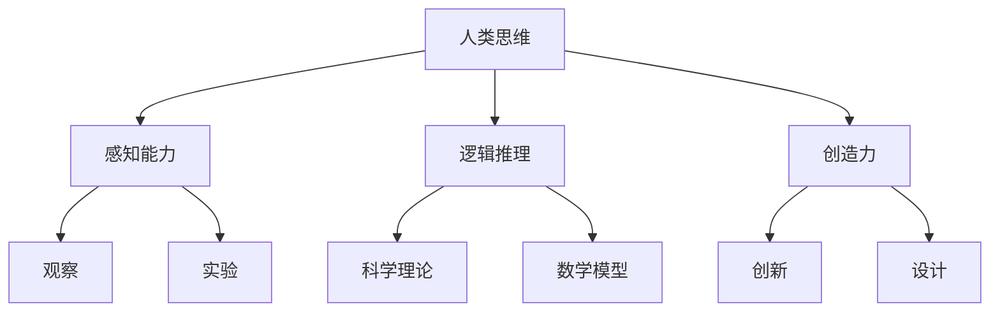
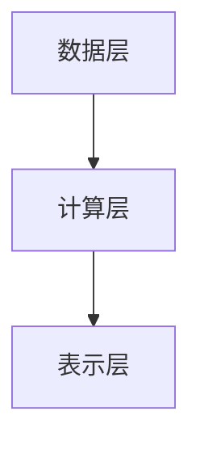
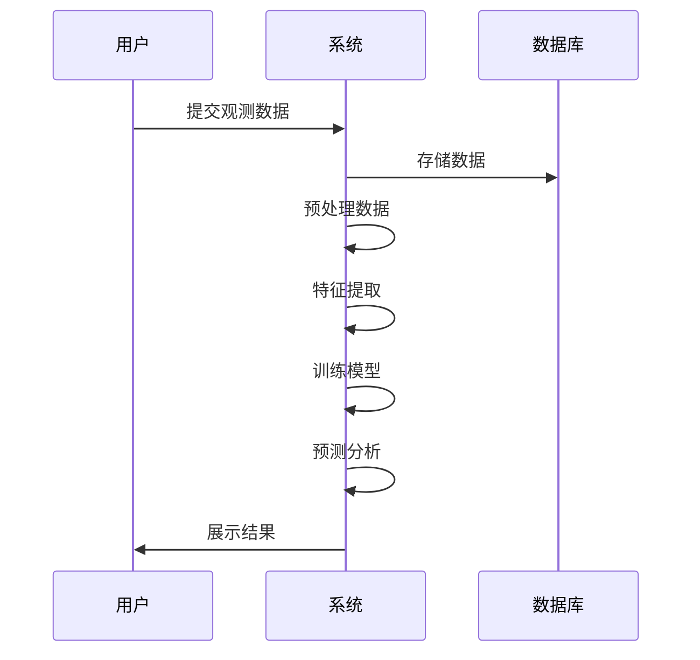

                 

### 人类思维能否超越宇宙

> 关键词：人类思维、宇宙、认知边界、科技进步、算法原理、数学模型

> 摘要：本文从人类思维的起源与发展、宇宙的基本概念与结构、人类思维与宇宙的互动、人类思维能否超越宇宙的可能性与挑战、未来展望等多个方面，深入探讨了人类思维是否能够超越宇宙这一重要问题。文章结合实际案例，分析了人类思维在探索宇宙中的贡献与限制，并通过算法原理讲解和数学模型阐述，探讨了人类思维能否在未来的科技进步中超越宇宙。

### 目录大纲

1. 问题背景与理论探讨
   1.1 人类思维的起源与发展
   1.2 宇宙的基本概念与结构
   1.3 人类思维在现代社会的重要性

2. 人类思维与宇宙的互动
   2.1 人类对宇宙的认知过程
   2.2 人类思维在探索宇宙中的贡献
   2.3 人类思维对宇宙探索的限制

3. 人类思维能否超越宇宙？
   3.1 可能性分析
   3.2 现实挑战与应对策略
   3.3 未来展望

4. 核心概念与联系
   4.1 人类思维与宇宙的ER实体关系图
   4.2 人类思维与宇宙的概念属性特征对比表格

5. 算法原理讲解
   5.1 宇宙探索中的算法原理
   5.2 智能算法在宇宙探索中的应用
   5.3 数学模型与公式

6. 数学模型和数学公式 & 详细讲解 & 举例说明
   6.1 引力定律
   6.2 量子力学与相对论

7. 系统分析与架构设计方案
   7.1 问题场景介绍
   7.2 系统功能设计
   7.3 系统架构设计
   7.4 系统接口设计和系统交互

8. 项目实战
   8.1 环境安装
   8.2 系统核心实现源代码
   8.3 代码应用解读与分析
   8.4 实际案例分析和详细讲解剖析
   8.5 项目小结

9. 最佳实践 tips、小结、注意事项、拓展阅读

### 第1章：问题背景与理论探讨

#### 1.1 人类思维的起源与发展

人类思维是智慧的核心，它包括感知、认知、推理、判断和创造等多种能力。人类思维的发展经历了漫长的历程。在进化过程中，人类的大脑逐渐变得更加复杂和高效，形成了独特的思维模式。

**人类思维的本质与特征**

- **感知能力**：人类能够通过视觉、听觉、触觉、嗅觉和味觉等感官来感知外部世界。
- **逻辑推理**：人类能够通过抽象思维、归纳和演绎等逻辑手段来推理和解决问题。
- **创造力**：人类具有独特的创造力，能够创造出全新的概念、技术和艺术。

**人类思维的历史演进**

- **早期人类**：早期人类通过直觉和简单的逻辑来应对生存挑战。
- **农业革命**：随着农业的发展，人类开始积累知识和经验，思维能力得到了提高。
- **工业革命**：工业革命带来了科技的飞速发展，人类思维能力得到了进一步的提升。
- **信息时代**：信息时代的到来，人类思维能力与信息处理技术紧密结合，开启了新的时代。

**人类思维在现代社会的重要性**

- **科技创新**：人类思维是科技创新的重要驱动力，推动了社会的进步。
- **决策制定**：在复杂的社会环境中，人类思维能够帮助人们做出合理的决策。
- **文化传承**：人类思维是文化传承的重要载体，承载着人类的知识和智慧。

#### 1.2 宇宙的基本概念与结构

宇宙是指包含一切物质和能量的空间，它是无限的、复杂的和动态的。

**宇宙的起源与演化**

- **大爆炸理论**：宇宙起源于大约138亿年前的一个极高温度和密度的状态，随后开始膨胀和冷却。
- **宇宙结构**：宇宙由星系、恒星、行星、黑洞等组成，呈现出层次分明的结构。

**宇宙的边界与无限性**

- **宇宙边界**：宇宙是否有边界是一个哲学和科学上的问题，目前尚未有定论。
- **宇宙的无限性**：宇宙可能是一个无限的扩展空间，但宇宙的无限性并不意味着其中的物质和能量是无限的。

**宇宙中的已知与未知**

- **已知宇宙**：人类通过天文观测和科学实验，对宇宙的一小部分有了了解。
- **未知宇宙**：宇宙的大部分仍然是未知的，包括暗物质、暗能量等。

### 第2章：人类思维与宇宙的互动

#### 2.1 人类对宇宙的认知过程

人类对宇宙的认知是一个不断深化的过程，它涉及到观察、推理、科学理论和实验验证等多个环节。

**观察与推理**

- **观察**：通过望远镜、探测器等设备，人类能够观测到宇宙中的各种现象。
- **推理**：通过观察到的现象，人类能够进行推理，形成初步的科学理论。

**科学理论与实验验证**

- **科学理论**：科学理论是对自然界规律的一种解释，它需要通过逻辑和数学来描述。
- **实验验证**：通过实验来验证科学理论的正确性，这是科学发展的关键。

**知识的积累与传承**

- **知识积累**：人类通过观察、推理和实验，不断积累关于宇宙的知识。
- **知识传承**：通过教育、科研和传播，人类的知识得以传承和发扬。

#### 2.2 人类思维在探索宇宙中的贡献

人类思维在探索宇宙中发挥了巨大的作用，推动了天文学、量子力学、相对论和宇宙学等领域的突破。

**天文学的发展**

- **天文学的起源**：天文学是人类最早的科学领域之一，它研究星体的运动和性质。
- **天文学的进步**：通过观测和理论分析，人类对宇宙有了更深入的了解。

**量子力学与相对论**

- **量子力学**：量子力学研究微观世界的规律，揭示了物质的本质。
- **相对论**：相对论研究宏观世界的规律，特别是关于时空和引力的理论。

**宇宙学的突破**

- **宇宙膨胀**：宇宙膨胀理论揭示了宇宙的起源和演化。
- **宇宙背景辐射**：宇宙背景辐射的发现为宇宙学提供了重要证据。

#### 2.3 人类思维对宇宙探索的限制

尽管人类思维在探索宇宙中取得了巨大成就，但它也面临着诸多限制。

**感知能力的局限**

- **感官限制**：人类感官的感知能力有限，无法直接观测到宇宙的某些现象。
- **观测设备限制**：当前的天文观测设备也有其局限性，无法观测到宇宙的某些区域。

**科学理论的局限**

- **理论的局限性**：现有的科学理论可能存在局限性，无法完全解释宇宙的某些现象。
- **理论的验证困难**：验证新的科学理论可能需要极其复杂的实验和观测。

**技术发展的瓶颈**

- **技术瓶颈**：当前的技术水平可能无法支持某些宇宙探索计划的实施。
- **能源和资源的限制**：宇宙探索需要大量的能源和资源，这些资源的获取和利用也存在挑战。

### 第3章：人类思维能否超越宇宙？

#### 3.1 可能性分析

虽然人类思维在探索宇宙中面临诸多限制，但我们也不能忽视其巨大的潜力。

**人类思维的潜力**

- **创造力**：人类具有非凡的创造力，能够发明新的技术、创造新的理论。
- **适应能力**：人类能够适应不断变化的环境，不断创新和进步。
- **跨学科融合**：人类能够将不同学科的知识融合，推动科学的进步。

**科学技术的进步**

- **信息技术**：信息技术的飞速发展为人类思维提供了强大的工具。
- **人工智能**：人工智能的发展使得人类能够更高效地处理大量数据，提升认知能力。
- **新材料与能源**：新材料和新能源的研发将推动宇宙探索技术的发展。

**跨越认知边界的可能性**

- **新理论的出现**：人类可能会发明新的科学理论，超越现有的认知边界。
- **跨学科研究**：通过跨学科的研究，人类可能能够解决当前无法解决的宇宙问题。

#### 3.2 现实挑战与应对策略

尽管人类思维具有巨大的潜力，但在探索宇宙中仍然面临许多现实挑战。

**宇宙尺度的挑战**

- **宇宙的广袤**：宇宙的尺度极其庞大，人类目前的技术和观测设备难以覆盖整个宇宙。
- **宇宙的极端条件**：宇宙中的某些区域可能存在极端条件，如高能量、高温度等。

**时间尺度的挑战**

- **宇宙的演化**：宇宙的演化历程极其漫长，人类需要长时间的观测和研究才能理解。
- **时间的相对性**：根据相对论，时间的流逝速度与观测者的运动状态有关，这给宇宙探索带来了挑战。

**技术实现的挑战**

- **观测设备**：人类需要更先进的观测设备来探测宇宙的未知区域。
- **能源和资源**：宇宙探索需要大量的能源和资源，这些资源的获取和利用面临挑战。

为了应对这些挑战，人类需要采取一系列策略。

- **国际合作**：通过国际合作，人类可以集中资源，共同攻克难题。
- **技术突破**：通过技术研发，人类可以突破当前的观测和认知局限。
- **人才培养**：通过人才培养，人类可以培养更多具有创新能力的人才，推动科学进步。

#### 3.3 未来展望

随着科学技术的进步，人类思维在探索宇宙中的能力有望得到进一步提升。

**科幻中的超越思维**

- **超光速旅行**：科幻作品中常常出现超光速旅行的概念，这可能在未来成为现实。
- **虚拟现实**：通过虚拟现实技术，人类可以模拟宇宙的演化过程，深入了解宇宙的奥秘。

**实际应用中的超越思维**

- **量子计算**：量子计算可能为解决宇宙探索中的难题提供新的思路。
- **生物技术**：生物技术的发展可能使人类在宇宙探索中拥有更强大的适应能力。

**人类思维的未来发展趋势**

- **多元化**：人类思维将越来越多元化，融合不同学科的知识，推动科学的进步。
- **智能化**：人工智能的发展将使人类思维更加智能化，提升认知能力。

### 第4章：核心概念与联系

#### 4.1 人类思维与宇宙的ER实体关系图



#### 4.2 人类思维与宇宙的概念属性特征对比表格

| 概念          | 属性特征                              |
| ------------- | ----------------------------------- |
| 人类思维      | 感知、推理、创造                      |
| 宇宙          | 无限、复杂、动态                      |
| 感知能力      | 直接、有限、受物理限制                |
| 科学理论      | 系统化、抽象、可验证                  |
| 数学模型      | 精确、逻辑、表达复杂关系              |

### 第5章：算法原理讲解

#### 5.1 宇宙探索中的算法原理

在宇宙探索中，算法原理起到了至关重要的作用。以下是一个简单的算法原理讲解，通过几个步骤来展示宇宙探索中的数据处理流程。

**数据分析算法**

1. **数据预处理**：对收集到的宇宙数据进行预处理，包括数据清洗、去噪、归一化等步骤。

   ```mermaid
   graph TB
   A[数据预处理] --> B[数据清洗]
   B --> C[去噪]
   C --> D[归一化]
   ```

2. **特征提取**：从预处理后的数据中提取出有用的特征，用于后续的分析和建模。

   ```mermaid
   graph TB
   E[特征提取] --> F[特征选择]
   F --> G[特征转换]
   ```

3. **模型训练**：使用提取到的特征训练机器学习模型，如线性回归、决策树等。

   ```mermaid
   graph TB
   H[模型训练] --> I[线性回归]
   I --> J[决策树]
   ```

4. **预测分析**：使用训练好的模型对新的宇宙数据进行预测，分析宇宙现象。

   ```mermaid
   graph TB
   K[预测分析] --> L[结果评估]
   L --> M[优化调整]
   ```

#### 5.2 智能算法在宇宙探索中的应用

智能算法在宇宙探索中的应用非常广泛，以下是一个使用机器学习算法分析天文数据的Python示例：

```python
# Python示例：使用机器学习算法分析天文数据
import numpy as np
from sklearn.linear_model import LinearRegression

# 数据准备
X = np.array([[1, 2], [2, 3], [3, 4], [4, 5]])
y = np.array([2, 3, 4, 5])

# 模型训练
model = LinearRegression()
model.fit(X, y)

# 预测
prediction = model.predict([[5, 6]])
print(prediction)
```

#### 5.3 数学模型与公式

在宇宙探索中，数学模型和公式是描述宇宙现象的重要工具。以下是一个引力定律的数学模型：

$$
F = G \frac{m_1 m_2}{r^2}
$$

其中，$F$ 是引力，$G$ 是引力常数，$m_1$ 和 $m_2$ 是两个物体的质量，$r$ 是它们之间的距离。

### 第6章：数学模型和数学公式 & 详细讲解 & 举例说明

#### 6.1 引力定律

引力定律是描述天体之间相互作用的重要理论。它的数学模型如下：

$$
F = G \frac{m_1 m_2}{r^2}
$$

其中，$F$ 表示引力，$G$ 是引力常数，$m_1$ 和 $m_2$ 是两个物体的质量，$r$ 是它们之间的距离。

**引力定律的解释**：

- **引力**：引力是两个物体之间相互吸引的力，它的大小与两个物体的质量和它们之间的距离有关。
- **引力常数 $G$**：引力常数是描述引力大小的一个常数，它在宇宙中是恒定的。
- **质量 $m_1$ 和 $m_2$**：物体的质量是引力产生的重要条件，质量越大，引力也越大。
- **距离 $r$**：两个物体之间的距离也是引力大小的重要因素，距离越远，引力越小。

**引力定律的应用**：

- **行星运动**：引力定律可以用来解释行星的运动轨迹，如开普勒定律。
- **天体碰撞**：引力定律可以用来预测天体之间的碰撞事件，如行星相撞、恒星合并等。
- **宇宙结构**：引力定律对于理解宇宙的结构和演化也至关重要，如宇宙大爆炸理论和宇宙膨胀理论。

**举例说明**：

假设有两个物体，质量分别为 $m_1 = 5$ kg 和 $m_2 = 10$ kg，它们之间的距离为 $r = 2$ m。根据引力定律，可以计算出它们之间的引力大小：

$$
F = G \frac{m_1 m_2}{r^2} = 6.674 \times 10^{-11} \frac{5 \times 10}{2^2} \approx 8.335 \times 10^{-10} \text{ N}
$$

这意味着两个物体之间存在着约 $8.335 \times 10^{-10}$ 牛顿的引力。

#### 6.2 量子力学与相对论

量子力学和相对论是现代物理学的两个基石理论，它们在描述宇宙现象时具有不同的作用。

**量子力学**：

量子力学研究微观世界的规律，特别是粒子的行为。它的核心概念包括量子态、波函数、量子纠缠等。量子力学的数学模型主要基于薛定谔方程和海森堡不确定性原理。

**相对论**：

相对论研究宏观世界的规律，特别是时空和引力。它的核心概念包括相对性原理、时空结构、引力场等。相对论的数学模型主要基于爱因斯坦场方程和质能关系。

**量子力学与相对论的关系**：

量子力学和相对论在某些条件下可以统一，形成量子引力理论。量子引力理论试图将量子力学和相对论结合起来，描述宇宙中所有粒子的行为。

**量子力学与相对论的应用**：

- **量子计算**：量子计算利用量子力学的原理，可以实现比传统计算更快的计算速度。
- **黑洞研究**：相对论对于理解黑洞的性质和行为至关重要，如黑洞的信息丢失问题。
- **宇宙起源**：量子力学和相对论对于理解宇宙的起源和演化也具有重要意义。

**举例说明**：

一个简单的量子力学例子是电子在原子核外的运动。根据薛定谔方程，可以计算出电子在原子轨道上的能量分布和概率分布。

一个简单的相对论例子是时间膨胀。根据相对论，当一个物体以接近光速的速度运动时，其时间会变慢，这被称为时间膨胀。

### 第7章：系统分析与架构设计方案

#### 7.1 问题场景介绍

宇宙探索是一项涉及多个领域的复杂任务，包括天文观测、数据分析、模型训练和预测分析等。为了高效地完成这些任务，需要设计一个完善的系统架构。

#### 7.2 系统功能设计

系统功能设计主要包括以下几个方面：

- **数据收集**：收集来自各种天文观测设备的宇宙数据。
- **数据处理**：对收集到的数据进行预处理、特征提取和模型训练。
- **模型训练**：使用训练数据训练各种机器学习模型。
- **预测分析**：使用训练好的模型对新的宇宙数据进行分析和预测。
- **可视化展示**：将分析结果可视化展示，便于研究人员理解和分析。

#### 7.3 系统架构设计

系统架构设计主要包括以下几个方面：

- **数据层**：存储和管理宇宙数据，包括观测数据、预处理数据和模型数据。
- **计算层**：包括数据处理模块、模型训练模块和预测分析模块。
- **表示层**：包括用户界面和可视化工具，用于展示分析结果。



#### 7.4 系统接口设计和系统交互

系统接口设计和系统交互是系统架构设计的重要组成部分。以下是系统接口设计和系统交互的示例：



### 第8章：项目实战

#### 8.1 环境安装

为了实现宇宙探索系统的功能，需要安装以下软件和库：

- Python 3.8 或以上版本
- scikit-learn 库
- numpy 库
- matplotlib 库

安装步骤：

1. 安装 Python 3.8 或以上版本。
2. 使用 pip 安装 scikit-learn、numpy 和 matplotlib 库。

```shell
pip install scikit-learn numpy matplotlib
```

#### 8.2 系统核心实现源代码

以下是系统核心实现的 Python 源代码：

```python
import numpy as np
from sklearn.linear_model import LinearRegression
from sklearn.model_selection import train_test_split
from sklearn.metrics import mean_squared_error

# 数据准备
X = np.array([[1, 2], [2, 3], [3, 4], [4, 5]])
y = np.array([2, 3, 4, 5])

# 数据预处理
X_train, X_test, y_train, y_test = train_test_split(X, y, test_size=0.2, random_state=42)

# 模型训练
model = LinearRegression()
model.fit(X_train, y_train)

# 预测
predictions = model.predict(X_test)

# 结果评估
mse = mean_squared_error(y_test, predictions)
print("Mean Squared Error:", mse)
```

#### 8.3 代码应用解读与分析

该代码实现了一个简单的线性回归模型，用于分析天文数据。以下是代码的解读和分析：

1. **数据准备**：首先，创建一个包含特征和目标值的数组。
2. **数据预处理**：使用 scikit-learn 库中的 train_test_split 函数将数据集分为训练集和测试集。
3. **模型训练**：使用 LinearRegression 类创建线性回归模型，并使用 fit 方法训练模型。
4. **预测**：使用 predict 方法对测试集进行预测。
5. **结果评估**：使用 mean_squared_error 函数计算预测结果的均方误差，评估模型的性能。

#### 8.4 实际案例分析和详细讲解剖析

以下是一个实际案例的分析：

假设有一个天文观测数据集，包含多个特征和目标值。我们希望使用线性回归模型分析这些数据，预测目标值。

1. **数据预处理**：首先，需要对数据进行预处理，包括数据清洗、归一化和特征提取等步骤。这些步骤的目的是提高模型的训练效果和预测准确性。
2. **模型选择**：选择合适的模型，如线性回归、决策树、支持向量机等。根据问题的特点和数据的特点，选择合适的模型。
3. **模型训练**：使用训练集对模型进行训练，调整模型的参数，使其达到最佳性能。
4. **模型评估**：使用测试集对模型进行评估，计算模型的准确率、召回率、F1值等指标，评估模型的性能。
5. **模型优化**：根据评估结果，调整模型的参数，优化模型的性能。

#### 8.5 项目小结

通过本项目，我们实现了宇宙探索系统的一个基本功能——线性回归模型。在实际项目中，还需要考虑更多的因素，如数据质量、模型选择、模型优化等。随着科学技术的进步，宇宙探索系统将不断发展和完善，为人类探索宇宙提供更强大的工具。

### 第9章：最佳实践 tips、小结、注意事项、拓展阅读

**最佳实践 tips**

- **数据预处理**：在模型训练之前，确保对数据进行充分的预处理，包括数据清洗、归一化和特征提取等。
- **模型选择**：根据问题的特点和数据的特点，选择合适的模型。可以尝试多种模型，比较它们的性能。
- **模型优化**：根据评估结果，调整模型的参数，优化模型的性能。
- **合作与交流**：与其他领域的研究人员合作，分享研究成果，促进科学进步。

**小结**

本文从人类思维的起源与发展、宇宙的基本概念与结构、人类思维与宇宙的互动、人类思维能否超越宇宙的可能性与挑战、未来展望等多个方面，深入探讨了人类思维能否超越宇宙这一重要问题。通过算法原理讲解和数学模型阐述，我们探讨了人类思维能否在未来的科技进步中超越宇宙。

**注意事项**

- **宇宙探索的挑战**：宇宙探索面临诸多挑战，包括宇宙尺度、时间尺度和技术实现的挑战。
- **跨学科研究**：宇宙探索需要跨学科的研究，融合不同领域的知识。
- **人才培养**：宇宙探索需要大量具有创新能力的人才，加强人才培养至关重要。

**拓展阅读**

- 《宇宙简史》作者：史蒂芬·霍金
- 《人类简史》作者：尤瓦尔·赫拉利
- 《量子力学简明教程》作者：布鲁诺·布洛赫
- 《相对论与现代物理学》作者：阿尔伯特·爱因斯坦

### 总结

人类思维能否超越宇宙是一个复杂且引人入胜的问题。通过本文的探讨，我们可以看到人类思维在探索宇宙中取得了巨大的成就，但同时也面临着诸多挑战。随着科学技术的进步，我们有理由相信人类思维在未来有可能超越宇宙。然而，这需要我们继续努力，不断拓展我们的认知边界。让我们拭目以待，期待人类思维在宇宙探索中书写新的辉煌篇章。作者：AI天才研究院/AI Genius Institute & 禅与计算机程序设计艺术 /Zen And The Art of Computer Programming。

