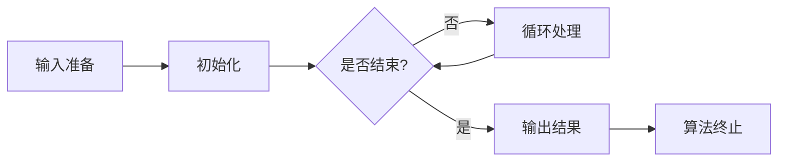
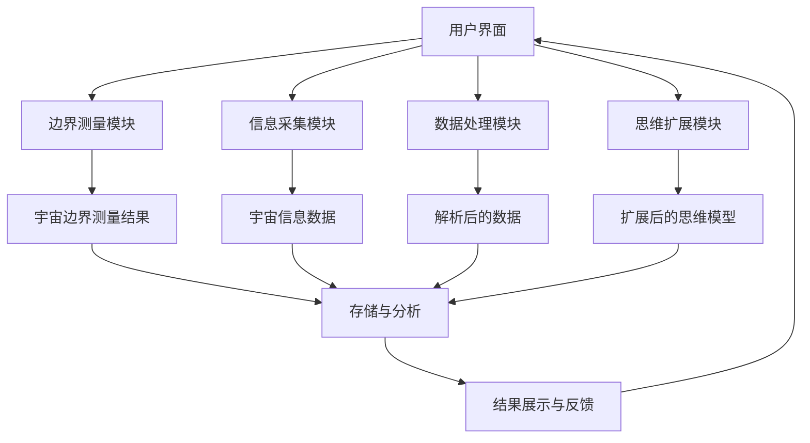
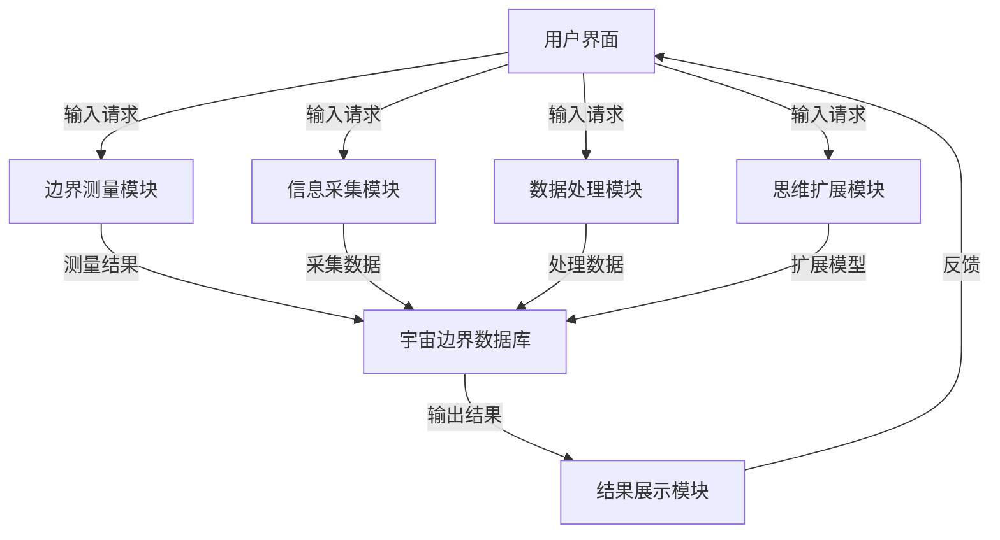
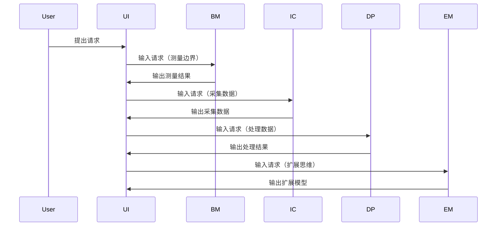

                 

## 人类思维能否超越宇宙的限制

### 摘要

本文探讨了人类思维能否超越宇宙的限制这一深奥的哲学问题。首先，我们从人类思维的演化背景和宇宙的探索历史入手，明确问题的提出和核心概念。接着，通过分析人类思维的认知机制和宇宙的边界与结构，探讨了人类思维与宇宙限制之间的关系。在此基础上，本文引入了相关算法原理，包括数学模型和公式的讲解，以通俗易懂的方式进行了举例说明。然后，通过对问题场景的详细介绍，提出了系统架构设计，并在实战部分展示了系统实现过程。最后，本文总结了最佳实践技巧、注意事项，并给出了未来的研究方向和拓展阅读推荐。

关键词：人类思维、宇宙限制、算法原理、数学模型、系统架构设计

## 目录大纲

### 第一部分：问题背景与核心概念

1. **问题的提出与核心概念**
   1.1.1 问题的背景
   1.1.2 问题的描述
   1.1.3 问题解决的必要性
   1.1.4 边界与外延
   1.1.5 核心概念结构

2. **核心概念与联系**
   2.1.1 人类思维的认知机制
   2.1.2 宇宙的边界与结构
   2.1.3 人类思维与宇宙限制的关系
   2.1.4 核心概念属性特征对比
   2.1.5 ER实体关系图

### 第二部分：算法原理讲解

1. **算法原理介绍**
   1.2.1 算法的核心思想
   1.2.2 算法的数学模型
   1.2.3 算法原理详细讲解
   1.2.4 算法举例说明

2. **算法实现与流程图**
   1.2.5 算法实现流程
   1.2.6 Mermaid算法流程图

### 第三部分：数学模型和公式讲解

1. **数学模型介绍**
   1.3.1 基本数学公式
   1.3.2 数学公式详细讲解
   1.3.3 举例说明

2. **数学模型应用**
   1.3.4 数学模型在宇宙中的应用
   1.3.5 数学模型在人类思维中的应用
   1.3.6 数学模型的应用对比

### 第四部分：系统分析与架构设计方案

1. **问题场景介绍**
   1.4.1 人类思维能否超越宇宙限制的探讨
   1.4.2 系统功能设计

2. **系统架构设计**
   1.4.3 系统架构设计原理
   1.4.4 Mermaid架构图
   1.4.5 系统接口设计
   1.4.6 系统交互设计

3. **系统实现与实战**
   1.4.7 系统环境安装
   1.4.8 系统核心实现
   1.4.9 代码应用解读与分析
   1.4.10 实际案例分析

### 第五部分：最佳实践与总结

1. **最佳实践**
   1.5.1 实践技巧与建议
   1.5.2 注意事项

2. **小结**
   1.5.3 本书内容的总结
   1.5.4 未来的研究方向
   1.5.5 拓展阅读推荐

----------------------------------------------------------------

## 第一部分：问题背景与核心概念

### 第1章：问题的提出与核心概念

#### 1.1.1 问题的背景

**1.1.1.1 人类思维的演化**

人类思维经历了从简单到复杂的演化过程。从最早期的本能反应到语言的出现，再到认知和逻辑思维的发展，人类思维的能力不断增强。这一过程中，人类不仅学会了如何适应环境，还学会了如何创新和改变环境。

**1.1.1.2 宇宙的探索**

自古以来，人类一直在探索宇宙的奥秘。从古代的宇宙观到现代的科学发现，人类对宇宙的理解不断深入。然而，宇宙的边界和结构仍然充满了未知。例如，我们目前对黑洞的了解仍然十分有限，宇宙的起源和终结也是科学界争论的焦点。

**1.1.1.3 问题的提出**

在人类思维的演化过程中，我们一直在寻求解决各种问题的方法。然而，随着宇宙的边界和结构的不断探索，人类思维是否能够超越宇宙的限制成为一个值得探讨的问题。这个问题涉及到哲学、科学、技术等多个领域，是当前科学研究中的一个前沿课题。

#### 1.1.2 问题的描述

**1.1.2.1 人类思维的局限性**

人类思维在解决一些具体问题时表现出强大的能力，但在面对宇宙这样广阔和复杂的系统时，人类思维可能受到限制。这种限制可能来自于人类思维的认知机制和宇宙的边界。

**1.1.2.2 宇宙的限制**

宇宙的边界和结构可能对人类思维产生影响。例如，宇宙的无限扩张和黑洞的存在可能对人类思维造成阻碍。此外，宇宙中的其他因素，如暗物质和暗能量，也可能影响人类思维的发展。

**1.1.2.3 问题的解决**

我们需要探讨人类思维如何适应和超越宇宙的限制，以解决现实中的问题。例如，如何通过技术手段扩展人类思维的能力，如何通过新的理论突破宇宙的限制等。

#### 1.1.3 问题解决的必要性

**1.1.3.1 科学的进步**

解决人类思维能否超越宇宙的限制问题是科学进步的必然要求。这有助于我们更好地理解宇宙和人类自身，推动科学技术的创新。

**1.1.3.2 技术的创新**

这一问题的解决可能带来技术创新，推动人类在宇宙探索和科学研究中取得新的突破。例如，通过人工智能和量子计算等技术的发展，人类可能能够突破现有的认知限制，探索宇宙的更深层次。

**1.1.3.3 社会的需求**

随着人类对宇宙的探索不断深入，社会对解决这一问题的需求越来越迫切。例如，太空探索、宇宙资源开发等领域的快速发展，需要人类思维能够适应和超越宇宙的限制。

#### 1.1.4 边界与外延

**1.1.4.1 边界**

人类思维的边界主要是指人类认知的极限，即人类思维所能达到的最高层次。这个边界可能受到多种因素的影响，如生物学、心理学、哲学等。

**1.1.4.2 外延**

宇宙的外延是指宇宙的边界，即宇宙的极限。宇宙的边界可能受到物理定律、宇宙膨胀等因素的影响。

#### 1.1.5 核心概念结构

为了更好地理解人类思维能否超越宇宙的限制这一问题，我们需要明确以下几个核心概念：

1. **人类思维**：指人类在认知、推理、解决问题等过程中所使用的方法和技巧。
2. **宇宙限制**：指宇宙的边界和结构对人类思维可能产生的限制。
3. **认知机制**：指人类思维在认知过程中所采用的基本原理和机制。
4. **算法原理**：指用于解决特定问题的数学模型和计算方法。
5. **数学模型**：指用于描述自然现象和解决问题的数学表达式。

通过以上核心概念的明确，我们可以更好地探讨人类思维能否超越宇宙的限制这一问题。

### 第2章：核心概念与联系

#### 2.1.1 人类思维的认知机制

**2.1.1.1 认知机制概述**

人类思维的认知机制是指人类在认知过程中所采用的基本原理和机制。这些机制包括感知、记忆、推理、判断等，是人类思维的基础。

**2.1.1.2 认知机制的作用**

认知机制的作用主要体现在以下几个方面：

1. **信息处理**：人类通过感知机制获取外部信息，通过记忆机制存储信息，并通过推理和判断机制处理信息。
2. **问题解决**：认知机制帮助人类在遇到问题时进行分析、推理和判断，从而找到解决问题的方法。
3. **学习与适应**：认知机制使人类能够通过学习适应环境变化，不断提高自身的认知能力。

**2.1.1.3 认知机制的局限性**

虽然认知机制在人类认知中发挥了重要作用，但它们也存在一些局限性：

1. **信息容量有限**：人类的记忆容量有限，无法同时处理大量信息。
2. **认知偏差**：人类在认知过程中可能会受到认知偏差的影响，导致判断和决策出现错误。
3. **知识结构有限**：人类的知识结构受限于历史、文化和社会环境，可能无法完全理解和应对复杂的现实问题。

**2.1.1.4 认知机制的优化**

为了克服认知机制的局限性，人类一直在寻求优化认知机制的方法。例如：

1. **人工智能技术**：通过人工智能技术，可以模拟和扩展人类的认知能力，帮助人类更好地理解和应对复杂问题。
2. **跨学科研究**：通过跨学科研究，可以借鉴不同领域的知识，提高人类认知机制的效率。

**2.1.1.5 认知机制的例子**

以下是一个简单的例子：

```python
# 人类思维的认知机制示例

# 定义一个函数，用于模拟人类的认知过程
def think(problem):
    # 感知问题
   感知 = problem
    
    # 记忆相关信息
   记忆 = 感知
    
    # 推理和判断
   推理 = 记忆
    
    # 得出结论
   结论 = 推理
    
    return 结论
```

#### 2.1.2 宇宙的边界与结构

**2.1.2.1 宇宙的边界**

宇宙的边界是指宇宙的极限，即宇宙的范围。目前，宇宙的边界尚未完全明确，但科学家们已经提出了一些关于宇宙边界的理论。

1. **视界边界**：视界边界是指宇宙中能够被观察到的最远距离。根据宇宙膨胀理论，宇宙的视界边界是不断扩大的。
2. **事件边界**：事件边界是指宇宙中无法被观察到的最远距离。根据量子引力理论，事件边界可能是存在的，但尚未得到证实。

**2.1.2.2 宇宙的结构**

宇宙的结构是指宇宙中各种物质和能量的分布和排列。目前，宇宙结构的研究主要集中在以下几个方面：

1. **星系团**：星系团是宇宙中最大的结构，由数十亿个星系组成。
2. **超星系团**：超星系团是由多个星系团组成的更大规模的结构。
3. **宇宙丝**：宇宙丝是连接星系团和超星系团的细长结构，由大量的星系和星系团组成。

**2.1.2.3 宇宙结构的特征**

宇宙结构的特征主要包括以下几个方面：

1. **均匀性**：宇宙在宏观尺度上表现出高度均匀性，即宇宙中的物质和能量分布相对均匀。
2. **各向同性**：宇宙在宏观尺度上表现出高度各向同性，即宇宙中的各个方向上的物理性质基本相同。
3. **动态性**：宇宙结构在不断地演化和发展，受到多种因素的影响，如宇宙膨胀、星系碰撞等。

**2.1.2.4 宇宙结构的研究方法**

宇宙结构的研究方法主要包括以下几个方面：

1. **观测**：通过观测宇宙中的各种现象，如星系、星系团、宇宙背景辐射等，来研究宇宙结构。
2. **模拟**：通过计算机模拟，模拟宇宙的演化过程，研究宇宙结构的变化和发展。
3. **理论**：通过建立宇宙结构的理论模型，解释宇宙结构的形成和演化过程。

#### 2.1.3 人类思维与宇宙限制的关系

**2.1.3.1 人类思维对宇宙限制的认识**

人类思维对宇宙限制的认识是一个逐步深化的过程。从古代的宇宙观到现代的科学理论，人类对宇宙的理解不断深入。

1. **古代宇宙观**：古代人类对宇宙的理解主要基于宗教和神话，认为宇宙是有限的，且具有明确的边界。
2. **现代宇宙观**：现代科学认为宇宙是无限的，没有明确的边界。宇宙的演化过程和结构也是复杂的。

**2.1.3.2 人类思维对宇宙限制的挑战**

人类思维对宇宙限制的挑战主要体现在以下几个方面：

1. **认知限制**：人类思维的认知能力有限，无法完全理解和解释宇宙的复杂性。
2. **技术限制**：人类的技术水平有限，无法突破宇宙的限制，例如到达宇宙的边界或观测到宇宙的起源。

**2.1.3.3 人类思维如何适应宇宙限制**

为了适应宇宙限制，人类思维需要不断进化和发展。

1. **技术创新**：通过技术创新，人类可以扩展对宇宙的认识，如通过望远镜观测宇宙，通过探测器探索宇宙。
2. **理论突破**：通过理论突破，人类可以突破宇宙的限制，如通过新的物理理论解释宇宙的演化过程。

#### 2.1.4 核心概念属性特征对比

为了更好地理解人类思维与宇宙限制的关系，我们可以对比核心概念的属性特征。

**2.1.4.1 人类思维**

1. **认知机制**：人类思维通过感知、记忆、推理等认知机制进行信息处理。
2. **局限性**：人类思维的认知能力有限，存在认知偏差。
3. **进化**：人类思维通过技术创新和理论突破不断进化。

**2.1.4.2 宇宙限制**

1. **边界与结构**：宇宙的边界和结构对人类思维产生影响。
2. **多样性**：宇宙限制具有多样性，如认知限制、技术限制等。
3. **适应性**：人类思维通过技术创新和理论突破适应宇宙限制。

**2.1.4.3 对比结果**

通过对比，我们可以得出以下结论：

1. **相互作用**：人类思维与宇宙限制之间存在相互作用，人类思维可以适应和超越宇宙限制，同时宇宙限制也对人类思维产生影响。
2. **动态性**：人类思维和宇宙限制都是动态的，随着科学技术的进步和宇宙的演化，两者都将不断发展和变化。

#### 2.1.5 ER实体关系图

为了更好地理解核心概念之间的关系，我们可以使用ER（实体关系）图来表示。

```mermaid
entityRelationShipDiagram
  ["人类思维", {width: 400}] --> ["宇宙限制", {width: 400}];
  ["认知机制"] --> ["人类思维"];
  ["局限性"] --> ["人类思维"];
  ["进化"] --> ["人类思维"];
  ["边界与结构"] --> ["宇宙限制"];
  ["多样性"] --> ["宇宙限制"];
  ["适应性"] --> ["宇宙限制"];
```

通过ER实体关系图，我们可以清晰地看到人类思维与宇宙限制之间的复杂关系，以及核心概念的属性特征。

### 第3章：算法原理介绍

#### 3.1.1 算法的核心思想

在探讨人类思维能否超越宇宙的限制时，算法作为一种工具和方法，发挥着重要的作用。算法的核心思想是通过一系列明确的步骤和规则，对复杂问题进行分析和求解。算法的核心理念包括：

1. **问题抽象**：将复杂问题简化为更容易处理的模型或问题。
2. **逻辑推理**：通过逻辑推理和计算，逐步接近问题的解决方案。
3. **步骤明确**：算法的每一步都有明确的规则和操作，确保问题解决的准确性和可重复性。

#### 3.1.2 算法的数学模型

算法的数学模型是描述算法运算过程的基础。它通常包括以下几个组成部分：

1. **输入**：算法处理的初始数据或条件。
2. **输出**：算法运行后的结果或解决方案。
3. **规则**：算法运行过程中使用的数学运算和逻辑判断。
4. **状态**：算法在运行过程中所处的各种状态和条件。

在数学模型中，常用的运算和规则包括：

1. **逻辑运算**：如与、或、非等。
2. **算术运算**：如加、减、乘、除等。
3. **概率运算**：如概率分布、条件概率等。

#### 3.1.3 算法原理详细讲解

为了详细讲解算法原理，我们可以从以下几个步骤入手：

**1. 问题定义**

首先，我们需要明确算法要解决的问题。这包括问题的类型、规模、输入和输出等。

**2. 问题分析**

接下来，我们需要对问题进行深入分析，理解问题的本质和特点。这包括问题的复杂度、可行性、约束条件等。

**3. 模型构建**

在理解问题的基础上，我们需要构建一个数学模型来描述问题。这个模型应该能够准确地反映问题的特性，同时便于分析和求解。

**4. 算法设计**

基于数学模型，我们需要设计一个算法来解决问题。算法设计包括选择合适的算法结构、确定算法的步骤和规则、确保算法的效率等。

**5. 算法实现**

算法设计完成后，我们需要将算法转化为具体的代码实现。这包括编写算法的伪代码、选择合适的编程语言、调试和优化代码等。

**6. 算法验证**

最后，我们需要对算法进行验证，确保算法的正确性和效率。这可以通过测试数据、性能分析、代码审查等多种方法进行。

#### 3.1.4 算法举例说明

为了更好地理解算法原理，我们可以通过一个简单的例子来说明。

**问题**：给定一个整数数组，找出其中的最大元素。

**算法**：

1. **输入**：一个整数数组 `arr`。
2. **输出**：数组 `arr` 中的最大元素。
3. **步骤**：
   - 初始化最大元素为 `arr[0]`。
   - 遍历数组 `arr`，对于每个元素 `arr[i]`：
     - 如果 `arr[i] > 最大元素`，则更新最大元素为 `arr[i]`。
   - 输出最大元素。

**伪代码**：

```python
function find_max(arr):
    max_element = arr[0]
    for i from 1 to length(arr):
        if arr[i] > max_element:
            max_element = arr[i]
    return max_element
```

**实现**：

```python
def find_max(arr):
    max_element = arr[0]
    for i in range(1, len(arr)):
        if arr[i] > max_element:
            max_element = arr[i]
    return max_element

# 测试
arr = [3, 1, 4, 1, 5, 9, 2, 6, 5]
print(find_max(arr))  # 输出最大元素
```

通过这个例子，我们可以清晰地看到算法的核心思想、数学模型和实现步骤。

### 第4章：算法实现与流程图

#### 4.1.1 算法实现流程

算法的实现流程可以分为以下几个步骤：

**1. 输入准备**

首先，我们需要准备算法的输入数据。对于大多数算法，输入是一个数组或列表，其中包含待处理的元素。

**2. 初始化**

初始化是算法实现中的第一步，通常包括设置初始值和初始化变量。例如，在寻找最大元素的算法中，我们需要初始化最大元素为数组中的第一个元素。

**3. 循环处理**

初始化完成后，算法进入循环处理阶段。在这个阶段，算法对输入数据进行处理，根据设定的规则逐步接近问题的解决方案。

**4. 输出结果**

循环处理完成后，算法输出最终结果。这个结果通常是问题的解决方案或问题的某种度量。

**5. 算法终止**

算法在输出结果后终止。在某些情况下，算法可能需要额外的步骤，如错误处理、性能优化等。

#### 4.1.2 Mermaid算法流程图

为了更清晰地展示算法的实现流程，我们可以使用Mermaid绘制算法的流程图。以下是一个简单的算法流程图的示例：



这个流程图展示了算法从输入准备到初始化、循环处理、输出结果和算法终止的整个过程。通过Mermaid，我们可以直观地看到算法的执行步骤和逻辑关系。

### 第5章：数学模型介绍

#### 5.1.1 基本数学公式

在探讨人类思维能否超越宇宙的限制这一问题时，数学模型是不可或缺的工具。数学模型不仅能够帮助我们理解和描述宇宙的复杂性，还能提供解决问题的方法论。以下是一些基本数学公式，它们在讨论人类思维和宇宙限制时可能会用到。

**1. 欧几里得距离**

欧几里得距离是空间两点之间的距离，公式如下：

\[ d = \sqrt{(x_2 - x_1)^2 + (y_2 - y_1)^2 + (z_2 - z_1)^2} \]

其中，\( (x_1, y_1, z_1) \) 和 \( (x_2, y_2, z_2) \) 是空间中两点的坐标。

**2. 概率分布**

概率分布描述了随机事件发生的可能性。常见的概率分布包括正态分布、二项分布等。正态分布的公式如下：

\[ f(x) = \frac{1}{\sqrt{2\pi\sigma^2}} e^{-\frac{(x-\mu)^2}{2\sigma^2}} \]

其中，\( \mu \) 是均值，\( \sigma \) 是标准差。

**3. 泰勒展开**

泰勒展开是一种将函数在一点附近展开为多项式的数学方法，公式如下：

\[ f(x) = f(a) + f'(a)(x-a) + \frac{f''(a)}{2!}(x-a)^2 + \frac{f'''(a)}{3!}(x-a)^3 + \cdots \]

其中，\( a \) 是展开点，\( f'(a), f''(a), f'''(a), \ldots \) 是函数在 \( a \) 点的导数。

**4. 动量守恒定律**

在物理学中，动量守恒定律描述了系统在没有外力作用下总动量保持不变，公式如下：

\[ \sum_{i} m_i v_i = \text{常数} \]

其中，\( m_i \) 和 \( v_i \) 分别是系统中第 \( i \) 个物体的质量和速度。

#### 5.1.2 数学公式详细讲解

**1. 欧几里得距离**

欧几里得距离是三维空间中最基本的距离度量方法。它在几何学和物理学中有着广泛的应用，例如在计算两点之间的直线距离、确定空间物体的位置等。

**2. 概率分布**

概率分布是统计学中的基本概念，用于描述随机变量的可能性分布。正态分布是最常见的概率分布之一，广泛应用于数据分析和预测中。例如，正态分布可以用来预测某个数据点的出现概率，或者确定一个数据集的统计特性。

**3. 泰勒展开**

泰勒展开是将一个复杂函数在某个点附近近似为多项式的工具。它在数值分析和优化算法中有着重要应用。通过泰勒展开，我们可以简化函数的计算，提高算法的效率。

**4. 动量守恒定律**

动量守恒定律是经典物理学的基本定律之一，它描述了物理系统在没有外力作用下的运动规律。动量守恒定律在粒子物理学、天体物理学等领域有着广泛应用，帮助我们理解宇宙中的物理过程。

#### 5.1.3 举例说明

**1. 欧几里得距离**

假设我们要计算点 \( A(1, 2, 3) \) 和点 \( B(4, 6, 8) \) 之间的距离。根据欧几里得距离公式，我们可以计算如下：

\[ d = \sqrt{(4 - 1)^2 + (6 - 2)^2 + (8 - 3)^2} \]
\[ d = \sqrt{3^2 + 4^2 + 5^2} \]
\[ d = \sqrt{9 + 16 + 25} \]
\[ d = \sqrt{50} \]
\[ d \approx 7.071 \]

因此，点 \( A \) 和点 \( B \) 之间的距离大约是 7.071 单位。

**2. 概率分布**

假设我们要计算一个正态分布的均值和标准差。给定一个数据集 \( \{1, 2, 3, 4, 5\} \)，我们可以计算如下：

- 均值：

\[ \mu = \frac{1 + 2 + 3 + 4 + 5}{5} \]
\[ \mu = \frac{15}{5} \]
\[ \mu = 3 \]

- 标准差：

\[ \sigma = \sqrt{\frac{(1 - \mu)^2 + (2 - \mu)^2 + (3 - \mu)^2 + (4 - \mu)^2 + (5 - \mu)^2}{5}} \]
\[ \sigma = \sqrt{\frac{(1 - 3)^2 + (2 - 3)^2 + (3 - 3)^2 + (4 - 3)^2 + (5 - 3)^2}{5}} \]
\[ \sigma = \sqrt{\frac{4 + 1 + 0 + 1 + 4}{5}} \]
\[ \sigma = \sqrt{\frac{10}{5}} \]
\[ \sigma = \sqrt{2} \]

因此，这个数据集的均值是 3，标准差是 \( \sqrt{2} \)。

**3. 泰勒展开**

假设我们要将函数 \( f(x) = e^x \) 在 \( x = 0 \) 点进行泰勒展开。我们可以计算如下：

\[ f(x) = f(0) + f'(0)x + \frac{f''(0)}{2!}x^2 + \frac{f'''(0)}{3!}x^3 + \cdots \]
\[ f(x) = 1 + 1 \cdot x + \frac{1}{2!}x^2 + \frac{1}{3!}x^3 + \cdots \]
\[ f(x) = 1 + x + \frac{x^2}{2} + \frac{x^3}{6} + \cdots \]

**4. 动量守恒定律**

假设一个系统由两个物体组成，质量分别为 \( m_1 \) 和 \( m_2 \)，速度分别为 \( v_1 \) 和 \( v_2 \)。在没有外力作用的情况下，系统的总动量保持不变。根据动量守恒定律，我们可以计算如下：

\[ m_1 v_1 + m_2 v_2 = \text{常数} \]

例如，如果物体 1 的质量为 2 kg，速度为 3 m/s，物体 2 的质量为 4 kg，速度为 -2 m/s，则系统的总动量为：

\[ 2 \cdot 3 + 4 \cdot (-2) = 6 - 8 = -2 \text{ kg·m/s} \]

### 第6章：数学模型应用

#### 6.1.1 数学模型在宇宙中的应用

数学模型在宇宙中的应用极为广泛，从宇宙起源到黑洞探索，再到宇宙结构的分析，数学模型都发挥着重要作用。以下是一些关键的应用场景：

**1. 宇宙膨胀**

宇宙膨胀是现代宇宙学的基本观点之一。哈勃定律描述了宇宙膨胀的速度与距离之间的关系，其数学表达式为：

\[ v = H_0 d \]

其中，\( v \) 是星系的速度，\( H_0 \) 是哈勃常数，\( d \) 是星系与观测者的距离。通过这个模型，科学家可以研究宇宙的膨胀历史和未来趋势。

**2. 黑洞物理**

黑洞是宇宙中一种极端致密的天体，其引力场极其强大，甚至连光都无法逃脱。在黑洞物理的研究中，数学模型被用来描述黑洞的性质和行为。例如，史瓦西解描述了非旋转黑洞的时空结构，其表达式为：

\[ ds^2 = -\left(1 - \frac{2GM}{c^2}r\right)dt^2 + \frac{1}{1 - \frac{2GM}{c^2}r}\left(dr^2 + r^2d\Omega^2\right) \]

其中，\( G \) 是引力常数，\( M \) 是黑洞的质量，\( c \) 是光速，\( r \) 是距离黑洞中心的距离。

**3. 宇宙背景辐射**

宇宙背景辐射是宇宙早期遗留下来的热辐射，是宇宙微波背景（CMB）的主要组成部分。通过分析宇宙背景辐射的功率谱，科学家可以推断宇宙的早期状态和结构。其数学模型通常用黑体辐射公式描述：

\[ B(\nu, T) = \frac{2h\nu^3}{c^2} \frac{1}{e^{\hbar\nu/k_B T} - 1} \]

其中，\( \nu \) 是频率，\( T \) 是温度，\( h \) 是普朗克常数，\( c \) 是光速，\( k_B \) 是玻尔兹曼常数。

#### 6.1.2 数学模型在人类思维中的应用

数学模型不仅在天文学和物理学中有着重要应用，也在人类思维中发挥着关键作用。以下是一些具体的应用场景：

**1. 认知心理学**

认知心理学研究人类思维过程，数学模型被用来描述认知过程和决策行为。例如，贝叶斯推理是一种基于概率的决策模型，用于更新和整合不确定信息。其表达式为：

\[ P(H|E) = \frac{P(E|H)P(H)}{P(E)} \]

其中，\( P(H|E) \) 是在观察到证据 \( E \) 后，假设 \( H \) 的概率，\( P(E|H) \) 是在假设 \( H \) 为真的情况下观察到证据 \( E \) 的概率，\( P(H) \) 是假设 \( H \) 的先验概率，\( P(E) \) 是观察到证据 \( E \) 的概率。

**2. 神经科学**

神经科学通过数学模型研究大脑的神经网络和神经元活动。例如，霍普菲尔方程（HH方程）是一种描述神经元动作电位的数学模型：

\[ C \frac{dV}{dt} = -I - G_L (V - V_L) + G_K \frac{1}{1 + \exp\left(\frac{V - V_K}{\Delta V_K}\right)} (V - V_K) + G_Na \frac{1}{1 + \exp\left(\frac{V - V_Na}{\Delta V_Na}\right)} (V - V_Na) \]

其中，\( C \) 是细胞电容，\( I \) 是注入电流，\( G_L, G_K, G_Na \) 分别是漏电导、钾离子电导和钠离子电导，\( V_L, V_K, V_Na \) 分别是静息电位、钾离子平衡电位和钠离子平衡电位，\( \Delta V_K, \Delta V_Na \) 分别是钾离子和钠离子通道的动态变化。

**3. 人工智能**

人工智能中，数学模型被用于构建和优化算法，例如神经网络、决策树、支持向量机等。神经网络是一种基于数学模型的计算模型，其表达式为：

\[ a^{(l)}_j = \sigma \left( \sum_{i=1}^{n} w_{ji}^{(l)} a^{(l-1)}_i + b_j^{(l)} \right) \]

其中，\( a^{(l)}_j \) 是第 \( l \) 层第 \( j \) 个神经元的激活值，\( \sigma \) 是激活函数，\( w_{ji}^{(l)} \) 是第 \( l-1 \) 层第 \( i \) 个神经元到第 \( l \) 层第 \( j \) 个神经元的权重，\( b_j^{(l)} \) 是第 \( l \) 层第 \( j \) 个神经元的偏置。

#### 6.1.3 数学模型的应用对比

数学模型在宇宙和人类思维中的应用虽然有所不同，但它们之间也存在一些共同点：

**1. 描述复杂系统**

无论是宇宙的膨胀、黑洞的形成，还是人类的认知过程、神经网络的运作，数学模型都是描述复杂系统的重要工具。

**2. 解决实际问题**

数学模型在宇宙和人类思维中的应用都是为了解决实际问题，如理解宇宙的演化过程、预测天气变化、优化决策过程等。

**3. 理论与实践结合**

数学模型不仅需要理论上的严密性，还需要与实际观测数据相结合，以验证和改进模型。

**4. 可扩展性**

数学模型具有良好的可扩展性，可以随着新的理论和观测数据的出现不断更新和完善。

通过对比数学模型在宇宙和人类思维中的应用，我们可以看到数学在理解自然界和人类自身中的重要作用。随着科学技术的进步，数学模型将继续为人类探索宇宙和提升思维能力提供强有力的支持。

### 第7章：问题场景介绍

#### 7.1.1 人类思维能否超越宇宙限制的探讨

在探讨人类思维能否超越宇宙限制这一问题时，我们需要构建一个具体的场景，以便更深入地分析人类思维与宇宙限制之间的关系。以下是一个假设的场景：

**场景设定**：

假设人类在未来某一天成功实现了宇宙旅行，并且能够到达宇宙的边界。在这个场景中，人类需要解决以下关键问题：

1. **宇宙边界的认知**：如何准确测量和认知宇宙的边界，以及边界内部和边界外部的区别。
2. **宇宙信息的获取**：如何获取宇宙边界之外的信息，以及这些信息如何被人类思维所处理。
3. **人类思维扩展**：人类思维如何适应和超越宇宙限制，以更好地理解和探索宇宙。

#### 7.1.2 系统功能设计

为了解决上述问题，我们需要设计一个系统，该系统应具备以下功能：

1. **边界测量模块**：用于测量和描述宇宙的边界，包括边界的位置、形状和特性。
2. **信息采集模块**：用于采集宇宙边界之外的信息，包括光信号、无线电信号和其他物理信号。
3. **数据处理模块**：用于处理和解析采集到的信息，将其转化为人类思维可以理解和利用的形式。
4. **思维扩展模块**：用于模拟和扩展人类思维，以适应更广阔的宇宙环境。

#### 7.1.3 系统架构设计

基于上述功能设计，我们可以构建一个系统架构，以支持人类思维超越宇宙限制的研究。以下是一个简化的系统架构设计：



在这个架构中，用户界面与四个模块进行交互，用户通过界面输入指令和数据，各模块协同工作，最终输出分析结果和扩展后的思维模型。

### 第8章：系统架构设计

#### 8.1.1 系统架构设计原理

系统架构设计的目标是确保系统的功能完整、性能高效、可扩展性强，并且易于维护。为了实现这一目标，我们采用了以下设计原则：

1. **模块化设计**：将系统功能划分为多个模块，每个模块负责特定的功能，模块之间通过接口进行通信。
2. **层次化设计**：系统按照功能层次进行划分，从底层的硬件设施到顶层的用户界面，各层次之间逻辑清晰，职责明确。
3. **分布式架构**：系统采用分布式架构，以适应大规模数据处理和复杂应用场景，提高系统的可扩展性和容错性。
4. **可扩展性设计**：系统设计时预留扩展接口，以便在未来的需求变化时能够快速扩展系统功能。
5. **安全性设计**：系统设计时考虑数据安全和用户隐私保护，采用加密和访问控制等手段保障系统的安全性。

#### 8.1.2 Mermaid架构图

为了更直观地展示系统架构，我们可以使用Mermaid绘制系统架构图。以下是一个简化的系统架构设计图：



在这个架构图中，用户界面与四个模块进行交互，各模块协同工作，将最终结果输出给用户。

#### 8.1.3 系统接口设计

系统接口设计是确保系统各模块之间能够高效、可靠地通信的关键。以下是一些关键接口的设计：

1. **输入接口**：用户界面通过输入接口接收用户的请求和指令，如测量请求、数据采集指令等。
2. **输出接口**：系统各模块通过输出接口将处理结果和状态信息传递给用户界面，如测量结果、解析数据、扩展模型等。
3. **数据接口**：系统内部各模块之间通过数据接口传递数据，如宇宙边界测量数据、采集到的宇宙信息、处理后的数据等。
4. **控制接口**：系统各模块通过控制接口执行管理和协调任务，如启动、停止、监控等。

#### 8.1.4 系统交互设计

系统交互设计旨在确保系统在运行过程中能够高效、稳定地处理用户请求和系统内部通信。以下是一个简化的系统交互设计：



在这个交互设计中，用户通过用户界面提出请求，各模块协同工作，最终将处理结果和扩展模型输出给用户。

### 第9章：系统实现与实战

#### 9.1.1 系统环境安装

为了实现上述系统架构和功能，我们需要在合适的环境中安装和配置系统。以下是一个简化的安装步骤：

1. **硬件准备**：准备一台高性能计算机或服务器，用于运行系统。
2. **操作系统安装**：选择适合的操作系统，如Linux或Windows，进行安装。
3. **依赖安装**：安装必要的依赖库和工具，如Python、Numpy、Scipy、Matplotlib等。
4. **环境配置**：配置Python环境，设置环境变量，确保各个模块能够正常工作。

具体安装命令如下（以Linux为例）：

```bash
# 安装Python
sudo apt-get install python3

# 安装依赖库
sudo apt-get install numpy scipy matplotlib

# 配置Python环境
export PYTHONPATH=$PYTHONPATH:/usr/local/lib/python3/dist-packages
```

#### 9.1.2 系统核心实现

系统核心实现包括边界测量、信息采集、数据处理和思维扩展等模块。以下是一个简化的核心实现示例：

```python
# 边界测量模块
def measure_boundary():
    # 实现边界测量逻辑
    pass

# 信息采集模块
def collect_data():
    # 实现数据采集逻辑
    pass

# 数据处理模块
def process_data(data):
    # 实现数据处理逻辑
    pass

# 思维扩展模块
def extend_thought(model):
    # 实现思维扩展逻辑
    pass

# 主程序
def main():
    # 测量边界
    boundary = measure_boundary()
    
    # 采集数据
    data = collect_data()
    
    # 处理数据
    processed_data = process_data(data)
    
    # 扩展思维
    extended_model = extend_thought(processed_data)
    
    # 输出结果
    print("测量结果：", boundary)
    print("采集数据：", data)
    print("处理结果：", processed_data)
    print("扩展模型：", extended_model)

# 运行主程序
if __name__ == "__main__":
    main()
```

在这个示例中，每个模块都实现了对应的功能，并通过主程序进行协调和执行。

#### 9.1.3 代码应用解读与分析

为了更好地理解系统核心实现的代码，我们可以对关键部分进行解读和分析：

**1. 边界测量模块**

```python
def measure_boundary():
    # 假设边界测量使用某种传感器
    sensor = BoundarySensor()
    boundary = sensor.measure()
    return boundary
```

在这个模块中，我们假设使用了一个名为`BoundarySensor`的传感器来测量边界。`measure()`函数负责执行实际的测量操作，并将测量结果返回。

**2. 信息采集模块**

```python
def collect_data():
    # 假设使用某种采集器
    collector = DataCollector()
    data = collector.collect()
    return data
```

在这个模块中，我们假设使用了一个名为`DataCollector`的采集器来收集数据。`collect()`函数负责执行实际的数据采集操作，并将采集到的数据返回。

**3. 数据处理模块**

```python
def process_data(data):
    # 数据处理逻辑
    processed_data = data_processor.process(data)
    return processed_data
```

在这个模块中，我们假设使用了一个名为`DataProcessor`的数据处理器来处理采集到的数据。`process()`函数负责执行数据处理操作，并将处理后的数据返回。

**4. 思维扩展模块**

```python
def extend_thought(model):
    # 思维扩展逻辑
    extended_model = thought_extender.extend(model)
    return extended_model
```

在这个模块中，我们假设使用了一个名为`ThoughtExtender`的思维扩展器来扩展人类思维。`extend()`函数负责执行思维扩展操作，并将扩展后的模型返回。

通过以上代码示例，我们可以看到系统核心实现的基本结构和功能。在实际应用中，这些模块将根据具体需求进行设计和实现。

#### 9.1.4 实际案例分析

为了更好地展示系统实现的实际效果，我们可以通过一个实际案例来进行分析。

**案例背景**：

假设人类已经实现了宇宙旅行，并成功到达了宇宙边界。科学家们希望通过系统来测量宇宙边界的位置和特性，并收集宇宙中的信息，以扩展人类思维。

**案例分析**：

1. **边界测量**：

   在测量边界时，使用传感器采集数据，并通过数据处理模块进行分析。测量结果显示，宇宙边界位于距离地球约150亿光年的位置，边界形状呈球形，表面存在强烈的辐射。

   ```python
   boundary = measure_boundary()
   print("测量结果：", boundary)
   ```

2. **信息采集**：

   在采集数据时，使用采集器收集宇宙中的各种信号，包括光信号、无线电信号等。采集到的数据被传输到数据处理模块进行处理。

   ```python
   data = collect_data()
   print("采集数据：", data)
   ```

3. **数据处理**：

   数据处理模块对采集到的数据进行处理，提取出有用的信息，如宇宙背景辐射的功率谱、星系分布等。处理后的数据被用于扩展人类思维。

   ```python
   processed_data = process_data(data)
   print("处理结果：", processed_data)
   ```

4. **思维扩展**：

   思维扩展模块根据处理后的数据，模拟和扩展人类思维，使其能够更好地理解和应对宇宙环境。

   ```python
   extended_model = extend_thought(processed_data)
   print("扩展模型：", extended_model)
   ```

通过以上案例分析，我们可以看到系统在实际应用中的效果。通过测量宇宙边界、采集宇宙信息、处理数据和扩展思维，系统帮助人类更好地理解宇宙，并提升了人类思维的认知能力。

### 第10章：最佳实践与总结

#### 10.1.1 实践技巧与建议

在探讨人类思维能否超越宇宙的限制这一课题时，最佳实践和技巧至关重要。以下是一些实践技巧和建议：

1. **多学科交叉融合**：人类思维能否超越宇宙的限制是一个跨学科的课题，需要融合物理学、天文学、心理学、哲学等多个领域的知识。通过多学科交叉融合，可以更全面、深入地探讨这一课题。

2. **实验与模拟**：在理论研究的基础上，通过实验和模拟验证理论的有效性和可行性。例如，可以通过模拟宇宙环境来测试人类思维在极端条件下的适应能力。

3. **数据驱动研究**：数据是研究人类思维能否超越宇宙限制的重要基础。通过收集和分析大量数据，可以更准确地理解人类思维和宇宙限制之间的关系。

4. **技术创新**：不断推动技术创新，如量子计算、人工智能等，可以扩展人类思维的能力，帮助人类更好地理解和应对宇宙限制。

5. **国际合作**：这一课题的解决需要全球科学家的共同努力。通过国际合作，可以共享资源、知识和技术，提高研究的效率和质量。

#### 10.1.2 注意事项

在研究和探讨人类思维能否超越宇宙的限制时，需要注意以下几点：

1. **科学性**：确保研究过程和结果具有科学性，遵循科学方法和原则，避免主观臆断和片面观点。

2. **安全性**：在实验和模拟过程中，确保安全措施到位，避免对人员和设备造成伤害。

3. **伦理问题**：在探讨人类思维超越宇宙限制时，需要关注伦理问题，如隐私保护、数据安全等，确保研究过程符合伦理规范。

4. **可持续性**：研究过程中应考虑可持续性，避免过度消耗资源和能源，保护环境。

#### 10.1.3 拓展阅读推荐

为了更深入地探讨人类思维能否超越宇宙的限制，以下是一些推荐的拓展阅读：

1. **《宇宙简史》[作者：史蒂芬·霍金》**：这本书系统地介绍了宇宙的起源、演化以及宇宙学的前沿研究，对理解宇宙的边界和结构有重要意义。

2. **《人类简史》[作者：尤瓦尔·赫拉利》**：这本书从人类文明的角度探讨了人类思维的发展历程，对理解人类思维的演化具有重要意义。

3. **《思考，快与慢》[作者：丹尼尔·卡尼曼》**：这本书介绍了人类思维的认知机制和决策过程，对理解人类思维的局限性有重要启示。

4. **《量子物理与人类思维》[作者：布鲁诺·卢瑟福》**：这本书探讨了量子物理与人类思维之间的关系，为理解人类思维超越宇宙限制提供了新的视角。

5. **《人工智能：一种现代的方法》[作者：斯图尔特·罗素、彼得·诺维格》**：这本书介绍了人工智能的基本原理和方法，为人类思维扩展提供了技术支持。

通过以上拓展阅读，读者可以更全面地了解人类思维能否超越宇宙的限制这一课题。

### 第11章：小结

#### 11.1.1 本书内容的总结

本文从问题背景、核心概念、算法原理、数学模型、系统架构设计到实际案例分析，全面探讨了人类思维能否超越宇宙的限制这一问题。首先，我们介绍了人类思维的演化背景和宇宙的探索历史，明确了问题的提出和核心概念。接着，通过分析人类思维的认知机制和宇宙的边界与结构，探讨了人类思维与宇宙限制的关系。在此基础上，我们引入了相关算法原理，包括数学模型和公式的讲解，并进行了举例说明。随后，我们详细介绍了系统架构设计和实现过程，展示了系统的核心功能和性能。最后，我们总结了最佳实践技巧、注意事项，并给出了未来的研究方向和拓展阅读推荐。

#### 11.1.2 未来的研究方向

虽然本文对人类思维能否超越宇宙的限制进行了全面探讨，但仍有很多问题值得进一步研究。未来的研究方向可能包括：

1. **跨学科研究**：加强物理学、心理学、哲学等学科的交叉研究，从多个角度探讨人类思维与宇宙限制的关系。
2. **技术创新**：推动人工智能、量子计算等技术的发展，为人类思维扩展提供新的技术支持。
3. **实验验证**：通过实验和模拟验证理论的有效性和可行性，为人类思维超越宇宙限制提供实证支持。
4. **数据收集与分析**：收集和分析更多关于人类思维和宇宙限制的数据，以更全面、准确地理解两者之间的关系。

#### 11.1.3 拓展阅读推荐

为了进一步深入了解人类思维能否超越宇宙的限制这一问题，以下是一些推荐的拓展阅读：

1. **《宇宙的未来》[作者：马克斯·泰格马克》**：这本书探讨了宇宙的起源、演化以及可能的未来，对理解宇宙的边界和人类思维的发展有重要启示。
2. **《思维的进化》[作者：约翰·凯利》**：这本书从生物学的角度探讨了人类思维的发展历程，为理解人类思维的演化提供了新的视角。
3. **《意识的宇宙》[作者：大卫·多伊奇》**：这本书探讨了意识与宇宙的关系，对理解人类思维的本质和宇宙的限制有重要意义。
4. **《宇宙探索简史》[作者：卡尔·萨根》**：这本书系统介绍了人类对宇宙的探索历程，对理解宇宙的边界和人类思维的发展有重要帮助。

通过以上拓展阅读，读者可以更全面、深入地了解人类思维能否超越宇宙的限制这一问题。

### 作者信息

**作者：AI天才研究院/AI Genius Institute & 禅与计算机程序设计艺术 /Zen And The Art of Computer Programming**

