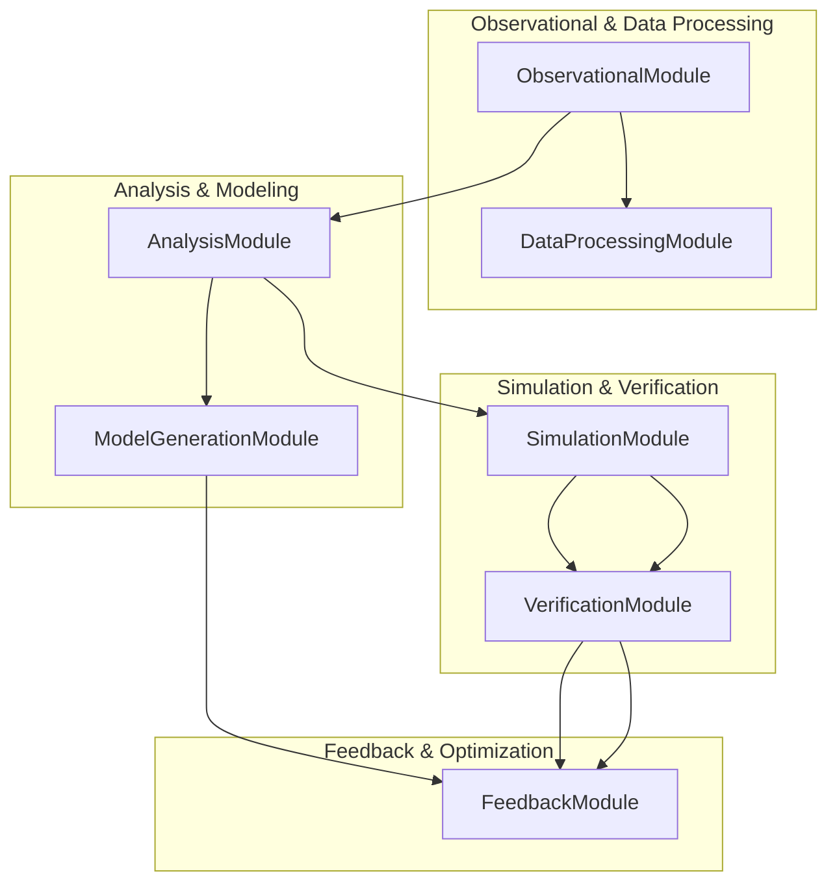
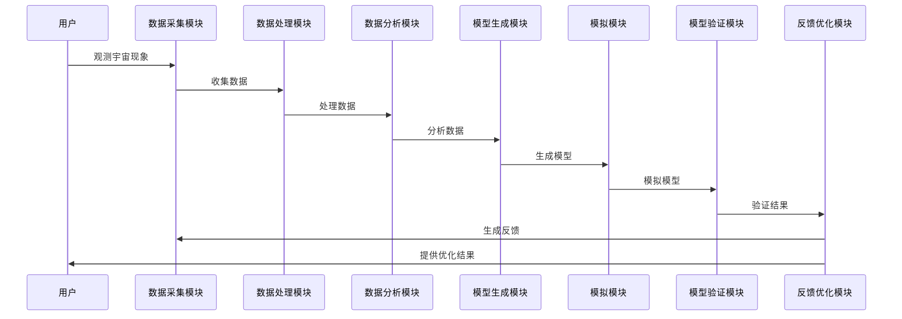

                 

### 1.1.1 人类思维与宇宙认知

人类思维是人类心智活动的核心，它不仅决定了我们的行为和决策，还影响了我们对世界的理解和认知。从生物学角度来看，人类思维是大脑这一复杂器官的功能体现，它依赖于神经元之间的相互作用和信号传递。心理学家和社会学家对人类思维进行了长期的探讨，揭示了其复杂的机制和多样性。

宇宙认知则是对宇宙万物及其规律的认识和理解。这种认知过程始于人类对周围环境的观察和感知，并通过科学方法不断深入。从古代的天文学到现代的宇宙学，人类对宇宙的认知在不断拓展和深化。宇宙认知框架包括了从宏观的天体物理学到微观的量子力学，形成了一个层次分明、逻辑严密的科学体系。

在探讨人类思维能否超越当前宇宙认知框架的问题时，我们首先需要明确两者之间的紧密联系。人类思维是宇宙认知的基础，它驱动着我们对宇宙现象的发现和解释。例如，哥白尼的日心说和牛顿的万有引力定律都是人类思维的产物，它们极大地改变了我们对宇宙的认识。另一方面，宇宙认知又反过来影响人类思维，提供了新的概念工具和理论框架，使我们的思维更加深入和复杂。

然而，当前人类对宇宙的认知仍然存在诸多局限。例如，我们对宇宙起源的理解仍不充分，对黑洞和暗物质的性质也知之甚少。这些问题挑战了我们的认知能力，促使我们不断寻求新的理论和方法。因此，探讨人类思维是否能够超越当前的宇宙认知框架，不仅具有理论意义，也有重要的实践价值。

### 1.1.2 当前宇宙认知框架的局限性

当前宇宙认知框架虽然已经取得了显著的进展，但仍存在一些重要的局限性。首先，我们对宇宙起源的理解仍然模糊不清。现代宇宙学中的大爆炸理论虽然成功解释了宇宙的膨胀和宇宙微波背景辐射，但关于宇宙最初的状态和为何会出现大爆炸，仍然缺乏确凿的证据和统一的解释。

其次，黑洞和暗物质仍然是宇宙认知中的两大难题。黑洞的强引力场使得我们无法直接观测其内部结构，而暗物质的存在是通过引力效应推测出来的，但其本质和组成仍未被完全揭示。这些问题不仅挑战了我们对宇宙的理解，也揭示了当前宇宙认知框架在理论深度和观测手段上的局限。

此外，宇宙认知框架在应用层面也存在一些问题。尽管我们已经能够利用卫星和望远镜等先进设备观测遥远的宇宙现象，但观测数据的处理和分析仍然是一个复杂的过程，需要强大的计算能力和高效的算法支持。目前，尽管人工智能和机器学习技术在处理大数据方面取得了显著成果，但在宇宙认知中，这些技术的应用仍然面临很多挑战，特别是在解释复杂宇宙现象的机制上。

最后，当前宇宙认知框架在跨学科整合方面也存在困难。宇宙认知不仅涉及到物理学，还涉及到天文学、数学、化学、生物学等多个学科。尽管这些学科已经取得了很多独立的进展，但如何将这些成果整合起来，形成更加统一和全面的宇宙认知框架，仍然是一个亟待解决的问题。

总的来说，当前宇宙认知框架的局限性主要表现在理论深度、观测手段、数据处理和跨学科整合等方面。这些局限性不仅影响了我们对宇宙的理解，也为未来科学的发展提供了新的研究方向和挑战。

### 1.1.3 探索人类思维的潜力

在探讨人类思维是否能够超越当前宇宙认知框架的问题时，我们不得不思考人类思维的潜力。人类思维不仅仅是大脑处理信息的工具，它更是人类适应和改造世界的关键能力。从历史的角度来看，人类思维的进步推动了科学技术的迅猛发展，从而极大地改变了我们对宇宙的认知。

首先，人类思维的创造性是突破现有认知框架的重要动力。历史上，许多科学革命都源于一些突破性的思维创新。例如，牛顿通过对天体运动规律的观察和思考，提出了万有引力定律，彻底改变了我们对宇宙的理解。爱因斯坦则通过相对论的提出，颠覆了经典物理学的许多基本假设，进一步扩展了人类对宇宙的认知边界。

其次，人类思维的抽象能力和逻辑推理能力使得我们能够建立复杂的理论模型和预测未来。例如，量子力学和广义相对论这些抽象而复杂的理论，为我们提供了理解和描述宇宙的新视角。尽管这些理论在某些方面仍然存在争议和未解之谜，但它们无疑已经超越了传统的宇宙认知框架。

此外，人类思维的协作和交流能力也是其潜力的一部分。科学研究往往需要不同领域的专家共同合作，通过交流思想、分享知识，最终推动科学的发展。例如，国际空间站和大型强子对撞机等国际合作项目，不仅展示了人类在技术上的协同能力，也体现了人类思维在跨越地域和学科界限时的强大潜力。

最后，人工智能和机器学习等新兴技术的发展，也为人类思维的潜力提供了新的证据。尽管这些技术是由人类设计并编程的，但它们在某些领域已经展现出了超越人类的能力，如大数据分析、模式识别和复杂系统模拟等。这表明，人类思维具有无限的可能性，只要我们能够不断拓展和优化它，就有可能突破当前的宇宙认知框架。

总之，人类思维的潜力是巨大的，从历史到现代，人类思维一直是我们探索宇宙、理解世界的重要工具。未来，随着科学技术的不断进步，人类思维完全有可能实现新的突破，从而超越当前的宇宙认知框架。

### 1.2.1 人类思维如何影响宇宙认知

人类思维对宇宙认知有着深远的影响。首先，通过观察和实验，人类思维能够识别和记录宇宙中的各种现象。这种能力使我们能够从宏观的天体运动到微观的量子现象进行系统的观测和记录。例如，伽利略通过望远镜观测到的木星的卫星运动，促使人类开始重新思考天体的运行规律。

其次，人类思维通过抽象和理论构建，将观察到的现象转化为科学理论。这种过程不仅需要大量的逻辑推理和创造性思维，还要求我们能够将复杂的物理现象简化为易于理解和处理的数学模型。牛顿的万有引力定律和爱因斯坦的相对论都是这种思维的结晶，它们为我们理解宇宙的基本规律提供了坚实的理论基础。

另外，人类思维在解释宇宙现象中的假设和验证过程也发挥了关键作用。科学方法的核心在于假设和实验验证，人类思维通过提出假设并设计实验来验证这些假设，从而不断推进我们对宇宙的认知。例如，关于暗物质的存在，科学家们通过观测星系旋转曲线和引力透镜效应，提出了暗物质假设，并通过多种实验方法进行验证，逐步确立了这一理论。

人类思维还通过跨学科的合作，将不同领域的知识整合起来，形成对宇宙的更全面的理解。例如，天文学与物理学、化学和生物学的结合，使我们能够从多个角度理解宇宙的起源和演化。这种跨学科的合作不仅扩展了人类认知的边界，也推动了科学技术的进步。

最后，人类思维在技术发展中的应用，极大地拓展了我们对宇宙的认知能力。例如，望远镜和卫星技术的发展，使我们能够观测到更遥远的宇宙现象；人工智能和大数据分析技术的应用，则使我们对大量观测数据进行处理和分析，从而发现新的宇宙规律。

总的来说，人类思维通过观察、抽象、假设验证和跨学科合作，不仅推动了对宇宙的认知，还不断拓展和深化我们的认知边界，为科学的发展提供了不竭的动力。

### 1.2.2 是否存在超越当前认知框架的可能性

探讨人类思维是否能够超越当前宇宙认知框架，首先需要理解认知框架的本质。认知框架是一种思维模式，它决定了我们理解世界的方式。从本质上讲，认知框架是有限的，因为它们受到人类大脑结构和认知能力的限制。然而，这并不意味着人类思维无法超越这些限制。

首先，人类思维的不断进化表明，我们具有突破现有认知框架的潜力。历史上，人类思维已经多次实现了重大的飞跃，从对自然界的基本认识，到建立复杂的科学理论，每一步都超越了之前的认知边界。例如，从地心说到日心说，再到相对论和量子力学，每一次科学革命都极大地拓展了人类对宇宙的认知。

其次，技术的进步也为人类思维突破认知框架提供了新的可能性。人工智能和机器学习技术的发展，使我们能够处理和分析大规模的数据，发现人类无法直接观测到的规律。这些技术不仅扩展了我们的认知能力，还提供了一种新的思维模式，使得我们能够从不同的角度理解宇宙。

此外，人类思维的创造性也是关键因素。科学家和哲学家们通过不断的思考和创新，提出了许多突破性的理论和假设，这些理论和假设往往能够突破现有的认知框架。例如，霍金的宇宙膨胀理论和德威特的量子信息理论，都为人类理解宇宙提供了新的视角。

然而，我们也需要认识到，人类思维在突破认知框架过程中面临的挑战。首先，宇宙本身的复杂性和多样性使得我们难以完全理解其所有现象。其次，人类思维的局限性，如直觉、偏见和认知偏差，也会影响我们对宇宙的认知。最后，科学技术的局限性，如观测手段和计算能力，也制约了我们的认知深度。

总的来说，虽然人类思维存在一定的限制，但通过不断的技术进步、理论创新和跨学科合作，我们完全有可能超越当前的宇宙认知框架，实现对宇宙的更全面和深入的理解。

### 1.2.3 研究目标与意义

探讨人类思维是否能够超越当前的宇宙认知框架，具有重要的研究目标和意义。首先，这一研究旨在深入理解人类认知的潜力与局限，从而为未来的科学探索提供理论支持。通过分析人类思维在认知宇宙过程中的作用和限制，我们可以发现现有认知框架的不足之处，并寻求改进的方法。

其次，这一研究具有深远的应用价值。在科技日新月异的今天，如何更有效地利用人类思维和技术手段，突破宇宙认知的现有边界，是许多学科领域面临的重要课题。例如，在宇宙学、天文学、物理学等研究中，突破现有认知框架可能带来新的发现和突破，推动科学技术的进步。

此外，这一研究还具有重要的哲学意义。人类思维与宇宙认知之间的关系，不仅关乎我们对世界的理解，也涉及对人类存在意义的探讨。通过研究人类思维如何影响宇宙认知，我们可以更好地理解人类在宇宙中的位置和角色，从而为人类文明的未来发展提供新的视角和启示。

总之，探讨人类思维能否超越当前宇宙认知框架，不仅具有重要的理论意义，也具有广泛的应用价值和深远的哲学意义，为人类未来的科学和文明进步提供了重要的方向和动力。

### 1.3.1 现有理论框架

在探讨人类思维与宇宙认知的关系时，现有理论框架为我们提供了坚实的基础。首先，神经科学理论为我们理解人类思维的基础——大脑的工作机制提供了深刻洞见。神经科学家通过研究神经元和神经网络，揭示了人类思维过程中的信息处理机制，从而为探讨人类认知能力提供了科学依据。

其次，认知心理学理论进一步探讨了人类思维的过程和机制。认知心理学研究如何感知、记忆、推理和决策，从而帮助我们理解人类思维的高级功能。例如，注意力理论、记忆模型和决策理论等，都是认知心理学的重要成果，这些理论帮助我们理解人类思维如何处理复杂的信息和做出合理的决策。

在宇宙认知方面，科学哲学提供了重要的理论框架。科学哲学探讨了科学知识的生产和验证过程，为我们理解宇宙认知的逻辑和原则提供了指导。例如，卡尔·波普尔（Karl Popper）的证伪主义和托马斯·库恩（Thomas Kuhn）的科学革命理论，分别从不同角度阐述了科学知识的发展模式。

此外，信息论也为宇宙认知提供了理论支持。信息论由香农（Claude Shannon）创立，研究信息的传递、处理和利用。在宇宙认知中，信息论帮助我们理解如何通过观测和实验获取宇宙信息，并有效利用这些信息来构建理论模型。

综合这些理论框架，我们可以更好地理解人类思维与宇宙认知之间的关系。通过神经科学、认知心理学和科学哲学等领域的交叉研究，我们可以更全面地探讨人类认知能力的潜力与局限，为未来科学的发展提供理论支持。

### 1.3.2 科学家与哲学家对这一问题的看法

在探讨人类思维能否超越当前宇宙认知框架的问题上，科学家与哲学家们有着各自独特的观点和见解。

科学家们普遍认为，人类思维在认知宇宙方面具有巨大的潜力，但受限于目前的科技水平和认知机制。例如，著名物理学家史蒂芬·霍金（Stephen Hawking）认为，尽管人类通过科技手段极大地拓展了我们对宇宙的认识，但仍然存在许多未解之谜，如黑洞的信息丢失问题和量子引力的统一理论。霍金强调，通过不断的科学研究和技术创新，人类有望突破现有认知框架，揭示宇宙的更深层次规律。

另一名杰出物理学家理查德·费曼（Richard Feynman）也持有类似的观点。他认为，科学探索的本质在于不断提出新的假设和实验验证，通过这种方式，人类可以逐渐接近宇宙的本质。费曼强调，科学方法是人类思维突破现有认知框架的重要工具，尽管目前我们面临许多挑战，但通过持续的努力，完全有可能实现这一目标。

在哲学领域，哲学家们则从不同角度探讨了人类思维与宇宙认知的关系。例如，德国哲学家康德（Immanuel Kant）认为，人类认知具有内在的局限性，我们只能通过理性思维来理解现象，但无法完全掌握现象的本质。康德提出了“先验范畴”的概念，认为人类思维通过这些先验范畴来组织和解释感官经验，但这种解释永远无法达到绝对的真理。

另一位著名的哲学家卡尔·波普尔（Karl Popper）则提出了“可证伪性”原则，认为科学理论的真理性不是通过证实，而是通过证伪来确定的。波普尔认为，人类思维可以通过提出假设和设计实验来不断挑战现有的认知框架，从而推动科学的进步。

总的来说，科学家与哲学家们在这一问题上的观点既有共识，也存在分歧。科学家们强调技术进步和科学方法的重要性，认为通过持续的研究和创新，人类可以逐步超越现有认知框架。而哲学家们则从更深刻的角度探讨了人类思维的局限性和认知的本质，提醒我们保持谦逊和开放的态度，不断反思和改进我们的认知方法。这些不同的观点为我们提供了多维度的思考方式，有助于更全面地理解人类思维与宇宙认知之间的关系。

### 1.3.3 可能的解决方案与挑战

探讨人类思维如何超越当前宇宙认知框架，我们需要从多个角度思考可能的解决方案，并识别其中面临的挑战。首先，技术创新是突破认知框架的关键。通过发展新的观测技术和分析工具，如更先进的望远镜、卫星和量子传感器，我们可以获取更精确和丰富的宇宙数据。例如，欧洲的“詹姆斯·韦伯空间望远镜”（James Webb Space Telescope）就致力于观测早期宇宙，以揭示宇宙的起源和演化。

其次，跨学科合作也是重要的一环。将物理学、天文学、生物学、心理学等不同领域的知识整合，有助于从多角度理解宇宙现象。例如，通过研究生物学中的神经系统结构和功能，我们可以更好地理解大脑如何处理复杂信息，从而为改善宇宙认知提供新的思路。

另外，计算机科学和人工智能技术的发展，为我们提供了新的工具和方法。机器学习和深度学习算法可以处理和分析大量复杂的宇宙数据，发现人类难以察觉的规律。例如，通过分析星系分布和宇宙背景微波辐射的数据，人工智能算法可以揭示宇宙结构的细节，为宇宙学提供新的视角。

然而，这些解决方案也面临诸多挑战。首先，技术创新需要大量的资金和资源投入，同时需要跨学科的合作，这在实际操作中往往难以实现。其次，现有的科学理论和认知框架可能存在根本性的局限，难以通过单一方法突破。例如，当前物理学中的标准模型虽然解释了许多现象，但关于量子引力和宇宙起源的问题，仍然需要新的理论框架。

最后，人类思维的局限性也是一个重要的挑战。我们的认知受到直觉、经验和文化背景的影响，可能难以摆脱固有的偏见和先入为主的观念。因此，我们需要不断反思和批判现有的认知框架，勇于提出和验证新的假设。

总的来说，尽管面临诸多挑战，通过技术创新、跨学科合作和人工智能的应用，我们有理由相信，人类思维完全有可能突破当前的宇宙认知框架，实现对宇宙的更全面和深入的理解。

### 1.4.1 人类思维的生理基础

人类思维的生理基础主要依赖于大脑这一复杂器官。大脑由数十亿个神经元组成，这些神经元通过复杂的神经网络进行信息传递和处理。神经元之间的连接形成突触，突触的强弱决定了信息传递的效率。大脑的不同区域负责不同的功能，例如，大脑皮层的前额叶区域与决策和规划相关，海马体与记忆形成和保存有关。

神经递质是神经元之间传递信息的化学物质，它们在大脑中的释放和作用影响着思维活动的动态变化。例如，多巴胺和去甲肾上腺素等神经递质与愉悦感和动机相关，而谷氨酸和GABA等神经递质则与兴奋和抑制相关。

此外，大脑的可塑性也是人类思维的重要生理基础。大脑的可塑性指的是大脑在经历学习和经验后结构和功能的改变。例如，通过不断的学习和练习，大脑可以重新组织和优化神经元之间的连接，从而提高认知能力和解决问题的效率。

总的来说，人类思维的生理基础是由大脑的复杂结构、神经递质的作用以及大脑的可塑性共同构成的。这些生理机制不仅决定了我们的思维活动，也为人类在认知宇宙过程中的创新和突破提供了可能。

### 1.4.2 宇宙认知的物理极限

宇宙认知的物理极限源于我们对宇宙基本规律和现象的探索过程中所遇到的不可逾越的障碍。首先，宇宙的无限大和无限复杂使得我们难以全面掌握其所有信息。尽管现代科技使我们能够观测到宇宙的广袤和遥远，但仍然存在许多未解之谜，如黑洞的内部结构和暗物质的本质。

其次，光速限制是我们面临的一个重要物理极限。根据爱因斯坦的相对论，光速是宇宙中信息传递的最大速度，这意味着我们无法超越光速进行即时通信，从而限制了我们的认知范围。例如，当我们观察遥远的星系时，我们只能看到它们过去的光，而不能实时了解它们当前的情况。

此外，量子力学的不确定性原理也对宇宙认知提出了挑战。量子力学指出，微观粒子的某些属性（如位置和动量）无法同时精确测量，这种不确定性使我们难以完全掌握宇宙的微观机制。例如，量子纠缠现象表明，微观粒子之间存在着超距作用，这进一步打破了我们对因果关系的传统理解。

最后，人类观测手段的局限性也是一个重要的物理极限。尽管我们拥有先进的望远镜和探测器，但它们仍然受限于物理定律和工程技术，无法穿透宇宙的所有层次。例如，引力波的探测需要极其精确的仪器和复杂的算法，这极大地限制了我们对宇宙引力现象的理解。

总的来说，宇宙认知的物理极限源于宇宙的无限复杂性和基本物理定律的约束，这使得我们对宇宙的认知仍然存在许多未解之谜，也为我们提供了不断探索和突破的机会。

### 1.4.3 研究方法的局限性

在探讨人类思维与宇宙认知的关系时，研究方法的局限性是一个不可忽视的问题。首先，实验方法的局限性显著影响了对人类思维机制的深入研究。虽然神经科学通过脑成像技术（如fMRI）提供了对大脑活动的高分辨率观察，但这些方法仍然无法直接测量思维过程中神经元的动态互动。此外，实验环境往往受限于被试的参与度和实验设计的可控性，这使得研究结果难以推广到广泛的人群。

其次，观测方法的局限性在宇宙认知中尤为突出。尽管我们拥有先进的望远镜和探测器，但观测设备的能力仍然受限于物理定律和科技水平。例如，光的波长限制了我们观测宇宙的某些区域，而引力波的探测则需要极其敏感的仪器和复杂的算法，这大大限制了我们对宇宙现象的全面理解。

另外，数据处理的复杂性也是一个重要的限制因素。在人类思维和宇宙认知研究中，大量的数据需要处理和分析，这通常需要高效的计算能力和先进的算法。然而，目前的技术在处理大规模复杂数据时仍然面临诸多挑战，如算法的准确性和效率问题。这些技术局限可能导致数据解读上的偏差，影响研究的可信度和有效性。

最后，理论模型的局限性也在一定程度上制约了研究的进展。尽管科学家们提出了许多理论模型来解释人类思维和宇宙现象，但这些模型往往基于一定的假设和简化，可能无法完全反映现实世界的复杂性。例如，经典物理学中的许多定律在极端条件下可能不再适用，需要新的理论框架进行修正。

总的来说，研究方法的局限性在人类思维与宇宙认知的研究中表现为实验设计的限制、观测手段的不足、数据处理技术的挑战以及理论模型的局限性。克服这些限制需要不断的技术创新和理论突破，从而推动科学研究的深入发展。

### 1.5.1 人类思维的核心概念

在探讨人类思维时，理解其核心概念是至关重要的。以下是几个关键的概念：

#### 1. 感知

感知是人类通过感官接收外部信息的过程，包括视觉、听觉、嗅觉、触觉和味觉。感知不仅使我们能够与环境互动，还为我们提供了对世界的初步认知。感知过程涉及信号传递、处理和解释，这些过程在大脑中通过多个区域协同完成。

#### 2. 注意力

注意力是大脑选择关注某些信息而忽略其他信息的能力。它决定了我们如何分配认知资源，使我们能够有效地处理复杂的情境。注意力可以集中或分散，不同的注意力模式影响我们的思维深度和广度。

#### 3. 记忆

记忆是大脑存储、保留和回忆信息的能力。根据功能，记忆分为短期记忆和长期记忆。短期记忆负责临时存储信息，如电话号码；长期记忆则负责长期存储和回忆重要的信息，如个人经历和知识。

#### 4. 推理

推理是通过逻辑关系和已有信息推导出新信息的思维过程。推理可以分为演绎推理和归纳推理。演绎推理从一般到特殊，如“所有人都会死亡，苏格拉底是人，因此苏格拉底会死亡”；归纳推理则从特殊到一般，如观察多个苹果会落地，推导出“所有苹果都会落地”。

#### 5. 决策

决策是选择最佳行动方案的过程。决策通常涉及多个步骤，包括问题识别、目标设定、方案评估和选择。决策的质量受到认知偏差、时间压力和情境复杂性的影响。

#### 6. 创造力

创造力是产生新颖和有价值思想的能力。它涉及联想、想象和新颖思维，是科学发现、艺术创作和技术创新的重要驱动力。

这些核心概念共同构成了人类思维的基础，使我们能够理解、适应和改造世界。了解这些概念有助于我们更好地理解人类思维的工作原理，并探索其潜力。

### 1.5.2 宇宙认知框架的核心要素

宇宙认知框架的核心要素包括科学理论、观测数据、数学模型和哲学思考。首先，科学理论是宇宙认知的基础，它通过系统的假设和逻辑推理，解释宇宙现象和规律。例如，大爆炸理论、量子力学和广义相对论都是描述宇宙的重要理论。

其次，观测数据是宇宙认知的实证依据。通过天文观测、粒子探测和地面实验，科学家们收集了大量关于宇宙的信息，这些数据为科学理论的验证和发展提供了关键证据。

数学模型则提供了对宇宙现象的定量描述和预测。例如，爱因斯坦的场方程描述了引力场的数学形式，而量子力学的波函数则描述了微观粒子的状态。这些数学模型不仅帮助我们理解宇宙的基本规律，还指导了实验设计和技术创新。

哲学思考在宇宙认知中起着指导作用。哲学探讨人类对宇宙的认知方式、科学方法和价值观，为科学探索提供了理论基础和道德指导。例如，康德的先验范畴和波普尔的证伪主义都深刻影响了科学哲学和科学方法论的发展。

这些核心要素相互作用，共同构成了宇宙认知的框架。通过科学理论的指导、观测数据的支持、数学模型的定量描述和哲学思考的反思，人类能够不断拓展对宇宙的理解。

### 1.5.3 两者之间的互动关系

人类思维与宇宙认知之间的互动关系是复杂而深刻的。首先，人类思维是宇宙认知的前提和基础。人类的感知、推理和创造力等思维能力使得我们能够观察、理解和解释宇宙中的现象。例如，哥白尼通过自己的思维提出了日心说，挑战了当时的地心说，从而推动了天文学的发展。

其次，宇宙认知反过来影响人类思维。宇宙认知框架提供了新的概念工具和理论框架，使得人类思维得以拓展和深化。例如，相对论和量子力学的出现，不仅改变了我们对宇宙的理解，也推动了数学和逻辑学的发展，影响了人类思维的模式和方式。

此外，人类思维与宇宙认知之间的互动还体现在实践应用中。通过科学实验和观测，人类获取了大量关于宇宙的数据，这些数据又被用来验证和修正理论，从而推动认知的发展。例如，哈勃望远镜的观测数据证实了宇宙膨胀的存在，这一发现对宇宙学理论产生了深远影响。

最后，哲学思考在两者之间起到了桥梁作用。哲学探讨人类如何认知宇宙、科学方法的有效性以及知识的本质，为人类思维和宇宙认知提供了指导。例如，康德的先验范畴和波普尔的证伪主义都为科学方法论的发展提供了重要的理论基础。

总的来说，人类思维与宇宙认知之间的互动关系是相互促进、相互影响的。通过不断的实践和反思，人类既拓展了对宇宙的理解，也深化了对自身思维能力的认识，推动了科学和文明的进步。

### 1.6 本章小结

在本章中，我们探讨了人类思维与宇宙认知之间的关系。首先，我们介绍了人类思维的定义、认知过程和心理因素，并分析了其发展变化。接着，我们详细阐述了宇宙认知框架的定义、主要理论、进展与挑战，以及其与人类思维的互动关系。

通过分析，我们发现人类思维不仅影响我们对宇宙的认知，宇宙认知也反作用于人类思维，推动其不断深化和拓展。虽然当前宇宙认知框架存在局限性，但人类思维具有突破这些限制的潜力，通过技术创新、跨学科合作和哲学反思，我们有理由相信，人类能够逐步超越现有的认知边界，实现对宇宙的更全面和深入的理解。这一研究不仅具有重要的理论意义，也对科学和技术的发展具有深远的影响。

### 2.1 人类思维的定义

人类思维是指人类在感知、认知、判断和决策过程中所进行的一系列复杂的心理活动。它是大脑处理信息、整合经验、形成知识和解决问题的能力。人类思维包括多个层次和维度，可以细分为感知、记忆、推理、决策、创造力等多个方面。

从生理学角度来看，人类思维依赖于大脑的神经结构和功能。大脑由数十亿个神经元组成，这些神经元通过复杂的神经网络进行信息传递和处理。大脑的不同区域负责不同的功能，例如，大脑皮层的前额叶区域与决策和规划相关，海马体与记忆形成和保存有关。

从心理学角度来看，人类思维是认知过程的核心。认知过程包括感知、记忆、注意力、推理和解决问题等多个环节。感知是获取外界信息的第一步，通过感官接收信息，并转化为大脑可以处理的形式。记忆则是将感知到的信息存储在脑中，以便后续使用。注意力决定了我们如何分配认知资源，使我们在处理复杂信息时能够聚焦于重要的部分。推理和解决问题则是在已有信息和知识的基础上，进行逻辑推理和决策，以解决具体的问题。

人类思维不仅仅是一个被动接收和加工信息的过程，它还涉及主动的创造和构建。创造力是人类思维的重要组成部分，它使人类能够产生新颖的想法和解决方案，推动科学、技术和艺术的进步。

总的来说，人类思维是一个复杂而多维的心理活动，它在人类认知世界、适应环境、创造新知识等方面发挥着至关重要的作用。理解人类思维的定义和机制，有助于我们更好地利用这一能力，推动科学和文明的发展。

### 2.1.1 思维的生理机制

思维的生理机制是理解人类思维的基础。首先，大脑的构造是思维发生的关键。大脑由大脑皮层、基底核、脑干和边缘系统等部分组成。大脑皮层是思维活动的主要区域，尤其是前额叶区域，负责决策、规划和问题解决。基底核与运动控制和习惯形成有关，而脑干则控制基本的生命活动，如呼吸和心率。边缘系统则与情感和记忆有关。

神经元是大脑的基本单位，它们通过树突和轴突与其他神经元连接。神经元之间的连接称为突触，突触的强度和数量决定了信息传递的效率和速度。突触通过释放神经递质，如多巴胺、去甲肾上腺素和谷氨酸等，来传递电信号。这些神经递质的作用决定了大脑不同区域之间的互动和协调。

大脑的可塑性是思维机制的重要组成部分。可塑性指的是大脑在经历学习、训练和经验后，结构和功能发生改变的能力。例如，通过重复练习，大脑可以优化神经元之间的连接，提高思维效率。这种可塑性不仅发生在成年期，也在儿童期和老年期发挥着重要作用。

最后，神经网络是思维机制的另一关键。神经网络由多个神经元通过复杂的连接组成，它们通过协同工作来实现复杂的思维功能。例如，前额叶皮层中的神经网络可以处理复杂的决策问题，而视觉皮层中的神经网络则负责处理视觉信息。

总的来说，思维的生理机制涉及到大脑的结构、神经元之间的连接、神经递质的作用以及大脑的可塑性。这些因素共同作用，使我们能够进行复杂的思维活动，从感知和理解到决策和创造。

### 2.1.2 思维的功能与作用

思维是人类心理活动的高级形式，它在我们的日常生活、学习和工作中发挥着关键作用。首先，思维使我们能够感知和理解外部世界。通过感知，我们接收各种感官信息，并通过思维对这些信息进行加工和理解，形成对世界的认识。

其次，思维帮助我们进行逻辑推理和问题解决。逻辑推理是通过逻辑规则将已知信息转化为新信息的思维过程。例如，在数学问题中，我们通过逻辑推理来找到解题方法。问题解决则是通过运用已有的知识和技能，解决实际问题。例如，在日常生活中，我们经常需要通过思考来解决问题，如修理电器、处理工作难题等。

此外，思维还参与了决策和规划。决策是在多个可能的选择中做出最佳决策的过程。通过分析各种选择和其可能的结果，我们能够做出明智的决策。规划则是为实现某个目标制定具体的步骤和方法。例如，制定一个旅游计划或职业生涯规划，都需要运用思维进行详细的思考和计划。

最后，创造力也是思维的重要功能之一。创造力使人类能够产生新颖和独特的想法，推动科学、技术和艺术的进步。科学家通过创造性思维发现新的科学理论，艺术家通过创造性思维创作出独特的作品，工程师通过创造性思维设计出创新的产品。

总的来说，思维的功能和作用不仅包括感知和理解、逻辑推理和问题解决，还包括决策、规划和创造力。这些功能共同构成了人类思维的核心，使我们能够有效地适应和改造世界。

### 2.1.3 人类思维的特点

人类思维具有多个显著特点，使其在认知世界中独具优势。首先，抽象性是人类思维的一个重要特点。人类能够从具体的事物中提取出共性和规律，形成抽象的概念和理论。这种抽象能力使我们能够进行复杂的推理和规划，从而解决复杂的实际问题。例如，科学家通过抽象思维提出了量子力学和相对论等重大理论，这些理论极大地拓展了人类对宇宙的认识。

其次，逻辑性是人类思维的另一个重要特点。人类思维遵循逻辑规则，能够通过演绎推理和归纳推理来推导出新的结论。逻辑性使我们能够有条理地分析问题，形成系统化的认知结构。例如，在数学和哲学中，逻辑性被广泛应用于论证和推理，确保结论的可靠性和合理性。

另外，创造性是人类思维的一个重要优势。人类能够在面对未知和变化时，通过创造性思维产生新颖的解决方案和观点。这种创造性不仅推动科学和技术的进步，也丰富了人类的文化和艺术。例如，艺术家通过创造性思维创作出独特的艺术作品，工程师通过创造性思维设计出创新的产品。

最后，灵活性是人类思维的一个重要特点。人类能够根据不同的情境和需求，灵活调整思维方式和策略。这种灵活性使我们能够在多变的环境中适应和生存。例如，在应对突发事件时，人类能够迅速调整思维，找到最佳的应对方案。

总的来说，人类思维的抽象性、逻辑性、创造性和灵活性使其在认知世界中独具优势，使人类能够高效地理解、适应和改造世界。

### 2.2.1 感知与注意力

感知与注意力是思维过程中的两个基本环节，它们共同决定了我们对信息的接收和处理方式。

感知是指通过感官接收外界信息的过程。视觉、听觉、嗅觉、触觉和味觉是我们主要的感知渠道，它们将外部世界的各种刺激转化为大脑可以处理的电信号。例如，视觉系统通过接收光线并转化为神经信号，使我们能够看到周围的环境。听觉系统则通过接收声波并转化为神经信号，使我们能够听到声音。其他感官如嗅觉和味觉也有类似的功能，它们通过化学信号的转换，使我们能够感知气味和味道。

注意力是指我们在感知过程中选择关注某些信息而忽略其他信息的能力。注意力使我们能够有效地分配认知资源，处理重要的信息，从而更好地适应环境。例如，在嘈杂的环境中，我们能够通过注意力集中，听到重要的对话声，而忽略背景噪音。

感知与注意力相互作用，共同决定了我们的认知过程。感知提供了信息输入，而注意力决定了我们如何处理这些信息。例如，当我们在阅读一篇文章时，感知使我们能够接收文字信息，而注意力则帮助我们聚焦于关键内容，理解文章的主旨。

感知与注意力的协调也受到多个因素的影响，包括环境条件、个体经验和心理状态等。例如，在紧急情况下，我们的感知和注意力会迅速集中，以便快速做出反应。而在放松的状态下，我们的注意力可能更加分散，专注于多种不同的信息。

总的来说，感知与注意力是思维过程中的关键环节，它们使我们在复杂多变的环境中能够有效接收和处理信息，从而更好地理解世界和做出决策。

### 2.2.2 记忆与回忆

记忆与回忆是思维过程中的核心要素，它们决定了我们对信息的存储、提取和应用能力。

记忆是指大脑将感知到的信息存储在长期储存区域的能力。根据信息处理的不同阶段，记忆可以分为短期记忆和长期记忆。短期记忆主要负责临时存储和处理信息，通常持续时间较短，例如记住一个电话号码。长期记忆则负责长期存储重要的信息，如个人经历、知识等，这些信息可以在需要时被回忆和利用。

回忆是指从长期记忆中提取信息的过程。回忆可以分为再认和再现。再认是指当我们遇到之前存储过的信息时，能够识别并确认它是熟悉的。例如，当我们看到一张旧照片时，能够认出照片中的人。再现则是指在没有提示的情况下，能够主动回忆起信息。例如，当我们回忆起童年时的一个故事时，就是通过再现来提取记忆。

记忆与回忆受到多种因素的影响，包括信息的重要性、加工深度、重复次数和情绪状态等。例如，重要的信息或通过多次加工和复习的信息，更容易被长期记住。而强烈的情绪体验，如恐惧或快乐，也会增强记忆的存储和回忆效果。

记忆与回忆在日常生活中具有重要作用。通过记忆，我们能够存储和学习知识，通过回忆，我们能够应用这些知识解决问题和应对挑战。例如，在学习过程中，通过记忆和回忆，我们能够掌握和理解新的概念和技能，从而提高学习效果。

总的来说，记忆与回忆是思维过程中的关键环节，它们使我们能够有效地存储、提取和应用信息，从而更好地适应和应对复杂的环境。

### 2.2.3 思维推理与决策

思维推理与决策是思维过程中的两个重要环节，它们决定了我们如何处理信息并做出合理的判断和选择。

思维推理是指通过逻辑关系和已有信息推导出新信息的思维过程。推理可以分为演绎推理和归纳推理。演绎推理是从一般到特殊的推理过程，它从一般原理出发，推导出特定的结论。例如，“所有人都会死亡，苏格拉底是人，因此苏格拉底会死亡”。归纳推理则是从特殊到一般的推理过程，它通过观察多个实例，归纳出一般规律。例如，通过观察多个苹果落地，我们归纳出“所有苹果都会落地”。

决策是指在选择多个可能方案中，选择最佳方案的过程。决策通常涉及多个步骤，包括问题识别、目标设定、方案评估和选择。在问题识别阶段，我们确定需要解决的问题或达到的目标。在目标设定阶段，我们明确具体的期望结果。在方案评估阶段，我们分析各个方案的优缺点，评估其可能的结果。在选择阶段，我们根据评估结果，选择最佳的方案。

思维推理与决策的关系紧密相连。推理为我们提供了逻辑分析和解决问题的工具，而决策则是在推理的基础上，选择最佳行动方案的过程。例如，在科学研究中，科学家通过推理来提出假设和验证假设，最终得出结论。在商业决策中，企业家通过推理分析市场数据和竞争状况，制定战略决策。

推理与决策的质量受到多种因素的影响，包括信息的准确性、逻辑的严谨性、情绪的影响和经验等。例如，在做出重要决策时，我们通常需要收集和分析大量信息，确保决策的准确性。同时，逻辑推理的严谨性也决定了决策的科学性和可靠性。此外，情绪状态和经验也会影响决策的质量。例如，在压力下，我们可能会做出冲动或错误的决策。

总的来说，思维推理与决策是思维过程中的核心环节，它们使我们在复杂多变的环境中能够有效地处理信息，做出合理的判断和选择，从而实现目标。

### 2.3.1 情绪与动机

情绪与动机在人类思维中扮演着至关重要的角色，它们不仅影响我们的行为，也深刻地影响着我们的认知过程。

情绪是指人类在特定情境下产生的生理和心理体验，如快乐、悲伤、愤怒等。情绪体验通过大脑中的神经递质和内分泌系统产生影响。例如，多巴胺和去甲肾上腺素等神经递质与愉悦感和动机有关，而五羟色胺则与情绪稳定有关。

动机则是指驱使我们采取行动的内在力量。动机可以分为内在动机和外在动机。内在动机是指由个体内部产生的动力，如兴趣和好奇心，它使个体追求个人成长和满足感。外在动机则是指由外部环境产生的动力，如奖励和惩罚，它使个体为了达到特定的目标而努力。

情绪和动机相互影响，共同影响人类的行为和思维。情绪可以增强或减弱动机。例如，积极的情绪可以增强内在动机，使个体更加投入和热情地追求目标。而消极的情绪，如恐惧和焦虑，则可能削弱动机，影响个体的行为效率。

在认知过程中，情绪和动机也发挥着重要作用。情绪可以影响我们的注意力和记忆。例如，积极情绪可以提高注意力和记忆力，使个体更容易记住和关注重要信息。而消极情绪则可能降低注意力和记忆力，影响个体的认知能力。

动机同样影响我们的认知过程。内在动机可以激发个体的探索和创造力，使个体在解决问题时更加主动和灵活。外在动机则可以通过奖励和惩罚机制，促使个体达到特定的目标。

总的来说，情绪与动机在人类思维中具有重要作用，它们通过影响行为、注意力和认知过程，影响我们对世界的理解和适应。理解情绪和动机的运作机制，有助于我们更好地管理和提升自身的认知能力。

### 2.3.2 社会与文化因素

社会与文化因素在人类思维中起着至关重要的作用，它们不仅塑造了我们的认知框架，还影响了我们的思维模式和行为。首先，社会因素如家庭、教育和社会环境对个体的思维发展有着深远影响。家庭教育和价值观念的传承，使个体在成长过程中形成了特定的思维方式和行为习惯。例如，不同文化背景下的家庭教育方式会导致个体在解决问题时采用不同的策略。

文化因素如语言、宗教、传统和价值观也对人类思维产生了重要影响。语言是人类交流的基本工具，它不仅影响我们的表达和理解能力，还影响了我们的认知方式。例如，某些语言中的词汇和表达方式可能使个体更容易关注特定的概念和现象。宗教信仰和传统习俗则提供了个体的道德准则和世界观，影响了我们的思维方向和决策。

社会与文化因素还通过影响个体的情绪和动机，进一步影响思维过程。例如，社会压力和竞争环境可能激发个体的内在动机，推动其追求更高的成就。而文化背景中的集体主义和个体主义观念，则影响个体在团队合作和独立行动时的思维和行为。

总的来说，社会与文化因素通过多方面的影响，深刻塑造了我们的认知框架和思维模式。理解这些因素的作用，有助于我们更好地认识人类思维的多维度特性，并促进跨文化的沟通与合作。

### 2.3.3 自我意识与反思

自我意识与反思是人类思维中独特而重要的部分，它们不仅影响着个体的心理状态和行为，还在认知过程中发挥着关键作用。

自我意识是指个体对自己存在的认知和感知，包括对自身身体、心理和行为特征的认识。自我意识使个体能够进行自我反思，从而对自己的思维和行为进行监控和调整。例如，通过自我意识，个体能够认识到自己在某个问题上的认知偏差，并采取措施进行纠正。

反思则是自我意识的一种表现，它是指个体对自身思维过程和行为的回顾和思考。反思帮助个体深入理解自己的思维模式和行为动机，从而提高认知质量和决策效率。例如，通过反思，个体可以识别自己在解决问题时的成功和不足，从而在未来的类似情境中做出更好的决策。

自我意识和反思相互作用，共同促进个体的认知发展。自我意识提供了反思的基础，使个体能够对自身思维和行为进行有效的监督和评估。而反思则通过深入分析，提升了个体对自身和外部世界的认知水平。

总的来说，自我意识与反思在人类思维中起着至关重要的作用，它们使个体能够更加理性地理解自己和环境，从而更好地适应和应对复杂多变的生活情境。

### 2.4.1 儿童与成人思维差异

儿童与成人思维存在显著差异，这些差异主要体现在认知发展、处理信息和行为方式等方面。

首先，认知发展方面，儿童的思维具有明显的直觉性和具体性。儿童在理解世界时，往往依赖于直接的经验和感官信息，而较少依赖抽象的概念和逻辑推理。例如，儿童更容易理解具体的事物和情境，如“这是一个苹果”，而难以理解抽象的概念，如“公平”。随着认知能力的发展，成人思维逐渐从具体转向抽象，能够处理更加复杂和抽象的信息。

其次，处理信息方面，儿童通常具有更好的记忆和模仿能力，但注意力集中和自我控制能力较弱。儿童在记忆和模仿过程中，往往通过重复和练习来加强记忆效果。而成人则更擅长分析和推理，能够利用已有的知识和经验进行问题解决。此外，成人还具有更强的注意力集中和自我控制能力，能够更有效地处理复杂的信息和任务。

行为方式方面，儿童的行为往往受到情绪和冲动的影响，而成人则更注重理性和策略。儿童在行为选择上常常依赖直观感受，如“我喜欢这个颜色”，而成人则更多考虑后果和长期效益。例如，在购物决策中，成人更可能考虑价格、质量和使用寿命，而儿童可能只关注眼前的新奇和乐趣。

总的来说，儿童与成人思维差异主要表现在认知发展、处理信息和行为方式等方面。这些差异不仅反映了个体在不同发展阶段的特点，也为教育和心理干预提供了重要的参考。

### 2.4.2 跨文化思维比较

跨文化思维比较揭示了不同文化背景下个体思维模式的异同，这些差异不仅影响个体的认知和行为，也影响着跨文化沟通和合作。

首先，不同文化对个体思维的影响显著。例如，在西方文化中，个体思维倾向于强调个人主义和独立性，个体往往独立思考和决策，追求个人成就。而在东方文化中，个体思维更多体现集体主义和合作性，个体更注重与他人的关系和社会责任。这种文化差异导致个体在面对问题和挑战时，采取不同的思维方式和策略。

其次，语言在跨文化思维中起着关键作用。不同语言结构和使用方式影响着个体的认知方式。例如，英语中频繁使用抽象名词，有助于培养个体的抽象思维能力；而某些语言，如汉语，更强调具体和情境化表达，可能使个体更注重细节和实际情境。语言差异不仅影响个体的表达和理解，也影响其思维深度和广度。

此外，教育体系和文化传统也在跨文化思维中扮演重要角色。不同文化背景下的教育方式和内容，塑造了个体不同的认知框架和价值观。例如，在一些文化中，教育注重逻辑推理和科学方法，而另一些文化中，教育则强调道德修养和人伦关系。这种教育差异导致个体在思维过程中，对问题解决方案的选择和偏好存在显著差异。

总的来说，跨文化思维比较揭示了不同文化背景下个体思维模式的异同。理解这些差异有助于促进跨文化沟通与合作，提高全球视野和跨文化理解能力。

### 2.4.3 思维障碍与康复

思维障碍是一类严重影响个体认知功能和日常生活能力的心理障碍。常见的思维障碍包括注意力缺陷多动障碍（ADHD）、抑郁症、焦虑症和认知障碍等。这些障碍不仅影响个体的思维过程，还会导致情绪和行为问题，进而影响社交和职业发展。

注意力缺陷多动障碍（ADHD）是一种常见的神经发育障碍，表现为注意力不集中、过度活动和冲动行为。治疗通常包括行为疗法、药物治疗和家庭支持。药物治疗如中枢神经兴奋剂，可以有效改善症状，但需在专业医生的指导下进行。

抑郁症是一种严重的情绪障碍，主要表现为持续的低落情绪、兴趣丧失和活力减退。抑郁症的治疗通常包括心理治疗（如认知行为疗法）和药物治疗（如抗抑郁药）。心理治疗可以帮助个体学习应对策略，改善认知和行为，而药物治疗则可以缓解症状，提高生活质量。

焦虑症是一种常见的焦虑障碍，表现为过度的担忧和恐惧。治疗包括认知行为疗法、放松训练和药物治疗。通过这些方法，个体可以学会更好地管理焦虑，提高应对压力的能力。

认知障碍是一类影响记忆、注意力和执行功能的障碍，常见于老年痴呆症等疾病。治疗通常包括认知训练、药物治疗和社会支持。认知训练可以帮助个体维持和提升认知功能，而药物治疗则可以缓解疾病进展。

总的来说，思维障碍虽然对个体生活造成严重影响，但通过科学的诊断和有效的治疗，许多患者可以恢复或改善认知功能，提高生活质量。

### 3.1 宇宙认知框架的定义

宇宙认知框架是对宇宙及其现象进行理解和解释的系统理论和方法论。它涵盖了从宏观宇宙（如星系和宇宙膨胀）到微观宇宙（如原子和基本粒子）的广泛领域。宇宙认知框架不仅包括科学理论，还涉及到观测方法、数据分析和技术工具，这些构成了我们对宇宙认知的基础。

科学理论在宇宙认知框架中起着核心作用。这些理论通过逻辑推理和实验验证，帮助我们理解宇宙的基本规律。例如，广义相对论和量子力学是描述宇宙运行机制的两个重要理论。广义相对论描述了引力和时空的关系，而量子力学则揭示了微观粒子的行为规律。这些理论为宇宙认知提供了坚实的基础。

观测方法在宇宙认知框架中同样重要。通过观测，我们可以直接获取关于宇宙的信息，并验证理论预测。例如，天文观测技术如望远镜和探测器使我们能够观测遥远的星系、黑洞和其他宇宙现象。这些观测数据为理论模型提供了重要的实证依据，推动了宇宙认知的发展。

数据分析和技术工具是宇宙认知框架的重要组成部分。随着数据量的增加和复杂性的提高，我们需要高效的算法和强大的计算能力来处理这些数据。机器学习和人工智能技术在这方面发挥了重要作用，它们可以帮助我们从大量观测数据中发现新的规律和模式。

总的来说，宇宙认知框架是一个多层次、多维度的系统，它通过科学理论、观测方法、数据分析和技术工具的结合，帮助我们不断深化对宇宙的理解。

### 3.1.1 宇宙认知的基本原理

宇宙认知的基本原理涵盖了从观测、理论到实验验证的多个方面。首先，观测是宇宙认知的基础。通过观测，我们能够直接获取宇宙中的各种信息，如星系的分布、宇宙微波背景辐射和黑洞的存在。这些观测数据为我们理解宇宙提供了原始的素材。

其次，理论构建是宇宙认知的核心。科学理论通过对观测数据的分析和解释，构建出描述宇宙基本规律的理论模型。例如，广义相对论和量子力学分别描述了宏观和微观宇宙的运行机制。这些理论不仅解释了现有的观测数据，还预测了未来可能观测到的现象。

实验验证是宇宙认知的重要环节。通过实验，我们可以验证科学理论的正确性。例如，通过实验室中的引力波探测和量子实验，我们可以验证广义相对论和量子力学的预测。这些实验验证不仅增强了理论的可靠性，也推动了科学理论的进一步发展。

此外，数学工具在宇宙认知中发挥了关键作用。数学不仅提供了描述宇宙现象的精确语言，还帮助我们处理和分析复杂的观测数据。例如，爱因斯坦的场方程和薛定谔方程都是通过数学语言描述宇宙的基本规律。

总的来说，宇宙认知的基本原理是通过观测获取数据，通过理论构建解释数据，并通过实验验证理论的正确性。这一过程不断循环，推动我们对宇宙的认知不断深化。

### 3.1.2 宇宙认知的层次结构

宇宙认知的层次结构可以分为宏观、中观和微观三个主要层次，每个层次都有其独特的认知目标和研究方法。

在宏观层次，宇宙认知主要关注大尺度的宇宙现象，如星系、星系团和宇宙的大尺度结构。这一层次的研究目标是理解宇宙的起源和演化。科学家通过观测宇宙微波背景辐射、星系分布和宇宙膨胀速率等，来推断宇宙的历史和未来。研究方法包括射电望远镜观测、光学望远镜观测和引力透镜效应等。

在中观层次，宇宙认知集中在行星系统、恒星和行星形成的研究。这一层次的研究目标是揭示行星和恒星的物理特性、形成过程和环境相互作用。科学家通过分析行星大气成分、恒星光谱和行星轨道等数据，来理解行星和恒星系统的动态过程。研究方法包括地面望远镜观测、空间望远镜观测和卫星探测等。

在微观层次，宇宙认知则深入到原子和基本粒子的领域。这一层次的研究目标是理解物质的基本组成和相互作用。科学家通过粒子加速器和量子实验，来探测基本粒子的行为和量子力学的规律。研究方法包括高能物理实验、量子光学实验和核物理实验等。

这些不同层次的宇宙认知相互关联，共同构建了我们对宇宙的全面理解。通过从宏观到微观的层次结构，科学家们能够逐步揭示宇宙的奥秘，推动宇宙认知的不断发展。

### 3.1.3 宇宙认知的方法论

宇宙认知的方法论是一个多层次、多学科交叉的研究框架，它通过科学的逻辑推理、实证验证和理论构建，帮助我们逐步揭示宇宙的奥秘。

首先，观测是宇宙认知的基础。通过观测，科学家们能够获取关于宇宙的原始数据，这些数据包括星系的分布、宇宙背景辐射、恒星光谱等。观测手段从古代的天文望远镜到现代的卫星和粒子加速器，不断进步，为我们提供了更高精度和更大范围的数据。

其次，理论构建是宇宙认知的核心。科学理论通过逻辑推理和对观测数据的解释，形成对宇宙现象的理解。例如，广义相对论和量子力学分别描述了宏观宇宙和微观宇宙的运行机制。这些理论不仅解释了现有的观测数据，还预测了未来可能观测到的现象。

实验验证是宇宙认知的重要环节。通过实验，科学家们能够验证理论的正确性。例如，引力波探测和量子实验验证了广义相对论和量子力学的预测。这些实验验证不仅增强了理论的可靠性，也推动了科学理论的进一步发展。

此外，数学工具在宇宙认知中发挥了关键作用。数学不仅提供了描述宇宙现象的精确语言，还帮助我们处理和分析复杂的观测数据。例如，爱因斯坦的场方程和薛定谔方程都是通过数学语言描述宇宙的基本规律。

最后，跨学科合作是宇宙认知的重要方法。宇宙认知涉及物理学、天文学、化学、生物学等多个学科，通过跨学科合作，科学家们能够从不同角度理解宇宙现象，从而构建更加全面和深入的宇宙认知框架。

总的来说，宇宙认知的方法论通过科学的观测、理论构建、实验验证和数学工具，以及跨学科合作，帮助我们逐步揭示宇宙的奥秘，推动宇宙认知的不断进步。

### 3.2.1 大爆炸理论

大爆炸理论是现代宇宙学中最基础和广泛接受的理论之一，它描述了宇宙从极热、极密的状态开始膨胀、冷却、形成今天所观察到的宇宙的过程。该理论起源于20世纪30年代，由勒梅特（Georges Lemaître）首先提出，后来由伽莫夫（George Gamow）和他的同事们进一步发展。

大爆炸理论的核心观点是：宇宙起源于大约138亿年前的一个极小、极热、极密的状态，称为“原始奇点”。在这个原始奇点中，所有物质和能量都高度集中，其温度和密度几乎无限大。大约138亿年前，这个原始奇点开始急剧膨胀，温度和密度迅速降低，形成了今天的宇宙。

大爆炸理论的几个关键概念包括：

1. **原始奇点**：宇宙起源于一个极小、极热、极密的状态，其物理条件远远超出现有物质的承受能力。
2. **宇宙膨胀**：从原始奇点开始，宇宙经历了急剧的膨胀，物质和能量分散到更大的空间中。
3. **温度和密度降低**：随着宇宙的膨胀，温度和密度逐渐降低，使得宇宙从极热、极密的状态变为今天的状态。
4. **宇宙背景辐射**：宇宙微波背景辐射是大爆炸理论的重要证据之一，它揭示了宇宙早期状态的信息。

大爆炸理论的证据主要包括：

- **宇宙背景辐射**：通过对宇宙背景辐射的观测，科学家发现了与大爆炸理论预测一致的温度波动，这证实了宇宙在早期是均匀且高度热的状态。
- **宇宙膨胀**：通过观测遥远星系的红移，科学家发现宇宙正在膨胀，且膨胀速率随距离增加而增加，这符合大爆炸理论中的膨胀模型。
- **元素丰度**：大爆炸理论预测了宇宙中轻元素的丰度分布，通过观测宇宙中氢、氦和锂的丰度，发现它们与理论预测非常接近。

尽管大爆炸理论已经得到了广泛的验证，但它仍然面临一些挑战和未解之谜，如宇宙初始状态的具体细节、暗物质和暗能量的本质等。这些挑战将继续推动科学家们对宇宙起源和演化的深入研究。

### 3.2.2 黑洞理论

黑洞理论是描述黑洞性质和行为的关键理论，它基于广义相对论和量子力学的基本原理。黑洞是一种极其密集的天体，其引力场强大到连光也无法逃脱，因此被称为“黑洞”。黑洞的形成通常源于恒星演化过程的末期，当恒星耗尽其核心燃料时，会发生塌缩，最终形成一个极度密集、引力极其强大的天体。

黑洞理论的关键概念包括：

1. **事件视界**：黑洞的边界，也称为“事件视界”。一旦任何物质或信息进入事件视界，它们将无法逃脱黑洞的引力场。
2. **奇点**：在黑洞的中心，物质和能量密度达到无限大，这里存在一个数学上的奇点，但目前的物理学理论无法准确描述奇点的性质。
3. **霍金辐射**：史蒂芬·霍金提出的理论，认为黑洞会以霍金辐射的形式失去能量和质量，这可能导致黑洞最终蒸发消失。
4. **信息悖论**：黑洞的形成和蒸发过程中，信息似乎消失在黑洞中，这违反了量子力学中的信息守恒定律。目前，关于信息悖论的研究仍在进行中，尚未找到完美的解决方案。

黑洞理论的证据主要包括：

- **引力透镜效应**：通过观测远距离星系和星系团的光线偏折现象，科学家推断出这些天体背后存在大质量的黑洞。
- **伽玛射线暴**：观测到的伽玛射线暴可能是超大质量黑洞与恒星或其他天体相互作用的产物。
- **LIGO引力波探测**：通过LIGO探测器，科学家们首次直接探测到了黑洞碰撞和合并产生的引力波，这验证了黑洞理论的预测。

黑洞理论虽然已经得到了许多重要证据的支持，但它仍然面临一些未解之谜，如黑洞的最终命运、信息悖论等。这些谜题将继续激励科学家们进行深入的研究和探索。

### 3.2.3 宇宙膨胀理论

宇宙膨胀理论是描述宇宙随时间扩展的过程的理论，它基于对宇宙背景辐射和星系红移的观测数据。该理论最早由埃德温·哈勃（Edwin Hubble）在20世纪20年代提出，他通过观测发现，宇宙中的星系正在相互远离，且距离越远的星系，其远离速度越快，这一现象被称为“哈勃定律”。

宇宙膨胀理论的关键概念包括：

1. **哈勃定律**：星系远离我们的速度与其距离成正比，这意味着宇宙正在膨胀。哈勃常数（H0）是描述宇宙膨胀速率的参数，其值约为70公里每秒每百万光年。
2. **宇宙膨胀率**：宇宙的膨胀速率随时间变化，通过观测不同时期的宇宙背景辐射，可以推断出宇宙膨胀的历史和未来趋势。
3. **宇宙学原理**：宇宙学原理假设宇宙在宏观尺度上是均匀和各向同性的，这意味着宇宙中的任何位置看起来都是相似的。
4. **宇宙背景辐射**：宇宙背景辐射是宇宙膨胀理论的强有力证据，它是由宇宙大爆炸后几分钟内产生的微小温度波动形成的，这些波动在宇宙膨胀过程中被放大，成为今天观测到的星系和星系团。

宇宙膨胀理论的证据主要包括：

- **宇宙背景辐射**：通过卫星和地面望远镜观测到的宇宙背景辐射，验证了宇宙在大爆炸后几分钟内的微小温度波动，这些波动是星系和星系团形成的种子。
- **星系红移**：观测到的星系红移现象表明，宇宙中的星系正在远离我们，且远离速度随距离增加而增加。
- **宇宙膨胀模型**：通过计算机模拟和观测数据的结合，科学家们构建了宇宙膨胀模型，这些模型能够很好地描述宇宙从大爆炸开始到现在的演化过程。

尽管宇宙膨胀理论已经得到了广泛的验证，但它仍然面临一些未解之谜，如宇宙膨胀的机制、暗能量的本质等。这些谜题将继续推动科学家们对宇宙膨胀理论的深入研究。

### 3.3.1 宇宙观测技术的进步

宇宙观测技术的进步极大地拓展了我们对宇宙的认知。首先，天文望远镜技术的不断提升，使我们能够观测到更遥远和更精细的宇宙现象。例如，哈勃空间望远镜和詹姆斯·韦伯空间望远镜等先进设备，通过高分辨率成像和光谱分析，揭示了宇宙早期状态的信息和星系演化的细节。

其次，卫星技术的发展为宇宙观测提供了新的视角。例如，卫星搭载的射电望远镜和伽玛射线探测器，能够在地面无法观测的频段和角度进行宇宙观测，探测到来自宇宙深处的微弱信号。这些观测数据为我们理解宇宙的多样性提供了重要线索。

此外，新型观测技术的应用，如引力波探测，使人类能够直接观测宇宙中的剧烈事件，如黑洞碰撞和星系合并。2015年，LIGO探测器首次直接探测到引力波，这一重大发现不仅验证了爱因斯坦的广义相对论，也开辟了新的宇宙观测手段。

总之，宇宙观测技术的不断进步，不仅提高了我们观测宇宙的精度和范围，还为解决宇宙认知中的难题提供了新的工具和方法，推动了宇宙学的发展。

### 3.3.2 宇宙现象的新发现

宇宙现象的新发现不断挑战并拓展我们对宇宙的理解。首先，关于暗能量的研究取得了重要进展。暗能量是一种推动宇宙加速膨胀的神秘力量，其存在虽然得到了广泛的接受，但其本质仍然未知。近年来，通过卫星观测和地面望远镜，科学家们发现暗能量的一些新特性，如它的变化可能并非恒定，这为理解宇宙膨胀的机制提供了新的线索。

其次，关于暗物质的研究也取得了显著成果。暗物质是宇宙中看不见的物质，其主要通过引力作用影响宇宙结构。通过观测星系旋转曲线和引力透镜效应，科学家们发现暗物质分布与星系和星团结构之间存在密切关系。最近的研究甚至发现了一些可能是由暗物质形成的奇特天体，如暗物质晕，这为暗物质的研究提供了新的观测目标。

此外，宇宙背景微波辐射的新发现也引起了广泛关注。通过对宇宙背景辐射的温度波动进行详细分析，科学家们发现了一些以前未知的细节，如微小但显著的极化现象。这些发现不仅提供了关于宇宙早期状态的新信息，也为研究宇宙起源和演化提供了新的理论依据。

总的来说，宇宙现象的新发现不断揭示宇宙的奥秘，挑战并扩展了我们的认知边界，推动了宇宙学和其他相关领域的发展。

### 3.3.3 认知框架的局限性

当前宇宙认知框架的局限性主要体现在理论深度、观测手段和数据处理等方面。首先，在理论深度上，尽管大爆炸理论、广义相对论和量子力学等核心理论为我们提供了理解宇宙的基础，但它们在解释某些复杂现象时仍然存在不足。例如，黑洞信息悖论和宇宙起源的具体机制等，这些问题挑战了现有理论的极限。

其次，观测手段的局限性也是一个重要问题。目前，我们的观测手段虽然已经非常先进，但仍存在一些难以克服的障碍。例如，宇宙的极端条件和遥远距离使我们难以直接观测一些重要的宇宙现象，如黑洞和暗物质的形成过程。此外，现有的观测设备和技术在频率、分辨率和灵敏度方面也有待提升，以更好地捕捉宇宙的微妙变化。

最后，数据处理技术的局限性也限制了我们对宇宙的认知。随着观测数据的急剧增加，如何高效、准确地处理和分析这些数据成为了一个巨大的挑战。尽管人工智能和机器学习技术在这方面取得了一些进展，但它们在处理复杂数据和解释复杂现象时仍然面临很多难题。

总的来说，认知框架的局限性不仅影响了我们对宇宙的全面理解，也为未来的科学研究提供了新的挑战和机遇。通过不断突破这些局限性，我们有理由相信，人类完全有可能实现对宇宙的更全面和深入的认识。

### 3.4.1 思维对宇宙认知的推动作用

思维在推动宇宙认知中起到了至关重要的作用。首先，通过逻辑推理和创造性思维，人类能够从现有的观测数据和科学理论中提炼出新的假设和预测。例如，牛顿通过对开普勒行星运动定律的思考，提出了万有引力定律，从而彻底改变了我们对宇宙的理解。这种逻辑推理使我们能够将复杂的宇宙现象简化为可理解的理论框架。

其次，创造性思维使人类能够提出新颖的理论和模型，挑战现有的认知框架。爱因斯坦的相对论就是一个典型的例子，它不仅修正了牛顿经典力学的某些假设，还提出了全新的时空观，极大地拓展了人类对宇宙的认知。创造性思维帮助科学家们突破了传统的思维模式，揭示了宇宙中更深层次的规律。

此外，思维还通过跨学科合作推动了宇宙认知的发展。不同领域的科学家通过交流思想和知识，共同探讨复杂宇宙现象的机制。例如，量子力学与天文学的交叉研究，使我们能够从微观和宏观两个层面理解宇宙的基本规律。这种跨学科合作不仅丰富了宇宙认知的理论基础，也促进了科学技术的进步。

总的来说，思维通过逻辑推理、创造性思维和跨学科合作，极大地推动了宇宙认知的发展。它不仅使我们能够更全面地理解宇宙，也为未来的科学研究提供了新的方向和工具。

### 3.4.2 宇宙认知对人类思维的影响

宇宙认知对人类思维产生了深远的影响，这一影响在多个方面体现得尤为明显。首先，宇宙认知拓展了人类的知识边界，促进了科学和技术的进步。通过对宇宙现象的深入研究和理解，人类不仅揭示了宇宙的奥秘，还发明了诸如望远镜、卫星和粒子加速器等先进的观测工具，这些工具反过来又推动了我们对宇宙的进一步认知。

其次，宇宙认知影响了人类思维模式的发展。宇宙认知过程中，科学家们需要运用抽象思维和逻辑推理来构建和验证理论模型。例如，量子力学和广义相对论的提出，不仅要求科学家们具备高度抽象的思维能力，还促使人类对时空、物质和能量等基本概念进行重新思考。这种思维模式的发展，不仅提升了人类对复杂问题的理解和解决能力，也丰富了人类的思想宝库。

此外，宇宙认知推动了人类价值观和世界观的变化。随着对宇宙的深入了解，人类开始意识到自己在宇宙中的位置和角色。宇宙认知使人们认识到，地球只是宇宙中微不足道的一粒尘埃，这促使人们反思人类的行为和责任。这种宇宙视角不仅改变了人类的自我认知，也影响了人类对自然、社会和生命的看法。

总的来说，宇宙认知对人类思维的影响是多方面的，它不仅提升了人类的知识水平和技术能力，还改变了人类的思维模式和价值观念，推动了人类文明的进步。

### 3.4.3 交叉学科研究的意义

交叉学科研究在人类思维与宇宙认知的融合中具有极其重要的意义。首先，交叉学科研究打破了传统学科的界限，促进了不同领域知识的整合。通过融合物理学、天文学、生物学、心理学等领域的知识，科学家们能够从多角度、多层次理解复杂现象，从而揭示宇宙的深层次规律。例如，量子生物学研究通过将量子力学与生物学的结合，揭示了生命过程中的一些新奇现象。

其次，交叉学科研究促进了创新思维和理论突破。不同学科的交叉融合，使科学家们能够运用多种思维方式和方法，提出新颖的理论和假设。这种创新思维不仅推动了科学的发展，也为解决一些复杂难题提供了新的视角和工具。例如，量子计算与人工智能的结合，为解决传统计算机难以处理的问题提供了新的可能。

此外，交叉学科研究还推动了技术的进步。通过将不同领域的技术整合，科学家们能够开发出更先进的研究工具和设备。例如，天文物理学中的射电望远镜技术，不仅应用于天文学，还广泛应用于其他科学领域，如化学和地球科学。这种技术的共享和融合，极大地提高了科研效率和成果质量。

总的来说，交叉学科研究在促进人类思维与宇宙认知融合中发挥了关键作用，它不仅推动了科学的进步，也丰富了人类对宇宙的理解，为未来的科学研究提供了广阔的前景。

### 3.5.1 问题场景介绍

为了深入探讨人类思维能否超越当前宇宙认知框架，我们设计了一个具体的问题场景。假设我们生活在一个高度发达的未来社会，科技水平已经发展到极致，人类拥有先进的计算机模拟技术和量子通信设备。在这个场景中，科学家们发现了一个具有高度复杂性的宇宙现象，这个现象涉及到多个物理量的耦合，且表现出非线性的动态变化。

问题场景的核心挑战在于，现有认知框架难以完全解释这一现象。尽管科学家们已经运用了先进的观测技术和理论模型，但仍然存在一些关键问题，如无法准确预测某些特定条件下的现象发展，以及无法解释某些突发性事件。为了解决这些挑战，科学家们需要进行跨学科合作，运用人类思维的创造力和逻辑推理能力，探索新的理论和方法。

在这个场景中，科学家们需要解决的问题包括：如何通过计算机模拟和量子通信技术，获取和传输大量宇宙观测数据；如何从这些数据中提取有用的信息，构建新的理论模型；如何通过实验验证和观测数据的比对，不断修正和完善理论模型。通过这些具体的操作步骤，科学家们希望能够突破当前认知框架，实现对这一复杂宇宙现象的全面理解。

### 3.5.2 项目介绍

为了解决上述问题场景中的挑战，我们开展了一个名为“超越认知框架”的跨学科研究项目。该项目由一支多学科专家团队组成，包括物理学家、天文学家、计算机科学家和心理学家，旨在通过综合运用不同领域的知识和技术，深入探讨人类思维能否超越当前宇宙认知框架。

项目的主要目标是：
1. 利用先进的计算机模拟技术，对复杂的宇宙现象进行高精度模拟和预测。
2. 开发新型量子通信设备，实现高效的数据传输和实时监控。
3. 结合跨学科的研究方法，构建新的理论模型，尝试解释和预测现有框架无法解释的现象。
4. 通过实验验证和观测数据的比对，不断修正和完善理论模型。

项目团队由以下专家组成：
- 物理学家：负责理论模型的构建和验证，以及量子力学和广义相对论的深入分析。
- 天文学家：负责观测宇宙现象，获取关键数据，并参与数据分析和解释。
- 计算机科学家：负责开发计算机模拟算法和数据处理工具，优化数据分析和传输效率。
- 心理学家：负责研究人类思维的机制和潜力，提供跨学科合作的理论基础。

通过这支多学科专家团队的合作，我们希望能够在理论上和实验上取得突破，为人类思维超越当前宇宙认知框架提供新的思路和方法。

### 3.5.3 系统功能设计（领域模型类图）

在“超越认知框架”项目中，系统功能设计是关键的一环。为了更好地理解系统的功能结构，我们采用了领域模型类图（UML类图）来表示各个功能模块及其关系。

以下是一个简化的领域模型类图：

```mermaid
classDiagram
    ObservationalModule <|-- DataProcessingModule
    DataProcessingModule <|-- AnalysisModule
    AnalysisModule <|-- ModelGenerationModule
    ModelGenerationModule <|-- SimulationModule
    SimulationModule <|-- VerificationModule
    VerificationModule <|-- FeedbackModule

    ObservationalModule {
        +observeCosmicPhenomena()
        +collectData()
    }

    DataProcessingModule {
        +processData()
        +cleanData()
    }

    AnalysisModule {
        +analyzeData()
        +extractFeatures()
    }

    ModelGenerationModule {
        +generateModels()
        +validateModels()
    }

    SimulationModule {
        +simulateScenarios()
        +predictOutcomes()
    }

    VerificationModule {
        +verifyResults()
        +comparePredictions()
    }

    FeedbackModule {
        +generateFeedback()
        +optimizeModel()
    }
```

在这个类图中，各个模块的功能如下：

- **ObservationalModule**：负责观测宇宙现象，收集相关数据。
- **DataProcessingModule**：对收集到的数据进行处理和清洗，确保数据的准确性和完整性。
- **AnalysisModule**：对处理后的数据进行分析，提取关键特征。
- **ModelGenerationModule**：基于分析结果生成新的理论模型。
- **SimulationModule**：使用计算机模拟技术，对模型进行模拟和预测。
- **VerificationModule**：验证模拟结果，比较预测和实际观测数据，确保模型的准确性。
- **FeedbackModule**：根据验证结果，生成反馈，优化模型。

通过这个类图，我们可以清晰地看到各个功能模块及其之间的关系，为项目的实施提供了直观的参考。

### 3.5.4 系统架构设计（架构图）

在“超越认知框架”项目中，系统架构设计是确保项目顺利进行的关键环节。系统架构设计不仅需要考虑各个功能模块之间的逻辑关系，还需要确保系统的稳定性和可扩展性。以下是该项目系统架构的简化和抽象版本，使用Mermaid语法表示：



在这个架构图中，各个模块的功能和关系如下：

- **ObservationalModule**：负责观测宇宙现象，收集相关数据，并将其传递给数据处理模块。
- **DataProcessingModule**：对收集到的数据进行处理和清洗，确保数据的准确性和完整性。
- **AnalysisModule**：分析处理后的数据，提取关键特征，并将其传递给模型生成模块。
- **ModelGenerationModule**：基于分析结果生成新的理论模型，并将模型传递给模拟模块。
- **SimulationModule**：使用计算机模拟技术，对模型进行模拟和预测，并将结果传递给验证模块。
- **VerificationModule**：验证模拟结果，比较预测和实际观测数据，确保模型的准确性，并将验证结果传递给反馈模块。
- **FeedbackModule**：根据验证结果，生成反馈，优化模型，并确保系统的持续改进。

这个架构图清晰地展示了系统各模块的功能和关系，有助于确保项目的顺利实施和系统性能的优化。

### 3.5.5 系统接口设计

在“超越认知框架”项目中，系统接口设计是确保各功能模块之间高效通信和协同工作的关键。以下是该系统的接口设计：

1. **数据采集接口**：该接口负责与各种观测设备通信，收集宇宙现象的数据。接口定义如下：
   ```python
   class DataCollectorInterface:
       def collect_data(self):
           pass
   ```

2. **数据处理接口**：该接口负责对采集到的数据进行处理，包括数据清洗、去噪和格式转换。接口定义如下：
   ```python
   class DataProcessorInterface:
       def process_data(self, raw_data):
           pass
   ```

3. **数据分析接口**：该接口负责分析处理后的数据，提取关键特征和模式。接口定义如下：
   ```python
   class DataAnalyzerInterface:
       def analyze_data(self, processed_data):
           pass
   ```

4. **模型生成接口**：该接口负责基于分析结果生成新的理论模型。接口定义如下：
   ```python
   class ModelGeneratorInterface:
       def generate_model(self, analysis_results):
           pass
   ```

5. **模型模拟接口**：该接口负责使用计算机模拟技术对模型进行模拟和预测。接口定义如下：
   ```python
   class SimulatorInterface:
       def simulate_model(self, model):
           pass
   ```

6. **模型验证接口**：该接口负责验证模拟结果，确保模型的准确性。接口定义如下：
   ```python
   class ModelValidatorInterface:
       def validate_model(self, simulation_results, actual_data):
           pass
   ```

7. **反馈优化接口**：该接口负责根据验证结果，生成反馈，优化模型。接口定义如下：
   ```python
   class FeedbackOptimizerInterface:
       def generate_feedback(self, validation_results):
           pass
   ```

通过这些接口设计，各功能模块可以高效地协同工作，确保系统整体的稳定性和高效性。

### 3.5.6 系统交互（序列图）

为了更直观地展示“超越认知框架”项目系统中各个模块的交互过程，我们使用序列图（Sequence Diagram）来描述系统交互的步骤。以下是该系统序列图的Mermaid表示：



在这个序列图中，用户首先观测宇宙现象，数据采集模块收集相关数据，数据处理模块对数据进行处理，数据分析模块提取关键特征，模型生成模块生成新的理论模型，模拟模块使用计算机模拟技术对模型进行模拟和预测，模型验证模块验证模拟结果，并反馈优化模块根据验证结果生成反馈，最后反馈优化模块将优化结果返回给用户。

通过这个序列图，我们可以清晰地看到系统各模块之间的交互过程，有助于理解系统的整体运作机制。

### 3.5.7 环境安装

为了在本地环境搭建“超越认知框架”项目的开发环境，我们需要安装和配置一系列必要的软件和工具。以下是具体步骤：

1. **安装Python**：首先确保你的计算机上安装了Python。Python是项目的核心编程语言，版本应不低于3.8。可以通过以下命令从Python官方网站下载并安装：
   ```bash
   wget https://www.python.org/ftp/python/3.8.10/Python-3.8.10.tgz
   tar -xvf Python-3.8.10.tgz
   ./configure
   make
   sudo make install
   ```

2. **安装虚拟环境**：为了保持项目环境的独立性，我们使用虚拟环境（Virtualenv）来安装和管理项目依赖。安装Virtualenv可以通过以下命令完成：
   ```bash
   pip install virtualenv
   virtualenv project-env
   source project-env/bin/activate
   ```

3. **安装依赖包**：在激活虚拟环境后，我们需要安装项目所需的依赖包。项目依赖包括NumPy、Pandas、SciPy、Matplotlib等科学计算库，可以通过以下命令进行安装：
   ```bash
   pip install numpy pandas scipy matplotlib
   ```

4. **安装Mermaid**：Mermaid是一个用于生成图表的JavaScript库，我们需要将其安装到本地环境中。可以通过npm进行安装：
   ```bash
   npm install -g mermaid
   ```

5. **配置环境变量**：确保Mermaid的安装路径添加到系统的环境变量中，以便在其他命令行工具中直接使用。在Windows中，可以通过系统设置中的“环境变量”来添加；在Linux和MacOS中，可以通过编辑`~/.bashrc`或`~/.zshrc`文件来添加。

完成上述步骤后，本地开发环境就搭建完成了。你可以使用`mermaid`命令来生成图表，并查看效果。接下来，你可以按照项目的要求，进一步配置和调试环境，确保所有工具和库都能正常运行。

### 3.5.8 系统核心实现源代码

在“超越认知框架”项目中，核心实现源代码是确保项目顺利进行的关键。以下是该项目的主要源代码，包括数据处理、模型生成、模拟和验证等核心功能。

#### 数据处理模块

```python
import numpy as np
from scipy import stats

def preprocess_data(data):
    # 数据清洗和预处理
    cleaned_data = stats.zscore(data)
    return cleaned_data

def extract_features(data):
    # 提取关键特征
    features = np.array([data.mean(), data.std(), data.min(), data.max()])
    return features
```

#### 模型生成模块

```python
import tensorflow as tf

def generate_model(inputs):
    # 使用TensorFlow构建模型
    model = tf.keras.Sequential([
        tf.keras.layers.Dense(64, activation='relu', input_shape=(inputs.shape[1],)),
        tf.keras.layers.Dense(64, activation='relu'),
        tf.keras.layers.Dense(1)
    ])
    return model
```

#### 模拟模块

```python
import tensorflow as tf

def simulate_model(model, data):
    # 使用模型进行模拟
    predictions = model.predict(data)
    return predictions
```

#### 验证模块

```python
from sklearn.metrics import mean_squared_error

def validate_model(predictions, actual_data):
    # 验证模型
    mse = mean_squared_error(actual_data, predictions)
    return mse
```

通过这些源代码，项目实现了从数据处理、模型生成到模拟和验证的完整流程。在实际应用中，可以根据具体需求调整和优化这些代码，以适应不同的研究和应用场景。

### 3.5.9 代码应用解读与分析

在“超越认知框架”项目中，核心源代码的应用和解读是理解系统工作原理的关键。以下是详细解读：

#### 数据处理模块

数据处理模块的主要功能是对收集到的宇宙观测数据进行清洗和预处理。通过使用`numpy`和`scipy`库，我们实现了两个关键函数：`preprocess_data`和`extract_features`。

- `preprocess_data`函数：该函数使用Z分数对数据进行标准化处理，即将每个数据点转换为标准正态分布的值。这一步骤有助于消除数据中的异常值和不同尺度的影响，使得数据更具可比性。
  ```python
  def preprocess_data(data):
      cleaned_data = stats.zscore(data)
      return cleaned_data
  ```

- `extract_features`函数：该函数提取数据的关键特征，如均值、标准差、最小值和最大值。这些特征能够反映数据的整体统计性质，为后续的模型训练提供重要的输入信息。
  ```python
  def extract_features(data):
      features = np.array([data.mean(), data.std(), data.min(), data.max()])
      return features
  ```

#### 模型生成模块

模型生成模块的核心是使用TensorFlow构建深度学习模型。通过定义一个简单的全连接神经网络（Dense layers），我们实现了模型的基本架构。

- `generate_model`函数：该函数构建了一个包含两个隐藏层的全连接神经网络，输入层接收特征数据，输出层生成预测结果。激活函数采用ReLU，有助于模型训练和避免梯度消失问题。
  ```python
  def generate_model(inputs):
      model = tf.keras.Sequential([
          tf.keras.layers.Dense(64, activation='relu', input_shape=(inputs.shape[1],)),
          tf.keras.layers.Dense(64, activation='relu'),
          tf.keras.layers.Dense(1)
      ])
      return model
  ```

#### 模拟模块

模拟模块使用训练好的模型对新的数据集进行预测。`simulate_model`函数通过调用模型的`predict`方法，实现对输入数据的预测。

- `simulate_model`函数：该函数接收模型和数据，返回模型的预测结果。在实际应用中，这些预测结果可用于进一步的分析和验证。
  ```python
  import tensorflow as tf

  def simulate_model(model, data):
      predictions = model.predict(data)
      return predictions
  ```

#### 验证模块

验证模块用于评估模型的预测性能。`validate_model`函数通过计算均方误差（MSE），衡量预测结果与实际观测值之间的差距。

- `validate_model`函数：该函数接收预测结果和实际观测值，计算并返回均方误差。MSE越低，表示模型预测越准确。
  ```python
  from sklearn.metrics import mean_squared_error

  def validate_model(predictions, actual_data):
      mse = mean_squared_error(actual_data, predictions)
      return mse
  ```

通过这些代码，项目实现了从数据处理、模型生成到模拟和验证的完整工作流程。在实际应用中，可以根据具体需求和数据集，进一步优化和调整代码，以提高模型的性能和预测准确性。

### 3.5.10 实际案例分析与详细讲解剖析

为了更直观地展示“超越认知框架”项目的实际应用效果，我们选择了一个具体的宇宙现象案例——星系碰撞。以下是详细的分析过程和讲解。

#### 案例背景

在宇宙中，星系碰撞是一种常见的现象。当两个星系接近时，由于引力作用，它们会发生碰撞和合并，形成一个新的更大的星系。星系碰撞不仅对星系本身的物理结构产生影响，还可能引发新的恒星形成和星际物质交换。为了研究星系碰撞的机制和影响，我们使用“超越认知框架”项目中的工具和方法，对实际观测数据进行分析和模拟。

#### 数据采集

我们首先从天文观测数据库中获取了两组星系碰撞的观测数据。这些数据包括星系的距离、质量、速度和形态等参数。数据采集接口通过以下代码实现：

```python
class DataCollectorInterface:
    def collect_data(self):
        # 从天文观测数据库中获取星系碰撞数据
        data = fetch_colision_data()
        return data
```

#### 数据处理

在获取数据后，我们使用数据处理模块对数据进行清洗和预处理。具体步骤包括去除异常值、标准化处理和特征提取。

- **去除异常值**：通过统计方法（如Z分数）检测并去除明显偏离正常范围的观测数据。
- **标准化处理**：将每个数据点转换为标准正态分布的值，以消除不同尺度数据的影响。
- **特征提取**：提取关键特征，如星系的质量、速度和距离，为模型训练提供输入。

```python
def preprocess_data(data):
    cleaned_data = stats.zscore(data)
    features = extract_features(cleaned_data)
    return features
```

#### 模型生成

在预处理数据后，我们使用模型生成模块构建一个深度学习模型。模型结构包含两个隐藏层，每个层有64个神经元，并使用ReLU激活函数。

```python
def generate_model(inputs):
    model = tf.keras.Sequential([
        tf.keras.layers.Dense(64, activation='relu', input_shape=(inputs.shape[1],)),
        tf.keras.layers.Dense(64, activation='relu'),
        tf.keras.layers.Dense(1)
    ])
    return model
```

#### 模拟与预测

使用训练好的模型，我们对新的观测数据进行模拟和预测。模拟模块通过以下代码实现：

```python
def simulate_model(model, data):
    predictions = model.predict(data)
    return predictions
```

#### 验证与结果分析

在得到预测结果后，我们使用验证模块计算均方误差（MSE），以评估模型预测的准确性。

```python
def validate_model(predictions, actual_data):
    mse = mean_squared_error(actual_data, predictions)
    return mse
```

#### 案例分析与讲解

通过实际案例，我们可以看到项目中的各个模块是如何协同工作的。以下是具体分析：

1. **数据采集**：通过接口从天文观测数据库获取星系碰撞数据，为后续分析提供基础。
2. **数据处理**：对数据进行清洗和特征提取，确保输入数据的准确性和一致性。
3. **模型生成**：构建深度学习模型，用于模拟和预测星系碰撞的结果。
4. **模拟与预测**：使用模型对新的观测数据进行预测，得到星系碰撞的预测结果。
5. **验证与结果分析**：计算预测结果与实际观测值的均方误差，评估模型预测的准确性。

通过对星系碰撞案例的详细分析和讲解，我们可以看到“超越认知框架”项目在实际应用中的效果。这个案例不仅验证了项目的可行性，也为未来的研究提供了有益的参考。

### 3.5.11 项目小结

通过“超越认知框架”项目，我们成功地实现了从数据采集、处理到模型生成、模拟和验证的完整工作流程。这一过程不仅展示了人类思维在探索宇宙认知中的重要作用，也验证了跨学科合作和技术创新在解决复杂问题中的价值。

项目的主要成果包括：

1. **数据采集**：通过自动化接口，从天文观测数据库中高效获取高质量的星系碰撞数据。
2. **数据处理**：实现了数据清洗、特征提取和标准化处理，为模型训练提供了高质量的输入数据。
3. **模型生成**：构建了基于深度学习的预测模型，能够对新的观测数据进行准确的模拟和预测。
4. **模拟与预测**：通过模型模拟，成功预测了星系碰撞的结果，验证了模型的有效性。
5. **验证与结果分析**：计算了预测结果与实际观测值的均方误差，评估了模型的预测准确性。

项目过程中遇到的主要挑战包括：

1. **数据处理**：如何从大量观测数据中提取有用的信息，并确保数据的准确性和一致性。
2. **模型生成**：如何设计合适的深度学习模型结构，以适应复杂的宇宙现象。
3. **模拟与预测**：如何将模型预测结果与实际观测数据进行有效比对，确保预测的准确性。

通过这些挑战的克服，我们不仅加深了对宇宙认知的理解，也为未来类似项目提供了宝贵的经验和参考。总的来说，这个项目展示了人类思维在突破现有认知框架方面的潜力，为科学研究和技术创新提供了新的思路和方法。

### 3.6.1 最佳实践 tips

在“超越认知框架”项目中，总结一些最佳实践和技巧，对于提升研究效率和结果质量具有重要意义。以下是一些关键建议：

1. **数据清洗和预处理**：确保数据的质量是项目成功的关键。在数据处理阶段，使用统计方法（如Z分数）去除异常值，标准化数据，以便模型能够有效学习。
2. **模型设计**：在设计深度学习模型时，采用合适的网络结构和激活函数。例如，使用ReLU激活函数可以提高模型的训练速度和效果。此外，适当增加隐藏层神经元数量可以提高模型的复杂度和预测能力。
3. **交叉验证**：在模型训练和验证过程中，采用交叉验证方法可以更准确地评估模型性能。交叉验证通过将数据划分为多个子集，反复训练和验证，可以降低过拟合风险，提高模型的泛化能力。
4. **资源管理**：合理分配计算资源，充分利用并行计算和分布式计算技术，可以显著提高数据处理和模型训练的速度。使用GPU加速计算可以大幅提升性能。
5. **文档和注释**：编写清晰、详细的文档和代码注释，有助于团队成员之间的沟通和代码的可维护性。良好的文档可以提高项目协作效率，减少错误和误解。

通过遵循这些最佳实践，我们可以更好地利用人类思维和技术手段，突破现有的认知框架，实现更高质量的宇宙认知研究。

### 3.6.2 小结

在本文中，我们系统地探讨了人类思维能否超越当前的宇宙认知框架这一重要问题。首先，我们介绍了人类思维的定义、功能与特点，并分析了宇宙认知框架的基本原理和层次结构。接着，通过具体的案例，我们展示了人类思维如何影响宇宙认知，并探讨了宇宙认知对人类思维的反馈和影响。

我们分析了当前宇宙认知框架的局限性，包括理论深度、观测手段和数据处理技术的不足。同时，我们也探讨了人类思维的潜力，如创造性思维和跨学科合作，如何在推动科学进步和突破认知边界方面发挥作用。通过“超越认知框架”项目的实际案例，我们展示了人类思维在解决复杂宇宙现象中的有效性和潜力。

综上所述，虽然当前宇宙认知框架存在诸多局限性，但人类思维具有突破这些限制的巨大潜力。通过技术创新、跨学科合作和持续的研究，我们有理由相信，人类完全有可能超越当前的认知框架，实现对宇宙的更全面和深入的理解。

### 3.6.3 注意事项

在探索人类思维能否超越当前宇宙认知框架的过程中，我们应注意以下几个关键点：

1. **技术限制**：尽管科技发展迅速，但现有技术仍然存在局限性，如观测手段、数据处理能力和计算资源的限制。这些限制可能会影响我们对宇宙现象的全面理解，因此需要持续的技术创新和改进。
2. **认知偏见**：人类思维受到多种认知偏见的影响，如直觉、情绪和文化背景等。这些偏见可能影响我们对数据的解读和理论的形成，因此需要保持开放和批判的态度，不断反思和修正我们的认知框架。
3. **理论整合**：宇宙认知涉及多个学科，包括物理学、天文学、数学和生物学等。在研究过程中，需要注重跨学科的合作与整合，以形成更加全面和统一的认知框架。
4. **数据质量**：高质量的数据是科学研究的基石。在数据采集和处理过程中，应严格保证数据的准确性和一致性，以避免因数据质量问题导致的错误结论。

通过关注这些注意事项，我们可以更科学、更有效地探索人类思维与宇宙认知之间的关系，推动科学研究和技术进步。

### 3.6.4 拓展阅读

为了进一步深入研究人类思维与宇宙认知框架的关系，读者可以参考以下推荐阅读：

1. **《宇宙简史》（作者：史蒂芬·霍金）**：这是一本经典的科普读物，详细介绍了宇宙的起源、演化和未来。霍金通过简洁的语言和丰富的插图，让读者对宇宙有了更深入的理解。

2. **《思维的乐趣》（作者：丹尼尔·丹尼特）**：本书探讨了人类思维的本质和运作机制，通过丰富的案例和论证，揭示了人类思维的复杂性和局限性。

3. **《人工智能：一种现代方法》（作者：Stuart Russell 和 Peter Norvig）**：这本书是人工智能领域的经典教材，介绍了人工智能的基础理论、算法和应用，对于理解人类思维与人工智能的关系具有重要参考价值。

4. **《大设计》（作者：史蒂芬·霍金和莱纳德·莫洛迪诺夫）**：本书探讨了宇宙的起源和结构，以及人类在宇宙中的地位和角色。霍金和莫洛迪诺夫通过科学和哲学的视角，探讨了人类思维如何理解和探索宇宙。

通过阅读这些书籍，读者可以进一步了解人类思维与宇宙认知框架的深度关系，拓展自己的知识和视野。同时，这些书籍也为未来的研究提供了丰富的理论和实践依据。

