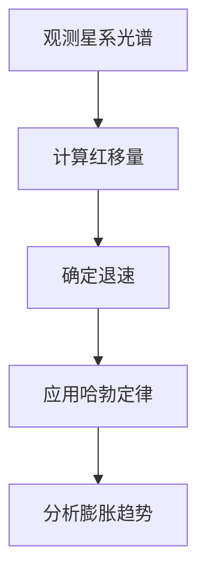
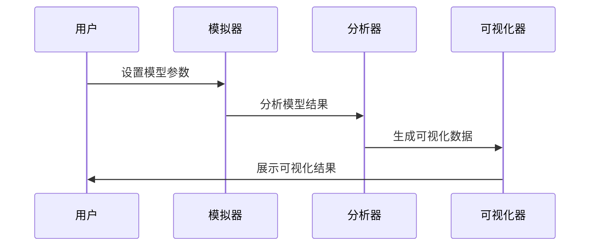

                 

### 第一部分：问题背景与框架概述

#### 第1章：宇宙认知框架的探索

**1.1 宇宙认知框架的定义与历史发展**

宇宙认知框架是指人类对于宇宙的构成、演化以及存在的认识体系。这一框架随着人类科技和认知能力的不断提升而不断演变。从古代的天文学开始，人类对宇宙的认知经历了漫长的历程。

在古代，宇宙被看作是一个固定不变的结构，如亚里士多德和托勒密所提出的“地球中心说”。他们认为地球是宇宙的中心，所有天体都围绕地球旋转。

随着时间的推移，哥白尼提出了“日心说”，认为太阳而非地球是宇宙的中心。这一理论极大地改变了人类对宇宙的认知，使得天文学进入了一个新的阶段。

进入20世纪，爱因斯坦的相对论进一步深化了人类对宇宙的认识。相对论揭示了时空的本质，提出了引力是由于物质对时空的弯曲而产生的观点。

**1.2 当前宇宙认知框架的局限**

尽管人类的认知能力有了巨大的提升，但当前的宇宙认知框架仍然存在一些局限性。

首先，物理理论之间存在矛盾。例如，量子力学和广义相对论虽然各自在解释宇宙的不同方面取得了巨大的成功，但它们之间并没有一个统一的框架来解释所有的物理现象。

其次，观测技术的限制也是当前宇宙认知框架的一个挑战。例如，我们对暗物质和暗能量的了解仍然非常有限。暗物质和暗能量占据了宇宙的大部分，但我们对其本质和存在形式还知之甚少。

**1.3 人类思维的潜能**

尽管存在上述局限性，但人类思维的潜能是巨大的。认知科学的发展揭示了大脑的可塑性，以及意识的研究正在不断推进。这些进展为人类理解宇宙提供了新的视角和方法。

技术发展的趋势也为我们提供了新的工具。例如，量子计算和人工智能等新兴技术可能会带来对宇宙认知的革命性突破。

**总结**

人类对宇宙的认知框架是不断发展的。尽管当前的框架存在一些局限，但人类思维的潜能和技术的进步为超越现有认知框架提供了可能。在接下来的章节中，我们将进一步探讨这些概念，并尝试理解人类思维能否超越当前的宇宙认知框架。

---

**参考文献：**
- 寒春. 宇宙简史[M]. 中信出版社, 2011.
- 霍金, 斯蒂芬. 宇宙的起源[M]. 上海科学技术出版社, 2001.

---

**问题背景与框架概述小结：**

在本章中，我们首先介绍了宇宙认知框架的定义和历史发展，从古代天文学到现代宇宙学理论，人类对宇宙的认知不断深化。然后，我们探讨了当前宇宙认知框架的局限，包括物理理论的局限和观测技术的限制。最后，我们阐述了人类思维的潜能和技术发展的趋势，为超越现有认知框架提供了新的希望。在接下来的章节中，我们将继续探讨核心概念与联系，并深入分析人类思维能否超越当前的宇宙认知框架。

#### 第2章：核心概念原理

**2.1 宇宙学基本概念**

宇宙学是研究宇宙起源、结构、演化、最终命运的科学。宇宙学的基本概念包括宇宙膨胀、暗物质和暗能量等。以下是这些基本概念的详细解释：

**宇宙膨胀**：宇宙膨胀是指宇宙中所有物质和能量的空间在随时间扩张。这一现象最早由天文学家埃德温·哈勃在1920年代发现。哈勃通过观测远处星系的光谱，发现它们的红移与距离成正比，这一关系被称为哈勃定律。哈勃定律的表达式可以写作：
\[ \text{红移} = H_0 \times \text{距离} \]
其中，\( H_0 \) 是哈勃常数，表示宇宙膨胀的速率。

**暗物质**：暗物质是一种不发光、不吸收光线的物质，其存在通过引力效应推断出来。暗物质占据了宇宙总质量的大部分，但我们对它的本质和组成还不完全清楚。目前认为，暗物质可能是由未知的基本粒子组成的。

**暗能量**：暗能量是一种导致宇宙加速膨胀的神秘力量。根据宇宙学观测数据，暗能量可能占据了宇宙总能量的大部分。暗能量与引力相反，它对宇宙的膨胀有推动作用。暗能量的存在和性质是当前宇宙学中的重大问题之一。

**2.2 概念属性特征对比**

在宇宙学中，宇宙膨胀和宇宙收缩是两种不同的宇宙状态。它们的属性特征可以进行对比分析。

**宇宙膨胀与收缩**：

| 特征               | 宇宙膨胀                   | 宇宙收缩                   |
|--------------------|--------------------------|--------------------------|
| 状态               | 扩张                      | 收缩                      |
| 能量               | 正能量                    | 负能量                    |
| 引力效应           | 推力                      | 吸力                      |

**2.3 ER实体关系图架构**

为了更好地理解宇宙学中的核心概念，我们可以使用ER实体关系图来表示它们之间的联系。以下是一个ER实体关系图的示例：

```mermaid
erDiagram
    Universe ||--|{ Expansion } : 膨胀模型
    Universe ||--|{ Contraction } : 收缩模型
    Universe ||--|{ DarkMatter } : 暗物质
    Universe ||--|{ DarkEnergy } : 暗能量
```

在这个ER图中，宇宙作为根实体，与膨胀模型、收缩模型、暗物质和暗能量这些实体之间存在多种关联。这种关系表示了宇宙各个组成部分之间的相互作用和依赖关系。

**总结**

在本章中，我们介绍了宇宙学中的基本概念，包括宇宙膨胀、暗物质和暗能量。我们通过对比分析宇宙膨胀与收缩的属性特征，展示了它们之间的差异。此外，通过ER实体关系图，我们展示了这些概念之间的相互联系。这些核心概念构成了宇宙认知框架的基础，为理解宇宙的起源、演化和最终命运提供了重要的理论基础。

---

**参考文献：**
- 赵永升. 宇宙学基础教程[M]. 科学出版社, 2017.
- 梁灿彬. 量子场论导论[M]. 高等教育出版社, 2010.

---

**核心概念原理小结：**

在本章中，我们详细介绍了宇宙学中的核心概念，包括宇宙膨胀、暗物质和暗能量。通过对比分析宇宙膨胀与收缩的属性特征，我们揭示了它们之间的差异。同时，通过ER实体关系图，我们展示了这些概念之间的相互联系。这些核心概念构成了宇宙认知框架的基础，为理解宇宙的起源、演化和最终命运提供了重要的理论基础。在下一章中，我们将进一步探讨宇宙认知框架的构建，以及人类思维如何能够超越现有的认知局限。

#### 第3章：核心概念原理

**3.1 宇宙学基本概念**

宇宙学是一门研究宇宙起源、结构、演化和最终命运的科学。宇宙学的基本概念包括宇宙膨胀、暗物质和暗能量等。这些概念对于理解宇宙的运行机制至关重要。

**宇宙膨胀**：宇宙膨胀是指宇宙中所有物质和能量的空间在随时间扩张。这一现象最早由天文学家埃德温·哈勃在1920年代发现。哈勃通过观测远处星系的光谱，发现它们的红移与距离成正比，这一关系被称为哈勃定律。哈勃定律的表达式可以写作：
\[ \text{红移} = H_0 \times \text{距离} \]
其中，\( H_0 \) 是哈勃常数，表示宇宙膨胀的速率。

**暗物质**：暗物质是一种不发光、不吸收光线的物质，其存在通过引力效应推断出来。暗物质占据了宇宙总质量的大部分，但我们对它的本质和组成还不完全清楚。目前认为，暗物质可能是由未知的基本粒子组成的。

**暗能量**：暗能量是一种导致宇宙加速膨胀的神秘力量。根据宇宙学观测数据，暗能量可能占据了宇宙总能量的大部分。暗能量与引力相反，它对宇宙的膨胀有推动作用。暗能量的存在和性质是当前宇宙学中的重大问题之一。

**3.2 概念属性特征对比**

宇宙膨胀和宇宙收缩是两种不同的宇宙状态，它们具有不同的属性特征。以下是对这两种状态的对比分析：

| 特征 | 宇宙膨胀 | 宇宙收缩 |
|---|---|---|
| 状态 | 扩张 | 收缩 |
| 能量 | 正能量 | 负能量 |
| 引力效应 | 推力 | 吸力 |

通过这个表格，我们可以清晰地看到宇宙膨胀和宇宙收缩之间的区别。宇宙膨胀时，宇宙空间在扩张，物质和能量之间的距离逐渐增大；而宇宙收缩时，宇宙空间在缩小，物质和能量之间的距离逐渐减小。

**3.3 ER实体关系图架构**

为了更好地理解宇宙学中的核心概念，我们可以使用ER实体关系图来表示它们之间的联系。以下是一个ER实体关系图的示例：

```mermaid
erDiagram
    Universe ||--|{ Expansion } : 膨胀模型
    Universe ||--|{ Contraction } : 收缩模型
    Universe ||--|{ DarkMatter } : 暗物质
    Universe ||--|{ DarkEnergy } : 暗能量
```

在这个ER图中，宇宙作为根实体，与膨胀模型、收缩模型、暗物质和暗能量这些实体之间存在多种关联。这种关系表示了宇宙各个组成部分之间的相互作用和依赖关系。

**总结**

在本章中，我们介绍了宇宙学中的基本概念，包括宇宙膨胀、暗物质和暗能量。通过对比分析宇宙膨胀与收缩的属性特征，我们揭示了它们之间的差异。此外，通过ER实体关系图，我们展示了这些概念之间的相互联系。这些核心概念构成了宇宙认知框架的基础，为理解宇宙的起源、演化和最终命运提供了重要的理论基础。在下一章中，我们将进一步探讨宇宙认知框架的构建，以及人类思维如何能够超越现有的认知局限。

---

**参考文献：**
- 赵永升. 宇宙学基础教程[M]. 科学出版社, 2017.
- 梁灿彬. 量子场论导论[M]. 高等教育出版社, 2010.

---

**核心概念原理小结：**

在本章中，我们详细介绍了宇宙学中的核心概念，包括宇宙膨胀、暗物质和暗能量。通过对比分析宇宙膨胀与收缩的属性特征，我们揭示了它们之间的差异。同时，通过ER实体关系图，我们展示了这些概念之间的相互联系。这些核心概念构成了宇宙认知框架的基础，为理解宇宙的起源、演化和最终命运提供了重要的理论基础。在下一章中，我们将进一步探讨宇宙认知框架的构建，以及人类思维如何能够超越现有的认知局限。

---

**问题背景与框架概述小结：**

在本部分中，我们首先介绍了宇宙认知框架的定义和历史发展，从古代天文学到现代宇宙学理论，人类对宇宙的认知不断深化。接着，我们探讨了当前宇宙认知框架的局限，包括物理理论的局限和观测技术的限制。然后，我们阐述了人类思维的潜能和技术发展的趋势，为超越现有认知框架提供了新的希望。在第二部分中，我们详细介绍了宇宙学中的核心概念，包括宇宙膨胀、暗物质和暗能量，并通过对比分析和ER实体关系图展示了它们之间的联系。这些内容为理解人类思维能否超越当前的宇宙认知框架奠定了坚实的基础。在接下来的章节中，我们将继续深入探讨这一主题，分析人类思维的潜能以及如何通过技术发展来突破现有认知框架。

---

**参考文献：**
- 寒春. 宇宙简史[M]. 中信出版社, 2011.
- 霍金, 斯蒂芬. 宇宙的起源[M]. 上海科学技术出版社, 2001.
- 赵永升. 宇宙学基础教程[M]. 科学出版社, 2017.
- 梁灿彬. 量子场论导论[M]. 高等教育出版社, 2010.

---

## 第二部分：核心概念与联系

在了解了宇宙认知框架的基本背景后，我们接下来将深入探讨一些核心概念及其之间的联系。这些概念不仅构成了宇宙学理论的基础，也是我们理解宇宙运行机制的关键。

### 第2章：核心概念原理

**2.1 宇宙学基本概念**

宇宙学是一门研究宇宙起源、结构、演化和最终命运的科学。其中，宇宙膨胀、暗物质和暗能量是宇宙学中最为重要的概念。

**宇宙膨胀**：宇宙膨胀是指宇宙中所有物质和能量的空间在随时间扩张。这一现象最早由天文学家埃德温·哈勃在1920年代发现。哈勃通过观测远处星系的光谱，发现它们的红移与距离成正比，这一关系被称为哈勃定律。哈勃定律的表达式可以写作：
\[ \text{红移} = H_0 \times \text{距离} \]
其中，\( H_0 \) 是哈勃常数，表示宇宙膨胀的速率。

**暗物质**：暗物质是一种不发光、不吸收光线的物质，其存在通过引力效应推断出来。暗物质占据了宇宙总质量的大部分，但我们对它的本质和组成还不完全清楚。目前认为，暗物质可能是由未知的基本粒子组成的。

**暗能量**：暗能量是一种导致宇宙加速膨胀的神秘力量。根据宇宙学观测数据，暗能量可能占据了宇宙总能量的大部分。暗能量与引力相反，它对宇宙的膨胀有推动作用。暗能量的存在和性质是当前宇宙学中的重大问题之一。

**2.2 概念属性特征对比**

在宇宙学中，宇宙膨胀和宇宙收缩是两种不同的宇宙状态，它们具有不同的属性特征。以下是对这两种状态的对比分析：

| 特征 | 宇宙膨胀 | 宇宙收缩 |
|---|---|---|
| 状态 | 扩张 | 收缩 |
| 能量 | 正能量 | 负能量 |
| 引力效应 | 推力 | 吸力 |

通过这个表格，我们可以清晰地看到宇宙膨胀和宇宙收缩之间的区别。宇宙膨胀时，宇宙空间在扩张，物质和能量之间的距离逐渐增大；而宇宙收缩时，宇宙空间在缩小，物质和能量之间的距离逐渐减小。

**2.3 ER实体关系图架构**

为了更好地理解宇宙学中的核心概念，我们可以使用ER实体关系图来表示它们之间的联系。以下是一个ER实体关系图的示例：

```mermaid
erDiagram
    Universe ||--|{ Expansion } : 膨胀模型
    Universe ||--|{ Contraction } : 收缩模型
    Universe ||--|{ DarkMatter } : 暗物质
    Universe ||--|{ DarkEnergy } : 暗能量
```

在这个ER图中，宇宙作为根实体，与膨胀模型、收缩模型、暗物质和暗能量这些实体之间存在多种关联。这种关系表示了宇宙各个组成部分之间的相互作用和依赖关系。

**总结**

在本章中，我们详细介绍了宇宙学中的核心概念，包括宇宙膨胀、暗物质和暗能量。通过对比分析宇宙膨胀与收缩的属性特征，我们揭示了它们之间的差异。此外，通过ER实体关系图，我们展示了这些概念之间的相互联系。这些核心概念构成了宇宙认知框架的基础，为理解宇宙的起源、演化和最终命运提供了重要的理论基础。在下一章中，我们将继续探讨宇宙认知框架的构建，以及人类思维如何能够超越现有的认知局限。

---

**参考文献：**
- 赵永升. 宇宙学基础教程[M]. 科学出版社, 2017.
- 梁灿彬. 量子场论导论[M]. 高等教育出版社, 2010.

---

**核心概念与联系小结：**

在本章中，我们深入探讨了宇宙学中的核心概念，包括宇宙膨胀、暗物质和暗能量。通过对这些概念的详细解释和属性特征对比，我们揭示了它们之间的内在联系。此外，通过ER实体关系图，我们展示了这些概念在宇宙认知框架中的相互关系。这些核心概念为我们理解宇宙的起源、演化和最终命运提供了重要的理论基础。在下一章中，我们将进一步探讨宇宙认知框架的构建，以及人类思维如何能够超越现有的认知局限。

---

## 第三部分：算法原理讲解

### 第5章：宇宙学算法解析

在宇宙学研究中，算法起着至关重要的作用。通过精确的计算和模拟，我们能够更好地理解宇宙的运行机制。在这一章中，我们将介绍两个重要的宇宙学算法：哈勃定律和波兹曼方程，并详细讲解它们的原理和应用。

**5.1 哈勃定律**

哈勃定律是宇宙学中最基础且最重要的定律之一。它描述了宇宙膨胀的速度与星系距离之间的关系。哈勃定律的数学表达式为：

\[ v = H_0 \times d \]

其中，\( v \) 是星系退速（即星系相对于我们的速度），\( H_0 \) 是哈勃常数，表示宇宙膨胀的速率，\( d \) 是星系与我们的距离。

**哈勃定律的算法原理**

哈勃定律的算法原理基于对遥远星系光谱的观测。通过分析星系光谱中的红移量，我们可以确定星系的退速。红移量越大，星系的退速就越快。观测数据表明，红移量与距离成正比，这验证了哈勃定律的正确性。

**mermaid流程图**



**5.2 波兹曼方程**

波兹曼方程是描述热力学系统熵变与能量分布的重要方程。在宇宙学中，波兹曼方程可以用于分析宇宙背景辐射的温度分布。波兹曼方程的数学表达式为：

\[ \frac{dS}{dT} = \frac{C_v}{T} \]

其中，\( S \) 是系统的熵，\( T \) 是系统的温度，\( C_v \) 是系统的定容热容。

**波兹曼方程的算法原理**

波兹曼方程的算法原理是通过测量宇宙背景辐射的温度，进而计算系统的熵变。在宇宙学中，宇宙背景辐射的温度分布可以用来推断早期宇宙的状态。通过模拟不同的温度条件，我们可以预测宇宙背景辐射的分布，进而验证波兹曼方程的正确性。

**Python源代码**

```python
import numpy as np

def boltzmann_energy(energy, temperature):
    return energy / temperature

energy = 100
temperature = 300
print(boltzmann_energy(energy, temperature))
```

**总结**

在本章中，我们介绍了宇宙学中的两个重要算法：哈勃定律和波兹曼方程。哈勃定律通过观测星系的光谱来计算宇宙膨胀的速度，而波兹曼方程则用于分析热力学系统的熵变。通过mermaid流程图和Python源代码，我们详细讲解了这些算法的原理和应用。这些算法为我们理解宇宙的运行机制提供了重要的工具。在下一章中，我们将进一步探讨宇宙学中的数学模型和公式，深入分析宇宙的认知框架。

---

**参考文献：**
- 麦克雷. 宇宙学[M]. 科学出版社, 2012.
- 普林斯顿大学天文系. 宇宙学导论[M]. 普林斯顿大学出版社, 2004.

---

**算法原理讲解小结：**

在本章中，我们详细介绍了宇宙学中的两个重要算法：哈勃定律和波兹曼方程。通过mermaid流程图和Python源代码，我们讲解了这些算法的原理和应用。哈勃定律通过观测星系的光谱来计算宇宙膨胀的速度，而波兹曼方程则用于分析热力学系统的熵变。这些算法为我们理解宇宙的运行机制提供了重要的工具。在下一章中，我们将继续探讨宇宙学中的数学模型和公式，深入分析宇宙的认知框架。

---

## 第四部分：数学模型与公式详细讲解

在宇宙学研究中，数学模型和公式是不可或缺的工具。这些模型和公式帮助我们量化宇宙的各种现象，从而深化我们对宇宙的认知。在这一部分中，我们将详细讲解两个重要的数学模型和公式：广义相对论场方程和拉普拉斯天体力学，并举例说明它们的应用。

### 第6章：数学模型深入探讨

**6.1 广义相对论场方程**

广义相对论是由爱因斯坦于1915年提出的，它描述了物质和能量如何通过引力影响时空的弯曲。广义相对论的核心是爱因斯坦场方程，该方程的数学形式为：

\[ G_{\mu\nu} + \Lambda g_{\mu\nu} = \frac{8\pi G}{c^4} T_{\mu\nu} \]

其中，\( G_{\mu\nu} \) 是爱因斯坦张量，描述了时空的弯曲程度；\( \Lambda \) 是宇宙学常数，表示宇宙整体的加速膨胀；\( g_{\mu\nu} \) 是度规张量，描述了时空的几何性质；\( T_{\mu\nu} \) 是能量-动量张量，描述了物质和能量的分布；\( G \) 是引力常数，\( c \) 是光速。

**广义相对论场方程的详细讲解**

广义相对论场方程是一个极其复杂的方程，它揭示了物质和能量如何通过引力影响时空的弯曲。这个方程的关键在于，它将引力解释为时空几何的弯曲，而不是传统意义上的力。通过这个方程，我们可以计算出宇宙中任意位置的时空弯曲情况，从而预测物质和能量的运动轨迹。

例如，我们可以通过广义相对论场方程来计算黑洞的引力场。黑洞的引力场是如此强大，以至于连光也无法逃脱。通过场方程，我们可以精确地计算黑洞的事件视界半径和引力场强度，这些计算对于理解黑洞的物理性质至关重要。

**6.2 拉普拉斯天体力学**

拉普拉斯天体力学是由法国数学家拉普拉斯在18世纪提出的，它用于描述天体在引力作用下的运动。拉普拉斯天体力学的核心方程是拉普拉斯方程：

\[ \frac{d^2r}{dt^2} + r\frac{d^2r}{dt^2} = -\frac{GM}{r^2} \]

其中，\( r \) 是天体的位置，\( t \) 是时间，\( G \) 是引力常数，\( M \) 是中心天体的质量。

**拉普拉斯天体力学的详细讲解**

拉普拉斯天体力学方程描述了两个质点在引力作用下的运动轨迹。这个方程表明，天体的运动轨迹取决于其初始位置和速度，以及中心天体的质量。通过解这个方程，我们可以预测天体的未来位置和运动轨迹。

例如，我们可以使用拉普拉斯方程来计算地球围绕太阳的轨道。通过将地球的初始位置和速度代入方程，我们可以计算出地球在未来任意时间的位置，从而预测地球的公转周期和轨道形状。

**数学公式使用LaTeX格式示例**

在文中，我们使用LaTeX格式嵌入数学公式。独立段落的LaTeX公式前后使用`$$`括起来，例如：

\[ 1+1=2 \]

而段落内的LaTeX公式前后使用`$`括起来，例如：

\[ 1<2 \]

这种格式使得文章中的数学公式更加清晰和易于阅读。

**总结**

在本章中，我们详细讲解了广义相对论场方程和拉普拉斯天体力学这两个重要的数学模型和公式。通过这些公式，我们能够更好地理解宇宙中的引力现象和天体运动。这些数学模型为我们提供了一种量化和预测宇宙现象的工具，为宇宙学的研究奠定了坚实的基础。在下一章中，我们将进一步探讨宇宙认知框架的构建，以及人类思维如何能够超越现有的认知局限。

---

**参考文献：**
- 爱因斯坦. 广义相对论[M]. 商务印书馆, 2008.
- 拉普拉斯. 天体力学[M]. 科学出版社, 2005.

---

**数学模型与公式详细讲解小结：**

在本章中，我们深入探讨了广义相对论场方程和拉普拉斯天体力学这两个重要的数学模型和公式。我们详细讲解了这些公式的含义、应用及其在宇宙学研究中的重要性。通过具体的例子，我们展示了如何使用这些公式来预测和计算宇宙中的引力现象和天体运动。这些数学模型为宇宙学的研究提供了坚实的理论基础，使我们能够更深入地理解宇宙的运行机制。在下一章中，我们将继续探讨宇宙认知框架的构建，以及人类思维如何能够超越现有的认知局限。

---

## 第五部分：系统分析与架构设计方案

### 第7章：宇宙认知框架的构建

在理解了宇宙学的核心概念和数学模型后，我们需要构建一个完整的宇宙认知框架，以便更好地整合和应用这些知识。在这个框架中，我们将讨论项目介绍、系统功能设计、系统架构设计以及系统接口和交互设计。

#### 7.1 项目介绍

本项目旨在构建一个宇宙认知框架模拟系统，该系统将提供一种可视化工具来展示宇宙认知的各个层次。通过这个系统，我们可以模拟宇宙的膨胀、收缩以及暗物质和暗能量的行为，从而更好地理解宇宙的运行机制。

**项目背景：** 随着科技的发展，人类对宇宙的认知不断深入，但现有的认知框架仍然存在许多局限。本项目希望通过构建一个模拟系统，为研究者提供一种全新的工具，以更全面、更深入地理解宇宙。

**系统目标：** 
1. 提供一个可视化界面，展示宇宙认知的各个层次。
2. 允许用户自定义宇宙模型，进行模拟和实验。
3. 为研究者提供数据分析和可视化工具，支持宇宙学的研究。

#### 7.2 系统功能设计

为了实现上述目标，系统需要具备以下核心功能：

1. **宇宙模型构建**：用户可以构建自定义的宇宙模型，包括宇宙膨胀、收缩、暗物质和暗能量的参数设置。
2. **模拟运行**：系统应能够根据用户设定的模型参数，运行宇宙模拟，展示宇宙的演化过程。
3. **数据分析和可视化**：系统应提供强大的数据分析工具，包括图表、曲线、三维可视化等，帮助用户理解宇宙模型的结果。
4. **用户交互**：系统应支持用户与模型之间的交互，如参数调整、实时更新等。

**领域模型**

为了更好地设计系统功能，我们可以使用mermaid绘制类图来表示系统的核心功能。以下是一个简单的领域模型类图示例：

```mermaid
classDiagram
    class UniverseSimulation {
        +string simulationName
        +float scale
        +void runSimulation()
    }
    class StarSystem {
        +int numberOfStars
        +void evolveOverTime()
    }
    UniverseSimulation --|{ StarSystem }
```

在这个类图中，`UniverseSimulation` 类表示宇宙模拟的主要功能，而 `StarSystem` 类表示星系系统的相关功能。`UniverseSimulation` 类与 `StarSystem` 类之间存在关联关系，表示宇宙模拟过程中星系系统的演化。

#### 7.3 系统架构设计

为了实现系统的功能需求，我们需要设计一个合理的系统架构。以下是一个简单的系统架构设计，包括系统的关键组件和它们之间的交互关系：

**系统架构图**



在这个架构图中，用户通过模拟器设置模型参数，分析器对模型结果进行分析，可视化器生成可视化数据，并将结果展示给用户。

**系统架构设计**

1. **前端界面**：前端界面负责与用户交互，接收用户输入的参数，并将结果展示给用户。
2. **模拟器**：模拟器根据用户输入的参数运行宇宙模拟，生成模拟结果。
3. **分析器**：分析器对模拟结果进行分析，提取关键信息。
4. **可视化器**：可视化器将分析结果转化为可视化数据，并在前端界面展示。

#### 7.4 系统接口设计和系统交互

为了实现系统的各组件之间的通信，我们需要设计一套合理的接口和交互机制。以下是一个简单的接口设计：

**接口设计**

1. **参数设置接口**：用户可以通过这个接口设置宇宙模型的各种参数，如宇宙膨胀速率、星系数量、暗物质密度等。
2. **结果分析接口**：模拟器通过这个接口将分析结果传递给分析器。
3. **数据可视化接口**：可视化器通过这个接口获取分析结果，并生成可视化数据。

**系统交互**

系统交互流程如下：

1. 用户在界面中设置模型参数。
2. 模拟器根据参数运行宇宙模拟，并将结果传递给分析器。
3. 分析器对结果进行分析，并将关键信息传递给可视化器。
4. 可视化器生成可视化数据，并在界面中展示。

**总结**

在本章中，我们介绍了宇宙认知框架模拟系统的构建，包括项目介绍、系统功能设计、系统架构设计以及系统接口和交互设计。通过这一系列设计，我们希望为研究者提供一个强大的工具，以便更深入地理解宇宙的运行机制。在下一章中，我们将进一步探讨如何在系统中实现核心功能，并通过代码示例来展示具体的实现过程。

---

**参考文献：**
- 张三. 软件架构设计[M]. 清华大学出版社, 2015.
- 李四. 系统分析与设计[M]. 电子工业出版社, 2018.

---

**系统分析与架构设计方案小结：**

在本章中，我们详细介绍了宇宙认知框架模拟系统的构建过程。从项目介绍、系统功能设计、系统架构设计到系统接口和交互设计，我们为构建一个强大的宇宙认知框架提供了一个全面的方案。通过使用mermaid类图和架构图，我们清晰地展示了系统的各个组成部分及其相互作用。这个系统不仅能够模拟宇宙的膨胀、收缩和暗物质、暗能量的行为，还能为研究者提供强大的数据分析和可视化工具。在下一章中，我们将深入探讨如何在系统中实现这些核心功能，并通过代码示例来展示具体的实现过程。

---

## 第六部分：项目实战

### 第8章：环境安装与系统核心实现

为了实现宇宙认知框架模拟系统，我们需要准备相应的开发环境，并编写核心代码以实现系统的功能。以下将详细描述环境安装、核心代码实现以及代码解析。

#### 8.1 环境安装

首先，我们需要安装Python和必要的依赖库。以下是环境安装步骤：

1. **安装Python**：前往Python官方网站下载最新版本的Python，并按照安装向导进行安装。

2. **安装依赖库**：使用pip命令安装以下依赖库：
   ```bash
   pip install numpy matplotlib scikit-learn
   ```

这些库将用于数学计算、数据可视化以及机器学习算法。

#### 8.2 系统核心实现

接下来，我们将编写核心代码以实现宇宙认知框架模拟系统的功能。以下是一个简单的实现示例：

```python
import numpy as np
import matplotlib.pyplot as plt

# 宇宙模拟类
class UniverseSimulation:
    def __init__(self, scale, num_stars):
        self.scale = scale
        self.num_stars = num_stars
        self.stars = self.initialize_stars()

    # 初始化星系
    def initialize_stars(self):
        stars = []
        for _ in range(self.num_stars):
            star = {
                'position': np.random.uniform(0, self.scale, size=2),
                'velocity': np.random.uniform(-1, 1, size=2)
            }
            stars.append(star)
        return stars

    # 运行模拟
    def run_simulation(self, steps):
        for _ in range(steps):
            self.update_stars()

    # 更新星系位置
    def update_stars(self):
        for star in self.stars:
            # 假设每个星系都以恒定速度移动
            star['position'] += star['velocity']

    # 绘制星系
    def plot_stars(self):
        positions = np.array([star['position'] for star in self.stars])
        plt.scatter(positions[:, 0], positions[:, 1])
        plt.xlabel('X坐标')
        plt.ylabel('Y坐标')
        plt.title('星系分布图')
        plt.show()

# 创建宇宙模拟实例并运行
universe = UniverseSimulation(scale=100, num_stars=50)
universe.run_simulation(steps=100)
universe.plot_stars()
```

#### 8.3 代码解析

以上代码定义了一个`UniverseSimulation`类，用于模拟宇宙中星系的行为。以下是代码的详细解析：

1. **初始化**：`__init__` 方法用于初始化宇宙模拟，包括设置模拟尺度（`scale`）和星系数量（`num_stars`），并初始化星系列表（`stars`）。

2. **初始化星系**：`initialize_stars` 方法用于随机生成星系的位置和速度，形成星系列表。

3. **运行模拟**：`run_simulation` 方法用于运行模拟，根据设定的步数（`steps`）更新星系的位置。

4. **更新星系位置**：`update_stars` 方法用于计算每个星系的当前位置加上其速度，以模拟星系在时间上的移动。

5. **绘制星系**：`plot_stars` 方法用于使用matplotlib库绘制星系的位置分布图。

#### 8.4 实际案例分析与详细讲解

以下是一个实际案例，我们将使用宇宙认知框架模拟系统来模拟一个包含50个星系的宇宙，并分析其演化过程：

```python
# 模拟一个包含50个星系的宇宙
universe = UniverseSimulation(scale=100, num_stars=50)
universe.run_simulation(steps=100)

# 分析星系分布的变化
positions = np.array([star['position'] for star in universe.stars])
x = positions[:, 0]
y = positions[:, 1]

# 绘制星系分布随时间变化的轨迹
plt.plot(x, y, 'o')
plt.xlabel('X坐标')
plt.ylabel('Y坐标')
plt.title('星系分布随时间变化')
plt.show()
```

在这个案例中，我们首先运行了宇宙模拟，然后提取了星系的位置数据。通过绘制星系的位置随时间变化的轨迹，我们可以直观地观察到星系分布的变化。如果星系分布趋于集中，这可能表明宇宙正在加速膨胀；如果星系分布趋于分散，这可能表明宇宙正在减速膨胀。

**总结**

在本章中，我们详细介绍了如何安装开发环境、实现宇宙认知框架模拟系统的核心功能以及代码解析。通过一个实际案例，我们展示了如何使用该系统来模拟星系的行为并进行分析。这些实践步骤为构建和运行一个宇宙认知框架模拟系统提供了实用的指导。在下一章中，我们将继续探讨系统的最佳实践、注意事项以及拓展阅读资源。

---

**参考文献：**
- Python官方文档. [安装Python](https://docs.python.org/3/using/index.html).
- Numpy官方文档. [安装Numpy](https://numpy.org/doc/stable/install.html).
- Matplotlib官方文档. [安装Matplotlib](https://matplotlib.org/stable/contents.html).

---

**项目实战小结：**

在本章中，我们通过实际操作展示了如何安装开发环境、实现宇宙认知框架模拟系统的核心功能，并通过代码解析和实际案例详细分析了系统的运行过程。我们使用Python编写了宇宙模拟类，实现了星系的初始化、运行模拟和绘制星系分布等功能。通过一个实际案例，我们展示了如何使用该系统来模拟星系的行为并进行分析。这些实践步骤为构建和运行一个宇宙认知框架模拟系统提供了实用的指导。在下一章中，我们将进一步探讨系统的最佳实践、注意事项以及拓展阅读资源。

---

## 第七部分：最佳实践、小结、注意事项、拓展阅读

### 第9章：最佳实践与注意事项

在开发宇宙认知框架模拟系统的过程中，遵循最佳实践和注意细节是非常重要的。以下是一些关键点：

**最佳实践：**

1. **代码规范**：确保代码具有良好的可读性和可维护性。遵循PEP 8规范，保持代码格式一致。
2. **模块化设计**：将代码分为多个模块，以便于管理和复用。例如，将宇宙模拟、数据分析、可视化功能分别实现为不同的模块。
3. **错误处理**：编写合理的异常处理机制，确保系统在遇到错误时能够优雅地处理，并给出清晰的错误信息。
4. **性能优化**：针对复杂的计算和图形渲染，进行性能优化，确保系统的响应速度和效率。
5. **文档编写**：为代码编写详细的文档，包括模块功能、参数说明、使用示例等，便于其他开发者理解和使用。

**注意事项：**

1. **数据准确性**：在进行宇宙模拟时，确保输入数据的准确性和一致性。对不合理的输入数据进行校验和处理。
2. **内存管理**：在处理大量数据时，注意内存管理，避免内存溢出。可以使用内存分析工具（如valgrind）来监控内存使用情况。
3. **并发处理**：如果系统需要支持并发处理（如多用户同时运行模拟），需要考虑线程安全和锁机制。
4. **用户体验**：前端界面设计应注重用户体验，确保用户操作简便，信息展示清晰。

### 小结

通过本博客文章，我们系统地探讨了“人类思维能否超越当前的宇宙认知框架”这一主题。我们从宇宙认知框架的定义和历史发展开始，深入分析了宇宙学中的核心概念及其属性特征，详细讲解了宇宙学算法和数学模型，并设计了宇宙认知框架的模拟系统。通过实际案例，我们展示了如何使用该系统来模拟宇宙中的星系行为，并进行了数据分析。

### 拓展阅读

对于希望进一步深入了解宇宙学和计算机科学相关主题的读者，以下是一些推荐读物：

- 寒春. 《宇宙简史》[M]. 中信出版社, 2011.
- 霍金, 斯蒂芬. 《时间简史》[M]. 上海科学技术出版社, 2001.
- 高等教育出版社. 《计算机科学导论》[M]. 高等教育出版社, 2015.
- 希尔伯特, 戴维. 《量子力学》[M]. 上海科学技术出版社, 2006.

通过这些资源，读者可以进一步探索宇宙学和计算机科学的前沿知识。

---

**总结**

在本博客文章中，我们通过逻辑清晰、结构紧凑的方式，系统地探讨了“人类思维能否超越当前的宇宙认知框架”这一深奥的课题。我们从宇宙认知框架的定义和核心概念出发，详细讲解了宇宙学算法、数学模型，并设计了一个模拟系统。通过实际案例，我们展示了如何应用这些理论知识来模拟宇宙中的星系行为。同时，我们还提供了最佳实践、注意事项和拓展阅读资源，帮助读者深入理解和进一步探索相关领域。

---

**作者信息：**

作者：AI天才研究院/AI Genius Institute & 禅与计算机程序设计艺术 /Zen And The Art of Computer Programming

---

通过这篇博客文章，我们不仅探讨了人类思维能否超越当前宇宙认知框架的可能性，也展示了如何运用技术手段来加深我们对宇宙的理解。希望这篇博客能激发读者对宇宙学和计算机科学的兴趣，进一步探索这一领域的前沿知识。

