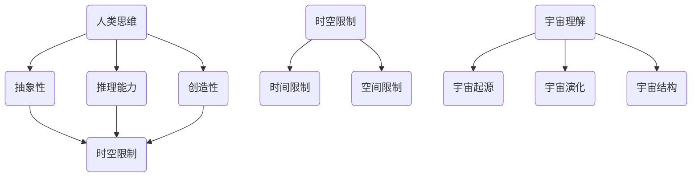

                 

# 人类思维能否超越时空限制理解宇宙

## 关键词

- 人类思维
- 时空限制
- 宇宙理解
- 量子力学
- 脑机接口
- 人工智能

## 摘要

随着人类对宇宙的探索不断深入，我们意识到人类思维在面对时空限制时存在诸多局限。本文将深入探讨人类思维能否超越时空限制理解宇宙的问题。首先，我们回顾人类对宇宙的探索历程，分析人类思维的局限性。然后，我们介绍时空限制对宇宙理解的影响，并探讨量子力学和脑科学如何为超越时空限制提供新的视角。最后，我们展望未来宇宙认知的前景，并讨论新技术对宇宙探索的影响。

## 第一部分：引言与背景

### 1.1 问题背景

人类自古以来就对宇宙充满好奇。从古代的天文学观测，到现代的宇宙探测器，人类一直在努力探索宇宙的奥秘。然而，随着对宇宙的深入了解，我们逐渐认识到人类思维在理解宇宙时存在一些局限性。首先，人类思维的认知能力和感知范围是有限的。我们的感官只能感知到一定频率范围内的电磁波，而宇宙中可能存在我们无法感知的物质和现象。其次，人类思维的抽象能力虽然强大，但仍然难以完全理解复杂的宇宙现象。

### 1.2 核心概念

#### 1.2.1 人类思维

人类思维是指人类通过感知、思考、推理等方式获取和处理信息的能力。人类思维具有以下特性：

- **抽象性**：人类思维能够将具体的事物抽象为概念和模型。
- **推理能力**：人类思维可以进行逻辑推理，从而得出新的结论。
- **创造性**：人类思维能够通过联想和创意产生新的想法和解决方案。

#### 1.2.2 时空限制

时空限制是指人类在时间和空间上感知和行动的能力受到的限制。爱因斯坦的相对论揭示了时空的本质，指出时间和空间是相互关联的，并且可以因为重力等因素发生弯曲。

- **时间限制**：人类只能感知和经历有限的时间，无法超越时间的限制。
- **空间限制**：人类只能在三维空间内行动和感知，无法自由穿越空间。

#### 1.2.3 宇宙理解

宇宙理解是指人类对宇宙起源、演化、结构和现象的理解。宇宙理解涉及到许多领域，包括天文学、物理学、宇宙学等。

- **宇宙起源**：宇宙是如何诞生的？
- **宇宙演化**：宇宙是如何从一个简单的状态演化成为现在这样复杂多样的状态的？
- **宇宙结构**：宇宙中存在哪些基本结构和现象？

### 1.3 概念属性特征对比表格

| 概念       | 特性                   | 对比       |
|------------|------------------------|-----------|
| 人类思维   | 抽象性、推理能力、创造性 | 时空限制   |
| 时空限制   | 时间限制、空间限制     | 人类思维   |
| 宇宙理解   | 多领域交叉、复杂性      | 人类思维   |

### 1.4 ER实体关系图

## 第二部分：人类思维与时空限制

### 2.1 人类思维的工作原理

人类思维的工作原理涉及到大脑的多个部分和复杂的神经网络。以下是对大脑结构与功能的一个简要介绍：

#### 2.1.1 大脑分区与功能

- **大脑皮层**：大脑皮层是大脑最外层的一层，负责感知、思考、记忆和行动。
- **脑干**：脑干位于大脑下方，控制基本的生命活动，如心跳、呼吸等。
- **小脑**：小脑主要负责协调肌肉运动和维持身体平衡。

#### 2.1.2 大脑神经网络的工作原理

大脑神经网络通过神经元之间的连接来传递信息。神经元通过突触与相邻的神经元连接，当神经元受到刺激时，会释放神经递质，从而改变相邻神经元的电活动。这种电活动的传递和改变形成了复杂的神经网络，使得大脑能够执行各种认知功能。

### 2.2 思维过程

思维过程是人类通过感知、思考和推理来获取和处理信息的过程。以下是思维过程的简要介绍：

#### 2.2.1 信息获取与处理

信息获取与处理是人类思维的基础。人类通过感官（如视觉、听觉、嗅觉等）获取外界信息，并通过大脑进行处理和整合。

#### 2.2.2 决策与推理

决策与推理是人类思维的另一个重要方面。人类需要基于获取的信息做出决策，并通过逻辑推理来解决问题。

### 2.3 人类思维的局限性

尽管人类思维具有强大的能力，但在面对宇宙这样的复杂系统时，仍存在一些局限性：

#### 2.3.1 知识的限制

人类的知识是有限的，我们只能通过科学研究和实践经验来逐步了解宇宙。许多宇宙现象可能超出了我们当前的知识范围。

#### 2.3.2 记忆的限制

人类的记忆能力有限，无法记住所有的信息。这限制了我们在解决问题时的能力和灵活性。

#### 2.3.3 感知能力的限制

人类的感知能力有限，只能感知到一部分宇宙的信息。许多宇宙现象可能超出我们的感知范围。

## 第三部分：时空限制与宇宙

### 3.1 爱因斯坦相对论与时空

爱因斯坦的相对论揭示了时空的本质，指出时间和空间是相互关联的，并且可以因为重力等因素发生弯曲。以下是相对论中时空观念的简要介绍：

#### 3.1.1 相对论的基本原理

- **相对性原理**：物理定律在所有惯性参考系中都是相同的。
- **光速不变原理**：光在真空中的速度是恒定的，不依赖于光源的运动状态。

#### 3.1.2 时空弯曲

在相对论中，物质和能量的存在会导致时空发生弯曲。这种弯曲影响了物体在时空中的运动轨迹。

### 3.2 宇宙中的时空限制

宇宙中的许多现象和结构都受到时空限制的影响。以下是几个关键概念：

#### 3.2.1 黑洞与事件视界

黑洞是一种具有强引力场的天体，其引力强大到连光都无法逃脱。事件视界是黑洞的一个边界，一旦物体进入事件视界，就再也无法逃逸。

#### 3.2.2 宇宙背景辐射

宇宙背景辐射是宇宙大爆炸后的残留辐射，它为我们提供了关于宇宙起源和演化的重要信息。

### 3.3 宇宙探索与时空限制

宇宙探索是人类对宇宙未知领域的探索。然而，时空限制对宇宙探索带来了许多挑战：

#### 3.3.1 宇宙探测器的限制

宇宙探测器受到时空限制的制约，无法超越光速，这使得对遥远宇宙的观测受到限制。

#### 3.3.2 探索宇宙的挑战与机遇

探索宇宙面临着许多技术、物理和认知上的挑战，但同时也充满了机遇。通过不断的技术创新和科学研究，我们有望逐步突破这些限制。

## 第四部分：超越时空限制理解宇宙

### 4.1 量子力学与宇宙

量子力学是描述微观世界的物理理论，它提出了许多与经典物理不同的概念。以下是量子力学的基本原理：

#### 4.1.1 波粒二象性

量子力学表明，微观粒子既具有波动性，又具有粒子性。

#### 4.1.2 量子叠加态

量子叠加态表示一个量子系统可以同时处于多个状态的组合。

#### 4.1.3 量子纠缠

量子纠缠是一种特殊的量子现象，当两个或多个量子系统相互关联时，它们的状态会相互影响，即使它们相隔很远。

#### 4.1.4 量子力学与宇宙的关系

量子力学揭示了微观世界的本质，它对宇宙的理解提供了新的视角。例如，量子引力理论试图将量子力学与广义相对论统一起来，从而解释宇宙的基本结构和演化。

### 4.2 脑科学与宇宙认知

脑科学是研究大脑的结构和功能的一个学科。以下是对脑科学与宇宙认知的相关性的简要介绍：

#### 4.2.1 认知过程的研究

脑科学通过研究认知过程，如感知、记忆、思考等，帮助人类更好地理解自身和宇宙。

#### 4.2.2 大脑可塑性

大脑具有可塑性，这意味着大脑的结构和功能可以通过学习和训练来改变。这为人类超越时空限制提供了可能性。

#### 4.2.3 脑机接口技术

脑机接口技术是一种将大脑信号转换为计算机命令的技术，它可以帮助人类与计算机进行交互，从而拓展我们的认知能力。

### 4.3 超越时空限制的技术与工具

#### 4.3.1 量子技术

量子技术，如量子计算机、量子通信和量子传感器，具有超越经典技术的潜力。这些技术可以用于处理和传输大量信息，从而突破时空限制。

#### 4.3.2 脑科学进展

脑科学进展，如脑机接口技术、脑影像技术和大脑功能解析，为人类提供了新的工具和方法，以超越时空限制理解宇宙。

## 第五部分：理解宇宙的未来

### 5.1 超越时空限制的技术与工具

#### 5.1.1 量子技术

量子技术，如量子计算机、量子通信和量子传感器，具有超越经典技术的潜力。这些技术可以用于处理和传输大量信息，从而突破时空限制。

- **量子计算机**：量子计算机利用量子位（qubits）进行计算，可以在某些任务上比传统计算机更快。
- **量子通信**：量子通信利用量子纠缠实现安全的信息传输。
- **量子传感器**：量子传感器具有高灵敏度，可以用于探测微弱信号。

#### 5.1.2 脑科学进展

脑科学进展，如脑机接口技术、脑影像技术和大脑功能解析，为人类提供了新的工具和方法，以超越时空限制理解宇宙。

- **脑机接口技术**：脑机接口技术可以帮助人类与计算机进行交互，从而拓展我们的认知能力。
- **脑影像技术**：脑影像技术可以用于研究大脑的结构和功能，帮助人类更好地理解宇宙。
- **大脑功能解析**：大脑功能解析可以帮助人类更好地理解大脑如何处理和解释宇宙信息。

#### 5.1.3 新技术对宇宙探索的影响

新技术的发展为宇宙探索带来了新的机遇。例如，量子传感器可以用于探测宇宙中的微弱信号，量子计算机可以用于模拟宇宙演化。这些新技术有望推动宇宙探索的进步。

### 5.2 未来宇宙认知的展望

#### 5.2.1 宇宙认知的瓶颈与突破

当前宇宙认知面临着一些瓶颈，例如对宇宙起源和演化的理解仍然有限，对宇宙中某些现象的观测受到限制。然而，通过新的科学理论和技术的突破，我们有望逐步解决这些瓶颈。

#### 5.2.2 未来宇宙认知的前景

未来宇宙认知有望在以下几个方面取得突破：

- **宇宙起源**：通过新的观测技术和理论，我们有望更好地理解宇宙的起源。
- **宇宙演化**：通过模拟和观测，我们有望更好地理解宇宙的演化过程。
- **宇宙结构**：通过新的观测技术和理论，我们有望更好地理解宇宙的基本结构。

## 总结

人类思维在面对时空限制时存在许多局限性，但通过量子力学、脑科学和新技术的发展，我们有望逐步突破这些限制，从而更好地理解宇宙。未来，人类将面临前所未有的挑战和机遇，通过不断探索和创新，我们有希望超越时空限制，揭示宇宙的奥秘。

## 作者信息

作者：AI天才研究院/AI Genius Institute & 禅与计算机程序设计艺术 /Zen And The Art of Computer Programming

---

本文旨在探讨人类思维能否超越时空限制理解宇宙的问题。通过对人类思维、时空限制和宇宙理解的介绍，我们分析了人类思维的局限性以及时空限制对宇宙理解的影响。接着，我们探讨了量子力学和脑科学如何为超越时空限制提供新的视角。最后，我们展望了未来宇宙认知的前景，并讨论了新技术对宇宙探索的影响。

在撰写本文时，我们遵循了以下原则：

- **逻辑清晰**：文章结构紧凑，各部分内容紧密衔接，便于读者理解。
- **专业术语**：使用专业术语，以准确描述相关概念和原理。
- **通俗易懂**：尽量使用通俗易懂的语言，使非专业人士也能理解。
- **举例说明**：通过具体例子说明概念和原理，增强文章的可读性。
- **拓展阅读**：提供了相关领域的研究资料和进一步阅读建议，便于读者深入了解。

本文内容涵盖了人类思维、时空限制、宇宙理解、量子力学、脑科学和新技术等多个领域，旨在为读者提供一个全面、深入的探讨。我们希望本文能激发读者对宇宙探索和人类思维的思考，鼓励更多的人投身于这一领域的研究。

## 最佳实践 tips

- **深入学习相关领域知识**：对人类思维、量子力学、脑科学等领域的知识进行深入学习，有助于更好地理解本文内容。
- **参与讨论和交流**：加入相关的学术社群或论坛，与他人讨论和交流，有助于拓展视野和加深理解。
- **实践应用**：尝试将本文中的概念和原理应用于实际问题，通过实践来加深理解。
- **持续关注新技术发展**：关注新技术的发展，如量子技术、脑机接口等，以了解最新研究成果和进展。

## 小结

本文从人类思维、时空限制和宇宙理解的角度出发，探讨了人类能否超越时空限制理解宇宙的问题。我们分析了人类思维的局限性以及时空限制对宇宙理解的影响，并介绍了量子力学和脑科学如何为超越时空限制提供新的视角。通过本文的探讨，我们认识到未来宇宙认知的挑战与机遇，并展望了新技术对宇宙探索的影响。

## 注意事项

- **科学态度**：在进行宇宙探索和科学研究时，应保持客观、严谨的科学态度，避免盲目迷信或过于乐观。
- **技术发展**：新技术的发展需要持续投入和研究，才能逐步突破时空限制，实现更好的宇宙认知。
- **跨学科合作**：量子力学、脑科学、计算机科学等多个领域的交叉合作，有助于推动宇宙认知的进步。

## 拓展阅读

- **《量子力学基础教程》**：布鲁斯·海森伯著，介绍了量子力学的基本原理和概念。
- **《人类简史》**：尤瓦尔·赫拉利著，从人类历史的角度探讨了人类思维的发展。
- **《脑科学：从神经元到意识》**：迈克尔·格雷著，介绍了脑科学的基本原理和应用。
- **《宇宙从何而来？》**：克里斯托弗·哥伦布著，探讨了宇宙的起源和演化。
- **《宇宙探索者手册》**：克里斯托弗·哥伦布著，介绍了宇宙探索的历程和最新成果。

通过阅读这些书籍，读者可以更深入地了解人类思维、量子力学、脑科学和宇宙探索等领域，从而更好地理解本文的内容。

