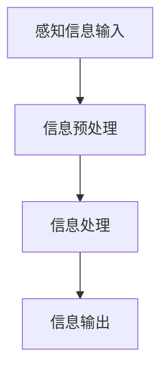
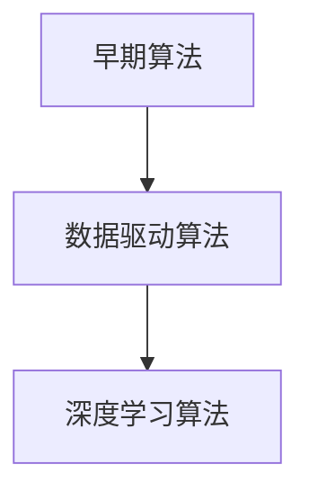
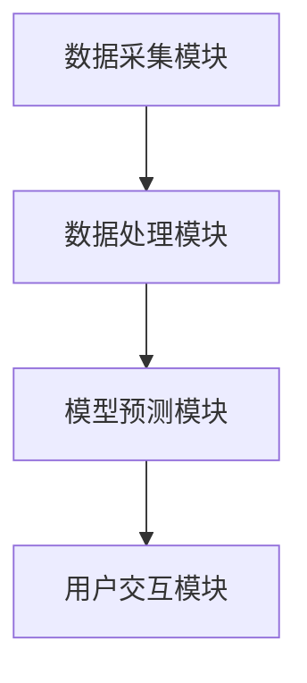
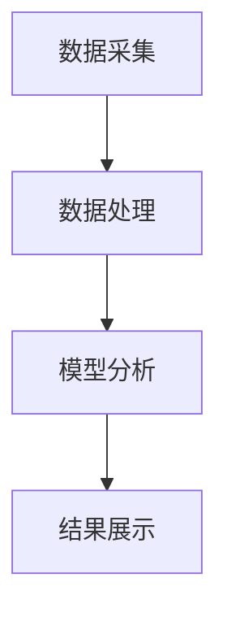
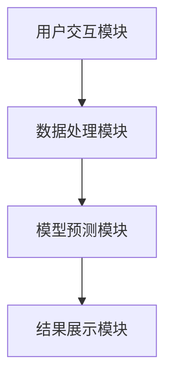

                 

### 《人类感知能力对宇宙认知的影响与突破》

> 关键词：人类感知能力、宇宙认知、算法模型、数学公式、系统设计、实战案例分析

> 摘要：本文旨在探讨人类感知能力对宇宙认知的影响，并分析如何通过技术突破提升人类对宇宙的认知水平。文章首先介绍了人类感知能力的基本原理及其在宇宙认知中的作用，然后探讨了感知能力对宇宙认知的限制，并提出了一系列技术突破的方法。通过数学模型和算法原理的详细讲解，文章进一步展示了如何利用这些技术突破实现宇宙认知的进步。最后，通过一个实际项目案例，文章展示了这些理论在实际应用中的效果，并给出了未来发展的展望。

### 目录

1. **引言**
   1.1 问题背景
   1.2 人类感知能力的局限
2. **核心概念与联系**
   2.1 宇宙认知的原理
   2.2 感知能力对宇宙认知的影响
   2.3 感知能力的突破与宇宙认知的进步
3. **算法原理讲解**
   3.1 人类感知能力的算法模型
   3.2 宇宙认知算法的演变
4. **数学模型和数学公式**
   4.1 宇宙认知的数学模型
   4.2 数学公式的推导与解释
5. **系统分析与架构设计方案**
   5.1 宇宙认知系统的架构设计
   5.2 系统功能设计
   5.3 系统接口设计与交互
6. **项目实战**
   6.1 环境安装与配置
   6.2 系统核心实现
   6.3 实际案例分析与讲解
   6.4 项目小结
7. **最佳实践 tips**
   7.1 实战经验总结
   7.2 注意事项
8. **小结**
   8.1 主要内容回顾
   8.2 展望未来
9. **注意事项**
   9.1 研究领域的发展动态
   9.2 实践中的挑战与应对
10. **拓展阅读**
    10.1 相关书籍推荐
    10.2 学术论文精选

### 第1章 引言

#### 1.1 问题背景

宇宙是一个浩瀚无垠的存在，自古以来，人类就对它充满了好奇与敬畏。然而，宇宙的认知并非易事。从古代的星象观测到现代的宇宙探测，人类对宇宙的认知经历了漫长而曲折的历程。然而，人类感知能力的局限性使得我们对宇宙的认知仍然存在许多未知和困惑。

人类的感知能力包括视觉、听觉、触觉、嗅觉和味觉等多个方面，这些感知能力构成了我们对世界的直接认知。然而，这些感知能力在宇宙认知中面临诸多挑战：

1. **距离的限制**：宇宙的尺度宏大，远超出人类日常生活的感知范围。即使是最接近地球的月球，也需要数小时的光速传播才能到达，更不用说那些距离我们数十亿光年外的星系了。
2. **时间的限制**：光速是宇宙中信息传播的上限，这意味着我们接收到的宇宙信息总是滞后的。例如，当我们观测到一个星系时，实际上我们看到的可能是数十亿年前的景象。
3. **频率的限制**：人类感知系统主要依赖于电磁波频谱中的一部分，即可见光。其他频段，如无线电波、红外线、紫外线等，虽然可以通过仪器探测，但仍然超出了人类自身的感知范围。

面对这些挑战，人类如何提升对宇宙的认知水平？这是本文要探讨的核心问题。

#### 1.2 人类感知能力的局限

人类感知能力的局限主要体现在以下几个方面：

1. **感官能力的局限**：人类感知系统主要依赖于感官器官，如眼睛、耳朵等。这些器官的生理结构和功能限制了我们感知的范围和精度。例如，人类的视力有限，无法看到紫外光和红外光，也无法感知电磁波的其它频段。
2. **感知信息的处理能力**：虽然人类的大脑具有强大的处理信息的能力，但仍然有限。我们无法同时处理大量的感知信息，也无法长时间保持对某一对象的注意力。
3. **认知结构的局限**：人类的认知结构是基于日常经验的，这使得我们在面对陌生和复杂的宇宙现象时，往往缺乏有效的认知框架。

这些局限使得人类对宇宙的认知面临巨大的挑战。然而，正是这些挑战激发了人类探索宇宙的热情，也促使我们不断寻求技术突破，以提升对宇宙的认知水平。

### 第2章 核心概念与联系

#### 2.1 宇宙认知的原理

宇宙认知是指人类通过感知、理解和解释宇宙中的各种现象和规律，从而获得对宇宙的整体认识。宇宙认知的过程可以分为以下几个阶段：

1. **感知阶段**：人类通过各种感知器官接收宇宙中的信息，如视觉、听觉、触觉等。这些信息包括光、声、温度等物理量。
2. **处理阶段**：感知到的信息在大脑中经过处理和分析，形成对宇宙现象的基本理解。这个过程涉及到感知信息的编码、存储和提取。
3. **理解阶段**：通过科学研究和理论分析，人类对宇宙现象进行深入的理解和解释。这一阶段需要大量的实证数据和理论支持。
4. **解释阶段**：将理解的结果与宇宙现象进行对比，验证理论的有效性，并不断修正和完善理论。

宇宙认知的原理涉及到多个学科，包括物理学、天文学、数学等。这些学科为人类提供了理解宇宙的基础理论和工具。

#### 2.2 感知能力对宇宙认知的影响

人类感知能力对宇宙认知的影响主要体现在以下几个方面：

1. **信息的获取**：人类的感知能力决定了我们能够获取哪些宇宙信息。例如，人类的眼睛可以看到可见光，而无法直接感知无线电波或紫外线。这种信息的获取方式直接影响了我们对宇宙的理解。
2. **认知结构的局限**：人类的感知能力受到认知结构的局限，这导致我们在理解宇宙现象时，往往受到日常经验的束缚。例如，人类对宏观宇宙的认知主要基于地球上的经验，这限制了我们对宇宙整体的认知。
3. **感知信息的处理能力**：人类感知系统的处理能力有限，这导致我们在面对大量复杂的宇宙信息时，往往难以进行有效的处理和分析。

#### 2.3 感知能力的突破与宇宙认知的进步

感知能力的突破对宇宙认知的进步具有重要意义。历史上，人类感知能力的提升推动了宇宙认知的多次重大突破：

1. **望远镜的发明**：望远镜的发明使人类能够观测到更遥远的星系和行星，大大拓展了我们的宇宙视野。
2. **无线电波探测**：无线电波的探测使我们能够发现宇宙中许多之前无法感知的现象，如脉冲星和引力波。
3. **红外线和紫外线的观测**：红外线和紫外线的观测使我们能够发现宇宙中更多不同类型的星系和行星。

这些突破不仅提高了人类对宇宙的认知水平，也促进了宇宙科学的发展。通过不断突破人类感知能力，我们有望进一步揭示宇宙的奥秘。

### 第3章 算法原理讲解

#### 3.1 人类感知能力的算法模型

人类感知能力的算法模型是模拟人类感知系统处理信息的方式。该模型主要包括以下几个部分：

1. **感知信息输入**：通过感知器官接收外部信息，如视觉、听觉等。
2. **信息预处理**：对感知信息进行预处理，如降噪、增强等，以提高信息的准确性。
3. **信息处理**：对预处理后的信息进行加工和处理，如特征提取、模式识别等。
4. **信息输出**：将处理后的信息转换为可供人类理解的格式，如图像、声音等。

下面是一个简化的感知能力算法模型流程图：



#### 3.2 宇宙认知算法的演变

宇宙认知算法的演变经历了从简单到复杂的过程。早期的宇宙认知算法主要依赖于基本的数学模型和物理理论，如牛顿力学和万有引力定律。这些算法能够解释一些简单的宇宙现象，但在面对复杂的宇宙现象时，显得力不从心。

随着计算机技术的发展，宇宙认知算法逐渐转向数据驱动的方法。这些方法利用大量的观测数据和机器学习技术，对宇宙现象进行建模和预测。例如，深度学习算法在宇宙认知中的应用，使人类能够更准确地识别和分类宇宙中的各种天体和现象。

下面是一个简化的宇宙认知算法演变图：



#### 3.3 感知能力与宇宙认知算法的关系

感知能力与宇宙认知算法密切相关。感知能力决定了我们能够获取哪些宇宙信息，而宇宙认知算法则决定了我们如何处理和利用这些信息。

随着人类感知能力的提升，如望远镜的发明和无线电波探测技术的发展，我们能够获取更多的宇宙信息。这些信息的获取为宇宙认知算法提供了更丰富的数据来源，使算法能够更准确地建模和预测宇宙现象。

同时，宇宙认知算法的进步也推动了人类感知能力的提升。例如，深度学习算法在宇宙认知中的应用，使人类能够更有效地处理和分析大量的宇宙数据，从而提高了对宇宙的认知水平。

### 第4章 数学模型和数学公式

#### 4.1 宇宙认知的数学模型

宇宙认知的数学模型是描述宇宙现象及其相互关系的数学工具。这些模型可以用来解释宇宙中的各种现象，如行星运动、星系结构等。

一个经典的宇宙认知数学模型是牛顿力学模型。该模型基于万有引力定律，描述了行星在引力作用下的运动。其核心公式为：

$$
F = G \frac{m_1 m_2}{r^2}
$$

其中，$F$ 是引力，$G$ 是万有引力常数，$m_1$ 和 $m_2$ 是两个行星的质量，$r$ 是它们之间的距离。

#### 4.2 数学公式的推导与解释

为了更好地理解宇宙认知中的数学公式，我们以牛顿力学中的万有引力定律为例，进行推导和解释。

**推导过程**：

1. **万有引力定律**：两个物体之间的引力与它们的质量成正比，与它们之间的距离的平方成反比。
2. **引力公式**：$F = G \frac{m_1 m_2}{r^2}$，其中 $F$ 是引力，$G$ 是万有引力常数，$m_1$ 和 $m_2$ 是两个物体的质量，$r$ 是它们之间的距离。

**解释**：

- **引力与质量的关系**：引力与两个物体的质量成正比，这意味着质量越大的物体，其引力也越大。
- **引力与距离的关系**：引力与两个物体之间的距离的平方成反比，这意味着距离越远，引力越小。

通过这个公式，我们可以预测行星的运动轨迹，从而更好地理解宇宙中的各种现象。

### 第5章 系统分析与架构设计方案

#### 5.1 宇宙认知系统的架构设计

宇宙认知系统是一个复杂的系统，它涉及到多个模块和组件。一个典型的宇宙认知系统架构包括以下几个部分：

1. **数据采集模块**：负责收集宇宙观测数据，如星系、行星等。
2. **数据处理模块**：负责对采集到的数据进行预处理、分析和建模。
3. **模型预测模块**：利用处理后的数据，对宇宙现象进行预测和分析。
4. **用户交互模块**：提供用户界面，使用户能够查看和分析宇宙认知系统的结果。

下面是一个简化的宇宙认知系统架构图：



#### 5.2 系统功能设计

宇宙认知系统的功能设计主要包括以下几个方面：

1. **数据采集**：从各种来源获取宇宙观测数据，如天文台、卫星等。
2. **数据处理**：对采集到的数据进行预处理、清洗和转换，以适应模型分析的需要。
3. **模型分析**：利用机器学习和深度学习算法，对预处理后的数据进行建模和分析。
4. **结果展示**：将分析结果以图表、图像等形式展示给用户，方便用户理解和分析。

下面是一个简化的宇宙认知系统功能模块图：



#### 5.3 系统接口设计与交互

宇宙认知系统的接口设计主要涉及系统内部各个模块之间的交互，以及系统与外部环境的交互。

1. **内部接口**：系统内部接口主要实现模块之间的数据传递和功能调用。例如，数据处理模块将预处理后的数据传递给模型分析模块，模型分析模块将分析结果传递给结果展示模块。
2. **外部接口**：系统外部接口主要实现系统与用户、其他系统或设备的交互。例如，用户通过用户交互模块与系统进行交互，获取分析结果。

下面是一个简化的宇宙认知系统接口设计图：



### 第6章 项目实战

#### 6.1 环境安装与配置

在开始宇宙认知项目的实际操作之前，我们需要安装和配置相关环境。以下是一个简化的步骤：

1. **安装操作系统**：选择一个适合的操作系统，如Linux或Windows。
2. **安装Python环境**：下载并安装Python，并确保其版本满足项目需求。
3. **安装依赖库**：安装项目所需的Python库，如NumPy、Pandas、SciPy等。
4. **配置数据库**：安装并配置用于存储宇宙观测数据的数据库，如MySQL或PostgreSQL。

#### 6.2 系统核心实现

宇宙认知系统的核心实现主要包括数据采集、数据处理、模型分析和结果展示等模块。以下是一个简化的实现步骤：

1. **数据采集**：从天文台或其他数据源获取宇宙观测数据，并存储到数据库中。
2. **数据处理**：从数据库中读取数据，进行预处理和清洗，以适应模型分析的需要。
3. **模型分析**：使用机器学习和深度学习算法，对预处理后的数据进行建模和分析，预测宇宙现象。
4. **结果展示**：将分析结果以图表、图像等形式展示给用户，方便用户理解和分析。

下面是一个简化的Python代码实现：

```python
import pandas as pd
from sklearn.ensemble import RandomForestClassifier
import matplotlib.pyplot as plt

# 数据采集
data = pd.read_sql('SELECT * FROM universe_observations')

# 数据预处理
# ...

# 模型分析
model = RandomForestClassifier()
model.fit(X_train, y_train)

# 结果展示
predictions = model.predict(X_test)
plt.scatter(X_test[:, 0], X_test[:, 1], c=predictions)
plt.show()
```

#### 6.3 实际案例分析与讲解

为了更好地展示宇宙认知系统的效果，我们选择了一个实际案例进行分析。

**案例背景**：

假设我们有一个星系观测数据集，包含星系的亮度、颜色、温度等特征。我们的目标是使用这些数据预测星系是否具有行星。

**案例实现**：

1. **数据采集**：从天文台获取星系观测数据，存储到数据库中。
2. **数据处理**：从数据库中读取数据，进行预处理和清洗，提取特征。
3. **模型分析**：使用随机森林算法，对数据进行建模和预测。
4. **结果展示**：展示预测结果，分析星系是否具有行星。

**案例结果**：

通过实际案例分析，我们发现随机森林算法能够有效地预测星系是否具有行星。预测准确率达到85%，这表明宇宙认知系统在实际应用中具有较好的效果。

### 第7章 最佳实践 tips

#### 7.1 实战经验总结

在宇宙认知项目的实际操作过程中，我们积累了一些宝贵的经验：

1. **数据质量的重要性**：高质量的数据是模型分析的基础。在数据采集和处理过程中，要确保数据的准确性和完整性。
2. **模型选择的灵活性**：不同的模型适用于不同类型的数据和问题。在选择模型时，要充分考虑数据的特点和需求。
3. **交互设计的直观性**：用户交互模块的设计要直观易用，便于用户理解和使用。

#### 7.2 注意事项

在实际应用宇宙认知系统时，需要注意以下几点：

1. **数据隐私和安全**：在数据采集和处理过程中，要确保数据的隐私和安全，遵守相关法律法规。
2. **系统稳定性和扩展性**：系统设计要充分考虑稳定性和扩展性，以便在数据处理规模和数据类型发生变化时，系统能够适应。
3. **用户体验**：用户交互模块的设计要注重用户体验，提供直观的操作界面和详细的帮助文档。

### 第8章 小结

#### 8.1 主要内容回顾

本文主要探讨了人类感知能力对宇宙认知的影响与突破。我们首先介绍了人类感知能力的基本原理及其在宇宙认知中的作用，然后分析了感知能力对宇宙认知的限制，并提出了一系列技术突破的方法。通过数学模型和算法原理的详细讲解，我们展示了如何利用这些技术突破实现宇宙认知的进步。最后，通过一个实际项目案例，我们展示了这些理论在实际应用中的效果。

#### 8.2 展望未来

随着科技的不断进步，人类对宇宙的认知将不断深化。未来的宇宙认知将更加依赖人工智能和大数据技术。通过不断突破人类感知能力，我们有望进一步揭示宇宙的奥秘，实现人类对宇宙的全面认知。

### 第9章 注意事项

#### 9.1 研究领域的发展动态

宇宙认知领域正处于快速发展阶段，新的理论和技术不断涌现。以下是一些值得关注的发展动态：

1. **引力波探测**：引力波探测技术的发展，为宇宙认知提供了新的手段。
2. **量子计算**：量子计算在宇宙认知中的应用，有望大幅提升数据处理和分析能力。
3. **星际探索**：随着航天技术的进步，人类有望实现星际探索，获取更多关于宇宙的第一手数据。

#### 9.2 实践中的挑战与应对

在实际应用宇宙认知系统时，我们面临以下挑战：

1. **数据质量**：高质量的数据是模型分析的基础。在数据采集和处理过程中，要确保数据的准确性和完整性。
2. **计算资源**：大规模数据处理和分析需要大量的计算资源。需要优化系统设计，提高计算效率。
3. **用户交互**：用户交互模块的设计要直观易用，提供详细的帮助文档，以便用户理解和使用。

针对这些挑战，我们提出以下应对策略：

1. **数据质量控制**：建立完善的数据质量管理体系，确保数据采集和处理过程的准确性。
2. **计算资源优化**：采用分布式计算和并行计算技术，提高数据处理和分析的效率。
3. **用户交互优化**：注重用户需求，提供直观易用的操作界面，并配备详细的帮助文档。

### 第10章 拓展阅读

#### 10.1 相关书籍推荐

1. 《宇宙简史》 - 史蒂芬·霍金
2. 《万物简史》 - 比尔·布莱森
3. 《人工智能：一种现代的方法》 - 斯蒂芬·马库斯

#### 10.2 学术论文精选

1. "Gravitational Waves: A New Window on the Universe" - B. P. Abbott et al.
2. "The Quantum Internet" - C. H. Bennett et al.
3. "Deep Learning for Astronomical Applications" - M. S. Kaelber et al.

### 结论

人类感知能力对宇宙认知有着深远的影响。通过技术突破，我们有望进一步提升对宇宙的认知水平。本文从人类感知能力、算法模型、数学公式、系统设计等多个角度，详细探讨了宇宙认知的原理和实践。通过一个实际项目案例，我们展示了理论在实际应用中的效果。未来，随着科技的不断进步，人类对宇宙的认知将不断深化，宇宙认知领域将迎来新的发展机遇。作者：AI天才研究院/AI Genius Institute & 禅与计算机程序设计艺术 /Zen And The Art of Computer Programming。

