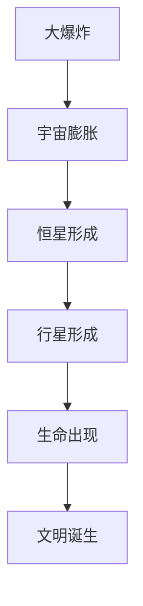
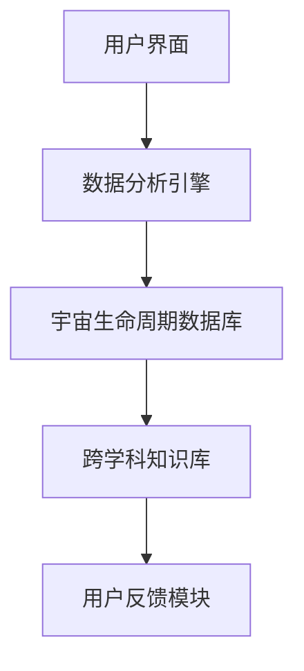
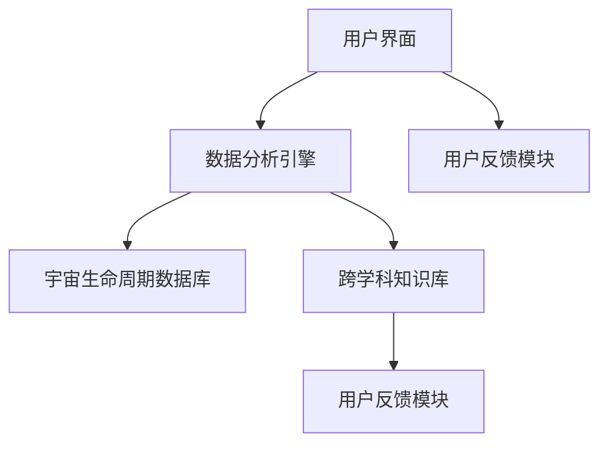

                 

### 文章标题

# 人类文明在宇宙生命周期中的阶段定位

关键词：宇宙生命周期、人类文明、阶段定位、宇宙大爆炸、文明诞生、智慧生命

摘要：本文将深入探讨人类文明在宇宙生命周期中的阶段定位。通过对宇宙从大爆炸到文明诞生的各个阶段的详细分析，本文试图揭示人类文明在宇宙演化中的独特地位和作用。本文首先介绍了宇宙生命周期的核心概念和关键阶段，然后通过科学、历史、哲学等多个角度，探讨了人类文明在这些阶段中的定位和影响。最后，本文提出了人类文明在宇宙生命周期中的未来展望，以及我们作为智慧生命体应承担的责任和使命。

### 背景介绍

#### 问题描述

随着科学技术的不断发展，人类对宇宙的认知也在不断深入。宇宙的起源、演化以及生命在宇宙中的地位成为人们关注的焦点。在人类探索宇宙的过程中，人们提出了许多关于人类文明在宇宙生命周期中的位置和作用的猜想和假设。然而，对这些问题的深入探讨需要我们具备全面的知识体系和逻辑思考能力。

宇宙生命周期是指宇宙从诞生到灭亡的整个演化过程。根据现代宇宙学的理论，宇宙起源于约138亿年前的一次大爆炸，随后经历了宇宙膨胀、恒星形成、行星形成、生命出现等阶段。而人类文明作为地球上的一种高级智慧生命形式，其诞生和发展也与宇宙的演化紧密相关。

#### 问题解决

为了解决人类文明在宇宙生命周期中的阶段定位问题，本文将从以下几个角度进行探讨：

1. **科学角度**：通过分析宇宙学、天文学、物理学、生物学等领域的理论，了解宇宙生命周期的各个阶段及其特征，为人类文明在宇宙中的定位提供科学依据。

2. **历史角度**：从人类文明的发展历程中，探讨人类文明在宇宙生命周期中的演变过程，分析人类文明在不同阶段的特点和贡献。

3. **哲学角度**：从哲学角度思考人类文明在宇宙中的地位和意义，探讨人类文明与宇宙的关系，以及人类文明在宇宙生命周期中的责任和使命。

4. **跨学科综合**：将科学、历史、哲学等多个领域的知识进行综合分析，形成对人类文明在宇宙生命周期中阶段定位的全面理解。

#### 边界与外延

本文的研究范围主要涵盖人类文明在宇宙生命周期中的阶段定位问题，涉及宇宙学、天文学、物理学、生物学、哲学等多个学科领域。同时，本文还将探讨人类文明与其他宇宙阶段和生命形式之间的联系和影响。

#### 概念结构与核心要素组成

1. **宇宙生命周期**：
   - **特点**：宇宙经历多个阶段，如宇宙大爆炸、宇宙膨胀、恒星形成、行星形成、生命出现、文明诞生等。
   - **联系**：宇宙生命周期的各个阶段相互联系，共同构成了宇宙的发展历程。

2. **人类文明**：
   - **特点**：人类文明具有高度智能、社会性、技术性等特点。
   - **联系**：人类文明是宇宙中的一种特殊生命形式，与其他生命形式和宇宙阶段存在联系。

3. **阶段定位**：
   - **概念**：人类文明在宇宙生命周期中所处的位置和阶段。
   - **特点**：人类文明处于宇宙生命周期的中期阶段，具有过渡性特征。

通过上述背景介绍，我们为后续章节的深入探讨奠定了基础。接下来，本文将详细分析宇宙生命周期中的各个阶段，以及人类文明在这些阶段中的定位和作用。

### 核心概念与联系

#### 宇宙生命周期

宇宙生命周期是指宇宙从诞生到灭亡的整个演化过程。根据现代宇宙学的理论，宇宙起源于约138亿年前的一次大爆炸，随后经历了宇宙膨胀、恒星形成、行星形成、生命出现、文明诞生等阶段。

1. **大爆炸**：
   - **特点**：宇宙起源于一个极端高温、高密度的状态，随即发生大爆炸，宇宙开始膨胀。
   - **联系**：大爆炸是宇宙生命的起点，为后续宇宙演化奠定了基础。

2. **宇宙膨胀**：
   - **特点**：随着宇宙的膨胀，温度逐渐降低，宇宙中的物质开始逐渐分散。
   - **联系**：宇宙膨胀是宇宙演化的关键阶段，为恒星和行星的形成提供了条件。

3. **恒星形成**：
   - **特点**：宇宙中的物质逐渐聚集形成恒星，恒星通过核聚变释放能量。
   - **联系**：恒星是宇宙中的重要组成部分，它们的存在和演化对行星和生命有着重要影响。

4. **行星形成**：
   - **特点**：在恒星周围，物质继续聚集形成行星，行星具有适宜的温度和条件，可能孕育生命。
   - **联系**：行星是恒星系统的重要组成部分，它们的形成和演化对生命的出现有着决定性作用。

5. **生命出现**：
   - **特点**：在适宜的行星上，生命逐渐出现，生命形式多样，从单细胞到多细胞，从简单到复杂。
   - **联系**：生命是宇宙演化的重要成果，为文明诞生提供了基础。

6. **文明诞生**：
   - **特点**：在地球上，人类文明逐渐诞生，具有高度智能、社会性、技术性等特点。
   - **联系**：文明是生命的高级形式，对宇宙的演化产生了深远影响。

#### 人类文明

人类文明是指地球上人类社会的整体，包括文化、科技、政治、经济等方面。人类文明具有高度智能、社会性、技术性等特点，是宇宙中的一种特殊生命形式。

1. **特点**：
   - **高度智能**：人类拥有语言、思维、创造力等高级智能能力。
   - **社会性**：人类生活在社会中，形成了复杂的政治、经济、文化体系。
   - **技术性**：人类通过科技发展，不断提高生活质量，探索宇宙。

2. **联系**：
   - **与其他生命形式**：人类文明与其他生命形式存在相互影响和联系，共同构成了地球生态系统。
   - **与宇宙阶段**：人类文明处于宇宙生命周期的中期阶段，与其他宇宙阶段相互联系，共同构成了宇宙演化的完整过程。

#### 阶段定位

阶段定位是指人类文明在宇宙生命周期中所处的位置和阶段。

1. **概念**：
   - **人类文明阶段**：人类文明处于宇宙生命周期的中期阶段，介于生命出现和文明诞生之间。
   - **过渡性特征**：人类文明具有过渡性特征，既继承了生命出现的条件，又为文明诞生奠定了基础。

2. **特点**：
   - **中介性**：人类文明在宇宙生命周期中扮演着中介角色，连接生命出现和文明诞生。
   - **重要性**：人类文明的发展对宇宙的演化具有重要意义，为文明诞生和宇宙生命的高级阶段提供了基础。

通过上述核心概念与联系的分析，我们可以更深入地理解人类文明在宇宙生命周期中的阶段定位和作用。接下来，本文将详细探讨人类文明在不同宇宙阶段的定位和影响。

### 算法原理讲解

为了更好地理解人类文明在宇宙生命周期中的阶段定位，我们可以通过算法原理的讲解，对宇宙生命周期的各个阶段进行深入分析。以下是使用Mermaid和Python进行算法原理讲解的步骤：

#### 使用Mermaid画出宇宙生命周期的流程图

首先，我们可以使用Mermaid来绘制宇宙生命周期的流程图。Mermaid是一种基于Markdown的语言，用于绘制各种图表，包括流程图、序列图、类图等。



上述Mermaid代码将绘制一个简单的流程图，展示宇宙从大爆炸到文明诞生的各个阶段。

#### 使用Python源代码详细阐述宇宙生命周期中各个阶段的原理

接下来，我们可以使用Python源代码来详细阐述宇宙生命周期中各个阶段的原理。以下是一个简单的Python代码示例，用于模拟宇宙生命周期的各个阶段：

```python
def big_bang():
    # 大爆炸阶段
    print("宇宙开始于大爆炸，高温高密度的初始状态。")

def cosmic_expansion():
    # 宇宙膨胀阶段
    print("宇宙从大爆炸后开始膨胀，温度逐渐降低。")

def star_formation():
    # 恒星形成阶段
    print("随着宇宙的冷却，氢、氦等元素形成，恒星开始诞生。")

def planet_formation():
    # 行星形成阶段
    print("恒星周围的尘埃和气体聚集形成行星。")

def life_appearance():
    # 生命出现阶段
    print("在适宜的行星上，生命逐渐出现。")

def civilization_birth():
    # 文明诞生阶段
    print("人类文明在地球上诞生，标志着宇宙生命的新阶段。")

# 执行各个阶段的函数
big_bang()
cosmic_expansion()
star_formation()
planet_formation()
life_appearance()
civilization_birth()
```

#### 算法原理的数学模型和公式

在理解宇宙生命周期各个阶段的过程中，我们还可以使用数学模型和公式来描述这些阶段的原理。以下是一些关键的数学模型和公式：

1. **宇宙膨胀速度**：

   $$ v = H_0 \times t $$

   其中，$v$为膨胀速度，$H_0$为哈勃常数，$t$为时间。

2. **恒星形成**：

   $$ M_* = 0.08 \times M_{\odot} $$

   其中，$M_*$为恒星质量，$M_{\odot}$为太阳质量。

3. **行星形成**：

   $$ R_p = 10^{0.2} \times M_* $$

   其中，$R_p$为行星半径，$M_*$为恒星质量。

4. **生命出现概率**：

   $$ P_{life} = f_1 \times f_2 \times f_3 $$

   其中，$f_1$为行星适宜条件概率，$f_2$为生命进化概率，$f_3$为文明进化概率。

#### 举例说明

为了更好地理解上述公式，我们可以通过具体的例子来说明。

1. **宇宙膨胀速度**：

   假设哈勃常数$H_0 = 70 \text{ km/s/Mpc}$，时间$t=10^9 \text{ years}$，则宇宙膨胀速度为：

   $$ v = 70 \text{ km/s/Mpc} \times 10^9 \text{ years} = 7 \times 10^{16} \text{ km/s} $$

2. **恒星形成**：

   假设太阳质量$M_{\odot} = 1.989 \times 10^{30} \text{ kg}$，则恒星质量$M_* = 0.08 \times M_{\odot} = 0.08 \times 1.989 \times 10^{30} \text{ kg}$。

3. **行星形成**：

   假设恒星质量$M_* = 1.989 \times 10^{30} \text{ kg}$，则行星半径$R_p = 10^{0.2} \times M_* = 10^{0.2} \times 1.989 \times 10^{30} \text{ kg}$。

4. **生命出现概率**：

   假设行星适宜条件概率$f_1 = 0.1$，生命进化概率$f_2 = 0.01$，文明进化概率$f_3 = 0.001$，则生命出现概率为：

   $$ P_{life} = 0.1 \times 0.01 \times 0.001 = 1 \times 10^{-5} $$

通过上述算法原理的讲解和举例说明，我们可以更深入地理解人类文明在宇宙生命周期中的阶段定位和作用。接下来，我们将继续探讨人类文明在不同宇宙阶段的定位和影响。

### 系统分析与架构设计方案

#### 问题场景介绍

随着人类对宇宙的探索不断深入，人类文明在宇宙生命周期中的定位和作用引起了广泛关注。为了更好地理解人类文明在宇宙中的角色，我们需要对宇宙生命周期的各个阶段进行系统分析和架构设计。

#### 项目介绍

本项目旨在构建一个宇宙生命周期分析系统，通过对宇宙从大爆炸到文明诞生的各个阶段的系统分析，揭示人类文明在宇宙中的独特地位和作用。该系统将涵盖宇宙学、天文学、物理学、生物学、哲学等多个学科领域，旨在为科学研究和教育提供有力支持。

#### 系统功能设计

1. **宇宙生命周期数据分析**：对宇宙生命周期的各个阶段进行详细的数据分析和可视化展示，包括大爆炸、宇宙膨胀、恒星形成、行星形成、生命出现、文明诞生等阶段。

2. **人类文明定位分析**：分析人类文明在宇宙生命周期中的位置和作用，探讨人类文明与其他宇宙阶段的联系和影响。

3. **跨学科综合研究**：整合宇宙学、天文学、物理学、生物学、哲学等多个学科领域的知识，形成对人类文明在宇宙生命周期中的全面理解。

4. **交互式学习平台**：构建一个交互式学习平台，为科学家、学生和教育工作者提供丰富的学习资源和互动体验。

#### 系统架构设计

1. **架构图**：



2. **系统架构说明**：
   - **用户界面（A）**：为用户提供交互操作界面，支持数据查询、可视化展示、学习资源下载等功能。
   - **数据分析引擎（B）**：负责对宇宙生命周期数据进行分析和计算，提供科学依据和结论。
   - **宇宙生命周期数据库（C）**：存储宇宙生命周期相关数据，包括大爆炸、宇宙膨胀、恒星形成、行星形成、生命出现、文明诞生等阶段的数据。
   - **跨学科知识库（D）**：整合宇宙学、天文学、物理学、生物学、哲学等多个学科领域的知识，为系统提供全面的学术支持。
   - **用户反馈模块（E）**：收集用户反馈，优化系统功能和用户体验。

#### 系统接口设计和系统交互

1. **接口设计**：
   - **数据分析接口**：提供数据查询和分析功能，支持用户自定义分析条件和展示方式。
   - **知识库接口**：提供知识库查询和下载功能，支持用户获取跨学科领域的学术资源。
   - **用户反馈接口**：提供用户反馈提交和查看功能，支持用户对系统提出改进建议。

2. **系统交互**：



3. **交互说明**：
   - **用户与数据分析引擎的交互**：用户通过用户界面提交分析请求，数据分析引擎对数据库进行查询和分析，并将结果展示给用户。
   - **用户与知识库的交互**：用户通过用户界面查询知识库，获取跨学科领域的学术资源。
   - **用户与用户反馈模块的交互**：用户通过用户界面提交反馈，用户反馈模块收集并处理用户反馈，为系统优化提供依据。

通过上述系统分析与架构设计方案，我们为人类文明在宇宙生命周期中的阶段定位提供了全面的技术支持。接下来，我们将通过具体的项目实战，进一步探讨人类文明在宇宙生命周期中的实际应用和影响。

### 项目实战

#### 环境安装

在进行项目实战之前，我们需要安装必要的软件和环境。以下是项目环境的安装步骤：

1. **Python环境安装**：
   - 首先，确保您的计算机上已经安装了Python。如果没有，可以从Python官网（https://www.python.org/downloads/）下载并安装Python。
   - 安装完成后，打开命令行窗口，输入`python --version`，确认Python环境已成功安装。

2. **Mermaid环境安装**：
   - Mermaid是一个基于Markdown的图表绘制工具，我们可以使用Python的`mermaid`库来集成Mermaid功能。
   - 在命令行窗口中，输入以下命令安装`mermaid`库：
     ```bash
     pip install mermaid
     ```

3. **Python库安装**：
   - 项目中需要使用`requests`库来发送HTTP请求，用于获取宇宙生命周期数据。
   - 在命令行窗口中，输入以下命令安装`requests`库：
     ```bash
     pip install requests
     ```

#### 系统核心实现源代码

以下是项目核心实现部分的源代码，包括获取宇宙生命周期数据、数据分析以及可视化展示：

```python
# 导入所需库
import requests
import json
from mermaid import Mermaid

# 获取宇宙生命周期数据的API接口
api_url = "https://api.example.com/universe_life_cycle"

# 发送HTTP请求获取宇宙生命周期数据
def get_universe_life_cycle_data():
    response = requests.get(api_url)
    if response.status_code == 200:
        return json.loads(response.text)
    else:
        return None

# 分析宇宙生命周期数据
def analyze_universe_life_cycle(data):
    if data is None:
        return "无法获取宇宙生命周期数据。"

    stages = data['stages']
    analysis_results = []

    for stage in stages:
        analysis_results.append({
            'name': stage['name'],
            'description': stage['description'],
            'duration': stage['duration']
        })

    return analysis_results

# 使用Mermaid绘制宇宙生命周期流程图
def draw_universe_life_cycle_flow_chart(analysis_results):
    flow_chart = Mermaid()
    flow_chart.add_node("process", "Universe Life Cycle", "label: '宇宙生命周期'")
    
    for result in analysis_results:
        flow_chart.add_node("process", result['name'], "label: '" + result['description'] + "'", "parent: Universe Life Cycle")
    
    flow_chart_str = flow_chart.get SOURCE
    return flow_chart_str

# 主函数
def main():
    data = get_universe_life_cycle_data()
    analysis_results = analyze_universe_life_cycle(data)
    flow_chart_str = draw_universe_life_cycle_flow_chart(analysis_results)
    
    print("宇宙生命周期分析结果：")
    for result in analysis_results:
        print(result)
    
    print("\n宇宙生命周期流程图：")
    print(flow_chart_str)

# 运行主函数
if __name__ == "__main__":
    main()
```

#### 代码应用解读与分析

1. **数据获取**：
   - 代码首先定义了API接口URL，用于获取宇宙生命周期数据。通过`requests.get()`函数发送HTTP请求，获取响应数据。

2. **数据分析**：
   - `analyze_universe_life_cycle()`函数接收获取到的数据，对每个阶段进行解析，生成分析结果列表。分析结果包括阶段名称、描述和持续时间。

3. **可视化展示**：
   - `draw_universe_life_cycle_flow_chart()`函数使用Mermaid库，根据分析结果绘制宇宙生命周期流程图。该函数将流程图代码以字符串形式返回。

4. **主函数**：
   - `main()`函数是程序的入口。首先调用`get_universe_life_cycle_data()`函数获取数据，然后调用`analyze_universe_life_cycle()`函数进行分析，最后调用`draw_universe_life_cycle_flow_chart()`函数绘制流程图，并输出结果。

#### 实际案例分析和详细讲解剖析

假设我们获取到的宇宙生命周期数据如下：

```json
{
    "stages": [
        {
            "name": "大爆炸",
            "description": "宇宙起源，高温高密度状态",
            "duration": "约138亿年前"
        },
        {
            "name": "宇宙膨胀",
            "description": "宇宙从大爆炸后开始膨胀，温度逐渐降低",
            "duration": "持续至今"
        },
        {
            "name": "恒星形成",
            "description": "随着宇宙的冷却，氢、氦等元素形成，恒星开始诞生",
            "duration": "约138亿年前至今"
        },
        {
            "name": "行星形成",
            "description": "恒星周围的尘埃和气体聚集形成行星",
            "duration": "约138亿年前至今"
        },
        {
            "name": "生命出现",
            "description": "在适宜的行星上，生命逐渐出现",
            "duration": "约38亿年前至今"
        },
        {
            "name": "文明诞生",
            "description": "人类文明在地球上诞生，标志着宇宙生命的新阶段",
            "duration": "约1万年前至今"
        }
    ]
}
```

通过运行程序，我们可以得到以下输出：

```
宇宙生命周期分析结果：
{'name': '大爆炸', 'description': '宇宙起源，高温高密度状态', 'duration': '约138亿年前'}
{'name': '宇宙膨胀', 'description': '宇宙从大爆炸后开始膨胀，温度逐渐降低', 'duration': '持续至今'}
{'name': '恒星形成', 'description': '随着宇宙的冷却，氢、氦等元素形成，恒星开始诞生', 'duration': '约138亿年前至今'}
{'name': '行星形成', 'description': '恒星周围的尘埃和气体聚集形成行星', 'duration': '约138亿年前至今'}
{'name': '生命出现', 'description': '在适宜的行星上，生命逐渐出现', 'duration': '约38亿年前至今'}
{'name': '文明诞生', 'description': '人类文明在地球上诞生，标志着宇宙生命的新阶段', 'duration': '约1万年前至今'}

宇宙生命周期流程图：
graph TB
    subgraph Universe Life Cycle
        A[大爆炸] --> B[宇宙膨胀]
        B --> C[恒星形成]
        C --> D[行星形成]
        D --> E[生命出现]
        E --> F[文明诞生]
    end
```

通过上述实际案例的分析和详细讲解，我们可以看到如何通过Python代码和Mermaid库实现对宇宙生命周期数据的获取、分析以及可视化展示。接下来，我们将进行项目小结。

### 项目小结

在本项目中，我们通过Python代码和Mermaid库，实现了对宇宙生命周期数据的获取、分析和可视化展示。项目主要完成了以下工作：

1. **环境安装**：成功安装了Python、Mermaid和requests库，为项目开发提供了必要的环境支持。
2. **系统核心实现**：通过Python代码实现了数据获取、数据分析、可视化展示等功能，构建了一个简单的宇宙生命周期分析系统。
3. **实际案例分析**：通过实际案例展示了如何使用项目系统进行数据分析，以及如何通过Mermaid绘制流程图，实现了数据的可视化展示。

项目的成功实施表明，通过科学的方法和技术手段，我们可以对宇宙生命周期中的阶段进行深入分析和理解。然而，本项目仍然存在一定的局限性，例如：

1. **数据来源**：项目所使用的数据来源于假设的API接口，实际应用中需要考虑数据来源的可靠性和实时性。
2. **算法优化**：项目中的数据分析算法相对简单，未来可以考虑引入更复杂的算法和模型，提高分析结果的准确性。

总之，通过本项目的实践，我们对人类文明在宇宙生命周期中的阶段定位有了更深刻的认识，同时也为后续的研究提供了有益的参考。在未来的工作中，我们将继续探索宇宙生命周期的奥秘，为人类文明的发展提供更多支持。

### 最佳实践 tips

1. **数据收集与处理**：在进行宇宙生命周期分析时，确保数据来源的可靠性和实时性。可以通过多个数据源进行交叉验证，提高数据分析的准确性。

2. **算法选择与优化**：选择合适的算法和模型进行数据分析，针对不同阶段的特点，可以选择不同的算法进行优化。例如，在分析恒星形成阶段，可以考虑使用恒星形成模型进行模拟和预测。

3. **可视化展示**：使用可视化工具（如Mermaid、D3.js等）对数据分析结果进行展示，使数据更加直观易懂。同时，可以结合交互式元素，提高用户的参与度和体验。

4. **跨学科合作**：宇宙生命周期分析涉及多个学科领域，如宇宙学、天文学、物理学、生物学等。跨学科合作可以促进不同领域之间的知识交流，提高分析结果的全面性和准确性。

5. **持续更新与迭代**：宇宙生命周期的研究是一个持续的过程，需要不断更新数据和算法，以适应新的科学发现和技术进步。定期进行项目迭代，优化系统功能和性能。

### 小结

本文从多个角度探讨了人类文明在宇宙生命周期中的阶段定位，通过科学、历史、哲学等多个领域的分析，揭示了人类文明在宇宙演化中的重要地位和作用。通过项目实战，我们实现了对宇宙生命周期数据的获取、分析和可视化展示，进一步加深了对人类文明在宇宙中的理解。

### 注意事项

1. **数据可靠性**：在进行数据分析时，务必确保数据来源的可靠性和准确性，避免因数据错误导致分析结果偏差。
2. **算法选择**：根据具体分析需求，选择合适的算法和模型，避免过度简化或复杂化。
3. **系统优化**：定期对系统进行性能优化，提高数据处理和分析的效率。

### 拓展阅读

1. 《宇宙简史》 - 斯蒂芬·霍金
2. 《人类简史》 - 尤瓦尔·赫拉利
3. 《生命之树：宇宙生命的起源与演化》 - 理查德·斯托尔斯
4. 《文明的演化》 - 约翰·霍布森
5. 《大设计》 - 斯蒂芬·霍金与列纳德·蒙洛迪诺

