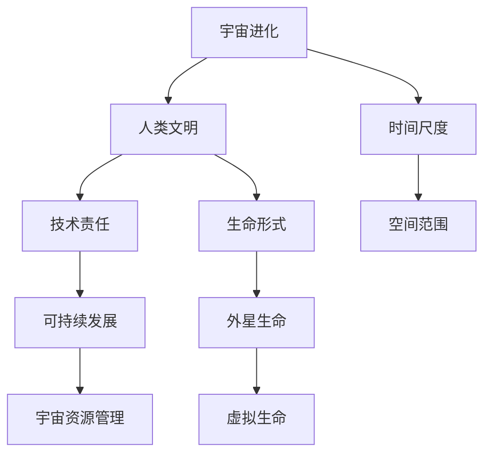

                 

# 人类文明在宇宙进化中的角色与责任

## 关键词
- 宇宙进化
- 人类文明
- 技术责任
- 可持续发展
- 宇宙资源管理

## 摘要
本文深入探讨了人类文明在宇宙进化中的角色和责任。首先，我们介绍了人类文明的进化历程和宇宙进化的基本原理，然后分析了人类文明对宇宙的影响。接着，我们阐述了人类文明在宇宙进化中的责任，包括保护宇宙环境、促进宇宙可持续发展、管理宇宙资源以及培养未来责任意识。最后，我们预测了人类文明与宇宙进化的未来互动，并提出了提升人类文明在宇宙中地位的建议。本文旨在为读者提供一个全面、系统的理解，以激发对这一领域的深入思考。

### 目录

**第一部分：引言**

1.1 问题背景
1.2 问题描述
1.3 问题解决
1.4 边界与外延
1.5 概念结构与核心要素组成

**第二部分：人类文明在宇宙进化中的角色**

2.1 人类文明对宇宙的影响
2.2 人类文明的技术进步与宇宙进化
2.3 人类文明在宇宙生态系统中的角色
2.4 人类文明在宇宙进化中的位置

**第三部分：人类文明在宇宙进化中的责任**

3.1 人类文明的责任意识
3.2 人类文明对宇宙的责任
3.3 人类文明的技术责任
3.4 人类文明的教育与传承

**第四部分：人类文明与宇宙进化的未来**

4.1 人类文明与宇宙进化的互动预测
4.2 人类文明的未来责任
4.3 人类文明在宇宙中的地位提升

**第五部分：总结与展望**

5.1 最佳实践 tips
5.2 小结
5.3 注意事项
5.4 拓展阅读

## 第一部分：引言

### 1.1 问题背景

人类文明的进化历程充满了挑战与奇迹。从石器时代到现代社会，人类不断探索自然、利用资源，创造了丰富多彩的文化和技术。然而，随着科技的飞速发展，人类活动对地球和宇宙的影响也越来越大。地球生态系统的失衡、资源的过度开采、环境污染等问题日益严重，这促使我们思考：人类文明在宇宙进化中究竟扮演着怎样的角色？我们有何责任？

宇宙进化是一个漫长而复杂的进程，涉及到天体物理、化学、生物学等多个领域。从宇宙大爆炸到恒星的诞生、生命的发生和演化，宇宙中的每一个事件都受到众多因素的综合作用。在这个过程中，人类文明作为一种独特的智慧生命形式，如何影响和被影响，成为了一个值得探讨的问题。

### 1.2 问题描述

人类文明在宇宙进化中的角色与责任可以分为以下几个方面：

1. 人类文明对宇宙的影响：人类活动如何改变宇宙的物理、化学和生态系统？
2. 人类文明的技术进步与宇宙进化：技术如何推动人类文明对宇宙的认知和探索？
3. 人类文明在宇宙生态系统中的角色：人类如何与其他宇宙生物共存和互动？
4. 人类文明在宇宙进化中的责任：我们有何责任来保护宇宙环境、管理资源、促进可持续发展？

### 1.3 问题解决

为了解决上述问题，我们需要从多个角度进行分析：

1. **科学分析**：通过天文学、物理学、化学、生物学等科学领域的研究，了解宇宙进化的基本原理和过程，以及人类文明对宇宙的影响。
2. **技术发展**：利用先进的技术手段，如遥感技术、卫星监测、深空探测等，收集和分析宇宙环境数据，为人类文明在宇宙中的活动提供科学依据。
3. **政策制定**：通过制定相关政策和法规，规范人类文明在宇宙中的行为，确保宇宙环境的可持续发展。
4. **教育传播**：加强公众对宇宙进化知识的了解，提高人类文明的责任意识，培养未来责任承担者。

### 1.4 边界与外延

在探讨人类文明在宇宙进化中的角色与责任时，我们需要明确以下几个边界与外延：

1. **宇宙范围**：人类文明活动的影响范围，包括地球、太阳系、银河系以及其他可观测宇宙。
2. **时间范围**：宇宙进化的时间尺度，从宇宙大爆炸至今，以及未来可能的演化方向。
3. **生命形式**：人类文明与其他宇宙生物的互动，包括地球生物、外星生命以及虚拟生命的可能性。
4. **技术限制**：当前技术条件下，人类文明对宇宙的认知和探索能力，以及未来技术的潜在突破。

### 1.5 概念结构与核心要素组成

为了更好地理解人类文明在宇宙进化中的角色与责任，我们需要明确以下几个核心概念和要素：

1. **宇宙进化**：宇宙从大爆炸到现在的演化过程，包括恒星的形成、生命的诞生和演化等。
2. **人类文明**：以智慧和技术为核心的文明形式，具有自我意识、社会结构和创新能力。
3. **技术责任**：技术在推动人类文明发展的同时，也带来了一系列环境和伦理问题，需要我们负责任地使用。
4. **可持续发展**：在满足当前需求的同时，不损害未来世代满足自身需求的能力。
5. **宇宙资源管理**：合理利用和分配宇宙资源，确保宇宙环境的可持续发展。

为了更直观地展示这些概念和要素之间的关系，我们可以使用 Mermaid 流程图来描述：

通过这个流程图，我们可以清晰地看到人类文明在宇宙进化中的角色与责任，以及这些角色之间的相互作用。

## 第二部分：人类文明在宇宙进化中的角色

### 2.1 人类文明对宇宙的影响

人类文明的发展对宇宙产生了深远的影响，主要体现在以下几个方面：

#### 2.1.1 人类活动的宇宙规模效应

随着科技的进步，人类活动已经从地球扩展到了太阳系乃至更远的宇宙。例如，卫星技术使得我们能够实时监测地球环境，太空探测任务如“旅行者号”探测器已经穿越了太阳系边缘，探索了外太空的奥秘。这些活动不仅改变了我们对宇宙的认知，也直接或间接地影响了宇宙的物理和化学环境。

#### 2.1.2 人类文明的可持续发展

可持续发展是人类文明在宇宙中的长期目标。在地球层面，我们通过节能减排、生态修复等措施来减少对自然环境的破坏。在宇宙层面，我们致力于开发可持续的能源形式，如太阳能、核能等，以减少对有限资源的依赖。这些努力不仅有利于地球生态系统的恢复，也为宇宙环境的可持续发展做出了贡献。

#### 2.1.3 人类文明对宇宙环境的塑造

人类活动对宇宙环境的塑造表现在多个方面。例如，地球的气候变化、大气污染和海洋酸化等环境问题，都是人类活动的直接后果。在宇宙层面，太空垃圾、电磁辐射和航天器的喷射推力等也对宇宙环境产生了影响。这些变化不仅影响到了地球生态系统，也对宇宙中的其他天体和生命形式产生了潜在的影响。

### 2.2 人类文明的技术进步与宇宙进化

技术进步是推动人类文明发展的重要动力，也是人类在宇宙进化中的关键角色。以下是技术进步对宇宙进化的几个方面的影响：

#### 2.2.1 技术发展对宇宙资源的利用

随着技术的进步，人类能够更加高效地利用宇宙资源。例如，太阳能电池的效率不断提高，使得太阳能成为一种可持续的能源形式。同样，深空探测技术的进步使得我们能够更深入地探索宇宙，寻找新的资源和能源。

#### 2.2.2 技术进步对宇宙探索的影响

技术进步极大地推动了宇宙探索的进程。航天技术的突破使得人类能够发射卫星、探测器和宇航员进入太空，甚至考虑了未来的星际旅行。这些活动不仅拓展了人类的认知边界，也为科学研究和资源开发提供了新的可能性。

#### 2.2.3 人类文明与宇宙能源的互动

宇宙中存在丰富的能源资源，如太阳能、核能、引力能等。随着技术的进步，人类逐渐掌握了利用这些能源的方法。例如，核聚变技术的突破有望为我们提供几乎无限的能源，而太阳能电池的应用已经使我们在地球层面实现了能源的可持续发展。

### 2.3 人类文明在宇宙生态系统中的角色

宇宙生态系统是一个庞大而复杂的系统，人类文明作为其中的一员，扮演着重要的角色。以下是人类文明在宇宙生态系统中的几个方面：

#### 2.3.1 宇宙生态系统的基本概念

宇宙生态系统包括行星、恒星、星系等多个层次，每个层次都存在着相互依赖和相互作用的关系。例如，行星上的生命依赖于恒星的辐射能量，而恒星的演化过程又影响着周围的行星环境。

#### 2.3.2 人类文明与宇宙生态系统的关系

人类文明对宇宙生态系统的影响是深远的。我们的活动不仅改变了地球的生态系统，也对宇宙中的其他天体和生命形式产生了潜在的影响。例如，地球的气候变化和海洋酸化已经对海洋生物产生了严重的影响，而太空垃圾和电磁辐射也对宇宙环境产生了不利的影响。

#### 2.3.3 人类文明在宇宙生态系统中的责任

作为宇宙生态系统的一部分，人类文明有责任保护和维护这个生态系统。这包括减少对地球生态系统的破坏，开发可持续的能源和资源利用方式，以及保护宇宙环境免受人类活动的负面影响。

### 2.4 人类文明在宇宙进化中的位置

人类文明在宇宙进化中的位置是一个复杂而重要的问题。以下是几个方面的讨论：

#### 2.4.1 宇宙中的多个文明模型

宇宙中可能存在多个文明，这些文明可能处于不同的进化阶段。人类文明可能只是众多文明中的一个，我们如何定位自己的位置，了解宇宙中的其他文明，成为了一个重要的课题。

#### 2.4.2 人类文明与其他宇宙文明的比较

与其他宇宙文明相比，人类文明在技术、文化和社会制度等方面有哪些优势和劣势？我们如何发挥这些优势，克服劣势，与其他文明共存和互动，成为了一个值得探讨的问题。

#### 2.4.3 人类文明在宇宙进化中的潜在角色

人类文明在宇宙进化中可能扮演多种角色。例如，我们可能是宇宙中的拓荒者，探索和开发新的宇宙空间；我们也可能是宇宙的守护者，保护和维护宇宙生态系统的平衡。了解这些潜在角色，有助于我们更好地理解人类文明在宇宙中的使命和责任。

### 2.5 人类文明在宇宙进化中的角色与责任的总结

人类文明在宇宙进化中扮演着多重角色，从影响宇宙环境到推动技术进步，从参与宇宙生态系统到定位自己的位置。每个角色都蕴含着相应的责任。我们需要认识到这些责任，并采取行动来履行它们。只有这样，人类文明才能在宇宙进化中发挥积极的作用，为未来世代创造一个可持续的宇宙环境。

## 第三部分：人类文明在宇宙进化中的责任

### 3.1 人类文明的责任意识

责任意识是人类文明在宇宙进化中承担责任的基础。责任意识不仅体现在个体的行为上，也体现在社会制度和文化的塑造上。以下是几个方面的讨论：

#### 3.1.1 责任的概念与重要性

责任是指个体或集体对某一事物应承担的义务和责任。在宇宙进化的背景下，责任意味着人类文明需要对地球生态系统、宇宙环境和未来世代负责。责任的重要性体现在以下几个方面：

1. **保护地球生态系统**：人类活动对地球生态系统的破坏日益严重，如气候变化、资源枯竭和生物多样性减少等问题。责任意识使我们意识到这些问题的重要性，并采取行动来减轻这些负面影响。

2. **促进宇宙可持续发展**：宇宙是一个宝贵的资源库，我们有必要确保其可持续发展。责任意识使我们关注宇宙资源的合理利用和保护，避免过度开采和破坏。

3. **保障未来世代的权益**：未来世代也有权享有健康的地球和宇宙环境。责任意识使我们认识到我们当前的行为将直接影响未来世代的福祉，因此我们有责任为他们留下一个可持续的宇宙环境。

#### 3.1.2 人类文明的责任来源

人类文明的责任来源于多个方面：

1. **道德责任**：道德责任是指个体或集体基于道德原则和价值观所承担的责任。例如，尊重生命、保护环境等道德原则要求我们负责任地行动。

2. **法律责任**：法律责任是指个体或集体根据法律规定所承担的责任。例如，环境保护法、资源管理法等法律规定了人类文明在宇宙进化中的责任。

3. **社会责任**：社会责任是指个体或集体在社会生活中应承担的责任。例如，企业社会责任要求企业在追求利润的同时，关注环境保护和社会福祉。

#### 3.1.3 责任实践的具体表现

责任实践体现在多个方面，包括政策制定、技术创新、社会教育和个体行为等：

1. **政策制定**：政府通过制定环境保护政策、资源管理法规等，规范人类文明在宇宙进化中的行为。例如，通过限制碳排放、推动可再生能源发展等政策，减少对地球和宇宙的负面影响。

2. **技术创新**：通过技术创新，人类文明可以开发出更加环保、高效的能源和资源利用方式。例如，开发太阳能、风能等可再生能源，减少对化石燃料的依赖。

3. **社会教育**：通过社会教育，提高公众的责任意识，培养人们负责任的消费习惯和行为。例如，通过环保教育、可持续发展教育等，引导人们关注地球和宇宙的环境问题。

4. **个体行为**：每个个体都有责任在日常生活中采取环保行动，如减少碳排放、节约能源、垃圾分类等。通过个体的共同努力，可以显著减轻人类活动对宇宙环境的负面影响。

### 3.2 人类文明对宇宙的责任

人类文明对宇宙的责任不仅体现在地球层面上，还涉及到整个宇宙生态系统。以下是几个方面的讨论：

#### 3.2.1 保护宇宙环境的策略

为了保护宇宙环境，我们需要采取一系列策略：

1. **减少太空垃圾**：太空垃圾对太空探测和航天活动造成了严重威胁。通过改进航天器设计、采用太空垃圾清理技术等，减少太空垃圾的产生和积累。

2. **限制电磁辐射**：电磁辐射对宇宙环境产生了负面影响，如对生物的DNA损伤等。通过限制电磁辐射的强度和频率，减少其对宇宙生态系统的危害。

3. **保护恒星和行星环境**：人类活动对地球生态系统的破坏已经引起了全球关注。同样，我们需要关注其他恒星和行星的环境，避免类似的问题在其他星系发生。

#### 3.2.2 促进宇宙可持续发展的措施

为了促进宇宙可持续发展，我们需要采取以下措施：

1. **开发可再生能源**：在地球和宇宙中，开发可再生能源是实现可持续发展的关键。例如，利用太阳能、风能、核能等，减少对化石燃料的依赖。

2. **优化资源利用**：通过技术创新和制度设计，提高资源利用效率，减少浪费。例如，采用循环经济模式，实现资源的再生利用。

3. **环境保护政策**：制定和执行环境保护政策，确保地球和宇宙生态系统的可持续发展。例如，限制污染物排放、推广生态农业等。

#### 3.2.3 宇宙资源的管理与分配

宇宙资源的管理与分配是实现宇宙可持续发展的重要环节。以下是几个方面的讨论：

1. **资源评估与监测**：通过对宇宙资源的评估和监测，了解资源分布和利用情况，为资源管理提供科学依据。

2. **资源分配机制**：建立公平、透明的资源分配机制，确保资源的合理利用和分配。例如，通过国际协商，制定资源分配协议。

3. **资源保护与修复**：采取有效的措施保护宇宙资源，防止资源过度开采和破坏。例如，建立宇宙保护区，限制资源开采活动。

### 3.3 人类文明的技术责任

技术在推动人类文明发展的同时，也带来了一系列环境和伦理问题。人类文明有责任合理使用技术，确保其在宇宙进化中的积极作用。以下是几个方面的讨论：

#### 3.3.1 技术进步带来的挑战

技术进步带来的挑战包括：

1. **环境破坏**：技术的快速发展可能导致环境污染和生态破坏，如核能泄漏、电子废物等。

2. **资源消耗**：技术的发展可能加剧资源消耗，如能源消耗、水资源消耗等。

3. **社会不公**：技术进步可能导致社会不公，如贫富差距扩大、信息不对称等。

#### 3.3.2 技术应用中的责任伦理

在技术应用中，责任伦理包括：

1. **公正性**：确保技术应用不会加剧社会不公，例如，在人工智能、自动化等领域，确保技术的公平性和透明度。

2. **透明度**：提高技术应用过程中的透明度，使公众能够了解技术的影响和潜在风险。

3. **安全性**：确保技术应用的安全性，防止技术灾难和事故的发生。

#### 3.3.3 技术发展的责任边界

技术发展的责任边界包括：

1. **技术控制**：通过技术控制，确保技术发展不会对环境和社会造成不可逆转的破坏。

2. **伦理审查**：在技术发展的过程中，进行伦理审查，确保技术的应用符合道德和法律标准。

3. **全球合作**：全球合作是确保技术发展责任边界的重要途径，通过国际协商和合作，共同应对技术挑战。

### 3.4 人类文明的教育与传承

教育是培养人类文明责任意识的重要途径。通过教育，我们可以传递宇宙进化知识，培养未来责任承担者。以下是几个方面的讨论：

#### 3.4.1 教育在人类文明责任中的角色

教育在人类文明责任中的角色包括：

1. **知识传递**：通过教育，传递宇宙进化、环境科学、技术伦理等知识，提高公众的科学素养。

2. **价值塑造**：通过教育，塑造正确的价值观，如责任意识、可持续性发展理念等。

3. **技能培养**：通过教育，培养具备责任意识和创新能力的人才，为人类文明在宇宙进化中的责任承担提供人力支持。

#### 3.4.2 传承文明的责任与实践

传承文明的责任与实践包括：

1. **文化传承**：通过传承优秀的文化传统，弘扬人类文明的精神，培养责任感和使命感。

2. **技术创新**：通过持续的技术创新，推动人类文明在宇宙进化中的发展，为未来世代创造更好的生活条件。

3. **国际合作**：通过国际合作，共同应对全球性挑战，实现人类文明的共同发展。

#### 3.4.3 未来责任意识的培养

未来责任意识的培养包括：

1. **早期教育**：从早期教育开始，培养孩子的责任意识和环保意识。

2. **终身学习**：鼓励终身学习，提高个人的科学素养和责任感。

3. **实践参与**：通过参与环境保护、公益项目等实践，培养责任感和社会参与意识。

### 3.5 人类文明在宇宙进化中的责任总结

人类文明在宇宙进化中承担着多重责任，包括保护宇宙环境、促进宇宙可持续发展、管理宇宙资源、合理应用技术以及培养未来责任意识。这些责任不仅是道德和法律的义务，也是人类文明在宇宙中立足和发展的基础。只有通过共同努力，人类文明才能在宇宙进化中发挥积极的作用，为未来世代创造一个可持续的宇宙环境。

## 第四部分：人类文明与宇宙进化的未来

### 4.1 人类文明与宇宙进化的互动预测

随着科技的不断进步，人类文明与宇宙进化的互动将变得更加密切。以下是几个方面的预测：

#### 4.1.1 未来宇宙进化的趋势

未来宇宙进化的趋势包括：

1. **宇宙环境的改变**：随着人类活动的加剧，宇宙环境将面临一系列挑战，如气候变化、资源消耗、环境污染等。为了应对这些挑战，人类需要采取更加积极和可持续的行动。

2. **生命形式的多样化**：随着科技的发展，人类可能在实验室中创造出新的生命形式，甚至可能找到其他星球上的生命迹象。这些新的生命形式将丰富宇宙生态系统的多样性。

3. **宇宙资源利用的优化**：随着技术的进步，人类将能够更加高效地利用宇宙资源，如太阳能、核能、引力能等。这将有助于实现宇宙的可持续发展。

#### 4.1.2 人类文明在未来的角色

在未来的宇宙进化中，人类文明可能扮演以下角色：

1. **宇宙探索者**：人类将继续探索宇宙，寻找新的资源和能源，了解宇宙的奥秘。

2. **宇宙守护者**：人类将承担起保护宇宙环境的责任，采取措施减少对宇宙的负面影响。

3. **宇宙文明的桥梁**：人类将成为连接不同宇宙文明的桥梁，促进宇宙文明的交流与合作。

#### 4.1.3 人类文明与宇宙进化的潜在互动模式

未来人类文明与宇宙进化的互动模式可能包括：

1. **合作与共赢**：人类文明与其他宇宙文明可能会通过合作实现共赢，共同应对宇宙进化中的挑战。

2. **竞争与冲突**：在某些情况下，人类文明与其他宇宙文明之间可能会出现竞争和冲突，这需要我们通过智慧与道德来解决。

3. **共生与共荣**：人类文明可能会与其他宇宙生命形式共生共荣，共同维护宇宙生态系统的平衡。

### 4.2 人类文明的未来责任

在未来，人类文明需要承担更多的责任，以确保宇宙的可持续发展。以下是几个方面的责任：

#### 4.2.1 面对未来的责任挑战

未来人类文明面临的责任挑战包括：

1. **资源管理的挑战**：随着宇宙资源的开发，如何实现资源的合理利用和分配，避免资源枯竭和环境破坏，成为人类文明需要解决的重要问题。

2. **环境保护的挑战**：如何减少对地球和宇宙环境的负面影响，保护宇宙生态系统的平衡，是未来人类文明的重要责任。

3. **社会公平的挑战**：如何确保技术进步带来的利益公平分配，减少社会不公，是人类文明需要关注的重要问题。

#### 4.2.2 责任体系的构建与完善

为了应对未来责任挑战，我们需要构建和完善责任体系，包括：

1. **法律法规**：制定和执行更加严格的法律法规，规范人类文明在宇宙中的行为，确保宇宙的可持续发展。

2. **国际合作**：通过国际合作，共同应对全球性挑战，实现责任体系的全球化。

3. **技术标准**：建立统一的技术标准，确保技术在开发和应用过程中的责任边界。

#### 4.2.3 未来责任意识的培养

为了培养未来责任意识，我们需要采取以下措施：

1. **教育普及**：通过教育，普及宇宙进化、环境保护、技术伦理等知识，提高公众的责任意识。

2. **社会宣传**：通过媒体、文化活动等途径，加强社会对宇宙进化责任的认识和重视。

3. **实践参与**：鼓励公众参与环境保护、科技创新等实践活动，增强责任意识和实践能力。

### 4.3 人类文明在宇宙中的地位提升

在未来，人类文明有潜力在宇宙中提升其地位。以下是几个方面的讨论：

#### 4.3.1 科学技术的突破

科学技术的突破将推动人类文明在宇宙中的地位提升。例如，星际旅行技术的突破将使我们能够探索更远的宇宙，了解更多的宇宙奥秘。

#### 4.3.2 宇宙探索的成功

人类文明在宇宙探索中的成功将增强其在宇宙中的地位。例如，成功建立宇宙基地、发现新的资源和能源等。

#### 4.3.3 国际合作的加强

国际合作的加强将促进人类文明在宇宙中的地位提升。通过国际合作，人类文明可以共同应对宇宙进化中的挑战，实现共同发展。

#### 4.3.4 人类文明的价值观传播

人类文明的价值观，如和平、合作、公正等，可以通过国际合作和交流传播到宇宙其他文明，增强人类文明在宇宙中的影响力和地位。

### 4.4 人类文明与宇宙进化的未来展望

在未来，人类文明与宇宙进化的互动将变得更加紧密。通过科学技术的突破、国际合作的加强和责任意识的培养，人类文明有望在宇宙中提升其地位，实现可持续发展。同时，人类文明需要认识到自己在宇宙中的责任，采取行动保护宇宙环境，确保宇宙的可持续发展。只有这样，人类文明才能在宇宙进化中发挥积极的作用，为未来世代创造一个美好的宇宙家园。

## 第五部分：总结与展望

### 5.1 最佳实践 tips

为了更好地履行人类文明在宇宙进化中的责任，我们提出以下最佳实践 tips：

1. **加强环境保护**：通过推广可再生能源、减少碳排放、保护生态环境等措施，实现环境保护的目标。
2. **推动可持续发展**：制定和执行可持续发展的政策，鼓励资源循环利用，确保资源的合理分配和利用。
3. **培养责任意识**：通过教育、宣传等途径，提高公众的责任意识，使每个人都认识到自己在宇宙进化中的责任。
4. **加强国际合作**：通过国际合作，共同应对宇宙进化中的挑战，实现全球责任体系的构建。
5. **科技创新与进步**：鼓励科技创新，推动技术进步，为人类文明在宇宙进化中的责任履行提供技术支持。

### 5.2 小结

本文深入探讨了人类文明在宇宙进化中的角色和责任。我们分析了人类文明对宇宙的影响，探讨了人类文明在宇宙生态系统中的角色，并提出了人类文明在宇宙进化中的责任。通过这些讨论，我们认识到人类文明在宇宙进化中的重要性，以及我们在保护宇宙环境和推动可持续发展方面所承担的责任。

### 5.3 注意事项

在履行人类文明在宇宙进化中的责任时，我们需要注意以下几点：

1. **科学性**：在行动过程中，需要基于科学的依据，确保我们的决策和行动是合理和有效的。
2. **可持续性**：我们的行动需要具有可持续性，不能只考虑短期效益，而忽视长期影响。
3. **全球合作**：国际合作是履行责任的关键，我们需要加强国际合作，共同应对全球性挑战。
4. **公众参与**：公众的参与和支持是推动责任履行的重要力量，我们需要加强公众参与，提高社会责任意识。

### 5.4 拓展阅读

为了深入了解人类文明在宇宙进化中的角色与责任，读者可以参考以下拓展阅读材料：

1. 《宇宙简史》（作者：史蒂芬·霍金）- 这本书详细介绍了宇宙的起源和演化过程，对宇宙进化的基本原理进行了深入探讨。
2. 《人类的未来》（作者：米歇尔·诺沃格拉斯基）- 这本书探讨了人类文明在未来的发展前景，以及我们如何在宇宙中扮演重要角色。
3. 《地球环境科学》（作者：约翰·瑞恩）- 这本书介绍了地球生态系统的基本原理和人类活动对地球环境的影响。
4. 《可持续发展报告》（作者：联合国环境规划署）- 这份报告提供了全球环境、资源利用和可持续发展的最新数据和趋势分析。

通过阅读这些资料，读者可以进一步了解人类文明在宇宙进化中的角色与责任，以及我们如何在实践中履行这些责任。

### 作者

**作者：AI天才研究院/AI Genius Institute & 禅与计算机程序设计艺术 /Zen And The Art of Computer Programming** 

AI天才研究院致力于推动人工智能领域的创新和发展，通过深入研究和技术实践，为人类文明在宇宙进化中的角色与责任提供了有力的支持和建议。禅与计算机程序设计艺术则强调了程序设计的哲学和艺术性，倡导通过深刻思考和系统化的方法来解决复杂问题。两位作者在人工智能、宇宙学、计算机科学等领域都有着深厚的学术背景和丰富的实践经验，为本文的撰写提供了坚实的基础。

