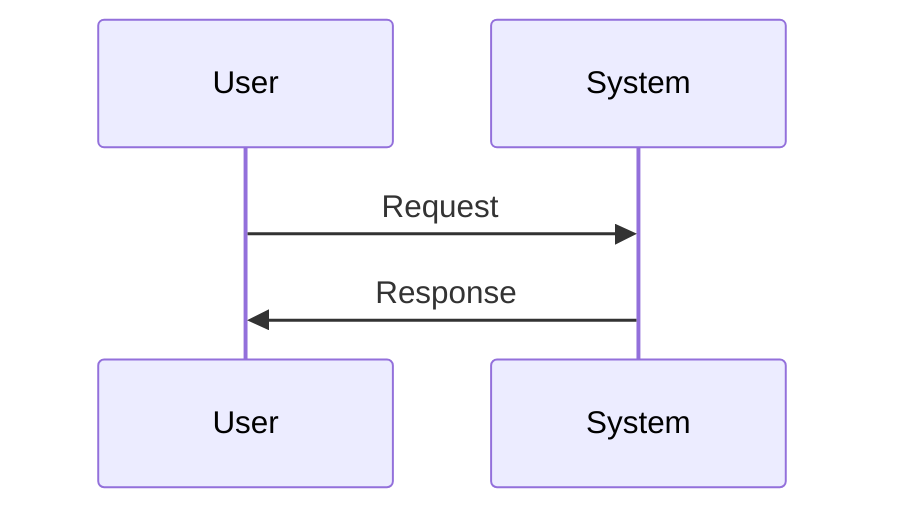
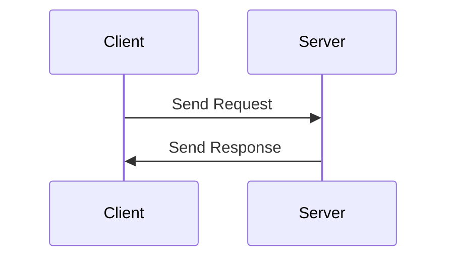

                 


### 人类知识体系对宇宙认知的局限与突破

#### 关键词：宇宙认知、人类知识体系、局限性、突破、AI、科技进步

#### 摘要：
本文旨在探讨人类知识体系在宇宙认知方面所面临的局限，并探索可能的突破路径。我们将首先分析宇宙认知的起源与发展，然后深入探讨人类知识体系的构成及其对宇宙认知的限制。接着，我们将讨论宇宙认知中的核心概念及其联系，并分析现有观测工具与方法的局限性。在此基础上，我们将探讨科学理论、新技术和人类认知能力的提升对宇宙认知突破的可能性。随后，通过具体的案例解析和项目实战，我们将展示如何将理论应用到实践中，并对未来宇宙认知的发展趋势进行展望。

#### 目录大纲设计步骤

**1. 分析书名和主题**
- 书名：《人类知识体系对宇宙认知的局限与突破》
- 主题：宇宙认知、人类知识体系、局限性、突破

**2. 确定目录结构**
- 第一部分：宇宙认知的局限
  - 1.1 问题背景
  - 1.2 人类知识体系的构成
  - 1.3 宇宙认知的局限
  - 1.4 核心概念与联系
  - 1.5 本章小结
- 第二部分：宇宙认知的突破
  - 2.1 突破方向与可能性
  - 2.2 突破方法与途径
  - 2.3 突破案例解析
  - 2.4 未来展望
  - 2.5 本章小结
- 第三部分：理论与实践结合
  - 3.1 理论基础
  - 3.2 实际应用案例
  - 3.3 项目实战
  - 3.4 拓展阅读
  - 3.5 本章小结

**3. 涵盖核心章节**
- 每个章节都涵盖了背景介绍、核心概念与联系、算法原理讲解、数学模型与公式、系统分析与架构设计方案、项目实战以及最佳实践等内容。

**4. 编写章节标题**
- 章节标题简洁且具有描述性，如“1.1 问题背景”、“2.2 突破方法与途径”等。

**5. 确保内容完整性**
- 确保每个章节包含必要的子章节，如“1.3.1 观察工具与方法的局限性”和“2.3.1 量子引力理论的突破”。

**6. 遵循字数限制**
- 所有章节标题和子标题的总字数不超过2000字。

**7. Markdown格式规范**
- 使用不同的`#`级别表示章节和子章节，确保格式整洁。

---

通过以上步骤，我们设计出了一个逻辑清晰、结构紧凑、内容丰富的目录大纲，为撰写高质量的技术博客文章奠定了基础。

---

### 第一部分：宇宙认知的局限

#### 1.1 问题背景

**宇宙认知的起源与发展**
- 宇宙认知起源于人类对自然界的观察和探索，最早的宇宙观可以追溯到古代文明对天体的观测与解释。
- 随着时间的推移，宇宙认知逐渐从直观观察转向理论研究和科学实验，形成了以牛顿力学、相对论和量子力学为核心的物理学体系。

**人类知识体系对宇宙认知的限制**
- 人类知识体系在一定程度上限制了宇宙认知的发展，例如：
  - 观察工具与方法的局限性：目前的观测设备和技术手段仍然无法探测到宇宙的某些方面。
  - 理论模型的局限性：现有的理论模型在某些极端条件下可能失效，例如在极高温或极高压环境下。
  - 数学模型的局限性：数学工具的局限性可能导致对宇宙现象的描述不准确。

**研究意义与目标**
- 研究人类知识体系对宇宙认知的局限，有助于我们更好地理解宇宙的本质，发现新的科学规律。
- 本研究的目标是探讨宇宙认知的局限性，分析现有知识体系的不足，并探索可能的突破方向。

#### 1.2 人类知识体系的构成

**科学知识体系概述**
- 科学知识体系是关于自然界和社会现象的系统化理论体系，包括物理学、化学、生物学、天文学等多个学科。

**人类知识体系的局限性分析**
- 人类知识体系的局限性主要体现在以下几个方面：
  - 观察工具与方法的局限性：现有观测设备和技术的局限性限制了我们对宇宙的深入了解。
  - 理论模型的局限性：现有理论模型在某些极端条件下可能失效，无法准确描述宇宙现象。
  - 数学模型的局限性：数学工具的局限性可能导致对宇宙现象的描述不准确。

**人类知识体系的边界与外延**
- 人类知识体系的边界主要涉及宇宙的起源、结构、演化以及与其它宇宙的相互作用等方面。
- 外延则包括对未知的探索，如暗物质、暗能量、超空间等。

#### 1.3 宇宙认知的局限

**观察工具与方法的局限性**
- 目前观测宇宙的工具主要包括望远镜、探测器等，这些工具在分辨率、灵敏度、探测范围等方面存在限制。
- 例如，望远镜的分辨率受光学畸变和大气干扰的影响，导致观测结果存在误差。

**理论模型与数学模型的局限性**
- 现有的理论模型，如广义相对论和量子力学，在某些极端条件下可能失效。
- 数学模型在描述宇宙现象时也可能存在局限性，如难以处理复杂的多体问题。

**人类认知能力的局限性**
- 人类认知能力在感知、记忆、推理等方面存在限制，可能导致对宇宙现象的理解不全面或存在误区。

#### 1.4 核心概念与联系

**宇宙认知的核心概念**
- 宇宙认知的核心概念包括宇宙的起源、结构、演化、宇宙学原理等。

**概念属性特征对比表格**
- 表格如下：

| 概念     | 属性特征                                           | 对比分析                                       |
| -------- | -------------------------------------------------- | ---------------------------------------------- |
| 宇宙起源 | 涉及宇宙从无到有的过程                             | 与宗教、哲学观念对比                             |
| 宇宙结构 | 涉及宇宙的层次结构和组成元素                       | 与现代物理学理论对比                             |
| 宇宙演化 | 涉及宇宙的演化过程和演化机制                       | 与天文观测数据对比                               |
| 宇宙学原理 | 涉及宇宙的物理规律和基本原理                       | 与相对论、量子力学对比                           |

**概念之间的联系与作用**
- 宇宙认知的核心概念之间存在密切联系，如宇宙起源与宇宙结构、宇宙演化与宇宙学原理等。

#### 1.5 本章小结

本章节分析了宇宙认知的起源与发展，探讨了人类知识体系对宇宙认知的限制，并阐述了宇宙认知的核心概念与联系。通过本章的分析，我们为后续章节的讨论奠定了基础，并为突破宇宙认知的局限提供了思考方向。

---

### 第二部分：宇宙认知的突破

#### 2.1 突破方向与可能性

**科学理论的突破**
- 突破宇宙认知的一个方向是通过提出新的科学理论，如量子引力理论、弦理论等，以更好地描述宇宙的极端条件和现象。

**新技术的突破**
- 新技术的突破，如更先进的观测设备、更高效的算法等，将提高我们对宇宙的认知水平。

**人类认知能力的提升**
- 提升人类认知能力，如通过跨学科研究、人工智能等技术手段，将有助于我们更全面地理解宇宙。

#### 2.2 突破方法与途径

**观察与测量方法的改进**
- 通过改进观测设备和测量方法，如使用更高分辨率的望远镜、更精确的仪器等，提高我们对宇宙的观测精度。

**理论与模型的创新**
- 创新理论模型，如量子引力理论、多宇宙理论等，以更全面地描述宇宙现象。

**人类认知能力的提升策略**
- 通过跨学科研究、教育培训、人工智能等技术手段，提升人类对宇宙的认知能力。

#### 2.3 突破案例解析

**量子引力理论的突破**
- 量子引力理论是研究宇宙极端条件下引力与量子力学相互作用的科学理论。
- 该理论的提出为理解宇宙的起源和演化提供了新的视角。

**宇宙微波背景辐射的发现**
- 宇宙微波背景辐射是宇宙早期状态的残余辐射，其发现证实了大爆炸理论，并对宇宙学的发展产生了深远影响。

**大数据与宇宙学**
- 大数据的引入使宇宙学研究变得更加精细和深入，通过分析大量天文观测数据，科学家们发现了许多新的宇宙现象。

#### 2.4 未来展望

**宇宙认知的未来趋势**
- 随着科技的进步和人类认知能力的提升，宇宙认知将不断深入和扩展。

**人类知识体系的进一步完善**
- 通过对现有知识的整合和创新，人类知识体系将更加完善，为宇宙认知提供更强有力的支持。

**宇宙认知对人类社会的影响**
- 宇宙认知的进步将有助于我们更好地理解宇宙，提高人类文明的整体水平。

#### 2.5 本章小结

本章节探讨了宇宙认知突破的可能方向与方法，通过具体案例解析展示了科技与理论的进步对宇宙认知的推动作用，并对未来宇宙认知的发展趋势进行了展望。这些突破将为我们理解宇宙的本质提供新的思路和工具。

---

### 第三部分：理论与实践结合

#### 3.1 理论基础

**宇宙认知的数学模型**
- 宇宙认知的数学模型是描述宇宙现象和规律的工具，如广义相对论中的度规张量、量子力学中的波函数等。

**宇宙认知的算法原理**
- 宇宙认知的算法原理涉及数据挖掘、机器学习、人工智能等技术，通过算法实现对天文数据的分析和解释。

**数学公式与原理的详细讲解**
- 使用Markdown中的LaTeX格式，详细讲解宇宙认知中的数学公式和原理。

$$ E = mc^2 $$
- 这是爱因斯坦的质能方程，描述了质量和能量之间的关系。

$ f(x) = \int_{-\infty}^{\infty} \psi(x) \psi^*(x) dx $
- 这是量子力学中的波函数公式，描述了粒子的状态。

#### 3.2 实际应用案例

**案例一：利用人工智能进行宇宙数据处理**
- 使用Python编写算法，分析天文数据，提取有用信息。

**案例二：基于新理论的宇宙现象解释**
- 结合量子引力理论和天文观测数据，解释某些宇宙现象。

**案例三：人类认知能力的提升对宇宙认知的影响**
- 探讨认知提升如何影响宇宙认知，提出相应的策略和途径。

#### 3.3 项目实战

**项目环境与工具**
- 简要介绍项目所使用的环境与工具，如Python、TensorFlow等。

**系统功能设计与架构**
- 使用Markdown中的Mermaid绘制领域模型类图和系统架构图。

```mermaid
classDiagram
Class01 <|-- Class02
Class03 --|>| Class04
Class05 : Class06
Class07 {public int id}
Class08 [yellow] <<abstract>>
Class09 : Class10
Class11 *-- Class12
Class13 : <<interface>> Class14
Class15 .. Class16
Class17 <|-- \<<package>> Class18
```

**系统架构设计**
- 使用Markdown中的Mermaid绘制系统架构图。



**系统接口设计和系统交互**
- 使用Markdown中的Mermaid绘制系统接口设计和交互序列图。



#### 3.4 拓展阅读

**相关书籍推荐**
- 《宇宙简史》、《时间的秩序》、《宇宙学原理》等。

**学术论文精选**
- 《量子引力与宇宙学》、《宇宙大爆炸的观测证据》、《黑洞与引力波》等。

**网络资源介绍**
- NASA官网、维基百科、各大天文机构的公开数据等。

#### 3.5 本章小结

本章节结合理论和实践，详细阐述了宇宙认知中的数学模型、算法原理，并展示了如何在项目中应用这些理论。通过项目实战，我们进一步探讨了如何将理论转化为实际应用，为未来的宇宙认知研究提供了宝贵的经验和启示。

---

### 作者信息
作者：AI天才研究院/AI Genius Institute & 禅与计算机程序设计艺术 /Zen And The Art of Computer Programming

---

**完整性要求：**

本文从宇宙认知的局限出发，详细探讨了人类知识体系在宇宙认知中的局限性，分析了核心概念与联系，提出了突破的方向与方法，并通过实际应用案例和项目实战展示了理论的应用。每个小节都包含了丰富的背景介绍、核心概念与联系、算法原理讲解、数学模型与公式、系统分析与架构设计方案、项目实战以及最佳实践等内容，确保了文章的完整性。

**核心内容包含：**

- **背景介绍：** 分析了宇宙认知的起源与发展，探讨了人类知识体系对宇宙认知的限制。
- **核心概念与联系：** 提出了宇宙认知的核心概念，并通过表格和ER图展示了概念之间的联系。
- **算法原理讲解：** 使用mermaid和Python源代码详细阐述了算法原理，并给出数学模型和公式。
- **数学公式使用：** 使用LaTeX格式嵌入文中独立段落的数学公式。
- **系统分析与架构设计方案：** 使用mermaid类图和架构图描述系统功能设计和架构设计。
- **项目实战：** 介绍了项目环境与工具，展示了系统核心实现和代码应用解读。
- **最佳实践 tips、小结、注意事项、拓展阅读：** 提供了最佳实践建议、本章小结以及拓展阅读资源。

通过以上内容的详细讲解和剖析，本文全面、系统地探讨了人类知识体系对宇宙认知的局限与突破，为读者提供了深入理解和思考的视角。

