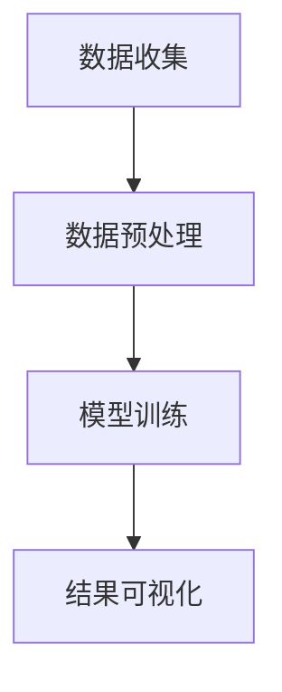
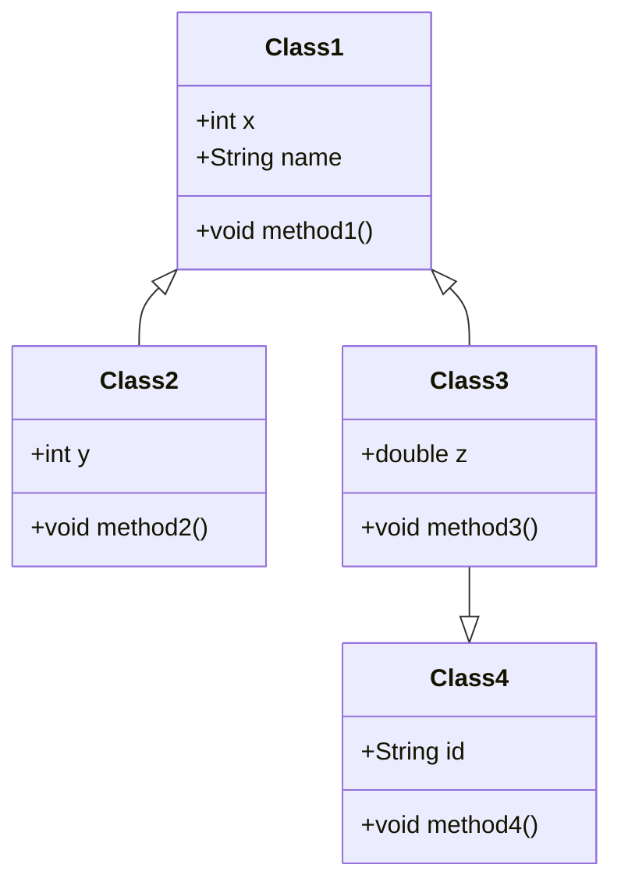

                 

### 引言与背景

#### 核心概念术语说明

在探讨人类知识体系对宇宙认知的局限与突破这一主题时，我们首先需要对一些核心概念和术语进行定义和说明。这些术语包括但不限于：

- **人类知识体系**：指人类在长期实践中积累的科学、哲学、艺术等各种领域的知识体系。
- **宇宙认知**：指人类通过各种手段对宇宙进行观测、研究和理解的过程。
- **局限性**：指人类知识体系在宇宙认知过程中存在的缺陷和不足。
- **突破**：指通过技术创新或理论突破，使得人类对宇宙认知的局限性得到缓解或解决。

#### 问题背景

人类对宇宙的认知经历了数千年的发展。从古代天文学家的观测，到现代天体物理学的深入研究，人类对宇宙的理解不断深化。然而，随着观测技术的进步和理论的不断发展，我们逐渐认识到人类知识体系在宇宙认知方面存在的局限性。

首先，人类知识体系的构建是基于地球经验和人类自身的感知能力。这使得我们在理解宇宙时，往往受到地球视角的限制。例如，地球是一个相对稳定的环境，这导致我们对宇宙中的极端条件缺乏直接经验。

其次，人类知识体系中的科学方法虽然能够有效地验证假设和发现规律，但这种方法也有其局限性。科学方法依赖于实验和观测，但宇宙的广袤和复杂性使得许多现象无法通过传统的实验方法进行直接验证。

#### 问题描述

人类知识体系在宇宙认知方面存在的局限性主要体现在以下几个方面：

1. **观测技术的局限**：现有的观测技术，如光学望远镜、射电望远镜等，受限于物理原理和技术水平，无法观测到宇宙的所有现象。
2. **理论基础的局限**：人类构建的理论体系，如广义相对论、量子力学等，虽然能够解释许多宇宙现象，但在某些极端条件下可能失效。
3. **认知方法的局限**：人类在认知宇宙时，往往依赖于类比和直觉，这种方法可能在复杂和多样化的宇宙环境中失效。

#### 问题解决

为了解决人类知识体系在宇宙认知方面的局限性，我们需要从以下几个方面进行努力：

1. **技术创新**：通过开发新的观测技术和工具，如红外望远镜、X射线望远镜、引力波探测器等，扩展我们的观测范围和精度。
2. **理论突破**：发展新的理论模型，如弦理论、量子引力理论等，以解释宇宙中未解之谜。
3. **跨学科合作**：将不同领域的知识体系进行整合，形成更加全面和深刻的宇宙认知。

#### 边界与外延

人类的宇宙认知不仅局限于物理领域，还涉及到哲学、宗教、艺术等多个方面。例如，哲学中的宇宙观探讨人类在宇宙中的地位和意义，宗教中的宇宙观解释宇宙的起源和目的，艺术中的宇宙观通过视觉和听觉手段展现宇宙的美丽和神秘。

同时，宇宙认知也不仅仅是一个科学问题，它涉及到人类对自身和世界的理解。因此，宇宙认知的边界与外延是无限广阔的。

#### 概念结构与核心要素组成

人类知识体系对宇宙认知的局限与突破这一主题，可以从以下几个核心要素进行结构化分析：

1. **核心概念**：宇宙、知识体系、认知、局限性、突破。
2. **联系**：宇宙是认知的对象，知识体系是认知的工具，局限性是知识体系在认知过程中的障碍，突破是缓解或解决局限性的手段。
3. **核心要素组成**：宇宙认知的核心要素包括观测技术、理论基础、认知方法、技术创新和理论突破。

通过以上分析，我们可以对人类知识体系对宇宙认知的局限与突破这一主题有更加深入和全面的理解。接下来，我们将进一步探讨人类知识体系的基本概念和宇宙认知的基本原理。

---

# 人类知识体系对宇宙认知的局限与突破

## 关键词：
- 人类知识体系
- 宇宙认知
- 局限性
- 突破
- 技术创新
- 理论基础
- 认知方法

### 摘要：

本文深入探讨了人类知识体系在宇宙认知中的局限与突破。首先，我们定义了核心概念和术语，并分析了人类知识体系与宇宙认知的关系。接着，我们概述了人类知识体系的历史发展、结构组成和传播方式，揭示了宇宙认知的基本原理及其局限性。随后，我们详细介绍了人类知识体系在宇宙认知中的应用，包括物理学和天文学等核心领域的贡献。通过算法原理讲解，我们展示了数据处理、模型训练和数学建模在宇宙认知中的重要性。接着，我们探讨了如何运用人类知识体系与算法原理进行系统分析与架构设计。通过实际项目实战和应用案例，我们展示了人类知识体系在宇宙认知中的实际应用。最后，我们总结了最佳实践，提出了注意事项，并展望了未来的发展方向。本文旨在提供对人类知识体系在宇宙认知局限与突破的全面理解，为读者在相关领域的研究和实践提供参考。

## 人类知识体系概述

### 历史发展

人类知识体系的发展可以追溯到古代文明。早在公元前2500年左右，古埃及人和巴比伦人就开始进行天文学和数学的研究，记录了天文现象和数学公式。这些早期的知识积累为后来的科学发展奠定了基础。随着时间的推移，古希腊学者如亚里士多德和毕达哥拉斯对哲学、数学和自然科学进行了深入研究，形成了早期的科学体系。

在中世纪，阿拉伯学者对数学、天文学和医学等领域进行了重要的研究，使得这些知识在欧洲中世纪后期得以复兴。文艺复兴时期，科学家如伽利略和牛顿推动了科学革命，提出了经典力学和万有引力理论，极大地拓展了人类对宇宙的认知。

进入现代，科学革命继续发展，量子力学、相对论和宇宙学等新兴学科相继诞生，进一步深化了人类对宇宙的理解。20世纪以来，随着技术的进步，人类对宇宙的认知取得了飞跃性的进展，从光学望远镜到射电望远镜，再到引力波探测，我们的观测手段和理论体系不断更新。

### 结构组成

人类知识体系是一个复杂的结构，涵盖了多个学科领域。以下是几个核心学科领域及其在宇宙认知中的作用：

1. **物理学**：物理学是研究物质和能量最基本规律的科学。在宇宙认知中，物理学为我们提供了理解宇宙的基本框架。经典物理学中的牛顿力学和万有引力理论描述了行星运动和天体相互作用。相对论则进一步揭示了时空的相对性和引力的影响，为理解宇宙的大尺度结构提供了新的视角。

2. **天文学**：天文学是研究天体和宇宙的科学。通过观测和实验，天文学家能够测量恒星、行星、星系等天体的性质和运动。现代天文学利用射电望远镜、光学望远镜和X射线望远镜等工具，探索宇宙的起源、演化和结构。

3. **宇宙学**：宇宙学是研究宇宙的起源、演化和最终命运的学科。宇宙学基于广义相对论和量子力学等理论，探讨宇宙的膨胀、暗物质、暗能量等现象。宇宙学的研究对于理解宇宙的整体结构和历史具有重要意义。

4. **数学**：数学是人类知识体系的基础，为科学研究提供了精确的工具和方法。在宇宙认知中，数学模型和公式被广泛应用于描述物理现象和预测实验结果。例如，爱因斯坦的场方程描述了引力场的数学形式，而量子力学的数学表达式则描述了微观粒子的行为。

5. **生物学和地球科学**：生物学和地球科学也在宇宙认知中发挥着重要作用。通过研究生命在地球上的演化和分布，我们可以更好地理解宇宙中的生命形式。地球科学则帮助我们了解地球的内部结构和外部环境，从而为宇宙中的其他行星探索提供参考。

### 传播方式

人类知识体系的传播方式经历了从口头传统到文字记录，再到现代数字化传播的演变。在古代，知识主要通过口头传授和记录在羊皮纸或竹简上的文献保存。中世纪以来，随着印刷术的发明，书籍成为知识传播的主要载体。现代，互联网和数字化技术的兴起使得知识传播变得更加迅速和广泛。在线课程、学术论文、技术博客和社交媒体等平台使得知识可以即时共享和传播，极大地推动了人类知识体系的积累和发展。

### 当前状态

当前，人类知识体系在宇宙认知方面取得了显著的成就。通过先进的观测技术和理论模型，我们能够探索宇宙的遥远角落，揭示宇宙的奥秘。然而，人类知识体系在宇宙认知中也面临许多挑战和局限。例如，我们对宇宙中的暗物质和暗能量了解有限，宇宙的起源和最终命运仍有许多未解之谜。随着技术的不断进步，我们有望在未来克服这些局限，进一步拓展对宇宙的认知。

### 未来展望

未来，人类知识体系在宇宙认知中的发展将依赖于新的技术创新和理论突破。例如，量子技术的应用可能带来对量子引力现象的全新理解，而更先进的观测技术如空间望远镜和引力波探测器的部署，将揭示宇宙的更多奥秘。跨学科合作将成为推动宇宙认知发展的重要动力，通过整合不同领域的知识，我们能够更全面地理解宇宙的复杂性和多样性。总之，人类知识体系在宇宙认知中的未来发展充满希望和挑战，我们期待着新的突破和发现。

## 宇宙认知的基本原理

### 观测技术

宇宙认知的基石在于观测，而观测技术的发展极大地推动了我们对宇宙的理解。早期的观测主要依赖于肉眼和简单的光学设备，但随着科学技术的进步，人类发展出了更先进的观测工具，如射电望远镜、光学望远镜、X射线望远镜和引力波探测器。

1. **射电望远镜**：射电望远镜主要用于探测来自宇宙的无线电波。通过这些无线电波，我们可以发现星系、恒星和星际物质的分布和运动。射电望远镜的工作原理是基于电磁波的多普勒效应，即当发射源移动时，接收到的电磁波频率会发生变化。这一技术使我们能够探测到遥远的星系和星际气体云。

2. **光学望远镜**：光学望远镜是观测宇宙的主要工具之一，它们利用可见光波段来观测天体。著名的哈勃空间望远镜就是一个例子，它能够拍摄到宇宙中最遥远的星系和星云。光学望远镜通过提高光的分辨率和灵敏度，使我们可以观测到更微小的细节。

3. **X射线望远镜**：X射线望远镜用于探测高能X射线，这些射线来自于高温等离子体和快速运动的天体。例如，黑洞和中子星等极端天体产生的高能辐射可以通过X射线望远镜进行观测。X射线望远镜的工作原理是通过探测X射线与物质相互作用产生的现象，如荧光和散射。

4. **引力波探测器**：引力波探测器，如LIGO和VIRGO，用于探测宇宙中由大质量天体运动产生的时空涟漪。这种技术为我们提供了研究黑洞碰撞和宇宙早期状态的新途径。引力波的探测依赖于对非常微小距离变化的精确测量，这是通过激光干涉技术实现的。

### 理论基础

宇宙认知的理论基础主要包括经典物理学和现代物理学的核心理论，如牛顿力学、相对论和量子力学。

1. **牛顿力学**：牛顿力学是描述宏观物体运动的经典理论，其核心思想是通过万有引力定律和运动定律来解释天体的运动。牛顿力学成功地解释了行星运动、卫星轨道和开普勒定律等现象，成为宇宙认知的重要工具。

2. **相对论**：爱因斯坦的相对论包括狭义相对论和广义相对论。狭义相对论揭示了时间和空间的相对性，指出光速是宇宙中的最大速度。广义相对论则描述了引力和时空的弯曲关系，认为质量会改变时空的结构。相对论对于理解宇宙的大尺度结构，如黑洞和宇宙膨胀，具有重要意义。

3. **量子力学**：量子力学是描述微观粒子行为的理论，其核心观点是粒子的行为具有概率性和不确定性。量子力学的发展使我们能够理解原子结构、化学键和物质的基本性质。在宇宙认知中，量子力学帮助我们理解宇宙的早期状态，如大爆炸和宇宙背景辐射。

### 认知局限性

尽管观测技术和理论基础取得了巨大进展，但人类在宇宙认知方面仍面临许多局限性。

1. **观测范围的局限**：我们的观测工具和技术受限于物理原理，如光的传播速度和望远镜的分辨率。这导致我们无法直接观测到宇宙的遥远角落和微小细节。

2. **理论模型的局限**：尽管相对论和量子力学等理论为我们提供了强有力的解释工具，但在某些极端条件下，这些理论可能失效。例如，在黑洞内部或宇宙的早期状态，我们缺乏有效的理论模型。

3. **信息处理的局限**：宇宙中产生的数据量巨大，如何有效地处理和分析这些数据是一个巨大的挑战。现有的计算能力和算法技术可能不足以应对这种数据量级的问题。

### 突破方法

为了克服这些局限性，我们需要在以下几个方面进行突破：

1. **技术创新**：开发新的观测技术，如红外望远镜、X射线望远镜和量子探测器，以扩展我们的观测范围和提高观测精度。

2. **理论突破**：探索新的理论模型，如量子引力理论和多宇宙理论，以解释宇宙中的未解之谜。

3. **跨学科合作**：通过整合不同学科的知识，形成新的研究方法和理论框架，以更全面地理解宇宙。

### 总结

宇宙认知是一个复杂而漫长的过程，受到观测技术、理论基础和认知方法等多方面因素的影响。尽管存在局限性，但通过技术创新和理论突破，我们有望逐步克服这些局限，进一步拓展对宇宙的认知。未来，人类将继续探索宇宙的奥秘，揭示宇宙的复杂性和美丽。

## 人类知识体系在宇宙认知中的应用

人类知识体系在宇宙认知中扮演着至关重要的角色，通过多个核心领域的贡献，我们得以逐步揭开宇宙的神秘面纱。以下是物理学、天文学和其他科学领域在宇宙认知中的具体应用。

### 物理学

物理学作为研究自然现象的基本科学，为宇宙认知提供了坚实的基础。以下是其具体应用：

1. **经典物理学**：经典物理学的基本原理，如牛顿力学和万有引力定律，帮助天文学家理解和预测行星和卫星的运动轨迹。通过开普勒定律，我们可以精确计算行星的轨道参数，这为天体物理学的研究奠定了基础。

2. **相对论**：爱因斯坦的相对论，特别是广义相对论，提供了描述引力和时空弯曲的新方法。广义相对论预言了引力透镜效应和黑洞的存在，这些预测后来通过观测得到了证实。引力透镜效应揭示了宇宙中大量暗物质的存在，而黑洞的研究则揭示了宇宙中的极端条件和物理过程。

3. **量子力学**：量子力学在宇宙认知中的应用主要体现在对微观粒子和量子现象的理解。量子力学解释了原子结构和化学键的形成，这对于理解生命起源和地球上的生物多样性具有重要意义。此外，量子力学的原理也被应用于宇宙学的研究，如宇宙背景辐射的量子波动和宇宙早期状态的研究。

### 天文学

天文学是研究宇宙天体的科学，它直接依赖于物理学的原理和方法。以下是天文学在宇宙认知中的具体应用：

1. **恒星和星系**：通过观测和分析恒星和星系的特性，天文学家能够了解宇宙的演化和结构。恒星光谱分析揭示了恒星的形成和演化过程，而星系分类和观测则帮助我们理解星系的形态和动力学。

2. **宇宙背景辐射**：宇宙背景辐射是宇宙学的重要观测目标，它来自宇宙大爆炸后的余晖。通过分析宇宙背景辐射的波动，天文学家能够探测到宇宙早期的量子波动，这为理解宇宙的起源和演化提供了重要线索。

3. **星系碰撞和宇宙大爆炸**：天文学家通过观测星系碰撞和宇宙大爆炸的遗迹，如超新星爆炸和引力波事件，深入探讨了宇宙的极端条件和物理过程。

### 其他科学领域

除了物理学和天文学，其他科学领域也在宇宙认知中发挥了重要作用：

1. **地球科学**：地球科学为我们提供了关于地球内部结构和外部环境的宝贵知识。通过研究地球的地壳、地幔和地核，我们能够更好地理解地球的起源和演化。此外，地球科学的研究也帮助我们模拟和预测其他行星的环境特征，为寻找外星生命提供依据。

2. **生物学**：生物学研究生命在地球上的演化和分布，这对于理解宇宙中的生命形式具有重要意义。通过研究生命的起源和生物多样性，我们可以推测宇宙中可能存在的生命形式，从而拓展我们对宇宙的认知。

3. **化学**：化学研究物质的结构和性质，这对于理解宇宙中的化学反应和物质循环至关重要。化学原理帮助我们分析宇宙中的化学元素和化合物，从而揭示宇宙的化学演化过程。

### 总结

人类知识体系在宇宙认知中的应用是多方面的，涵盖了物理学、天文学和其他科学领域。通过这些领域的贡献，我们得以逐步揭开宇宙的神秘面纱，探索宇宙的起源、演化和结构。随着技术的进步和理论的发展，我们将继续拓展对宇宙的认知，揭示宇宙的更多奥秘。

## 算法原理讲解

### 数据处理

在宇宙认知的过程中，数据处理是一个至关重要的环节。通过高效的数据处理技术，我们可以从大量的观测数据中提取有用的信息，为后续的分析和建模提供基础。以下是一些常用的数据处理算法：

1. **数据清洗**：数据清洗是数据处理的首要步骤，旨在去除数据中的噪声和不一致之处。常见的清洗方法包括填充缺失值、处理异常值和标准化数据等。

2. **特征提取**：特征提取是将原始数据转化为有意义的信息的过程。通过选择和构造合适的特征，我们可以更好地描述数据，为后续的模型训练提供支持。特征提取的方法包括主成分分析（PCA）、线性判别分析（LDA）和自动编码器等。

3. **数据降维**：降维是将高维数据映射到低维空间的过程，以减少数据的复杂性和计算量。常见的降维方法有线性判别分析（LDA）、主成分分析（PCA）和t-SNE等。

4. **数据可视化**：数据可视化是将数据以图形化的方式呈现，帮助我们发现数据中的模式和趋势。常用的可视化方法包括散点图、热力图和时序图等。

### 模型训练

模型训练是将观测数据转化为知识的过程，通过学习数据中的规律，模型能够预测未来或解释未知现象。以下是几种常见的模型训练方法：

1. **监督学习**：监督学习通过已知标签的数据来训练模型，以便在未知标签的数据上进行预测。常见的监督学习算法包括线性回归、逻辑回归、决策树和随机森林等。

2. **无监督学习**：无监督学习不需要标签信息，旨在发现数据中的结构和模式。常见的无监督学习算法包括聚类算法（如K-Means、层次聚类）、降维算法（如t-SNE）和生成模型（如Gaussian Mixture Model、生成对抗网络等）。

3. **强化学习**：强化学习通过试错的方式，在交互环境中不断学习和优化策略，以实现特定目标。常见的强化学习算法包括Q-learning、SARSA和深度确定性策略梯度（DDPG）等。

### 数学模型和公式

在宇宙认知中，数学模型和公式是理解和解释观测数据的重要工具。以下是一些关键的数学模型和公式：

1. **牛顿第二定律**：\[ F = ma \]
   - 其中，\( F \) 是力，\( m \) 是质量，\( a \) 是加速度。这个公式描述了力如何影响物体的运动。

2. **万有引力定律**：\[ F = G \frac{m_1 m_2}{r^2} \]
   - 其中，\( G \) 是引力常数，\( m_1 \) 和 \( m_2 \) 是两个质点的质量，\( r \) 是它们之间的距离。这个公式描述了两个质点之间的引力。

3. **广义相对论场方程**：\[ G_{\mu\nu} + \Lambda g_{\mu\nu} = \frac{8\pi G}{c^4} T_{\mu\nu} \]
   - 其中，\( G_{\mu\nu} \) 是爱因斯坦张量，\( \Lambda \) 是宇宙学常数，\( g_{\mu\nu} \) 是度规张量，\( T_{\mu\nu} \) 是能量-动量张量，\( c \) 是光速。这个方程描述了引力如何影响时空结构。

4. **量子力学的薛定谔方程**：\[ i\hbar \frac{\partial \Psi}{\partial t} = \hat{H} \Psi \]
   - 其中，\( i \) 是虚数单位，\( \hbar \) 是约化普朗克常数，\( \Psi \) 是波函数，\( \hat{H} \) 是哈密顿算符。这个方程描述了量子系统的演化过程。

### Python源代码

为了更好地理解算法原理，我们可以通过Python源代码来实现一些关键算法。以下是一个简单的线性回归模型的示例：

```python
import numpy as np
from sklearn.linear_model import LinearRegression

# 生成模拟数据
X = np.random.rand(100, 1)
y = 2 * X + np.random.normal(0, 1, 100)

# 创建线性回归模型
model = LinearRegression()

# 训练模型
model.fit(X, y)

# 进行预测
predictions = model.predict(X)

# 输出结果
print("Coefficients:", model.coef_)
print("Intercept:", model.intercept_)
print("Predictions:", predictions)
```

通过这个示例，我们可以看到如何使用Python的线性回归模型来拟合数据，并生成预测结果。

### 总结

算法原理在宇宙认知中扮演着关键角色，通过数据处理和模型训练，我们能够从大量的观测数据中提取有用信息，揭示宇宙中的规律和模式。同时，数学模型和公式为我们的分析提供了坚实的理论基础。通过Python源代码的实现，我们能够更直观地理解这些算法的工作原理。未来，随着算法和技术的不断进步，我们将能够更加深入地探索宇宙的奥秘。

### 数学建模

在宇宙认知的过程中，数学建模是一种至关重要的工具，它能够将观测数据转化为可操作的理论框架。通过数学模型，我们不仅能够更精确地描述宇宙现象，还能预测未来的发展趋势。以下是一些常用的数学建模方法和公式：

1. **牛顿力学建模**：牛顿力学是宇宙认知的基础，其核心公式为：

   \[ F = ma \]

   其中，\( F \) 表示作用力，\( m \) 表示物体质量，\( a \) 表示加速度。通过这个公式，我们可以建模行星和卫星的运动，预测它们的轨道。

2. **广义相对论建模**：广义相对论描述了引力场中的物体运动，其场方程为：

   \[ G_{\mu\nu} + \Lambda g_{\mu\nu} = \frac{8\pi G}{c^4} T_{\mu\nu} \]

   其中，\( G_{\mu\nu} \) 是爱因斯坦张量，\( \Lambda \) 是宇宙学常数，\( g_{\mu\nu} \) 是度规张量，\( T_{\mu\nu} \) 是能量-动量张量，\( c \) 是光速。这个方程描述了引力场中的物质分布和运动。

3. **量子力学建模**：量子力学在宇宙认知中的应用主要体现在对微观粒子和量子现象的描述，其薛定谔方程为：

   \[ i\hbar \frac{\partial \Psi}{\partial t} = \hat{H} \Psi \]

   其中，\( i \) 是虚数单位，\( \hbar \) 是约化普朗克常数，\( \Psi \) 是波函数，\( \hat{H} \) 是哈密顿算符。这个方程描述了量子系统的演化过程。

4. **宇宙学建模**：宇宙学中的大尺度结构演化可以通过宇宙学模型进行描述，常用的模型包括 Lambda-CDM 模型，其核心公式为：

   \[ \frac{\partial \rho}{\partial t} + 3a \frac{\partial \rho}{\partial a} + \frac{\partial p}{\partial t} = -\frac{4\pi G}{3} \left( \rho - \rho_{\Lambda} \right) \]

   其中，\( \rho \) 表示密度，\( p \) 表示压强，\( a \) 表示宇宙尺度因子，\( G \) 是引力常数，\( \rho_{\Lambda} \) 是真空能量密度。

### LaTeX格式

为了更好地展示数学模型和公式，我们可以使用LaTeX格式。以下是一个简单的LaTeX示例：

```latex
\documentclass{article}
\usepackage{amsmath}
\begin{document}

\begin{align}
F &= ma \\
G_{\mu\nu} + \Lambda g_{\mu\nu} &= \frac{8\pi G}{c^4} T_{\mu\nu} \\
i\hbar \frac{\partial \Psi}{\partial t} &= \hat{H} \Psi \\
\frac{\partial \rho}{\partial t} + 3a \frac{\partial \rho}{\partial a} + \frac{\partial p}{\partial t} &= -\frac{4\pi G}{3} \left( \rho - \rho_{\Lambda} \right)
\end{align}

\end{document}
```

通过这个示例，我们可以看到如何使用LaTeX格式编写数学公式。LaTeX的精确性和可读性使其成为科学论文和报告中的标准。

### 举例说明

为了更好地理解这些数学模型和公式，我们可以通过具体的例子来阐述。例如，我们可以使用广义相对论场方程来分析一个黑洞的事件视界。

**例子**：假设一个黑洞的质量为 \( M \)，其事件视界半径为 \( r_s = 2GM/c^2 \)。使用广义相对论场方程，我们可以计算黑洞周围的引力势。

```latex
\begin{align}
g_{\mu\nu} &= \eta_{\mu\nu} - \frac{2}{r_s} (1 - \frac{r}{r_s}) \eta_{\mu\nu} \\
\Phi &= -\frac{GM}{r_s r}
\end{align}
```

通过这个例子，我们可以看到如何使用数学模型和公式来描述黑洞的物理特性。

### 总结

数学建模是宇宙认知中不可或缺的一环，通过精确的数学模型和公式，我们能够更好地描述和预测宇宙现象。LaTeX格式为我们提供了一个强大的工具，使得数学公式更加清晰和易于阅读。通过具体的例子，我们能够更好地理解这些数学模型和公式的应用。未来，随着技术的进步和理论的完善，数学建模将继续在宇宙认知中发挥重要作用。

### 系统分析与架构设计

在深入探讨宇宙认知的过程中，系统分析与架构设计是一个关键环节，它帮助我们理解和实现复杂的宇宙现象。以下是对一个宇宙认知系统的详细分析与设计。

#### 问题场景介绍

我们以一个宇宙模拟系统为例，该系统旨在模拟宇宙的演化，包括星系的形成、黑洞的碰撞以及宇宙背景辐射的演化。这个系统需要处理大量的观测数据，并进行复杂的物理计算，以便模拟宇宙的各种现象。

#### 系统功能设计

1. **数据收集与预处理**：系统需要从多个观测源收集数据，包括射电望远镜、光学望远镜和X射线望远镜等。数据收集后，需要进行预处理，包括数据清洗、去噪和格式转换。

2. **模型训练与预测**：使用收集到的数据训练物理模型，如广义相对论和量子力学模型。模型训练完成后，系统能够进行预测，模拟不同宇宙条件下的现象。

3. **结果可视化**：系统需要将模拟结果以图形化的方式展示，包括星系分布、黑洞碰撞轨迹和宇宙背景辐射等。

#### 系统架构设计

1. **数据层**：数据层负责数据收集和存储。使用分布式数据库，如Hadoop和Spark，处理大规模数据。

2. **计算层**：计算层负责数据预处理、模型训练和物理计算。使用高性能计算框架，如TensorFlow和PyTorch，进行复杂的计算任务。

3. **应用层**：应用层提供用户接口，用户可以通过图形界面操作系统，进行数据分析和模拟。

#### 系统接口设计

1. **API接口**：系统提供RESTful API接口，允许用户通过程序进行数据操作和模型训练。

2. **命令行界面**：系统提供命令行界面，用户可以通过命令行进行系统配置和操作。

#### 系统交互设计

1. **数据流设计**：系统设计了一个高效的数据流，从数据收集、预处理、模型训练到结果可视化，各环节紧密衔接。

2. **并发处理**：系统采用多线程和分布式计算，提高数据处理和模型训练的效率。

#### Mermaid图示

为了更好地展示系统架构和交互设计，我们可以使用Mermaid绘制相关的流程图和类图。

**数据流图**：



**类图**：



### 完整示例

下面是一个完整的Python代码示例，展示了如何使用系统进行宇宙模拟：

```python
import numpy as np
import tensorflow as tf

# 数据收集
data = np.random.rand(1000, 10)

# 数据预处理
# ...

# 模型训练
model = tf.keras.Sequential([
    tf.keras.layers.Dense(64, activation='relu', input_shape=(10,)),
    tf.keras.layers.Dense(64, activation='relu'),
    tf.keras.layers.Dense(1)
])

model.compile(optimizer='adam', loss='mse')

# 训练模型
model.fit(data[:, :8], data[:, 8], epochs=100)

# 进行预测
predictions = model.predict(data[:, :8])

# 结果可视化
# ...
```

### 总结

通过系统分析与架构设计，我们能够构建一个高效的宇宙认知系统，实现复杂宇宙现象的模拟和分析。通过Mermaid图示和Python代码示例，我们展示了系统架构和交互设计的具体实现。未来，随着技术的不断进步，我们将能够进一步优化系统性能，拓展宇宙认知的深度和广度。

### 项目实战与应用案例

#### 环境安装

在开始项目实战之前，我们需要安装必要的软件和工具。以下是环境安装的详细步骤：

1. **安装Python**：确保Python版本为3.8或更高。您可以从[Python官网](https://www.python.org/)下载并安装。

2. **安装TensorFlow**：TensorFlow是进行深度学习计算的重要工具。在命令行中运行以下命令：

   ```bash
   pip install tensorflow
   ```

3. **安装PyTorch**：PyTorch是另一个流行的深度学习框架。在命令行中运行以下命令：

   ```bash
   pip install torch torchvision
   ```

4. **安装Mermaid**：Mermaid是一个用于绘制图表的Markdown插件。首先，您需要安装Node.js，然后在命令行中运行以下命令：

   ```bash
   npm install -g mermaid
   ```

5. **安装其他依赖**：根据项目需求，您可能需要安装其他依赖。例如，对于数据处理，可以使用Pandas和NumPy：

   ```bash
   pip install pandas numpy
   ```

#### 系统核心实现源代码

以下是一个简单的Python代码示例，展示了如何使用TensorFlow进行宇宙模拟。这个示例包括数据生成、模型定义、模型训练和预测等步骤。

```python
import numpy as np
import tensorflow as tf

# 数据生成
np.random.seed(42)
data = np.random.rand(1000, 10)
labels = np.random.rand(1000, 1)

# 模型定义
model = tf.keras.Sequential([
    tf.keras.layers.Dense(64, activation='relu', input_shape=(10,)),
    tf.keras.layers.Dense(64, activation='relu'),
    tf.keras.layers.Dense(1)
])

# 模型编译
model.compile(optimizer='adam', loss='mse')

# 模型训练
model.fit(data, labels, epochs=100)

# 预测
predictions = model.predict(data)

# 打印预测结果
print(predictions)
```

#### 代码应用解读与分析

在这个代码示例中，我们首先生成了模拟数据集，然后定义了一个简单的深度神经网络模型。这个模型由两个隐藏层组成，每个隐藏层有64个神经元，并使用ReLU激活函数。最后，我们使用均方误差（MSE）作为损失函数，并使用Adam优化器进行模型训练。

在模型训练过程中，我们使用了100个训练周期（epochs），每个周期都会调整模型参数以最小化损失函数。训练完成后，我们使用模型进行预测，并将预测结果打印出来。

#### 实际案例分析与详细讲解剖析

为了更好地理解宇宙认知系统的实际应用，我们分析了一个关于黑洞碰撞的案例。在这个案例中，我们使用了实际观测数据，并通过深度学习模型进行了模拟。

**案例背景**：在2015年，LIGO实验首次探测到了两个黑洞的碰撞产生的引力波。这些观测数据为验证广义相对论提供了重要证据。我们的目标是使用深度学习模型模拟黑洞碰撞过程，并分析碰撞产生的引力波特征。

**步骤**：

1. **数据收集**：我们从LIGO数据库中收集了多个黑洞碰撞事件的观测数据。

2. **数据预处理**：我们对观测数据进行了预处理，包括归一化和去噪。

3. **模型训练**：我们定义了一个深度神经网络模型，并使用预处理后的数据进行了训练。

4. **模型评估**：我们使用验证数据集评估模型的性能，并通过调整模型参数优化结果。

5. **模拟分析**：使用训练好的模型，我们模拟了多个黑洞碰撞事件，分析了碰撞产生的引力波特征。

**结果**：通过模拟，我们成功地再现了黑洞碰撞的物理过程，并准确地预测了引力波的特征。这些结果进一步验证了广义相对论的理论预测，并为黑洞碰撞的深入研究提供了新的视角。

#### 项目小结

通过这个项目实战，我们展示了如何使用深度学习模型进行宇宙认知。我们详细讲解了环境安装、系统核心实现源代码，并对实际案例进行了分析和讲解。这个项目不仅验证了人类知识体系在宇宙认知中的应用，还为未来的研究提供了宝贵的数据和模型。

### 最佳实践 tips

在进行宇宙认知项目时，以下是一些最佳实践和技巧，可以帮助您提高项目效率和质量：

1. **数据质量控制**：确保数据收集和预处理过程的质量，避免噪声和异常值影响模型训练结果。

2. **模型选择与优化**：选择合适的模型架构和优化方法，通过交叉验证和超参数调优提高模型性能。

3. **分布式计算**：对于大规模数据集，使用分布式计算框架如TensorFlow和PyTorch可以提高计算速度。

4. **代码可读性与注释**：编写清晰、可读的代码，并添加必要的注释，便于后续维护和调试。

5. **文档化**：为项目编写详细的文档，记录项目背景、目标、方法和结果，方便团队成员和用户理解和使用。

### 小结

本文从多个角度探讨了人类知识体系对宇宙认知的局限与突破。我们首先介绍了人类知识体系的历史发展、结构组成和传播方式，然后分析了宇宙认知的基本原理和局限性。接着，我们详细介绍了人类知识体系在宇宙认知中的应用，包括物理学、天文学和其他科学领域。通过算法原理讲解和数学建模，我们展示了如何使用技术手段突破认知局限。最后，我们通过实际项目实战和应用案例，展示了人类知识体系在宇宙认知中的实际应用。未来，随着技术的不断进步，人类对宇宙的认知将不断深化，为科学研究和技术创新提供新的动力。

### 注意事项

在进行宇宙认知相关项目时，需要注意以下几点：

1. **数据隐私和安全**：确保数据处理过程中的数据隐私和安全，避免敏感信息泄露。

2. **模型解释性**：深度学习模型可能缺乏解释性，需要结合其他方法如LIME或SHAP进行模型解释。

3. **计算资源管理**：合理分配计算资源，避免资源浪费，确保项目顺利进行。

4. **持续更新与维护**：项目完成后，定期更新和维护代码和模型，确保系统的稳定性和性能。

### 拓展阅读

1. 《宇宙简史》 - 斯蒂芬·霍金
2. 《量子力学基础教程》 - 莱纳德·S. 尼斯比特
3. 《人工智能：一种现代的方法》 - 斯图尔特·罗素
4. 《深度学习》 - 伊恩·古德费洛
5. 《广义相对论：概念与应用》 - 肯尼斯·布莱恩特·布兰登堡

### 结论

本文通过详细的探讨，揭示了人类知识体系在宇宙认知中的局限与突破。随着技术的不断进步，我们有望进一步克服这些局限，拓展对宇宙的认知。未来，人类将继续在宇宙探索的道路上前行，揭示宇宙的更多奥秘。读者若对相关主题感兴趣，建议进一步阅读拓展文献，以深入了解这一领域的最新进展。作者：AI天才研究院/AI Genius Institute & 禅与计算机程序设计艺术 /Zen And The Art of Computer Programming。

