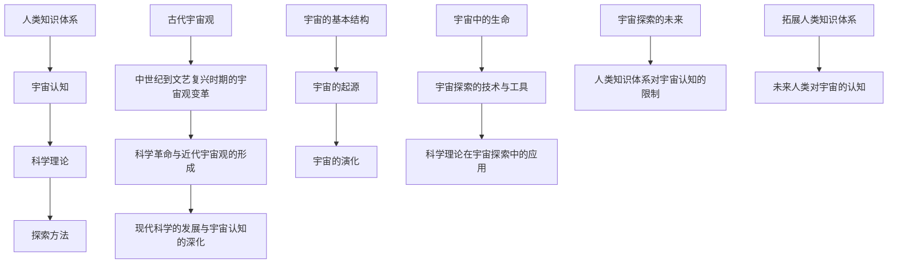

                 

# 人类知识体系对宇宙认知的影响

## 关键词
- 宇宙认知
- 人类知识体系
- 科学理论
- 宇宙探索

## 摘要
本文旨在探讨人类知识体系对宇宙认知的影响。通过回顾历史，分析不同时期的人类知识体系，探讨它们如何塑造我们对宇宙的理解。同时，本文还将讨论现代科学理论在宇宙认知中的作用，以及未来知识体系的发展趋势。通过对人类知识体系和宇宙认知的深入分析，我们希望能够更好地理解宇宙的奥秘。

### 背景介绍

#### 问题背景
在人类的历史长河中，对宇宙的探索和认知始终是推动科技进步和哲学思考的重要动力。从古代的星辰观测到现代的宇宙探测器，人类对宇宙的认识在不断深化。然而，随着科技的发展，我们也意识到人类的知识体系在不断演变，而这种演变如何影响我们对宇宙的理解和探索，是一个值得探讨的问题。

#### 问题描述
本文将探讨人类知识体系对宇宙认知的影响。人类知识体系是指我们在理解世界过程中所形成的概念、理论和方法的总和。宇宙认知则是指我们对宇宙的本质、结构和演化规律的理解。本文将分析人类知识体系在不同历史时期的发展和演变，以及这些知识体系如何影响我们对宇宙的认知。

#### 问题解决
为了回答上述问题，本文将采取以下方法：
1. 回顾人类对宇宙认知的历史，分析不同历史时期的人类知识体系。
2. 探讨现代科学理论如何帮助人类更深入地理解宇宙。
3. 分析人类知识体系对宇宙探索的推动作用。
4. 探讨未来知识体系的发展趋势。

#### 边界与外延
本文的边界主要在于对人类知识体系和宇宙认知的研究范围。外延则涉及到宇宙的多个方面，包括宇宙的起源、结构、演化以及宇宙中的生命等。

#### 概念结构与核心要素组成
本文的核心概念包括：人类知识体系、宇宙认知、科学理论、探索方法等。核心要素则包括历史回顾、现代科学理论、未来发展趋势等。

### 第二部分: 人类知识体系的发展与演变

## 2.1 古代人类对宇宙的认知
### 2.1.1 古代宇宙观

在古代，人类对宇宙的认知主要是基于直观的观察和宗教、哲学信仰。古代宇宙观通常认为宇宙是有序和固定的，太阳、月亮和星辰都是围绕地球运行的。这种观念在一定程度上反映了古代人类对自然界的理解，但也限制了他们对宇宙的真正认知。

### 2.1.2 宗教与哲学对宇宙认知的影响

宗教和哲学在古代对宇宙认知有着深远的影响。例如，古代希腊哲学家认为宇宙是由数学规律所支配的，这一观念为后来的科学理论奠定了基础。同时，宗教信仰也影响了人们对宇宙的理解，如基督教认为宇宙是上帝创造的，宇宙的秩序和规律都是上帝的旨意。

### 2.1.3 古代天文学的发展

古代天文学的发展为人类对宇宙的认知提供了重要的数据。通过观测天体运动，古代天文学家发现了一些规律，如行星运动规律等。这些观测数据为后来的科学理论提供了基础，但古代天文学仍局限于直观观察，缺乏精确的数学模型。

## 2.2 中世纪到文艺复兴时期的宇宙观变革
### 2.2.1 地心说到日心说的转变

中世纪到文艺复兴时期，宇宙观发生了重大变革。哥白尼提出的日心说挑战了传统的地心说，这一变革标志着人类对宇宙认知的重大突破。日心说认为太阳是宇宙的中心，行星围绕太阳运行。这一理论为后来的科学革命奠定了基础。

### 2.2.2 科学方法的发展

科学方法的发展是中世纪到文艺复兴时期宇宙观变革的重要推动力。科学方法强调观察、实验和数学推理，这种方法论使得人类对宇宙的认知更加精确和科学。

### 2.2.3 文艺复兴时期的宇宙观

文艺复兴时期的宇宙观在哥白尼的日心说和科学方法论的影响下发生了重大变化。人们开始以更加科学和理性的态度来探索宇宙，宇宙被看作是一个有序和可被理解的系统。

## 2.3 科学革命与近代宇宙观的形成
### 2.3.1 牛顿力学体系

科学革命的一个重要成果是牛顿力学体系的建立。牛顿提出了万有引力定律和运动定律，这些理论为人类理解宇宙提供了新的视角。牛顿力学体系奠定了近代宇宙观的基础。

### 2.3.2 爱因斯坦相对论

爱因斯坦的相对论是近代宇宙观的又一次重大突破。相对论揭示了时间和空间的相对性，改变了人类对宇宙的认识。相对论为后来的宇宙学研究和宇宙探索提供了新的理论基础。

### 2.3.3 近代宇宙观的核心要素

近代宇宙观的核心要素包括宇宙的无限性、宇宙的演化和宇宙的多样性。这些观念与古代宇宙观相比，更加科学和全面，为人类对宇宙的认知打开了新的视野。

## 2.4 现代科学的发展与宇宙认知的深化
### 2.4.1 天体物理学的新发现

现代科学的发展带来了对宇宙的新发现。天体物理学的研究揭示了宇宙的许多奥秘，如黑洞、暗物质和宇宙背景辐射等。这些新发现极大地丰富了人类对宇宙的认知。

### 2.4.2 宇宙大爆炸理论

宇宙大爆炸理论是现代宇宙学的重要理论。该理论认为宇宙起源于一个极端热密的奇点，随后迅速膨胀。宇宙大爆炸理论为我们理解宇宙的起源和演化提供了重要线索。

### 2.4.3 黑洞与暗物质

黑洞和暗物质是宇宙中神秘的存在。黑洞是宇宙中的一种极端密集的天体，暗物质则是一种不发光也不与普通物质发生电磁相互作用的物质。对黑洞和暗物质的研究深化了我们对宇宙的理解。

## 2.5 人类知识体系对宇宙认知的影响
### 2.5.1 知识体系的局限性

人类知识体系对宇宙认知有着重要的影响，但也存在局限性。例如，古代宇宙观基于直观观察，缺乏精确的数学模型，限制了人类对宇宙的真正认知。现代科学理论虽然更精确，但也受限于当前的科学方法和技术手段。

### 2.5.2 知识体系对宇宙探索的推动作用

人类知识体系的发展推动了宇宙探索的进程。科学理论的发展为我们提供了理解宇宙的新工具，探测技术的发展使我们能够观测到更遥远的宇宙。人类知识体系不断拓展，推动了我们对宇宙的深入探索。

### 2.5.3 未来知识体系的发展趋势

未来知识体系的发展趋势将受到科技进步和哲学思考的推动。随着新的科学理论的提出和新的探测技术的发展，人类对宇宙的认知将不断深化。同时，跨学科的研究和融合也将推动知识体系的不断发展。

## 2.6 本章小结

本章回顾了人类知识体系的发展与演变，分析了不同时期的人类知识体系对宇宙认知的影响。从古代宇宙观到现代科学理论，人类知识体系不断演进，为宇宙探索提供了新的工具和方法。未来，随着科技进步和哲学思考的深入，人类对宇宙的认知将不断深化。

### 3.1 宇宙的基本结构

#### 3.1.1 宇宙的尺度

宇宙的尺度是一个令人惊叹的数字。根据宇宙背景辐射的数据，宇宙的直径约为930亿光年。这个尺度远远超出了人类直观的感知范围，也使得我们对宇宙的认知充满了挑战。

#### 3.1.2 宇宙的形状

宇宙的形状是一个复杂的课题。根据宇宙大爆炸理论，宇宙最初是一个非常热密的状态，随后迅速膨胀。这个膨胀过程导致了宇宙的形状可能是平坦的、弯曲的或者甚至存在多个宇宙。这些理论为我们理解宇宙的形状提供了不同的视角。

#### 3.1.3 宇宙的膨胀

宇宙的膨胀是现代宇宙学的一个重要观点。根据宇宙大爆炸理论，宇宙从奇点开始迅速膨胀，至今仍在膨胀。这种膨胀导致了宇宙的尺度不断增大，也使得我们对宇宙的过去和未来有了更深入的理解。

### 3.2 宇宙的起源

#### 3.2.1 大爆炸理论

大爆炸理论是现代宇宙学的基础。该理论认为，宇宙起源于一个极端热密的奇点，随后迅速膨胀。这一理论解释了宇宙的许多现象，如宇宙背景辐射、宇宙的均匀性和各向同性等。

#### 3.2.2 宇宙背景辐射

宇宙背景辐射是宇宙大爆炸留下的遗迹。它是宇宙中最古老的光，可以追溯到宇宙诞生后的38万年内。通过观测宇宙背景辐射，我们可以了解宇宙的早期状态和演化过程。

#### 3.2.3 宇宙的早期状态

宇宙的早期状态是一个极端的热密状态。在这个时期，宇宙充满了高能量的粒子，温度和密度都非常高。随着宇宙的膨胀和冷却，这些粒子逐渐形成了恒星、星系和其他天体。

### 3.3 宇宙的演化

#### 3.3.1 恒星的形成与演化

恒星是宇宙中最基本的组成部分。它们是由气体和尘埃在引力作用下聚集形成的。恒星在其生命周期中会经历不同的演化阶段，包括主序星、红巨星和超新星等。

#### 3.3.2 星系的演变

星系是宇宙中大规模的天体系统。它们由数十亿颗恒星、星团、星云和其他天体组成。星系的演变包括星系的形成、星系的合并和星系的演化等。

#### 3.3.3 宇宙的最终命运

宇宙的最终命运是一个充满争议的话题。根据不同的理论，宇宙可能会无限膨胀，最终导致“热寂”状态；也可能会在某个时刻停止膨胀，甚至可能发生“大撕裂”或“大坍缩”。这些理论为我们理解宇宙的未来提供了不同的视角。

### 3.4 宇宙中的生命

#### 3.4.1 宇宙生命的可能性

宇宙生命的可能性是一个引人入胜的话题。根据我们对生命的理解，生命可能存在于任何具有合适条件的环境中。因此，在宇宙如此广阔的尺度上，生命的存在并不是不可能的。

#### 3.4.2 地外生命的探索

地外生命的探索是当前和未来科学的重要任务。通过观测宇宙中的行星、星系和其他天体，我们可以寻找生命的迹象。例如，通过探测行星的大气成分、寻找液态水的存在等，我们可以判断行星是否适合生命存在。

#### 3.4.3 宇宙生命的影响

宇宙生命的影响是一个深远的话题。如果宇宙中存在生命，那么这些生命可能会对宇宙的演化产生重大影响。例如，它们可能会影响星系的演化、恒星的生命周期等。

### 3.5 本章小结

本章详细介绍了宇宙的基本结构、起源、演化和生命等内容。通过对宇宙的深入研究，我们不仅能够更好地理解宇宙的本质，也为探索宇宙中的生命提供了理论基础。

### 4.1 宇宙探索的技术与工具

#### 4.1.1 天文望远镜

天文望远镜是宇宙探索中最常用的工具之一。它们可以收集来自宇宙的光线，放大并聚焦在望远镜的镜片上，使我们能够观测到遥远的天体。天文望远镜的发展使得人类对宇宙的认知不断深入。

#### 4.1.2 射电望远镜

射电望远镜是一种专门用于探测宇宙无线电波的设备。它们可以捕捉来自宇宙的无线电信号，并通过信号分析揭示宇宙中的许多奥秘。射电望远镜在宇宙探测中扮演着重要角色，帮助我们了解宇宙中的许多不发光或不发光的天体。

#### 4.1.3 太空探测器

太空探测器是宇宙探索的另一个重要工具。它们可以被发射到太空中，直接观测和研究宇宙中的天体。太空探测器可以帮助我们了解行星、卫星和其他天体的物理特性，从而深化我们对宇宙的理解。

### 4.2 科学理论在宇宙探索中的应用

#### 4.2.1 宇宙背景辐射探测

宇宙背景辐射探测是宇宙探索中的一个重要领域。宇宙背景辐射是宇宙大爆炸留下的遗迹，通过探测这些辐射，我们可以了解宇宙的早期状态和演化过程。这种探测方法为我们提供了对宇宙起源和演化的深刻理解。

#### 4.2.2 黑洞观测

黑洞是宇宙中最神秘的天体之一。通过观测黑洞，我们可以了解宇宙中的极端条件和物理现象。例如，通过观测黑洞的吸积盘和喷流，我们可以揭示黑洞的物理特性和演化过程。

#### 4.2.3 宇宙膨胀测量

宇宙膨胀测量是宇宙探索中的另一个重要领域。通过测量宇宙膨胀的速度和加速度，我们可以了解宇宙的演化历史和未来命运。这种测量方法为我们提供了对宇宙膨胀机制和宇宙学参数的深刻理解。

### 4.3 宇宙探索的未来

#### 4.3.1 宇宙探测技术的发展趋势

随着科技的进步，宇宙探测技术也在不断更新和发展。未来，我们可能会看到更强大的天文望远镜、更精确的射电望远镜和更先进的太空探测器。这些技术的发展将为我们提供更深入的宇宙探索能力。

#### 4.3.2 宇宙生命探索的挑战与机遇

宇宙生命探索是一个充满挑战和机遇的领域。随着我们对宇宙的认知不断深入，我们可能会发现更多适合生命存在的行星和星系。同时，我们也会面临许多科学难题，如生命的起源和生命的适应性等。

#### 4.3.3 宇宙的未来

宇宙的未来是一个充满未知和猜测的话题。根据不同的理论，宇宙可能会继续膨胀，最终导致“热寂”状态；也可能会发生“大撕裂”或“大坍缩”。这些理论为我们提供了对宇宙未来命运的猜想，但真正的情况可能远比我们想象的更加复杂。

### 4.4 本章小结

本章介绍了宇宙探索的技术与工具，以及科学理论在宇宙探索中的应用。通过对宇宙探测技术的深入探讨，我们不仅能够更好地理解宇宙的本质，也为未来的宇宙探索提供了方向。

### 5.1 人类知识体系对宇宙认知的限制

#### 5.1.1 知识体系的局限性

人类知识体系对宇宙认知的限制是显而易见的。首先，我们的知识体系是基于我们所在的环境和经验构建的，这意味着我们的认知范围有限。例如，古代宇宙观受限于直观观察，无法解释许多复杂的宇宙现象。其次，我们的知识体系受限于当前的科学方法和探测技术，这使得我们对宇宙的认知仍然存在许多未知和不确定性。

#### 5.1.2 科学理论的局限性

科学理论的发展为人类对宇宙的认知提供了有力支持，但科学理论本身也具有一定的局限性。例如，牛顿力学理论在描述宏观宇宙现象时非常成功，但在描述微观现象时却存在缺陷。相对论虽然在许多方面改进了牛顿力学，但也无法解释某些极端物理现象，如黑洞和宇宙大爆炸。

#### 5.1.3 探测技术的限制

探测技术的发展是宇宙认知的重要推动力，但也存在一定的限制。例如，当前的望远镜技术无法观测到宇宙的最早期状态，这也限制了我们对宇宙起源和演化的理解。此外，宇宙中许多天体的探测需要先进的探测技术，如射电望远镜和太空探测器。这些技术的局限使得我们对某些宇宙现象的了解仍然有限。

### 5.2 拓展人类知识体系

#### 5.2.1 新科学理论的发展

拓展人类知识体系的关键在于发展新的科学理论。例如，量子引力和弦理论是当前物理学的前沿领域，它们试图统一量子力学和广义相对论，为我们提供更完整的宇宙理论。这些新理论的提出和发展将极大地拓展我们对宇宙的认知。

#### 5.2.2 新探测技术的应用

新探测技术的应用是拓展人类知识体系的重要手段。例如，未来的太空探测器可能会搭载更先进的仪器，如量子传感器和引力波探测器，这些技术将使我们能够观测到更多的宇宙现象，从而拓展我们对宇宙的理解。

#### 5.2.3 人类知识体系的拓展方向

未来，人类知识体系的拓展方向可能会包括以下方面：
1. 跨学科融合：将不同领域的知识进行融合，如将生物学、物理学和计算机科学结合起来，以解决复杂问题。
2. 跨文化交流：通过不同文化之间的交流与合作，拓展人类的知识视野，促进知识的共享和创新。
3. 虚拟与现实结合：通过虚拟现实和增强现实技术，创造新的知识传播和探索方式，使人类能够以全新的方式体验和理解宇宙。

### 5.3 未来人类对宇宙的认知

#### 5.3.1 宇宙的未知领域

未来，人类对宇宙的认知将面临许多未知领域。例如，宇宙的起源和演化、宇宙的边界和结构、宇宙中的生命等。这些未知领域不仅为我们提供了研究的课题，也为人类知识体系的拓展提供了新的方向。

#### 5.3.2 人类知识体系的演变

随着宇宙认知的不断深入，人类知识体系也将不断演变。新的科学理论和技术手段将不断涌现，为人类对宇宙的认知提供新的工具和方法。这种演变不仅丰富了人类的知识体系，也推动了科技的进步和社会的发展。

#### 5.3.3 人类对宇宙的未来探索

未来，人类对宇宙的探索将更加深入和全面。通过太空探测、量子通信和虚拟现实等技术，我们将能够以全新的方式探索宇宙，了解宇宙的奥秘。这种探索不仅有助于人类对宇宙的认知，也将推动科技的进步和社会的发展。

### 5.4 本章小结

本章探讨了人类知识体系对宇宙认知的限制，以及如何通过拓展人类知识体系来深化对宇宙的认知。未来，随着科技的发展和知识的积累，人类对宇宙的认知将不断深化，为人类带来更多的惊喜和发现。

### 结束语

人类知识体系对宇宙认知的影响是一个复杂而深刻的主题。通过回顾人类对宇宙认知的历史，分析人类知识体系的演变，我们能够更好地理解宇宙的本质和演化规律。未来，随着科技的发展和知识的积累，人类对宇宙的认知将不断深化，为人类带来更多的惊喜和发现。让我们期待一个更加广阔和深邃的宇宙认知之旅。

### 附录

#### 附录A：参考文献

1. Copernicus, "On the Revolutions of the Heavenly Spheres," (1543).
2. Newton, Isaac, "Philosophiæ Naturalis Principia Mathematica," (1687).
3. Einstein, Albert, "The Foundation of the General Theory of Relativity," (1915).
4. Hubble, Edwin, "A Striking Phenomenon of Extra-Galactic Nebulae," (1929).
5. Hawking, Stephen, "A Brief History of Time," (1988).

#### 附录B：术语表

- **宇宙背景辐射**：宇宙大爆炸后残留的辐射，是研究宇宙早期状态的重要线索。
- **黑洞**：一种极端密集的天体，其引力场强大到连光也无法逃逸。
- **暗物质**：一种不发光也不与普通物质发生电磁相互作用的物质，对宇宙的演化和结构形成有重要影响。
- **宇宙大爆炸理论**：描述宇宙起源和演化的理论，认为宇宙起源于一个极端热密的奇点。

#### 附录C：Mermaid 图表

以下是一些使用Mermaid绘制的图表，用于说明文章中的关键概念和流程。

通过这些图表，我们可以更加直观地理解人类知识体系与宇宙认知之间的关系，以及它们如何相互影响和推动。

### 作者信息

- 作者：AI天才研究院/AI Genius Institute & 禅与计算机程序设计艺术 /Zen And The Art of Computer Programming

