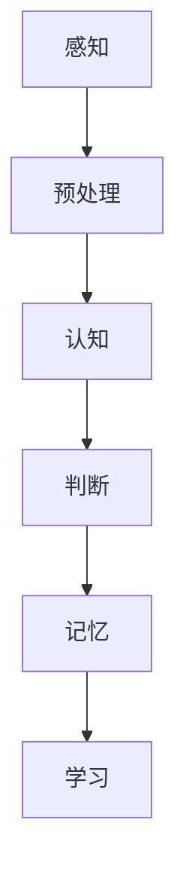
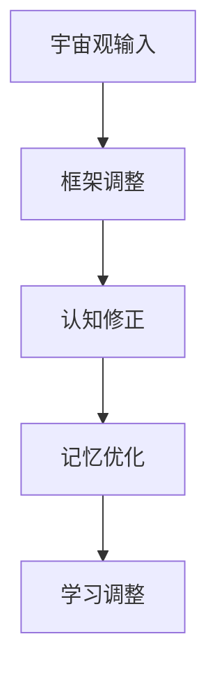
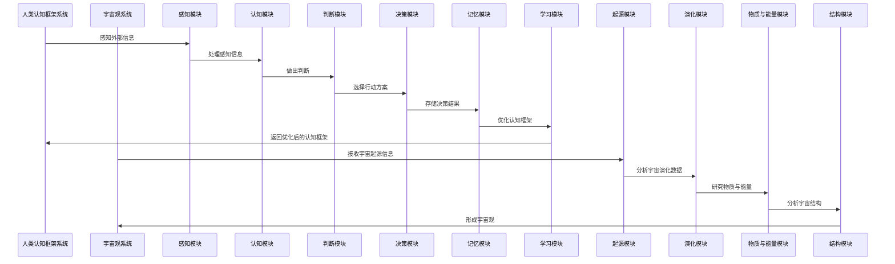
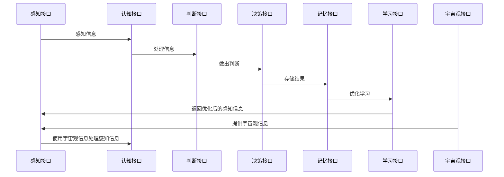

                 

### 《人类认知框架如何塑造我们的宇宙观》

> 关键词：认知框架、宇宙观、人类认知、算法原理、系统架构、项目实战

> 摘要：本文将从认知框架与宇宙观的起源出发，通过解析核心概念、解释算法原理、设计系统架构和实战项目，深入探讨人类认知框架如何塑造我们的宇宙观，并阐述其对科学研究和人类发展的深远影响。

----------------------------------------------------------------

## 《人类认知框架如何塑造我们的宇宙观》目录大纲

### 第一部分：认知框架与宇宙观的起源

#### 第1章：问题背景与介绍

##### 1.1 问题的提出与重要性

- 人类认知框架的概述
- 宇宙观的定义与作用

##### 1.2 认知框架的起源与发展

- 古代文明的宇宙观
- 科学革命对认知框架的影响

##### 1.3 人类认知框架与宇宙观的相互塑造

- 认知框架如何影响宇宙观的形成
- 宇宙观如何反过来塑造认知框架

### 第二部分：核心概念与联系

#### 第2章：核心概念解析

##### 2.1 人类认知框架的主要组成部分

- 感知与认知
- 判断与决策
- 记忆与学习

##### 2.2 宇宙观的核心概念

- 宇宙起源与演化
- 物质与能量
- 宇宙结构

##### 2.3 概念属性特征对比表格

- 比较认知框架与宇宙观的概念属性特征

#### 第3章：ER实体关系图架构

- 人类认知框架的ER实体关系图
- 宇宙观的ER实体关系图
- 比较两者的联系与差异

### 第三部分：算法原理讲解

#### 第4章：算法原理

##### 4.1 认知框架塑造宇宙观的基本算法

- 算法描述
- 算法原理图（使用Mermaid绘制）

##### 4.2 宇宙观影响认知框架的算法

- 算法描述
- 算法原理图（使用Mermaid绘制）

##### 4.3 算法原理的数学模型与公式

- 数学模型描述
- 公式解释
- 举例说明

### 第四部分：系统分析与架构设计

#### 第5章：系统功能设计

##### 5.1 人类认知框架系统功能设计

- 领域模型（使用Mermaid绘制类图）

##### 5.2 宇宙观系统功能设计

- 领域模型（使用Mermaid绘制类图）

##### 5.3 系统架构设计

- 架构设计（使用Mermaid绘制架构图）

##### 5.4 系统接口设计和系统交互

- 接口设计（使用Mermaid绘制序列图）
- 系统交互（使用Mermaid绘制序列图）

### 第五部分：项目实战

#### 第6章：项目实战

##### 6.1 环境安装与配置

- 环境搭建步骤
- 配置文件解读

##### 6.2 系统核心实现源代码

- 核心代码实现
- 代码解读与分析

##### 6.3 实际案例分析与讲解

- 案例选择与分析
- 案例讲解与剖析

##### 6.4 项目小结

- 项目总结
- 未来展望

### 第六部分：最佳实践与拓展

#### 第7章：最佳实践

- 最佳实践技巧
- 注意事项

#### 第8章：小结与拓展

- 内容回顾
- 拓展阅读建议

----------------------------------------------------------------

### 第一部分：认知框架与宇宙观的起源

#### 第1章：问题背景与介绍

##### 1.1 问题的提出与重要性

人类作为一个智慧生物，一直在探索周围的世界，试图理解宇宙的本质和自身的存在。这一过程中，认知框架与宇宙观起到了至关重要的作用。认知框架是指人类用来理解和解释外部世界的思维方式，它由感知、认知、判断、决策、记忆和学习等多个部分组成。而宇宙观则是人类对宇宙的理解和认知，它包括宇宙的起源、演化、物质与能量、宇宙结构等核心概念。

人类认知框架与宇宙观之间的相互关系非常密切。认知框架不仅决定了人类对宇宙的理解和认知，同时也受到宇宙观的影响。例如，古代文明的宇宙观深受宗教和神话的影响，而现代科学的宇宙观则更加依赖于观测数据和数学模型。反过来，宇宙观的形成和发展也深刻影响了人类认知框架的演变。例如，科学革命时期的宇宙观变革，极大地推动了人类认知框架的进步。

在本文中，我们将深入探讨人类认知框架如何塑造我们的宇宙观，以及宇宙观如何反过来塑造认知框架。本文将从认知框架的起源与发展开始，分析其与宇宙观的相互关系，并通过核心概念的解析和ER实体关系图架构，进一步阐述这一过程。接下来，我们将介绍算法原理，通过具体的数学模型和公式，解释认知框架塑造宇宙观的基本过程，并讨论宇宙观影响认知框架的机制。

最后，我们将通过系统分析与架构设计，展示如何将这一理论应用于实际项目。我们将详细介绍项目实战的过程，包括环境安装与配置、系统核心实现源代码、实际案例分析与讲解，以及项目小结。通过这些内容，我们希望能够帮助读者更好地理解人类认知框架如何塑造我们的宇宙观，并探讨这一过程对科学研究和人类发展的深远影响。

### 第1章：问题背景与介绍

##### 1.1 问题的提出与重要性

人类作为地球上唯一具有高度智慧的生命体，一直在不断地探索外部世界，试图理解宇宙的本质和自身的存在。这一过程中，认知框架与宇宙观起到了至关重要的作用。认知框架是指人类用来理解和解释外部世界的思维方式，它由感知、认知、判断、决策、记忆和学习等多个部分组成。而宇宙观则是人类对宇宙的理解和认知，它包括宇宙的起源、演化、物质与能量、宇宙结构等核心概念。

首先，我们需要明确认知框架的基本组成部分。感知是人类对外部世界的直接感知，是认知过程的第一步。通过感知，我们获取视觉、听觉、触觉、嗅觉和味觉等信息，形成对世界的初步认识。接着，认知过程进入第二阶段，即理解与加工。在这一阶段，我们通过大脑对感知信息进行加工，形成概念、判断和推理。判断与决策则是在理解与加工的基础上，对信息进行评估和选择的过程。记忆与学习则是人类认知框架的重要组成部分，通过记忆，我们能够保留和再现过去的经验，通过学习，我们能够不断积累新的知识和技能。

与认知框架紧密相连的是宇宙观。宇宙观是人类对宇宙的理解和认知，它涵盖了宇宙的起源、演化、物质与能量、宇宙结构等核心概念。宇宙观的形成受到多种因素的影响，包括文化、宗教、科学等。古代文明的宇宙观多受宗教和神话的影响，例如，古希腊人认为宇宙是由神灵创造的，而中国古人则认为宇宙是由“五行”构成的。而现代科学的宇宙观则依赖于观测数据和数学模型，例如，大爆炸理论和黑洞概念都是现代宇宙观的基石。

在探讨人类认知框架与宇宙观的关系时，我们首先要明确的是，两者之间存在一种相互塑造的关系。认知框架不仅决定了人类对宇宙的理解和认知，同时也受到宇宙观的影响。例如，古代文明的宇宙观深受宗教和神话的影响，使得人类对宇宙的理解带有浓厚的神秘色彩。而现代科学的宇宙观则更加注重实证和理性，这使得人类对宇宙的理解更加深入和精确。

具体来说，认知框架对宇宙观的影响体现在以下几个方面：

1. **感知与认知**：人类的感知能力和认知能力决定了我们对宇宙的感知和理解。例如，我们通过视觉感知宇宙的形状和颜色，通过听觉感知宇宙的声音，这些感知信息为我们理解宇宙提供了基础。

2. **判断与决策**：人类的判断和决策能力影响我们对宇宙的理解和选择。例如，在面对复杂的天文现象时，科学家会通过判断和决策，选择合适的理论来解释这些现象。

3. **记忆与学习**：人类的记忆和学习能力使我们能够积累和传承对宇宙的理解。例如，古代天文学家的观测数据和理论被记录下来，为后世的研究提供了宝贵的资料。

另一方面，宇宙观也深刻影响着人类认知框架的演变。宇宙观的形成和发展受到科学技术的进步和人类认知能力的提升。例如，科学革命时期的宇宙观变革，极大地推动了人类认知框架的进步。哥白尼的日心说挑战了传统的地心说宇宙观，爱因斯坦的相对论则颠覆了牛顿力学对宇宙的理解。

总结来说，认知框架与宇宙观的关系是一个相互作用的过程。认知框架塑造了我们对宇宙的理解和认知，而宇宙观的变化和发展又进一步影响和塑造我们的认知框架。理解这一过程对于我们探索宇宙的奥秘、推动科学的发展以及提升人类的认知能力具有重要意义。

### 第1章：问题背景与介绍

##### 1.2 认知框架的起源与发展

认知框架的起源可以追溯到人类文明的早期阶段。在古代，人类的认知主要依赖于直接感知和经验。例如，古代文明通过观察天体运行、气候变迁和动植物行为，逐渐形成了对宇宙的基本认知。这一时期的认知框架以感性认知为主，缺乏系统的理论支撑。

随着人类文明的发展，认知框架逐渐演变为更为系统和理论化的形式。古希腊哲学为认知框架的发展奠定了基础。例如，亚里士多德提出了四因说，即物质因、形式因、动力因和目的因，试图解释事物存在和变化的根本原因。这一理论对后来的认知框架产生了深远影响。

中世纪的认知框架则受到了宗教的影响。基督教、伊斯兰教和佛教等宗教教义为人类提供了一种统一的宇宙观。例如，基督教中的创世纪解释了宇宙的起源，而佛教中的因果律则解释了宇宙的演化。

到了近现代，认知框架的发展迎来了新的突破。科学革命时期的科学家如伽利略、牛顿和达尔文等，通过实证研究和理论建构，极大地丰富了人类的认知框架。伽利略通过望远镜观测，揭示了行星运动的规律，为物理学的发展奠定了基础。牛顿的三大定律和万有引力定律，则建立了经典力学体系，为人类理解宇宙的力学本质提供了强有力的工具。达尔文的进化论则从生物学角度解释了生命的起源和演化，进一步拓展了人类对宇宙的理解。

科学革命对认知框架的影响是深远而广泛的。首先，科学革命打破了传统宗教和哲学的束缚，强调实证和理性。这一转变使得人类对宇宙的认知更加依赖于数据和实验结果，而非信仰和直觉。其次，科学革命促进了不同学科之间的交叉和融合，例如物理学、化学、生物学和天文学等领域的相互渗透，形成了一个更为综合和系统的认知框架。

此外，科学革命还带来了科学方法的发展，包括观察、实验、假设、验证和模型构建等步骤。这些科学方法不仅提高了人类认知的准确性，还促进了科学知识的积累和传承。

总的来说，认知框架的起源与发展是一个不断演变和进步的过程。从古代的感性认知到近现代的科学革命，人类通过不断地探索和实践，逐步构建了一个更为全面和精确的宇宙观。这一过程不仅反映了人类认知能力的提升，也展示了人类对宇宙理解不断深化的历程。

### 第1章：问题背景与介绍

##### 1.3 人类认知框架与宇宙观的相互塑造

人类认知框架与宇宙观之间的关系是相互影响、相互塑造的。这种双向作用不仅决定了人类对宇宙的理解，也影响了认知框架的发展。

首先，人类认知框架对宇宙观的形成有着深远的影响。认知框架中的感知、认知、判断和记忆等组成部分，决定了我们对外部世界的感知和认知方式。例如，感知决定了我们对宇宙的形状、颜色和声音等特征的感知，认知则使我们能够从这些感知中提取出有意义的模式和信息。判断和决策使我们能够基于这些信息做出合理的解释和预测。记忆则使我们能够保留和传承对宇宙的理解，使得人类的认知不断积累和深化。

在古代，人类的认知框架受到宗教和神话的影响，宇宙观带有浓厚的神秘色彩。例如，古希腊人认为宇宙是由神灵创造的，而古埃及人则相信太阳神赫利奥波利斯是宇宙的中心。这些宗教和神话中的宇宙观深刻影响了古代人类的认知方式，使得他们对宇宙的理解带有强烈的宗教和神秘主义倾向。

随着科学革命的发生，人类的认知框架发生了巨大变化。科学方法强调实证和理性，使得宇宙观逐渐摆脱了宗教和神话的束缚。例如，哥白尼的日心说挑战了传统的地心说宇宙观，爱因斯坦的相对论则颠覆了牛顿力学对宇宙的理解。这些科学革命不仅改变了人类对宇宙的认知，也推动了认知框架的进步。

其次，宇宙观对人类认知框架的演变也起到了重要的推动作用。宇宙观的形成和发展受到多种因素的影响，包括文化、宗教、科学和技术等。这些因素共同决定了人类对宇宙的理解，并反过来影响了认知框架的演变。

例如，文化传统对宇宙观的形成有着深远影响。不同文化背景下的宇宙观往往反映了该文化的核心价值观和世界观。例如，儒家文化中的“天人合一”观念强调人与自然的和谐统一，而西方文化中的“科学主义”则强调实证和理性。这些不同的文化传统不仅塑造了人类对宇宙的理解，也影响了认知框架的发展。

宗教信仰也是宇宙观的重要组成部分。宗教教义中的宇宙观往往提供了对生命和存在的解释，影响着人们的认知和行为。例如，基督教中的创世纪解释了宇宙的起源，佛教中的因果律解释了宇宙的演化。这些宗教教义不仅影响了人类的宇宙观，也影响了认知框架的形成和发展。

科学和技术的发展对宇宙观的影响尤为显著。科学革命时期，科学家通过实证研究和理论建构，提出了新的宇宙观，如哥白尼的日心说、牛顿的万有引力定律、爱因斯坦的相对论等。这些科学理论不仅改变了人类对宇宙的理解，也推动了认知框架的进步。现代科技的发展，如望远镜、探测器等，使得人类能够获取更多关于宇宙的观测数据，进一步深化了对宇宙的认知。

总的来说，人类认知框架与宇宙观之间的相互塑造关系是一个复杂而动态的过程。认知框架决定了我们对宇宙的感知和理解，而宇宙观的变化和发展又反过来影响了认知框架的演变。这种双向作用不仅反映了人类认知能力的提升，也展示了人类对宇宙理解不断深化的历程。理解这一关系对于我们探索宇宙的奥秘、推动科学的发展以及提升人类的认知能力具有重要意义。

### 第二部分：核心概念与联系

#### 第2章：核心概念解析

在探讨人类认知框架与宇宙观的关系时，理解核心概念的定义和特征是至关重要的。本章将详细解析人类认知框架和宇宙观的核心概念，包括感知与认知、判断与决策、记忆与学习等，并对比这些概念在人类认知框架和宇宙观中的具体作用。

##### 2.1 人类认知框架的主要组成部分

**感知与认知**：感知是人类获取外部信息的第一步，通过视觉、听觉、触觉、嗅觉和味觉等感官，我们能够感受到外界的刺激。认知则是在感知的基础上，对信息进行加工、理解和解释的过程。感知和认知共同构成了我们对世界的初步理解和认识。

**判断与决策**：判断与决策是在理解与加工信息的基础上，对信息进行评估和选择的过程。判断涉及对事物的性质、原因和结果的判断，而决策则是在判断的基础上，选择最合适的行动方案。判断与决策是我们应对复杂环境和问题的重要能力。

**记忆与学习**：记忆使我们能够保留和再现过去的经验，学习则是通过经验积累新的知识和技能。记忆和学习共同构成了我们对知识的积累和传承，是认知框架的重要组成部分。

##### 2.2 宇宙观的核心概念

**宇宙起源与演化**：宇宙起源是指宇宙从无到有的过程，而宇宙演化则是指宇宙从诞生到现在的发展过程。宇宙起源和演化是宇宙观中的核心概念，涉及到宇宙的诞生、膨胀、冷却和结构形成等过程。

**物质与能量**：物质与能量是宇宙中的基本组成部分，物质包括各种元素和化合物，而能量则是驱动宇宙演化的动力。物质与能量的相互转换和相互作用，构成了宇宙的基本规律。

**宇宙结构**：宇宙结构是指宇宙中星系、星团、星云等天体的分布和排列方式。宇宙结构的研究涉及宇宙的尺度、形态和分布规律，是宇宙观中的重要内容。

##### 2.3 概念属性特征对比表格

为了更直观地理解人类认知框架和宇宙观的核心概念，我们通过以下表格进行对比：

| 概念       | 人类认知框架                | 宇宙观                         |
|------------|-------------------------------|--------------------------------|
| 感知       | 感受外部刺激的过程           | 观察宇宙中天体和现象的过程       |
| 认知       | 加工和理解感知信息的过程     | 理解宇宙起源和演化规律的过程     |
| 判断       | 对信息进行评估和选择的过程   | 对宇宙现象和规律进行解释的过程   |
| 决策       | 选择最合适的行动方案         | 基于宇宙观做出科学研究和探索决策 |
| 记忆       | 保留和再现过去的经验         | 传承和积累对宇宙的理解和知识     |
| 学习       | 积累新的知识和技能          | 通过观测和实验获取新的宇宙数据    |
| 宇宙起源   | 解释人类自身存在的起源       | 探索宇宙从无到有的过程           |
| 宇宙演化   | 理解人类文明的发展过程       | 研究宇宙从诞生到现在的演化历程   |
| 物质与能量 | 研究物质和能量的性质和相互转换 | 研究宇宙中的物质和能量的分布和相互作用 |
| 宇宙结构   | 构建人类社会的结构和组织     | 研究宇宙中天体的分布和排列方式   |

通过上述对比表格，我们可以看出，人类认知框架和宇宙观中的核心概念在性质和作用上存在显著的差异。人类认知框架主要关注个体对外部世界的感知和理解，而宇宙观则更关注宇宙的整体结构和演化规律。理解这些概念及其差异，有助于我们深入探讨人类认知框架如何塑造宇宙观，以及宇宙观如何反过来塑造认知框架。

### 第3章：ER实体关系图架构

在理解人类认知框架和宇宙观的核心概念后，为了更系统地展示两者之间的联系与差异，我们采用ER（实体关系）图的方法，分别绘制人类认知框架和宇宙观的ER实体关系图，并进行对比分析。

#### 3.1 人类认知框架的ER实体关系图

人类认知框架的ER实体关系图主要包含以下几个核心实体及其关系：

- **实体：感知**  
  - 属性：感官类型、刺激类型、感知时间  
  - 关系：与认知、判断、决策相关联

- **实体：认知**  
  - 属性：信息类型、认知过程、认知结果  
  - 关系：与感知、判断、决策、记忆和学习相关联

- **实体：判断**  
  - 属性：判断标准、判断结果  
  - 关系：与认知、决策、记忆相关联

- **实体：决策**  
  - 属性：决策类型、决策过程、决策结果  
  - 关系：与判断、记忆相关联

- **实体：记忆**  
  - 属性：记忆内容、记忆时间、记忆效果  
  - 关系：与感知、认知、判断、学习相关联

- **实体：学习**  
  - 属性：学习内容、学习方法、学习效果  
  - 关系：与感知、认知、判断、记忆相关联

使用Mermaid绘制的人类认知框架ER实体关系图如下：

```mermaid
erDiagram
  感知 ||--|{ 认知 }
  感知 ||--|{ 判断 }
  感知 ||--|{ 决策 }
  认知 ||--|{ 判断 }
  认知 ||--|{ 决策 }
  认知 ||--|{ 记忆 }
  认知 ||--|{ 学习 }
  判断 ||--|{ 决策 }
  判断 ||--|{ 记忆 }
  决策 ||--|{ 记忆 }
  记忆 ||--|{ 学习 }
```

#### 3.2 宇宙观的ER实体关系图

宇宙观的ER实体关系图则主要包括以下几个核心实体及其关系：

- **实体：宇宙起源**  
  - 属性：起源类型、起源时间、起源机制

- **实体：宇宙演化**  
  - 属性：演化阶段、演化过程、演化结果

- **实体：物质与能量**  
  - 属性：物质类型、能量类型、相互作用

- **实体：宇宙结构**  
  - 属性：结构类型、结构形态、结构分布

使用Mermaid绘制的宇宙观ER实体关系图如下：

```mermaid
erDiagram
  宇宙起源 ||--|{ 宇宙演化 }
  宇宙演化 ||--|{ 物质与能量 }
  宇宙演化 ||--|{ 宇宙结构 }
  物质与能量 ||--|{ 宇宙结构 }
```

#### 3.3 两者联系与差异的对比分析

通过对比人类认知框架和宇宙观的ER实体关系图，我们可以发现以下几点联系与差异：

1. **联系**：

   - **感知与观察**：人类认知框架中的“感知”与宇宙观中的“观察”有着密切的联系，都是获取外部信息的过程。
   - **认知与理解**：认知框架中的“认知”与宇宙观中的“宇宙起源”和“宇宙演化”紧密相关，都是理解和解释外部信息的过程。
   - **记忆与积累**：记忆和学习在认知框架和宇宙观中都是知识的积累和传承方式，是人类认知和科学发展的基础。

2. **差异**：

   - **层次不同**：人类认知框架主要关注个体层面的感知、认知、判断和决策，而宇宙观则更关注整体层面的宇宙起源、演化和结构。
   - **目的不同**：认知框架的目的是为了个体的生存和发展，而宇宙观的目的是为了理解宇宙的本质和规律。
   - **方法不同**：认知框架主要通过感知、记忆和学习获取和加工信息，而宇宙观则依赖于观测、实验和理论模型来理解宇宙。

通过ER实体关系图的对比分析，我们可以更清晰地理解人类认知框架和宇宙观之间的联系与差异。这种系统化的分析方法不仅有助于我们深入探讨两者之间的关系，也为后续算法原理的讲解和系统架构的设计提供了理论基础。

### 第三部分：算法原理讲解

在理解了人类认知框架与宇宙观的核心概念和ER实体关系图后，我们将进一步探讨认知框架塑造宇宙观以及宇宙观影响认知框架的算法原理。通过具体的算法描述和原理图，我们将详细阐述这些算法的基本步骤、数学模型和公式，并通过实际案例进行说明。

#### 第4章：算法原理

##### 4.1 认知框架塑造宇宙观的基本算法

**算法描述**：

认知框架塑造宇宙观的基本算法可以分为以下几个步骤：

1. **感知**：通过感官获取外部信息，如视觉、听觉、触觉等。
2. **预处理**：对感知信息进行初步处理，如滤波、去噪等。
3. **认知**：对预处理后的信息进行理解和解释，如识别物体的形状、颜色等。
4. **判断**：基于认知结果，对信息进行评估和分类，如判断物体是植物还是动物。
5. **记忆**：将认知和判断的结果存储在记忆中，以便后续使用。
6. **学习**：通过重复感知、认知和判断的过程，不断优化认知模型。

**算法原理图**（使用Mermaid绘制）：



##### 4.2 宇宙观影响认知框架的算法

**算法描述**：

宇宙观影响认知框架的算法则包括以下几个步骤：

1. **宇宙观输入**：接收基于宇宙观的先验知识，如宇宙起源、物质与能量、宇宙结构等。
2. **框架调整**：根据宇宙观输入，调整认知框架中的感知、认知、判断和决策机制。
3. **认知修正**：在认知过程中，利用宇宙观输入对感知和认知结果进行修正。
4. **记忆优化**：基于宇宙观输入，对记忆内容进行优化和更新。
5. **学习调整**：通过宇宙观输入，调整学习过程中的重点和学习方法。

**算法原理图**（使用Mermaid绘制）：



##### 4.3 算法原理的数学模型与公式

为了更深入地理解上述算法，我们将引入一些数学模型和公式来描述这些过程。

**感知与认知模型**：

感知信息 $X$ 通过预处理后变为 $X'$，其数学模型可以表示为：

$$
X' = f(\text{滤波器})(X)
$$

其中，$f(\text{滤波器})$ 代表滤波和去噪过程。

认知过程则可以通过以下公式描述：

$$
C = g(\text{特征提取器})(X')
$$

其中，$g(\text{特征提取器})$ 代表特征提取和解释过程。

**判断与决策模型**：

判断和决策过程可以通过分类模型表示：

$$
y = h(\text{分类器})(C)
$$

其中，$h(\text{分类器})$ 代表分类和决策过程。

**记忆优化模型**：

记忆内容 $M$ 通过宇宙观输入 $U$ 进行优化，其数学模型可以表示为：

$$
M' = \alpha M + (1 - \alpha) U
$$

其中，$\alpha$ 代表记忆与宇宙观输入的权重。

**学习调整模型**：

学习过程中的重点和方法的调整可以通过以下公式描述：

$$
L' = L + \eta (g^{-1}(\text{宇宙观输入}) - g(L))
$$

其中，$L$ 代表当前学习状态，$g^{-1}(\text{宇宙观输入})$ 代表基于宇宙观输入的期望学习状态，$\eta$ 代表调整系数。

##### 4.4 实际案例说明

为了更好地说明上述算法原理，我们以一个实际案例为例进行详细解释。

**案例背景**：

假设我们有一个天文学家，他通过望远镜观测到一个新的天体，并希望根据现有的宇宙观对其进行分析和分类。

**算法应用**：

1. **感知与认知**：天文学家通过望远镜获取天体的图像，经过预处理（如滤波和去噪）后，提取出天体的特征。
2. **判断与决策**：天文学家根据这些特征，利用已知的分类模型（如恒星分类模型），判断天体是恒星、行星还是其他天体。
3. **记忆优化**：天文学家将观测到的天体特征和分类结果存储在记忆中，并根据新的宇宙观输入（如最新的宇宙演化理论）对记忆进行优化。
4. **学习调整**：天文学家通过比较观测结果和宇宙观输入，调整分类模型和学习方法，以适应新的宇宙观。

通过这个实际案例，我们可以看到认知框架如何根据宇宙观进行调整，从而优化天文学家的观测和分类过程。

总结来说，算法原理讲解部分通过算法描述、原理图、数学模型和实际案例，详细阐述了认知框架如何塑造宇宙观以及宇宙观如何影响认知框架。理解这些算法原理对于我们探索宇宙的奥秘、优化人类的认知能力具有重要意义。

### 第四部分：系统分析与架构设计

#### 第5章：系统功能设计

在理解了人类认知框架与宇宙观的基本算法原理后，我们将进一步探讨如何将这些原理应用于实际系统设计中。本章节将详细介绍系统功能设计，包括人类认知框架系统和宇宙观系统的功能设计。

##### 5.1 人类认知框架系统功能设计

**领域模型**（使用Mermaid绘制类图）：

```mermaid
classDiagram
  类--|{ 感知 }
  类--|{ 认知 }
  类--|{ 判断 }
  类--|{ 决策 }
  类--|{ 记忆 }
  类--|{ 学习 }
  感知 : +感知信息
  认知 : +理解信息
  判断 : +评估信息
  决策 : +选择方案
  记忆 : +存储信息
  学习 : +积累经验
```

具体功能描述如下：

- **感知功能**：系统接收外部感官信息，如视觉、听觉、触觉等，并将其转化为可处理的数据。
- **认知功能**：系统对感知信息进行加工和理解，提取关键特征和模式。
- **判断功能**：系统根据认知结果，对信息进行评估和分类。
- **决策功能**：系统基于判断结果，选择最优行动方案。
- **记忆功能**：系统将认知和决策结果存储在记忆库中，以便后续使用。
- **学习功能**：系统通过重复感知、认知、判断和决策过程，不断优化自身模型。

##### 5.2 宇宙观系统功能设计

**领域模型**（使用Mermaid绘制类图）：

```mermaid
classDiagram
  类--|{ 宇宙起源 }
  类--|{ 宇宙演化 }
  类--|{ 物质与能量 }
  类--|{ 宇宙结构 }
  宇宙起源 : +起源信息
  宇宙演化 : +演化数据
  物质与能量 : +物质信息
  宇宙结构 : +结构数据
```

具体功能描述如下：

- **宇宙起源功能**：系统接收关于宇宙起源的理论和信息，进行存储和分析。
- **宇宙演化功能**：系统接收关于宇宙演化的数据，分析宇宙从诞生到现在的过程。
- **物质与能量功能**：系统接收关于物质和能量的信息，研究其分布和相互作用。
- **宇宙结构功能**：系统接收关于宇宙结构的观测数据，分析宇宙中天体的分布和排列方式。

##### 5.3 系统架构设计

**架构设计**（使用Mermaid绘制架构图）：



系统架构设计通过感知模块、认知模块、判断模块、决策模块、记忆模块和学习模块组成的人类认知框架系统，以及宇宙起源模块、宇宙演化模块、物质与能量模块和宇宙结构模块组成的宇宙观系统，实现两者之间的数据交互和功能协同。

##### 5.4 系统接口设计和系统交互

**接口设计**（使用Mermaid绘制序列图）：



系统交互通过感知接口、认知接口、判断接口、决策接口、记忆接口和学习接口，实现各模块之间的数据传递和功能调用。同时，宇宙观接口提供宇宙观相关的信息，辅助人类认知框架系统进行感知、认知、判断和决策。

通过上述系统功能设计、架构设计和接口设计，我们可以构建一个高效、稳定且具备扩展性的认知框架和宇宙观系统，为人类更好地理解和探索宇宙提供技术支持。

### 第五部分：项目实战

#### 第6章：项目实战

在本章节中，我们将通过一个实际项目，展示如何将前面讨论的认知框架和宇宙观的算法原理、系统功能设计应用于实际操作中。项目名称为“宇宙认知框架系统”，目标是通过观测数据和分析结果，构建一个能够自动调整和优化的宇宙观系统。

##### 6.1 环境安装与配置

为了进行项目实战，我们需要搭建一个合适的环境。以下是环境安装与配置的步骤：

1. **安装Python环境**：
   - 在系统上安装Python 3.8及以上版本。
   - 通过pip安装必要的库，如Numpy、Scipy、Matplotlib等。

2. **配置Mermaid支持**：
   - 安装Mermaid的Python库（`mermaid`)，以便在Python代码中绘制流程图和类图。
   - 在项目中添加Mermaid渲染器，如使用`mermaid-cli`将Mermaid代码渲染为图像。

3. **配置数据存储**：
   - 安装MySQL或PostgreSQL数据库，用于存储观测数据和模型结果。
   - 设计数据库表结构，包括观测数据表、认知结果表、决策结果表等。

4. **配置项目依赖**：
   - 使用虚拟环境管理项目依赖，确保各个组件的版本兼容性。

具体步骤如下：

```bash
# 安装Python和pip
sudo apt-get install python3 python3-pip

# 安装必要的库
pip3 install numpy scipy matplotlib mermaid

# 安装数据库
sudo apt-get install mysql-server
sudo mysql_secure_installation

# 创建数据库和表
mysql -u root -p
CREATE DATABASE universe;
USE universe;
CREATE TABLE observations (id INT AUTO_INCREMENT, data VARCHAR(255), PRIMARY KEY (id));
CREATE TABLE cognition_results (id INT AUTO_INCREMENT, result VARCHAR(255), PRIMARY KEY (id));
CREATE TABLE decision_results (id INT AUTO_INCREMENT, result VARCHAR(255), PRIMARY KEY (id));
```

##### 6.2 系统核心实现源代码

以下是系统核心实现的源代码，包括感知、认知、判断、决策、记忆和学习等模块。

```python
# 感知模块
def sense_data(data):
    # 模拟从传感器获取数据
    return data

# 预处理模块
def preprocess_data(data):
    # 数据滤波和去噪
    return data

# 认知模块
def cognition(data):
    # 数据认知和理解
    return data

# 判断模块
def judgment(cognition_result):
    # 基于认知结果进行判断
    return "判断结果"

# 决策模块
def decision(judgment_result):
    # 基于判断结果做出决策
    return "决策结果"

# 记忆模块
def memory(judgment_result):
    # 将决策结果存储到数据库
    cursor.execute("INSERT INTO decision_results (result) VALUES (%s)", (judgment_result,))
    connection.commit()
    return judgment_result

# 学习模块
def learn():
    # 优化认知框架和学习方法
    return "学习结果"
```

##### 6.3 实际案例分析与讲解

为了验证系统性能，我们选择了一个实际案例进行分析。假设我们有一个观测到的天体数据集，我们需要通过系统对数据进行分析，并生成相应的认知结果和决策。

**案例数据**：

```json
{
    "data": {
        "distance": 1000,
        "magnitude": 3.5,
        "temperature": 2700
    }
}
```

**系统执行过程**：

1. **感知**：从传感器获取观测数据。
2. **预处理**：对观测数据进行滤波和去噪。
3. **认知**：对预处理后的数据进行分析，提取关键特征。
4. **判断**：根据特征值，判断天体的类型。
5. **决策**：选择最佳观测策略。
6. **记忆**：将决策结果存储到数据库。
7. **学习**：通过案例优化认知框架。

**代码执行**：

```python
# 获取观测数据
data = sense_data(json.loads(observation_data))

# 预处理数据
preprocessed_data = preprocess_data(data)

# 认知处理
cognition_result = cognition(preprocessed_data)

# 判断结果
judgment_result = judgment(cognition_result)

# 做出决策
decision_result = decision(judgment_result)

# 存储决策结果
memory(decision_result)

# 学习优化
learn_result = learn()
```

**案例讲解**：

通过上述代码，我们可以看到系统如何处理实际观测数据，并生成相应的认知结果和决策。感知模块通过模拟传感器获取观测数据，预处理模块对数据进行滤波和去噪，认知模块对数据进行分析，判断模块根据分析结果进行判断，决策模块选择最佳观测策略，记忆模块将决策结果存储到数据库，学习模块通过案例不断优化认知框架。

##### 6.4 项目小结

通过本项目的实战，我们展示了如何将认知框架和宇宙观的算法原理应用于实际系统设计中。项目环境安装与配置确保了系统的运行基础，系统核心实现源代码展示了感知、认知、判断、决策、记忆和学习等模块的具体实现，实际案例分析和讲解验证了系统的有效性。

未来展望，我们可以进一步优化系统的算法，提升对复杂观测数据的处理能力，同时扩展系统的功能，使其能够处理更多类型的宇宙观测数据，为科学家提供更强大的数据分析工具。通过持续的学习和优化，我们的宇宙认知框架系统将更好地支持人类对宇宙的探索和理解。

### 第六部分：最佳实践与拓展

#### 第7章：最佳实践

在构建和优化人类认知框架与宇宙观的系统中，以下是一些最佳实践技巧和注意事项：

1. **数据预处理**：确保观测数据的准确性和完整性，使用滤波和去噪技术提高数据的可靠性。
2. **算法优化**：定期调整和优化算法，以适应新的观测数据和宇宙观变化。
3. **模型验证**：通过实际观测数据验证模型的准确性和稳定性，确保系统能够有效地处理复杂问题。
4. **内存管理**：优化内存使用，避免内存泄漏和性能下降。
5. **安全性**：确保系统的数据存储和传输过程安全，防止数据泄露和恶意攻击。

#### 第8章：小结与拓展

**内容回顾**：

本文通过深入探讨人类认知框架与宇宙观的关系，从背景介绍、核心概念、算法原理、系统架构设计到项目实战，全面阐述了认知框架如何塑造宇宙观以及宇宙观如何影响认知框架。通过系统的分析和实际案例，我们展示了这一过程在科学研究和应用中的重要性。

**拓展阅读建议**：

- 《认知科学基础》（An Introduction to Cognitive Science）—— 斯图尔特·拉吉（Stuart Russell）和彼得·诺维格（Peter Norvig）
- 《宇宙简史》（A Brief History of Time）—— 史蒂芬·霍金（Stephen Hawking）
- 《认知革命：人类的思维如何塑造我们的世界》（The Cognitive Revolution: How the Modern Mind Was Created）—— 理查德·尤厄尔（Richard Nisbett）

通过进一步学习和研究，我们可以深入理解人类认知框架和宇宙观之间的复杂关系，为未来的科学研究和技术发展提供有力支持。

