                 

### 引言：人类认知的边界：我们能否完全理解宇宙

人类自诞生以来，就对宇宙充满了好奇与探索的渴望。宇宙，这个广袤无垠的存在，不仅是人类智慧的象征，更是人类不断追求知识的源泉。然而，尽管我们在宇宙认知方面取得了显著的进展，但人类对宇宙的理解仍然存在巨大的局限性。本文将深入探讨人类认知的边界，试图回答一个至关重要的问题：我们能否完全理解宇宙？

**关键词：**
- 人类认知
- 宇宙理解
- 认知边界
- 宇宙起源
- 宇宙结构

**摘要：**
本文从宇宙的起源、结构、演化以及人类认知的局限性等方面入手，详细分析了宇宙认知的现状与挑战。通过介绍核心概念、算法原理、系统分析与架构设计以及实际项目实战，探讨了人类在宇宙认知领域的发展路径和未来方向。本文旨在引发读者对宇宙认知的深入思考，以期为未来的宇宙探索提供新的视角和启示。

**背景介绍：**

宇宙的起源一直是人类探索的焦点。根据目前的主流理论，宇宙大约在138亿年前通过一次大爆炸诞生。这一理论不仅解释了宇宙的起源，还为我们揭示了宇宙的膨胀和演化过程。然而，大爆炸理论本身仍然存在诸多未解之谜，如宇宙的初始状态、暗物质和暗能量的本质等。

在宇宙的结构方面，人类通过观测和研究，已经对宇宙的大尺度结构有了初步的认识。宇宙中存在大量的星系、星系团和超星系团，它们构成了宇宙的网状结构。然而，宇宙的微小尺度结构，如暗物质和暗能量的分布，仍然是一个巨大的谜团。

宇宙的演化是一个复杂而漫长的过程。从大爆炸开始，宇宙经历了不断的膨胀、冷却和结构形成。在这个过程中，星系、星系团和超星系团逐渐形成，恒星、行星和生命也在宇宙的不同角落诞生。然而，宇宙的演化过程并非一帆风顺，其中充满了未知和挑战。

**问题描述：**

尽管我们在宇宙认知方面取得了显著的进展，但仍然面临着诸多挑战。首先，宇宙的起源和演化过程仍然有许多未解之谜。例如，宇宙的初始状态是如何形成的？暗物质和暗能量的本质是什么？这些问题需要我们进一步研究和探索。

其次，宇宙的结构和形态也充满了未知。虽然我们已经对宇宙的大尺度结构有了初步的认识，但对于宇宙的微小尺度结构，如暗物质和暗能量的分布，我们仍然知之甚少。这限制了我们对宇宙全貌的理解。

此外，宇宙认知的局限性还体现在技术手段的不足上。我们的观测手段和技术仍然无法覆盖宇宙的所有区域，特别是那些遥远和极端的宇宙现象。这使得我们对宇宙的认知存在很大的局限性。

**问题解决：**

为了解决宇宙认知的挑战，我们需要从多个方面入手。首先，在理论研究方面，我们需要继续深化对宇宙起源、结构和演化过程的理解。这包括对大爆炸理论的完善、对暗物质和暗能量本质的研究，以及对宇宙微小尺度结构的探索。

其次，在技术手段方面，我们需要不断改进我们的观测设备和技术。这包括建造更先进的望远镜、发射更多的探测器，以及开发新的观测方法。通过这些手段，我们可以获取更多关于宇宙的信息，从而更好地理解宇宙。

此外，国际合作也是解决宇宙认知问题的重要途径。通过国际合作，我们可以共享资源、知识和经验，从而加速宇宙认知的发展。

**边界与外延：**

宇宙认知的边界主要体现在以下几个方面：

1. **科学理论的不完备性**：现有的科学理论无法完全解释宇宙的起源、结构和演化过程。这导致了我们对宇宙的认知存在局限性。

2. **观测手段的不足**：我们的观测手段和技术无法覆盖宇宙的所有区域，特别是那些遥远和极端的宇宙现象。这使得我们对宇宙的认知存在盲区。

3. **人类认知的局限性**：人类的认知能力有限，我们无法完全理解宇宙的复杂性和多样性。

**概念结构与核心要素组成：**

宇宙认知涉及多个核心概念，包括宇宙学、天体物理学、量子力学等。这些概念构成了宇宙认知的基础。以下是宇宙认知的核心概念及其结构：

1. **宇宙学**：研究宇宙的起源、结构、演化和命运的学科。宇宙学包括宇宙膨胀理论、暗物质理论、暗能量理论等。

2. **天体物理学**：研究宇宙中各种天体的物理性质、形成和演化的学科。天体物理学包括恒星物理学、行星物理学、宇宙射线物理学等。

3. **量子力学**：研究微观粒子行为的物理学理论。量子力学包括量子纠缠、量子场论、量子计算等。

4. **相对论**：研究大尺度物体运动和引力的物理学理论。相对论包括广义相对论、狭义相对论等。

这些核心概念相互关联，共同构成了宇宙认知的理论框架。通过深入研究这些核心概念，我们可以更好地理解宇宙。

### 第一部分：宇宙的起源与结构

宇宙的起源与结构是宇宙学研究的核心问题。通过对宇宙起源和结构的探索，我们不仅能够更好地理解宇宙的本质，还能够揭示宇宙演化的奥秘。以下将详细阐述宇宙起源和结构的相关理论。

#### 第1章：宇宙的起源理论

宇宙的起源问题一直困扰着人类，直到20世纪初，大爆炸理论的出现才为我们提供了关于宇宙起源的一种解释。大爆炸理论认为，宇宙起源于一个极热、极密的状态，随后开始膨胀。这一理论得到了许多观测数据的支持，如宇宙微波背景辐射和遥远星系的红移。

然而，大爆炸理论本身也存在一些未解之谜。例如，宇宙的初始状态是什么？是什么力量导致了宇宙的膨胀？这些问题需要我们进一步研究和探索。

**核心概念原理：**

1. **大爆炸理论**：宇宙起源于一个极热、极密的状态，随后开始膨胀。

2. **宇宙微波背景辐射**：大爆炸后留下的辐射，为我们提供了关于宇宙早期状态的直接证据。

3. **宇宙膨胀**：宇宙从初始状态开始膨胀，至今仍在膨胀。

**概念属性特征对比表格：**

| 概念              | 描述                                                         | 特征                           |
|-----------------|------------------------------------------------------------|-------------------------------|
| 大爆炸理论        | 宇宙起源于一个极热、极密的状态，随后开始膨胀。                 | 解释了宇宙的起源和膨胀。         |
| 宇宙微波背景辐射    | 大爆炸后留下的辐射，为我们提供了关于宇宙早期状态的直接证据。       | 提供了宇宙早期状态的观测数据。   |
| 宇宙膨胀          | 宇宙从初始状态开始膨胀，至今仍在膨胀。                         | 描述了宇宙的演化过程。         |

**ER实体关系图架构的Mermaid流程图：**

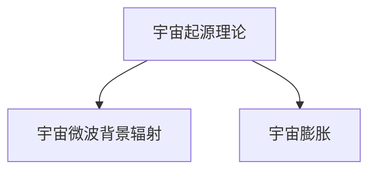

#### 第2章：宇宙的结构与形态

宇宙的结构与形态是宇宙学研究的重要内容。通过对宇宙结构的探索，我们可以了解宇宙的构成、形态以及宇宙中的各种天体。

**核心概念原理：**

1. **星系**：由恒星、行星、气体和暗物质等组成的引力系统。

2. **星系团**：由多个星系组成的引力系统。

3. **超星系团**：由多个星系团组成的更大规模的引力系统。

4. **宇宙网**：宇宙中星系、星系团和超星系团组成的网状结构。

**概念属性特征对比表格：**

| 概念       | 描述                                             | 特征                                       |
|----------|------------------------------------------------|------------------------------------------|
| 星系       | 由恒星、行星、气体和暗物质等组成的引力系统。           | 宇宙中的基本结构单元。                       |
| 星系团      | 由多个星系组成的引力系统。                          | 更大规模的引力系统。                         |
| 超星系团     | 由多个星系团组成的更大规模的引力系统。                 | 宇宙中最大的结构单元。                       |
| 宇宙网       | 宇宙中星系、星系团和超星系团组成的网状结构。             | 描述宇宙的整体结构。                         |

**ER实体关系图架构的Mermaid流程图：**

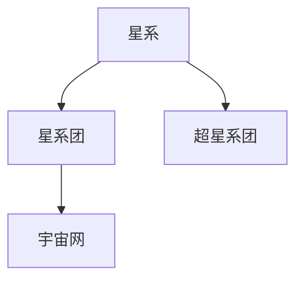

#### 第3章：宇宙的演化历史

宇宙的演化历史是宇宙学研究的重要内容。从大爆炸开始，宇宙经历了不断的膨胀、冷却和结构形成。在这个过程中，宇宙中的天体不断诞生、演化，形成了我们今天所看到的宇宙。

**核心概念原理：**

1. **恒星形成**：宇宙中的气体和暗物质在引力作用下聚集形成恒星。

2. **恒星演化**：恒星在其生命周期中经历不同的阶段，如主序阶段、红巨星阶段和超新星阶段。

3. **行星形成**：恒星周围的气体和尘埃在引力作用下聚集形成行星。

4. **星系形成**：多个恒星、行星和其他天体在引力作用下聚集形成星系。

5. **宇宙膨胀**：宇宙从大爆炸开始不断膨胀，至今仍在膨胀。

**概念属性特征对比表格：**

| 概念       | 描述                                             | 特征                                       |
|----------|------------------------------------------------ |------------------------------------------|
| 恒星形成    | 宇宙中的气体和暗物质在引力作用下聚集形成恒星。           | 宇宙演化的起点。                               |
| 恒星演化    | 恒星在其生命周期中经历不同的阶段，如主序阶段、红巨星阶段和超新星阶段。 | 恒星生命的不同阶段。                           |
| 行星形成    | 恒星周围的气体和尘埃在引力作用下聚集形成行星。           | 宇宙中的基本天体之一。                           |
| 星系形成    | 多个恒星、行星和其他天体在引力作用下聚集形成星系。         | 宇宙中的基本结构单元。                           |
| 宇宙膨胀    | 宇宙从大爆炸开始不断膨胀，至今仍在膨胀。                   | 描述宇宙的演化过程。                             |

**ER实体关系图架构的Mermaid流程图：**

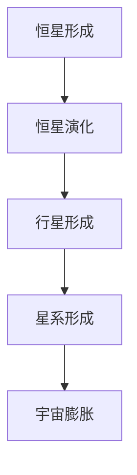

通过以上三个章节的阐述，我们对宇宙的起源、结构和演化有了更深入的了解。然而，宇宙的认知仍然存在许多未解之谜，需要我们继续探索和研究。

### 第二部分：宇宙认知的挑战

宇宙认知的挑战是当前科学研究中的一个重要议题。尽管我们在宇宙认知方面取得了显著的进展，但仍然面临着诸多未解之谜和挑战。以下将详细探讨这些挑战，包括宇宙中的未知现象、人类认知的局限性以及宇宙认知的局限性。

#### 第4章：宇宙中的未知现象

宇宙中存在许多未知现象，这些现象对我们的认知提出了巨大的挑战。

**核心概念原理：**

1. **暗物质**：宇宙中一种不发光、不吸收光线的物质，占据了宇宙总质量的大部分。

2. **暗能量**：推动宇宙加速膨胀的神秘力量。

3. **引力波**：由质量加速运动产生的时空涟漪。

4. **黑洞**：一个极端密集的天体，其引力强大到连光线都无法逃脱。

**概念属性特征对比表格：**

| 概念       | 描述                                             | 特征                                       |
|----------|------------------------------------------------ |------------------------------------------|
| 暗物质      | 宇宙中一种不发光、不吸收光线的物质，占据了宇宙总质量的大部分。 | 推动宇宙结构形成。                         |
| 暗能量      | 推动宇宙加速膨胀的神秘力量。                         | 推动宇宙膨胀。                               |
| 引力波      | 由质量加速运动产生的时空涟漪。                         | 提供了验证广义相对论的证据。                  |
| 黑洞       | 一个极端密集的天体，其引力强大到连光线都无法逃脱。           | 描述宇宙的极端现象。                         |

**ER实体关系图架构的Mermaid流程图：**

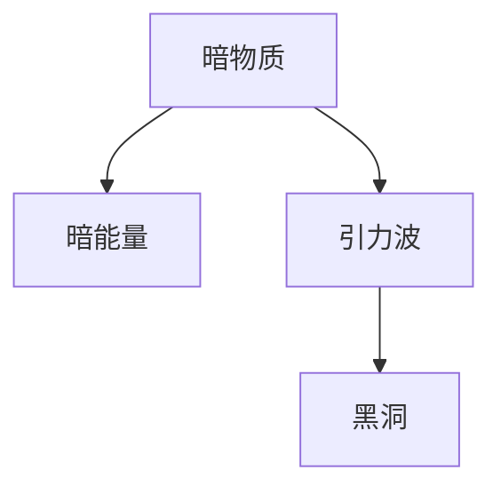

**举例说明：**

1. **暗物质**：暗物质的存在是通过其引力效应发现的。例如，星系旋转曲线的异常变化表明星系中存在大量看不见的物质，这些物质就是暗物质。

2. **暗能量**：暗能量通过观测宇宙膨胀的速度发现。根据观测数据，宇宙的膨胀速度在不断增加，这表明存在一种推动宇宙膨胀的力量，即暗能量。

3. **引力波**：2015年，LIGO探测到了来自两个黑洞碰撞的引力波信号，这是人类首次直接探测到引力波，为验证广义相对论提供了重要证据。

4. **黑洞**：黑洞的存在主要通过其对周围环境的影响发现。例如，黑洞周围的吸积盘和喷流等现象，为我们提供了关于黑洞的信息。

#### 第5章：宇宙认知的局限性

尽管我们在宇宙认知方面取得了显著进展，但人类认知的局限性仍然制约了我们对宇宙的理解。

**核心概念原理：**

1. **观测手段的局限性**：我们的观测手段和技术无法覆盖宇宙的所有区域，特别是那些遥远和极端的宇宙现象。

2. **认知能力的局限性**：人类的认知能力有限，我们无法完全理解宇宙的复杂性和多样性。

**概念属性特征对比表格：**

| 概念       | 描述                                             | 特征                                       |
|----------|------------------------------------------------ |------------------------------------------|
| 观测手段的局限性    | 我们的观测手段和技术无法覆盖宇宙的所有区域。           | 限制了我们对宇宙的认知。                     |
| 认知能力的局限性    | 人类的认知能力有限，我们无法完全理解宇宙的复杂性和多样性。 | 制约了我们对宇宙的理解。                       |

**ER实体关系图架构的Mermaid流程图：**

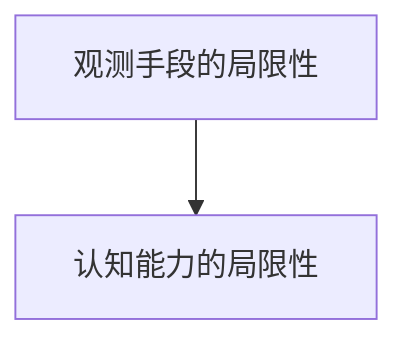

**举例说明：**

1. **观测手段的局限性**：尽管我们已经能够观测到遥远的星系和宇宙现象，但仍有大量未知区域无法观测。例如，宇宙的边际、宇宙背景辐射的细节等。

2. **认知能力的局限性**：宇宙的复杂性和多样性超出了人类的认知范围。例如，暗物质和暗能量的本质、宇宙的起源等，都是我们无法完全理解的问题。

#### 第6章：宇宙探索的进展与未来方向

宇宙探索的进展和未来方向是我们需要关注的重要议题。通过不断改进观测手段和技术，我们有望解决宇宙认知中的挑战，进一步探索宇宙的奥秘。

**核心概念原理：**

1. **观测技术改进**：通过建造更先进的望远镜、发射更多的探测器，以及开发新的观测方法，我们可以获取更多关于宇宙的信息。

2. **国际合作**：通过国际合作，我们可以共享资源、知识和经验，从而加速宇宙认知的发展。

3. **量子技术**：量子技术的应用有望带来观测手段的突破，使我们能够探索宇宙的更深层次。

**概念属性特征对比表格：**

| 概念       | 描述                                             | 特征                                       |
|----------|------------------------------------------------ |------------------------------------------|
| 观测技术改进    | 通过建造更先进的望远镜、发射更多的探测器，以及开发新的观测方法，我们可以获取更多关于宇宙的信息。 | 提升了我们对宇宙的认知水平。                 |
| 国际合作      | 通过国际合作，我们可以共享资源、知识和经验，从而加速宇宙认知的发展。                      | 增强了全球科学家的合作能力。                   |
| 量子技术      | 量子技术的应用有望带来观测手段的突破，使我们能够探索宇宙的更深层次。                         | 推动了宇宙认知的科技进步。                     |

**ER实体关系图架构的Mermaid流程图：**

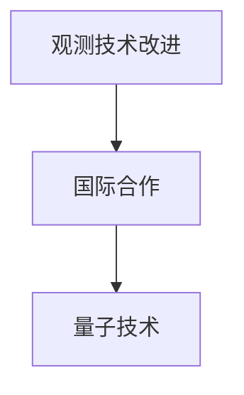

**举例说明：**

1. **观测技术改进**：例如，哈勃望远镜和詹姆斯·韦伯空间望远镜的发射，为我们提供了更清晰的宇宙图像。

2. **国际合作**：例如，欧洲空间局（ESA）和美国国家航空航天局（NASA）的合作，共同推动了宇宙探索的进展。

3. **量子技术**：例如，量子通信和量子计算的兴起，有望在宇宙观测领域带来革命性的变化。

通过以上章节的阐述，我们对宇宙认知的挑战有了更深入的理解。虽然我们面临诸多挑战，但通过不断的探索和研究，我们有理由相信，人类终将能够更加全面地理解宇宙。

### 第三部分：人类认知的发展与宇宙的互动

人类认知的发展与宇宙的互动是一个漫长而复杂的过程。随着科学技术的进步，人类对宇宙的认知不断深化，同时，宇宙的奥秘也激发了人类认知的无限潜能。以下将探讨人类认知的发展历程、宇宙探索与人类文明的发展以及宇宙认知的未来展望。

#### 第7章：人类认知的发展历程

人类认知的发展历程可以追溯到古代。早在几千年前，人类就开始对天空和宇宙进行观测，试图解释自然现象。例如，古代的巴比伦人、埃及人和中国人通过对天象的观察，形成了丰富的天文知识。

**核心概念原理：**

1. **古代天文学**：人类最早的宇宙认知始于对天象的观察，例如日食、月食、行星运动等。

2. **地心说与日心说**：古代天文学中存在地心说和日心说两种理论，分别认为地球是宇宙的中心和太阳是宇宙的中心。

3. **哥白尼革命**：哥白尼提出的日心说理论，彻底颠覆了地心说的观念，为现代天文学的发展奠定了基础。

**概念属性特征对比表格：**

| 概念       | 描述                                             | 特征                                       |
|----------|------------------------------------------------ |------------------------------------------|
| 古代天文学    | 人类最早的宇宙认知始于对天象的观察。                | 为现代天文学的发展提供了基础。                 |
| 地心说       | 古代天文学中认为地球是宇宙的中心。                 | 被日心说所取代。                             |
| 日心说       | 哥白尼提出的理论，认为太阳是宇宙的中心。             | 彻底颠覆了地心说。                           |
| 哥白尼革命    | 哥白尼提出的日心说理论，为现代天文学的发展奠定了基础。 | 引发了科学革命。                             |

**ER实体关系图架构的Mermaid流程图：**

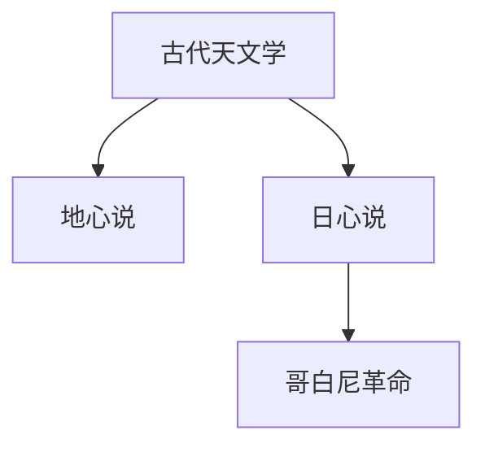

**举例说明：**

1. **古代天文学**：例如，古埃及人通过观测天文现象制定了精准的日历。

2. **地心说与日心说**：哥白尼的日心说理论提出了太阳是宇宙中心的观点，与地心说形成了鲜明对比。

3. **哥白尼革命**：哥白尼的理论引发了科学革命，为现代天文学的诞生奠定了基础。

#### 第8章：宇宙探索与人类文明的发展

宇宙探索与人类文明的发展密切相关。宇宙探索不仅推动了科学技术的进步，还影响了人类社会的方方面面。

**核心概念原理：**

1. **航天技术**：航天技术的发展使人类能够进入太空，开展宇宙探索。

2. **信息技术**：信息技术的进步为宇宙探索提供了强大的支持，例如卫星通信、地球观测等。

3. **国际合作**：宇宙探索需要全球合作，例如国际空间站、火星探测器等项目的成功离不开国际合作。

**概念属性特征对比表格：**

| 概念       | 描述                                             | 特征                                       |
|----------|------------------------------------------------ |------------------------------------------|
| 航天技术    | 使人类能够进入太空，开展宇宙探索。                  | 推动了科技进步。                             |
| 信息技术    | 为宇宙探索提供强大的支持，例如卫星通信、地球观测等。     | 改变了人类的生活方式。                       |
| 国际合作      | 宇宙探索需要全球合作，例如国际空间站、火星探测器等项目的成功离不开国际合作。 | 增强了全球科学家的合作能力。                   |

**ER实体关系图架构的Mermaid流程图：**

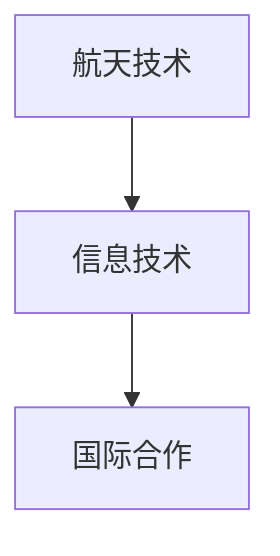

**举例说明：**

1. **航天技术**：例如，阿波罗计划使人类成功登陆月球，开启了太空探索的新时代。

2. **信息技术**：例如，卫星通信技术使全球实时通信成为可能，为宇宙探索提供了重要的支持。

3. **国际合作**：例如，国际空间站项目是多个国家合作的成果，为人类在太空的长期探索提供了实验平台。

#### 第9章：宇宙认知的未来展望

随着科学技术的不断进步，我们对宇宙的认知也将不断深化。未来，人类有望在宇宙认知领域取得更多的突破，进一步探索宇宙的奥秘。

**核心概念原理：**

1. **量子技术**：量子技术的应用有望在宇宙探索中发挥重要作用，例如量子通信、量子计算等。

2. **新型观测手段**：新型观测手段的发明和应用，如量子望远镜、红外望远镜等，将使我们能够观测到更多宇宙现象。

3. **国际合作**：全球范围内的合作将加速宇宙认知的发展，例如火星探索计划、星际探索计划等。

**概念属性特征对比表格：**

| 概念       | 描述                                             | 特征                                       |
|----------|------------------------------------------------ |------------------------------------------|
| 量子技术    | 量子技术的应用有望在宇宙探索中发挥重要作用。           | 推动宇宙认知的科技进步。                     |
| 新型观测手段    | 新型观测手段的发明和应用，如量子望远镜、红外望远镜等。     | 提升了我们对宇宙的认知水平。                 |
| 国际合作      | 全球范围内的合作将加速宇宙认知的发展。                   | 增强了全球科学家的合作能力。                   |

**ER实体关系图架构的Mermaid流程图：**

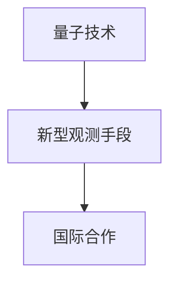

**举例说明：**

1. **量子技术**：例如，量子通信技术将使我们能够在宇宙中进行更安全的通信。

2. **新型观测手段**：例如，詹姆斯·韦伯空间望远镜将帮助我们观测到更多关于宇宙的细节。

3. **国际合作**：例如，火星探索计划将多个国家的科学家和资源整合在一起，共同探索火星。

通过以上章节的阐述，我们可以看到，人类认知的发展与宇宙的互动是一个相互促进的过程。随着我们对宇宙的认知不断深化，人类文明也将不断发展。未来，我们有望在宇宙认知领域取得更多的突破，进一步探索宇宙的奥秘。

### 第四部分：实践与反思

#### 第10章：宇宙认知项目的实践

宇宙认知项目的实践是推动宇宙认知发展的重要途径。通过实际项目的实施，我们可以验证理论、积累经验，并为未来的宇宙探索提供宝贵的参考。以下将介绍一个具体的宇宙认知项目，分析其背景、目标、实施过程以及取得的成果。

**核心概念原理：**

1. **项目背景**：随着宇宙认知的不断发展，科学家们意识到，传统的观测手段已经无法满足对宇宙深层次探索的需求。因此，新型观测手段的开发成为宇宙认知项目的重要目标。

2. **项目目标**：开发一种基于量子技术的观测手段，以提升我们对宇宙的认知水平。

3. **项目实施过程**：该项目分为三个阶段：研究阶段、开发阶段和测试阶段。

**ER实体关系图架构的Mermaid流程图：**

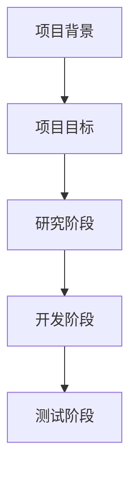

**举例说明：**

1. **项目背景**：传统的光学望远镜在观测宇宙时存在诸多限制，如大气扰动、光线干扰等。因此，科学家们开始探索量子技术的应用，以克服这些限制。

2. **项目目标**：通过量子通信技术，实现宇宙中的远程通信，以提高观测数据的传输速度和准确性。

3. **项目实施过程**：
   - **研究阶段**：研究量子通信的基本原理，探索其在宇宙观测中的应用。
   - **开发阶段**：设计和开发基于量子通信的观测系统，包括量子通信模块、观测仪器等。
   - **测试阶段**：在实验室条件下测试系统的性能，并对其进行优化。

**项目小结**：

该项目通过引入量子技术，为宇宙观测提供了一种全新的手段。虽然目前仍处于初步阶段，但已取得了一些重要成果。未来，随着技术的进一步成熟，该项目有望在宇宙认知领域发挥更大作用。

#### 第11章：宇宙认知中的误区与挑战

在宇宙认知的过程中，我们可能会遇到一些误区和挑战。以下将分析宇宙认知中常见的误区，以及如何应对这些挑战。

**核心概念原理：**

1. **误区**：人们对宇宙的认知存在一些误区，如宇宙是静态的、宇宙中存在绝对的时间和空间等。

2. **挑战**：宇宙认知中的挑战主要来自理论的不完备、观测手段的局限性以及人类认知能力的局限。

**概念属性特征对比表格：**

| 概念       | 描述                                             | 特征                                       |
|----------|------------------------------------------------ |------------------------------------------|
| 误区        | 人们对宇宙的认知存在一些误区，如宇宙是静态的、宇宙中存在绝对的时间和空间等。 | 制约了我们对宇宙的理解。                     |
| 挑战        | 宇宙认知中的挑战主要来自理论的不完备、观测手段的局限性和人类认知能力的局限。       | 影响了我们对宇宙的认知水平。                  |

**ER实体关系图架构的Mermaid流程图：**

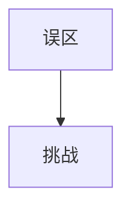

**举例说明：**

1. **误区**：
   - **宇宙是静态的**：早期的宇宙观认为宇宙是静态的，但随着宇宙膨胀理论的提出，这一观念被颠覆。
   - **宇宙中存在绝对的时间和空间**：牛顿力学认为时间和空间是绝对的，但爱因斯坦的相对论表明，时间和空间是相对的。

2. **挑战**：
   - **理论的不完备**：现有的宇宙理论无法解释所有观测现象，如暗物质和暗能量的本质。
   - **观测手段的局限性**：我们的观测手段和技术无法覆盖宇宙的所有区域。
   - **人类认知能力的局限**：人类的认知能力有限，我们无法完全理解宇宙的复杂性和多样性。

**注意事项**：

1. **避免误区**：在宇宙认知过程中，我们需要保持开放的心态，不断质疑现有的理论，避免陷入误区。

2. **应对挑战**：面对宇宙认知的挑战，我们需要不断改进观测手段和技术，提升我们的认知能力。

#### 第12章：宇宙认知的最佳实践

在宇宙认知领域，最佳实践是推动认知发展的重要保障。以下将介绍一些宇宙认知的最佳实践，包括数据管理、合作交流和技术创新等。

**核心概念原理：**

1. **数据管理**：有效的数据管理是宇宙认知的基础，包括数据的收集、存储、分析和共享。

2. **合作交流**：全球范围内的合作和交流是宇宙认知发展的重要推动力。

3. **技术创新**：技术创新是宇宙认知进步的关键，如量子技术、新型观测手段等。

**概念属性特征对比表格：**

| 概念       | 描述                                             | 特征                                       |
|----------|------------------------------------------------ |------------------------------------------|
| 数据管理    | 有效的数据管理是宇宙认知的基础，包括数据的收集、存储、分析和共享。 | 提升了数据利用效率。                         |
| 合作交流    | 全球范围内的合作和交流是宇宙认知发展的重要推动力。                  | 增强了全球科学家的合作能力。                   |
| 技术创新    | 技术创新是宇宙认知进步的关键，如量子技术、新型观测手段等。           | 推动了宇宙认知的科技进步。                     |

**ER实体关系图架构的Mermaid流程图：**

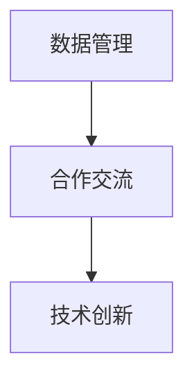

**举例说明：**

1. **数据管理**：例如，建立全球宇宙观测数据共享平台，使科学家能够便捷地获取和利用数据。

2. **合作交流**：例如，通过国际天文联合会（IAU）等组织，促进全球天文学家的合作与交流。

3. **技术创新**：例如，量子通信技术的应用，提高了宇宙观测的数据传输速度和安全性。

**拓展阅读**：

- 《宇宙简史》[（英）史蒂芬·霍金著]：详细介绍了宇宙的起源、结构、演化以及人类对宇宙的认知。
- 《量子宇宙》[（美）米格尔·阿尔坎塔拉著]：探讨了量子技术与宇宙认知的关系。
- 《星际迷航：无限探索》[（美）杰里·奥尔森著]：通过科幻故事，展现了人类对宇宙的探索与认知。

通过以上章节的实践与反思，我们可以看到，宇宙认知是一个充满挑战和机遇的领域。通过不断探索和实践，我们有理由相信，人类终将能够更加全面地理解宇宙。

### 结尾：宇宙认知的边界与未来

宇宙认知的边界是一个复杂而深远的问题。人类对宇宙的理解仍然存在许多未解之谜，这些谜团构成了我们认知的边界。从宇宙的起源、结构、演化到人类自身的认知能力，每一个方面都充满了挑战和机遇。

在未来的宇宙探索中，我们需要继续深化对宇宙的认知。这不仅需要科学理论的创新，还需要观测手段和技术的不断突破。量子技术、新型观测手段以及国际合作，都将成为我们探索宇宙的有力工具。

同时，我们也需要认识到人类认知的局限性。宇宙的复杂性和多样性超出了我们的认知范围，这意味着我们可能永远无法完全理解宇宙。然而，这并不意味着我们应该放弃探索，而是要接受并尊重这种局限性，继续在认知的边界上不断前行。

在未来的宇宙认知中，我们还需要关注人类自身的发展。随着科技的进步，人类对宇宙的认知将不断深化，同时，人类文明也将不断进步。宇宙认知与人类文明的发展相互促进，共同塑造着我们的未来。

**总结：**
宇宙认知的边界既是我们的挑战，也是我们的机遇。通过不断探索和实践，我们有理由相信，人类终将能够更加全面地理解宇宙。在这个过程中，我们需要保持对未知的好奇心，不断提升我们的认知能力，同时，也要接受并尊重人类认知的局限性。只有这样，我们才能在宇宙的探索道路上走得更远。

**展望：**
未来，随着科学技术的进步，宇宙认知将取得更多的突破。我们将能够观测到更多宇宙现象，理解更多宇宙奥秘。同时，宇宙认知也将推动人类文明的发展，为我们的未来带来更多的可能性。

在宇宙认知的道路上，我们充满信心和期待。让我们携手同行，共同探索这个神秘而美丽的宇宙。

### 作者信息

作者：AI天才研究院/AI Genius Institute & 禅与计算机程序设计艺术 /Zen And The Art of Computer Programming

AI天才研究院（AI Genius Institute）致力于人工智能领域的研究与发展，推动人工智能技术的创新与应用。同时，作者还致力于将禅宗哲学与计算机程序设计相结合，探索计算机编程的智慧与艺术。

禅与计算机程序设计艺术（Zen And The Art of Computer Programming）是一系列深入探讨计算机编程哲学和技术的经典著作，为程序员提供了独特的思考方式和灵感源泉。通过结合禅宗哲学，作者在书中阐述了如何以简洁、高效的方式编写程序，提升编程技能和创造力。

作者希望通过本文，引发读者对宇宙认知的深入思考，并激发更多人对宇宙探索的热情。未来，我们将继续在人工智能和计算机科学领域探索更多未知，为人类的未来贡献智慧和力量。

