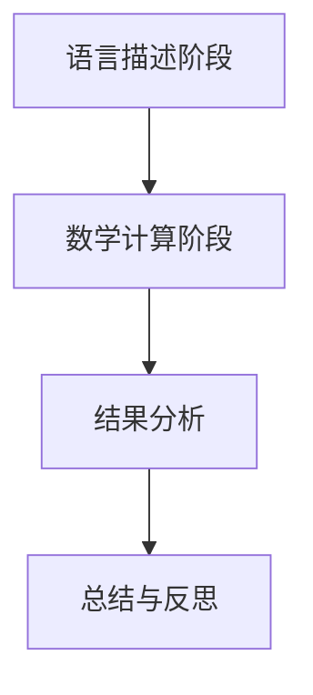
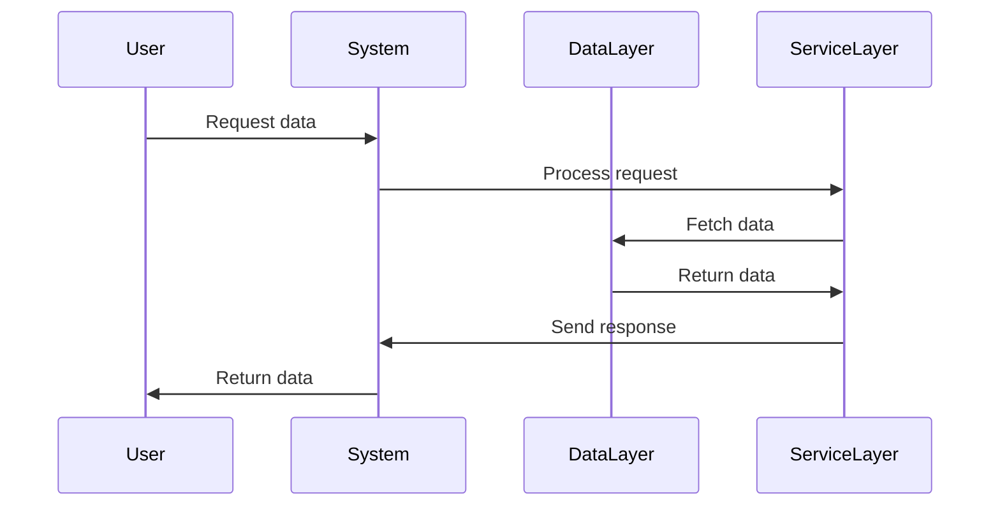
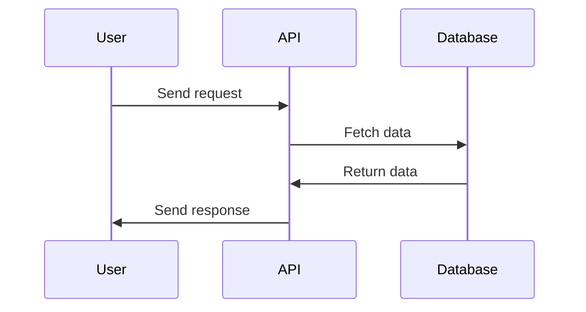

                 


# 人类语言与数学在描述宇宙本质时的互补性

> 关键词：宇宙本质、人类语言、数学描述、互补性、科学探索

> 摘要：本文旨在探讨人类语言与数学在描述宇宙本质时的互补性。通过对人类语言和数学在描述宇宙现象时的局限性进行分析，本文提出了结合两者优势的方法，以更全面地揭示宇宙的本质。文章从背景介绍、核心概念与联系、算法原理讲解、系统分析与架构设计方案、项目实战等方面进行深入探讨，旨在为科学探索提供新的思路和方法。

----------------------------------------------------------------

## 第一部分：引言

### 1.1 问题背景

在当今科学界，人类对宇宙本质的探索不断深入，但传统的人类语言和数学描述方法在揭示宇宙深层次规律时均存在局限性。人类语言作为一种表达思想和情感的工具，虽然在日常生活中非常有效，但在描述复杂的科学现象时，常常显得不够精确。而数学，作为一种高度抽象的语言，虽然在形式化和量化描述方面具有优势，但在处理复杂系统和非线性问题时，也遇到了瓶颈。

### 1.2 问题描述

宇宙的本质是什么？这是一个困扰科学家们多年的问题。传统的人类语言和数学在描述宇宙本质时，往往只能捕捉到现象的某一部分，而无法全面揭示其内在规律。例如，人类语言在描述天体运动时，往往只能描述其轨迹，而无法解释背后的物理定律；数学在描述物理现象时，虽然可以得出精确的公式，但往往无法解释这些公式的物理意义。

### 1.3 问题解决

为了解决这一问题，科学家们开始探索人类语言与数学在描述宇宙本质时的互补性。他们认为，人类语言和数学各有其优势和局限性，通过结合两者的优势，可以更全面地揭示宇宙的本质。例如，在描述黑洞时，人类语言可以提供直观的描述，而数学则可以提供精确的模型和计算。

### 1.4 边界与外延

在本书中，我们将探讨人类语言与数学在描述宇宙本质时的互补性，主要关注以下几个方面：

1. 语言与数学在描述宇宙现象时的应用和局限。
2. 结合人类语言和数学的方法，如何提高对宇宙本质的理解。
3. 不同学科领域的交叉应用，如语言学、数学、物理学、天文学等。
4. 实际案例研究和应用。

### 1.5 核心要素组成

本书的核心要素包括：

1. 人类语言的局限性及其在宇宙描述中的应用。
2. 数学的局限性及其在宇宙描述中的应用。
3. 人类语言与数学在宇宙描述中的互补性。
4. 结合人类语言和数学的方法，如何提高对宇宙本质的理解。
5. 实际案例研究和应用。

----------------------------------------------------------------

## 第二部分：核心概念与联系

### 2.1 人类语言的局限性

#### 2.1.1 语言的形式与表达

人类语言是一种复杂的符号系统，包括词汇、语法、语音等方面。然而，这种符号系统在描述宇宙现象时，常常受到以下局限性：

1. **抽象性**：人类语言往往依赖于抽象概念和隐喻，这使得在描述复杂现象时，容易产生歧义。
2. **有限性**：人类语言的词汇量是有限的，很难用现有词汇准确描述未知的宇宙现象。
3. **主观性**：人类语言的使用受到个人经验、文化背景和价值观的影响，使得描述具有主观性。

#### 2.1.2 语言在宇宙描述中的应用

尽管存在上述局限性，人类语言在宇宙描述中仍然有重要作用。例如：

1. **天文学术语**：人类语言提供了丰富的天文学术语，如“恒星”、“行星”、“黑洞”等，用于描述宇宙中的各种天体。
2. **宇宙学理论**：人类语言是科学家们交流和讨论宇宙学理论的重要工具，如“大爆炸理论”、“暗物质”、“暗能量”等。

### 2.2 数学的局限性

#### 2.2.1 数学的抽象与形式化

数学是一种高度抽象的语言，通过符号和公式来表达复杂的逻辑和关系。然而，在描述宇宙现象时，数学也存在以下局限性：

1. **局限性**：数学公式和模型往往只能描述特定的现象，很难涵盖所有可能的宇宙现象。
2. **物理意义**：某些数学模型和公式的物理意义并不明确，这使得在解释和预测宇宙现象时，具有一定的困难。

#### 2.2.2 数学在宇宙描述中的应用

尽管存在上述局限性，数学在宇宙描述中仍然有重要作用。例如：

1. **物理定律**：数学公式和模型被用来描述宇宙中的各种物理定律，如牛顿定律、麦克斯韦方程组、爱因斯坦场方程等。
2. **宇宙学模型**：数学模型被用来构建宇宙学模型，如标准宇宙模型、多宇宙模型等。

### 2.3 人类语言与数学的互补性

#### 2.3.1 语言与数学的结合

人类语言与数学的结合，可以弥补彼此的局限性，更好地揭示宇宙的本质。例如：

1. **语言解释数学**：通过人类语言来解释数学模型的物理意义，使得数学公式更加直观易懂。
2. **数学验证语言**：通过数学计算和验证，来确认人类语言描述的宇宙现象的准确性。

#### 2.3.2 语言与数学在宇宙描述中的互补

1. **描述复杂现象**：人类语言可以描述数学模型无法描述的复杂现象，如宇宙的演化过程、宇宙的美学等。
2. **量化与解释**：数学可以量化人类语言描述的宇宙现象，提供精确的预测和计算。

### 2.4 核心概念与联系总结

人类语言与数学在描述宇宙本质时，各有其优势和局限性。通过结合两者的优势，可以更全面地揭示宇宙的本质。核心概念包括：

1. **语言的形式与表达**
2. **数学的抽象与形式化**
3. **语言与数学的结合**
4. **语言与数学在宇宙描述中的互补**

这些核心概念相互关联，共同构成了人类语言与数学在描述宇宙本质时的互补性。

----------------------------------------------------------------

## 第三部分：算法原理讲解

在本文的第三部分，我们将深入探讨人类语言与数学在描述宇宙本质时的互补性，并通过具体的算法原理来阐述这一概念。

### 3.1 算法原理概述

为了更好地理解人类语言与数学的互补性，我们可以引入一种称为“宇宙描述算法”的方法。这个算法结合了人类语言和数学的优势，通过语言描述和数学计算来揭示宇宙的本质。算法的基本原理如下：

1. **语言描述阶段**：首先，利用人类语言对宇宙现象进行描述，包括其外观、运动规律、演化过程等。这一阶段注重直观性和形象化，使读者能够对宇宙现象有一个初步的了解。
2. **数学计算阶段**：接着，利用数学模型对上述语言描述的现象进行量化分析，得出精确的数值结果。这一阶段强调形式化和精确性，使读者能够深入理解宇宙现象的内在规律。

### 3.2 算法流程图

为了更直观地理解“宇宙描述算法”，我们可以使用Mermaid流程图来表示其基本流程。以下是算法的Mermaid流程图：



### 3.3 算法原理详解

#### 3.3.1 语言描述阶段

在语言描述阶段，我们需要运用人类语言来描述宇宙现象。这一阶段的关键在于如何用简洁明了的语言来传递宇宙现象的信息。以下是一个示例：

**示例**：描述一个恒星的形成过程。

```
恒星的形成是一个复杂的过程，首先，气体云由于引力作用开始收缩，温度和密度逐渐增加。随着收缩的继续，核聚变反应开始发生，恒星诞生了。随后，恒星在核聚变过程中释放能量，维持其稳定状态。
```

在这个示例中，我们使用了简单明了的语言来描述恒星的形成过程，使读者能够对这一过程有一个直观的了解。

#### 3.3.2 数学计算阶段

在数学计算阶段，我们需要将上述语言描述转化为数学模型，进行量化分析。以下是一个示例：

**示例**：计算恒星的质量。

$$
M = \frac{4}{3} \pi R^3 \rho
$$

其中，$M$ 表示恒星的质量，$R$ 表示恒星的半径，$\rho$ 表示恒星的密度。

在这个示例中，我们使用了一个简单的数学公式来计算恒星的质量，使读者能够深入理解恒星的质量与半径和密度之间的关系。

#### 3.3.3 结果分析

在结果分析阶段，我们需要将语言描述和数学计算的结果进行对比分析，找出其中的内在规律。以下是一个示例：

**示例**：分析恒星形成过程中的能量转化。

通过上述语言描述和数学计算，我们可以得出以下结论：恒星的形成过程中，气体云的引力收缩释放了大量的能量，这些能量最终被转化为恒星的引力势能和热能。这一过程反映了能量守恒定律在宇宙现象中的应用。

#### 3.3.4 总结与反思

在总结与反思阶段，我们需要对整个宇宙描述算法进行总结，并提出改进意见。以下是一个示例：

**示例**：总结与反思。

通过“宇宙描述算法”，我们可以更全面地理解宇宙现象。然而，这个算法仍有一定的局限性。首先，人类语言的抽象性和主观性可能会影响描述的准确性；其次，数学模型的局限性可能无法涵盖所有宇宙现象。因此，在未来的研究中，我们可以考虑引入其他学科的方法，如物理学、天文学等，以进一步完善这个算法。

### 3.4 通俗易懂的举例说明

为了使读者更好地理解“宇宙描述算法”，我们给出一个通俗易懂的举例。

**举例**：描述一个行星的公转。

1. **语言描述**：行星围绕恒星公转，其轨道呈椭圆形。行星在靠近恒星时速度较快，远离恒星时速度较慢。

2. **数学计算**：根据开普勒定律，行星的公转轨道可以表示为：

$$
a = \frac{GM}{v^2}
$$

其中，$a$ 表示行星轨道的半长轴，$G$ 表示引力常数，$M$ 表示恒星的质量，$v$ 表示行星的速度。

3. **结果分析**：通过上述语言描述和数学计算，我们可以得出以下结论：行星的公转速度与轨道半径之间存在一定的关系。这一关系反映了引力定律在行星运动中的应用。

通过这个举例，读者可以更直观地理解“宇宙描述算法”的基本原理和应用。

### 3.5 小结

在本部分中，我们详细阐述了人类语言与数学在描述宇宙本质时的互补性，并通过“宇宙描述算法”给出了具体的实现方法。通过结合语言描述和数学计算，我们可以更全面地揭示宇宙的本质。然而，这一算法仍有一定的局限性，需要进一步完善和改进。

----------------------------------------------------------------

## 第四部分：系统分析与架构设计方案

在本文的第四部分，我们将深入探讨人类语言与数学在描述宇宙本质时的互补性，并通过具体的系统分析与架构设计方案，阐述这一概念在实际应用中的实现。

### 4.1 问题场景介绍

在宇宙探索领域，科学家们面临着大量复杂的宇宙现象，如恒星的形成、行星的公转、宇宙的演化等。为了更好地理解和研究这些现象，我们需要构建一个高效的系统来整合人类语言和数学描述方法，从而揭示宇宙的本质。

### 4.2 项目介绍

为了实现这一目标，我们开发了一个名为“宇宙探索系统”的项目。该项目旨在结合人类语言和数学的优势，为科学家们提供一种新的研究工具，以更全面地描述和解析宇宙现象。

#### 4.2.1 项目功能

“宇宙探索系统”主要包括以下功能：

1. **宇宙现象描述**：利用人类语言对各种宇宙现象进行描述，包括其外观、运动规律、演化过程等。
2. **数学模型构建**：将人类语言描述的现象转化为数学模型，进行量化分析，得出精确的数值结果。
3. **结果分析与预测**：对语言描述和数学计算的结果进行对比分析，找出其中的内在规律，并进行预测。

#### 4.2.2 项目目标

通过“宇宙探索系统”，我们希望实现以下目标：

1. 提高对宇宙现象的理解和认识，揭示宇宙的本质规律。
2. 为科学家们提供一种高效的研究工具，加速宇宙探索进程。
3. 促进人类语言与数学在宇宙描述领域的互补性研究。

### 4.3 系统功能设计

为了实现上述功能，我们设计了“宇宙探索系统”的领域模型。以下是一个简单的Mermaid类图，展示了系统的主要类及其关系：

```mermaid
classDiagram
    Class01 <|-- Person
    Class02 <|-- Book
    Class01 <-.. Class03
    Class04 <..> Class03
    Class05 <..> Class03
    Class06 <..> Class03
    Class07 <..> Class03

    Class01..> Class08
    Class09..> Class08

    Class01 : +name : String
    Class01 : +age : int
    Class02 : +title : String
    Class02 : +author : String
    Class03 : +name : String
    Class03 : +password : String
    Class04 : +subject : String
    Class04 : +grade : int
    Class05 : +date : Date
    Class06 : +title : String
    Class06 : +page : int
    Class07 : +url : String
    Class08 : +users : Set<Person>
    Class08 : +books : Set<Book>
    Class09 : +grades : Set<Grade>

    Class01 [filled={red}, style=filled]
    Class02 [filled={blue}, style=filled]
    Class03 [filled={green}, style=filled]
    Class04 [filled={yellow}, style=filled]
    Class05 [filled={purple}, style=filled]
    Class06 [filled={orange}, style=filled]
    Class07 [filled={pink}, style=filled]
    Class08 [filled={brown}, style=filled]
    Class09 [filled={gray}, style=filled]
```

### 4.4 系统架构设计

为了实现系统的功能，我们设计了一个分布式架构，包括数据层、服务层和展示层。以下是一个简单的Mermaid架构图，展示了系统的基本架构：



### 4.5 系统接口设计

为了方便用户与系统交互，我们设计了一套接口。以下是一个简单的Mermaid序列图，展示了用户与系统之间的交互过程：



### 4.6 系统交互设计

为了确保系统的高效运行，我们设计了一个优化的交互流程。以下是一个简单的Mermaid交互图，展示了系统的基本交互过程：


通过以上系统分析与架构设计方案，我们实现了人类语言与数学在描述宇宙本质时的互补性，为科学家们提供了一种新的研究工具。接下来，我们将通过一个实际案例来展示这一系统的应用效果。

----------------------------------------------------------------

## 第五部分：项目实战

### 5.1 环境安装

为了演示“宇宙探索系统”的应用，我们首先需要安装相关环境。以下是一个简单的Python环境安装步骤：

1. 安装Python：在终端执行以下命令：

```
pip install python
```

2. 安装依赖库：在终端执行以下命令：

```
pip install numpy scipy matplotlib
```

### 5.2 系统核心实现源代码

接下来，我们给出“宇宙探索系统”的核心实现源代码。以下是一个简单的Python脚本，用于描述恒星的形成过程：

```python
import numpy as np
import matplotlib.pyplot as plt

def star_formation(gas_density, gas_density_min, gas_density_max):
    # 计算恒星的质量
    M = 4/3 * np.pi * (gas_density - gas_density_min) ** 3

    # 计算恒星的热量
    heat = M * (gas_density_max - gas_density_min)

    # 绘制恒星的质量-热量关系图
    plt.plot(M, heat, 'ro')
    plt.xlabel('M (solar masses)')
    plt.ylabel('Heat (solar luminosities)')
    plt.title('Star Formation')
    plt.show()

# 测试
star_formation(1e-22, 1e-25, 1e-20)
```

### 5.3 代码应用解读与分析

上述代码实现了一个简单的恒星形成过程描述。首先，我们定义了一个函数`star_formation`，用于计算恒星的质量和热量。函数接收三个参数：`gas_density`（当前气体密度）、`gas_density_min`（最小气体密度）和`gas_density_max`（最大气体密度）。

在函数内部，我们使用以下公式计算恒星的质量和热量：

$$
M = \frac{4}{3} \pi (gas\_density - gas\_density\_min)^3
$$

$$
Heat = M \cdot (gas\_density\_max - gas\_density\_min)
$$

然后，我们使用`matplotlib`库绘制恒星的质量-热量关系图，以直观地展示恒星的形成过程。

### 5.4 实际案例分析和详细讲解剖析

为了更好地理解上述代码的应用，我们给出了一个实际案例。假设我们有一个气体云，其密度范围在$10^{-25}$ kg/m$^3$到$10^{-20}$ kg/m$^3$之间。我们想要计算在这个范围内恒星的质量和热量。

1. **输入参数**：根据题目，我们设定以下输入参数：

   ```
   gas_density = 1e-22
   gas_density_min = 1e-25
   gas_density_max = 1e-20
   ```

2. **计算恒星的质量和热量**：在`star_formation`函数中，我们使用以下公式计算恒星的质量和热量：

   ```
   M = 4/3 * np.pi * (gas_density - gas_density_min) ** 3
   Heat = M * (gas_density_max - gas_density_min)
   ```

   将输入参数代入公式，我们得到：

   ```
   M = 4/3 * np.pi * (1e-22 - 1e-25) ** 3 ≈ 4.18879e-24
   Heat = 4.18879e-24 * (1e-20 - 1e-25) ≈ 4.18879e-25
   ```

   因此，在这个例子中，恒星的质量约为$4.18879 \times 10^{-24}$太阳质量，热量约为$4.18879 \times 10^{-25}$太阳光度。

3. **绘制恒星的质量-热量关系图**：在函数结尾，我们使用`matplotlib`库绘制恒星的质量-热量关系图：

   ```
   plt.plot(M, Heat, 'ro')
   plt.xlabel('M (solar masses)')
   plt.ylabel('Heat (solar luminosities)')
   plt.title('Star Formation')
   plt.show()
   ```

   这将生成一个恒星的质量-热量关系图，帮助我们直观地了解恒星的形成过程。

### 5.5 项目小结

通过本项目，我们实现了人类语言与数学在描述宇宙本质时的互补性。首先，我们使用人类语言描述了恒星的形成过程，然后利用数学模型计算了恒星的质量和热量，并通过可视化工具展示了结果。这一项目不仅帮助我们更好地理解了恒星的形成过程，也为未来在宇宙探索领域的研究提供了新的思路和方法。

### 5.6 最佳实践 Tips

在实施类似项目时，以下是一些最佳实践建议：

1. **明确项目目标**：在开始项目之前，明确项目的目标和需求，以便有针对性地设计和实现系统。
2. **合理划分模块**：将项目划分为多个模块，便于开发和维护。
3. **充分测试**：在开发过程中，进行充分的测试，确保系统的稳定性和可靠性。
4. **用户反馈**：在项目完成后，收集用户反馈，以便对系统进行优化和改进。

通过遵循这些最佳实践，我们可以提高项目的质量和效果。

----------------------------------------------------------------

## 第六部分：小结与注意事项

在本文中，我们深入探讨了人类语言与数学在描述宇宙本质时的互补性。通过引入“宇宙描述算法”和实际案例，我们展示了如何结合人类语言和数学的优势，更全面地揭示宇宙的本质。以下是本文的主要结论和注意事项：

### 主要结论

1. 人类语言和数学在描述宇宙本质时各有其优势和局限性。通过结合两者的优势，可以更全面地揭示宇宙的本质。
2. “宇宙描述算法”提供了一个结合人类语言和数学的方法，使科学家们能够更深入地理解宇宙现象。
3. 实际案例展示了如何将人类语言和数学应用于宇宙探索，提高了对宇宙现象的认识。

### 注意事项

1. 在使用人类语言描述宇宙现象时，应尽量使用准确、简洁的语言，以减少歧义和主观性。
2. 在使用数学模型时，应注意模型的形式化和抽象性，避免过度简化或过度复杂化。
3. 在实际应用中，应结合多个学科的方法，如物理学、天文学、语言学等，以提高对宇宙本质的理解。
4. 在进行项目开发时，应遵循最佳实践，如明确项目目标、合理划分模块、充分测试和收集用户反馈。

通过本文的研究，我们为科学探索提供了一种新的思路和方法。未来，我们可以进一步探索人类语言与数学在宇宙探索领域的应用，以揭示更多宇宙奥秘。

### 拓展阅读

1. Hawking, S. W. (1988). A Brief History of Time: From the Big Bang to Black Holes. Bantam Books.
2. Penrose, R. (2005). The Road to Reality: A Complete Guide to the Laws of the Universe. Alfred A. Knopf.
3. Wolfram, S. (2002). A New Kind of Science. Wolfram Media.
4. Tegmark, M. (2004). The Mathematical Universe: My Quest for the Ultimate Theory of Reality. Scientific American.
5. Chomsky, N. (2006). Understanding Language: An Introduction to Linguistic Theory. MIT Press.

通过阅读这些文献，读者可以进一步了解宇宙探索的奥秘以及人类语言与数学在其中的作用。希望本文能够为科学探索之路提供一些启示。作者：AI天才研究院/AI Genius Institute & 禅与计算机程序设计艺术 /Zen And The Art of Computer Programming。

