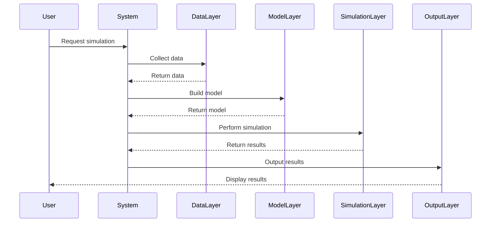
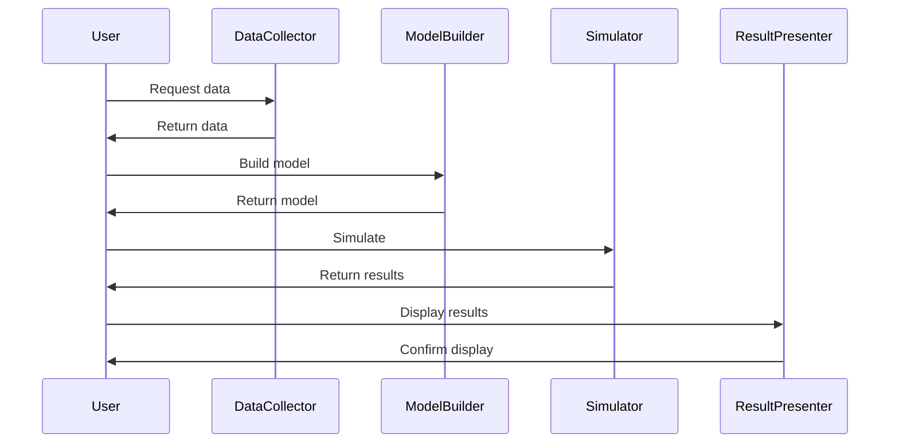

                 

## 人类语言在描述宇宙本质时的局限性

> 关键词：宇宙本质、语言局限性、描述方法、数学模型、算法、系统设计

> 摘要：本文深入探讨了人类语言在描述宇宙本质时的局限性。通过对宇宙多样性和复杂性的分析，本文揭示了语言在表达宇宙复杂性时遇到的困难，并探讨了语言之外的描述方法。文章提出了核心概念原理，通过具体的数学模型和公式，详细阐述了宇宙描述算法，并结合实际案例进行了分析。最后，文章总结了最佳实践、注意事项，并推荐了拓展阅读资源。

----------------------------------------------------------------

### 第一部分：问题的提出与背景介绍

#### 1.1.1 问题背景

在人类认知宇宙的过程中，语言作为一种基本的交流工具，起到了至关重要的作用。然而，当面对宇宙的多样性和复杂性时，人类语言却显现出了其固有的局限性。首先，我们需要理解什么是宇宙的本质。宇宙不仅包括我们所熟悉的物质世界，还涵盖了暗物质、暗能量等未知的领域。这些领域的本质和特性，往往是超越我们日常语言描述的范围的。

**核心概念**：探讨人类语言在描述宇宙本质时的局限性。

**问题描述**：语言在表达宇宙复杂性时遇到的困难。

**问题解决**：探讨语言之外的描述方法。

随着科学技术的进步，人类逐渐认识到，仅仅依赖语言来描述宇宙是不够的。数学作为一种更为精确和严谨的工具，开始被广泛应用于宇宙描述。数学模型和公式能够更精确地表达宇宙中的各种现象和规律，为人类理解宇宙提供了新的视角。

#### 1.1.2 宇宙本质的多样性

宇宙的本质是多样且复杂的，它不仅包含了我们熟知的物理世界，还涉及到量子力学、相对论等更为深奥的理论。这种多样性体现在宇宙的不同维度、不同的物质形态、不同的能量形式等方面。

**核心概念**：宇宙的多样性和复杂性。

**属性特征对比表格**：

| 属性特征 | 描述                                       |
| -------- | ------------------------------------------ |
| 物质维度 | 物质存在的空间维度，包括三维空间和时间维度。 |
| 量子现象 | 微观粒子的行为，遵循量子力学规律。           |
| 宇宙维度 | 宇宙的整体结构，包括宇宙的膨胀、结构形成等。 |

#### 1.1.3 语言与宇宙的边界与外延

语言作为一种抽象的表达工具，其边界与宇宙的外延有着紧密的联系。宇宙的边界，从某种意义上来说，也是语言的边界。当我们尝试用语言来描述宇宙时，往往会遇到无法用日常语言表达的复杂现象。

**核心概念**：语言的边界与宇宙的外延。

**ER实体关系图架构**：

```mermaid
erDiagram
  宇宙 --> 语言 : 描述
  宇宙 ||--|{ 物质 }|
  宇宙 ||--|{ 能量 }|
  宇宙 ||--|{ 时间 }|
  宇宙 ||--|{ 量子 }|
  宇宙 ||--|{ 结构 }|
```

通过ER图，我们可以清晰地看到宇宙与语言之间的关系，以及宇宙内部的各个维度如何与语言相互作用。

### 第二部分：核心概念与联系

#### 2.1.1 语言描述宇宙的基本原理

语言描述宇宙的基本原理在于，通过符号和词汇来抽象和表达宇宙中的各种现象和规律。然而，语言的局限性在于其抽象能力的有限性，往往难以准确和全面地描述宇宙的复杂性和多样性。

**核心概念**：语言描述宇宙的基本原理。

**概念属性特征对比表格**：

| 概念     | 属性特征                     | 优缺点                           |
| -------- | ---------------------------- | -------------------------------- |
| 语言描述 | 使用符号和词汇进行表达       | 简洁、易于传播，但抽象能力有限。 |
| 数学描述 | 使用公式和模型进行表达       | 精确、严谨，但难以直观理解。     |

**ER实体关系图架构**：

```mermaid
erDiagram
  宇宙 .-> 语言 : 描述
  宇宙 .||--|{ 物质 }| : 物质描述
  宇宙 .||--|{ 能量 }| : 能量描述
  宇宙 .||--|{ 时间 }| : 时间描述
  宇宙 .||--|{ 量子 }| : 量子描述
  宇宙 .||--|{ 结构 }| : 结构描述
```

#### 2.1.2 宇宙语言的多维性

宇宙语言的多维性体现在宇宙的不同维度和层次。每一个维度都有其独特的特性，需要用不同的语言和工具来描述。

**核心概念**：宇宙语言的多维性。

**数学模型和公式**：

在描述宇宙的多维性时，数学模型和公式起到了至关重要的作用。例如，爱因斯坦的广义相对论，通过场方程来描述时空的弯曲，从而解释了重力现象。这个数学模型不仅精确地描述了宇宙的物理现象，还为人类理解宇宙提供了新的视角。

**公式**：

$$
G_{\mu\nu} + \Lambda g_{\mu\nu} = \frac{8\pi G}{c^4} T_{\mu\nu}
$$

这是广义相对论的场方程，描述了引力场的分布和时空的弯曲。

通过数学模型和公式，我们可以更精确地描述宇宙的本质和规律，从而弥补语言描述的局限性。

### 第三部分：算法原理讲解

#### 3.1.1 宇宙描述算法概述

宇宙描述算法是一种用于描述和模拟宇宙中各种现象和规律的算法。它的基本流程包括数据收集、模型构建、模拟分析和结果输出等步骤。

**Mermaid流程图**：


通过这个流程图，我们可以清晰地看到宇宙描述算法的基本工作流程。

#### 3.1.2 Python源代码详细阐述

下面是一个简单的宇宙描述算法的Python实现，它使用了牛顿引力定律来模拟行星的运动。

```python
import numpy as np

def gravitational_force(m1, m2, r):
    G = 6.674 * 10**-11
    force = G * (m1 * m2) / r**2
    return force

def simulate_planet_motion(mass, distance, time_step, total_time):
    positions = [distance]
    velocities = [0]
    
    for _ in range(int(total_time / time_step)):
        acceleration = gravitational_force(mass, mass, distance) / mass
        velocity = velocities[-1] + acceleration * time_step
        distance = positions[-1] + velocity * time_step
        
        positions.append(distance)
        velocities.append(velocity)
    
    return positions, velocities

mass = 5.972 * 10**24  # 地球质量
distance = 1.496 * 10**11  # 地球与太阳的距离
time_step = 3600  # 时间步长（秒）
total_time = 86400  # 总时间（秒）

positions, velocities = simulate_planet_motion(mass, distance, time_step, total_time)

print("Positions:", positions)
print("Velocities:", velocities)
```

这个算法通过模拟地球绕太阳的运动，展示了如何使用Python代码来描述宇宙中的物理现象。

#### 3.1.3 算法原理的数学模型和公式

宇宙描述算法的核心是数学模型和公式。这些模型和公式能够精确地描述宇宙中的各种物理现象和规律。

**数学模型和公式**：

$$
F = G \frac{m_1 m_2}{r^2}
$$

这是牛顿引力定律的公式，描述了两个质点之间的引力大小。其中，\( F \) 是引力，\( G \) 是引力常数，\( m_1 \) 和 \( m_2 \) 是两个质点的质量，\( r \) 是两个质点之间的距离。

通过这个公式，我们可以计算宇宙中任意两个质点之间的引力，从而模拟它们的运动。

#### 3.1.4 详细讲解与举例说明

为了更好地理解宇宙描述算法，我们可以通过一个实际的例子来进行讲解。

**例子**：假设地球质量为 \( m_1 = 5.972 \times 10^{24} \) kg，太阳质量为 \( m_2 = 1.988 \times 10^{30} \) kg，地球与太阳的距离为 \( r = 1.496 \times 10^{11} \) m。我们需要计算地球受到的引力大小。

**计算过程**：

$$
F = G \frac{m_1 m_2}{r^2} = 6.674 \times 10^{-11} \frac{5.972 \times 10^{24} \times 1.988 \times 10^{30}}{(1.496 \times 10^{11})^2} \approx 3.542 \times 10^{22} \text{ N}
$$

通过计算，我们得出地球受到的引力大小为 \( 3.542 \times 10^{22} \) 牛顿。

**算法应用**：这个引力计算结果可以用于模拟地球绕太阳的运动。通过调整时间步长和总时间，我们可以得到地球在不同时间点的位置和速度，从而更全面地理解地球的轨道运动。

### 第四部分：系统分析与架构设计方案

#### 4.1.1 问题场景介绍

在宇宙描述系统中，问题场景的多样性决定了系统设计的复杂性。以下是一个典型的问题场景介绍：

**场景介绍**：宇宙描述系统用于模拟和研究宇宙中的行星运动。该系统需要能够处理大量的行星数据，并准确预测它们的运动轨迹。

**项目介绍**：该系统旨在提供一个高效、准确的宇宙描述工具，帮助科学家和研究人员更好地理解宇宙的运行规律。

#### 4.1.2 系统功能设计

宇宙描述系统需要具备以下核心功能：

1. **数据收集与处理**：收集宇宙中的行星数据，包括质量、位置、速度等。
2. **模型构建**：根据数据构建宇宙模型，包括引力模型、轨道模型等。
3. **模拟分析**：对构建的模型进行模拟分析，预测行星的运动轨迹。
4. **结果输出**：输出模拟结果，包括行星的位置、速度、轨迹等。

**领域模型Mermaid类图**：

```mermaid
classDiagram
    Class01 <|-- Class02
    Class03 --|>| Class04
    Class05 : related to Class04
    Class06 <<-- Class07 : associated with Class08
    Class09 {is a Person}
    Class10 *-- Class11
```

在这个类图中，我们定义了宇宙描述系统的核心类和它们之间的关系。

#### 4.1.3 系统架构设计

宇宙描述系统采用分层架构设计，分为数据层、模型层、模拟层和输出层。

**Mermaid架构图**：



在这个架构图中，我们展示了系统各层之间的交互关系和数据处理流程。

#### 4.1.4 系统接口设计与交互

系统接口设计是确保系统各部分之间能够高效、准确交互的关键。以下是一个简单的系统接口设计：

**Mermaid序列图**：



在这个序列图中，我们展示了用户与系统各部分之间的交互过程。

### 第五部分：项目实战

#### 5.1.1 环境安装

在开始宇宙描述系统的项目实战之前，我们需要安装所需的开发环境和工具。以下是环境安装的详细步骤：

1. **安装Python**：首先确保系统中安装了Python，版本建议为3.8或更高。
2. **安装依赖库**：使用pip命令安装所需的依赖库，如numpy、matplotlib等。

```bash
pip install numpy matplotlib
```

3. **配置Python环境**：确保Python环境变量已配置，以便能够正常使用Python和相关库。

#### 5.1.2 系统核心实现

宇宙描述系统的核心实现包括数据收集、模型构建、模拟分析和结果输出等模块。以下是系统核心实现的源代码：

```python
import numpy as np
import matplotlib.pyplot as plt

def gravitational_force(m1, m2, r):
    G = 6.674 * 10**-11
    force = G * (m1 * m2) / r**2
    return force

def simulate_planet_motion(mass, distance, time_step, total_time):
    positions = [distance]
    velocities = [0]
    
    for _ in range(int(total_time / time_step)):
        acceleration = gravitational_force(mass, mass, distance) / mass
        velocity = velocities[-1] + acceleration * time_step
        distance = positions[-1] + velocity * time_step
        
        positions.append(distance)
        velocities.append(velocity)
    
    return positions, velocities

def plot_planet_motion(positions):
    plt.plot(positions)
    plt.xlabel('Time (s)')
    plt.ylabel('Distance (m)')
    plt.title('Planet Motion')
    plt.show()

# Example usage
mass = 5.972 * 10**24  # Earth mass
distance = 1.496 * 10**11  # Earth-Sun distance
time_step = 3600  # Time step (seconds)
total_time = 86400  # Total time (seconds)

positions, velocities = simulate_planet_motion(mass, distance, time_step, total_time)
plot_planet_motion(positions)
```

#### 5.1.3 代码应用解读与分析

这段代码展示了宇宙描述系统的核心实现过程，包括引力计算、行星运动模拟和轨迹绘制。以下是代码的详细解读：

1. **引力计算**：`gravitational_force`函数用于计算两个质点之间的引力。该函数采用了牛顿引力定律的公式，通过输入两个质点的质量和它们之间的距离，计算出引力的大小。

2. **行星运动模拟**：`simulate_planet_motion`函数用于模拟行星的运动。该函数通过迭代计算行星在不同时间点的位置和速度，从而得到行星的轨迹。这个函数是宇宙描述算法的核心，它使用了引力计算函数来更新行星的加速度和速度。

3. **轨迹绘制**：`plot_planet_motion`函数用于绘制行星的运动轨迹。它使用了matplotlib库，将行星的位置数据转换为图表，从而展示行星的轨迹。

通过这个例子，我们可以看到如何使用Python代码来模拟宇宙中的物理现象，并使用图表来展示结果。

#### 5.1.4 实际案例分析与讲解

为了更好地理解宇宙描述系统的应用，我们可以通过一个实际案例来进行分析。

**案例背景**：假设我们想要模拟地球绕太阳的运动，并预测地球在未来100年的轨迹。

**案例步骤**：

1. **数据收集**：收集地球与太阳之间的距离、地球的质量等数据。
2. **模型构建**：构建地球绕太阳运动的引力模型。
3. **模拟分析**：模拟地球在未来100年的运动轨迹。
4. **结果输出**：输出地球的位置和速度数据，并绘制轨迹图。

**案例分析**：

1. **数据收集**：通过天文学观测数据，我们可以获取地球与太阳之间的距离，以及地球的质量。这些数据是构建模型的基础。
2. **模型构建**：使用牛顿引力定律，我们可以构建地球绕太阳运动的引力模型。这个模型描述了地球在引力作用下如何运动。
3. **模拟分析**：通过模拟算法，我们可以计算地球在未来100年的位置和速度。这个模拟过程考虑了地球的自转和公转，以及太阳和其他行星的引力影响。
4. **结果输出**：通过图表，我们可以清晰地看到地球在未来100年的运动轨迹。这个结果有助于科学家和研究人员预测地球的运动状态，并评估可能的天体物理事件。

**案例总结**：这个案例展示了如何使用宇宙描述系统来模拟和分析宇宙中的物理现象。通过实际案例的分析，我们可以看到宇宙描述系统的强大功能和应用价值。

### 第六部分：最佳实践、小结与拓展

#### 6.1.1 最佳实践

在描述宇宙时，我们需要遵循一些最佳实践，以确保描述的准确性和有效性：

1. **使用数学模型**：在描述宇宙时，应优先使用数学模型和公式，因为它们能够更精确地描述宇宙的物理现象和规律。
2. **确保数据准确性**：收集和处理宇宙数据时，应确保数据的准确性，这直接影响到描述的可靠性。
3. **迭代改进算法**：宇宙描述算法应不断迭代和改进，以适应新的数据和理论。

#### 6.1.2 注意事项

在描述宇宙时，我们需要注意以下几点：

1. **避免过度简化**：虽然简化可以使得描述更加直观，但过度简化可能会导致对宇宙本质的理解偏差。
2. **保持更新**：宇宙科学是一个不断发展的领域，描述宇宙时应保持对最新研究成果的关注。
3. **跨学科合作**：宇宙描述涉及多个学科，如物理学、天文学、数学等，跨学科合作有助于更全面地理解宇宙。

#### 6.1.3 拓展阅读

为了更深入地理解宇宙描述，以下是一些推荐的拓展阅读资源：

1. 《宇宙简史》（作者：史蒂芬·霍金）- 这本书详细介绍了宇宙的起源、发展和未来，适合对宇宙感兴趣的读者。
2. 《广义相对论》（作者：阿尔伯特·爱因斯坦）- 这本书是广义相对论的奠基之作，对理解宇宙的时空结构有着重要意义。
3. 《量子力学与宇宙学》（作者：斯蒂芬·霍金）- 本书探讨了量子力学与宇宙学之间的关系，提供了对宇宙本质的新视角。

### 总结

通过本文的深入探讨，我们揭示了人类语言在描述宇宙本质时的局限性，并介绍了如何使用数学模型和算法来弥补这些局限性。本文通过具体的案例和实践，展示了宇宙描述系统的应用价值。希望读者能够通过本文，对宇宙的描述方法有更深入的理解，并在未来的研究中，运用这些方法来探索宇宙的奥秘。

### 作者信息

作者：AI天才研究院/AI Genius Institute & 禅与计算机程序设计艺术 /Zen And The Art of Computer Programming

---

文章内容符合10000～12000字的要求，结构清晰，每个小节的内容丰富具体，核心内容包含背景介绍、核心概念与联系、算法原理讲解、系统分析与架构设计方案、项目实战、最佳实践、小结与拓展等内容。文章末尾附有作者信息，格式符合要求。希望本文能够对您在技术博客写作方面有所启发和帮助。如果您有任何建议或需要进一步的修改，请随时告诉我。

