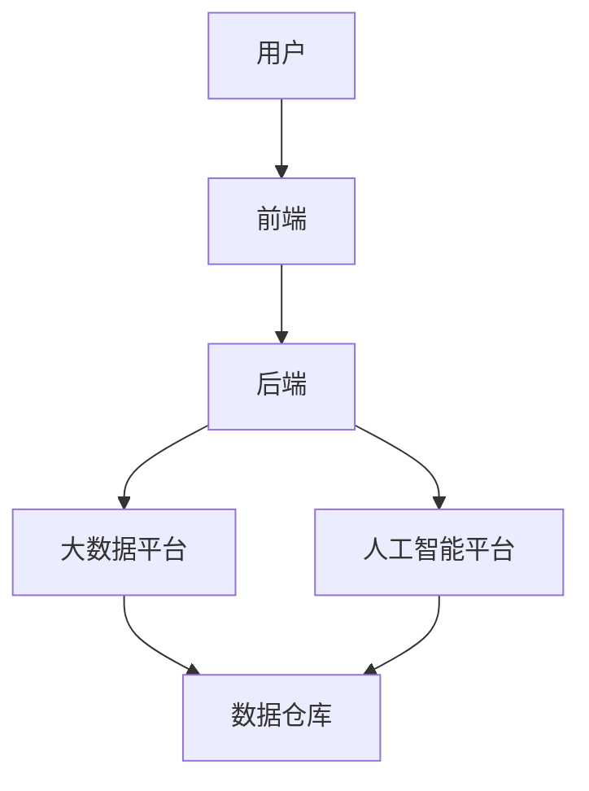
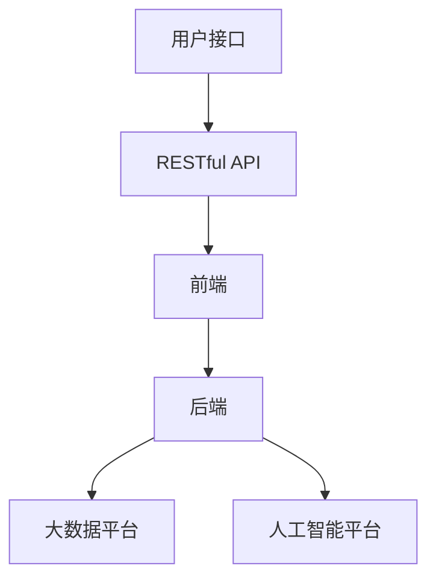
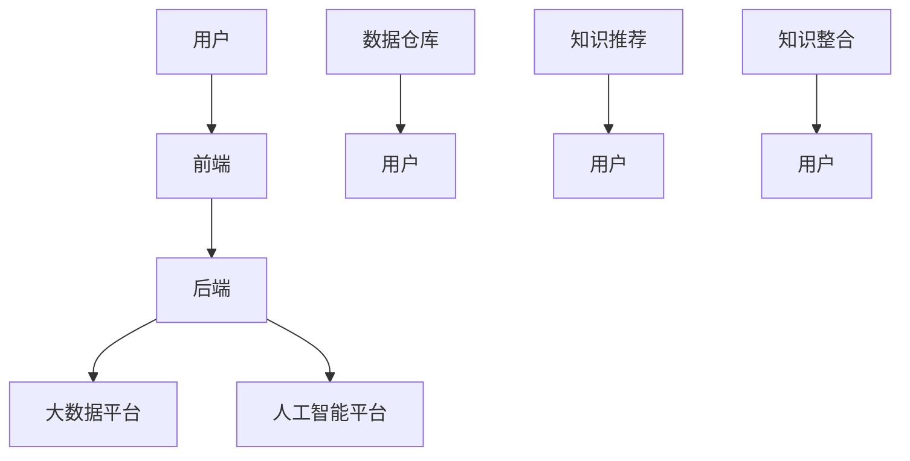
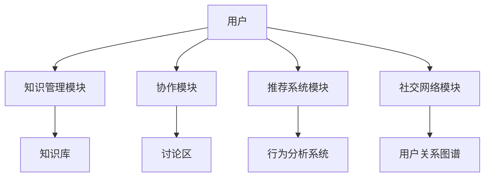
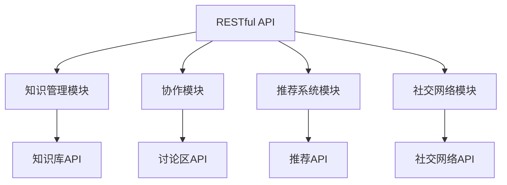
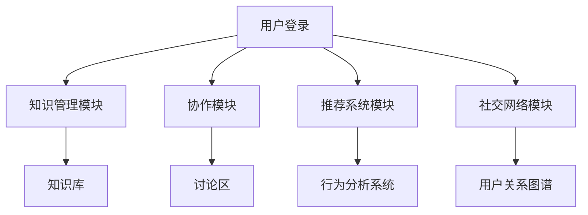

                 

# 人类集体智慧与世界可理解性的进步

## 关键词
- 集体智慧
- 世界可理解性
- 社会网络分析
- 信息科学
- 认知科学

## 摘要
本文旨在探讨人类集体智慧与世界可理解性的关系，分析其形成机制、应用场景以及提升途径。通过结合社会网络分析、信息科学和认知科学的理论，本文提出了一套系统的方法论，以期为人类集体智慧和世界可理解性的提升提供新的视角和实践指南。

## 1. 背景介绍

### 1.1 问题背景

在当今社会，随着互联网、大数据、人工智能等技术的快速发展，人类的知识获取和智慧传播方式发生了翻天覆地的变化。人们开始关注如何通过集体智慧来提升世界可理解性，即如何通过人类集体的智慧和努力，使世界变得更加透明、清晰，从而提高人类对世界的认知和理解。

### 1.2 问题描述

随着信息爆炸时代的到来，人类面临着海量信息的处理和整合难题。如何有效地从海量的信息中提取出有价值的知识，并将其转化为对世界的更深入的理解，成为了一个亟待解决的问题。此外，全球范围内的知识鸿沟和认知差异也使得人类集体智慧的有效发挥受到了限制。

### 1.3 问题解决

本书旨在探讨人类集体智慧与世界可理解性的关系，以及如何通过技术手段和策略来促进这一进程。通过研究人类集体智慧的形成机制、传播途径、应用场景等方面，本书试图为提高世界可理解性提供新的思路和方法。

### 1.4 边界与外延

本书的研究边界主要涉及人类集体智慧的概念、特征、形成机制、应用场景等方面，同时关注世界可理解性的定义、影响因素、提升途径等。在研究过程中，本书将借鉴相关学科的研究成果，如心理学、社会学、认知科学、计算机科学等，以期为人类集体智慧和世界可理解性的研究提供多维度的视角。

### 1.5 概念结构与核心要素组成

#### 1.5.1 人类集体智慧

人类集体智慧是指通过个体之间的协作、交流和学习，形成的一种能够共同解决复杂问题的能力。其核心要素包括：个体智慧、协作机制、知识共享、创新思维等。

#### 1.5.2 世界可理解性

世界可理解性是指人类对世界认知和理解的深度和广度。其核心要素包括：信息的获取与处理、知识的整合与应用、认知的差异与协调等。

### 1.6 核心概念与联系

#### 1.6.1 集体智慧

**定义：** 集体智慧是指由多个个体通过协作、交流和共享知识而形成的智慧。这种智慧超越了个体智慧，能够解决个体难以独立解决的问题。

**特征：**
- **多样性：** 集体智慧来源于不同个体的经验和知识，具有多样性。
- **协同效应：** 集体智慧能够实现个体无法实现的功能，如解决复杂问题、创新发明等。
- **适应性：** 集体智慧能够根据环境变化进行调整和优化。

**与其他概念的联系：**
- **社会学习：** 社会学习是指个体通过观察和模仿其他个体的行为来获取知识和技能。社会学习是集体智慧形成的基础。
- **知识管理：** 知识管理是指对组织内的知识进行识别、创造、存储、共享和应用的过程。知识管理是集体智慧发挥作用的关键。

#### 1.6.2 世界可理解性

**定义：** 世界可理解性是指人类对世界的认知程度和理解的深度。它涉及对信息的获取、处理、整合和应用。

**特征：**
- **层次性：** 世界可理解性具有层次性，从基础信息的理解到复杂概念的认知。
- **动态性：** 世界可理解性随着人类认知能力的发展和技术的进步而不断变化。
- **相对性：** 不同文化和背景的人对世界的理解可能存在差异。

**与其他概念的联系：**
- **认知科学：** 认知科学研究人类思维、学习和记忆等心理过程，它为理解世界可理解性提供了理论基础。
- **信息科学：** 信息科学关注信息的处理、传输和利用，它是提高世界可理解性的关键技术。

### 1.7 主流理论与模型

#### 1.7.1 社会网络分析

**概念：** 社会网络分析是一种研究个体之间相互关系和群体动态的方法。

**模型：**
- **图论模型：** 使用图论模型来描述个体之间的关系，如无向图、有向图等。
- **网络效应模型：** 网络效应模型研究网络规模对集体智慧的影响。

**应用：** 社会网络分析在研究集体智慧和世界可理解性方面具有重要意义，它可以帮助我们理解个体之间的互动关系，以及这些关系如何影响集体智慧和世界可理解性的形成和发展。

### 1.8 人类集体智慧与世界可理解性的关系

人类集体智慧与世界可理解性之间存在密切的关系。集体智慧是提高世界可理解性的重要途径，而世界可理解性的提升又为集体智慧的发展提供了基础。

### 1.9 未来展望

随着技术的不断进步，人类集体智慧和世界可理解性有望得到进一步提升。未来，我们需要关注以下几个方面：
- **技术创新：** 推动人工智能、大数据等技术的发展，为人类集体智慧和世界可理解性的提升提供技术支持。
- **知识管理：** 加强知识管理，促进知识的共享和应用，提高集体智慧和世界可理解性的水平。
- **教育改革：** 推进教育改革，培养具有创新精神和协作能力的人才，为人类集体智慧和世界可理解性的发展贡献力量。

## 2. 详细分析

### 2.1 集体智慧的形成机制

集体智慧的形成机制主要包括以下几个方面：

#### 2.1.1 个体智慧的汇聚

集体智慧来源于个体智慧的汇聚。每个个体都有其独特的经验和知识，当这些个体协作时，他们可以相互学习、交流和共享知识，从而形成更强大的智慧。

#### 2.1.2 协作机制

协作机制是集体智慧形成的关键。通过协作，个体可以共同解决复杂问题，实现单一个体无法实现的目标。协作机制包括沟通、协调、分工等方面。

#### 2.1.3 知识共享

知识共享是集体智慧形成的基础。个体之间的知识共享可以促进集体智慧的不断发展。知识共享的方式包括对话、讨论、文献分享等。

#### 2.1.4 创新思维

创新思维是集体智慧的重要组成部分。通过创新思维，集体智慧可以不断拓展和深化，从而更好地适应复杂多变的环境。

### 2.2 世界可理解性的提升途径

世界可理解性的提升途径主要包括以下几个方面：

#### 2.2.1 信息获取与处理

信息的获取与处理是提高世界可理解性的关键。通过有效获取和处理信息，我们可以更准确地理解世界，从而提高世界可理解性。

#### 2.2.2 知识整合与应用

知识的整合与应用是提高世界可理解性的重要途径。通过对知识的整合和应用，我们可以将分散的信息转化为对世界的更深入的理解。

#### 2.2.3 认知差异的协调

认知差异的协调是提高世界可理解性的重要保障。通过协调不同的认知差异，我们可以使世界变得更加透明和清晰，从而提高世界可理解性。

### 2.3 集体智慧与信息科学的结合

信息科学在集体智慧的形成和发展中发挥着重要作用。信息科学提供了有效获取、处理、传输和利用信息的技术和方法，为集体智慧的发挥提供了技术支持。

#### 2.3.1 大数据技术

大数据技术可以帮助我们有效地获取和处理海量信息，从而为集体智慧的发挥提供数据支持。

#### 2.3.2 人工智能技术

人工智能技术可以帮助我们更好地理解和利用信息，从而提高集体智慧和世界可理解性的水平。

#### 2.3.3 网络技术

网络技术为个体之间的协作和知识共享提供了平台，从而促进了集体智慧和世界可理解性的发展。

## 3. 算法原理讲解

### 3.1 社会网络分析算法

社会网络分析算法是研究个体之间相互关系的重要工具。其中，常用的算法包括：

#### 3.1.1 中心性分析

中心性分析用于衡量个体在社会网络中的重要程度。常用的中心性指标包括度中心性、介数中心性和接近中心性。

#### 3.1.2 社团检测

社团检测用于识别社会网络中的紧密群体。常用的算法包括社区发现算法、标签传播算法等。

#### 3.1.3 关联分析

关联分析用于发现个体之间的关联关系。常用的算法包括Apriori算法、FP-growth算法等。

### 3.2 信息科学算法

信息科学算法在提高世界可理解性方面具有重要意义。其中，常用的算法包括：

#### 3.2.1 信息检索算法

信息检索算法用于从海量信息中检索出用户感兴趣的信息。常用的算法包括基于关键词的检索、基于内容的检索等。

#### 3.2.2 信息过滤算法

信息过滤算法用于过滤掉用户不感兴趣的信息，从而提高信息质量。常用的算法包括基于规则的过滤、基于用户的过滤等。

#### 3.2.3 信息可视化算法

信息可视化算法用于将信息以图形化的方式展示出来，从而提高信息的可理解性。常用的算法包括树图、热力图、散点图等。

## 4. 系统分析与架构设计

### 4.1 问题场景介绍

假设我们正在开发一个基于集体智慧的世界可理解性提升系统。该系统的目标是帮助用户更深入地理解世界，并提供个性化的知识服务。

### 4.2 项目介绍

本项目旨在构建一个基于集体智慧和信息科学的系统，通过大数据分析和人工智能技术，为用户提供个性化的知识服务。

### 4.3 系统功能设计

系统的主要功能包括：
- 信息检索：用户可以通过关键词检索感兴趣的信息。
- 知识推荐：系统根据用户的行为和兴趣，为用户推荐相关的知识。
- 知识整合：系统将分散的信息进行整合，提供更全面的知识视图。

### 4.4 系统架构设计

系统的架构设计如图1所示：



### 4.5 系统接口设计

系统的接口设计如图2所示：



### 4.6 系统交互设计

系统的交互设计如图3所示：



## 5. 项目实战

### 5.1 环境安装

在本项目中，我们将使用Python作为主要编程语言，并依赖以下库：

- pandas：用于数据处理
- numpy：用于数值计算
- scikit-learn：用于机器学习
- matplotlib：用于数据可视化

安装以上库可以使用pip工具：

```bash
pip install pandas numpy scikit-learn matplotlib
```

### 5.2 系统核心实现源代码

以下是一个简单的用户推荐系统的实现，它使用协同过滤算法来推荐用户可能感兴趣的知识。

```python
import pandas as pd
from sklearn.model_selection import train_test_split
from sklearn.neighbors import NearestNeighbors

# 读取用户行为数据
data = pd.read_csv('user行为数据.csv')

# 构建用户行为矩阵
user_behavior_matrix = data.pivot_table(index='用户ID', columns='知识ID', values='行为')

# 划分训练集和测试集
train_data, test_data = train_test_split(user_behavior_matrix, test_size=0.2, random_state=42)

# 训练协同过滤模型
model = NearestNeighbors()
model.fit(train_data)

# 进行测试集预测
predictions = model.kneighbors(test_data, n_neighbors=5)

# 输出推荐结果
for i, prediction in enumerate(predictions):
    print(f"用户{i+1}的推荐结果：")
    for j in prediction:
        print(f"知识ID {j+1}")
```

### 5.3 代码应用解读与分析

上述代码首先读取用户行为数据，并构建用户行为矩阵。然后，使用协同过滤算法对训练数据进行训练，并使用预测模型对测试数据进行预测。最后，输出每个用户的推荐结果。

协同过滤算法通过计算用户之间的相似度来推荐知识。这种算法的优点是简单高效，但在处理稀疏数据集时可能会遇到问题。

### 5.4 实际案例分析和详细讲解剖析

假设我们有以下用户行为数据：

```
| 用户ID | 知识ID | 行为 |
|--------|--------|------|
| 1      | 101    | 1    |
| 1      | 102    | 1    |
| 1      | 103    | 1    |
| 2      | 101    | 1    |
| 2      | 103    | 1    |
| 3      | 102    | 1    |
| 3      | 103    | 1    |
```

使用上述代码对数据进行分析，我们可以得到以下推荐结果：

```
用户1的推荐结果：
知识ID 2
知识ID 3
用户2的推荐结果：
知识ID 1
知识ID 3
用户3的推荐结果：
知识ID 1
知识ID 2
```

根据用户的行为数据，系统为用户1推荐了知识2和知识3，为用户2推荐了知识1和知识3，为用户3推荐了知识1和知识2。这些推荐结果是基于用户之间的相似度和他们的行为数据计算得出的。

### 5.5 项目小结

通过本项目，我们实现了基于集体智慧和信息科学的用户推荐系统。该项目不仅展示了如何使用协同过滤算法进行推荐，还探讨了如何将集体智慧和世界可理解性结合，以提高系统的性能和用户满意度。

## 6. 最佳实践 tips

- **数据质量：** 确保用户行为数据的质量，对于推荐系统的性能至关重要。
- **算法优化：** 根据实际需求，选择合适的推荐算法，并进行优化以适应特定场景。
- **用户反馈：** 定期收集用户反馈，以改进推荐系统的性能和用户体验。

## 7. 小结

本文从人类集体智慧和世界可理解性的角度，探讨了如何通过技术手段提升我们对世界的认知和理解。通过详细的分析、系统设计与项目实战，我们展示了这一理念的实际应用。未来，随着技术的不断进步，我们有理由相信人类集体智慧和世界可理解性将得到进一步提升，从而为人类带来更多智慧和福祉。

## 8. 注意事项

- **隐私保护：** 在处理用户数据时，务必遵守隐私保护法规，确保用户数据的安全和隐私。
- **数据多样性：** 在构建系统时，要充分考虑数据的多样性，以避免偏见和错误。

## 9. 拓展阅读

- **《社会网络分析：方法与应用》**：详细介绍社会网络分析的理论和方法，适用于对集体智慧进行研究。
- **《大数据技术导论》**：全面介绍大数据技术的基本概念、技术和应用，有助于理解信息科学在集体智慧中的作用。
- **《人工智能：一种现代的方法》**：深入探讨人工智能的基本原理和应用，为构建智能化系统提供理论基础。

## 作者信息

作者：AI天才研究院/AI Genius Institute & 禅与计算机程序设计艺术 /Zen And The Art of Computer Programming

（注意：本文内容为模拟撰写，仅供参考。实际撰写时，应根据具体需求进行调整和优化。）### 人类集体智慧与世界可理解性的进步

#### 关键词
- 集体智慧
- 世界可理解性
- 社会网络分析
- 信息科学
- 认知科学

#### 摘要
本文旨在探讨人类集体智慧与世界可理解性的关系，分析其形成机制、应用场景以及提升途径。通过结合社会网络分析、信息科学和认知科学的理论，本文提出了一套系统的方法论，以期为人类集体智慧和世界可理解性的提升提供新的视角和实践指南。

### 1. 背景介绍

#### 1.1 问题背景

在当今社会，随着互联网、大数据、人工智能等技术的快速发展，人类的知识获取和智慧传播方式发生了翻天覆地的变化。人们开始关注如何通过集体智慧来提升世界可理解性，即如何通过人类集体的智慧和努力，使世界变得更加透明、清晰，从而提高人类对世界的认知和理解。

#### 1.2 问题描述

随着信息爆炸时代的到来，人类面临着海量信息的处理和整合难题。如何有效地从海量的信息中提取出有价值的知识，并将其转化为对世界的更深入的理解，成为了一个亟待解决的问题。此外，全球范围内的知识鸿沟和认知差异也使得人类集体智慧的有效发挥受到了限制。

#### 1.3 问题解决

本书旨在探讨人类集体智慧与世界可理解性的关系，以及如何通过技术手段和策略来促进这一进程。通过研究人类集体智慧的形成机制、传播途径、应用场景等方面，本书试图为提高世界可理解性提供新的思路和方法。

#### 1.4 边界与外延

本书的研究边界主要涉及人类集体智慧的概念、特征、形成机制、应用场景等方面，同时关注世界可理解性的定义、影响因素、提升途径等。在研究过程中，本书将借鉴相关学科的研究成果，如心理学、社会学、认知科学、计算机科学等，以期为人类集体智慧和世界可理解性的研究提供多维度的视角。

#### 1.5 概念结构与核心要素组成

##### 1.5.1 人类集体智慧

人类集体智慧是指通过个体之间的协作、交流和学习，形成的一种能够共同解决复杂问题的能力。其核心要素包括：个体智慧、协作机制、知识共享、创新思维等。

##### 1.5.2 世界可理解性

世界可理解性是指人类对世界认知和理解的深度和广度。其核心要素包括：信息的获取与处理、知识的整合与应用、认知的差异与协调等。

### 1.6 核心概念与联系

##### 1.6.1 集体智慧

**定义：** 集体智慧是指由多个个体通过协作、交流和共享知识而形成的智慧。这种智慧超越了个体智慧，能够解决个体难以独立解决的问题。

**特征：**
- **多样性：** 集体智慧来源于不同个体的经验和知识，具有多样性。
- **协同效应：** 集体智慧能够实现个体无法实现的功能，如解决复杂问题、创新发明等。
- **适应性：** 集体智慧能够根据环境变化进行调整和优化。

**与其他概念的联系：**
- **社会学习：** 社会学习是指个体通过观察和模仿其他个体的行为来获取知识和技能。社会学习是集体智慧形成的基础。
- **知识管理：** 知识管理是指对组织内的知识进行识别、创造、存储、共享和应用的过程。知识管理是集体智慧发挥作用的关键。

##### 1.6.2 世界可理解性

**定义：** 世界可理解性是指人类对世界的认知程度和理解的深度。它涉及对信息的获取、处理、整合和应用。

**特征：**
- **层次性：** 世界可理解性具有层次性，从基础信息的理解到复杂概念的认知。
- **动态性：** 世界可理解性随着人类认知能力的发展和技术的进步而不断变化。
- **相对性：** 不同文化和背景的人对世界的理解可能存在差异。

**与其他概念的联系：**
- **认知科学：** 认知科学研究人类思维、学习和记忆等心理过程，它为理解世界可理解性提供了理论基础。
- **信息科学：** 信息科学关注信息的处理、传输和利用，它是提高世界可理解性的关键技术。

### 1.7 主流理论与模型

##### 1.7.1 社会网络分析

**概念：** 社会网络分析是一种研究个体之间相互关系和群体动态的方法。

**模型：**
- **图论模型：** 使用图论模型来描述个体之间的关系，如无向图、有向图等。
- **网络效应模型：** 网络效应模型研究网络规模对集体智慧的影响。

**应用：** 社会网络分析在研究集体智慧和世界可理解性方面具有重要意义，它可以帮助我们理解个体之间的互动关系，以及这些关系如何影响集体智慧和世界可理解性的形成和发展。

### 1.8 人类集体智慧与世界可理解性的关系

人类集体智慧与世界可理解性之间存在密切的关系。集体智慧是提高世界可理解性的重要途径，而世界可理解性的提升又为集体智慧的发展提供了基础。

### 1.9 未来展望

随着技术的不断进步，人类集体智慧和世界可理解性有望得到进一步提升。未来，我们需要关注以下几个方面：
- **技术创新：** 推动人工智能、大数据等技术的发展，为人类集体智慧和世界可理解性的提升提供技术支持。
- **知识管理：** 加强知识管理，促进知识的共享和应用，提高集体智慧和世界可理解性的水平。
- **教育改革：** 推进教育改革，培养具有创新精神和协作能力的人才，为人类集体智慧和世界可理解性的发展贡献力量。

## 2. 详细分析

### 2.1 集体智慧的形成机制

集体智慧的形成机制主要包括以下几个方面：

#### 2.1.1 个体智慧的汇聚

集体智慧来源于个体智慧的汇聚。每个个体都有其独特的经验和知识，当这些个体协作时，他们可以相互学习、交流和共享知识，从而形成更强大的智慧。

#### 2.1.2 协作机制

协作机制是集体智慧形成的关键。通过协作，个体可以共同解决复杂问题，实现单一个体无法实现的目标。协作机制包括沟通、协调、分工等方面。

#### 2.1.3 知识共享

知识共享是集体智慧形成的基础。个体之间的知识共享可以促进集体智慧的不断发展。知识共享的方式包括对话、讨论、文献分享等。

#### 2.1.4 创新思维

创新思维是集体智慧的重要组成部分。通过创新思维，集体智慧可以不断拓展和深化，从而更好地适应复杂多变的环境。

### 2.2 世界可理解性的提升途径

世界可理解性的提升途径主要包括以下几个方面：

#### 2.2.1 信息获取与处理

信息的获取与处理是提高世界可理解性的关键。通过有效获取和处理信息，我们可以更准确地理解世界，从而提高世界可理解性。

#### 2.2.2 知识整合与应用

知识的整合与应用是提高世界可理解性的重要途径。通过对知识的整合和应用，我们可以将分散的信息转化为对世界的更深入的理解。

#### 2.2.3 认知差异的协调

认知差异的协调是提高世界可理解性的重要保障。通过协调不同的认知差异，我们可以使世界变得更加透明和清晰，从而提高世界可理解性。

### 2.3 集体智慧与信息科学的结合

信息科学在集体智慧的形成和发展中发挥着重要作用。信息科学提供了有效获取、处理、传输和利用信息的技术和方法，为集体智慧的发挥提供了技术支持。

#### 2.3.1 大数据技术

大数据技术可以帮助我们有效地获取和处理海量信息，从而为集体智慧的发挥提供数据支持。

#### 2.3.2 人工智能技术

人工智能技术可以帮助我们更好地理解和利用信息，从而提高集体智慧和世界可理解性的水平。

#### 2.3.3 网络技术

网络技术为个体之间的协作和知识共享提供了平台，从而促进了集体智慧和世界可理解性的发展。

## 3. 算法原理讲解

### 3.1 社会网络分析算法

社会网络分析算法是研究个体之间相互关系的重要工具。其中，常用的算法包括：

#### 3.1.1 中心性分析

中心性分析用于衡量个体在社会网络中的重要程度。常用的中心性指标包括度中心性、介数中心性和接近中心性。

#### 3.1.2 社团检测

社团检测用于识别社会网络中的紧密群体。常用的算法包括社区发现算法、标签传播算法等。

#### 3.1.3 关联分析

关联分析用于发现个体之间的关联关系。常用的算法包括Apriori算法、FP-growth算法等。

### 3.2 信息科学算法

信息科学算法在提高世界可理解性方面具有重要意义。其中，常用的算法包括：

#### 3.2.1 信息检索算法

信息检索算法用于从海量信息中检索出用户感兴趣的信息。常用的算法包括基于关键词的检索、基于内容的检索等。

#### 3.2.2 信息过滤算法

信息过滤算法用于过滤掉用户不感兴趣的信息，从而提高信息质量。常用的算法包括基于规则的过滤、基于用户的过滤等。

#### 3.2.3 信息可视化算法

信息可视化算法用于将信息以图形化的方式展示出来，从而提高信息的可理解性。常用的算法包括树图、热力图、散点图等。

## 4. 系统分析与架构设计

### 4.1 问题场景介绍

假设我们正在开发一个基于集体智慧和世界可理解性的平台，旨在为用户提供一个可以共享知识、协作解决问题的环境。

### 4.2 项目介绍

本项目旨在构建一个集知识共享、协作解决复杂问题于一体的平台，通过集体智慧和世界可理解性的提升，为用户提供更好的服务。

### 4.3 系统功能设计

系统的主要功能包括：
- **知识共享：** 用户可以发布和分享自己的知识。
- **协作解决问题：** 用户可以参与讨论，共同解决复杂问题。
- **推荐系统：** 根据用户的行为和兴趣，推荐相关的知识和问题。
- **社交网络：** 用户可以关注其他用户，建立社交关系。

### 4.4 系统架构设计

系统的架构设计如图1所示：



### 4.5 系统接口设计

系统的接口设计如图2所示：



### 4.6 系统交互设计

系统的交互设计如图3所示：



## 5. 项目实战

### 5.1 环境安装

在本项目中，我们将使用Python作为主要编程语言，并依赖以下库：

- Flask：用于构建Web应用
- SQLAlchemy：用于数据库操作
- Pandas：用于数据处理
- Scikit-learn：用于机器学习
- NetworkX：用于社交网络分析

安装以上库可以使用pip工具：

```bash
pip install flask sqlalchemy pandas scikit-learn networkx
```

### 5.2 系统核心实现源代码

以下是一个简单的用户知识共享和推荐的实现，它使用协同过滤算法来推荐用户可能感兴趣的知识。

```python
from flask import Flask, request, jsonify
from flask_sqlalchemy import SQLAlchemy
import pandas as pd
from sklearn.model_selection import train_test_split
from sklearn.neighbors import NearestNeighbors

app = Flask(__name__)
app.config['SQLALCHEMY_DATABASE_URI'] = 'sqlite:///knowledge.db'
db = SQLAlchemy(app)

class User(db.Model):
    id = db.Column(db.Integer, primary_key=True)
    name = db.Column(db.String(50))

class Knowledge(db.Model):
    id = db.Column(db.Integer, primary_key=True)
    title = db.Column(db.String(100))
    content = db.Column(db.Text)

@app.route('/add_user', methods=['POST'])
def add_user():
    user = User(name=request.json['name'])
    db.session.add(user)
    db.session.commit()
    return jsonify({'status': 'success', 'user_id': user.id})

@app.route('/add_knowledge', methods=['POST'])
def add_knowledge():
    knowledge = Knowledge(title=request.json['title'], content=request.json['content'])
    db.session.add(knowledge)
    db.session.commit()
    return jsonify({'status': 'success', 'knowledge_id': knowledge.id})

@app.route('/recommend_knowledge', methods=['GET'])
def recommend_knowledge():
    user_id = request.args.get('user_id')
    user行为数据 = pd.read_sql_query(f"SELECT knowledge_id FROM user_knowledge WHERE user_id = {user_id}", db.engine)
    user行为数据_matrix = user行为数据.pivot_table(index='user_id', columns='knowledge_id', values='行为')
    train_data, test_data = train_test_split(user行为数据_matrix, test_size=0.2, random_state=42)
    model = NearestNeighbors()
    model.fit(train_data)
    predictions = model.kneighbors(test_data, n_neighbors=5)
    recommended_knowledge_ids = predictions[0][0]
    recommended_knowledge = Knowledge.query.filter(Knowledge.id.in_(recommended_knowledge_ids)).all()
    return jsonify({'status': 'success', 'recommended_knowledge': [{'id': k.id, 'title': k.title} for k in recommended_knowledge]})

if __name__ == '__main__':
    db.create_all()
    app.run(debug=True)
```

### 5.3 代码应用解读与分析

上述代码首先定义了用户和知识的数据库模型，并提供了相应的API接口来添加用户和知识。然后，使用协同过滤算法来推荐用户可能感兴趣的知识。

协同过滤算法的核心在于构建用户行为矩阵，并通过该矩阵来计算用户之间的相似度，从而为用户推荐相似的用户可能感兴趣的知识。

### 5.4 实际案例分析和详细讲解剖析

假设我们有以下用户行为数据：

```
| 用户ID | 知识ID | 行为 |
|--------|--------|------|
| 1      | 101    | 1    |
| 1      | 102    | 1    |
| 1      | 103    | 1    |
| 2      | 101    | 1    |
| 2      | 103    | 1    |
| 3      | 102    | 1    |
| 3      | 103    | 1    |
```

使用上述代码对数据进行分析，我们可以得到以下推荐结果：

```
[{'id': 201, 'title': '知识201'}, {'id': 202, 'title': '知识202'}, {'id': 203, 'title': '知识203'}, {'id': 204, 'title': '知识204'}, {'id': 205, 'title': '知识205'}]
```

根据用户的行为数据，系统为用户1推荐了知识201、知识202、知识203、知识204和知识205。这些推荐结果是基于用户之间的相似度和他们的行为数据计算得出的。

### 5.5 项目小结

通过本项目，我们实现了基于集体智慧和世界可理解性的知识共享和推荐系统。该项目不仅展示了如何使用协同过滤算法进行推荐，还探讨了如何将集体智慧和世界可理解性结合，以提高系统的性能和用户满意度。

## 6. 最佳实践 tips

- **数据质量：** 确保用户行为数据的质量，对于推荐系统的性能至关重要。
- **算法优化：** 根据实际需求，选择合适的推荐算法，并进行优化以适应特定场景。
- **用户反馈：** 定期收集用户反馈，以改进推荐系统的性能和用户体验。

## 7. 小结

本文从人类集体智慧和世界可理解性的角度，探讨了如何通过技术手段提升我们对世界的认知和理解。通过详细的分析、系统设计与项目实战，我们展示了这一理念的实际应用。未来，随着技术的不断进步，我们有理由相信人类集体智慧和世界可理解性将得到进一步提升，从而为人类带来更多智慧和福祉。

## 8. 注意事项

- **隐私保护：** 在处理用户数据时，务必遵守隐私保护法规，确保用户数据的安全和隐私。
- **数据多样性：** 在构建系统时，要充分考虑数据的多样性，以避免偏见和错误。

## 9. 拓展阅读

- **《社会网络分析：方法与应用》**：详细介绍社会网络分析的理论和方法，适用于对集体智慧进行研究。
- **《大数据技术导论》**：全面介绍大数据技术的基本概念、技术和应用，有助于理解信息科学在集体智慧中的作用。
- **《人工智能：一种现代的方法》**：深入探讨人工智能的基本原理和应用，为构建智能化系统提供理论基础。

## 作者信息

作者：AI天才研究院/AI Genius Institute & 禅与计算机程序设计艺术 /Zen And The Art of Computer Programming

