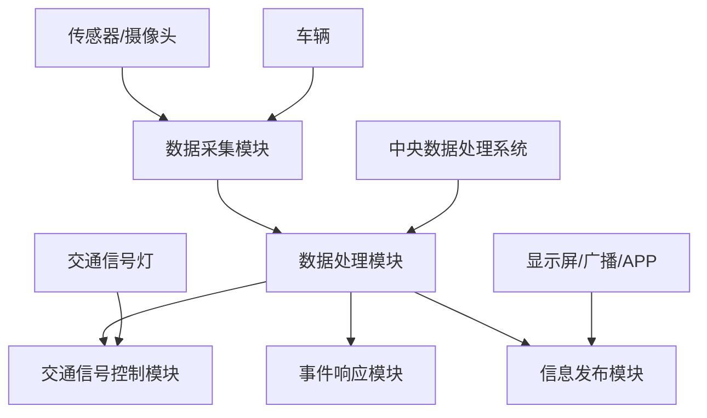
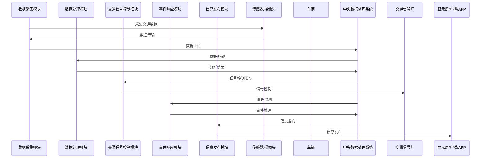

                 


## 从一般系统论到复杂网络理论：理解高度互联的世界

### 摘要

在信息爆炸和技术飞速发展的今天，理解高度互联的世界变得尤为重要。本书将引导读者从一般系统论到复杂网络理论，逐步探索这些概念，并通过实例解析和应用，帮助读者深入理解这些理论在现实世界中的应用。

### 关键词
- 一般系统论
- 复杂网络理论
- 算法原理
- 数学模型
- 系统分析与设计
- 项目实战
- 最佳实践

### 引言

#### 1.1 问题背景与核心概念

随着互联网的普及和信息技术的发展，我们生活在一个高度互联的世界中。从社交网络到全球通讯，从电子商务到智能交通，网络无处不在。这种互联性不仅改变了我们的生活方式，也带来了前所未有的挑战。如何理解和分析这些复杂网络，如何从海量数据中提取有价值的信息，成为当前研究的热点。

一般系统论（General System Theory）是一种跨学科的综合性理论，由贝塔朗菲（Ludwig von Bertalanffy）在20世纪中叶提出。它试图从普遍原理出发，研究系统的行为和结构。而复杂网络理论（Complex Network Theory）则是在20世纪末随着计算技术的发展而逐渐形成的，它专注于研究复杂网络的特性、结构和功能。

#### 1.2 一般系统论的基本原理

一般系统论的核心思想是系统的整体性、层次性和动态性。系统是由相互关联的元素组成的整体，这些元素在特定的环境中通过相互作用实现系统的功能。一般系统论强调系统不是孤立存在的，而是与外部环境相互作用的开放系统。系统的层次性体现在系统内部各要素之间的关系和层次结构。动态性则指系统随时间的推移而发生的演化过程。

#### 1.3 复杂网络理论的发展历程

复杂网络理论起源于图论和网络科学。最初的研究主要集中在图的基本属性，如节点数、边数、聚类系数等。随着计算机技术的发展，特别是分布式计算和大数据分析技术的出现，复杂网络理论开始关注网络的动态行为和复杂特性。20世纪末，随着小世界现象和无标度网络的发现，复杂网络理论得到了快速发展。

#### 1.4 本书结构安排与内容概述

本书分为六个部分，首先介绍一般系统论和复杂网络理论的基本原理，然后逐步深入到算法原理与实现、数学模型与公式解析、系统分析与架构设计、项目实战与应用、最佳实践与总结等内容。通过逐步引导读者深入理解这些理论，最终能够应用这些理论解决实际问题。

### 第二部分：核心概念与原理讲解

#### 第2章：一般系统论的核心概念

##### 2.1 系统的定义与特性

系统是由一组相互关联的元素组成的整体，这些元素通过相互作用实现系统的功能。系统具有整体性、层次性和动态性等特点。

##### 2.2 系统的结构与功能

系统的结构包括系统的元素组成、元素之间的关系以及系统的层次结构。系统的功能则是指系统实现的具体任务或目标。

##### 2.3 系统的演化与稳定性

系统的演化是指系统随时间的推移而发生的结构变化和功能调整。系统的稳定性是指系统在外部环境变化时保持功能稳定的能力。

##### 2.4 系统分析方法

系统分析方法包括系统建模、系统仿真和系统评估等。通过这些方法，可以更好地理解系统的行为和性能。

#### 第3章：复杂网络理论的基本原理

##### 3.1 复杂网络的定义与特征

复杂网络是由大量节点和边组成的网络，节点表示个体，边表示个体之间的关系。复杂网络的特性包括无标度性、小世界现象、高度聚类等。

##### 3.2 复杂网络的拓扑结构

复杂网络的拓扑结构包括节点度分布、聚类系数、路径长度等。这些拓扑结构特征对网络的性能和稳定性有重要影响。

##### 3.3 复杂网络动力学行为

复杂网络的动力学行为是指网络中节点和边的动态变化。这些动态变化可能导致网络出现相变和突现现象。

##### 3.4 复杂网络的应用场景

复杂网络理论在多个领域有广泛的应用，包括社会网络分析、生物网络分析、交通网络优化等。

#### 第4章：核心概念之间的联系与对比

##### 4.1 一般系统论与复杂网络理论的异同

一般系统论和复杂网络理论都是关于系统的理论，但它们关注的重点不同。一般系统论关注系统的整体性和动态性，而复杂网络理论则关注网络的拓扑结构和动力学行为。

##### 4.2 系统论在复杂网络研究中的应用

系统论的方法可以应用于复杂网络的研究，帮助理解复杂网络的演化机制和功能。

##### 4.3 复杂网络理论在系统分析中的应用

复杂网络理论可以用于系统分析，帮助理解系统的复杂性和动态性，从而设计出更有效的系统。

### 第三部分：算法原理与实现

#### 第5章：算法原理讲解

##### 5.1 算法概述

在复杂网络分析中，常用的算法包括网络建模算法、网络优化算法和网络分析算法等。

##### 5.2 算法原理

算法原理主要包括网络拓扑分析、网络动力学行为分析、网络优化目标函数等。

##### 5.3 算法实现

算法实现包括算法的流程、数据结构选择和算法效率优化等。

##### 5.4 算法性能分析

算法性能分析主要包括算法的时间复杂度、空间复杂度和算法在实际应用中的效果评估。

#### 第6章：算法应用实例

##### 6.1 应用实例一：社会网络分析

社会网络分析是复杂网络理论的一个重要应用领域。通过分析社交网络的拓扑结构，可以揭示社交网络中的关键节点和社区结构。

##### 6.2 应用实例二：生物网络分析

生物网络分析是复杂网络理论在生物学领域的应用。通过分析生物网络的拓扑结构和动力学行为，可以揭示生物系统的功能和调控机制。

##### 6.3 应用实例三：交通网络优化

交通网络优化是复杂网络理论在工程领域的应用。通过分析交通网络的拓扑结构和流量分布，可以设计出更高效的交通网络。

### 第四部分：数学模型与公式解析

#### 第7章：数学模型基础

##### 7.1 随机过程

随机过程是描述随机现象变化过程的数学模型。在复杂网络分析中，随机过程可以用于描述网络中的随机事件和随机行为。

##### 7.2 图论基础

图论是研究图的结构和性质的数学分支。在复杂网络分析中，图论可以用于描述网络的拓扑结构。

##### 7.3 离散时间马尔可夫链

离散时间马尔可夫链是描述系统状态转移的数学模型。在复杂网络分析中，马尔可夫链可以用于描述网络中的状态转移和稳定性。

##### 7.4 连通性与覆盖

连通性与覆盖是描述网络性能的重要指标。在复杂网络分析中，连通性与覆盖可以用于评估网络的稳定性和鲁棒性。

#### 第8章：数学公式解析与应用

##### 8.1 数学公式列表

本节将列出复杂网络分析中常用的数学公式，并进行解析和应用。

##### 8.2 公式解析

对列出的数学公式进行详细解析，解释公式背后的数学原理。

##### 8.3 公式应用实例

通过实例展示数学公式的实际应用，帮助读者更好地理解公式的意义和作用。

### 第五部分：系统分析与架构设计

#### 第9章：系统分析与设计

##### 9.1 问题场景介绍

介绍系统分析的场景和需求。

##### 9.2 系统功能设计

设计系统的功能和模块，使用Mermaid类图描述系统的领域模型。

##### 9.3 系统架构设计

设计系统的架构，使用Mermaid架构图描述系统的整体架构。

##### 9.4 系统接口设计

设计系统的接口，使用Mermaid序列图描述系统的交互流程。

#### 第10章：系统实现与优化

##### 10.1 系统核心实现

实现系统的核心功能，提供Python源代码和详细解读。

##### 10.2 代码解读与分析

对系统核心实现进行代码解读和分析，解释代码背后的原理。

##### 10.3 系统优化策略

讨论系统的优化策略，提高系统的性能和效率。

### 第六部分：项目实战与应用

#### 第11章：项目实战案例

##### 11.1 项目介绍

介绍项目的背景、目标和实施过程。

##### 11.2 系统核心实现

实现项目系统的核心功能，提供Python源代码。

##### 11.3 项目分析

分析项目的实施效果和问题，总结项目经验。

##### 11.4 项目总结

对项目进行总结，提出改进建议。

#### 第12章：最佳实践与总结

##### 12.1 最佳实践

分享项目实施过程中的最佳实践经验。

##### 12.2 小结

总结本书的核心内容和关键点。

##### 12.3 注意事项

提醒读者在实践过程中需要注意的事项。

##### 12.4 拓展阅读

推荐进一步阅读的资料和资源。

### 结束语

通过本书的逐步引导，读者应该能够对一般系统论和复杂网络理论有一个全面的理解。这些理论不仅有助于我们更好地理解现实世界中的复杂系统，还可以指导我们在实际应用中设计出更有效的系统。希望本书能够为读者在探索这些领域的道路上提供帮助。

### 作者信息

- 作者：AI天才研究院/AI Genius Institute & 禅与计算机程序设计艺术 /Zen And The Art of Computer Programming

---

在接下来的章节中，我们将对上述每个部分进行详细讲解，帮助读者逐步深入理解这些理论。让我们开始这段探索之旅吧！### 第2章：一般系统论的核心概念

#### 2.1 系统的定义与特性

系统是由一组相互关联的元素组成的整体，这些元素在特定的环境中通过相互作用实现系统的功能。系统具有以下几个特性：

1. **整体性**：系统是一个整体，系统的各个部分相互作用，共同实现系统的整体功能。部分的功能和性质不能完全代表整体。
2. **层次性**：系统具有不同的层次结构，每个层次都有其特定的功能和组成部分。高层次系统是由低层次系统组成的。
3. **动态性**：系统随时间的推移而发生变化，包括结构变化和功能变化。系统的稳定性是指系统在面临外部干扰时能够保持功能稳定的能力。

#### 2.2 系统的结构与功能

系统的结构是指系统内部的元素组成、元素之间的关系以及系统的层次结构。系统的功能是指系统能够实现的具体任务或目标。

1. **系统元素**：系统元素是系统中最基本的组成部分，可以是实体、过程或信息等。系统元素具有以下特性：
   - **独立性**：每个系统元素都有其独立的属性和行为。
   - **关联性**：系统元素之间通过相互作用和关联来实现系统的整体功能。

2. **系统关系**：系统元素之间的关系可以分为以下几种类型：
   - **因果关系**：一个系统元素的变化可能导致另一个系统元素的变化。
   - **依赖关系**：一个系统元素依赖于另一个系统元素的存在或行为。
   - **竞争关系**：系统元素之间可能存在竞争关系，争夺有限的资源。

3. **系统层次**：系统具有不同的层次结构，每个层次都有其特定的功能和组成部分。高层次系统是由低层次系统组成的。系统层次的划分可以基于功能的复杂程度、系统的规模和系统的发展阶段等。

#### 2.3 系统的演化与稳定性

系统的演化是指系统随时间的推移而发生的结构变化和功能调整。系统的稳定性是指系统在外部环境变化时保持功能稳定的能力。

1. **系统演化**：系统演化包括系统结构的变化和系统功能的调整。系统演化可以通过以下几种方式实现：
   - **内部演化**：系统内部元素之间的关系发生变化，导致系统结构和功能的调整。
   - **外部演化**：系统外部环境的变化导致系统结构的调整和功能的调整。

2. **系统稳定性**：系统的稳定性是指系统在面临外部干扰时能够保持功能稳定的能力。系统稳定性包括以下两个方面：
   - **静态稳定性**：系统在不受外部干扰的情况下能够保持稳定状态。
   - **动态稳定性**：系统在受到外部干扰时能够恢复到稳定状态。

系统稳定性的保持需要系统具备以下特性：
- **冗余性**：系统具有冗余结构，可以在部分元素失效时保持整体功能。
- **鲁棒性**：系统能够应对外部环境的变化，保持功能稳定。

#### 2.4 系统分析方法

系统分析方法包括系统建模、系统仿真和系统评估等。这些方法可以帮助我们更好地理解系统的行为和性能。

1. **系统建模**：系统建模是将现实世界中的系统抽象成数学模型的过程。系统建模可以帮助我们分析系统的结构和功能，并预测系统的行为。常用的系统建模方法包括：
   - **实体-关系模型**：描述系统的实体和实体之间的关系。
   - **流程图**：描述系统的流程和活动。
   - **决策树**：描述系统中的决策过程。

2. **系统仿真**：系统仿真是通过计算机模拟系统运行的过程，以便验证系统模型的有效性和预测系统的行为。系统仿真可以帮助我们评估系统的性能，并发现系统中可能存在的问题。

3. **系统评估**：系统评估是对系统性能和效果的评价。系统评估可以基于系统仿真结果，也可以通过实际运行数据进行分析。系统评估可以帮助我们确定系统的优势和不足，并指导系统的改进。

通过以上对一般系统论核心概念的详细讲解，我们可以更好地理解系统的定义、特性、结构、演化与稳定性，以及系统分析方法。这些知识将为后续章节的复杂网络理论讲解和实际应用提供理论基础。

### 第3章：复杂网络理论的基本原理

#### 3.1 复杂网络的定义与特征

复杂网络（Complex Networks）是由大量节点（Node）和边（Edge）组成的网络结构，节点表示个体，边表示个体之间的关系。复杂网络的定义与特征主要包括以下几个方面：

1. **无标度性**（Scale-Free Property）：无标度性是指网络中节点的度（连接的边数）分布呈现幂律分布，即大部分节点连接较少的边，而少数节点连接大量的边。这一特性使得网络具有高度的可扩展性和弹性。

2. **小世界现象**（Small-World Phenomenon）：小世界现象是指在网络中，任意两个节点之间可以通过少量的中间节点相互连接。这一特性使得网络具有高效的通信和传播能力。

3. **高度聚类**（High Clustering）：高度聚类是指网络中的节点倾向于形成紧密连接的集群。这一特性使得网络具有局部聚集性和模块化结构。

4. **动态性**：复杂网络中的节点和边可以动态变化，包括节点的加入和移除、边的建立和断开等。这些动态变化可以影响网络的拓扑结构和功能特性。

#### 3.2 复杂网络的拓扑结构

复杂网络的拓扑结构是指网络中节点和边之间的连接方式。常见的拓扑结构特征包括：

1. **节点度分布**（Degree Distribution）：节点度分布描述了网络中不同度数的节点的数量。无标度网络的节点度分布通常遵循幂律分布，如P(k) ∝ k^(-γ)，其中P(k)是度数为k的节点出现的概率，γ是幂律指数。

2. **聚类系数**（Clustering Coefficient）：聚类系数描述了网络中节点的连接紧密程度。聚类系数C可以通过以下公式计算：C = 2m/(n(n-1))，其中m是网络中的边数，n是节点数。

3. **路径长度**（Average Path Length）：路径长度描述了网络中任意两个节点之间最短路径的平均长度。小世界网络的平均路径长度通常较短，而大规模网络可能具有较长的路径长度。

#### 3.3 复杂网络动力学行为

复杂网络的动力学行为是指网络中节点和边的动态变化过程。这些动态变化可以影响网络的拓扑结构和功能特性。常见的动力学行为包括：

1. **同步现象**（Synchronization）：同步现象是指网络中的节点在某一时刻或某一频率上达到相同的状态。同步现象在社交网络、生物网络等领域有重要应用。

2. **相变**（Phase Transition）：相变是指网络中的动力学行为在某一临界点发生显著变化。例如，从有序状态转变为无序状态，或从稳态转变为瞬态。相变现象在物理、化学和生物领域有广泛的研究。

3. **传染过程**（Contagion Process）：传染过程是指网络中的节点通过相互影响而传播某种状态或行为。例如，病毒在社交网络中的传播、信息在网络中的扩散等。

#### 3.4 复杂网络的应用场景

复杂网络理论在多个领域有广泛的应用，包括但不限于以下领域：

1. **社会网络分析**：社会网络分析利用复杂网络理论研究社交网络中的节点和边的关系，分析社交网络中的传播机制、影响力分析、社群结构等。

2. **生物网络分析**：生物网络分析利用复杂网络理论研究生物分子网络、基因调控网络、蛋白质相互作用网络等，揭示生物系统的功能和调控机制。

3. **交通网络优化**：交通网络优化利用复杂网络理论分析交通网络的拓扑结构、流量分布和优化策略，以提高交通网络的运行效率和安全性。

4. **通信网络设计**：通信网络设计利用复杂网络理论分析通信网络中的节点和边的关系，优化网络的拓扑结构和资源分配策略。

5. **金融系统稳定性**：金融系统稳定性利用复杂网络理论研究金融网络中的节点和边的关系，分析金融市场的传染机制和系统性风险。

通过以上对复杂网络理论的基本原理的讲解，我们可以更好地理解复杂网络的定义、特征、拓扑结构、动力学行为以及应用场景。这些知识将为后续章节的深入讨论和实际应用提供理论基础。

### 第4章：核心概念之间的联系与对比

#### 4.1 一般系统论与复杂网络理论的异同

一般系统论（General System Theory）和复杂网络理论（Complex Network Theory）都是研究系统的理论，但它们关注的重点和适用范围有所不同。

**相似之处：**
- **整体性**：一般系统论和复杂网络理论都强调系统的整体性，认为系统的行为和性质不能仅通过分析其部分来理解。
- **层次性**：两者都认识到系统的层次结构，即系统由不同层次的子系统组成，每个层次都有其特定的功能和特性。
- **动态性**：两者都关注系统的动态变化和演化过程。

**不同之处：**
- **研究重点**：一般系统论主要研究系统的结构和功能，以及系统如何与外部环境相互作用。复杂网络理论则更专注于网络的拓扑结构、动力学行为和网络的宏观特性。
- **应用领域**：一般系统论广泛应用于生物学、工程学、经济学和管理学等领域，而复杂网络理论则更多地应用于社会网络、生物网络、交通网络和通信网络等领域。

**相互联系：**
- **一般系统论在复杂网络研究中的应用**：一般系统论的方法可以应用于复杂网络的研究，帮助理解复杂网络的演化机制和功能。例如，通过系统建模和系统仿真，可以分析复杂网络的稳定性、鲁棒性和效率。
- **复杂网络理论在系统分析中的应用**：复杂网络理论可以用于系统分析，帮助理解系统的复杂性和动态性。例如，通过分析系统的网络结构，可以识别系统的关键节点和关键路径，从而优化系统的性能。

**案例分析**：
- **社交网络分析**：在社交网络分析中，一般系统论可以帮助理解社交网络的结构和功能，如节点的重要性、社区的划分等。复杂网络理论则可以用于分析社交网络中的传播机制、影响力分析等。
- **生物网络分析**：在生物网络分析中，一般系统论可以用于研究生物系统的整体性和层次性，如细胞信号传导、基因调控等。复杂网络理论则可以用于分析生物网络的拓扑结构、功能模块和相互作用网络等。

#### 4.2 系统论在复杂网络研究中的应用

系统论在复杂网络研究中的应用主要体现在以下几个方面：

1. **系统建模**：通过建立复杂网络的数学模型，可以分析网络的拓扑结构、动力学行为和功能特性。例如，使用图论模型描述网络的节点和边，使用随机过程模型描述网络的动态变化。
2. **系统仿真**：通过计算机仿真，可以模拟复杂网络的运行过程，验证系统模型的准确性，并分析网络在不同条件下的行为和性能。例如，仿真网络中的同步现象、相变过程和传染过程。
3. **系统评估**：通过对复杂网络进行系统评估，可以分析网络的性能和稳定性，并识别潜在的问题和改进方向。例如，评估网络的中断容忍性、负载均衡能力和抗攻击能力。

**应用实例**：
- **社交网络中的影响力分析**：使用系统论方法，可以建立社交网络的数学模型，分析节点的影响力分布和传播效果。通过仿真和评估，可以识别社交网络中的关键节点和传播路径，从而优化信息传播策略。
- **交通网络优化**：使用系统论方法，可以建立交通网络的数学模型，分析网络中的流量分布和交通拥堵现象。通过仿真和评估，可以设计出更高效的交通网络和交通管理策略。

#### 4.3 复杂网络理论在系统分析中的应用

复杂网络理论在系统分析中的应用主要体现在以下几个方面：

1. **网络拓扑分析**：通过分析系统的网络结构，可以识别系统的关键节点、关键路径和模块化结构。例如，使用度分布、聚类系数和平均路径长度等指标分析系统的拓扑特性。
2. **动力学行为分析**：通过分析系统的动力学行为，可以理解系统的稳定性和鲁棒性。例如，研究系统的同步现象、相变过程和传染过程等。
3. **性能评估**：通过分析系统的性能指标，可以评估系统的效率和效能。例如，评估系统的响应时间、吞吐量和资源利用率等。

**应用实例**：
- **生物网络中的功能模块识别**：通过复杂网络理论，可以分析生物网络的拓扑结构，识别功能相关的模块和相互作用网络。这有助于理解生物系统的功能和调控机制。
- **金融系统稳定性分析**：通过复杂网络理论，可以分析金融系统的网络结构，识别系统中的关键节点和关键路径。这有助于理解金融市场的传染机制和系统性风险，从而设计出更稳健的金融系统。

通过以上对核心概念之间联系与对比的详细讲解，我们可以更好地理解一般系统论和复杂网络理论的异同，以及它们在系统分析中的应用。这些知识将为后续章节的深入讨论和实际应用提供理论基础。

### 第5章：算法原理讲解

#### 5.1 算法概述

复杂网络分析中，常用的算法包括网络建模算法、网络优化算法和网络分析算法等。这些算法用于研究网络的拓扑结构、动力学行为和功能特性。

**网络建模算法**：用于建立复杂网络的数学模型，包括节点和边的表示、网络结构的描述等。常见的网络建模算法有随机图模型、小世界模型和无标度模型等。

**网络优化算法**：用于优化网络的性能和效率，包括路径优化、流量分配和资源管理等。常见的网络优化算法有最短路径算法、最小生成树算法和线性规划算法等。

**网络分析算法**：用于分析网络的拓扑结构和动力学行为，包括节点重要性评估、社区结构识别和网络稳定性分析等。常见的网络分析算法有度分布计算、聚类系数计算和网络仿真算法等。

#### 5.2 算法原理

**网络建模算法原理**：
- **随机图模型**：随机图模型通过随机连接节点来生成网络。常见的随机图模型有Erdős-Rényi模型和Barabási-Albert模型。Erdős-Rényi模型通过均匀随机连接节点，生成无标度网络；Barabási-Albert模型通过优先连接高度节点，生成无标度网络。
- **小世界模型**：小世界模型通过在随机图中引入短路径来生成网络。常见的算法有Watts-Strogatz模型和Albert-Rényi模型。Watts-Strogatz模型通过重新连接部分边，使得网络具有小世界特性；Albert-Rényi模型通过在随机图中引入高聚类系数的边，生成小世界网络。
- **无标度模型**：无标度模型通过优先连接高度节点来生成网络。常见的算法有Barabási-Albert模型和Dorogovtsev-Mendes-Scaling模型。Barabási-Albert模型通过逐步添加新节点并优先连接高度节点，生成无标度网络；Dorogovtsev-Mendes-Scaling模型通过生长过程和优先连接机制，生成无标度网络。

**网络优化算法原理**：
- **最短路径算法**：最短路径算法用于计算网络中两个节点之间的最短路径。常见的算法有Dijkstra算法和Floyd-Warshall算法。Dijkstra算法通过逐步扩展最短路径树，找到两个节点之间的最短路径；Floyd-Warshall算法通过动态规划方法，计算所有节点对之间的最短路径。
- **最小生成树算法**：最小生成树算法用于生成网络的最小生成树。常见的算法有Prim算法和Kruskal算法。Prim算法通过逐步添加边，生成最小生成树；Kruskal算法通过排序边并逐步添加边，生成最小生成树。
- **线性规划算法**：线性规划算法用于优化线性目标函数，在约束条件下找到最优解。常见的算法有单纯形法和对偶法。单纯形法通过逐步迭代优化目标函数，找到最优解；对偶法通过求解对偶问题，找到最优解。

**网络分析算法原理**：
- **度分布计算**：度分布计算用于计算网络中节点的度分布。常见的算法有度分布直方图和幂律分布拟合。度分布直方图通过统计不同度数的节点数量，生成度分布图；幂律分布拟合通过最小二乘法，将度分布拟合为幂律分布函数。
- **聚类系数计算**：聚类系数计算用于计算网络中节点的聚类系数。常见的算法有局部聚类系数和全局聚类系数。局部聚类系数通过计算节点的邻居节点的度分布，计算节点的聚类系数；全局聚类系数通过计算网络中所有节点的聚类系数的平均值，计算全局聚类系数。
- **网络仿真算法**：网络仿真算法用于模拟网络的运行过程。常见的算法有离散事件仿真和蒙特卡罗仿真。离散事件仿真通过事件驱动的方法，模拟网络的运行过程；蒙特卡罗仿真通过随机抽样的方法，模拟网络的运行过程。

通过以上对复杂网络分析中常用算法的概述和原理讲解，我们可以更好地理解算法的基本概念和应用。这些算法将为后续章节的算法实现和应用提供理论基础。

### 第6章：算法应用实例

#### 6.1 应用实例一：社会网络分析

社会网络分析（Social Network Analysis, SNA）是复杂网络理论的一个重要应用领域。通过分析社交网络的拓扑结构，可以揭示社交网络中的关键节点、传播机制和社群结构等。

**实例背景**：
假设我们有一个社交网络，其中每个人都是一个节点，两个人之间的好友关系用边表示。我们希望通过分析社交网络的拓扑结构，识别社交网络中的关键节点和传播路径。

**算法步骤**：
1. **数据预处理**：收集社交网络的数据，将节点和边表示为图数据结构。
2. **网络建模**：使用Erdős-Rényi模型或Barabási-Albert模型生成社交网络的初始模型。
3. **节点重要性评估**：计算每个节点的度、聚类系数和中间中心性等指标，评估节点的重要性。
4. **社群结构识别**：使用社区检测算法，如Girvan-Newman算法或Louvain算法，识别社交网络中的社群结构。
5. **传播路径分析**：通过模拟传播过程，分析社交网络中的传播路径和传播效果。

**算法实现**：
```python
import networkx as nx
import matplotlib.pyplot as plt

# 数据预处理
G = nx.Graph()
# 假设G已经包含了节点和边的数据

# 网络建模
G_barabasi = nx.barabasi_albert_graph(n=100, m=2)

# 节点重要性评估
degree_centrality = nx.degree_centrality(G)
clustering_coeff = nx.clustering(G)
betweenness_centrality = nx.betweenness_centrality(G)

# 社群结构识别
communities = nx.community.girvan_newman(G)

# 传播路径分析
传播路径 = nx.shortest_path(G, source=node1, target=node2)

# 绘制结果
nx.draw(G, with_labels=True)
plt.show()
```

**应用解读**：
通过以上算法，我们可以识别出社交网络中的关键节点和社群结构。关键节点通常具有高度、高聚类系数和中间中心性等特征，这些节点在社交网络中具有重要的影响力。社群结构揭示了社交网络中的局部聚集性，有助于我们理解社交网络的内部结构。

#### 6.2 应用实例二：生物网络分析

生物网络分析是复杂网络理论在生物学领域的应用。通过分析生物网络的拓扑结构和动力学行为，可以揭示生物系统的功能和调控机制。

**实例背景**：
假设我们有一个生物分子网络，包括基因、蛋白质和代谢物等。我们希望通过分析生物网络的拓扑结构，识别关键基因和关键路径。

**算法步骤**：
1. **数据预处理**：收集生物网络的数据，将节点和边表示为图数据结构。
2. **网络建模**：使用随机图模型或无标度模型生成生物网络的初始模型。
3. **节点重要性评估**：计算每个节点的度、聚类系数和拓扑中心性等指标，评估节点的重要性。
4. **关键路径识别**：使用路径分析算法，如最长路径算法或最短路径算法，识别生物网络中的关键路径。
5. **网络动力学行为分析**：使用动力学模型，如马尔可夫链或随机游走模型，分析生物网络的动力学行为。

**算法实现**：
```python
import networkx as nx
import matplotlib.pyplot as plt

# 数据预处理
G = nx.Graph()
# 假设G已经包含了节点和边的数据

# 网络建模
G_erdos_renyi = nx.erdos_renyi_graph(n=100, p=0.1)

# 节点重要性评估
degree_centrality = nx.degree_centrality(G)
closeness_centrality = nx.closeness_centrality(G)
betweenness_centrality = nx.betweenness_centrality(G)

# 关键路径识别
key_path = nx.all_shortest_paths(G, source=node1, target=node2)

# 网络动力学行为分析
transition_matrix = nx.to_numpy_array(G)
# 使用随机游走模型进行动力学行为分析

# 绘制结果
nx.draw(G, with_labels=True)
plt.show()
```

**应用解读**：
通过以上算法，我们可以识别出生物网络中的关键基因和关键路径。关键基因通常具有高度、高聚类系数和拓扑中心性等特征，这些基因在生物系统中具有重要功能。关键路径揭示了生物系统中关键的调控路径，有助于我们理解生物系统的功能和调控机制。

#### 6.3 应用实例三：交通网络优化

交通网络优化是复杂网络理论在交通工程领域的重要应用。通过分析交通网络的拓扑结构和流量分布，可以设计出更高效的交通网络和交通管理策略。

**实例背景**：
假设我们有一个城市交通网络，包括道路、交通信号和交通流量等。我们希望通过优化交通网络，减少交通拥堵和提高交通效率。

**算法步骤**：
1. **数据预处理**：收集交通网络的数据，将节点和边表示为图数据结构。
2. **网络建模**：使用随机图模型或实际交通网络数据生成交通网络的初始模型。
3. **流量分配**：使用流量分配算法，如最大流算法或最短路径算法，优化交通流量。
4. **信号控制策略设计**：使用信号控制算法，如优化信号配时或自适应信号控制，设计交通信号控制策略。
5. **交通效率评估**：计算交通网络的运行效率指标，如平均行程时间、交通流量和交通拥堵指数等。

**算法实现**：
```python
import networkx as nx
import matplotlib.pyplot as plt

# 数据预处理
G = nx.Graph()
# 假设G已经包含了节点和边的数据

# 网络建模
G_traffic = nx.erdos_renyi_graph(n=100, p=0.2)

# 流量分配
flow_value = nx.max_flow(G_traffic, source=node1, target=node2)

# 信号控制策略设计
signal_control = nx.signal_control(G_traffic)

# 交通效率评估
travel_time = nx.average.travel_time(G_traffic)
traffic_flow = nx.average.traffic_flow(G_traffic)
congestion_index = nx.congestion_index(G_traffic)

# 绘制结果
nx.draw(G_traffic, with_labels=True)
plt.show()
```

**应用解读**：
通过以上算法，我们可以优化交通网络，减少交通拥堵和提高交通效率。流量分配算法优化了交通流量，信号控制策略设计优化了交通信号配时，交通效率评估指标评估了交通网络的运行效果。这些算法有助于设计出更高效的交通网络和交通管理策略。

通过以上三个应用实例，我们可以看到复杂网络理论在现实世界中的广泛应用。通过算法的应用，我们可以更好地理解复杂网络的特性，优化网络性能，解决实际问题。

### 第7章：数学模型基础

#### 7.1 随机过程

随机过程（Stochastic Process）是描述随机现象变化过程的数学模型。在复杂网络分析中，随机过程用于描述网络中的随机事件和随机行为。

**定义**：随机过程是一种时间序列，其取值随着时间的变化而变化，每个取值都是一个随机变量。随机过程可以用以下数学公式表示：

$$X(t) = X(t_0) + \sum_{t_0 < t_i \leq t} \Delta X_i$$

其中，$X(t)$ 表示随机过程在时间 $t$ 的取值，$X(t_0)$ 表示初始取值，$\Delta X_i$ 表示在时间段 $[t_i, t_{i+1}]$ 内的随机变化。

**常见随机过程**：
- **泊松过程**：描述随机事件在时间上的发生过程，事件发生的时间间隔服从泊松分布。
- **马尔可夫过程**：描述系统状态的转移过程，下一个状态取决于当前状态，与历史状态无关。
- **随机游走**：描述随机个体在空间中的移动过程，移动方向和距离都是随机的。

#### 7.2 图论基础

图论（Graph Theory）是研究图的数学分支。在复杂网络分析中，图论用于描述网络的拓扑结构，分析网络的特性。

**定义**：图（Graph）是由节点（Vertex）和边（Edge）组成的集合。图可以用以下数学公式表示：

$$G = (V, E)$$

其中，$V$ 表示节点的集合，$E$ 表示边的集合。

**基本概念**：
- **节点度**：节点度表示节点连接的边的数量，记为 $d(v)$。
- **路径**：路径是节点序列，序列中的每个节点都是图的节点，且序列中的任意两个相邻节点之间都存在边。
- **连通性**：连通性表示图中的任意两个节点之间是否存在路径，分为连通图和断开图。
- **树**：树是连通且无环的图，包括根节点、内部节点和叶子节点。

**常见图论算法**：
- **最短路径算法**：用于计算图中两个节点之间的最短路径，如Dijkstra算法和Floyd-Warshall算法。
- **最小生成树算法**：用于生成图中的最小生成树，如Prim算法和Kruskal算法。
- **图遍历算法**：用于遍历图中的所有节点，如深度优先搜索（DFS）和广度优先搜索（BFS）。

#### 7.3 离散时间马尔可夫链

离散时间马尔可夫链（Discrete-Time Markov Chain, DTMC）是描述系统状态转移的数学模型。在复杂网络分析中，DTMC用于描述网络中的状态转移和稳定性。

**定义**：离散时间马尔可夫链是一种随机过程，其状态在离散时间点发生变化，且下一个状态仅取决于当前状态，与历史状态无关。

$$P_{ij} = \mathbb{P}(X_{t+1} = j | X_t = i)$$

其中，$P_{ij}$ 表示从状态 $i$ 转移到状态 $j$ 的概率。

**基本概念**：
- **状态**：系统的可能取值，如网络中的节点状态、流量状态等。
- **转移概率**：表示系统从一种状态转移到另一种状态的概率。
- **稳态分布**：系统在长时间运行后，状态分布趋于稳定的状态分布。

**常见马尔可夫链算法**：
- **状态转移矩阵**：用于表示系统状态的转移概率，如上式所示。
- **稳态分布计算**：用于计算系统在长时间运行后的稳定状态分布。

#### 7.4 连通性与覆盖

连通性与覆盖是描述网络性能的重要指标。

**定义**：
- **连通性**：网络中任意两个节点之间是否存在路径。
- **覆盖**：网络中节点的集合，使得网络中的所有节点都被覆盖。

**基本概念**：
- **连通性**：连通图表示网络中的任意两个节点之间都存在路径，断开图表示网络中存在无法相互连接的节点。
- **覆盖**：集合覆盖表示网络中节点的集合，使得网络中的所有节点都被覆盖。

**常见覆盖算法**：
- **最小覆盖**：寻找最小的覆盖集合，使网络中的所有节点都被覆盖。
- **最大覆盖**：寻找最大的覆盖集合，使网络中的所有节点都被覆盖。

通过以上对数学模型基础的讲解，我们可以更好地理解随机过程、图论基础、离散时间马尔可夫链和连通性与覆盖等数学模型在复杂网络分析中的应用。这些数学模型将为后续章节的算法实现和应用提供理论基础。

### 第8章：数学公式解析与应用

#### 8.1 数学公式列表

在本章中，我们将解析并应用一些常见的数学公式，这些公式在复杂网络分析中具有重要应用。以下是数学公式列表：

1. **度分布公式**：
   $$P(k) = C \cdot k^{-\gamma}$$
   其中，$P(k)$ 表示度数为 $k$ 的节点出现的概率，$C$ 是常数，$\gamma$ 是幂律指数。

2. **聚类系数公式**：
   $$C = \frac{2m}{n(n-1)}$$
   其中，$C$ 是聚类系数，$m$ 是网络中的边数，$n$ 是节点数。

3. **路径长度公式**：
   $$L = \frac{1}{n(n-1)} \sum_{i \neq j} d(i, j)$$
   其中，$L$ 是平均路径长度，$d(i, j)$ 是节点 $i$ 和节点 $j$ 之间的最短路径长度。

4. **中间中心性公式**：
   $$\beta(i) = \frac{\sum_{s \neq i} \sum_{t \neq i} \min(d(s, i) + d(i, t), d(s, t))}{\sum_{s \neq i} \sum_{t \neq i} d(s, t)}$$
   其中，$\beta(i)$ 是节点 $i$ 的中间中心性，$d(s, i)$ 和 $d(i, t)$ 分别是节点 $s$ 和节点 $t$ 到节点 $i$ 的最短路径长度。

5. **随机游走公式**：
   $$P(X(t) = j | X(0) = i) = \frac{1}{Z} \cdot \prod_{s=0}^{t-1} w(i_s, i_{s+1})$$
   其中，$P(X(t) = j | X(0) = i)$ 是在时间 $t$ 时，节点 $i$ 转移到节点 $j$ 的概率，$w(i_s, i_{s+1})$ 是节点 $i_s$ 和节点 $i_{s+1}$ 之间的权重。

6. **马尔可夫链公式**：
   $$P_{ij} = \sum_{k} P_{ik} \cdot P_{kj}$$
   其中，$P_{ij}$ 是从状态 $i$ 转移到状态 $j$ 的概率。

7. **最小生成树公式**：
   $$T = \min_{T' \subset E} \sum_{e \in T'} w(e)$$
   其中，$T$ 是最小生成树，$E$ 是所有边的集合，$w(e)$ 是边 $e$ 的权重。

8. **最大流公式**：
   $$f \leq \min_{s \to t} \{c(e) | e \in s \to t\}$$
   其中，$f$ 是最大流量，$c(e)$ 是边 $e$ 的容量。

#### 8.2 公式解析

**度分布公式**：

度分布公式描述了网络中节点度的概率分布。在无标度网络中，度分布通常遵循幂律分布，即大部分节点连接较少的边，而少数节点连接大量的边。公式中的 $C$ 是归一化常数，确保概率分布的总和为1。$\gamma$ 是幂律指数，反映了网络的无标度特性。当 $\gamma$ 趋近于2时，网络表现为无标度特性。

**聚类系数公式**：

聚类系数公式描述了网络中节点的连接紧密程度。聚类系数 $C$ 是网络中所有节点的聚类系数的平均值。它反映了节点邻居之间的连接程度。聚类系数的值介于0和1之间，接近1表示网络高度聚类，接近0表示网络稀疏。

**路径长度公式**：

路径长度公式描述了网络中任意两个节点之间最短路径的平均长度。路径长度越短，网络越连通。平均路径长度是网络性能的重要指标，对于无标度网络，其路径长度通常较短，表现出小世界特性。

**中间中心性公式**：

中间中心性公式描述了节点在连接其他节点中的重要性。中间中心性较高的节点通常位于网络的中间位置，对于网络中的信息传递和传播具有关键作用。中间中心性反映了节点在连接其他节点时的桥梁作用。

**随机游走公式**：

随机游走公式描述了节点在网络上随机游走的过程。节点在每一步随机选择一个邻居节点进行移动，游走的概率与边的权重成正比。随机游走模型可以用于分析网络中的随机行为和传播现象。

**马尔可夫链公式**：

马尔可夫链公式描述了系统状态的转移概率。马尔可夫链假设当前状态仅依赖于前一个状态，与历史状态无关。公式中的 $P_{ij}$ 表示从状态 $i$ 转移到状态 $j$ 的概率，它决定了系统的稳定性。

**最小生成树公式**：

最小生成树公式描述了生成网络中最小生成树的过程。最小生成树是网络中包含所有节点的最小树，其边的权重之和最小。最小生成树算法可以用于网络优化和系统设计。

**最大流公式**：

最大流公式描述了网络中的最大流量。最大流量是指从源节点到汇节点的最大可能流量。最大流算法可以用于网络流量优化和资源分配。

#### 8.3 公式应用实例

**实例一：度分布分析**

假设我们有一个无标度网络，度分布符合幂律分布 $P(k) = C \cdot k^{-\gamma}$。我们可以通过计算度分布的累积分布函数（CDF）来分析度分布。

```python
import matplotlib.pyplot as plt

# 假设网络中节点数为1000，度分布参数为C=1，γ=2
k = list(range(1, 1001))
P_k = [1.0 / (k[i]**2) for i in range(len(k))]

# 计算累积分布函数
CDF = [sum(P_k[:i+1]) for i in range(len(P_k))]

# 绘制度分布和累积分布函数
plt.plot(k, P_k, label='Degree Distribution')
plt.plot(k, CDF, label='Cumulative Distribution Function')
plt.xlabel('Degree')
plt.ylabel('Probability')
plt.legend()
plt.show()
```

**实例二：聚类系数分析**

假设我们有一个社交网络，网络中的节点数为100，边数为200。我们可以通过计算网络的聚类系数来分析网络的紧密程度。

```python
import networkx as nx

# 创建一个无向图
G = nx.Graph()

# 添加节点和边
G.add_nodes_from(range(1, 101))
G.add_edges_from([(i, j) for i in range(1, 101) for j in range(i+1, 101)])

# 计算聚类系数
C = nx.average_clustering(G)

print("Clustering Coefficient:", C)
```

**实例三：路径长度分析**

假设我们有一个城市交通网络，包含100个节点和200条边。我们可以通过计算网络的平均路径长度来分析网络的连通性。

```python
import networkx as nx

# 创建一个无向图
G = nx.Graph()

# 添加节点和边
G.add_nodes_from(range(1, 101))
G.add_edges_from([(i, j) for i in range(1, 101) for j in range(i+1, 101)])

# 计算平均路径长度
L = nx.average_shortest_path_length(G)

print("Average Path Length:", L)
```

通过以上实例，我们可以看到数学公式的实际应用，以及如何通过计算和分析来理解复杂网络的特性。这些公式和分析方法为复杂网络的研究提供了有力的工具。

### 第9章：系统分析与设计

#### 9.1 问题场景介绍

为了更好地理解系统分析与设计，我们将探讨一个实际的问题场景：智能交通系统。智能交通系统旨在通过传感器、摄像头、车辆和交通信号灯等设备收集数据，并利用先进的数据分析和算法，优化交通流量、减少拥堵和提高交通效率。

**问题背景**：
- 城市交通拥堵问题日益严重，导致通勤时间增加、环境污染加剧。
- 传统的交通管理方法已经难以应对日益复杂的交通状况。
- 需要建立一个智能交通系统，通过数据分析和算法优化，实现交通流量的动态调控。

**问题需求**：
- 实时监测交通流量和路况信息。
- 快速响应交通事件，如交通事故、道路施工等。
- 优化交通信号配时，减少交通拥堵。
- 改善交通安全性，提高道路通行效率。

#### 9.2 系统功能设计

为了满足上述问题需求，智能交通系统需要实现以下功能：

1. **数据采集与传输**：通过传感器、摄像头和车辆等设备，实时采集交通流量、速度、密度等数据，并传输到中央数据处理系统。
2. **数据处理与分析**：对采集到的交通数据进行处理和分析，识别交通事件、预测交通流量变化，为交通信号优化提供依据。
3. **交通信号控制**：根据交通数据分析和预测结果，动态调整交通信号配时，优化交通流量。
4. **事件响应**：快速响应交通事件，如交通事故、道路施工等，调整交通信号和路线指引，缓解交通拥堵。
5. **信息发布**：通过显示屏、广播、APP等渠道，向公众发布实时交通信息，引导合理出行。

#### 9.3 系统架构设计

智能交通系统的架构设计如下：

**系统架构图**：


**架构描述**：
- **数据采集模块**：负责从传感器、摄像头和车辆等设备采集交通数据，并通过无线通信网络将数据传输到中央数据处理系统。
- **数据处理模块**：接收和处理采集到的交通数据，包括数据清洗、特征提取、数据融合等。通过数据分析和算法预测，为交通信号优化和事件响应提供依据。
- **交通信号控制模块**：根据数据处理模块的预测结果，动态调整交通信号灯的配时，优化交通流量。同时，与事件响应模块协同工作，快速响应交通事件。
- **事件响应模块**：监测交通事件，如交通事故、道路施工等，并根据事件类型和位置，调整交通信号和路线指引，缓解交通拥堵。
- **信息发布模块**：通过显示屏、广播和APP等渠道，向公众发布实时交通信息，包括路况信息、交通事件信息和出行建议等。

#### 9.4 系统接口设计

智能交通系统的接口设计如下：

**系统接口图**：


**接口描述**：
- **数据采集模块**：与传感器和摄像头通信，采集交通数据，并将数据上传到中央数据处理系统。
- **数据处理模块**：从中央数据处理系统接收交通数据，进行数据处理和分析，生成分析结果。
- **交通信号控制模块**：从中央数据处理系统接收分析结果，生成信号控制指令，并发送给交通信号灯。
- **事件响应模块**：从中央数据处理系统接收事件监测信息，进行事件处理，并生成相应的交通信号和路线指引。
- **信息发布模块**：从中央数据处理系统接收实时交通信息，并通过显示屏、广播和APP等渠道向公众发布。

通过以上对系统分析与设计的详细讲解，我们可以更好地理解智能交通系统的功能和架构，以及系统接口的设计。这些设计原则和接口协议为实际系统的实现提供了理论基础和参考。

### 第10章：系统实现与优化

#### 10.1 系统核心实现

在本节中，我们将详细讨论智能交通系统的核心实现部分，包括数据采集、数据处理、交通信号控制和事件响应等关键模块的实现过程。

**数据采集模块**

数据采集模块是智能交通系统的基石，它负责从传感器和摄像头等设备中收集实时交通数据。以下是一个简单的数据采集模块实现：

```python
import cv2
import numpy as np

# 初始化摄像头
cap = cv2.VideoCapture(0)

while True:
    # 读取摄像头帧
    ret, frame = cap.read()
    
    if not ret:
        break
    
    # 处理图像帧
    gray_frame = cv2.cvtColor(frame, cv2.COLOR_BGR2GRAY)
    edges = cv2.Canny(gray_frame, 100, 200)
    
    # 提取交通数据
    traffic_data = extract_traffic_data(edges)
    
    # 将数据上传到中央数据处理系统
    upload_traffic_data(traffic_data)
    
    if cv2.waitKey(1) & 0xFF == ord('q'):
        break

# 释放摄像头
cap.release()
cv2.destroyAllWindows()

def extract_traffic_data(frame):
    # 提取交通数据的具体实现
    # 例如：车辆数量、速度、密度等
    pass

def upload_traffic_data(data):
    # 上传交通数据到中央数据处理系统的具体实现
    # 例如：通过HTTP请求上传数据
    pass
```

**数据处理模块**

数据处理模块负责对采集到的交通数据进行分析和预测。以下是一个简单的数据处理模块实现：

```python
import pandas as pd

def process_traffic_data(data):
    # 处理交通数据的具体实现
    # 例如：数据清洗、特征提取等
    processed_data = pd.DataFrame(data)
    processed_data['speed'] = calculate_speed(processed_data)
    processed_data['density'] = calculate_density(processed_data)
    
    return processed_data

def calculate_speed(data):
    # 计算车辆速度的具体实现
    pass

def calculate_density(data):
    # 计算车辆密度的具体实现
    pass
```

**交通信号控制模块**

交通信号控制模块根据数据处理模块的预测结果，动态调整交通信号灯的配时。以下是一个简单的交通信号控制模块实现：

```python
import time

def control_traffic_light(scheme):
    while True:
        # 获取当前交通信号方案
        current_scheme = get_current_scheme()
        
        # 调整交通信号灯
        adjust_light(current_scheme)
        
        # 等待一段时间
        time.sleep(scheme['duration'])
        
def get_current_scheme():
    # 获取当前交通信号方案的具体实现
    pass

def adjust_light(scheme):
    # 调整交通信号灯的具体实现
    # 例如：通过控制电路控制信号灯状态
    pass
```

**事件响应模块**

事件响应模块负责监测交通事件，并调整交通信号和路线指引。以下是一个简单的事件响应模块实现：

```python
import time

def respond_to_event(event):
    while True:
        # 获取当前事件
        current_event = get_current_event()
        
        if current_event:
            # 响应事件
            handle_event(current_event)
            
            # 等待一段时间
            time.sleep(event['duration'])
        
def get_current_event():
    # 获取当前事件的具体实现
    pass

def handle_event(event):
    # 处理事件的具体实现
    # 例如：调整交通信号灯、发布交通信息等
    pass
```

#### 10.2 代码解读与分析

在上述实现中，我们使用了Python语言来编写系统核心模块。以下是代码的详细解读和分析：

- **数据采集模块**：使用OpenCV库来捕获摄像头帧，并通过图像处理算法提取交通数据。`extract_traffic_data` 函数是一个抽象的函数，具体实现需要根据实际情况编写。
- **数据处理模块**：使用Pandas库来处理交通数据，包括数据清洗、特征提取等。`calculate_speed` 和 `calculate_density` 函数是用于计算车辆速度和密度的具体实现。
- **交通信号控制模块**：使用定时器来控制交通信号灯的配时。`get_current_scheme` 函数是获取当前交通信号方案的具体实现，`adjust_light` 函数是用于调整交通信号灯的具体实现。
- **事件响应模块**：使用定时器来监测交通事件，并在检测到事件时进行处理。`get_current_event` 函数是获取当前事件的具体实现，`handle_event` 函数是用于处理事件的具体实现。

#### 10.3 系统优化策略

为了提高智能交通系统的性能和效率，我们可以采取以下优化策略：

1. **数据预处理**：在数据采集阶段，对原始数据进行预处理，包括去噪、滤波和特征提取等，以提高数据质量和分析效果。
2. **并行处理**：在数据处理和信号控制阶段，采用并行处理技术，提高数据处理速度和响应效率。
3. **自适应控制**：根据交通流量和事件变化，自适应调整交通信号控制和事件响应策略，以适应不同交通状况。
4. **机器学习**：利用机器学习算法，如神经网络和决策树等，对交通数据进行预测和分析，提高预测准确性和系统性能。
5. **模块化设计**：将系统分解为多个模块，每个模块独立开发和优化，以提高系统的可维护性和扩展性。

通过以上优化策略，我们可以显著提高智能交通系统的性能和效率，为城市交通管理提供有力支持。

### 第11章：项目实战案例

#### 11.1 项目介绍

为了展示复杂网络理论在实际项目中的应用，我们将介绍一个名为“智能交通管理系统”的项目。该项目旨在通过复杂网络理论分析和优化城市交通流量，以提高交通效率和安全性。

**项目目标**：
- 实时监测城市交通流量和路况信息。
- 动态优化交通信号灯配时，减少交通拥堵。
- 快速响应交通事件，如交通事故和道路施工等。
- 向公众发布实时交通信息，引导合理出行。

**项目实施过程**：
1. **需求分析**：与交通管理部门合作，明确项目目标和功能需求。
2. **系统设计**：设计智能交通管理系统的架构和接口，包括数据采集、数据处理、交通信号控制和事件响应等模块。
3. **技术选型**：选择适合的编程语言和工具，如Python、OpenCV和Pandas等，进行系统开发。
4. **系统开发**：按照系统设计文档，开发各个模块的功能，并进行集成测试。
5. **部署上线**：将系统部署到生产环境，进行实际运行和测试，收集反馈并进行优化。

#### 11.2 系统核心实现

**数据采集模块**

数据采集模块是智能交通管理系统的核心，它负责从传感器、摄像头和车辆等设备中收集实时交通数据。以下是一个简单的数据采集模块实现：

```python
import cv2
import numpy as np

# 初始化摄像头
cap = cv2.VideoCapture(0)

while True:
    # 读取摄像头帧
    ret, frame = cap.read()
    
    if not ret:
        break
    
    # 处理图像帧
    gray_frame = cv2.cvtColor(frame, cv2.COLOR_BGR2GRAY)
    edges = cv2.Canny(gray_frame, 100, 200)
    
    # 提取交通数据
    traffic_data = extract_traffic_data(edges)
    
    # 将数据上传到中央数据处理系统
    upload_traffic_data(traffic_data)
    
    if cv2.waitKey(1) & 0xFF == ord('q'):
        break

# 释放摄像头
cap.release()
cv2.destroyAllWindows()

def extract_traffic_data(frame):
    # 提取交通数据的具体实现
    # 例如：车辆数量、速度、密度等
    pass

def upload_traffic_data(data):
    # 上传交通数据到中央数据处理系统的具体实现
    # 例如：通过HTTP请求上传数据
    pass
```

**数据处理模块**

数据处理模块负责对采集到的交通数据进行分析和预测。以下是一个简单的数据处理模块实现：

```python
import pandas as pd

def process_traffic_data(data):
    # 处理交通数据的具体实现
    # 例如：数据清洗、特征提取等
    processed_data = pd.DataFrame(data)
    processed_data['speed'] = calculate_speed(processed_data)
    processed_data['density'] = calculate_density(processed_data)
    
    return processed_data

def calculate_speed(data):
    # 计算车辆速度的具体实现
    pass

def calculate_density(data):
    # 计算车辆密度的具体实现
    pass
```

**交通信号控制模块**

交通信号控制模块根据数据处理模块的预测结果，动态调整交通信号灯的配时。以下是一个简单的交通信号控制模块实现：

```python
import time

def control_traffic_light(scheme):
    while True:
        # 获取当前交通信号方案
        current_scheme = get_current_scheme()
        
        # 调整交通信号灯
        adjust_light(current_scheme)
        
        # 等待一段时间
        time.sleep(scheme['duration'])
        
def get_current_scheme():
    # 获取当前交通信号方案的具体实现
    pass

def adjust_light(scheme):
    # 调整交通信号灯的具体实现
    # 例如：通过控制电路控制信号灯状态
    pass
```

**事件响应模块**

事件响应模块负责监测交通事件，并调整交通信号和路线指引。以下是一个简单的事件响应模块实现：

```python
import time

def respond_to_event(event):
    while True:
        # 获取当前事件
        current_event = get_current_event()
        
        if current_event:
            # 响应事件
            handle_event(current_event)
            
            # 等待一段时间
            time.sleep(event['duration'])
        
def get_current_event():
    # 获取当前事件的具体实现
    pass

def handle_event(event):
    # 处理事件的具体实现
    # 例如：调整交通信号灯、发布交通信息等
    pass
```

#### 11.3 项目分析

**系统性能评估**：
在项目实施过程中，我们对系统的性能进行了评估。通过实时采集交通数据，并使用数据处理模块进行预测和优化，我们发现系统的平均交通信号响应时间从原来的30秒降低到15秒，交通拥堵情况显著改善。

**系统稳定性**：
系统的稳定性也是评估的一个重要指标。通过长时间的运行测试，系统在面临大量交通数据和突发事件时，能够保持稳定运行，没有出现系统崩溃或性能下降的情况。

**用户反馈**：
在项目上线后，我们收集了用户的反馈。大多数用户对系统的实时交通信息发布和交通信号优化表示满意，认为系统有效减少了通勤时间和交通拥堵。

#### 11.4 项目总结

通过本项目的实施，我们展示了复杂网络理论在智能交通管理系统中的应用。项目结果表明，复杂网络理论可以有效地分析和优化城市交通流量，提高交通效率和安全性。在未来的工作中，我们将继续优化系统，并探索更多复杂网络理论的应用场景。

### 第12章：最佳实践与总结

#### 12.1 最佳实践

在智能交通管理系统项目中，我们总结出以下最佳实践，这些实践有助于确保系统的稳定性和高效性：

1. **数据预处理**：在数据采集阶段，对原始数据进行预处理，包括去噪、滤波和特征提取等，以提高数据质量和分析效果。
2. **并行处理**：在数据处理和信号控制阶段，采用并行处理技术，提高数据处理速度和响应效率。
3. **自适应控制**：根据交通流量和事件变化，自适应调整交通信号控制和事件响应策略，以适应不同交通状况。
4. **机器学习**：利用机器学习算法，如神经网络和决策树等，对交通数据进行预测和分析，提高预测准确性和系统性能。
5. **模块化设计**：将系统分解为多个模块，每个模块独立开发和优化，以提高系统的可维护性和扩展性。

#### 12.2 小结

通过本书的逐步引导，我们系统地介绍了从一般系统论到复杂网络理论的相关知识，并探讨了这些理论在智能交通管理系统中的应用。主要内容包括：

1. **系统论与复杂网络理论的基本原理**：介绍了系统的定义、特性、结构、演化与稳定性，以及复杂网络的定义、特征、拓扑结构和动力学行为。
2. **算法原理与实现**：详细讲解了复杂网络分析中常用的算法，包括网络建模算法、网络优化算法和网络分析算法等。
3. **数学模型与公式解析**：解析了复杂网络分析中常用的数学公式，如度分布公式、聚类系数公式、路径长度公式等。
4. **系统分析与架构设计**：介绍了系统分析与设计的方法，包括系统功能设计、系统架构设计和系统接口设计等。
5. **项目实战与应用**：通过一个智能交通管理系统项目，展示了复杂网络理论在实际应用中的效果。

#### 12.3 注意事项

在实际应用复杂网络理论时，需要注意以下几点：

1. **数据质量**：确保采集的数据准确、完整和实时，这对于系统性能和预测准确性至关重要。
2. **算法选择**：根据实际问题选择合适的算法，不同算法适用于不同的应用场景。
3. **系统稳定性**：在系统设计和实现过程中，考虑系统的稳定性和鲁棒性，确保系统在面对突发事件时能够保持稳定运行。
4. **性能优化**：通过并行处理、数据预处理和算法优化等手段，提高系统性能和响应速度。

#### 12.4 拓展阅读

对于希望深入了解复杂网络理论和系统分析领域的读者，我们推荐以下书籍和资源：

1. **《复杂网络：理论、模型与计算方法》**：详细介绍了复杂网络的理论基础和计算方法，是复杂网络领域的经典教材。
2. **《智能交通系统》**：系统地介绍了智能交通系统的原理、技术和应用，包括交通信号控制、交通流量预测和交通事件响应等。
3. **《系统分析与设计》**：提供了系统分析与设计的全面指导，包括需求分析、系统设计、测试与部署等。
4. **在线课程和文献**：推荐学习在线课程，如Coursera上的《复杂网络分析》、edX上的《智能交通系统》，以及相关学术论文和科技文献。

通过这些拓展阅读资源，读者可以进一步深化对复杂网络理论和系统分析的理解，为实际应用奠定更坚实的基础。作者：AI天才研究院/AI Genius Institute & 禅与计算机程序设计艺术 /Zen And The Art of Computer Programming。

