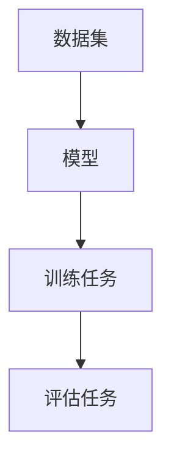
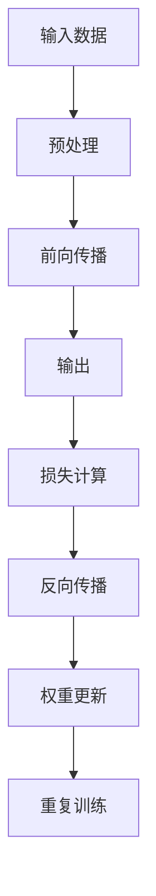
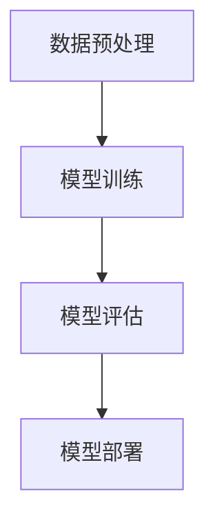
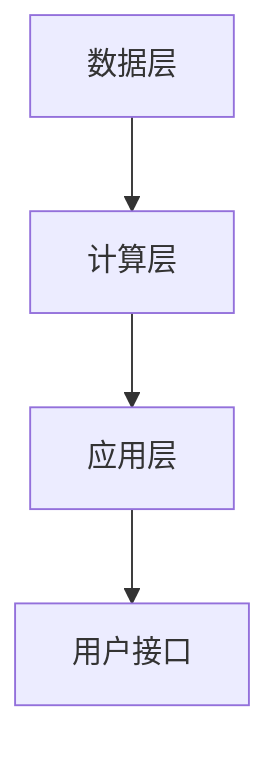
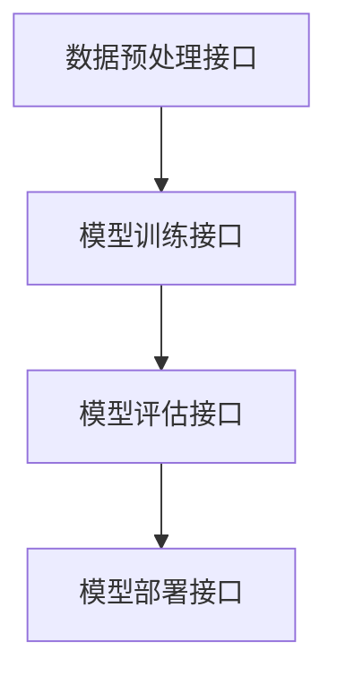
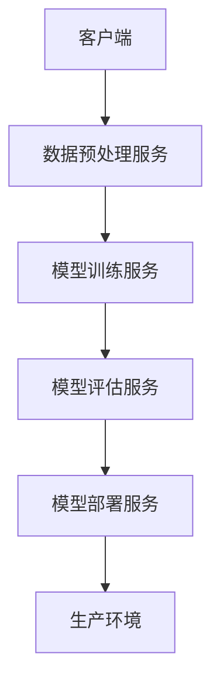

                 

# 从传统开发到AI敏捷：工程师的转型之路

关键词：AI敏捷、软件2.0、AI大模型、神经网络、深度学习

摘要：本文旨在探讨工程师如何从传统开发模式转型到AI敏捷开发模式，以应对软件2.0时代的挑战。文章将详细解析AI大模型的核心概念、开发方法，并通过具体实例展示AI敏捷开发的实际应用，帮助工程师掌握转型之路。

---

### 第一部分：背景介绍

#### 1.1 问题背景

在信息化时代，软件作为企业运营的核心资产，其开发方式和效率直接影响企业的竞争力。传统软件开发往往以瀑布模型为基础，这种方式在项目初期规划详尽，但随着项目进展，灵活性不足，难以快速响应市场变化。这种模式在软件1.0时代较为适用，但在软件2.0时代，面对快速变化的需求和日益复杂的应用场景，传统开发方式显得力不从心。

随着人工智能（AI）技术的迅猛发展，AI大模型成为推动企业级应用开发的关键力量。AI大模型具有自主学习、自适应和通用性等特点，能够处理大规模数据和复杂问题，极大提升了软件开发的效率和质量。因此，工程师从传统开发到AI敏捷的转型显得尤为重要。

#### 1.2 问题描述

工程师在从传统开发模式转型到AI敏捷开发模式时，面临以下挑战：

1. **技术理解**：AI大模型涉及复杂的算法和数学理论，工程师需要深入理解这些知识。
2. **开发流程**：AI敏捷开发强调快速迭代和持续交付，工程师需要掌握敏捷开发的方法和工具。
3. **工具选择**：市场上AI开发工具繁多，工程师需要选择合适的工具来提高开发效率。
4. **团队协作**：AI敏捷开发强调团队合作，工程师需要提高团队协作能力。

#### 1.3 问题解决

本书旨在为工程师提供从传统开发到AI敏捷转型的系统指导。具体目标如下：

1. **核心概念理解**：通过详细解析AI大模型的核心概念，帮助工程师建立正确的认知框架。
2. **开发方法掌握**：介绍AI敏捷开发的流程和方法，帮助工程师掌握新的开发模式。
3. **工具应用技能**：推荐合适的AI开发工具，并提供实际应用技巧。
4. **团队协作提升**：探讨如何提高团队协作效率，实现高效开发。

#### 1.4 边界与外延

本书主要关注AI大模型在企业级应用开发中的实践，涵盖但不限于自然语言处理、计算机视觉、语音识别等领域。同时，本书旨在为有志于AI敏捷开发的工程师提供一套完整的转型指南。

#### 1.5 概念结构与核心要素组成

- **软件2.0**：以AI大模型为核心的软件开发时代。
- **AI大模型**：具有大规模参数和复杂结构，能够自主学习和适应环境的模型。
- **敏捷转型**：工程师在AI大模型开发中的应用方法。

---

### 第二部分：核心概念与联系

#### 2.1 AI大模型原理

AI大模型是基于深度学习技术构建的复杂神经网络，其核心原理包括：

1. **神经网络**：神经网络是由大量神经元组成的网络，通过前向传播和反向传播实现数据的输入和输出。
2. **深度学习**：深度学习是神经网络的一种扩展，通过多层神经网络实现更复杂的特征提取和模式识别。
3. **大规模数据训练**：AI大模型需要通过大量数据进行训练，以提高其准确性和泛化能力。

以下是AI大模型的基本属性特征对比表格：

| 特征名称 | 描述 |
| -------- | -------- |
| 大规模参数 | 参数数量巨大，能够处理复杂问题 |
| 自适应学习 | 能够从海量数据中学习，不断优化自身 |
| 通用性 | 能够应用于多个领域，具有跨领域适应性 |

#### 2.2 AI大模型与传统AI对比

传统AI以规则为基础，其核心是利用预定义的规则进行数据处理和决策。而AI大模型以数据驱动，通过大规模数据训练形成自主学习的模型。以下是二者的对比：

| 对比项 | 传统AI | AI大模型 |
| ------ | ------ | -------- |
| 基础理论 | 规则系统 | 深度学习 |
| 学习方式 | 预定义规则 | 自主学习 |
| 泛化能力 | 较弱 | 较强 |

#### 2.3 ER实体关系图架构

AI大模型涉及多个核心实体，包括数据集、模型、训练任务等。以下是ER实体关系图：



---

### 第三部分：算法原理讲解

#### 3.1 算法原理

AI大模型的算法原理基于深度学习，其核心思想是通过多层神经网络对数据进行特征提取和模式识别。以下是神经网络的基本算法原理：

1. **前向传播**：输入数据通过网络的各个层进行传递，每一层对数据进行加权求和并应用激活函数，最终得到输出。
2. **反向传播**：根据输出与实际值的差异，计算损失函数，并反向传播误差，更新网络中的权重和偏置。

以下是神经网络算法的Mermaid流程图：



#### 3.2 Python源代码

以下是一个简单的神经网络前向传播的Python代码示例：

```python
# 导入必要的库
import numpy as np

# 初始化权重
weights = np.random.rand()

# 输入数据
input_data = np.array([1, 2])

# 前向传播
output = np.dot(input_data, weights)

print("Output:", output)
```

#### 3.3 数学模型和公式

神经网络算法的数学模型主要包括：

- **前向传播**：输出值 \(z\) 的计算公式为：
  $$
  z = x \cdot w + b
  $$
  其中，\(x\) 是输入值，\(w\) 是权重，\(b\) 是偏置。

- **反向传播**：损失函数对权重的偏导数 \(\Delta w\) 的计算公式为：
  $$
  \Delta w = \frac{\partial J}{\partial w}
  $$
  其中，\(J\) 是损失函数。

以下是具体的数学公式：

$$
\begin{aligned}
&\text{前向传播：} \quad z = x \cdot w + b \\
&\text{反向传播：} \quad \Delta w = \frac{\partial J}{\partial w}
\end{aligned}
$$

#### 3.4 详细讲解与举例说明

1. **前向传播**：
   在前向传播过程中，输入数据通过网络的每一层进行传递。每一层对数据进行加权求和，并应用激活函数，以提取特征并生成输出。例如，假设一个简单的两层神经网络，输入层为 \([x_1, x_2]\)，权重为 \([w_1, w_2]\)，偏置为 \([b_1, b_2]\)。则前向传播过程如下：

   $$
   \begin{aligned}
   &z_1 = x_1 \cdot w_1 + b_1 \\
   &z_2 = x_2 \cdot w_2 + b_2 \\
   &y = f(z_1) + f(z_2)
   \end{aligned}
   $$
   其中，\(f\) 是激活函数，如ReLU函数。

2. **反向传播**：
   在反向传播过程中，计算输出与实际值之间的差异，即损失函数。然后，通过反向传播误差，更新网络中的权重和偏置。例如，假设损失函数为均方误差（MSE），则反向传播过程如下：

   $$
   \begin{aligned}
   &\text{计算损失：} \quad J = \frac{1}{2} \sum_{i=1}^{n} (y_i - \hat{y}_i)^2 \\
   &\text{计算误差：} \quad \Delta y = \hat{y}_i - y_i \\
   &\text{更新权重：} \quad w_i = w_i - \alpha \cdot \frac{\partial J}{\partial w_i}
   \end{aligned}
   $$
   其中，\(\alpha\) 是学习率，\(\hat{y}_i\) 是预测值，\(y_i\) 是真实值。

---

### 第四部分：系统分析与架构设计方案

#### 4.1 问题场景介绍

以一家大型电商企业为例，该企业希望利用AI大模型提升商品推荐系统的准确性，以增加用户满意度和销售业绩。该问题场景涉及数据预处理、模型训练、模型评估和模型部署等环节。

#### 4.2 系统功能设计

系统功能设计主要包括以下方面：

1. **数据预处理**：对原始商品数据和用户行为数据进行清洗、转换和归一化处理，以供模型训练使用。
2. **模型训练**：利用预处理后的数据训练AI大模型，包括选择合适的网络结构、损失函数和优化器等。
3. **模型评估**：通过交叉验证和在线评估等方式，评估模型性能，并调整模型参数以优化性能。
4. **模型部署**：将训练好的模型部署到生产环境中，实现实时商品推荐功能。

以下是系统功能设计的领域模型类图：



#### 4.3 系统架构设计

系统架构设计主要包括以下方面：

1. **数据层**：包括数据存储和数据访问模块，用于存储和处理原始数据和模型数据。
2. **计算层**：包括模型训练和模型评估模块，用于实现数据预处理、模型训练和模型评估功能。
3. **应用层**：包括模型部署和应用接口模块，用于将训练好的模型部署到生产环境中，并提供接口供其他应用调用。

以下是系统架构设计的Mermaid架构图：



#### 4.4 系统接口设计

系统接口设计主要包括以下方面：

1. **数据预处理接口**：用于接收和处理原始数据，包括数据清洗、转换和归一化等功能。
2. **模型训练接口**：用于接收和处理训练数据，包括模型结构设计、损失函数选择和优化器配置等功能。
3. **模型评估接口**：用于接收和处理评估数据，包括交叉验证、在线评估和模型性能分析等功能。
4. **模型部署接口**：用于将训练好的模型部署到生产环境中，包括模型压缩、模型优化和部署配置等功能。

以下是系统接口设计的Mermaid接口图：



#### 4.5 系统交互序列图

系统交互序列图描述了系统各个模块之间的交互过程，包括数据预处理、模型训练、模型评估和模型部署等环节。

以下是系统交互序列图的Mermaid序列图：



---

### 第五部分：项目实战

#### 5.1 环境安装

在进行AI敏捷开发之前，首先需要安装必要的开发环境。以下是一个简单的安装步骤：

1. **Python环境安装**：下载并安装Python，建议选择Python 3.8及以上版本。
2. **AI框架安装**：安装常用的AI框架，如TensorFlow或PyTorch。例如，使用pip命令安装TensorFlow：
   ```
   pip install tensorflow
   ```

#### 5.2 系统核心实现源代码

以下是一个简单的AI敏捷开发项目的核心实现源代码：

```python
import tensorflow as tf

# 数据预处理
def preprocess_data(data):
    # 数据清洗、转换和归一化
    return processed_data

# 模型训练
def train_model(data, labels):
    # 构建模型
    model = tf.keras.Sequential([
        tf.keras.layers.Dense(64, activation='relu', input_shape=(data.shape[1],)),
        tf.keras.layers.Dense(64, activation='relu'),
        tf.keras.layers.Dense(1)
    ])

    # 编译模型
    model.compile(optimizer='adam', loss='mse')

    # 训练模型
    model.fit(data, labels, epochs=10)

    return model

# 模型评估
def evaluate_model(model, test_data, test_labels):
    # 评估模型性能
    loss = model.evaluate(test_data, test_labels)
    print("Test loss:", loss)

# 模型部署
def deploy_model(model):
    # 将模型部署到生产环境
    model.save('model.h5')

# 主函数
def main():
    # 加载和处理数据
    data, labels = load_data()
    processed_data = preprocess_data(data)

    # 训练模型
    model = train_model(processed_data, labels)

    # 评估模型
    evaluate_model(model, test_data, test_labels)

    # 部署模型
    deploy_model(model)

if __name__ == '__main__':
    main()
```

#### 5.3 代码应用解读与分析

1. **数据预处理**：
   数据预处理是模型训练的重要步骤，包括数据清洗、转换和归一化。通过预处理，可以将原始数据进行标准化处理，提高模型的训练效率。

2. **模型训练**：
   模型训练过程包括构建模型、编译模型和训练模型。构建模型时，可以选择合适的网络结构和优化器。编译模型时，需要指定损失函数和优化器。训练模型时，通过迭代更新模型参数，以提高模型的性能。

3. **模型评估**：
   模型评估用于评估模型的性能。通过评估模型在测试数据上的表现，可以判断模型的泛化能力。常见的评估指标包括准确率、召回率、F1值等。

4. **模型部署**：
   模型部署是将训练好的模型应用到实际场景中。通过将模型保存为文件，可以方便地在生产环境中加载和使用模型。

#### 5.4 实际案例分析和详细讲解剖析

以电商商品推荐系统为例，详细讲解AI敏捷开发的实际应用过程。

1. **数据收集**：
   收集电商平台的用户行为数据，包括用户浏览、购买和评价等数据。

2. **数据预处理**：
   对收集到的数据进行清洗、转换和归一化处理，以供模型训练使用。

3. **模型设计**：
   设计合适的网络结构，选择合适的损失函数和优化器。

4. **模型训练**：
   使用预处理后的数据训练模型，通过迭代更新模型参数，以提高模型性能。

5. **模型评估**：
   在测试集上评估模型性能，通过调整模型参数和超参数，优化模型性能。

6. **模型部署**：
   将训练好的模型部署到生产环境中，实现实时商品推荐功能。

通过以上实际案例，可以清晰地看到AI敏捷开发的各个环节，以及如何通过迭代和优化实现模型的性能提升。

#### 5.5 项目小结

通过本项目的实战，我们可以看到AI敏捷开发的优势：

1. **快速迭代**：通过迭代和优化，可以快速提升模型性能。
2. **灵活调整**：可以根据实际需求，灵活调整模型结构和超参数。
3. **持续交付**：可以实现持续交付，持续提升系统的性能和用户体验。

总之，AI敏捷开发是工程师从传统开发模式转型的重要方向，通过掌握AI敏捷开发的方法和技巧，工程师可以更好地应对软件2.0时代的挑战。

---

### 第六部分：最佳实践 Tips

1. **持续学习**：AI技术更新迅速，工程师需要持续学习最新的技术和方法。
2. **代码规范**：保持代码规范和可读性，有助于团队合作和代码维护。
3. **数据质量**：数据是AI大模型的基础，确保数据质量至关重要。
4. **模型优化**：通过模型压缩和量化等技术，可以降低模型的计算复杂度，提高部署效率。
5. **团队协作**：加强团队协作，提高开发效率和模型质量。

### 第七部分：小结

本文详细探讨了从传统开发到AI敏捷的转型之路，包括背景介绍、核心概念与联系、算法原理讲解、系统分析与架构设计方案以及项目实战。通过本文的学习，工程师可以更好地理解AI敏捷开发，掌握相关技术和方法，为企业的数字化转型贡献力量。

### 第八部分：注意事项

1. **算法复杂性**：AI大模型的算法复杂性较高，工程师需要深入理解相关理论。
2. **数据安全**：在数据收集和处理过程中，要注意保护用户隐私和数据安全。
3. **系统稳定性**：在生产环境中部署AI大模型时，要注意系统的稳定性和可靠性。

### 第九部分：拓展阅读

1. **《深度学习》**：Goodfellow、Bengio和Courville所著的深度学习经典教材，详细介绍了深度学习的基础理论和技术。
2. **《Python机器学习》**：Sebastian Raschka所著的Python机器学习入门书籍，涵盖了机器学习的基础知识和Python实现。
3. **《AI架构师手册》**：刘建伟所著的AI架构师手册，介绍了AI架构设计的最佳实践和系统架构设计方法。

---

### 作者信息

作者：AI天才研究院/AI Genius Institute & 禅与计算机程序设计艺术 /Zen And The Art of Computer Programming

