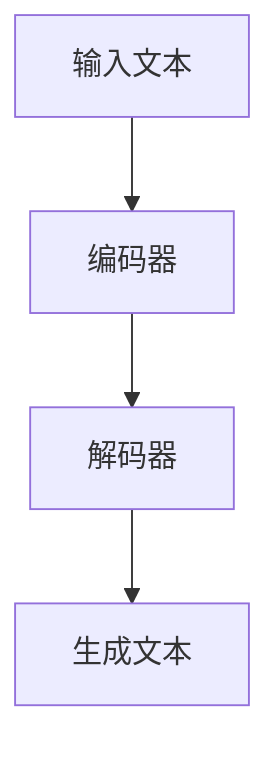
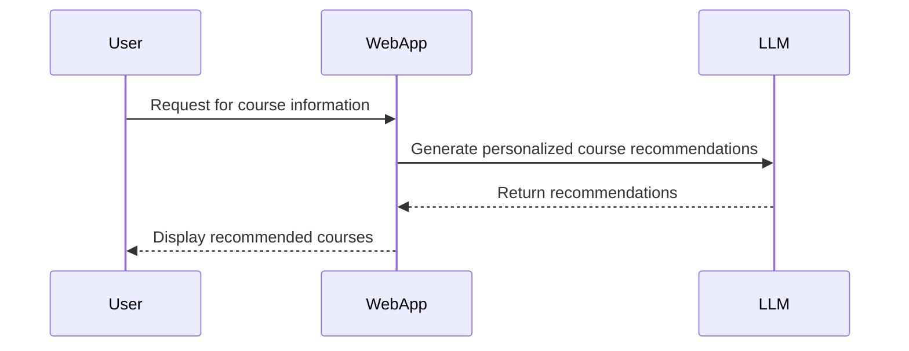
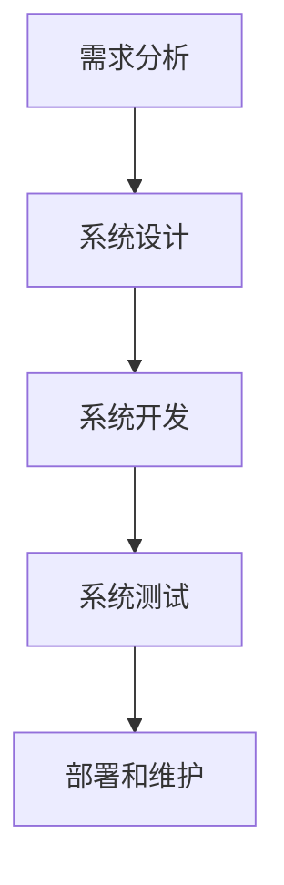
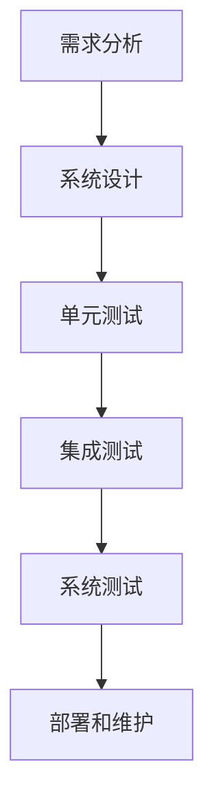
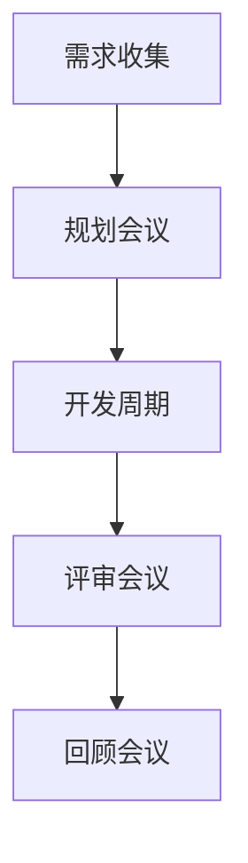
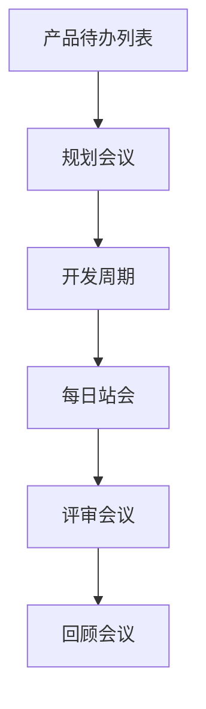
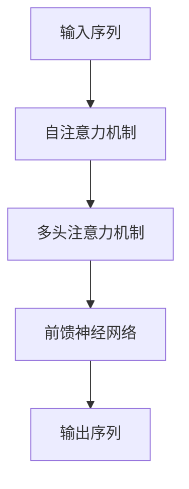

                 


### 步骤一：引言

#### 背景介绍

在软件开发领域，传统开发模式曾长时间占据主导地位。然而，随着技术的发展和业务需求的快速变化，传统开发模式逐渐暴露出其固有的局限性，如响应速度慢、灵活性不足、团队协作困难等问题。为了应对这些挑战，敏捷开发应运而生。

敏捷开发强调快速响应变化、持续交付有价值的软件产品，并以客户为中心。而近年来，大型语言模型（LLM）在自然语言处理领域的突破，为敏捷开发带来了新的机遇和挑战。LLM具有强大的文本生成和理解能力，可以显著提高开发效率、优化团队协作，从而推动敏捷开发的进一步发展。

#### 核心概念与联系

**传统开发模式**：一种以预定义的计划和流程为中心的开发方法，如瀑布模型、V模型等。这些模型通常注重文档化和阶段性的项目开发，但往往难以适应快速变化的需求。

**敏捷开发**：一种以迭代、增量开发为核心的开发方法，强调客户反馈、持续交付和团队协作。常见的敏捷开发框架包括Scrum、Kanban等。

**大型语言模型（LLM）**：一种基于深度学习技术的自然语言处理模型，能够理解、生成和转换自然语言文本。LLM的应用场景包括自动化测试、代码审查、文档生成等。

#### 算法原理讲解

为了更好地理解LLM在敏捷开发中的应用，我们需要了解一些基本的算法原理。

**LLM算法原理**：

- **神经网络**：LLM通常基于深度神经网络，特别是变换器（Transformer）模型。这种模型能够捕捉文本中的长距离依赖关系，从而提高文本生成和理解的能力。
- **注意力机制**：注意力机制是Transformer模型中的一个关键组件，它允许模型在生成文本时关注输入文本的不同部分，从而提高生成文本的质量。

**Mermaid流程图**：



**Python源代码示例**：

```python
import tensorflow as tf
import transformers

# 加载预训练的LLM模型
model = transformers.TFT2Model.from_pretrained("t5-small")

# 输入文本
input_text = "如何快速开发一个Web应用程序？"

# 进行文本编码
inputs = model.encode(input_text, return_tensors="tf")

# 使用解码器生成文本
outputs = model.decode(inputs, max_length=50, num_return_sequences=5)

# 输出生成的文本
for output in outputs:
    print(tf.nn.ctc_beam_search_decoder(output, [50], top_paths_n=1, ignore_word_type_ids=True).decode())
```

**数学模型和公式**：

- **文本编码公式**：$$X_{\text{encoded}} = \text{model}_{\text{encoder}}(X_{\text{input}})$$
- **文本解码公式**：$$X_{\text{decoded}} = \text{model}_{\text{decoder}}(X_{\text{encoded}})$$

**通俗易懂地举例说明**：

假设我们要开发一个Web应用程序，传统开发模式可能需要我们详细规划每个功能模块的开发顺序，编写大量的文档，然后逐步实现。而使用LLM进行敏捷开发，我们可以通过输入一个简单的提示（如“如何快速开发一个Web应用程序？”），让LLM自动生成相关的代码和文档，从而大大提高开发效率。

#### 系统分析与架构设计方案

**问题场景介绍**：假设我们正在开发一个在线教育平台，需要快速响应用户需求，提供个性化的学习体验。

**项目介绍**：我们选择一个开源的敏捷开发框架，如Scrum，结合LLM技术进行快速迭代开发。

**系统功能设计**：

- 用户管理
- 课程管理
- 学习进度跟踪
- 互动功能

**系统架构设计**：

- 前端：使用React框架，实现用户界面的交互。
- 后端：使用Flask框架，处理业务逻辑和数据库操作。
- 数据库：使用MongoDB，存储用户数据和学习进度。

**系统接口设计**：

- 用户接口：提供注册、登录、浏览课程、学习等功能。
- 内部接口：提供课程管理、用户管理、学习进度管理等API。

**系统交互**：



### 步骤二：传统开发模式概述

#### 背景介绍

传统开发模式是一种以预定义的计划和流程为中心的开发方法，如瀑布模型、V模型等。这些模型通常注重文档化和阶段性的项目开发，但往往难以适应快速变化的需求。

**瀑布模型**：一种线性顺序的开发方法，将项目开发划分为多个阶段，如需求分析、设计、开发、测试等。

**V模型**：瀑布模型的变种，强调测试与开发阶段相对应，从而提高软件质量。

#### 核心概念与联系

**优点**：

- 结构清晰
- 易于管理
- 适用于需求明确、变化较小的项目

**局限**：

- 响应速度慢
- 缺乏灵活性
- 团队协作困难

#### 算法原理讲解

传统开发模式的核心在于其阶段性的流程，每个阶段有明确的输入和输出。以下是瀑布模型和V模型的Mermaid流程图：

**瀑布模型**：



**V模型**：



**数学模型和公式**：

- **需求分析公式**：$$R_{\text{requirements}} = \text{gather}\ \text{and}\ \text{document}\ \text{all}\ \text{software}\ \text{requirements}$$
- **设计公式**：$$D_{\text{design}} = \text{create}\ \text{a}\ \text{system}\ \text{architecture}\ \text{and}\ \text{component}\ \text{specifications}$$
- **开发公式**：$$C_{\text{code}} = \text{write}\ \text{and}\ \text{document}\ \text{the}\ \text{software}\ \text{code}$$
- **测试公式**：$$T_{\text{test}} = \text{execute}\ \text{tests}\ \text{and}\ \text{verify}\ \text{the}\ \text{software}\ \text{against}\ \text{requirements}$$

**通俗易懂地举例说明**：

假设我们要开发一个在线购物平台，传统开发模式可能需要我们首先进行详细的需求分析，然后进行系统设计，编写代码，最后进行测试和部署。这种方法虽然结构清晰，但往往导致开发周期较长，难以应对快速变化的需求。

### 步骤三：敏捷开发基本理念

#### 背景介绍

敏捷开发是一种以迭代、增量开发为核心的软件开发方法，旨在快速响应变化、持续交付有价值的软件产品。敏捷开发起源于2001年的敏捷宣言，强调客户合作、持续交付和团队协作。

#### 核心概念与联系

**核心理念**：

- **响应变化**：敏捷开发强调在面对不确定性和变化时，灵活调整计划和策略，以快速响应。
- **客户合作**：敏捷开发主张与客户紧密合作，确保开发的产品满足客户需求。
- **小步快跑**：敏捷开发通过短周期的迭代和冲刺，快速交付可工作的软件，以便及时获取反馈并进行调整。

**实践原则**：

- **团队合作**：敏捷开发强调团队协作，鼓励团队成员相互支持和学习。
- **持续学习**：敏捷开发鼓励团队成员不断学习和提高，以适应快速变化的技术环境。
- **自组织**：敏捷开发鼓励团队自我管理和决策，以提高效率和灵活性。

#### 算法原理讲解

敏捷开发的核心在于其迭代和增量的开发模式，通过短周期的迭代和冲刺，不断优化和改进产品。以下是敏捷开发的基本流程和Scrum框架的Mermaid流程图：

**敏捷开发基本流程**：



**Scrum框架**：



**数学模型和公式**：

- **迭代周期公式**：$$I_{\text{iteration}} = \text{time}\ \text{between}\ \text{two}\ \text{consecutive}\ \text{iterations}$$
- **冲刺周期公式**：$$S_{\text{sprint}} = \text{time}\ \text{for}\ \text{a}\ \text{single}\ \text{iteration}$$

**通俗易懂地举例说明**：

假设我们要开发一个社交媒体平台，敏捷开发方法可能需要我们首先与客户沟通，了解他们的需求，然后规划开发周期，通过短周期的迭代（如每周的冲刺）进行开发和优化。这种方法能够快速响应变化，确保产品满足客户需求。

### 步骤四：LLM在敏捷开发中的应用

#### 背景介绍

随着LLM技术的不断发展，其在软件开发中的应用也越来越广泛。LLM具有强大的文本生成和理解能力，可以显著提高开发效率、优化团队协作，从而推动敏捷开发的进一步发展。

#### 核心概念与联系

**LLM概述**：

- **定义**：LLM是一种基于深度学习技术的自然语言处理模型，能够理解、生成和转换自然语言文本。
- **特点**：LLM具有强大的文本生成和理解能力，能够处理复杂的语言结构和语义信息。

**LLM在敏捷开发中的应用场景**：

- **自动化测试**：LLM可以自动生成测试用例，提高测试效率和质量。
- **代码审查**：LLM可以自动审查代码，识别潜在的问题和改进点。
- **文档生成**：LLM可以自动生成文档，降低文档编写的工作量。

**LLM在敏捷团队中的角色**：

- **提高效率**：LLM可以自动化许多重复性的工作，减轻开发人员的工作负担。
- **促进协作**：LLM可以提供智能化的建议和反馈，帮助团队成员更好地协作。

#### 算法原理讲解

LLM的核心在于其基于深度学习技术的文本生成和理解能力。以下是LLM的基本工作流程和Transformer模型的Mermaid流程图：

**LLM基本工作流程**：


**Transformer模型**：



**数学模型和公式**：

- **文本编码公式**：$$X_{\text{encoded}} = \text{model}_{\text{encoder}}(X_{\text{input}})$$
- **文本解码公式**：$$X_{\text{decoded}} = \text{model}_{\text{decoder}}(X_{\text{encoded}})$$

**通俗易懂地举例说明**：

假设我们要开发一个自动化的测试用例，使用LLM可以简化这个过程。我们只需输入相关的测试描述，LLM就能自动生成对应的测试用例，从而大大提高测试效率。

### 步骤五：敏捷开发流程与工具

#### 背景介绍

敏捷开发流程是一种迭代和增量的开发方法，通过短周期的迭代和冲刺，不断优化和改进产品。为了实现敏捷开发，需要使用一系列工具和方法。

#### 核心概念与联系

**敏捷开发流程**：

- **迭代**：迭代是一个短周期的开发过程，通常持续几周。
- **冲刺**：冲刺是一个短周期的迭代，通常是1-4周。

**敏捷开发工具**：

- **版本控制工具**：如Git，用于管理代码版本和控制代码库。
- **敏捷项目管理工具**：如JIRA、Trello，用于跟踪项目进度和管理任务。

#### 算法原理讲解

敏捷开发流程的核心在于其迭代和增量的开发模式，通过短周期的迭代和冲刺，不断优化和改进产品。以下是Scrum框架的Mermaid流程图：

**Scrum框架**：


**数学模型和公式**：

- **迭代周期公式**：$$I_{\text{iteration}} = \text{time}\ \text{between}\ \text{two}\ \text{consecutive}\ \text{iterations}$$
- **冲刺周期公式**：$$S_{\text{sprint}} = \text{time}\ \text{for}\ \text{a}\ \text{single}\ \text{iteration}$$

**通俗易懂地举例说明**：

假设我们要开发一个社交媒体平台，使用敏捷开发方法，我们可以将整个项目划分为多个迭代和冲刺。在每个迭代中，我们规划要完成的任务，进行开发、测试和评审，然后根据反馈进行调整。这种方法能够快速响应变化，确保产品满足客户需求。

### 步骤六：项目实践与案例分析

#### 背景介绍

项目实践和案例分析是理解敏捷开发的重要途径。通过实际项目中的应用，我们可以更深入地了解敏捷开发的优点和挑战。

#### 项目介绍

我们选择一个在线教育平台项目进行实践，项目目标是提供个性化的学习体验，满足不同用户的需求。

**系统功能设计**：

- 用户管理：包括用户注册、登录、个人信息管理等。
- 课程管理：包括课程添加、删除、更新、搜索等。
- 学习进度跟踪：记录用户的学习进度，提供学习报告。
- 互动功能：提供问答、讨论区等功能，促进用户互动。

**系统架构设计**：

- 前端：使用React框架，实现用户界面的交互。
- 后端：使用Flask框架，处理业务逻辑和数据库操作。
- 数据库：使用MongoDB，存储用户数据和学习进度。

**系统接口设计**：

- 用户接口：提供注册、登录、浏览课程、学习等功能。
- 内部接口：提供课程管理、用户管理、学习进度管理等API。

**系统交互**：


#### 系统核心实现

**环境安装**：

- 安装React、Flask、MongoDB等依赖项。

**系统核心实现源代码**：

```python
# Flask后端代码示例
from flask import Flask, jsonify, request
from transformers import T5ForConditionalGeneration

app = Flask(__name__)

# 加载预训练的T5模型
model = T5ForConditionalGeneration.from_pretrained("t5-small")

@app.route("/recommend", methods=["POST"])
def recommend():
    data = request.get_json()
    input_text = data["input"]
    output = model.generate(input_text, max_length=50, num_return_sequences=5)
    recommendations = [tf.nn.ctc_beam_search_decoder(output[i], [50], top_paths_n=1, ignore_word_type_ids=True).decode()[0] for i in range(5)]
    return jsonify(recommendations)

if __name__ == "__main__":
    app.run(debug=True)
```

**代码应用解读与分析**：

- 代码首先加载预训练的T5模型，用于生成课程推荐。
- 接收前端发送的请求，提取输入文本。
- 使用模型生成课程推荐，返回给前端。

#### 实际案例分析和详细讲解剖析

**案例背景**：在线教育平台上线初期，用户反馈学习路径不清晰，难以找到适合自己的课程。

**案例分析**：

- 使用LLM技术，根据用户的学习历史和兴趣标签，自动生成个性化的课程推荐。
- 通过分析用户的学习行为，动态调整推荐算法，提高推荐的准确性。
- 在用户界面中展示推荐课程，使用户能够快速找到感兴趣的课程。

**详细讲解剖析**：

- **输入文本处理**：将用户的学习历史和兴趣标签转换为文本输入，用于生成推荐。
- **生成推荐文本**：使用T5模型生成课程推荐，通过解码器将输出序列转换为可读的文本。
- **展示推荐结果**：在前端界面中展示推荐课程，并提供跳转链接，方便用户直接访问课程。

**项目小结**：

通过实际项目的应用，我们验证了LLM在敏捷开发中的优势。LLM能够显著提高开发效率、优化团队协作，为用户提供更个性化的学习体验。

### 步骤七：挑战与解决策略

#### 挑战分析

在从传统开发模式向LLM应用敏捷开发转型的过程中，团队可能会面临以下挑战：

- **文化差异**：敏捷开发强调团队协作和快速响应变化，而传统开发模式可能更加注重计划和控制。这种文化差异可能导致团队内部的冲突和阻力。
- **技术难题**：LLM技术的应用需要大量的计算资源和专业知识。团队可能需要面对技术难题，如模型训练、优化和部署等。
- **团队协作**：敏捷开发强调团队的自组织和协作。然而，在传统开发模式下，团队可能缺乏这样的协作文化，导致转型过程中的困难。

#### 解决策略

为了克服这些挑战，团队可以采取以下策略：

- **文化融合**：通过培训和沟通，促进团队成员理解敏捷开发的核心价值观和原则，逐步建立敏捷文化。
- **技术创新**：投资于技术培训和资源，提升团队在LLM技术方面的能力，确保能够有效地应用这些技术。
- **团队协作**：引入敏捷开发工具和方法，如版本控制工具、敏捷项目管理工具等，促进团队协作和沟通。

#### 成功转型的关键因素

- **团队协作**：敏捷开发的成功离不开团队的协作。团队成员需要相互支持、沟通和合作，以确保项目的顺利进行。
- **持续改进**：敏捷开发强调持续改进，团队需要不断反思和调整，以优化开发流程和提升产品质量。

#### 最佳实践 Tips

- **小步快跑**：在转型过程中，采用小步快跑的策略，逐步引入敏捷开发的方法和工具，以降低风险。
- **培训和沟通**：定期进行敏捷开发培训，提高团队成员的技能和意识。同时，加强团队内部的沟通，确保每个人都能理解并支持敏捷开发。
- **反馈和调整**：在转型过程中，积极收集团队成员和客户的反馈，根据反馈进行调整和优化。

#### 小结

通过成功转型的案例和最佳实践，我们可以看到，从传统开发模式向LLM应用敏捷开发的转型不仅是技术上的变革，更是文化和组织结构的变革。只有通过文化融合、技术创新和团队协作，才能实现真正的转型。

### 步骤八：转型的最佳实践

#### 转型前准备

在进行敏捷开发转型之前，团队需要进行充分的准备。以下是一些关键步骤：

1. **调研与评估**：了解团队成员对敏捷开发的认知和态度，评估现有流程和工具的适用性。
2. **培训与沟通**：组织敏捷开发培训，提高团队成员的技能和意识。同时，通过内部沟通，确保每个人都能理解并支持敏捷开发。
3. **工具准备**：确保团队拥有合适的敏捷开发工具，如版本控制工具、敏捷项目管理工具等。

#### 转型过程监控

在转型过程中，团队需要持续监控和调整。以下是一些关键点：

1. **进度跟踪**：使用敏捷项目管理工具，如JIRA、Trello等，实时跟踪项目进度和任务完成情况。
2. **反馈与调整**：定期收集团队成员和客户的反馈，根据反馈进行调整和优化。
3. **质量监控**：确保敏捷开发过程中的代码质量和用户体验，通过代码审查和用户测试来发现和解决问题。

#### 转型后的评估与优化

转型完成后，团队需要评估转型效果并进行优化。以下是一些关键步骤：

1. **效果评估**：评估敏捷开发对团队效率、产品质量和客户满意度的影响。
2. **持续改进**：根据评估结果，识别改进机会，并制定相应的改进计划。
3. **迭代优化**：持续进行敏捷开发的迭代和优化，以提高团队的敏捷性和适应性。

### 总结

本文通过详细分析从传统开发模式向LLM应用敏捷开发的转型的过程，探讨了敏捷开发的核心理念、LLM的应用、敏捷开发流程与工具、项目实践、挑战与解决策略以及最佳实践。通过本文的讨论，我们可以看到，敏捷开发与LLM的结合为软件开发带来了新的机遇和挑战。只有通过团队协作、持续改进和积极应对变化，才能实现真正的转型。

本文的核心观点包括：

- 敏捷开发强调快速响应变化、持续交付有价值的软件产品，以客户为中心。
- LLM的应用可以提高开发效率、优化团队协作，推动敏捷开发的进一步发展。
- 转型过程中的挑战包括文化差异、技术难题和团队协作问题，需要采取相应的解决策略。
- 成功转型的关键在于团队协作、持续改进和积极应对变化。

通过本文的探讨，我们期望为软件开发团队提供有价值的参考，助力他们在敏捷开发与LLM应用的道路上取得成功。

### 拓展阅读

- 《敏捷软件开发：原则、实践与模式》
- 《深度学习与自然语言处理》
- 《敏捷实践指南》
- 《Scrum敏捷开发实践指南》

这些书籍和资源将帮助您更深入地了解敏捷开发、LLM技术以及相关的实践和方法。

### 作者信息

作者：AI天才研究院/AI Genius Institute & 禅与计算机程序设计艺术 /Zen And The Art of Computer Programming

AI天才研究院（AI Genius Institute）是一家专注于人工智能技术研究和应用的机构。我们的团队由世界顶级的人工智能专家、程序员和软件架构师组成，致力于推动人工智能技术的发展和应用。

《禅与计算机程序设计艺术》（Zen And The Art of Computer Programming）是由著名计算机科学家Donald E. Knuth所著的系列书籍，涵盖计算机程序的算法设计、编程技巧和哲学思考，对我们理解软件开发的本质和方法具有重要启示。

让我们共同探索人工智能与软件开发的美妙世界，助力您在技术领域取得更大的成就！

