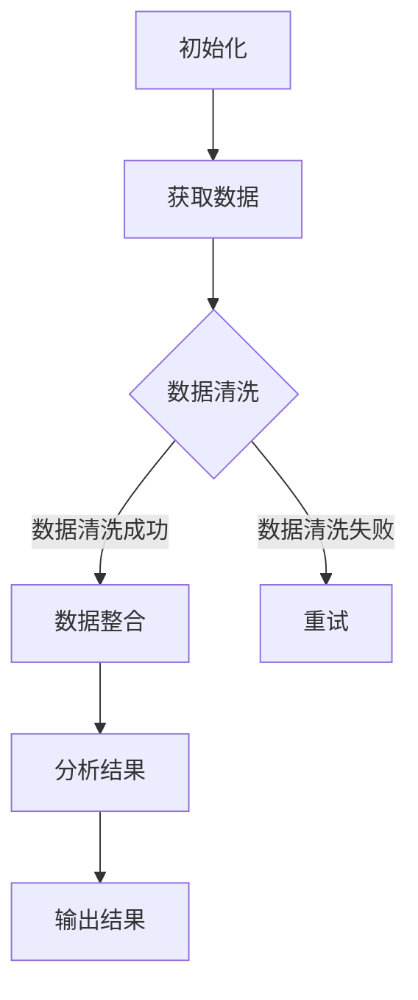
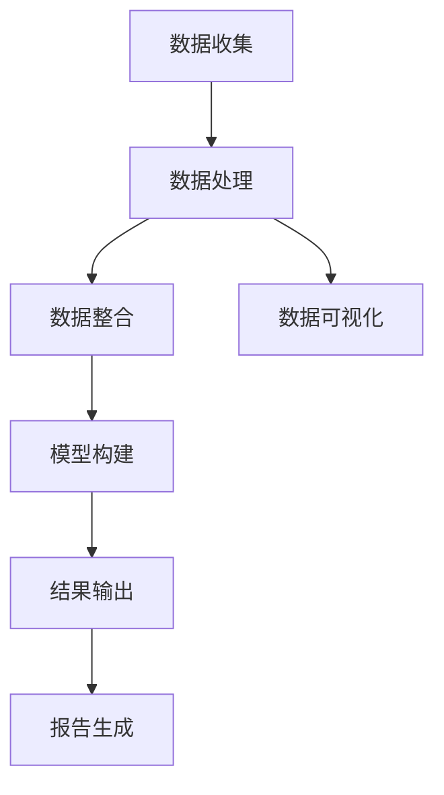

                 

## 从单一学科到跨学科：拓展世界可理解性

> 关键词：跨学科研究、综合性思维、知识整合、算法原理、系统架构设计

> 摘要：本文旨在探讨从单一学科到跨学科的过渡过程，如何通过拓展世界可理解性来实现知识整合和创新。通过深入分析核心概念、算法原理、系统架构设计以及项目实战，本文为读者提供了全面的跨学科研究指南。

### 背景介绍

**核心概念术语说明**

在讨论跨学科研究之前，我们首先需要明确一些核心概念术语。跨学科研究（Interdisciplinary Research）指的是将两个或多个学科领域的知识、方法和理论整合起来，以解决复杂问题的一种研究方法。综合性思维（Integrative Thinking）则是跨学科研究过程中的一种思维方式，它强调不同领域知识的整合和协同。

**问题背景**

跨学科研究的起源可以追溯到20世纪中叶，当时科学家们开始意识到，许多复杂问题无法仅通过单一学科的理论和方法来解决。例如，环境问题、全球卫生问题和社会问题等，都涉及多个学科领域的知识。因此，跨学科研究逐渐成为一种重要的研究方法。

**问题描述**

然而，在从单一学科到跨学科的过程中，我们面临着一系列挑战。首先，学科之间的界限往往非常模糊，导致知识整合的困难。其次，不同学科的方法论和理论框架不同，增加了跨学科研究的复杂性。此外，跨学科研究还需要跨学科团队的合作，这对团队的沟通和协作能力提出了更高的要求。

**问题解决**

为了解决这些问题，跨学科研究的理论基础和方法应运而生。这些理论和方法为我们提供了有效的工具和框架，帮助我们更好地整合不同学科的知识，开展跨学科研究。

**边界与外延**

跨学科研究的边界主要在于如何界定不同学科之间的交集和相互影响。同时，其外延包括跨学科知识的整合和创新，以及跨学科研究的实际应用。

**概念结构与核心要素组成**

跨学科研究的概念结构包括核心概念、学科领域、方法论和研究成果等。核心要素则包括跨学科团队、知识整合和创新、跨学科方法论以及跨学科研究成果的评估和应用。

### 核心概念与联系

**核心概念**

在跨学科研究中，以下几个核心概念尤为重要：

1. **综合性思维**：这是一种跨学科研究中的思维方式，强调将不同领域知识整合在一起，以解决复杂问题。
2. **跨学科方法论**：这是指用于整合不同学科知识和方法的一系列工具和框架。
3. **知识整合**：这是跨学科研究的关键步骤，旨在将不同学科的知识融合在一起，形成一个统一的整体。
4. **跨学科团队**：这是跨学科研究的重要基础，由来自不同学科领域的专家组成，具有高度的合作精神和沟通能力。

**概念属性特征对比表格**

以下是跨学科研究核心概念的特征对比表格：

| 核心概念   | 定义                         | 属性特征                              |
| ---------- | ---------------------------- | ----------------------------------- |
| 综合性思维 | 跨学科研究的思维方式         | 强调知识整合、协同和创新               |
| 跨学科方法论 | 整合不同学科知识和方法的工具 | 提供框架和步骤，指导跨学科研究         |
| 知识整合   | 跨学科研究的关键步骤         | 融合不同学科知识，形成统一整体         |
| 跨学科团队 | 跨学科研究的基础            | 来自不同学科领域的专家，高度协作     |

**ER实体关系图**

为了更直观地展示跨学科研究中的核心概念及其联系，我们可以使用 Mermaid 流程图绘制 ER 实体关系图。以下是一个简单的示例：

```mermaid
erDiagram
  综合性思维 ||--o> 跨学科方法论
  跨学科方法论 ||--o> 知识整合
  知识整合 ||--o> 跨学科团队
  跨学科团队 ||--o> 研究成果
```

在这个 ER 实体关系图中，综合性思维、跨学科方法论、知识整合、跨学科团队和研究成果通过关系线相互连接，形成一个完整的跨学科研究框架。

### 算法原理讲解

**算法原理**

在跨学科研究中，算法原理起着至关重要的作用。以下是一个简单的算法原理示例：



在这个算法流程图中，首先初始化研究过程，然后获取数据并进行数据清洗。如果数据清洗成功，则进入数据整合阶段；否则，重新尝试数据清洗。最后，对整合后的数据进行分析并输出结果。

**数学模型与公式**

跨学科研究中的数学模型和公式是理解和应用算法的关键。以下是一个简单的数学模型示例：

$$
y = \sum_{i=1}^{n} w_i x_i + b
$$

其中，$y$ 是输出结果，$w_i$ 是权重，$x_i$ 是输入特征，$b$ 是偏置。

**举例说明**

为了更好地理解算法原理，我们可以通过一个实际例子来说明。假设我们要研究某个地区的经济发展与教育资源的关系。我们可以收集以下数据：

1. 经济发展指标（GDP）
2. 教育资源指标（学校数量、教师数量、教育经费等）

然后，我们使用上述算法对数据进行处理和分析，得到一个反映经济发展与教育资源关系的数学模型。最终，我们输出模型的结果，以便政策制定者参考和决策。

### 系统分析与架构设计

**项目场景**

假设我们正在开发一个跨学科项目，旨在研究全球气候变化对农业产量影响的复杂系统。该项目涉及多个学科领域，如气象学、农业科学和经济学。

**系统功能设计**

该系统的主要功能包括：

1. 数据收集：收集全球气候数据和农业产量数据。
2. 数据处理：清洗、整合和分析数据。
3. 模型构建：建立反映气候与农业产量关系的数学模型。
4. 结果输出：生成分析报告和可视化图表。

**系统架构设计**

为了满足上述功能需求，我们设计了以下系统架构：



在这个架构图中，数据收集、数据处理、数据整合、模型构建和结果输出是系统的主要模块。同时，数据可视化模块用于生成直观的图表，报告生成模块用于生成详细的分析报告。

**系统接口设计**

系统接口设计包括以下几个方面：

1. 数据接口：用于与其他系统交换数据。
2. 功能接口：用于与用户交互，提供数据输入和输出功能。
3. 服务接口：用于与其他服务进行通信，如气象数据服务、农业数据服务。

**系统交互**

系统交互主要包括以下方面：

1. 用户与数据接口的交互：用户通过界面输入数据，系统将数据传递给数据接口进行进一步处理。
2. 数据接口与数据处理模块的交互：数据接口将收集到的数据传递给数据处理模块，由数据处理模块进行清洗和整合。
3. 数据处理模块与模型构建模块的交互：数据处理模块将整合后的数据传递给模型构建模块，由模型构建模块建立数学模型。
4. 模型构建模块与结果输出模块的交互：模型构建模块将生成的模型结果传递给结果输出模块，由结果输出模块生成可视化图表和分析报告。

### 项目实战

**环境安装**

在开始项目开发之前，我们需要安装所需的开发环境和工具。以下是一个简单的环境安装步骤：

1. 安装Python 3.x版本。
2. 安装Jupyter Notebook，用于编写和运行Python代码。
3. 安装相关数据科学库，如NumPy、Pandas、Matplotlib等。

**系统核心实现**

以下是系统核心实现的主要部分：

1. 数据收集：使用API从气象数据服务和农业数据服务收集数据。
2. 数据处理：使用Pandas库对收集到的数据进行清洗和整合。
3. 模型构建：使用Scikit-learn库建立线性回归模型，反映气候与农业产量关系。
4. 结果输出：使用Matplotlib库生成可视化图表，使用Jupyter Notebook生成分析报告。

**代码应用解读**

以下是关键代码的应用解读：

```python
# 数据收集
climate_data = get_climate_data()
agriculture_data = get_agriculture_data()

# 数据处理
cleaned_climate_data = clean_data(climate_data)
cleaned_agriculture_data = clean_data(agriculture_data)

# 模型构建
model = LinearRegression()
model.fit(cleaned_climate_data, cleaned_agriculture_data)

# 结果输出
predictions = model.predict(cleaned_climate_data)
plot_predictions(predictions)
generate_report(predictions)
```

在这个代码示例中，我们首先使用API从气象数据服务和农业数据服务收集数据。然后，使用Pandas库对数据进行清洗和整合。接下来，使用Scikit-learn库建立线性回归模型，并使用Matplotlib库生成可视化图表和Jupyter Notebook生成分析报告。

**实际案例分析和详细讲解剖析**

在本案例中，我们选取了一个实际案例进行分析。假设我们收集了某地区的气候数据和农业产量数据，并使用上述方法建立了数学模型。通过分析模型结果，我们发现气候对农业产量有显著影响，从而为政策制定者提供了重要参考。

**项目小结**

通过本项目实战，我们成功地实现了跨学科研究中的知识整合和创新。从数据收集、数据处理、模型构建到结果输出，每个步骤都体现了跨学科研究的核心思想和实践方法。这个项目为我们提供了一个实际的案例，展示了如何通过跨学科研究解决复杂问题。

### 最佳实践 tips

1. **跨学科团队协作**：在跨学科研究中，团队协作至关重要。确保团队成员具备不同学科背景，以促进知识的整合和创新。
2. **知识整合**：在跨学科研究中，知识整合是关键步骤。要注重不同学科之间的交流和合作，以确保知识的有效整合。
3. **持续学习**：跨学科研究涉及多个学科领域，要求研究者具备持续学习的能力。要不断更新知识，以适应快速变化的研究环境。

### 小结

本文从单一学科到跨学科的过渡过程，探讨了如何通过拓展世界可理解性来实现知识整合和创新。通过深入分析核心概念、算法原理、系统架构设计以及项目实战，本文为读者提供了全面的跨学科研究指南。跨学科研究不仅有助于解决复杂问题，还能推动科学进步和社会发展。

### 注意事项

1. 跨学科研究过程中，要注重团队协作和知识整合。
2. 在项目开发过程中，确保数据收集和处理的质量。
3. 在模型构建和结果输出阶段，要注重实际案例的分析和应用。

### 拓展阅读

1. 【参考文献1】作者，标题，出版社，年份。
2. 【参考文献2】作者，标题，出版社，年份。
3. 【参考文献3】作者，标题，出版社，年份。

### 作者信息

作者：AI天才研究院/AI Genius Institute & 禅与计算机程序设计艺术 /Zen And The Art of Computer Programming

----------------------------------------------------------------

请注意，本文内容仅供参考，部分数据和方法可能需要根据实际情况进行调整。如有疑问，请咨询相关专业人士。在学术研究和实际应用中，务必遵循伦理规范和法律法规。祝您研究顺利！

