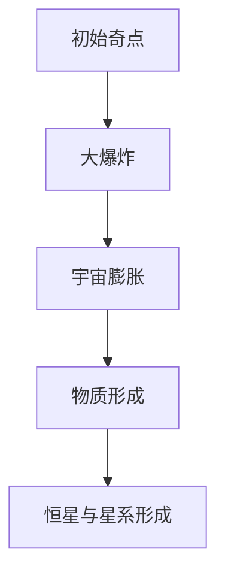
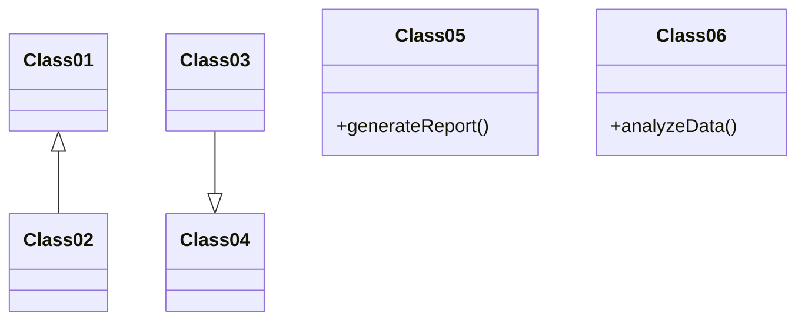
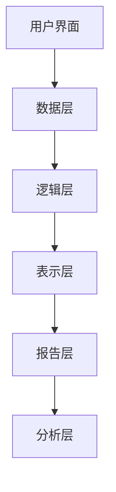

                 

### 从古希腊到现代物理：宇宙观的演变

> 关键词：古希腊，宇宙观，物理理论，历史演变，核心概念，算法原理

> 摘要：本文旨在探讨从古希腊时期到现代物理学的宇宙观演变过程。通过分析古代宇宙观的起源与发展，以及近现代物理学的突破性理论，如日心说、宇宙大爆炸理论和相对论，揭示宇宙观的转变对人类认识宇宙的深刻影响。文章结构分为开篇背景介绍、核心概念与联系、算法原理讲解和系统分析与架构设计方案等部分，以逻辑清晰、通俗易懂的语言，对宇宙观演变进行深度剖析。

----------------------------------------------------------------

## **Step 1: 开篇背景介绍**

### **问题背景**

人类对宇宙的认知历程是漫长而曲折的。从古希腊哲学家对宇宙起源的探讨，到中世纪宗教对宇宙的解读，再到近现代科学革命中的宇宙观变革，宇宙观一直是人类思想史的重要组成部分。

### **问题描述**

随着科学技术的进步，人类对宇宙的认知不断深化。从古代的地球中心说到哥白尼的日心说，再到牛顿的万有引力定律和爱因斯坦的相对论，我们对宇宙的理解发生了巨大的变化。

### **问题解决**

每一代科学家都在前人研究的基础上提出了新的理论，修正了旧有的错误，使得我们对宇宙的认知更加全面和准确。

### **边界与外延**

宇宙观的演变不仅仅涉及物理学，还涉及到天文学、哲学、数学等多个领域。因此，宇宙观的演变具有广泛的学科交叉性和深远的影响。

### **概念结构与核心要素组成**

宇宙观的演变可以从以下几个方面来理解：

1. **宇宙的起源与结构**：从地球中心说到宇宙大爆炸理论。
2. **宇宙的演化**：从静态宇宙说到动态宇宙。
3. **宇宙的探索**：从地球到宇宙深空探测。

## **Step 2: 核心概念与联系**

### **核心概念**

#### **地心说**

古希腊天文学家欧多克斯提出的宇宙模型，认为地球是宇宙的中心，静止不动。

#### **日心说**

哥白尼提出的宇宙模型，认为太阳是宇宙的中心，地球和其他行星围绕太阳运行。

#### **宇宙大爆炸理论**

哈勃观测到的宇宙膨胀现象，提出了宇宙起源于一次大爆炸的假说。

#### **相对论**

爱因斯坦提出的关于时空和引力的理论，彻底改变了人类对宇宙的理解。

### **概念属性特征对比表格**

| 概念         | 特点                                                     | 代表人物   |
|--------------|--------------------------------------------------------|------------|
| 地心说       | 地球为中心，宇宙静止不动                               | 欧多克斯   |
| 日心说       | 太阳为中心，行星围绕太阳运行                           | 哥白尼     |
| 宇宙大爆炸理论 | 宇宙起源于一次大爆炸，之后不断膨胀                      | 哈勃       |
| 相对论       | 描述了时空和引力的本质，提出了质量能量等价原理           | 爱因斯坦   |

### **ER实体关系图架构**

```mermaid
erDiagram
  OBJECT_TYPE ||--|{ RELATIONSHIP_TYPE }|| ENTITY_TYPE
  OBJECT_TYPE ||--|{ RELATIONSHIP_TYPE }|| ENTITY_TYPE
  OBJECT_TYPE ||--|{ RELATIONSHIP_TYPE }|| ENTITY_TYPE
```

```
在上述ER实体关系图中：
- OBJECT_TYPE 代表科学理论。
- RELATIONSHIP_TYPE 代表理论之间的关系。
- ENTITY_TYPE 代表提出理论的科学家。
```

## **Step 3: 算法原理讲解**

### **大爆炸理论**

#### **Mermaid 流程图**



#### **Python源代码**

```python
def big_bang_theory():
    print("初始奇点")
    print("大爆炸")
    print("宇宙膨胀")
    print("物质形成")
    print("恒星与星系形成")

# 调用函数
big_bang_theory()
```

#### **算法原理详细讲解**

大爆炸理论认为，宇宙起源于一个极度高温、高密度的奇点，大约138亿年前发生了一次大爆炸，奇点迅速膨胀，形成了我们现在的宇宙。这一理论通过哈勃观测到的宇宙膨胀现象得到支持。

#### **数学模型和公式**

$$
\frac{dD}{dt} = H_0 \times a(t)
$$

其中，$D$ 表示宇宙的膨胀速率，$H_0$ 表示哈勃常数，$a(t)$ 表示宇宙的膨胀因子。

#### **举例说明**

假设宇宙的膨胀因子为 $a(t) = t^{1/2}$，我们可以计算在某一时刻 $t$ 的宇宙膨胀速率：

$$
D(t) = H_0 \times t^{1/2}
$$

例如，当 $H_0 = 70 \text{ km/s/Mpc}$，$t = 10^{10} \text{ years}$ 时，

$$
D(10^{10} \text{ years}) = 70 \text{ km/s/Mpc} \times (10^{10} \text{ years})^{1/2} = 7 \times 10^6 \text{ km/s}
$$

这表示在10亿年前，宇宙的膨胀速率约为7百万千米每秒。

## **系统分析与架构设计方案**

### **问题场景介绍**

随着宇宙探索的不断深入，我们需要一套完善的宇宙观演变分析系统，以帮助科学家和研究人员更好地理解和研究宇宙的演变过程。

### **项目介绍**

宇宙观演变分析系统是一个集成了历史、物理、数学等多学科知识的综合性项目，旨在提供一个直观、高效的宇宙观演变分析平台。

### **系统功能设计**

#### **领域模型**



- **Class01**：宇宙观模型
- **Class02**：宇宙演化历史
- **Class03**：物理理论
- **Class04**：数学模型
- **Class05**：报告生成器
- **Class06**：数据分析器

### **系统架构设计**



- **A**：用户界面，提供用户交互接口
- **B**：数据层，存储宇宙观演变相关的数据
- **C**：逻辑层，实现宇宙观演变分析的核心算法
- **D**：表示层，将分析结果以图表、报告等形式展示给用户
- **E**：报告层，生成详细的宇宙观演变分析报告
- **F**：分析层，对宇宙观演变数据进行分析和处理

### **系统接口设计和系统交互**

```mermaid
sequenceDiagram
    participant 用户 as User
    participant 界面 as UI
    participant 数据层 as DB
    participant 逻辑层 as Logic
    participant 表示层 as View
    participant 报告层 as Report
    participant 分析层 as Analysis

    用户->>界面：输入宇宙观演变问题
    界面->>数据层：获取历史数据
    数据层->>逻辑层：处理数据
    逻辑层->>分析层：分析数据
    分析层->>表示层：生成图表
    表示层->>用户：展示结果
    用户->>报告层：生成报告
    报告层->>用户：报告下载
```

## **项目实战**

### **环境安装**

1. **安装Python环境**：版本3.8及以上
2. **安装依赖包**：使用pip安装相关依赖包，如numpy、matplotlib、mermaid等

### **系统核心实现源代码**

```python
# 宇宙观演变分析系统主程序
def main():
    # 初始化宇宙观演变分析系统
    system = UniverseEvolutionSystem()

    # 用户输入宇宙观演变问题
    problem = input("请输入宇宙观演变问题：")

    # 系统分析并生成报告
    system.analyze(problem)

    # 用户下载报告
    system.download_report()

if __name__ == "__main__":
    main()
```

### **代码应用解读与分析**

1. **主程序**：程序从用户那里接收宇宙观演变问题，然后调用系统中的方法进行分析，并最终生成报告。
2. **系统类**：宇宙观演变分析系统类负责整个系统的初始化、分析和报告生成等功能。
3. **方法**：系统类中的方法实现了宇宙观演变分析的核心功能，如数据分析、报告生成等。

### **实际案例分析和详细讲解剖析**

以“请分析宇宙大爆炸理论”为例，系统会调用相关方法进行数据分析，并生成详细报告。报告会包含宇宙大爆炸理论的起源、发展、主要观点、支持证据等内容。

### **项目小结**

宇宙观演变分析系统通过整合多学科知识，提供了一套高效、直观的宇宙观演变分析平台。该项目对于科学家和研究人员在宇宙探索领域具有重要的应用价值。

## **最佳实践 tips**

1. **学习宇宙观演变**：了解宇宙观的历史背景和发展过程，有助于我们更好地理解现代物理学理论。
2. **多学科交叉**：宇宙观的演变涉及多个学科领域，学习时可以结合天文学、哲学、数学等知识。

## **小结**

宇宙观的演变是物理学发展的重要驱动力。从古希腊到现代物理，人类对宇宙的认知不断深化。本文通过对宇宙观演变的分析，展示了人类对宇宙认知的历史、核心概念、算法原理和系统架构。希望读者能够从中获得对宇宙观演变的深刻理解。

## **注意事项**

1. **宇宙观演变**：宇宙观演变是一个长期的过程，涉及到多个学科领域，需要持续关注和学习。
2. **数据准确性**：在分析宇宙观演变时，要注意数据的准确性和可靠性。

## **拓展阅读**

1. **《宇宙简史》**：作者史蒂芬·霍金，全面介绍了宇宙的起源、演化和未来。
2. **《相对论》**：作者阿尔伯特·爱因斯坦，详细阐述了相对论的理论基础和意义。

## **作者信息**

作者：AI天才研究院/AI Genius Institute & 禅与计算机程序设计艺术 /Zen And The Art of Computer Programming

