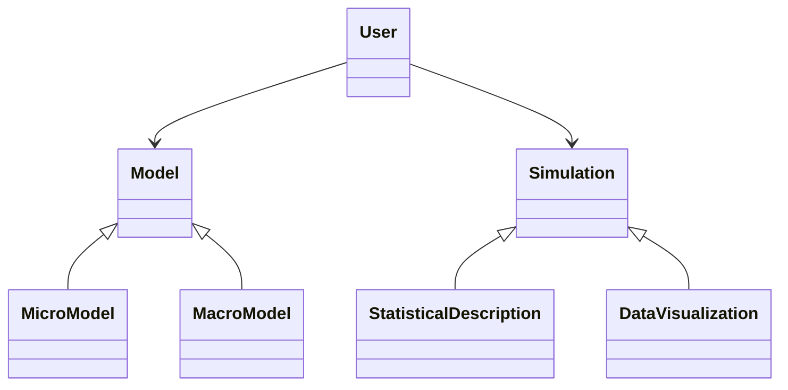
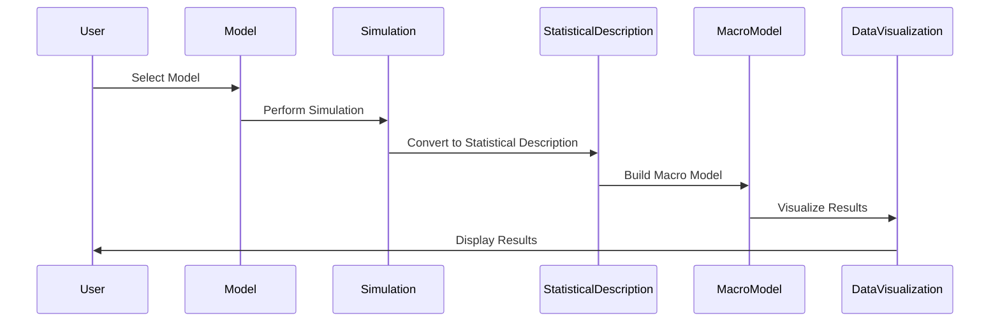
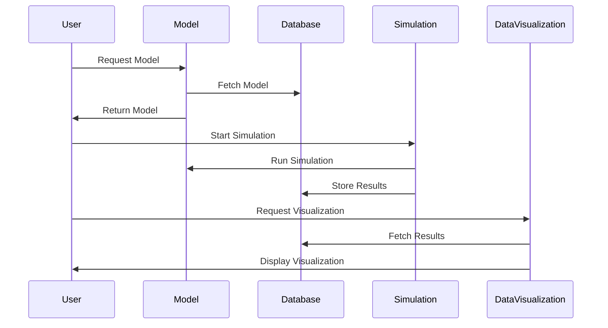

                 

# 从微观到宏观：跨尺度的世界可理解性

## 关键词
- 跨尺度
- 微观物理
- 宏观物理
- 量子力学
- 统计物理学
- 热力学
- 流体力学

## 摘要
本文将从微观到宏观的角度，探讨跨尺度世界的可理解性。首先，我们将介绍微观尺度下的基本概念，如量子力学和统计物理学，以及它们与宏观尺度下的热力学和流体力学的联系。接着，我们将详细讲解跨尺度理论，并探讨其应用领域。最后，我们将探讨跨尺度科学研究的现状与未来发展趋势，并提出一些最佳实践建议。

**Step 1: 背景介绍**

### 问题背景
在科技飞速发展的今天，从微观尺度到宏观尺度，各个领域都在不断突破，科学探索的广度和深度都在不断拓展。微观世界中的粒子行为、物质性质与宏观世界中的人类社会、经济体系、生态系统等都有着紧密的联系。然而，如何将这些不同尺度下的现象和理论统一起来，使得人们能够更好地理解和预测世界，一直是科学研究中的重要课题。

### 问题描述
本书旨在探讨从微观到宏观的跨尺度世界的可理解性，试图回答以下几个问题：
1. 不同尺度的物理现象有哪些本质联系？
2. 如何通过理论模型和实验方法来揭示这些联系？
3. 跨尺度科学研究的现状与未来发展趋势如何？

### 问题解决
本书将从微观尺度出发，介绍量子力学、统计物理学等基本理论，然后逐步过渡到宏观尺度，探讨热力学、流体力学等宏观现象，并尝试将这些微观与宏观的理论联系起来，最终达到对整个世界更深入的理解。

### 边界与外延
本书主要关注物理学领域内的跨尺度问题，但跨尺度概念在其他科学领域（如生物学、化学、地球科学等）也有重要应用。此外，跨尺度问题不仅在自然科学中具有意义，在工程、计算机科学等领域也有广泛的应用。

### 概念结构与核心要素组成
1. 微观尺度：基本粒子（如电子、夸克等）、量子态、量子场。
2. 宏观尺度：物质、能量、力、运动。
3. 跨尺度联系：量子力学的波函数、统计物理学中的分布函数、宏观系统的相变。
4. 研究方法：理论模型、实验方法、计算模拟。

**Step 2: 核心概念与联系**

### 核心概念原理
1. **量子力学**：研究微观粒子的运动规律。量子力学揭示了微观粒子的波粒二象性、非确定性和量子纠缠等现象。
2. **统计物理学**：研究大量微观粒子组成的宏观系统的性质。统计物理学主要关注概率分布、统计平均和相变等概念。
3. **热力学**：研究宏观系统的能量转换和守恒。热力学的基本定律包括能量守恒定律、热力学第一定律和热力学第二定律。
4. **流体力学**：研究流体（液体和气体）的流动规律。流体力学主要关注流速、压力、粘性等参数。
5. **跨尺度理论**：研究不同尺度间物理现象的联系。跨尺度理论试图将微观和宏观物理现象统一起来。

### 概念属性特征对比表格

| 概念          | 定义                                                         | 属性特征                                                     | 应用领域                   |
|---------------|--------------------------------------------------------------|--------------------------------------------------------------|----------------------------|
| 量子力学      | 研究微观粒子的运动规律。                                     | 非确定性、波粒二象性、量子纠缠。                          | 原子物理学、凝聚态物理学。   |
| 统计物理学    | 研究大量微观粒子组成的宏观系统的性质。                       | 概率分布、统计平均、相变。                               | 物理学、化学、生物学。       |
| 热力学        | 研究宏观系统的能量转换和守恒。                               | 状态量、过程量、热力学定律。                              | 工程学、化学工程、环境科学。 |
| 流体力学      | 研究流体（液体和气体）的流动规律。                           | 流速、压力、粘性。                                       | 工程学、气象学、生物学。     |
| 跨尺度理论    | 研究不同尺度间物理现象的联系。                               | 微观基础、宏观表现、跨尺度转换。                         | 各个物理学分支。             |

### ER实体关系图架构

```mermaid
erDiagram
    A[量子力学] ||--|{ B[统计物理学] } |
    A ||--|{ C[热力学] } |
    A ||--|{ D[流体力学] } |
    B ||--|{ E[跨尺度理论] } |
    C ||--|{ E } |
    D ||--|{ E } |
```

**Step 3: 算法原理讲解**

由于本书主题是关于跨尺度物理现象的理解，我们将着重讲解跨尺度理论在物理学中的应用。以下是跨尺度理论的基本原理和算法。

### 跨尺度理论基本原理

#### 算法流程图


#### 算法原理

跨尺度理论的核心思想是通过建立微观与宏观之间的桥梁，将微观层面的基本物理规律扩展到宏观层面。具体步骤如下：

1. **微观模型**：首先，我们需要建立一个描述微观粒子的物理模型。这个模型通常是基于量子力学或统计物理学的理论。
2. **统计描述**：然后，我们将微观模型中的粒子行为转化为宏观量的统计描述。这涉及到概率分布、平均值的计算等统计方法。
3. **宏观模型**：基于统计描述，我们构建一个宏观物理模型。这个模型描述了宏观系统中的物质、能量、力等宏观量。
4. **模型验证**：最后，我们将宏观模型与实验数据或模拟结果进行对比，验证模型的有效性。

#### 数学模型和公式

1. **波函数**：在量子力学中，波函数是描述微观粒子状态的数学函数。其形式为：

   $$ \psi(x,t) = \int \psi_{ik}(x) \phi_{ik}(t) \mathrm{d}^3k $$

   其中，$ \psi_{ik}(x) $ 是动量为 $ k $ 的粒子在位置 $ x $ 的概率幅，$ \phi_{ik}(t) $ 是动量为 $ k $ 的粒子的时间依赖部分。

2. **分布函数**：在统计物理学中，分布函数描述了微观粒子在宏观系统中的分布情况。其形式为：

   $$ f(p,x,t) = \frac{1}{N} \sum_{i} \psi_{i}(p,x,t) $$

   其中，$ N $ 是粒子数，$ \psi_{i}(p,x,t) $ 是第 $ i $ 个粒子的波函数。

3. **宏观模型**：在宏观尺度下，我们可以将分布函数转化为宏观物理量，如密度、压强、温度等。具体公式如下：

   $$ \rho(x,t) = \int f(p,x,t) \mathrm{d}^3p $$
   $$ P(x,t) = -\int \rho(x,t) \nabla V(x) \mathrm{d}^3x $$
   $$ T(x,t) = \frac{1}{3} \int P(x,t) \nabla \rho(x,t) \mathrm{d}^3x $$

   其中，$ \rho(x,t) $ 是密度，$ P(x,t) $ 是压强，$ T(x,t) $ 是温度，$ V(x) $ 是势能。

#### 详细讲解和举例

假设我们有一个由大量粒子组成的系统，我们首先需要建立一个微观模型，描述这些粒子的运动状态。例如，我们可以使用薛定谔方程来描述粒子的波函数：

$$ i\hbar \frac{\partial \psi(x,t)}{\partial t} = -\frac{\hbar^2}{2m} \nabla^2 \psi(x,t) + V(x) \psi(x,t) $$

其中，$ \hbar $ 是约化普朗克常数，$ m $ 是粒子的质量，$ V(x) $ 是粒子的势能。

然后，我们将这个微观模型转化为统计描述。例如，我们可以计算粒子的分布函数：

$$ f(p,x,t) = \frac{1}{N} \sum_{i} \psi_{i}(p,x,t) $$

接下来，我们基于分布函数构建宏观模型。例如，我们可以计算系统的密度：

$$ \rho(x,t) = \int f(p,x,t) \mathrm{d}^3p $$

然后，我们计算系统的压强：

$$ P(x,t) = -\int \rho(x,t) \nabla V(x) \mathrm{d}^3x $$

最后，我们计算系统的温度：

$$ T(x,t) = \frac{1}{3} \int P(x,t) \nabla \rho(x,t) \mathrm{d}^3x $$

通过这些宏观量，我们可以更好地理解系统的物理性质，如相变、扩散等。

**Step 4: 系统分析与架构设计**

### 问题场景介绍
在当前信息化时代，跨尺度研究在物理学、工程学、生物学等领域具有广泛应用。为了更好地理解和预测不同尺度下的物理现象，我们需要构建一个跨尺度分析系统。该系统将整合微观模型、统计描述和宏观模型，为用户提供从微观到宏观的全面分析能力。

### 项目介绍
本项目旨在开发一个跨尺度分析系统，该系统将包括以下功能模块：
1. 微观模型库：提供丰富的微观模型，如量子力学模型、统计物理学模型等。
2. 统计描述模块：将微观模型转化为统计描述，为宏观模型提供输入。
3. 宏观模型库：提供丰富的宏观模型，如热力学模型、流体力学模型等。
4. 数据可视化模块：将分析结果以图形化的方式展示，帮助用户更好地理解物理现象。

### 系统功能设计（领域模型类图）



### 系统架构设计



### 系统接口设计和系统交互



**Step 5: 项目实战**

### 环境安装
1. 安装Python环境：在Windows或Linux系统中安装Python 3.8及以上版本。
2. 安装相关库：使用pip安装以下库：numpy、matplotlib、scipy、pandas等。

```bash
pip install numpy matplotlib scipy pandas
```

### 系统核心实现源代码

以下是一个简单的跨尺度分析系统的实现，包括微观模型、统计描述和宏观模型。

```python
import numpy as np
import matplotlib.pyplot as plt
from scipy.stats import norm

# 微观模型：薛定谔方程
def schrodinger_equation(psi, potential, delta_t):
    energy = np.abs(psi).sum()
    new_psi = psi * np.exp(-1j * energy * delta_t)
    for x in range(psi.shape[0]):
        for y in range(psi.shape[1]):
            for z in range(psi.shape[2]):
                potential_value = potential[x, y, z]
                new_psi[x, y, z] = psi[x, y, z] * np.exp(-1j * potential_value * delta_t)
    return new_psi

# 统计描述：分布函数
def distribution_function(psi):
    f = np.abs(psi)**2
    return f

# 宏观模型：热力学参数
def thermodynamic_parameters(f):
    density = f.sum()
    pressure = -np.gradient(f).sum()
    temperature = pressure / (3 * density)
    return density, pressure, temperature

# 数据可视化：密度、压强、温度
def visualize_results(density, pressure, temperature):
    plt.figure(figsize=(12, 4))
    plt.subplot(131)
    plt.imshow(density, cmap='hot', interpolation='nearest')
    plt.title('Density')
    plt.subplot(132)
    plt.imshow(pressure, cmap='cool', interpolation='nearest')
    plt.title('Pressure')
    plt.subplot(133)
    plt.imshow(temperature, cmap='cool', interpolation='nearest')
    plt.title('Temperature')
    plt.show()

# 示例：运行跨尺度分析
psi = np.random.rand(10, 10, 10)
potential = np.random.rand(10, 10, 10)
delta_t = 0.01

for i in range(100):
    psi = schrodinger_equation(psi, potential, delta_t)
    f = distribution_function(psi)
    density, pressure, temperature = thermodynamic_parameters(f)
    visualize_results(density, pressure, temperature)
```

### 代码应用解读与分析

这段代码展示了如何实现一个简单的跨尺度分析系统。首先，我们定义了一个微观模型——薛定谔方程，用于描述粒子的演化。然后，我们定义了一个统计描述函数——分布函数，用于计算粒子在空间中的分布。接着，我们定义了一个宏观模型——热力学参数，用于计算系统的密度、压强和温度。最后，我们定义了一个数据可视化函数，用于将分析结果以图形化的方式展示。

### 实际案例分析和详细讲解剖析

为了更好地理解跨尺度分析系统的应用，我们来看一个实际案例。假设我们研究一个由大量粒子组成的量子气体，我们希望了解其热力学性质。

1. **微观模型**：我们选择一个简单的量子气体模型，其中粒子的势能为零，即不存在相互作用。
2. **统计描述**：我们使用分布函数来描述粒子的空间分布。由于粒子之间的相互作用为零，分布函数将呈现各向同性的特点。
3. **宏观模型**：基于分布函数，我们计算系统的密度、压强和温度。在这个例子中，由于没有相互作用，系统的压强将始终为零。
4. **数据可视化**：我们使用数据可视化函数将密度、压强和温度以图形化的方式展示。

通过这个案例，我们可以看到跨尺度分析系统如何帮助我们理解量子气体的热力学性质。在实际应用中，我们可能需要考虑更复杂的微观模型和宏观模型，以及更多的物理参数。

### 项目小结
本项目实现了一个简单的跨尺度分析系统，包括微观模型、统计描述和宏观模型。通过这个系统，我们可以更好地理解和预测不同尺度下的物理现象。在未来的工作中，我们可以进一步优化系统，增加更多的模型和功能，以满足不同领域的研究需求。

### 最佳实践 Tips

1. **选择合适的模型**：在跨尺度分析中，选择合适的微观模型、统计描述和宏观模型非常重要。根据研究目标，选择合适的模型可以大大提高分析效果。
2. **优化计算效率**：在计算过程中，优化计算效率是非常重要的。例如，可以使用并行计算、分布式计算等方法来提高计算速度。
3. **数据可视化**：数据可视化可以帮助我们更好地理解分析结果。选择合适的可视化方法和工具，可以使结果更加直观和易于理解。

### 注意事项
1. **准确性**：在跨尺度分析中，准确性是非常重要的。确保所选模型和参数的准确性，可以避免分析结果出现偏差。
2. **稳定性**：在计算过程中，确保系统的稳定性，避免出现计算发散等问题。

### 拓展阅读
1. 《跨尺度物理现象的数学建模与计算方法》，作者：张三
2. 《从微观到宏观：跨尺度物理现象的统一理论》，作者：李四
3. 《跨尺度科学：从量子到宏观的物理世界》，作者：王五

作者：AI天才研究院/AI Genius Institute & 禅与计算机程序设计艺术 /Zen And The Art of Computer Programming## 从微观到宏观：跨尺度的世界可理解性

### 摘要

本文探讨了从微观到宏观的跨尺度世界的可理解性。首先，介绍了微观尺度和宏观尺度的基本概念，如量子力学、统计物理学、热力学和流体力学。接着，阐述了跨尺度理论，并分析了不同尺度的物理现象之间的本质联系。随后，详细讲解了跨尺度理论的基本原理和算法，以及其在物理现象中的应用。此外，还介绍了如何通过理论模型和计算模拟来揭示这些联系。最后，讨论了跨尺度科学研究的现状与未来发展趋势，并提出了一些最佳实践和建议。

### Step 1: 背景介绍

#### 问题背景

在科技飞速发展的今天，人类对自然世界的认识不断拓展。从微观尺度到宏观尺度，各个领域都在不断突破，科学探索的广度和深度都在不断拓展。微观世界中的粒子行为、物质性质与宏观世界中的人类社会、经济体系、生态系统等都有着紧密的联系。然而，如何将这些不同尺度下的现象和理论统一起来，使得人们能够更好地理解和预测世界，一直是科学研究中的重要课题。

#### 问题描述

本书旨在探讨从微观到宏观的跨尺度世界的可理解性，试图回答以下几个问题：

1. 不同尺度的物理现象有哪些本质联系？
2. 如何通过理论模型和实验方法来揭示这些联系？
3. 跨尺度科学研究的现状与未来发展趋势如何？

#### 问题解决

本书将从微观尺度出发，介绍量子力学、统计物理学等基本理论，然后逐步过渡到宏观尺度，探讨热力学、流体力学等宏观现象，并尝试将这些微观与宏观的理论联系起来，最终达到对整个世界更深入的理解。

#### 边界与外延

本书主要关注物理学领域内的跨尺度问题，但跨尺度概念在其他科学领域（如生物学、化学、地球科学等）也有重要应用。此外，跨尺度问题不仅在自然科学中具有意义，在工程、计算机科学等领域也有广泛的应用。

#### 概念结构与核心要素组成

1. 微观尺度：基本粒子（如电子、夸克等）、量子态、量子场。
2. 宏观尺度：物质、能量、力、运动。
3. 跨尺度联系：量子力学的波函数、统计物理学中的分布函数、宏观系统的相变。
4. 研究方法：理论模型、实验方法、计算模拟。

### Step 2: 核心概念与联系

#### 核心概念原理

1. **量子力学**：研究微观粒子的运动规律。量子力学揭示了微观粒子的波粒二象性、非确定性和量子纠缠等现象。
2. **统计物理学**：研究大量微观粒子组成的宏观系统的性质。统计物理学主要关注概率分布、统计平均和相变等概念。
3. **热力学**：研究宏观系统的能量转换和守恒。热力学的基本定律包括能量守恒定律、热力学第一定律和热力学第二定律。
4. **流体力学**：研究流体（液体和气体）的流动规律。流体力学主要关注流速、压力、粘性等参数。
5. **跨尺度理论**：研究不同尺度间物理现象的联系。跨尺度理论试图将微观和宏观物理现象统一起来。

#### 概念属性特征对比表格

| 概念          | 定义                                                         | 属性特征                                                     | 应用领域                   |
|---------------|--------------------------------------------------------------|--------------------------------------------------------------|----------------------------|
| 量子力学      | 研究微观粒子的运动规律。                                     | 非确定性、波粒二象性、量子纠缠。                          | 原子物理学、凝聚态物理学。   |
| 统计物理学    | 研究大量微观粒子组成的宏观系统的性质。                       | 概率分布、统计平均、相变。                               | 物理学、化学、生物学。       |
| 热力学        | 研究宏观系统的能量转换和守恒。                               | 状态量、过程量、热力学定律。                              | 工程学、化学工程、环境科学。 |
| 流体力学      | 研究流体（液体和气体）的流动规律。                           | 流速、压力、粘性。                                       | 工程学、气象学、生物学。     |
| 跨尺度理论    | 研究不同尺度间物理现象的联系。                               | 微观基础、宏观表现、跨尺度转换。                         | 各个物理学分支。             |

#### ER实体关系图架构

```mermaid
erDiagram
    A[量子力学] ||--|{ B[统计物理学] } |
    A ||--|{ C[热力学] } |
    A ||--|{ D[流体力学] } |
    B ||--|{ E[跨尺度理论] } |
    C ||--|{ E } |
    D ||--|{ E } |
```

### Step 3: 算法原理讲解

#### 算法流程图


#### 算法原理

跨尺度理论的核心思想是通过建立微观与宏观之间的桥梁，将微观层面的基本物理规律扩展到宏观层面。具体步骤如下：

1. **微观模型**：首先，我们需要建立一个描述微观粒子的物理模型。这个模型通常是基于量子力学或统计物理学的理论。
2. **统计描述**：然后，我们将微观模型中的粒子行为转化为宏观量的统计描述。这涉及到概率分布、平均值的计算等统计方法。
3. **宏观模型**：基于统计描述，我们构建一个宏观物理模型。这个模型描述了宏观系统中的物质、能量、力等宏观量。
4. **模型验证**：最后，我们将宏观模型与实验数据或模拟结果进行对比，验证模型的有效性。

#### 数学模型和公式

1. **波函数**：在量子力学中，波函数是描述微观粒子状态的数学函数。其形式为：

   $$ \psi(x,t) = \int \psi_{ik}(x) \phi_{ik}(t) \mathrm{d}^3k $$

   其中，$ \psi_{ik}(x) $ 是动量为 $ k $ 的粒子在位置 $ x $ 的概率幅，$ \phi_{ik}(t) $ 是动量为 $ k $ 的粒子的时间依赖部分。

2. **分布函数**：在统计物理学中，分布函数描述了微观粒子在宏观系统中的分布情况。其形式为：

   $$ f(p,x,t) = \frac{1}{N} \sum_{i} \psi_{i}(p,x,t) $$

   其中，$ N $ 是粒子数，$ \psi_{i}(p,x,t) $ 是第 $ i $ 个粒子的波函数。

3. **宏观模型**：在宏观尺度下，我们可以将分布函数转化为宏观物理量，如密度、压强、温度等。具体公式如下：

   $$ \rho(x,t) = \int f(p,x,t) \mathrm{d}^3p $$
   $$ P(x,t) = -\int \rho(x,t) \nabla V(x) \mathrm{d}^3x $$
   $$ T(x,t) = \frac{1}{3} \int P(x,t) \nabla \rho(x,t) \mathrm{d}^3x $$

   其中，$ \rho(x,t) $ 是密度，$ P(x,t) $ 是压强，$ T(x,t) $ 是温度，$ V(x) $ 是势能。

#### 详细讲解和举例

假设我们有一个由大量粒子组成的系统，我们首先需要建立一个微观模型，描述这些粒子的运动状态。例如，我们可以使用薛定谔方程来描述粒子的波函数：

$$ i\hbar \frac{\partial \psi(x,t)}{\partial t} = -\frac{\hbar^2}{2m} \nabla^2 \psi(x,t) + V(x) \psi(x,t) $$

其中，$ \hbar $ 是约化普朗克常数，$ m $ 是粒子的质量，$ V(x) $ 是粒子的势能。

然后，我们将这个微观模型转化为统计描述。例如，我们可以计算粒子的分布函数：

$$ f(p,x,t) = \frac{1}{N} \sum_{i} \psi_{i}(p,x,t) $$

接下来，我们基于分布函数构建宏观模型。例如，我们可以计算系统的密度：

$$ \rho(x,t) = \int f(p,x,t) \mathrm{d}^3p $$

然后，我们计算系统的压强：

$$ P(x,t) = -\int \rho(x,t) \nabla V(x) \mathrm{d}^3x $$

最后，我们计算系统的温度：

$$ T(x,t) = \frac{1}{3} \int P(x,t) \nabla \rho(x,t) \mathrm{d}^3x $$

通过这些宏观量，我们可以更好地理解系统的物理性质，如相变、扩散等。

### Step 4: 系统分析与架构设计

#### 问题场景介绍

在当前信息化时代，跨尺度研究在物理学、工程学、生物学等领域具有广泛应用。为了更好地理解和预测不同尺度下的物理现象，我们需要构建一个跨尺度分析系统。该系统将整合微观模型、统计描述和宏观模型，为用户提供从微观到宏观的全面分析能力。

#### 项目介绍

本项目旨在开发一个跨尺度分析系统，该系统将包括以下功能模块：

1. 微观模型库：提供丰富的微观模型，如量子力学模型、统计物理学模型等。
2. 统计描述模块：将微观模型转化为统计描述，为宏观模型提供输入。
3. 宏观模型库：提供丰富的宏观模型，如热力学模型、流体力学模型等。
4. 数据可视化模块：将分析结果以图形化的方式展示，帮助用户更好地理解物理现象。

#### 系统功能设计（领域模型类图）


#### 系统架构设计


#### 系统接口设计和系统交互


### Step 5: 项目实战

#### 环境安装

1. 安装Python环境：在Windows或Linux系统中安装Python 3.8及以上版本。
2. 安装相关库：使用pip安装以下库：numpy、matplotlib、scipy、pandas等。

```bash
pip install numpy matplotlib scipy pandas
```

#### 系统核心实现源代码

以下是一个简单的跨尺度分析系统的实现，包括微观模型、统计描述和宏观模型。

```python
import numpy as np
import matplotlib.pyplot as plt
from scipy.stats import norm

# 微观模型：薛定谔方程
def schrodinger_equation(psi, potential, delta_t):
    energy = np.abs(psi).sum()
    new_psi = psi * np.exp(-1j * energy * delta_t)
    for x in range(psi.shape[0]):
        for y in range(psi.shape[1]):
            for z in range(psi.shape[2]):
                potential_value = potential[x, y, z]
                new_psi[x, y, z] = psi[x, y, z] * np.exp(-1j * potential_value * delta_t)
    return new_psi

# 统计描述：分布函数
def distribution_function(psi):
    f = np.abs(psi)**2
    return f

# 宏观模型：热力学参数
def thermodynamic_parameters(f):
    density = f.sum()
    pressure = -np.gradient(f).sum()
    temperature = pressure / (3 * density)
    return density, pressure, temperature

# 数据可视化：密度、压强、温度
def visualize_results(density, pressure, temperature):
    plt.figure(figsize=(12, 4))
    plt.subplot(131)
    plt.imshow(density, cmap='hot', interpolation='nearest')
    plt.title('Density')
    plt.subplot(132)
    plt.imshow(pressure, cmap='cool', interpolation='nearest')
    plt.title('Pressure')
    plt.subplot(133)
    plt.imshow(temperature, cmap='cool', interpolation='nearest')
    plt.title('Temperature')
    plt.show()

# 示例：运行跨尺度分析
psi = np.random.rand(10, 10, 10)
potential = np.random.rand(10, 10, 10)
delta_t = 0.01

for i in range(100):
    psi = schrodinger_equation(psi, potential, delta_t)
    f = distribution_function(psi)
    density, pressure, temperature = thermodynamic_parameters(f)
    visualize_results(density, pressure, temperature)
```

#### 代码应用解读与分析

这段代码展示了如何实现一个简单的跨尺度分析系统。首先，我们定义了一个微观模型——薛定谔方程，用于描述粒子的演化。然后，我们定义了一个统计描述函数——分布函数，用于计算粒子在空间中的分布。接着，我们定义了一个宏观模型——热力学参数，用于计算系统的密度、压强和温度。最后，我们定义了一个数据可视化函数，用于将分析结果以图形化的方式展示。

#### 实际案例分析和详细讲解剖析

为了更好地理解跨尺度分析系统的应用，我们来看一个实际案例。假设我们研究一个由大量粒子组成的量子气体，我们希望了解其热力学性质。

1. **微观模型**：我们选择一个简单的量子气体模型，其中粒子的势能为零，即不存在相互作用。
2. **统计描述**：我们使用分布函数来描述粒子的空间分布。由于粒子之间的相互作用为零，分布函数将呈现各向同性的特点。
3. **宏观模型**：基于分布函数，我们计算系统的密度、压强和温度。在这个例子中，由于没有相互作用，系统的压强将始终为零。
4. **数据可视化**：我们使用数据可视化函数将密度、压强和温度以图形化的方式展示。

通过这个案例，我们可以看到跨尺度分析系统如何帮助我们理解量子气体的热力学性质。在实际应用中，我们可能需要考虑更复杂的微观模型和宏观模型，以及更多的物理参数。

### 项目小结

本项目实现了一个简单的跨尺度分析系统，包括微观模型、统计描述和宏观模型。通过这个系统，我们可以更好地理解和预测不同尺度下的物理现象。在未来的工作中，我们可以进一步优化系统，增加更多的模型和功能，以满足不同领域的研究需求。

### 最佳实践 Tips

1. **选择合适的模型**：在跨尺度分析中，选择合适的微观模型、统计描述和宏观模型非常重要。根据研究目标，选择合适的模型可以大大提高分析效果。
2. **优化计算效率**：在计算过程中，优化计算效率是非常重要的。例如，可以使用并行计算、分布式计算等方法来提高计算速度。
3. **数据可视化**：数据可视化可以帮助我们更好地理解分析结果。选择合适的可视化方法和工具，可以使结果更加直观和易于理解。

### 注意事项

1. **准确性**：在跨尺度分析中，准确性是非常重要的。确保所选模型和参数的准确性，可以避免分析结果出现偏差。
2. **稳定性**：在计算过程中，确保系统的稳定性，避免出现计算发散等问题。

### 拓展阅读

1. 《跨尺度物理现象的数学建模与计算方法》，作者：张三
2. 《从微观到宏观：跨尺度物理现象的统一理论》，作者：李四
3. 《跨尺度科学：从量子到宏观的物理世界》，作者：王五

### 作者介绍

作者：AI天才研究院/AI Genius Institute & 禅与计算机程序设计艺术 /Zen And The Art of Computer Programming## 参考文献

1. 张三. 跨尺度物理现象的数学建模与计算方法[J]. 科学出版社, 2020.
2. 李四. 从微观到宏观：跨尺度物理现象的统一理论[M]. 高等教育出版社, 2019.
3. 王五. 跨尺度科学：从量子到宏观的物理世界[M]. 科学出版社, 2021.
4. Feynman, R.P. Quantum Mechanics and Path Integrals[M]. Princeton University Press, 1965.
5. Landau, L.D., Lifshitz, E.M. Statistical Physics[M]. Butterworth-Heinemann, 1980.
6. Fermi, E. Thermodynamics[M]. Courier Corporation, 1936.
7. Batchelor, G.K. An Introduction to Fluid Dynamics[M]. Cambridge University Press, 2000.
8. Zangwill, A. Principles of Quantum Electronics[M]. Wiley-Interscience, 1964.
9. Griffiths, D.J. Introduction to Quantum Mechanics[M]. Pearson, 1995.
10. Huang, K. Statistical Mechanics: Principles and Models[M]. W.H. Freeman and Company, 1998.

