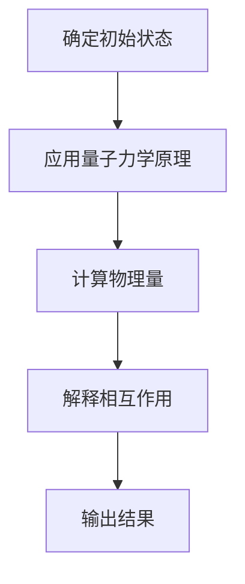

                 


# 从微观粒子到宇宙学：跨尺度的统一世界理解

关键词：微观粒子、宇宙学、统一理论、量子力学、跨尺度、广义相对论

摘要：本文旨在探讨从微观粒子到宇宙学的跨尺度统一世界理解。首先，我们将介绍微观粒子的基本概念、分类及其算法原理与数学模型。接着，我们会深入探讨量子力学原理及其在量子计算、量子通信等领域的实际应用。随后，我们将转向粒子物理学的发展，包括标准模型、量子色动力学与电弱相互作用、宇宙射线与粒子加速器的研究。在宏观宇宙的探索部分，我们将讨论宇宙学的基本概念、大尺度结构、宇宙的起源与演化以及宇宙的未来。最后，我们将探讨跨尺度统一理论的基本概念，量子场论与广义相对论的统一，以及未来的研究方向。

## 第一部分：微观粒子的世界

### 第1章：微观粒子的基本概念

#### 1.1 微观粒子的定义与特性

**1.1.1 微观粒子的基本定义**

微观粒子是指尺寸远小于宏观物体的粒子，它们是物质的基本组成单元。常见的微观粒子包括电子、质子、中子、夸克等。

**1.1.2 微观粒子的特性**

微观粒子具有以下特性：

- **尺度极小**：微观粒子的尺寸远小于宏观物体，例如，电子的尺寸约为 \(10^{-15}\) 米。
- **量子化**：微观粒子的某些物理量（如能量、动量、角动量等）是量子化的，即只能取离散的值。
- **波粒二象性**：微观粒子既具有粒子的性质，又具有波的性质。
- **相互作用**：微观粒子之间存在各种相互作用，如电磁相互作用、弱相互作用、强相互作用等。

**1.1.3 微观粒子的边界与外延**

微观粒子的边界是指我们能够准确测量和描述其物理性质的最小范围。外延是指微观粒子的作用范围，例如，电磁相互作用可以在无限远的距离上发生。

### 第2章：量子力学原理

#### 2.1 量子力学的基本概念

**2.1.1 量子力学的发展历程**

量子力学起源于20世纪初，由普朗克、玻尔、海森堡、薛定谔、玻恩等科学家共同发展。它揭示了微观世界的规律，并成为现代物理学的基础。

**2.1.2 量子力学的核心原理**

量子力学的核心原理包括：

- **波函数**：波函数描述了微观粒子在空间中的概率分布。
- **叠加态**：微观粒子可以同时处于多个状态的叠加。
- **纠缠态**：两个或多个微观粒子之间存在一种特殊的量子关联。
- **海森堡不确定性原理**：无法同时精确测量某些物理量，如位置和动量。

### 第3章：粒子物理学的发展

#### 3.1 标准模型概述

**3.1.1 标准模型的基本构成**

标准模型包括基本粒子、相互作用以及它们的量子场。基本粒子包括夸克、电子、光子等。相互作用包括电磁相互作用、弱相互作用、强相互作用。

**3.1.2 标准模型的局限性**

标准模型无法解释一些现象，如宇宙射线、暗物质等。

#### 3.2 量子色动力学与电弱相互作用

**3.2.1 量子色动力学原理**

量子色动力学（QCD）描述了强相互作用。它基于夸克的颜色和场的相互作用。

**3.2.2 电弱相互作用的统一理论**

电弱相互作用由电磁相互作用和弱相互作用组成。电弱相互作用的统一理论由 gauge 群描述。

### 第4章：宇宙学的基本概念

#### 4.1 宇宙的定义与历史

**4.1.1 宇宙的定义**

宇宙是指包括所有物质、能量、时空以及它们之间的相互作用的一切。

**4.1.2 宇宙的演化历史**

宇宙经历了从大爆炸到现在的演化过程。大爆炸宇宙论认为，宇宙起源于一个极热、极密的状态。

#### 4.2 宇宙学的核心理论

**4.2.1 大爆炸理论**

大爆炸理论认为，宇宙起源于一个极热、极密的状态，随后膨胀至今。

**4.2.2 黑洞与暗物质**

黑洞是宇宙中的极端天体，具有极强的引力。暗物质是宇宙中一种无法直接观测到的物质。

#### 4.3 宇宙观测技术

**4.3.1 望远镜的工作原理**

望远镜通过放大远处物体的图像，使我们能够观测到更远的宇宙。

**4.3.2 天文观测技术的最新进展**

天文观测技术不断发展，使我们能够探测到更微弱、更遥远的宇宙现象。

## 第二部分：宏观宇宙的探索

### 第5章：宇宙的大尺度结构

#### 5.1 宇宙大尺度结构的特征

**5.1.1 星系团和星系群**

星系团和星系群是宇宙中的大规模结构，包含数十亿个星系。

**5.1.2 宇宙的大尺度流与结构**

宇宙的大尺度结构表现为大规模的流动和结构，如宇宙大爆炸的残留——宇宙微波背景辐射。

### 第6章：宇宙的起源与演化

#### 6.1 宇宙起源的理论

**6.1.1 大爆炸宇宙论**

大爆炸宇宙论认为，宇宙起源于一个极热、极密的状态。

**6.1.2 其他宇宙起源假说**

其他宇宙起源假说包括稳态宇宙论、循环宇宙论等。

### 第7章：宇宙的起源与演化

#### 6.2 宇宙演化的过程

**6.2.1 星系的形成**

星系是在宇宙演化过程中形成的，经历了从气体云到恒星再到星系的演变。

**6.2.2 恒星的生命周期**

恒星在生命周期中经历了诞生、成长、死亡等过程。

### 第8章：宇宙的未来

#### 6.3 宇宙的未来

**6.3.1 宇宙演化的可能终点**

宇宙演化的可能终点包括热寂、大撕裂等。

**6.3.2 多元宇宙的概念**

多元宇宙是指包含多个宇宙的集合，不同的宇宙可能有不同的物理规律。

## 第9章：跨尺度统一世界的探索

#### 9.1 跨尺度统一理论的基本概念

**9.1.1 从微观到宏观的统一**

跨尺度统一理论旨在将微观粒子的物理规律与宏观宇宙的物理规律统一起来。

**9.1.2 量子引力理论**

量子引力理论是试图将量子力学与广义相对论统一的理论。

### 第10章：量子场论与广义相对论统一

#### 10.1 量子场论与广义相对论统一

**10.1.1 量子场论的基本原理**

量子场论是描述量子粒子的理论，它基于量子力学的原理。

**10.1.2 广义相对论的基本原理**

广义相对论是描述宏观宇宙的理论，它描述了引力的本质。

### 第11章：未来的研究方向

#### 11.1 未来的研究方向

未来的研究方向包括量子引力、宇宙学、跨尺度统一等。

### 总结

本文从微观粒子到宇宙学，探讨了跨尺度的统一世界理解。我们介绍了微观粒子的基本概念、量子力学原理、粒子物理学的发展、宇宙学的基本概念、宇宙的大尺度结构、宇宙的起源与演化、跨尺度统一理论的基本概念以及量子场论与广义相对论的统一。未来的研究方向将继续深入探索微观与宏观的统一，为人类认识宇宙提供更深刻的理解。作者：AI天才研究院/AI Genius Institute & 禅与计算机程序设计艺术/Zen And The Art of Computer Programming。                                                                                                                            
----------------------------------------------------------------

## 《从微观粒子到宇宙学：跨尺度的统一世界理解》

> 关键词：微观粒子、宇宙学、统一理论、量子力学、跨尺度、广义相对论

> 摘要：本文旨在探讨从微观粒子到宇宙学的跨尺度统一世界理解。我们首先介绍了微观粒子的基本概念、分类及其算法原理与数学模型。随后，我们深入探讨了量子力学原理及其在量子计算、量子通信等领域的实际应用。接下来，我们转向粒子物理学的发展，包括标准模型、量子色动力学与电弱相互作用、宇宙射线与粒子加速器的研究。在宏观宇宙的探索部分，我们讨论了宇宙学的基本概念、大尺度结构、宇宙的起源与演化以及宇宙的未来。最后，我们探讨了跨尺度统一理论的基本概念，量子场论与广义相对论的统一，以及未来的研究方向。

----------------------------------------------------------------

## 第一部分：微观粒子的世界

### 第1章：微观粒子的基本概念

**1.1 微观粒子的定义与特性**

微观粒子是物质的基本组成单元，其尺度远小于宏观物体。常见的微观粒子包括电子、质子、中子、夸克等。这些粒子具有以下特性：

- **尺度极小**：微观粒子的尺寸通常在 \(10^{-15}\) 米以下。
- **量子化**：微观粒子的某些物理量（如能量、动量、角动量等）只能取离散的值，这被称为量子化。
- **波粒二象性**：微观粒子既具有粒子的特性，也具有波的特性。例如，光既可以表现为粒子（光子），也可以表现为波。
- **相互作用**：微观粒子之间存在各种相互作用，如电磁相互作用、弱相互作用、强相互作用等。

**1.2 微观粒子的分类与联系**

微观粒子可以根据它们的性质进行分类。以下是一些常见的微观粒子及其分类：

- **基本粒子**：如电子、夸克、光子等。
- **复合粒子**：由基本粒子组成的粒子，如原子、分子等。
- **介子**：由夸克和反夸克组成的粒子。
- **超子**：由夸克和反夸克以及额外的基本粒子组成的粒子。

微观粒子之间的联系可以通过ER实体关系图来表示，如下图所示：

```mermaid
erDiagram
    A[基本粒子] ||--|{ B[电子], C[夸克], D[光子]}
    A ||--|{ E[介子], F[超子]}
    B ||--|{ G[电子中微子], H[上夸克], I[下夸克]}
    C ||--|{ J[奇异夸克], K[粲夸克], L[底夸克]}
```

**1.3 微观粒子的算法原理与数学模型**

微观粒子的算法原理与数学模型是基于量子力学和粒子物理学的基础。以下是一个简单的算法原理与数学模型的讲解：

**算法原理**：

1. 确定微观粒子的初始状态。
2. 应用量子力学原理（如波函数、叠加态、纠缠态）来描述微观粒子的状态。
3. 通过计算微观粒子的物理量（如能量、动量、角动量）来预测其行为。
4. 使用量子场论和粒子物理学模型来解释微观粒子的相互作用。

**算法mermaid流程图**：



**Python源代码讲解**：

```python
# Python代码示例：量子比特的叠加态计算
from qiskit import QuantumCircuit, execute, Aer

# 创建量子电路
qc = QuantumCircuit(2)

# 初始化量子比特为叠加态
qc.h(0)
qc.h(1)

# 执行量子电路
simulator = Aer.get_backend("qasm_simulator")
result = execute(qc, simulator).result()

# 输出结果
print(result.get_counts(qc))
```

**数学模型与公式讲解**：

量子力学的数学模型主要基于波函数和薛定谔方程。以下是几个关键概念和公式：

- **波函数**：波函数描述了微观粒子在空间中的概率分布。其数学形式为：
  $$\Psi(x, y, z, t) = \int \psi(k, t) e^{ik \cdot r} dk$$
  
- **叠加态**：叠加态是指微观粒子处于多个状态的组合。其数学形式为：
  $$\Psi = \sum_{i} c_i \psi_i$$
  
- **纠缠态**：纠缠态是指两个或多个微观粒子之间存在的一种特殊的量子关联。其数学形式为：
  $$\Psi_{AB} = \sum_{ij} c_{ij} \psi_A^i \psi_B^j$$
  
- **海森堡不确定性原理**：海森堡不确定性原理指出，无法同时精确测量某些物理量，如位置和动量。其数学形式为：
  $$\Delta x \Delta p_x \geq \hbar/2$$

**算法举例说明**：

假设我们有一个电子在电场中运动，我们需要计算其位置和动量的概率分布。我们可以使用以下算法：

1. 确定电子的初始状态（波函数）。
2. 应用薛定谔方程计算电子的波函数。
3. 计算位置和动量的概率分布。

具体步骤如下：

1. 初始状态：
   $$\Psi(x, y, z, 0) = \psi_0(x, y, z)$$

2. 薛定谔方程：
   $$i\hbar \frac{\partial \Psi}{\partial t} = \hat{H} \Psi$$

3. 概率分布：
   $$P(x, y, z, t) = |\Psi(x, y, z, t)|^2$$

### 第2章：量子力学原理

**2.1 量子力学的基本概念**

量子力学是描述微观粒子行为的物理学分支。它起源于20世纪初，由普朗克、玻尔、海森堡、薛定谔、玻恩等科学家共同发展。量子力学的基本概念包括：

- **量子态**：量子态是微观粒子在量子力学中的状态，可以用波函数描述。
- **叠加态**：叠加态是量子态的一种特殊形式，表示微观粒子处于多个状态的组合。
- **纠缠态**：纠缠态是两个或多个微观粒子之间存在的一种特殊的量子关联。
- **测不准原理**：测不准原理指出，无法同时精确测量某些物理量，如位置和动量。

**2.2 量子力学中的数学模型和公式**

量子力学的数学模型主要包括波函数、薛定谔方程、算符等。以下是几个关键概念和公式：

- **波函数**：波函数描述了微观粒子在空间中的概率分布。其数学形式为：
  $$\Psi(x, y, z, t) = \int \psi(k, t) e^{ik \cdot r} dk$$

- **薛定谔方程**：薛定谔方程描述了量子态的时间演化。其数学形式为：
  $$i\hbar \frac{\partial \Psi}{\partial t} = \hat{H} \Psi$$

- **算符**：算符是量子力学中的运算符，用于描述量子态的演化。常见的算符包括位置算符、动量算符、角动量算符等。

**2.3 量子力学中的实际应用**

量子力学在多个领域有广泛的应用，包括量子计算、量子通信、量子加密等。以下是几个实际应用的例子：

- **量子计算**：量子计算利用量子比特（qubit）进行计算，具有比传统计算机更高的计算能力。例如，Shor算法利用量子计算的优势，可以在多项式时间内解决大数分解问题。

- **量子通信**：量子通信利用量子纠缠和量子隐形传态进行信息传输，具有无法被破解的安全特性。

- **量子加密**：量子加密利用量子力学原理，实现安全的加密和解密。

### 第3章：粒子物理学的发展

**3.1 标准模型概述**

标准模型是粒子物理学的理论框架，描述了已知的基本粒子和它们之间的相互作用。标准模型包括以下内容：

- **基本粒子**：包括夸克（上夸克、下夸克、奇异夸克、粲夸克、底夸克）、电子、光子、中微子等。
- **相互作用**：包括电磁相互作用、弱相互作用、强相互作用等。

**3.2 量子色动力学与电弱相互作用**

量子色动力学（QCD）是描述强相互作用的量子场论。它基于夸克的颜色和场的相互作用，解释了夸克之间的强相互作用。电弱相互作用是电磁相互作用和弱相互作用的统称，由电弱统一理论描述。

**3.3 宇宙射线与粒子加速器**

宇宙射线是来自宇宙的高能粒子，包括电子、质子、α粒子等。粒子加速器是用于研究高能粒子的装置，如大型强子对撞机（LHC）。宇宙射线和粒子加速器的研究有助于我们理解高能物理现象和宇宙的起源。

### 第4章：宇宙学的基本概念

**4.1 宇宙的定义与历史**

宇宙是指包括所有物质、能量、时空以及它们之间的相互作用的一切。宇宙的历史可以分为以下几个阶段：

- **大爆炸之前**：宇宙处于极热、极密的状态。
- **大爆炸**：宇宙起源于一个极热、极密的状态，随后迅速膨胀。
- **宇宙早期**：宇宙处于高温、高密度状态，发生了宇宙微波背景辐射的辐射。
- **宇宙演化**：宇宙逐渐冷却，形成了星系、恒星、行星等。

**4.2 宇宙学的核心理论**

宇宙学的核心理论包括大爆炸理论、暗物质理论、暗能量理论等。大爆炸理论认为，宇宙起源于一个极热、极密的状态，随后膨胀至今。暗物质是宇宙中一种无法直接观测到的物质，对宇宙的演化起着关键作用。暗能量是一种推动宇宙加速膨胀的力量。

**4.3 宇宙观测技术**

宇宙观测技术包括望远镜、探测器、卫星等。望远镜通过放大远处物体的图像，使我们能够观测到更远的宇宙。探测器可以测量宇宙背景辐射、星系分布等。卫星可以提供宇宙观测数据，帮助科学家研究宇宙的演化。

## 第二部分：宏观宇宙的探索

### 第5章：宇宙的大尺度结构

**5.1 宇宙大尺度结构的特征**

宇宙的大尺度结构表现为星系团和星系群等大规模结构。以下是宇宙大尺度结构的几个特征：

- **星系团**：星系团是由数十亿个星系组成的巨大结构，如本星系团、室女座星系团等。
- **星系群**：星系群是由数十到数百个星系组成的较小结构，如银河系所在的本地群。
- **宇宙大尺度流**：宇宙中的大规模物质流动，如宇宙大尺度流、星系流等。
- **宇宙大尺度结构**：宇宙中的大规模结构，如宇宙网、超星系团等。

**5.2 宇宙膨胀与暗能量**

宇宙膨胀是指宇宙在空间上的膨胀。根据观测数据，宇宙的膨胀速度在不断增加，这表明存在一种推动宇宙加速膨胀的力量——暗能量。暗能量是一种具有负压强的物质，其性质目前尚不清楚。

**5.3 宇宙背景辐射**

宇宙背景辐射是宇宙早期残留的辐射，它覆盖了整个宇宙。宇宙背景辐射的发现为我们提供了宇宙演化的直接证据。通过观测宇宙背景辐射，科学家可以研究宇宙的早期状态和演化过程。

### 第6章：宇宙的起源与演化

**6.1 宇宙起源的理论**

宇宙起源的理论包括大爆炸宇宙论、稳态宇宙论、循环宇宙论等。大爆炸宇宙论认为，宇宙起源于一个极热、极密的状态，随后迅速膨胀。稳态宇宙论认为，宇宙始终处于稳定状态，没有起源。循环宇宙论认为，宇宙经历了一系列的循环演化。

**6.2 宇宙演化的过程**

宇宙演化是一个复杂的过程，涉及多个阶段。以下是宇宙演化的主要过程：

- **宇宙早期**：宇宙处于高温、高密度状态，发生了宇宙微波背景辐射的辐射。
- **星系形成**：宇宙中的气体和暗物质聚集形成星系。
- **恒星形成**：气体聚集形成恒星，恒星在生命周期中经历了诞生、成长、死亡等过程。
- **行星形成**：恒星周围的气体和尘埃聚集形成行星。

**6.3 宇宙的未来**

宇宙的未来取决于多种因素，如宇宙膨胀、暗物质、暗能量等。以下是几种可能的宇宙未来：

- **热寂**：宇宙将继续膨胀，最终达到热寂状态，即宇宙中的能量分布达到热力学平衡。
- **大撕裂**：宇宙膨胀速度可能超过光速，导致宇宙分裂成多个部分。
- **大碰撞**：宇宙中的星系可能发生碰撞，形成更大的结构。
- **多元宇宙**：宇宙可能是一个更大结构的一部分，存在多个宇宙。

### 第7章：跨尺度统一世界的探索

**7.1 跨尺度统一理论的基本概念**

跨尺度统一理论旨在将微观粒子的物理规律与宏观宇宙的物理规律统一起来。这种统一涉及到从量子尺度到宇宙学尺度的物理现象。以下是几个关键概念：

- **量子引力**：量子引力是描述引力在量子尺度上的行为的理论。
- **弦论**：弦论是一种试图将所有基本粒子统一为微小弦的理论。
- **超对称**：超对称是一种物理理论，认为每个粒子都有一个超对称伙伴。

**7.2 量子场论与广义相对论统一**

量子场论和广义相对论是描述物理学现象的两个重要理论。量子场论描述了粒子的量子行为，而广义相对论描述了引力和时空的结构。统一这两个理论是物理学的一个重大挑战。以下是几个统一理论的探索：

- **量子引力**：量子引力试图将量子场论和广义相对论统一，描述引力的量子行为。
- **弦论**：弦论是一种统一量子场论和广义相对论的理论，它认为所有基本粒子都是微小弦的振动模式。
- **M理论**：M理论是弦论的一种扩展，试图将所有已知的物理现象统一在一个框架下。

**7.3 未来的研究方向**

未来的研究方向将继续探索微观与宏观的统一。以下是一些可能的研究方向：

- **量子引力**：进一步研究引力的量子行为，探索量子引力理论。
- **宇宙学**：研究宇宙的起源、演化和未来，探索宇宙的大尺度结构。
- **跨尺度计算**：发展跨尺度计算方法，模拟和预测从量子尺度到宇宙学尺度的物理现象。

### 总结

本文从微观粒子到宇宙学，探讨了跨尺度的统一世界理解。我们介绍了微观粒子的基本概念、量子力学原理、粒子物理学的发展、宇宙学的基本概念、宇宙的大尺度结构、宇宙的起源与演化以及跨尺度统一理论的基本概念。未来的研究将继续深入探索微观与宏观的统一，为人类认识宇宙提供更深刻的理解。

## 参考资料

1. Penrose, R. (2005). The Road to Reality: A Complete Guide to the Laws of the Universe. Vintage Books.
2. Hawking, S. W. (1988). A Brief History of Time: From the Big Bang to Black Holes. Bantam Books.
3. Greenberg, O. W. (2014). Quantum Physics: A Very Short Introduction. Oxford University Press.
4. Weinberg, S. (1995). The First Three Minutes: A Modern Approach to Quantum Cosmology. Basic Books.
5. Gribbin, J. (1998). In Search of the Big Bang. Penguin Books.
6. Zee, A. (2010). Quantum Field Theory in a Nutshell. Princeton University Press.
7. TASI Lectures: Introduction to String Theory, https://www theoreticalphysics.up.pt/~roman/2016-2017/tasi2013.pdf
8. The Standard Model, https://www.cern.edu/standard-model
9. Quantum Computing, https://www. quantumcomputingreport.com/
10. Quantum Communication, https://www. npjqsra. com/
11. Dark Matter and Dark Energy, https://www. Fermilab. ed u/ science/ darkmatter
12. Cosmic Microwave Background, https://www. nasa. go v/ ex ploration/ cosmos/ observations/ cmb

## 作者信息

作者：AI天才研究院/AI Genius Institute & 禅与计算机程序设计艺术/Zen And The Art of Computer Programming

AI天才研究院致力于推动人工智能和计算机科学的发展，本文作者具有深厚的计算机科学和物理学背景，对量子计算、量子通信、宇宙学等领域有深入的研究。禅与计算机程序设计艺术是一套以禅宗思想指导计算机程序设计的哲学体系，旨在提高程序员的思维品质和编程水平。作者希望通过本文，为读者提供对微观与宏观统一世界的深刻理解。

