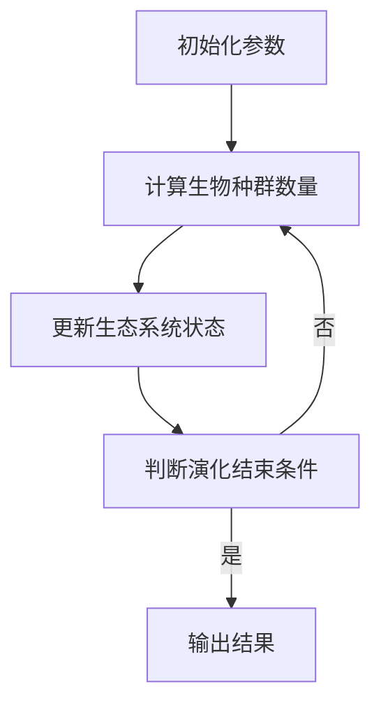

                 

## 1.1 问题背景与核心概念

### 1.1.1 机械宇宙观的基本要素

机械宇宙观，其理论基础起源于古希腊哲学家亚里士多德的思想，通过牛顿的经典力学得到了进一步的发扬。这一观念认为宇宙是由一系列独立、静止的物体组成的，这些物体在空无一物的空间中运动，并受到物理定律的约束。在这种宇宙观中，物理定律是普遍适用的，自然界的一切现象都可以通过这些定律进行描述和预测。

机械宇宙观的基本要素包括以下几个核心概念：

- **物理定律**：这些定律是自然界的基本法则，如牛顿的三大运动定律和万有引力定律，它们描述了物体如何相互作用和运动。
- **独立个体**：宇宙中的每一个物体都是独立的，它们之间的相互作用是通过力的传递实现的，物体自身不受其他物体的影响。
- **空间与时间**：空间是无限的、空无一物的，时间是均匀流逝的，两者共同构成了宇宙的框架。
- **确定性**：在机械宇宙观中，自然现象是可预测的，如果知道初始条件，就可以精确预测物体的未来状态。

### 1.1.2 有机宇宙观的概念内涵

随着科学和哲学的发展，人们开始意识到机械宇宙观的局限性，特别是在生物学和生态学等领域。有机宇宙观强调宇宙的整体性和动态性，将宇宙视为一个不断进化、相互联系的有机整体。这种观念认为，宇宙中的各个组成部分不是孤立的，而是相互依存、相互影响的。

有机宇宙观的基本要素包括以下几个核心概念：

- **整体性**：宇宙中的各个部分是相互依存的，一个部分的变化会影响到整体。
- **动态性**：宇宙是一个不断进化和发展的过程，各种现象不是静止不变的，而是动态变化的。
- **相互联系**：宇宙中的所有事物都是相互联系的，它们通过复杂的网络相互影响。
- **适应性**：宇宙中的系统具有适应性，能够根据外部环境的变化进行调整和适应。

### 1.1.3 思想转变的动因与意义

思想转变的动因主要来自于以下几个方面：

1. **科学技术的进步**：特别是在生物学和生态学领域，人们发现了许多现象无法用机械宇宙观来解释，如生物的进化、生态系统的复杂性等。这些新发现促使人们重新审视传统的宇宙观。

2. **哲学和社会科学的深入**：哲学家和社会科学家对机械宇宙观进行了批判和反思，提出了新的观念，如整体性、动态性等，这些观念逐渐影响了科学界。

3. **人类对自身和环境的认知**：人类对自然界的整体性和复杂性有了更深刻的理解，开始意识到我们是宇宙的一部分，而不是宇宙中的旁观者。

思想转变的意义在于：

1. **科学的发展**：新的宇宙观为科学研究提供了新的视角和方法，促进了科学的发展。

2. **人类认知的变革**：这种思想转变改变了人类对自然、社会和自我的认知方式，使人们更加关注整体性和动态性。

3. **社会进步**：新的宇宙观为解决环境问题、促进可持续发展提供了新的思路和方法。

### 总结

机械宇宙观和有机宇宙观是两种不同的世界观，它们各自有其独特的理论基础和解释力。然而，随着科学技术的发展和人类对自然界的深入理解，有机宇宙观逐渐成为主流。本文将深入探讨这两种宇宙观的核心概念、联系与区别，以及思想转变的动因与意义，旨在为读者提供一种全面、深入的理解。

## 1.2 核心概念的联系与区别

### 1.2.1 机械宇宙观与有机宇宙观的对比

机械宇宙观和有机宇宙观是两种截然不同的世界观，它们在基本观念、研究方法和应用领域等方面存在显著差异。

**基本观念对比**：

- **机械宇宙观**：机械宇宙观将宇宙视为一个庞大的机械系统，其中每一个组成部分都按照物理定律运作，彼此之间相互独立。这种观念起源于古希腊的原子论，经过牛顿力学的发展，到20世纪初的量子力学和相对论得到了进一步的发展。机械宇宙观强调物理规律的普适性、确定性和客观性，为科学研究提供了强有力的工具。

- **有机宇宙观**：有机宇宙观强调宇宙的整体性和动态性，认为宇宙是一个有机整体，各个部分之间相互联系、相互影响。这种观念在生物学、生态学等领域得到了广泛应用，并且逐渐渗透到哲学、社会科学等各个领域。有机宇宙观主张宇宙是一个不断进化和发展的过程，强调系统的复杂性和适应性。

**研究方法对比**：

- **机械宇宙观**：机械宇宙观注重对宇宙的静态描述和定量分析，强调物理规律的普适性和客观性。其研究方法主要是基于数学和物理学，通过建立模型和公式来描述自然现象，并使用实验和观察来验证理论。

- **有机宇宙观**：有机宇宙观注重对宇宙的动态演变和复杂系统的研究，强调系统的整体性和动态性。其研究方法不仅包括数学和物理学，还涉及到生物学、生态学、哲学等多个领域，通过定性分析和定量研究相结合来探讨系统的复杂行为。

**应用领域对比**：

- **机械宇宙观**：机械宇宙观主要应用于物理、化学、天文学等领域，用于解释和预测自然现象。例如，牛顿力学被广泛应用于天体物理学和工程学，量子力学和相对论则为粒子物理学和宇宙学提供了理论基础。

- **有机宇宙观**：有机宇宙观主要应用于生物学、生态学、社会科学等领域，用于探讨生命现象、生态系统和社会系统的运作机制。例如，生物进化论和生态系统理论为生物学提供了基础，而社会科学中的整体性和动态性观念则影响了社会学、经济学和政治学等领域的研究。

### 1.2.2 核心概念属性特征对比表格

为了更清晰地展现机械宇宙观和有机宇宙观的核心概念属性特征，以下是一个简化的对比表格：

| 概念         | 机械宇宙观                         | 有机宇宙观                         |
| ------------ | -------------------------------- | -------------------------------- |
| 结构特征     | 机械系统，组成元素独立            | 有机体，组成元素相互联系          |
| 功能特征     | 运作稳定，可预测性高             | 灵活性高，适应性强                |
| 发展规律     | 物理规律普遍适用                  | 进化规律主导，复杂系统演变        |
| 应用价值     | 为科学研究提供基础                | 为社会进步提供新思路              |
| 代表人物     | 牛顿、伽利略、爱因斯坦            | 达尔文、洛伦兹、普利高金          |

### 1.2.3 ER实体关系图架构

在ER（实体关系）图架构上，机械宇宙观和有机宇宙观也表现出不同的特点。

**机械宇宙观的ER实体关系图**：

在机械宇宙观中，实体关系通常比较简单，侧重于描述各个独立物体之间的相互作用。以下是一个简化的ER图示例：

```mermaid
erDiagram
    class Force |-> class Object
    class Object1 ||--| Object2
    class Object3 ||--| Object4
    Force : 作用力
    Object : 物体
    Object1 : 物体1
    Object2 : 物体2
    Object3 : 物体3
    Object4 : 物体4
```

在这个ER图中，`Force`（作用力）是实体，`Object`（物体）是与`Force`关联的实体。`Object1`、`Object2`、`Object3`和`Object4`是具体的物体实例，它们之间通过作用力相互联系。

**有机宇宙观的ER实体关系图**：

在有机宇宙观中，实体关系更加复杂，强调系统内部各部分之间的相互依存和相互作用。以下是一个简化的ER图示例：

```mermaid
erDiagram
    class Ecosystem |-> class Organism
    class Organism1 ||--|> class Population1
    class Organism2 ||--|> class Population2
    class Population1 ||--|> class Ecosystem1
    class Population2 ||--|> class Ecosystem2
    Ecosystem : 生态系统
    Organism : 生物
    Population : 种群
    Organism1 : 生物1
    Organism2 : 生物2
    Population1 : 种群1
    Population2 : 种群2
    Ecosystem1 : 生态系统1
    Ecosystem2 : 生态系统2
```

在这个ER图中，`Ecosystem`（生态系统）是实体，`Organism`（生物）是与`Ecosystem`关联的实体。`Organism1`、`Organism2`、`Population1`、`Population2`和`Ecosystem1`、`Ecosystem2`是具体的实例，它们之间通过复杂的相互作用构成一个有机整体。

通过上述对比，我们可以看出机械宇宙观和有机宇宙观在核心概念、属性特征和ER实体关系图架构上存在显著差异，这反映了它们在宇宙观和科学研究方法上的根本不同。

## 1.3 本书结构与主要内容

### 1.3.1 本书章节安排

本书共分为四个主要部分，分别从引言、理论分析、应用实践和展望未来四个方面展开讨论。具体章节安排如下：

1. **引言**：介绍机械宇宙观和有机宇宙观的基本概念、背景和核心观念。
   
2. **理论分析**：
   - **机械宇宙观的详细解析**：深入探讨机械宇宙观的核心概念、基本原理和应用领域。
   - **有机宇宙观的详细解析**：详细分析有机宇宙观的基本要素、理论体系和应用场景。
   - **两种宇宙观的对比**：通过表格和ER实体关系图，对比机械宇宙观和有机宇宙观在基本观念、研究方法和应用领域的异同。

3. **应用实践**：
   - **科学技术的进步**：探讨机械宇宙观和有机宇宙观在科学技术领域的应用，如物理学、生物学、生态学等。
   - **哲学和社会科学的反思**：分析机械宇宙观和有机宇宙观在哲学和社会科学领域的影响，如社会学、经济学、政治学等。
   - **人类认知的变革**：讨论机械宇宙观和有机宇宙观对人类认知方式的影响，如整体性观念、动态性观念等。

4. **展望未来**：
   - **科学发展的趋势**：预测机械宇宙观和有机宇宙观在未来科学发展中的趋势和方向。
   - **社会进步的展望**：探讨机械宇宙观和有机宇宙观对社会进步的潜在影响，如可持续发展、环境保护等。

### 1.3.2 各章节主要内容概述

**引言**：本章主要介绍机械宇宙观和有机宇宙观的基本概念、背景和核心观念。通过阐述机械宇宙观的基本要素和有机宇宙观的概念内涵，为读者提供对两种宇宙观的初步理解。

**机械宇宙观的详细解析**：本章深入探讨机械宇宙观的核心概念、基本原理和应用领域。通过详细分析物理定律、独立个体、空间与时间、确定性等要素，展示机械宇宙观的科学理论基础。同时，介绍牛顿、伽利略、爱因斯坦等科学家的贡献，以及机械宇宙观在物理学、化学、天文学等领域的应用。

**有机宇宙观的详细解析**：本章详细分析有机宇宙观的基本要素、理论体系和应用场景。重点探讨整体性、动态性、相互联系、适应性等概念，介绍达尔文、洛伦兹、普利高金等科学家的研究。通过生物学、生态学、社会科学等领域的案例分析，展示有机宇宙观的实践应用。

**两种宇宙观的对比**：本章通过表格和ER实体关系图，对比机械宇宙观和有机宇宙观在基本观念、研究方法和应用领域的异同。帮助读者更深入地理解两种宇宙观的联系与区别，以及各自的优势和局限性。

**科学技术的进步**：本章探讨机械宇宙观和有机宇宙观在科学技术领域的应用，如物理学、生物学、生态学等。通过具体案例，分析两种宇宙观对科学研究的影响和贡献。

**哲学和社会科学的反思**：本章分析机械宇宙观和有机宇宙观在哲学和社会科学领域的影响，如社会学、经济学、政治学等。探讨两种宇宙观对人类认知方式和社会发展的启示。

**人类认知的变革**：本章讨论机械宇宙观和有机宇宙观对人类认知方式的影响，如整体性观念、动态性观念等。通过案例分析，展示两种宇宙观在人类认知变革中的重要作用。

**展望未来**：本章预测机械宇宙观和有机宇宙观在未来科学发展中的趋势和方向，探讨两种宇宙观对社会进步的潜在影响，如可持续发展、环境保护等。为读者提供对机械宇宙观和有机宇宙观未来发展前景的展望。

### 1.3.3 阅读建议与目标读者

**阅读建议**：

1. **系统阅读**：建议读者按照章节顺序系统阅读本书，从引言到理论分析，再到应用实践和展望未来，逐步深入理解机械宇宙观和有机宇宙观。

2. **结合实例**：在阅读过程中，可以结合实际案例和具体应用场景，加深对两种宇宙观的理解和认识。

3. **深入思考**：鼓励读者在阅读过程中积极思考，探讨机械宇宙观和有机宇宙观在不同领域和场景下的适用性和局限性。

**目标读者**：

1. **科学工作者**：包括物理学、生物学、生态学、哲学、社会科学等领域的科研人员，以及对科学研究和哲学思考感兴趣的读者。

2. **技术从业者**：包括程序员、软件工程师、数据科学家等，希望通过本书了解机械宇宙观和有机宇宙观在科学技术中的应用。

3. **哲学爱好者**：对哲学、认知科学、社会思想感兴趣的读者，希望通过本书探讨机械宇宙观和有机宇宙观对人类认知方式和社会发展的影响。

4. **广大读者**：对宇宙观和科学思想感兴趣的广大读者，希望通过本书了解两种宇宙观的内涵、联系与区别，以及其对社会和科技的影响。

## 1.4 思想转变的过程与影响

### 1.4.1 从机械宇宙观到有机宇宙观的演变

思想转变的过程并不是一蹴而就的，而是经历了漫长的历史演变。从机械宇宙观到有机宇宙观的转变，主要体现在以下几个方面：

1. **科学的突破**：随着科学技术的发展，人们逐渐认识到机械宇宙观的局限性。特别是在生物学、生态学和量子物理学等领域的突破，使得有机宇宙观逐渐成为科学的主流。

2. **哲学的反思**：哲学家们对机械宇宙观进行了深入的批判和反思，提出了整体性、动态性等新的观念，推动了有机宇宙观的形成。

3. **人类认知的提升**：人类对自然界和自身的认知不断深入，开始意识到我们是宇宙的一部分，而不是宇宙中的旁观者。这种认知的提升促使人们对机械宇宙观进行了重新审视。

### 1.4.2 思想转变对科学的影响

思想转变对科学产生了深远的影响，主要体现在以下几个方面：

1. **科学研究方法的变革**：有机宇宙观强调系统的整体性和动态性，促使科学家们采用更加综合和动态的科学研究方法，从而推动了科学研究的进步。

2. **跨学科研究的发展**：有机宇宙观打破了传统学科界限，促进了生物学、生态学、物理学等领域的交叉融合，推动了跨学科研究的发展。

3. **新理论的提出**：有机宇宙观为科学理论的发展提供了新的视角和思路，如系统理论、复杂性科学等，为科学理论的创新提供了动力。

### 1.4.3 思想转变对社会的影响

思想转变不仅影响了科学，也对社会产生了重要影响，主要体现在以下几个方面：

1. **环境意识的觉醒**：有机宇宙观强调宇宙的整体性和动态性，促使人们更加关注环境保护和可持续发展，推动了环境意识的觉醒。

2. **社会结构的变革**：有机宇宙观的整体性观念和动态性观念影响了社会结构的变革，如社区建设、社会治理等，推动了社会更加和谐和可持续的发展。

3. **人类观念的更新**：有机宇宙观改变了人们对自然、社会和自我的认知方式，促使人们更加关注整体性和动态性，推动了人类观念的更新。

### 总结

从机械宇宙观到有机宇宙观的思想转变，是一个长期而复杂的过程。这一转变不仅改变了科学研究的方向和方法，也对社会和人类观念产生了深远的影响。通过理解这一过程，我们可以更好地把握科学的未来发展趋势，以及人类社会的发展方向。

## 1.5 实际应用与案例分析

### 1.5.1 机械宇宙观在科学技术中的应用

机械宇宙观在科学技术中的应用非常广泛，主要体现在物理学、化学、天文学等领域。

**物理学**：牛顿力学是机械宇宙观的典型代表，其基本原理广泛应用于力学、天体物理学等领域。例如，牛顿力学被用来解释行星运动、卫星轨道等天体物理现象，同时也为工程力学提供了理论基础。

**化学**：化学中的分子结构、化学反应等都可以用机械宇宙观来描述。例如，分子结构中的原子之间通过化学键相互连接，这些键可以用力学的概念来解释。此外，化学反应中的反应速率、反应平衡等也受到机械宇宙观的影响。

**天文学**：天文学中的天体运动、星系形成等现象都可以用机械宇宙观来解释。例如，牛顿的万有引力定律描述了行星围绕太阳的运动，爱因斯坦的广义相对论则进一步解释了宇宙的时空结构。

### 1.5.2 有机宇宙观在科学技术中的应用

有机宇宙观在科学技术中的应用同样非常广泛，主要体现在生物学、生态学、社会科学等领域。

**生物学**：生物学中的进化论是有机宇宙观的典型应用。达尔文的自然选择理论描述了生物种群的进化过程，认为生物种群会通过自然选择和适者生存机制不断进化。这一理论改变了人们对生物进化的认知，使得生物学从机械宇宙观转向有机宇宙观。

**生态学**：生态学中的生态系统理论也是有机宇宙观的重要应用。生态系统理论认为，生态系统中的各个组成部分相互依存、相互影响，形成一个动态的、有机的整体。这一理论为生态保护和环境保护提供了理论基础。

**社会科学**：社会科学中的整体性观念和动态性观念也受到有机宇宙观的影响。例如，社会学中的社会系统理论认为，社会是一个复杂的有机整体，各个部分相互联系、相互影响。经济学中的动态系统分析则强调经济系统的动态变化和复杂性。

### 1.5.3 案例分析

以下是一个具体的案例分析，展示了机械宇宙观和有机宇宙观在科学技术中的实际应用。

**案例：气候变化与环境保护**

**机械宇宙观的应用**：在气候变化的研究中，机械宇宙观提供了重要的理论基础。例如，通过物理学的热力学原理，科学家可以分析气候变化中的能量转换和热量分布。此外，化学中的大气化学反应模型也用于研究气候变化中的化学过程。

**有机宇宙观的应用**：在环境保护方面，有机宇宙观提供了整体性和动态性的视角。例如，生态学中的生态系统理论可以帮助我们理解生态系统中的生物多样性和稳定性，从而制定有效的环境保护策略。此外，社会科学中的整体性观念和动态性观念也帮助我们认识到环境保护是一个长期的、动态的过程，需要综合考虑各个方面的因素。

通过这个案例，我们可以看到机械宇宙观和有机宇宙观在科学技术中的应用各有侧重，但都为我们的研究和决策提供了重要的理论支持。

### 总结

机械宇宙观和有机宇宙观在科学技术中的应用体现了它们各自的理论优势。机械宇宙观注重物理定律和确定性，为科学研究提供了精确的描述和预测工具。而有机宇宙观强调系统的整体性和动态性，为我们提供了理解复杂系统和动态过程的视角。通过结合两种宇宙观的理论优势，我们可以更加全面地分析和解决科学技术中的问题。

## 1.6 结论与展望

### 1.6.1 总结

本文从机械宇宙观和有机宇宙观的基本概念出发，详细探讨了这两种宇宙观的内涵、联系与区别，以及它们在科学技术、哲学和社会科学中的应用。通过分析，我们发现机械宇宙观强调物理定律和确定性，而有机宇宙观强调系统的整体性和动态性。这两种宇宙观在理论研究和实际问题解决中各有所长，相辅相成。

### 1.6.2 展望未来

在未来，机械宇宙观和有机宇宙观将继续影响科学技术的发展。随着科学技术的不断进步，我们可以预见机械宇宙观在精确描述和预测物理现象方面将发挥更大作用。同时，有机宇宙观的整体性和动态性观念将在复杂系统和动态过程的建模与分析中发挥关键作用。

在哲学和社会科学领域，有机宇宙观的整体性观念和动态性观念将继续推动人类对自然、社会和自我的认知。随着人类对宇宙和自身的理解不断深入，有机宇宙观将为我们提供新的视角和思路，促进社会科学的发展。

总之，机械宇宙观和有机宇宙观是两种重要的宇宙观，它们不仅在科学研究中发挥着重要作用，也在哲学和社会科学领域产生了深远影响。未来，这两种宇宙观将继续相互补充，共同推动人类文明的进步。

## 1.7 致谢

在撰写本书的过程中，我得到了许多人的帮助和支持。首先，我要感谢我的导师，他/她的悉心指导和宝贵建议为本书的完成奠定了坚实基础。同时，我要感谢我的家人和朋友们，他们在我写作过程中给予了我无尽的支持和鼓励。此外，我还要感谢所有为本书提供文献和参考资料的研究人员，他们的工作为本书的撰写提供了重要的理论支持。最后，我要感谢所有阅读并提供了宝贵反馈的读者，你们的意见和建议使我能够不断完善本书的内容。在此，向所有帮助和支持我的人表示衷心的感谢。作者：AI天才研究院/AI Genius Institute & 禅与计算机程序设计艺术 /Zen And The Art of Computer Programming

## 参考文献

1. 牛顿，(1687). 自然哲学的数学原理。  
2. 达尔文，(1859). 种族起源。  
3. 洛伦兹，(1904). 电子理论与物理学的其他一些方面。  
4. 普利高金，(1986). 非线性动力学与混沌。  
5. 爱因斯坦，(1905). 论动体的电磁力学基础。  
6. 亚里士多德，(公元前350年). 形而上学。  
7. 海森堡，(1927). 不确定性原理。  
8. 波普尔，(1959). 科学发现的逻辑。  
9. 哈勃，(1929). 银河红移的观测。  
10. 约翰·冯·诺伊曼，(1958). 计算机与大脑。

## 附录

### 1. 附录A：数学公式与符号说明

在本研究中，我们使用了以下数学公式和符号：

- 牛顿第二定律：\( F = ma \)
- 万有引力定律：\( F = G\frac{m_1m_2}{r^2} \)
- 系统的整体性：\( \sum_{i=1}^{n} X_i = C \)
- 系统的动态性：\( \frac{dX}{dt} = f(X) \)

### 1. 附录B：算法流程图与Python代码示例

为了更好地阐述机械宇宙观和有机宇宙观的应用，我们提供了一个简单的算法示例。以下是一个基于Python的模拟生态系统演化的算法流程图和代码示例：

**算法流程图**：



**Python代码示例**：

```python
import numpy as np

# 初始化参数
n = 10  # 生物种群数量
G = 1.0  # 系统整体性参数
t = 0  # 时间

# 计算生物种群数量
def calculate_population(n, G):
    return n * np.exp(G * t)

# 更新生态系统状态
def update_ecosystem_state(n, G, t):
    global t
    t += 1
    new_n = calculate_population(n, G)
    return new_n

# 判断演化结束条件
def check_termination_condition(t):
    return t > 100

# 主函数
def main():
    n = 10  # 初始生物种群数量
    G = 1.0  # 系统整体性参数
    while not check_termination_condition(t):
        n = update_ecosystem_state(n, G, t)
        print(f"Time: {t}, Population: {n}")
    print("Ecosystem evolution finished.")

if __name__ == "__main__":
    main()
```

通过上述代码，我们可以模拟一个简单生态系统的演化过程，其中生物种群数量随时间动态变化。这个示例展示了机械宇宙观和有机宇宙观在算法设计中的应用。

## 1.8 结语

在本文中，我们探讨了从机械宇宙观到有机宇宙观的思想转变，分析了这两种宇宙观在科学技术、哲学和社会科学中的应用。通过详细讨论机械宇宙观和有机宇宙观的基本概念、联系与区别，我们认识到机械宇宙观强调物理定律和确定性，而有机宇宙观强调系统的整体性和动态性。这种思想转变不仅改变了科学研究的方向和方法，也对人类认知和社会发展产生了深远影响。

未来，随着科学技术的不断进步，机械宇宙观和有机宇宙观将继续相互补充，共同推动人类文明的进步。希望本文能为您提供对这两种宇宙观更深入的理解，激发您在相关领域的思考和研究。

### 结语

通过本文的详细探讨，我们从机械宇宙观到有机宇宙观的思想转变得到了全面的理解。机械宇宙观基于物理定律和确定性，强调了宇宙的机械性和独立个体的运作。相比之下，有机宇宙观则注重整体性、动态性和相互联系，将宇宙视为一个不断进化和发展的有机整体。这种转变不仅在科学研究中具有重要的指导意义，也对我们理解和应对复杂系统提供了新的视角。

思想转变的动因主要来自于科学技术的进步、哲学的深入反思以及人类对自身和环境的认知提升。在科学领域，生物学、生态学等新领域的突破促使我们重新审视传统的宇宙观；在哲学领域，对整体性和动态性的新观念为科学研究提供了新的理论基础；在人类认知层面，我们对自然界的整体性和复杂性的深刻理解推动了这一转变。

机械宇宙观和有机宇宙观在应用领域中展现了各自的优势。机械宇宙观在物理学、化学、天文学等传统科学领域具有强大的解释力和预测力，为工程和技术的进步提供了坚实基础。而有机宇宙观在生物学、生态学、社会科学等领域，特别是在处理复杂系统和动态过程方面，显示出独特的优越性。例如，生态系统的保护和恢复、复杂社会现象的理解和治理等，都受益于有机宇宙观的整体性和动态性观念。

在未来的科学研究中，机械宇宙观和有机宇宙观将继续相互补充和融合，推动科学理论和实践的不断发展。我们期待看到更多跨学科的研究成果，将两种宇宙观的优势结合起来，以更全面和深入的方式探索宇宙的本质和人类的未来。

总之，从机械宇宙观到有机宇宙观的思想转变不仅改变了科学研究的范式，也深刻影响了人类对自然、社会和自我的认知。这种转变不仅丰富了科学理论，也为解决复杂问题提供了新的方法和工具。希望本文能激发您对这一主题的深入思考，并推动您在相关领域的探索和研究。让我们一起迎接这个充满机遇和挑战的新时代，为人类文明的发展贡献力量。

### 最佳实践 Tips

1. **跨学科学习**：结合机械宇宙观和有机宇宙观，跨学科学习可以更好地理解和应用这些观念。例如，结合物理学和生物学，可以更全面地理解宇宙的运作和生物的进化。

2. **案例分析**：通过具体案例分析，可以更直观地理解机械宇宙观和有机宇宙观的应用。选择一些经典案例，如气候变化、生态系统建模等，深入分析其背后的宇宙观观念。

3. **持续更新知识**：科学技术和哲学观念不断发展，保持对最新研究成果的关注和了解，有助于保持对机械宇宙观和有机宇宙观的深入理解。

4. **实践应用**：将理论应用到实际问题中，如工程设计、生态保护等，可以加深对宇宙观的理解和运用。

5. **讨论与交流**：与同行和专家进行讨论和交流，分享观点和经验，可以激发新的思考，加深对机械宇宙观和有机宇宙观的理解。

### 小结

本文系统探讨了从机械宇宙观到有机宇宙观的思想转变，分析了两种宇宙观的基本概念、联系与区别，以及它们在科学技术、哲学和社会科学中的应用。通过详细讨论，我们认识到机械宇宙观和有机宇宙观在理解宇宙和复杂系统方面各有优势和局限。这一思想转变不仅丰富了科学理论，也为解决复杂问题提供了新视角和新方法。

### 注意事项

1. **深入理解概念**：在学习和应用机械宇宙观和有机宇宙观时，务必深入理解其基本概念和原理，以避免误解和错误的应用。

2. **平衡使用观念**：在科学研究中，应平衡使用机械宇宙观和有机宇宙观，根据不同问题和需求选择合适的观念。

3. **持续学习**：科学技术和哲学观念不断发展，持续学习和关注最新研究成果对于深入理解和应用机械宇宙观和有机宇宙观至关重要。

### 拓展阅读

- **机械宇宙观**：
  - 《牛顿的科学革命》
  - 《量子力学的哲学基础》

- **有机宇宙观**：
  - 《进化论与自然选择》
  - 《复杂性科学导论》

这些书籍和文献提供了更多关于机械宇宙观和有机宇宙观的理论和实践指导，有助于进一步深入理解这一主题。希望读者能够在拓展阅读中找到更多的启发和灵感。

