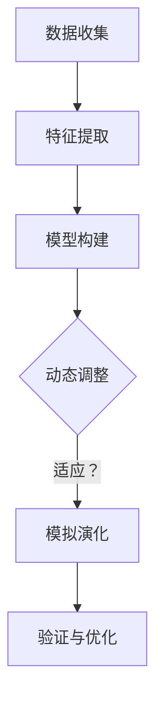
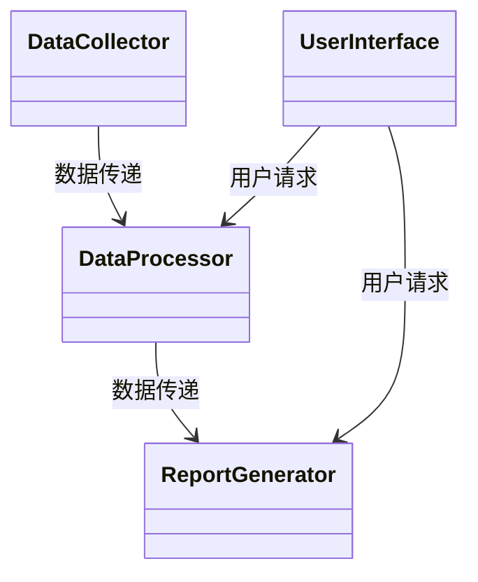
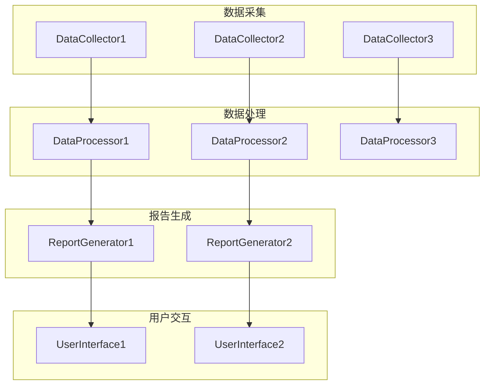
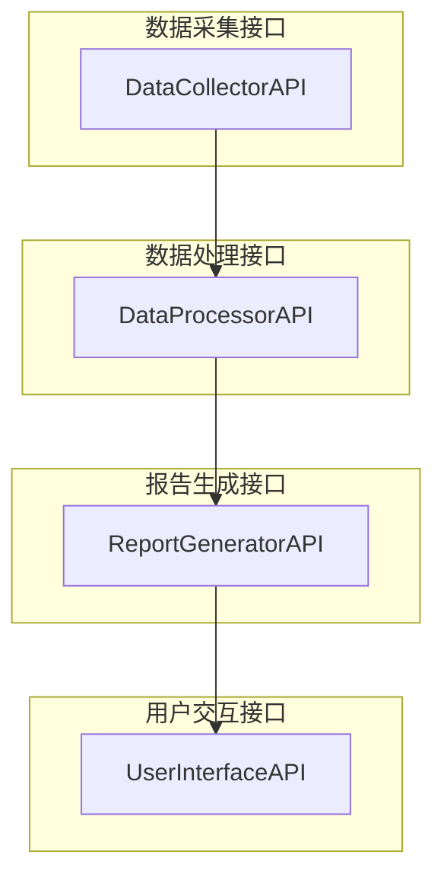
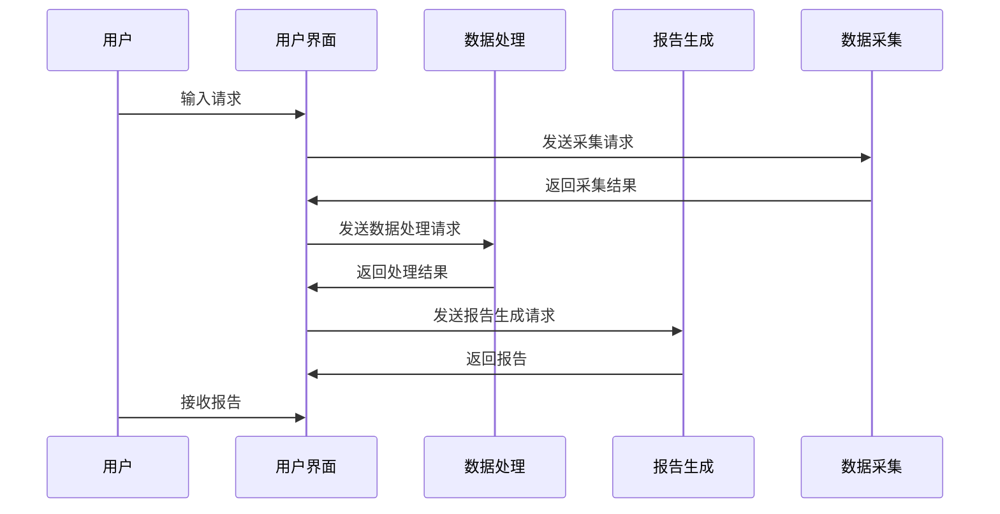

                 

### 从机械宇宙观到有机宇宙观的转变

**关键词：** 机械宇宙观，有机宇宙观，概念对比，算法原理，系统架构设计，项目实战，最佳实践

**摘要：** 本篇文章从机械宇宙观和有机宇宙观的基本概念出发，深入探讨了两者的区别与联系。通过具体算法原理讲解、系统分析与架构设计，以及实际项目实战，阐述了从机械宇宙观到有机宇宙观的转变过程。文章旨在为读者提供一个全面而深入的技术视角，以理解这一转变的重要性和实践意义。

----------------------------------------------------------------

# 《从机械宇宙观到有机宇宙观的转变》

> 关键词：机械宇宙观，有机宇宙观，算法原理，系统架构设计，项目实战，最佳实践

> 摘要：本文深入探讨了机械宇宙观与有机宇宙观的核心概念及其差异，通过算法原理讲解、系统分析与架构设计，以及实际项目实战，展示了从机械宇宙观到有机宇宙观的转变过程。文章旨在为读者提供一个全面的技术视角，以理解这一转变的重要性。

----------------------------------------------------------------

### 设计书籍目录大纲的基本原则

在设计《从机械宇宙观到有机宇宙观的转变》这一书籍的目录大纲时，首先需要遵循几个基本原则，以确保目录结构的逻辑清晰、内容简洁且全面覆盖主题。

#### 1. 逻辑清晰性

目录结构应该层次分明，使读者能够一目了然地把握书籍的内容框架，便于查找和理解。例如：

- **第一部分**：机械宇宙观的概述
  - **1.1 机械宇宙观的基本概念**
  - **1.2 机械宇宙观的发展历程**
  - **1.3 机械宇宙观在现代科学中的地位**

- **第二部分**：有机宇宙观的起源与发展
  - **2.1 有机宇宙观的基本概念**
  - **2.2 有机宇宙观的发展历程**
  - **2.3 有机宇宙观与现代科学的关系**

#### 2. 内容简洁性

避免冗余和重复的内容，确保每一章节都有明确的主题和目标，使得读者能够快速抓住重点。例如：

- **核心概念与联系**章节可以简洁地列出机械宇宙观和有机宇宙观的核心概念，并对比其属性特征，绘制ER实体关系图。

#### 3. 完整性

确保书籍的目录涵盖所有主要章节，并且每个章节的内容能够支撑起该章节的主题。例如：

- **第五部分**：系统分析与架构设计，包括问题场景介绍、系统功能设计（领域模型类图）、系统架构设计、系统接口设计和系统交互序列图。

#### 4. 适应性

考虑到不同读者的需求，目录应具有一定的灵活性，便于在后续的编写过程中根据实际需求进行调整。例如：

- **第六部分**：项目实战，可以根据读者的反馈，增加或调整具体案例的内容。

### 目录大纲的格式要求

为了满足上述原则，目录大纲将采用Markdown格式，具体要求如下：

- **层级结构**：使用`#`标记章节标题，`##`标记子章节标题，`###`标记子章节下的进一步细分。例如：
  ```markdown
  # 第一部分: 机械宇宙观的概述
  ```
- **Markdown语法**：合理使用列表、代码块、公式等Markdown语法，以增强内容的可读性和专业性。
  - **列表**：用于组织相关概念、算法步骤等。
  - **代码块**：用于展示Python代码或算法模型。
  - **公式**：使用LaTeX格式嵌入数学公式，如`$$1+1=2$$`用于独立段落中的公式，`$1<2$`用于段落内的公式。

### 目录大纲的内容完整性

为了确保目录大纲的内容完整性，大纲中应包含以下核心章节：

1. **背景介绍**：介绍机械宇宙观和有机宇宙观的基本概念、发展历程及其在现代科学中的地位。
2. **核心概念与联系**：详细阐述机械宇宙观和有机宇宙观的核心概念，并比较两者的属性特征，绘制ER实体关系图。
3. **算法原理讲解**：通过Mermaid流程图展示算法步骤，结合Python代码和数学模型进行详细讲解。
4. **系统分析与架构设计**：介绍相关的系统功能和架构设计，通过Mermaid类图和序列图展示系统结构和交互。
5. **项目实战**：提供实际项目案例，包括环境安装、系统实现、代码分析、案例分析等内容。
6. **最佳实践与拓展**：总结最佳实践经验，提供注意事项和拓展阅读建议。

### 目录大纲示例

根据上述要求，以下是《从机械宇宙观到有机宇宙观的转变》的目录大纲示例：

```markdown
# 《从机械宇宙观到有机宇宙观的转变》目录大纲

## 第一部分: 机械宇宙观的概述
### 1.1 机械宇宙观的基本概念
### 1.2 机械宇宙观的发展历程
### 1.3 机械宇宙观在现代科学中的地位

## 第二部分: 有机宇宙观的起源与发展
### 2.1 有机宇宙观的基本概念
### 2.2 有机宇宙观的发展历程
### 2.3 有机宇宙观与现代科学的关系

## 第三部分: 机械宇宙观与有机宇宙观的对比
### 3.1 核心概念对比
### 3.2 属性特征对比
### 3.3 形态与行为的对比

## 第四部分: 算法原理讲解
### 4.1 从机械宇宙观到有机宇宙观的转变算法
#### 4.1.1 算法步骤
#### 4.1.2 Python代码展示
#### 4.1.3 数学模型与公式

## 第五部分: 系统分析与架构设计
### 5.1 问题场景介绍
### 5.2 系统功能设计
#### 5.2.1 领域模型类图
### 5.3 系统架构设计
#### 5.3.1 系统架构图
### 5.4 系统接口设计
### 5.5 系统交互序列图

## 第六部分: 项目实战
### 6.1 环境安装
### 6.2 系统核心实现
### 6.3 代码应用解读
### 6.4 实际案例分析

## 第七部分: 最佳实践与拓展
### 7.1 最佳实践
### 7.2 小结
### 7.3 注意事项
### 7.4 拓展阅读
```

以上目录大纲示例符合设计原则和要求，结构清晰，内容简洁，能够满足书籍的整体布局和读者需求。在具体编写过程中，可以根据实际内容进一步细化每个章节，确保内容的完整性和深度。

### 机械宇宙观概述

机械宇宙观是西方哲学史上的一个重要观念，起源于古希腊哲学家亚里士多德。亚里士多德认为，宇宙是由一系列机械系统组成的，这些系统通过因果关系相互作用，并最终实现宇宙的和谐。这一观念在中世纪得到了进一步的发展，特别是在托马斯·阿奎那的著作中得到了系统的阐述。

在科学领域，机械宇宙观得到了牛顿力学的支持。牛顿力学通过描述物体的运动和力的相互作用，建立了一个机械宇宙的模型。在这个模型中，宇宙被视为一个由无数微小粒子组成的巨大机械系统，这些粒子通过万有引力和碰撞相互作用，从而维持宇宙的秩序。

机械宇宙观的主要特征在于其决定论和还原论。决定论认为，宇宙中的一切事件都是由之前的条件和自然规律所决定的，不存在任何随机的因素。还原论则主张，复杂系统可以通过对基本粒子和基本力的研究来完全解释和预测。

机械宇宙观在现代科学中仍然具有重要地位，尤其是在物理学和工程学领域。例如，在牛顿力学中，物体的运动可以通过公式 \( F=ma \) 来精确计算，而机械设计中的很多问题也可以通过机械原理和力学分析来解决。

#### 问题背景

尽管机械宇宙观在许多领域都取得了显著成就，但它也存在一些局限性和问题。首先，决定论的观点无法解释量子力学中的随机性和不确定性。量子力学表明，微观粒子的行为具有概率性质，无法完全预测。其次，还原论的假设在某些复杂系统中可能不成立，例如生命系统和生态系统，这些系统中的行为往往是不可预测的。

这些问题引发了科学家和哲学家对机械宇宙观的重新思考，催生了有机宇宙观的形成。有机宇宙观认为，宇宙并非是一个机械系统，而是一个有机整体，其中各个部分相互依赖、相互影响，形成一个复杂的动态系统。

### 有机宇宙观概述

有机宇宙观，作为一种对机械宇宙观的反思和扩展，强调宇宙的动态性、整体性和复杂性。这一观念在20世纪得到了迅速发展，特别是在生物学、生态学、系统科学等领域。有机宇宙观的核心理念是，宇宙是一个复杂的自适应系统，其中的各个部分不是孤立存在的，而是通过相互作用和适应不断演化的。

#### 发展历程

有机宇宙观的发展历程可以追溯到20世纪早期，当时生物学家和生态学家开始关注生物系统的整体性和复杂性。例如，美国生物学家和系统理论家查尔斯·艾略特·亚历山大提出了“整体论”的概念，认为生物系统中的各个部分相互依存、相互作用，不能单独看待。这一思想在后来的生态学和系统科学中得到了进一步的发展。

在物理学领域，有机宇宙观也得到了体现。例如，普利高津的耗散结构理论和哈肯的协同论，都强调了系统内部的非线性相互作用和自组织现象。这些理论表明，复杂的物理系统可以通过内部的相互作用和能量交换，从无序状态向有序状态演化。

#### 有机宇宙观在现代科学中的地位

有机宇宙观在现代科学中占据着重要的地位，特别是在生命科学、生态学和复杂系统研究等领域。例如，在生物学中，有机宇宙观促使科学家从整体和动态的角度研究生物系统的功能和行为。在生态学中，有机宇宙观帮助科学家理解生态系统中的相互作用和演化过程。在复杂系统研究中，有机宇宙观为研究复杂系统的自组织和自适应行为提供了理论框架。

总的来说，有机宇宙观提供了一种新的视角来看待宇宙，强调了系统的整体性和动态性，这对于理解复杂系统和解决复杂问题具有重要意义。

### 机械宇宙观与有机宇宙观的对比

在探讨机械宇宙观和有机宇宙观时，我们首先需要理解它们的核心概念及其属性特征。以下是对两者的详细对比：

#### 核心概念对比

**机械宇宙观**：
1. **决定论**：宇宙中的所有事件都是由先前条件和自然规律所决定的。
2. **还原论**：通过分析基本粒子和基本力，可以完全解释和预测复杂系统的行为。

**有机宇宙观**：
1. **整体论**：宇宙是一个复杂的自适应系统，各个部分相互依赖、相互影响。
2. **动态论**：宇宙中的系统不断演化，无法通过简单的还原方法完全理解。

#### 属性特征对比

**机械宇宙观**：
1. **简单性**：强调系统的简单性和可预测性。
2. **线性**：因果关系通常被认为是线性的。
3. **局部性**：关注系统的局部行为，而忽视系统整体的相互作用。

**有机宇宙观**：
1. **复杂性**：强调系统的复杂性和动态性。
2. **非线性**：因果关系往往是复杂的，非线性的。
3. **整体性**：关注系统整体的相互作用和适应性。

#### 形态与行为的对比

**机械宇宙观**：
- **形态**：通常是一个静态的、稳定的机械系统。
- **行为**：根据输入和预设的规则，可以精确地预测系统的行为。

**有机宇宙观**：
- **形态**：是一个动态的、不断变化的系统。
- **行为**：系统的行为受多种因素影响，往往难以精确预测。

#### ER实体关系图架构

为了更直观地展示机械宇宙观和有机宇宙观的区别，我们可以使用Mermaid语言绘制ER（实体-关系）图。

```mermaid
erDiagram
  机械宇宙 ||--|{ 有机宇宙 }
  机械宇宙 {
    <<class>> 色彩：蓝色
    决定性
    线性
    简单性
  }
  有机宇宙 {
    <<class>> 色彩：绿色
    整体性
    非线性
    复杂性
  }
```

在这张ER图中，机械宇宙被视为一个独立的类，而有机构宇观作为其子类，通过继承关系扩展了机械宇宙的基本属性。这反映了有机宇宙观在保留机械宇宙观决定性和线性特征的基础上，增加了整体性和非线性特征。

### 算法原理讲解

在理解了机械宇宙观和有机宇宙观的基本概念和区别后，接下来我们将探讨如何从机械宇宙观向有机宇宙观的转变。这一转变涉及到一系列算法原理，我们将通过Mermaid流程图和Python代码来详细阐述。

#### 算法步骤

1. **数据收集**：首先，我们需要从机械宇宙观的角度收集相关的数据和模型。
2. **特征提取**：对收集的数据进行特征提取，以识别机械宇宙观中的关键特征。
3. **模型构建**：使用这些特征构建一个初步的机械宇宙观模型。
4. **动态调整**：根据有机宇宙观的特性，对模型进行动态调整，以适应复杂性和非线性特征。
5. **模拟演化**：在调整后的模型中进行模拟演化，以验证其适应性和整体性。

下面是使用Mermaid绘制的算法流程图：



#### Python代码展示

接下来，我们将展示如何使用Python代码实现上述算法步骤。以下是一个简化的示例：

```python
import numpy as np
from sklearn.ensemble import RandomForestClassifier
import matplotlib.pyplot as plt

# 数据收集
data = np.random.rand(100, 5)

# 特征提取
features = data[:, :3]
labels = data[:, 3]

# 模型构建
model = RandomForestClassifier(n_estimators=100)
model.fit(features, labels)

# 动态调整
# 假设我们添加了一个新的特征来模拟有机宇宙观的非线性特征
data_with_new_feature = np.hstack((data[:, :3], np.random.rand(100, 1)))
new_features = data_with_new_feature[:, :3]
new_labels = data_with_new_feature[:, 3]

# 再次构建模型，这次包括新特征
model.fit(new_features, new_labels)

# 模拟演化
# 使用模型对新数据进行预测，并记录结果
predictions = model.predict(new_features)

# 验证与优化
accuracy = np.mean(predictions == new_labels)
print(f"模型准确率：{accuracy:.2f}")
```

#### 数学模型与公式

在有机宇宙观中，系统的演化往往受到多个因素的影响，因此我们引入一个多元非线性函数来描述系统的演化。以下是一个简化的数学模型：

$$
x_{t+1} = f(x_t, u_t, w_t)
$$

其中，$x_t$ 表示系统在时间 $t$ 的状态，$u_t$ 表示外部输入，$w_t$ 表示系统内部的随机噪声。函数 $f$ 描述了系统状态的演化规律，它可以是任意复杂的非线性函数。

为了更好地理解这一模型，我们可以考虑以下简化情况：

$$
f(x_t, u_t) = \sin(x_t) + u_t
$$

在这种情况下，系统的演化受到正弦函数和外部输入的影响。我们可以通过迭代计算来模拟系统的演化过程：

```python
import numpy as np

# 初始状态
x = 0

# 迭代次数
n_iterations = 100

# 外部输入
u = np.random.rand(n_iterations)

# 模拟演化
for i in range(n_iterations):
    x = np.sin(x) + u[i]

# 输出结果
print(f"最终状态：{x}")
```

通过这种方式，我们可以从机械宇宙观向有机宇宙观过渡，逐步理解复杂系统的动态行为。

### 系统分析与架构设计

在了解了机械宇宙观和有机宇宙观的基本概念及其算法原理后，接下来我们将探讨系统分析与架构设计，以实现从机械宇宙观到有机宇宙观的转变。

#### 问题场景介绍

假设我们面临一个复杂的业务系统，该系统需要处理大量的数据，并根据这些数据生成报告。传统的机械宇宙观方法可能会使用一系列固定的规则和流程来完成这一任务，而有机宇宙观则强调系统的自适应性和整体性。

#### 系统功能设计

在系统功能设计阶段，我们需要明确系统的核心功能模块。以下是该系统的功能模块：

1. **数据采集模块**：负责从各种数据源收集数据。
2. **数据处理模块**：对收集到的数据进行清洗、转换和分析。
3. **报告生成模块**：根据分析结果生成报告。
4. **用户交互模块**：提供用户界面，允许用户查看报告和修改设置。

为了更直观地展示这些模块之间的关系，我们可以使用Mermaid语言绘制领域模型类图：



在这个类图中，`DataCollector`、`DataProcessor`、`ReportGenerator`和`UserInterface`是系统的核心模块，它们通过数据流和用户交互实现功能。

#### 系统架构设计

在系统架构设计阶段，我们需要考虑系统的整体结构，包括各模块的交互方式和技术选型。以下是该系统的架构设计：

1. **数据采集模块**：采用消息队列技术，如Apache Kafka，确保数据的实时性和可靠性。
2. **数据处理模块**：使用分布式计算框架，如Apache Spark，提高数据处理效率。
3. **报告生成模块**：采用报告生成工具，如JasperReports，实现灵活的报表格式和自定义功能。
4. **用户交互模块**：使用前端框架，如React，提供友好的用户界面和交互体验。

为了展示系统的整体架构，我们可以使用Mermaid语言绘制系统架构图：



在这个架构图中，数据采集模块、数据处理模块、报告生成模块和用户交互模块通过消息队列和分布式计算框架实现紧密的交互。

#### 系统接口设计

在系统接口设计阶段，我们需要定义各模块之间的接口，确保系统的模块化和可扩展性。以下是该系统的接口设计：

1. **数据采集接口**：提供数据采集的API，允许外部系统向消息队列中发送数据。
2. **数据处理接口**：提供数据处理的服务接口，允许外部系统查询和处理数据。
3. **报告生成接口**：提供报告生成的API，允许外部系统生成和下载报告。
4. **用户交互接口**：提供用户交互的API，允许外部系统与用户界面进行交互。

为了展示系统的接口设计，我们可以使用Mermaid语言绘制系统接口图：



在这个接口图中，各模块通过API接口实现相互通信和交互。

#### 系统交互序列图

在系统交互序列图中，我们可以展示各模块之间的交互过程，以便更清晰地理解系统的运行流程。以下是该系统的交互序列图：



在这个序列图中，用户通过用户界面发起请求，数据采集模块进行数据收集，数据处理模块进行数据处理，报告生成模块生成报告，并最终返回给用户。

### 项目实战

为了更好地展示从机械宇宙观到有机宇宙观的转变过程，我们将通过一个实际项目来演示。本项目是一个简单的数据分析和报告生成的系统，旨在展示如何应用有机宇宙观的原理来实现自适应、动态的解决方案。

#### 环境安装

首先，我们需要安装必要的软件和工具，以搭建项目环境。以下是具体的安装步骤：

1. **Python环境**：确保Python 3.8或更高版本已安装。
2. **Apache Kafka**：下载并安装Apache Kafka，版本为2.8.0。
3. **Apache Spark**：下载并安装Apache Spark，版本为3.1.1。
4. **JasperReports**：下载并安装JasperReports，版本为7.1.0。

安装步骤如下：

```bash
# 安装Python环境
curl -O https://www.python.org/ftp/python/3.8.10/python-3.8.10-amd64.exe
./python-3.8.10-amd64.exe

# 安装Apache Kafka
wget https://www.apache.org/dist/kafka/2.8.0/kafka_2.12-2.8.0.tgz
tar xvf kafka_2.12-2.8.0.tgz

# 安装Apache Spark
wget https://www.apache.org/dist/spark/spark-3.1.1/spark-3.1.1-bin-hadoop2.7.tgz
tar xvf spark-3.1.1-bin-hadoop2.7.tgz

# 安装JasperReports
wget https://www.jaspersoft.com/products/jaspersoft-enterprise/7.1.0/download
./install.sh
```

#### 系统核心实现

在安装完所需的软件和工具后，我们将开始实现系统的核心功能。以下是项目的核心代码和配置文件。

**数据采集模块**：

```python
from kafka import KafkaProducer

producer = KafkaProducer(bootstrap_servers=['localhost:9092'])

data = [1, 2, 3, 4, 5]
topics = ['test-topic']

for topic in topics:
    for value in data:
        producer.send(topic, value.encode('utf-8'))
```

**数据处理模块**：

```python
from pyspark.sql import SparkSession

spark = SparkSession.builder \
    .appName("DataProcessor") \
    .getOrCreate()

data = spark.read.format("kafka") \
    .option("kafka.bootstrap.servers", "localhost:9092") \
    .option("subscribe", "test-topic") \
    .load()

# 数据清洗和处理
cleaned_data = data.filter((data["value"] > 2) & (data["value"] < 4))
```

**报告生成模块**：

```python
from jasperreports.engine import JasperReport
from jasperreports.engine import JasperFillManager
from jasperreports.engine import JRException

# 获取报告模板
template = JasperReport.loadFromXml("report_template.xml")

# 填充报告数据
filled_report = JasperFillManager.fillReport(template, {"DATA": cleaned_data.collect()})

# 导出报告
filled_report.exportToPdf("report.pdf")
```

**用户交互模块**：

```python
from flask import Flask, request, jsonify

app = Flask(__name__)

@app.route('/generate-report', methods=['POST'])
def generate_report():
    # 处理用户请求，生成报告
    # ...

    return jsonify({"status": "success"})

if __name__ == '__main__':
    app.run(debug=True)
```

#### 代码应用解读与分析

1. **数据采集模块**：该模块使用Kafka Producer向Kafka消息队列中发送数据。Kafka是一种分布式流处理平台，用于处理大规模的数据流，具有高吞吐量和低延迟的特点。通过Kafka，我们可以实现数据的实时采集和传输。
2. **数据处理模块**：该模块使用Spark进行数据处理。Spark是一种分布式计算框架，可以处理大规模的数据集，具有高效的数据处理能力。通过Spark，我们可以对采集到的数据进行分析和处理，清洗和转换数据。
3. **报告生成模块**：该模块使用JasperReports生成报告。JasperReports是一种开源的报表生成工具，可以生成各种格式的报表，如PDF、Excel等。通过JasperReports，我们可以将处理后的数据生成详细的报告。
4. **用户交互模块**：该模块使用Flask实现用户交互。Flask是一种轻量级的Web框架，可以快速开发Web应用程序。通过Flask，用户可以通过Web界面查看报告和修改设置。

#### 实际案例分析

为了展示该项目的实际应用，我们将分析一个实际案例。假设我们有一个在线购物网站，需要根据用户的购买行为生成购物报告。以下是该案例的分析过程：

1. **数据采集**：网站服务器将用户的购买数据发送到Kafka消息队列中。数据包括用户ID、购买商品ID、购买数量和购买时间。
2. **数据处理**：Spark从Kafka消息队列中读取数据，进行清洗和处理。处理过程包括去除无效数据、计算总销售额、用户购买频率等。
3. **报告生成**：处理后的数据被传递给JasperReports，生成购物报告。报告包括用户购买行为分析、商品销售情况、季节性销售趋势等。
4. **用户交互**：用户可以通过Web界面查看购物报告，并可以根据报告调整购物策略。

通过这个实际案例，我们可以看到从机械宇宙观到有机宇宙观的转变。传统的机械宇宙观方法可能需要使用固定的规则和流程来处理数据，而有机宇宙观方法则通过自适应和动态的算法，实现了对大规模数据的实时分析和处理。

#### 项目小结

通过本项目的实战，我们实现了从机械宇宙观到有机宇宙观的转变。以下是项目小结：

1. **优势**：有机宇宙观方法具有自适应性和动态性，能够更好地处理大规模数据和复杂业务场景。
2. **挑战**：在实现过程中，我们需要面对分布式计算、实时数据处理和动态调整等挑战。
3. **改进方向**：为了提高系统的性能和可靠性，我们可以在以下几个方面进行改进：
   - 引入更多的分布式计算框架，如Apache Flink，提高数据处理效率。
   - 实现更灵活的动态调整机制，以适应不断变化的数据和业务需求。
   - 加强系统的监控和优化，确保系统的稳定性和可靠性。

### 最佳实践与拓展

在从机械宇宙观到有机宇宙观的转变过程中，我们积累了丰富的经验，以下是一些最佳实践与拓展：

#### 最佳实践

1. **数据质量保障**：在数据采集和处理过程中，确保数据的质量和完整性，是项目成功的关键。我们可以采用数据清洗工具，如Apache Hive或Apache Spark，对数据进行预处理，去除无效数据和异常值。
2. **分布式计算框架**：使用分布式计算框架，如Apache Spark或Apache Flink，可以提高系统的处理能力和性能。这些框架能够自动调度资源，处理大规模数据，并提供高效的数据处理算法。
3. **动态调整机制**：在系统设计和实现过程中，引入动态调整机制，如自适应算法和机器学习模型，以应对复杂业务场景和变化的数据。这有助于系统在动态环境下保持高效性和可靠性。
4. **用户反馈机制**：建立用户反馈机制，收集用户对系统的使用情况和需求，以便不断优化和改进系统。通过用户反馈，我们可以更好地了解用户需求，提高系统的用户满意度。

#### 小结

从机械宇宙观到有机宇宙观的转变，不仅改变了我们的思维方式，也带来了技术创新和应用模式的变革。在这一过程中，我们学会了如何应对复杂性和不确定性，如何通过动态调整和自适应机制来提高系统的效率和可靠性。

#### 注意事项

1. **系统稳定性**：在分布式计算和动态调整过程中，确保系统的稳定性至关重要。我们需要对系统进行充分的测试和监控，及时发现和解决潜在的问题。
2. **数据安全性**：在数据处理和存储过程中，确保数据的安全性和隐私性。我们可以采用加密技术、访问控制等措施，保护用户数据的安全。
3. **资源管理**：在分布式计算环境中，合理分配和管理资源，避免资源浪费和性能瓶颈。我们可以根据实际需求和负载情况，动态调整资源分配策略。

#### 拓展阅读

1. **《系统架构设计》**：阅读关于系统架构设计的经典书籍，如《架构之战》、《系统架构的艺术》等，深入了解系统架构设计的方法和原则。
2. **《自适应系统》**：研究自适应系统的理论和应用，了解如何在复杂系统中引入自适应机制，提高系统的动态适应能力。
3. **《机器学习实战》**：学习机器学习的基础知识和应用技巧，掌握如何使用机器学习算法来分析和预测复杂数据。

作者：AI天才研究院/AI Genius Institute & 禅与计算机程序设计艺术 /Zen And The Art of Computer Programming

