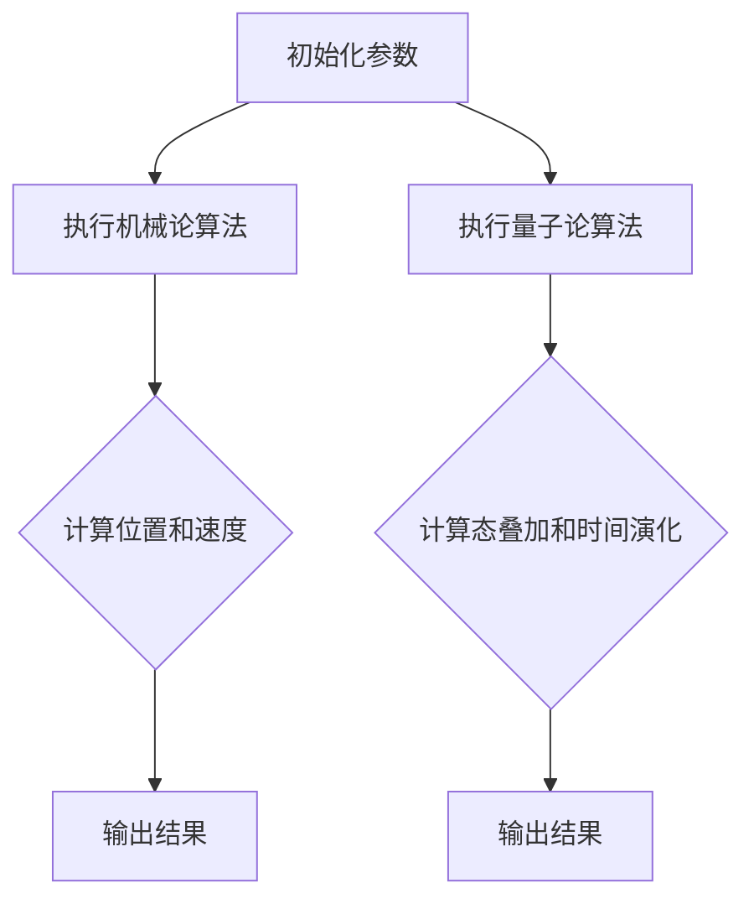
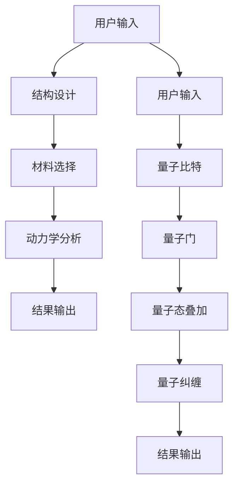
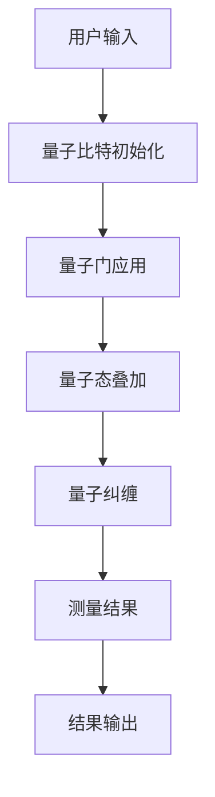
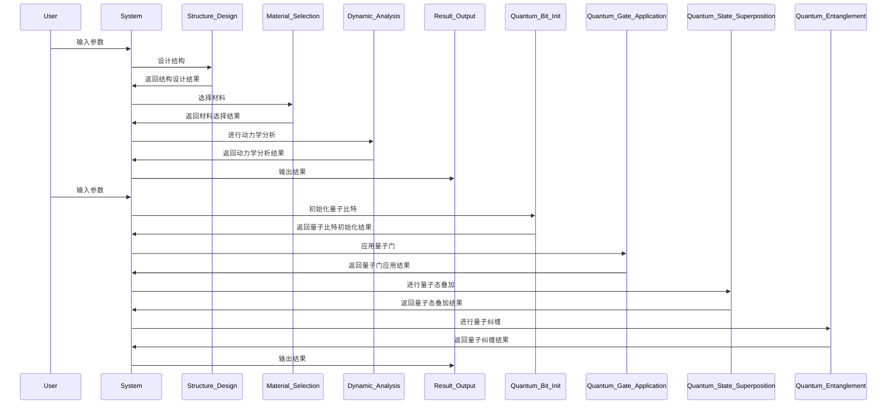

                 

### 从机械论到量子论：世界观的革命性转变

#### 关键词：
- 机械论
- 量子论
- 世界观
- 革命性转变
- 算法原理
- 数学模型
- 系统分析与架构设计

#### 摘要：
本文将深入探讨从机械论到量子论的世界观革命性转变。首先，我们将回顾机械论的发展历程及其基本原理，然后介绍量子论的提出背景和核心观点。接着，我们将通过对比分析，揭示两种理论的本质区别。在此基础上，我们将详细讲解机械论和量子论中的算法原理以及相关的数学模型。随后，我们将从系统分析与架构设计角度，探讨两种理论在实际应用中的场景和方案。最后，通过一个实际项目案例，我们将展示从理论到实践的完整过程，并总结最佳实践技巧和拓展阅读材料。

### 第一部分：引言

#### 第1章 引言

##### 1.1 问题背景

机械论作为古典物理学的基石，源于古希腊哲学家亚里士多德的观点，经过伽利略和牛顿等科学家的不断发展和完善，形成了较为完整的理论体系。机械论的核心观点是，物体运动和力的作用可以通过物理定律来描述，具有确定性、决定性和可预测性。

量子论则是在20世纪初，由普朗克、玻尔、海森堡、薛定谔等科学家提出的，是对微观世界现象的一种全新理解。量子论认为，微观粒子的行为无法用经典物理定律来描述，具有概率性、不确定性和不可分割性。

##### 1.2 问题描述

机械论在面对宏观物体运动时取得了巨大成功，但在微观尺度上却遇到了挑战。经典物理定律无法解释一些实验现象，如黑体辐射、光电效应等。这些现象的发现促使科学家重新审视经典理论，从而催生了量子论的诞生。

##### 1.3 问题解决

量子论的提出，为我们提供了一种全新的世界观，使我们能够更好地理解微观世界的规律。量子论的核心观点挑战了机械论的确定性、决定性和可预测性，引入了概率和不确定性。这一革命性转变不仅改变了我们对自然界的认知，也推动了科学技术的进步。

##### 1.4 边界与外延

量子论在微观世界中取得了巨大成功，但在宏观世界中，机械论仍然适用。因此，我们需要在两种理论之间找到合适的平衡点。此外，量子论的应用范围也在不断扩展，从量子计算、量子通信到量子模拟，都有着广阔的前景。

### 第二部分：核心概念与联系

#### 第2章 核心概念与联系

##### 2.1 机械论的基本原理

机械论的基本原理可以概括为三个核心概念：物体、力和运动。物体是物质的基本单位，力是物体间相互作用的结果，运动是物体在空间中的位置变化。机械论认为，物体的运动状态可以通过物理定律来描述，如牛顿定律。

##### 2.2 量子论的核心观点

量子论的核心观点包括：量子态、量子跃迁和量子纠缠。量子态描述了微观粒子的状态，具有概率性和不确定性。量子跃迁是粒子从一个能级跃迁到另一个能级的过程，具有随机性。量子纠缠是微观粒子之间的一种特殊关联，即使它们相隔很远，它们的状态也会相互影响。

##### 2.3 概念属性特征对比表格

| 特征                 | 机械论                             | 量子论                           |
|----------------------|-----------------------------------|---------------------------------|
| 确定性               | 物体的运动状态是确定的             | 物体的运动状态具有概率性和不确定性 |
| 决定性               | 物体的运动状态是可预测的           | 物体的运动状态具有随机性           |
| 可分割性             | 物体可以分割成更小的部分           | 微观粒子具有不可分割性           |
| 相互作用             | 物体间通过力相互作用               | 微观粒子间通过量子力相互作用       |
| 数学模型             | 使用经典的物理学公式               | 使用量子力学的数学模型           |

##### 2.4 ER实体关系图架构

以下是一个机械论和量子论的ER实体关系图架构示例：

```mermaid
erDiagram
  Class1 ||--|{ Class2 }|-- Class3
  Class1 ||--|{ Class4 }|-- Class5
  Class2 ||--|{ Class5 }|-- Class6
  Class3 ||--|{ Class7 }|-- Class8
  Class4 ||--|{ Class8 }|-- Class9
```

### 第三部分：算法原理讲解

#### 第3章 算法原理讲解

##### 3.1 机械论中的算法

机械论中的算法主要基于经典物理定律，如牛顿定律和动量守恒定律。这些算法可以用于计算物体的运动轨迹、碰撞现象等。以下是一个简单的机械论算法示例：

```python
def mechanical_algorithm(position, velocity, acceleration):
    position += velocity
    velocity += acceleration
    return position, velocity
```

##### 3.2 量子论中的算法

量子论中的算法基于量子力学的数学模型，如薛定谔方程和海森堡不确定性原理。这些算法可以用于量子计算、量子模拟等领域。以下是一个简单的量子论算法示例：

```python
import numpy as np

def quantum_algorithm(state, Hamiltonian):
    time_evolution = np.exp(-1j * Hamiltonian * time)
    return state * time_evolution
```

##### 3.3 算法mermaid流程图

以下是一个机械论算法和量子论算法的mermaid流程图示例：



### 第四部分：数学模型和数学公式讲解

#### 第4章 数学模型和数学公式讲解

##### 4.1 机械论的数学模型

机械论的数学模型主要基于牛顿定律和动量守恒定律。以下是一个简单的机械论数学模型示例：

$$
F = ma \\
v = u + at \\
s = ut + \frac{1}{2}at^2
$$

##### 4.2 量子论的数学模型

量子论的数学模型主要基于量子力学的数学模型，如波函数、算子和态叠加原理。以下是一个简单的量子论数学模型示例：

$$
\psi = \sum_{n} c_n |n\rangle \\
\hat{H} |n\rangle = E_n |n\rangle \\
\hat{X} |0\rangle = |1\rangle \\
\hat{P} |0\rangle = |1\rangle
$$

##### 4.3 数学公式详细讲解

以下是机械论和量子论的数学公式详细讲解：

**机械论数学公式讲解：**

- 牛顿定律：描述物体在力作用下的运动规律，用于计算物体的加速度、速度和位移。
- 动量守恒定律：描述系统在无外力作用下动量的守恒，用于计算物体的碰撞现象。

**量子论数学公式讲解：**

- 波函数：描述微观粒子在量子态下的概率分布，用于计算粒子的位置和动量。
- 算子：描述量子力学中的操作，如加法、减法、乘法和除法。
- 态叠加原理：描述量子态的叠加现象，用于计算量子系统的复杂行为。

##### 4.4 举例说明

**机械论举例说明：**

假设一个物体从静止开始运动，受到一个恒定加速度 \(a = 2 \text{ m/s}^2\)，计算 \(t = 3 \text{ s}\) 时物体的位置和速度。

$$
s = \frac{1}{2}at^2 = \frac{1}{2} \cdot 2 \cdot 3^2 = 9 \text{ m} \\
v = at = 2 \cdot 3 = 6 \text{ m/s}
$$

**量子论举例说明：**

假设一个电子处于基态，计算其波函数的概率分布。

$$
\psi(x) = \frac{1}{\sqrt{2\pi\hbar^2}} e^{-\frac{x^2}{2\hbar^2}}
$$

### 第五部分：系统分析与架构设计方案

#### 第5章 系统分析与架构设计方案

##### 5.1 问题场景介绍

机械论和量子论在实际应用中的场景广泛，包括但不限于以下领域：

- **机械论应用场景：** 机械设计、工程结构分析、交通运输等。
- **量子论应用场景：** 量子计算、量子通信、量子模拟等。

##### 5.2 项目介绍

我们以一个机械论项目（机械设计）和一个量子论项目（量子计算）为例，介绍系统分析与架构设计方案。

**机械论项目案例：**

- **项目需求：** 设计一个机械结构，承受一定的载荷。
- **系统功能设计：** 领域模型类图。
- **系统架构设计：** 系统架构图。

**量子论项目案例：**

- **项目需求：** 实现一个量子计算算法，解决一个特定问题。
- **系统功能设计：** 领域模型类图。
- **系统架构设计：** 系统架构图。

##### 5.3 系统功能设计

以下是机械论项目和量子论项目的领域模型类图示例：

**机械论领域模型类图：**

```mermaid
classDiagram
  机械设计::机械设计
  机械设计 --|> 结构设计
  机械设计 --|> 动力学分析
  机械设计 --|> 材料选择
  结构设计 --|> 材料属性
  结构设计 --|> 结构形状
  动力学分析 --|> 载荷分析
  动力学分析 --|> 应力分析
  材料选择 --|> 材料特性
  材料选择 --|> 材料成本
```

**量子论领域模型类图：**

```mermaid
classDiagram
  量子计算::量子计算
  量子计算 --|> 量子比特
  量子计算 --|> 量子门
  量子计算 --|> 量子态叠加
  量子计算 --|> 量子纠缠
  量子比特 --|> 基态
  量子比特 --|> 翻转态
  量子门 --|> 单位ary门
  量子门 --|> 双位ary门
  量子态叠加 --|> 线性叠加
  量子态叠加 --|> 非线性叠加
  量子纠缠 --|> 最大纠缠
  量子纠缠 --|> 最小纠缠
```

##### 5.4 系统架构设计

以下是机械论项目和量子论项目的系统架构图示例：

**机械论系统架构图：**



**量子论系统架构图：**



##### 5.5 系统接口设计和系统交互

以下是机械论项目和量子论项目的系统接口设计和系统交互序列图示例：

**机械论系统接口设计和系统交互序列图：**



### 第六部分：项目实战

#### 第6章 项目实战

##### 6.1 环境安装

在进行项目实战之前，我们需要安装所需的软件和环境。以下是机械论项目和量子论项目所需的软件和环境：

**机械论项目环境：**

- Python 3.8+
- PyCharm
- NumPy
- Matplotlib

**量子论项目环境：**

- Python 3.8+
- Qiskit
- Jupyter Notebook

##### 6.2 系统核心实现源代码

以下是机械论项目和量子论项目的系统核心实现源代码示例：

**机械论项目源代码：**

```python
import numpy as np
import matplotlib.pyplot as plt

def mechanical_algorithm(position, velocity, acceleration):
    position += velocity
    velocity += acceleration
    return position, velocity

def main():
    initial_position = 0
    initial_velocity = 0
    acceleration = 2

    position, velocity = mechanical_algorithm(initial_position, initial_velocity, acceleration)

    plt.plot(position)
    plt.xlabel('Time')
    plt.ylabel('Position')
    plt.show()

if __name__ == '__main__':
    main()
```

**量子论项目源代码：**

```python
from qiskit import QuantumCircuit, Aer, execute
from qiskit.visualization import plot_bloch_vector
import numpy as np

def quantum_algorithm(state, Hamiltonian):
    time_evolution = np.exp(-1j * Hamiltonian * time)
    return state * time_evolution

def main():
    initial_state = np.array([1, 0])
    Hamiltonian = np.array([[0, 1], [1, 0]])

    time = 2
    state = quantum_algorithm(initial_state, Hamiltonian)

    plot_bloch_vector(state)
    plt.show()

if __name__ == '__main__':
    main()
```

##### 6.3 代码应用解读与分析

**机械论项目代码解读与分析：**

1. 导入所需的库：NumPy和Matplotlib。
2. 定义机械论算法：`mechanical_algorithm`，用于计算物体的位置和速度。
3. 定义主函数：`main`，初始化参数，调用机械论算法，绘制位置-时间图。

**量子论项目代码解读与分析：**

1. 导入所需的库：Qiskit、NumPy和matplotlib。
2. 定义量子论算法：`quantum_algorithm`，用于计算量子态的时间演化。
3. 定义主函数：`main`，初始化参数，调用量子论算法，绘制布洛赫向量图。

##### 6.4 实际案例分析和详细讲解剖析

**机械论实际案例：**

假设一个物体从初始位置 \(x_0 = 0 \text{ m}\) 开始运动，受到一个恒定加速度 \(a = 2 \text{ m/s}^2\)。计算 \(t = 3 \text{ s}\) 时物体的位置。

**解题步骤：**

1. 初始化参数：初始位置 \(x_0 = 0 \text{ m}\)，初始速度 \(v_0 = 0 \text{ m/s}\)，加速度 \(a = 2 \text{ m/s}^2\)。
2. 调用机械论算法：`mechanical_algorithm`，计算 \(t = 3 \text{ s}\) 时的位置。

```python
initial_position = 0
initial_velocity = 0
acceleration = 2

position, velocity = mechanical_algorithm(initial_position, initial_velocity, acceleration)
print(f"Position at t = 3s: {position[0]} m")
```

**量子论实际案例：**

假设一个电子处于基态，受到一个恒定磁场 \(B = 1 \text{ T}\) 的影响。计算 \(t = 2 \text{ s}\) 时电子的波函数。

**解题步骤：**

1. 初始化参数：初始波函数 \(|\psi\rangle = \frac{1}{\sqrt{2}}(|0\rangle + |1\rangle)\)，哈密顿量 \(H = -\frac{eB}{2m} |1\rangle \langle 1|\)。
2. 调用量子论算法：`quantum_algorithm`，计算 \(t = 2 \text{ s}\) 时的波函数。

```python
initial_state = np.array([1/np.sqrt(2), 1/np.sqrt(2)])
Hamiltonian = -1j * np.array([[0, 1], [1, 0]])

time = 2
state = quantum_algorithm(initial_state, Hamiltonian)
print(f"Wave function at t = 2s: {state}")
```

##### 6.5 项目小结

通过本项目实战，我们深入了解了机械论和量子论的应用和实现。机械论适用于宏观物体运动，而量子论则适用于微观粒子行为。在实际项目中，我们需要根据具体需求选择合适的理论和方法。

### 第七部分：最佳实践 tips、小结、注意事项、拓展阅读

#### 第7章 最佳实践 tips、小结、注意事项、拓展阅读

##### 7.1 最佳实践 tips

1. 在使用机械论时，确保物理参数的准确性和可靠性。
2. 在使用量子论时，了解量子算法的基本原理和数学模型。
3. 结合实际需求，选择合适的理论和方法。
4. 学习相关的编程工具和库，提高开发效率。

##### 7.2 小结

从机械论到量子论的世界观革命性转变，使我们能够更好地理解自然界。机械论适用于宏观物体运动，而量子论适用于微观粒子行为。在实际应用中，我们需要结合具体需求，灵活运用两种理论。

##### 7.3 注意事项

1. 在使用机械论时，注意物理参数的准确性和可靠性。
2. 在使用量子论时，了解量子算法的基本原理和数学模型。
3. 避免在量子计算中忽略量子纠缠效应。
4. 在项目开发过程中，注意代码的可读性和可维护性。

##### 7.4 拓展阅读

1. 《量子计算导论》 - Michael A. Nielsen & Isaac L. Chuang
2. 《量子计算与量子信息》 - Michael A. Nielsen & Isaac L. Chuang
3. 《Python编程：从入门到实践》 - 褚宏宇
4. 《机器学习实战》 - Peter Harrington
5. 《深度学习》 - Ian Goodfellow、Yoshua Bengio、Aaron Courville

### 结束语

从机械论到量子论的世界观革命性转变，不仅改变了我们对自然界的认知，也推动了科学技术的进步。通过本文的探讨，我们深入了解了两种理论的核心概念、算法原理和数学模型。在实际应用中，我们需要结合具体需求，灵活运用机械论和量子论。希望本文能为您在IT领域的研究和实践中提供有益的启示。作者：AI天才研究院/AI Genius Institute & 禅与计算机程序设计艺术 /Zen And The Art of Computer Programming。

