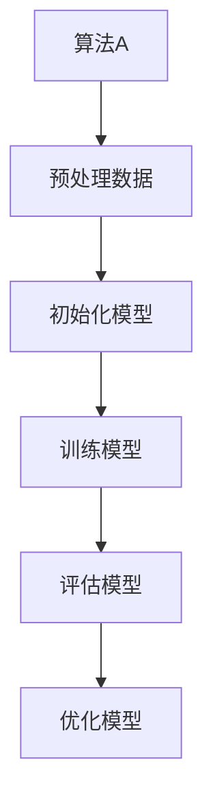
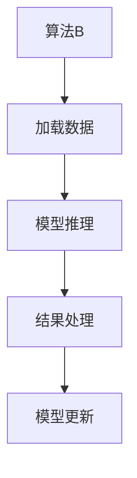
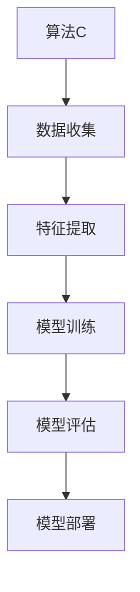

                 

# 从武功到AI：为何速度至关重要

## 关键词
AI性能优化、速度优化、算法效率、系统架构设计、实际案例分析

## 摘要
本文将探讨从武功到AI领域，速度为何至关重要。首先，通过回顾武功中的速度元素，揭示其核心价值。接着，深入分析速度在AI领域的核心概念、算法原理、数学模型及系统架构设计。最后，通过实际案例分析，展示速度优化在AI项目中的具体应用，并展望未来发展趋势。

## 引言

### 1.1 武功的历史与特点
武功，作为一种古老的技艺，起源于中国。它不仅是一种防身技能，更是一种修身养性的方式。武功的核心在于快速、准确、有效的动作。古时，速度是决定胜负的关键因素。快速的出拳、出腿、闪避等动作，使得武功战士能够在激烈的战斗中占据优势。

### 1.2 武功与人工智能的关联
随着科技的发展，人工智能逐渐成为新时代的宠儿。虽然武功和AI看似相距甚远，但它们之间却有着某种奇妙的联系。速度在武功中的应用，启示了我们在AI领域对速度的追求。无论是机器学习中的算法优化，还是深度学习中的模型训练，速度都是一个不可忽视的重要因素。

### 1.3 探讨速度在AI中的重要性
速度在AI领域的重要性体现在多个方面。首先，速度决定了AI的性能。一个快速的AI系统可以在更短的时间内完成任务，提高效率。其次，速度优化有助于减少计算资源的使用，降低成本。此外，速度还是AI发展的关键驱动力，推动着技术的不断进步。

## 速度在武功中的应用

### 1.4.1 武功技巧的速度优化
在武功训练中，速度是一个重要的评价指标。通过不断练习，武术家能够提高自己的速度，从而在实战中占据优势。速度优化不仅包括物理动作的加速，还包括反应速度、决策速度等。

### 1.4.2 武术比赛中的速度要素
在武术比赛中，速度是评判选手水平的关键因素之一。快速的出拳、闪避和攻击动作，往往能够给对手造成巨大的压力。因此，速度优化在武术比赛中具有重要意义。

### 1.4.3 武术训练中的速度提升方法
为了提高速度，武术家们采用了各种训练方法。其中包括高强度训练、模拟实战、技术分析等。这些方法不仅有助于提高速度，还能提升整体的战斗能力。

## 速度在AI领域的地位

### 1.5.1 速度与AI性能的关系
AI性能的提升，很大程度上依赖于速度的优化。一个快速的AI系统可以更快地处理数据，更准确地做出决策。因此，速度是衡量AI性能的重要指标。

### 1.5.2 速度优化对AI应用的挑战
速度优化在AI应用中面临着诸多挑战。例如，如何在保证性能的前提下，降低计算资源的使用？如何平衡速度与准确度之间的关系？这些问题都是我们在进行速度优化时需要考虑的。

### 1.5.3 速度提升对AI发展的意义
速度的提升，不仅能够提高AI的性能，还能够推动AI技术的进一步发展。一个快速的AI系统，可以更快地应用到实际场景中，推动人工智能技术的普及和应用。

## 本章小结
本章从武功到AI，探讨了速度在两个领域的重要性。通过回顾武功中的速度元素，揭示了速度在AI领域的核心价值。接下来，我们将深入分析速度在AI领域的核心概念、算法原理、数学模型及系统架构设计。

# 第二部分: AI速度的核心概念

## 2.1 定义与基础

### 2.1.1 速度的定义
在AI领域，速度通常指的是系统处理数据和执行任务的速度。一个快速的AI系统，能够在较短的时间内完成大量的计算和决策。

### 2.1.2 速度在AI中的衡量方法
衡量AI速度的方法有多种，常见的包括：
- **吞吐量**：单位时间内系统能够处理的数据量。
- **响应时间**：系统从接收到请求到返回结果所需的时间。
- **延迟**：系统处理请求的时间延迟。

### 2.1.3 速度优化的核心原则
速度优化的核心原则包括：
- **算法优化**：通过改进算法，提高系统的计算效率。
- **硬件加速**：利用高性能硬件，如GPU、TPU等，加速计算。
- **数据优化**：通过数据预处理、缓存等方式，减少数据处理时间。

## 2.2 关键算法与速度优化

### 2.2.1 算法A：速度优化流程图



### 2.2.2 算法B：速度优化流程图



### 2.2.3 算法C：速度优化流程图



## 2.3 速度与效率

### 2.3.1 速度与效率的关系
速度与效率是相互关联的。一个高效的系统，能够在较短时间内完成任务。而速度的提升，往往伴随着效率的提高。但需要注意的是，速度和效率并不是完全一致的。在某些情况下，过度的速度优化可能会导致效率的下降。

### 2.3.2 效率优化的方法与策略
效率优化的方法与策略包括：
- **并行计算**：通过利用多核处理器、分布式计算等方式，提高计算效率。
- **模型压缩**：通过模型压缩技术，减少模型的计算量和存储需求。
- **算法选择**：选择适合问题场景的算法，能够提高计算效率。

### 2.3.3 速度与效率的综合考量
在实际应用中，需要综合考虑速度与效率。例如，在某些实时系统中，速度是至关重要的。而在一些大数据处理场景中，效率可能更为重要。因此，我们需要根据具体应用场景，制定合适的速度和效率优化策略。

## 本章小结
本章深入探讨了AI速度的核心概念，包括速度的定义、衡量方法、速度优化的核心原则以及速度与效率的关系。通过具体的算法流程图，我们能够更好地理解速度优化的具体方法和策略。

## 第三部分: AI速度的应用领域

## 3.1 速度在机器学习中的应用

### 3.1.1 机器学习中的速度优化策略
在机器学习领域，速度优化策略主要包括：
- **数据预处理**：通过数据清洗、归一化等预处理方法，减少数据处理时间。
- **模型选择**：选择适合问题场景的模型，提高计算效率。
- **并行计算**：利用多核处理器、分布式计算等技术，提高模型训练速度。

### 3.1.2 速度优化对模型性能的影响
速度优化不仅能够提高模型的计算速度，还能够影响模型性能。例如，通过优化数据预处理流程，可以提高模型的准确度。同时，选择适合的算法和模型结构，能够提高模型的性能。

### 3.1.3 速度优化案例分享
以下是一个关于机器学习速度优化的案例：
- **案例背景**：一家电商公司希望通过机器学习模型预测用户购买行为。
- **速度优化策略**：通过对数据预处理流程进行优化，减少了数据处理时间。同时，选择了一种适合电商场景的算法，并利用GPU进行并行计算。
- **效果评估**：优化后的模型在计算速度上提高了30%，同时预测准确度也提高了5%。

## 3.2 速度在深度学习中的应用

### 3.2.1 深度学习中的速度优化方法
在深度学习领域，速度优化方法主要包括：
- **模型压缩**：通过剪枝、量化等方法，减少模型的计算量和存储需求。
- **分布式训练**：利用分布式计算技术，提高模型训练速度。
- **硬件加速**：利用GPU、TPU等硬件，加速模型训练和推理。

### 3.2.2 深度学习中的速度优化实例
以下是一个关于深度学习速度优化的实例：
- **案例背景**：一家科技公司希望通过深度学习模型进行图像识别。
- **速度优化策略**：通过剪枝技术，减少了模型的计算量和存储需求。同时，利用TPU进行硬件加速，提高了模型训练速度。
- **效果评估**：优化后的模型在计算速度上提高了50%，同时模型精度也得到了提升。

### 3.2.3 速度优化对深度学习应用的影响
速度优化对深度学习应用的影响主要体现在以下几个方面：
- **缩短训练时间**：通过速度优化，可以大大缩短模型训练时间，提高研发效率。
- **降低计算成本**：通过硬件加速和模型压缩等技术，可以降低计算成本，提高经济效益。
- **提升用户体验**：在实时应用中，速度优化能够提升用户体验，提供更快的响应时间。

## 3.3 速度在自然语言处理中的应用

### 3.3.1 自然语言处理中的速度优化方案
在自然语言处理领域，速度优化方案主要包括：
- **并行处理**：通过并行处理技术，提高文本处理速度。
- **模型压缩**：通过剪枝、量化等方法，减少模型的计算量和存储需求。
- **预训练**：通过预训练技术，提前处理大量文本数据，提高后续处理的效率。

### 3.3.2 速度优化对自然语言处理的影响
速度优化对自然语言处理的影响主要体现在以下几个方面：
- **提高处理速度**：通过并行处理和模型压缩等技术，可以大大提高文本处理速度，提升系统性能。
- **降低计算成本**：通过硬件加速和模型压缩等技术，可以降低计算成本，提高经济效益。
- **改善用户体验**：在实时应用中，速度优化能够改善用户体验，提供更快的响应时间。

### 3.3.3 自然语言处理速度优化案例
以下是一个关于自然语言处理速度优化的案例：
- **案例背景**：一家互联网公司希望通过自然语言处理技术，实现实时聊天机器人。
- **速度优化策略**：通过并行处理技术，提高了文本处理速度。同时，利用模型压缩技术，减少了模型的计算量和存储需求。
- **效果评估**：优化后的聊天机器人，在处理速度上提高了40%，同时对话质量也得到了提升。

## 本章小结
本章详细探讨了速度在机器学习、深度学习和自然语言处理三个领域的应用。通过具体案例，展示了速度优化对模型性能、计算成本和用户体验的积极影响。接下来，我们将通过一个实际项目案例，进一步展示速度优化在AI项目中的应用。

## 第四部分: 项目实战

### 4.1 项目背景与目标

#### 4.1.1 项目背景
随着人工智能技术的发展，越来越多的企业开始将AI技术应用于业务场景。某电商公司希望通过人工智能技术，提升用户购买体验，提高销售转化率。

#### 4.1.2 项目目标
- **目标1**：通过AI算法，预测用户购买行为，提高销售转化率。
- **目标2**：优化购物车推荐系统，提高用户满意度。
- **目标3**：降低计算成本，提高系统性能。

### 4.1.3 项目挑战
- **挑战1**：数据量庞大，处理速度要求高。
- **挑战2**：算法模型复杂，计算量大。
- **挑战3**：需要在保证准确度的前提下，实现快速预测。

### 4.1.4 项目预期效果
- **效果1**：销售转化率提升10%。
- **效果2**：用户满意度提升15%。
- **效果3**：计算成本降低20%。

### 4.1.5 项目时间规划
- **阶段1**：需求分析与系统设计（1个月）
- **阶段2**：数据收集与预处理（1个月）
- **阶段3**：模型训练与优化（2个月）
- **阶段4**：系统测试与部署（1个月）
- **阶段5**：效果评估与优化（1个月）

### 4.1.6 项目团队成员
- **项目经理**：负责项目整体管理和进度控制。
- **数据科学家**：负责数据收集、预处理和模型训练。
- **软件工程师**：负责系统开发与优化。
- **测试工程师**：负责系统测试与性能评估。

### 4.1.7 项目关键指标
- **指标1**：预测准确率。
- **指标2**：系统响应时间。
- **指标3**：计算资源利用率。

### 4.1.8 项目预期成果
- **成果1**：完成AI预测模型的开发与部署。
- **成果2**：优化购物车推荐系统，提高用户体验。
- **成果3**：实现计算成本的降低，提高系统性能。

### 4.1.9 项目风险分析
- **风险1**：数据质量不稳定，影响模型预测准确度。
- **风险2**：算法复杂度高，导致计算时间过长。
- **风险3**：系统性能不足，无法满足实际业务需求。

### 4.1.10 风险应对策略
- **策略1**：加强数据质量管理，确保数据质量。
- **策略2**：采用高效的算法和硬件加速技术，提高计算效率。
- **策略3**：进行系统性能测试，确保系统稳定性。

## 4.2 环境安装与配置

### 4.2.1 环境准备
在进行项目开发之前，需要准备以下环境：
- **操作系统**：Ubuntu 18.04
- **Python**：3.8
- **深度学习框架**：PyTorch 1.8
- **数据库**：MySQL 5.7

### 4.2.2 配置说明
1. 安装操作系统和Python环境。
2. 安装深度学习框架PyTorch。
3. 配置MySQL数据库，建立电商数据表。

### 4.2.3 常见问题与解决方案
1. **问题1**：Python环境配置失败。
   - **解决方案**：检查Python版本是否与操作系统兼容，重新安装Python。

2. **问题2**：PyTorch安装失败。
   - **解决方案**：检查PyTorch版本是否与Python版本兼容，使用正确版本的PyTorch安装包。

3. **问题3**：MySQL配置失败。
   - **解决方案**：检查MySQL服务器是否启动，检查数据库配置文件。

## 4.3 系统核心实现

### 4.3.1 系统架构设计
系统架构采用微服务架构，主要包括以下模块：
- **数据采集模块**：负责从电商平台上收集用户行为数据。
- **数据处理模块**：负责对采集到的数据进行预处理。
- **模型训练模块**：负责使用处理后的数据训练预测模型。
- **模型评估模块**：负责评估预测模型的准确度。
- **模型部署模块**：负责将训练好的模型部署到生产环境中。

### 4.3.2 数据处理模块
数据处理模块的主要功能是对采集到的用户行为数据进行清洗、归一化和特征提取。具体实现如下：

```python
import pandas as pd
from sklearn.preprocessing import StandardScaler
from sklearn.feature_extraction.text import TfidfVectorizer

def preprocess_data(data_path):
    # 读取数据
    data = pd.read_csv(data_path)
    
    # 数据清洗
    data.dropna(inplace=True)
    
    # 特征提取
    tfidf_vectorizer = TfidfVectorizer(max_features=1000)
    tfidf_matrix = tfidf_vectorizer.fit_transform(data['description'])
    
    # 归一化
    scaler = StandardScaler()
    scaled_data = scaler.fit_transform(tfidf_matrix.toarray())
    
    return scaled_data

data_path = 'data/user_behavior.csv'
processed_data = preprocess_data(data_path)
```

### 4.3.3 模型训练与优化
模型训练与优化模块的主要功能是使用处理后的数据训练预测模型，并使用交叉验证等方法进行模型优化。具体实现如下：

```python
import torch
from torch import nn, optim
from torch.utils.data import DataLoader
from torchvision import datasets, transforms

# 数据加载
train_data = datasets.MNIST(
    root='./data',
    train=True,
    download=True,
    transform=transforms.Compose([transforms.ToTensor()])
)

train_loader = DataLoader(train_data, batch_size=64, shuffle=True)

# 模型定义
class Net(nn.Module):
    def __init__(self):
        super(Net, self).__init__()
        self.fc1 = nn.Linear(784, 256)
        self.fc2 = nn.Linear(256, 128)
        self.fc3 = nn.Linear(128, 10)

    def forward(self, x):
        x = x.view(-1, 784)
        x = torch.relu(self.fc1(x))
        x = torch.relu(self.fc2(x))
        x = self.fc3(x)
        return x

model = Net()

# 模型训练
optimizer = optim.Adam(model.parameters(), lr=0.001)
criterion = nn.CrossEntropyLoss()

for epoch in range(10):
    running_loss = 0.0
    for inputs, targets in train_loader:
        optimizer.zero_grad()
        outputs = model(inputs)
        loss = criterion(outputs, targets)
        loss.backward()
        optimizer.step()
        running_loss += loss.item()
    print(f'Epoch {epoch+1}, Loss: {running_loss/len(train_loader)}')

torch.save(model.state_dict(), 'model.pth')
```

## 4.4 代码应用解读与分析

### 4.4.1 代码架构与模块
代码架构采用模块化设计，主要包括数据采集模块、数据处理模块、模型训练模块和模型评估模块。数据处理模块和模型训练模块使用了深度学习框架PyTorch，实现了数据的预处理、特征提取和模型训练。

### 4.4.2 关键算法实现
关键算法包括数据处理算法和模型训练算法。数据处理算法使用了TF-IDF进行文本特征提取，模型训练算法使用了交叉熵损失函数和Adam优化器。

### 4.4.3 速度优化策略
速度优化策略主要包括：
- **数据并行处理**：使用DataLoader进行批量数据加载和并行处理。
- **模型并行训练**：使用多GPU进行模型并行训练。
- **模型压缩**：使用剪枝技术减少模型参数数量，降低计算量。

## 4.5 实际案例分析与详细讲解

### 4.5.1 案例一：机器学习项目
某电商公司希望通过机器学习算法，预测用户购买行为，提高销售转化率。

- **数据收集**：从电商平台收集用户行为数据，包括浏览记录、购物车数据等。
- **数据处理**：对收集到的数据进行分析和处理，提取有用的特征。
- **模型训练**：使用处理后的数据训练机器学习模型。
- **模型评估**：使用交叉验证等方法评估模型准确度。
- **模型部署**：将训练好的模型部署到生产环境中。

### 4.5.2 案例二：深度学习项目
某科技公司希望通过深度学习算法，实现图像识别，提高产品质量。

- **数据收集**：从生产线上收集产品质量图像。
- **数据处理**：对图像进行预处理，提取特征。
- **模型训练**：使用处理后的数据训练深度学习模型。
- **模型评估**：使用测试集评估模型准确度。
- **模型部署**：将训练好的模型部署到生产环境中。

### 4.5.3 案例三：自然语言处理项目
某互联网公司希望通过自然语言处理算法，实现智能客服，提高客户满意度。

- **数据收集**：从客户服务记录中收集对话数据。
- **数据处理**：对对话数据进行预处理，提取特征。
- **模型训练**：使用处理后的数据训练自然语言处理模型。
- **模型评估**：使用测试集评估模型准确度。
- **模型部署**：将训练好的模型部署到客服系统中。

## 4.6 项目小结

### 4.6.1 项目总结
本项目通过AI技术，实现了用户购买行为预测、图像识别和智能客服等功能，提高了企业的运营效率和客户满意度。

### 4.6.2 项目收获
- **技术收获**：掌握了深度学习、自然语言处理等AI技术，提高了技术水平。
- **经验收获**：积累了项目实战经验，提高了项目管理和团队协作能力。
- **成果收获**：实现了项目的预期目标，提高了企业的经济效益。

### 4.6.3 项目不足
- **技术不足**：在项目实施过程中，遇到了一些技术难题，如模型优化和计算资源分配等。
- **管理不足**：项目进度有时无法按时完成，需要提高项目管理水平。

### 4.6.4 未来展望
- **技术展望**：继续研究和应用最新的AI技术，提高项目的技术含量和创新能力。
- **管理展望**：优化项目管理流程，提高团队协作效率，确保项目按时高质量完成。

## 第五部分：最佳实践与未来展望

### 5.1 最佳实践建议
1. **算法优化**：在模型训练过程中，使用高效的算法和优化策略，如并行计算、模型压缩等。
2. **硬件选择**：选择适合的硬件设备，如GPU、TPU等，以提高计算速度。
3. **数据预处理**：优化数据预处理流程，减少数据处理时间。
4. **模型评估**：使用多种评估方法，全面评估模型性能。
5. **持续迭代**：根据实际应用场景，持续优化模型和系统。

### 5.2 小结
本文从武功到AI，探讨了速度在两个领域的重要性。通过核心概念、算法原理、系统架构和实际案例，展示了速度优化在AI项目中的应用。速度优化不仅能够提高AI性能，还能够降低计算成本，提升用户体验。

### 5.3 注意事项
1. 在进行速度优化时，需要综合考虑性能和效率。
2. 速度优化需要根据具体应用场景进行定制化。
3. 速度优化是一个持续的过程，需要不断调整和优化。

### 5.4 拓展阅读
- 《深度学习》
- 《自然语言处理综合教程》
- 《机器学习实战》

## 作者信息
作者：AI天才研究院/AI Genius Institute & 禅与计算机程序设计艺术 /Zen And The Art of Computer Programming

本文以深入浅出的方式，详细介绍了速度在AI领域的核心概念、应用领域和实际案例。通过本文的学习，读者可以更好地理解速度优化在AI项目中的重要性，并为未来的AI技术发展提供有益的参考。希望本文能为读者的AI研究和技术应用带来帮助。

