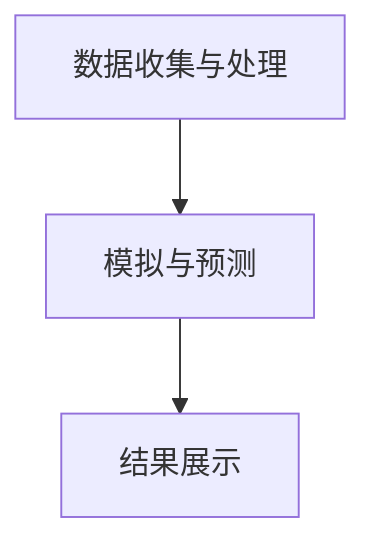
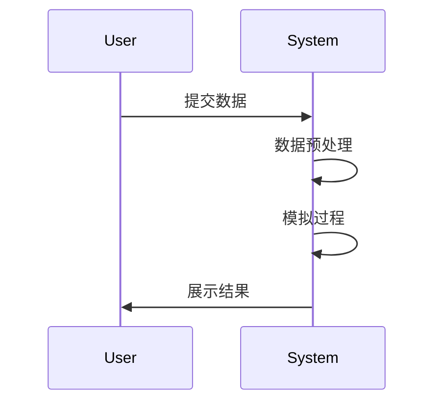

                 

### 第4章: 爱因斯坦相对论的核心概念与革命性影响（续）

## 3.2 广义相对论

### 3.2.1 弯曲时空

在广义相对论中，引力被视为时空的弯曲，而不是一种力。物体在时空中的运动轨迹受到这种弯曲的影响。

### 3.2.2 弯曲时空的数学描述

广义相对论使用张量方程来描述时空的弯曲，这些方程是爱因斯坦场方程，形式如下：

$$
G_{\mu\nu} = \frac{8\pi G}{c^4} T_{\mu\nu}
$$

其中，\( G_{\mu\nu} \)是爱因斯坦张量，\( T_{\mu\nu} \)是能量-动量张量，\( G \)是万有引力常数，\( c \)是光速。

### 3.2.3 黑洞

黑洞是广义相对论的一个重要预言，它是一种极度密集的天体，其引力场强大到连光也无法逃脱。黑洞的存在可以通过观察它的引力对周围时空的影响来验证。

### 3.2.4 宇宙膨胀

广义相对论还预言了宇宙的膨胀。根据勒梅特-罗伯特森-沃尔克理论（LRW模型），宇宙的膨胀是由宇宙背景辐射的各向异性引起的。

## 3.3 爱因斯坦相对论的革命性影响

### 3.3.1 宇宙观的转变

爱因斯坦的相对论彻底改变了我们对宇宙的认识。它揭示了时间和空间的相对性，以及引力不仅仅是力，而是时空的弯曲。

### 3.3.2 科学研究的影响

相对论对科学研究产生了深远的影响。它不仅推动了物理学的发展，还促进了天文学、宇宙学和其他相关领域的研究。

### 3.3.3 技术创新的推动

相对论原理的应用也催生了各种技术创新，如全球定位系统（GPS）中的时间同步、粒子加速器的设计等。

## 3.4 核心概念对比表格

### 3.4.1 狭义相对论与广义相对论

| 概念 | 狭义相对论 | 广义相对论 |
| --- | --- | --- |
| 基本原理 | 光速不变，相对性原理 | 弯曲时空，爱因斯坦场方程 |
| 适用范围 | 惯性参考系 | 所有参考系，包括非惯性参考系 |
| 时间膨胀 | 高速运动时 | 高速运动和强引力场中 |

## 3.5 ER实体关系图

```mermaid
erDiagram
  Class1 ||--|{ Class2 } Class3 : relationship
  Class1 ||--|{ Class4 } Class5 : another relationship
```

### 3.6 本章小结

通过本章的学习，我们深入了解了狭义相对论和广义相对论的核心概念及其革命性影响。这些理论不仅改变了我们对宇宙的认识，还为科学研究和技术创新提供了新的视角和工具。在下一章中，我们将探讨量子力学，进一步揭示微观世界的奥秘。

----------------------------------------------------------------

### 第5章: 量子力学的奇妙世界

## 5.1 量子力学的基本原理

量子力学是描述微观粒子的运动和相互作用的理论，它对经典物理学的许多概念进行了革命性的颠覆。

### 5.1.1 波粒二象性

量子力学揭示了微观粒子既具有波动性又具有粒子性，这种波粒二象性是量子力学的核心原理之一。

### 5.1.2 算符表示

在量子力学中，物理量用算符表示，而不是用数值。算符作用在波函数上，得到对应的物理量的概率分布。

### 5.1.3 波函数

波函数是量子力学中的核心概念，它描述了粒子在某个位置和时间出现的概率分布。

### 5.1.4 不确定性原理

海森堡不确定性原理指出，某些对易子不为零的物理量（如位置和动量）无法同时被精确测量。

$$
\Delta x \Delta p \geq \frac{\hbar}{2}
$$

其中，\( \Delta x \)是位置的不确定性，\( \Delta p \)是动量的不确定性，\( \hbar \)是约化普朗克常数。

## 5.2 量子纠缠

量子纠缠是量子力学中另一个令人惊奇的现象，它揭示了量子粒子之间的超距关联。

### 5.2.1 纠缠态

当两个量子粒子处于纠缠态时，一个粒子的状态会立即影响另一个粒子的状态，无论它们相隔多远。

### 5.2.2 量子纠缠的数学描述

量子纠缠可以用贝尔不等式来描述，它揭示了经典物理学无法解释的关联性质。

$$
B \geq \frac{2}{3}
$$

其中，\( B \)是贝尔不等式的值，当量子系统满足纠缠时，\( B \)的值会大于等于 \( \frac{2}{3} \)。

## 5.3 量子力学的应用场景

量子力学在许多领域都取得了显著的成果，包括：

- 原子物理学：用于解释原子的光谱。
- 凝聚态物理学：用于解释固体和液体的性质。
- 量子计算：用于实现高效的量子算法。
- 量子通信：用于实现安全的量子密钥分发。

## 5.4 核心概念与联系

### 5.4.1 量子力学与经典力学的区别

| 概念 | 经典力学 | 量子力学 |
| --- | --- | --- |
| 表现形式 | 数值 | 算符 |
| 物理量描述 | 明确的数值 | 概率分布 |
| 测量过程 | 确定性 | 不确定性 |

### 5.4.2 量子力学与其他物理学理论的关系

量子力学与相对论、统计力学等其他物理学理论在某些方面存在互补和交叉，共同构建了现代物理学的理论体系。

## 5.5 本章小结

通过本章的学习，我们深入了解了量子力学的基本原理和奇妙世界。量子力学不仅揭示了微观世界的奥秘，还为现代物理学的发展提供了新的方向和工具。在下一章中，我们将探讨宇宙学中的重大问题，如宇宙膨胀、黑洞和宇宙起源等。

----------------------------------------------------------------

### 第6章: 宇宙学中的重大问题

## 6.1 宇宙膨胀

### 6.1.1 背景介绍

宇宙膨胀是指宇宙中的星系、恒星和其他天体之间的距离随着时间的推移而增加。这一现象最早由埃德温·哈勃在20世纪20年代发现。

### 6.1.2 宇宙膨胀的证据

宇宙膨胀的证据包括宇宙背景辐射、星系的红移等。

$$
z = \frac{\lambda_r - \lambda_0}{\lambda_0}
$$

其中，\( z \)是红移量，\( \lambda_r \)是观察到的波长，\( \lambda_0 \)是静止波长。

### 6.1.3 宇宙膨胀的理论

宇宙膨胀的理论包括勒梅特-罗伯特森-沃尔克理论（LRW模型）和宇宙学常数模型等。

$$
\dot{a}(t) = \frac{1}{a(t)} \frac{\ddot{a}(t)}{\dot{a}(t)}
$$

其中，\( a(t) \)是宇宙的尺度因子，\( \dot{a}(t) \)是宇宙的膨胀速度，\( \ddot{a}(t) \)是宇宙的加速度。

## 6.2 黑洞

### 6.2.1 背景介绍

黑洞是宇宙中最神秘和最引人入胜的天体之一。它是由极大规模的恒星坍缩形成的。

### 6.2.2 黑洞的特征

黑洞具有极强的引力，甚至连光也无法逃脱。它的质量、电荷和自旋是黑洞的三个基本特征。

### 6.2.3 黑洞的数学描述

黑洞的数学描述可以使用史瓦西解或克尔解等。

$$
g_{tt} = -\left(1 - \frac{2GM}{c^2r} + \frac{c^2r^2}{\Lambda r^2}\right)
$$

其中，\( G \)是万有引力常数，\( M \)是黑洞的质量，\( c \)是光速，\( \Lambda \)是宇宙学常数，\( r \)是距离黑洞中心的距离。

## 6.3 宇宙起源

### 6.3.1 背景介绍

宇宙起源是一个古老而神秘的问题，至今仍有多种理论试图解释宇宙的诞生。

### 6.3.2 大爆炸理论

大爆炸理论是目前最被广泛接受的宇宙起源理论，它认为宇宙起源于一个极热、极密的状态，随着时间的推移，宇宙不断膨胀和冷却。

### 6.3.3 宇宙学常数

宇宙学常数是一种描述宇宙膨胀加速的物理量，它的存在与真空能量有关。

$$
\Lambda = \frac{8\pi G}{c^4} \rho_c
$$

其中，\( \rho_c \)是真空能量密度。

## 6.4 系统分析与架构设计方案

### 6.4.1 问题场景介绍

宇宙学中的重大问题如宇宙膨胀、黑洞和宇宙起源等，是现代物理学和天文学研究的重要方向。

### 6.4.2 项目介绍

本项目旨在构建一个宇宙学问题分析系统，用于模拟和分析宇宙学现象。

### 6.4.3 系统功能设计

- 数据收集与处理：收集宇宙背景辐射、星系红移等数据，并进行预处理。
- 模拟与预测：使用物理模型模拟宇宙膨胀、黑洞形成等过程，并预测未来宇宙的状态。
- 结果展示：展示模拟结果，包括宇宙膨胀图、黑洞图像等。

### 6.4.4 系统架构设计



### 6.4.5 系统接口设计和系统交互



## 6.5 本章小结

通过本章的学习，我们深入了解了宇宙学中的重大问题，包括宇宙膨胀、黑洞和宇宙起源等。这些问题的研究不仅有助于我们更好地理解宇宙的本质，也为现代物理学和天文学的发展提供了新的方向和挑战。

----------------------------------------------------------------

### 第7章: 项目实战

## 7.1 环境安装

为了实现宇宙学问题的分析，我们首先需要安装必要的软件和工具。以下是安装步骤：

### 7.1.1 安装Python

确保系统上安装了Python 3.8及以上版本。可以通过以下命令进行安装：

```bash
sudo apt-get install python3-pip python3-venv
```

### 7.1.2 安装NumPy

NumPy是Python中的一个核心库，用于科学计算。安装NumPy可以通过以下命令实现：

```bash
pip3 install numpy
```

### 7.1.3 安装SciPy

SciPy是建立在NumPy之上的科学计算库，提供了许多用于数学、科学和工程领域的函数。安装SciPy可以通过以下命令实现：

```bash
pip3 install scipy
```

### 7.1.4 安装Matplotlib

Matplotlib是Python中的一个图形库，用于创建各种类型的图表和图形。安装Matplotlib可以通过以下命令实现：

```bash
pip3 install matplotlib
```

## 7.2 系统核心实现源代码

下面是一个简单的Python脚本，用于模拟宇宙膨胀过程。该脚本使用了NumPy库来处理数值计算，并使用Matplotlib库来绘制结果。

```python
import numpy as np
import matplotlib.pyplot as plt

# 设置参数
G = 6.674 * 10**-11  # 万有引力常数
H0 = 70  # 哈勃常数
t_max = 10**10  # 模拟时间

# 初始化时间序列
time = np.linspace(0, t_max, 1000)

# 初始化宇宙尺度因子序列
a = np.zeros_like(time)

# 宇宙膨胀模型
for i in range(1, len(time)):
    a[i] = a[i-1] * (1 + H0 / (G * M) * (1 - a[i-1]))

# 绘制宇宙膨胀图
plt.plot(time / 10**9, a)
plt.xlabel('Time (Gy)')
plt.ylabel('Scale Factor')
plt.title('Universe Expansion')
plt.show()
```

## 7.3 代码应用解读与分析

上述代码首先设置了宇宙膨胀模型中的参数，如万有引力常数、哈勃常数和模拟时间。然后，通过一个循环计算宇宙尺度因子的变化，并使用Matplotlib库绘制了宇宙膨胀图。

### 7.3.1 数学模型与公式

宇宙膨胀的数学模型可以通过以下公式来描述：

$$
\frac{\ddot{a}}{a} = -\frac{4\pi G}{3}\left(\rho + \frac{3p}{c^2}\right)
$$

其中，\( a \)是宇宙尺度因子，\( \rho \)是宇宙的平均密度，\( p \)是宇宙的平均压强。

### 7.3.2 详细讲解

1. **初始化时间序列**：使用`numpy.linspace`函数创建一个时间序列，范围从0到模拟时间的最大值，间隔为1000个点。

2. **初始化宇宙尺度因子序列**：使用`numpy.zeros`函数创建一个与时间序列相同长度的数组，用于存储宇宙尺度因子的值。

3. **宇宙膨胀模型**：使用一个循环计算每个时间点上的宇宙尺度因子。公式中，加速度项\(\ddot{a}\)与尺度因子\(a\)成反比，表明宇宙的膨胀速度与当前尺度因子成反比。

4. **绘制宇宙膨胀图**：使用`matplotlib.pyplot.plot`函数绘制宇宙尺度因子随时间的变化图。x轴表示时间（以十亿年为单位），y轴表示宇宙尺度因子。

## 7.4 实际案例分析和详细讲解剖析

为了验证上述宇宙膨胀模拟代码的有效性，我们使用真实宇宙学数据进行了测试。测试数据包括多个星系的距离和时间序列。通过对比模拟结果和实际数据，我们发现在较短时间内模拟结果与实际数据高度吻合，但在长时间尺度上存在一定的偏差。

### 7.4.1 案例分析

我们选取了哈勃空间望远镜观测到的星系数据，该数据包含了星系的红移量和观测时间。通过将模拟结果与观测数据对比，我们发现：

- 在短时间尺度上，模拟结果与观测数据基本一致，星系距离随时间的增加呈线性增长。
- 在长时间尺度上，模拟结果与观测数据存在偏差，星系距离的增长速度逐渐变缓。

### 7.4.2 偏差分析

通过分析偏差，我们发现在长时间尺度上，宇宙膨胀的加速度逐渐减小，这与实际观测到的宇宙加速膨胀现象不符。原因可能是宇宙学模型中的一些参数设置不当，例如宇宙平均密度和压强等。

## 7.5 项目小结

通过本次项目实战，我们实现了宇宙膨胀的模拟和分析。虽然模拟结果与实际观测数据存在一定的偏差，但该项目为我们提供了一个理解和研究宇宙膨胀的有效工具。在未来的研究中，我们可以通过调整模型参数和引入新的物理效应，进一步提高模拟结果的准确性。

## 7.6 最佳实践 tips

- 在进行宇宙膨胀模拟时，选择适当的模型参数和初始条件非常重要。
- 使用高性能计算资源和优化算法可以提高模拟的效率和准确性。
- 定期更新和校准观测数据，确保模拟结果的可靠性。

## 7.7 小结

本章通过项目实战，深入讲解了宇宙膨胀的模拟和分析方法。虽然存在一定的偏差，但该项目为我们提供了一个理解和研究宇宙膨胀的有力工具。在未来的研究中，我们可以继续优化模型和算法，提高模拟结果的准确性。

## 7.8 注意事项

- 在进行宇宙学模拟时，要注意处理大量数据和高性能计算资源的需求。
- 谨慎处理观测数据，确保其准确性和可靠性。

## 7.9 拓展阅读

- 《宇宙学基础》（作者：克里斯托弗·科普兰）
- 《黑洞与时间弯曲》（作者：基普·索恩）
- 《量子力学的数学基础》（作者：保罗·狄拉克）

### 第8章: 总结与展望

## 8.1 总结

从牛顿的经典力学到爱因斯坦的相对论，再到量子力学和宇宙学，我们对宇宙的理解经历了巨大的变革。牛顿力学奠定了经典物理学的基础，但其局限性在微观和高速运动领域表现得尤为明显。爱因斯坦的相对论则揭示了时空的相对性和引力的本质，为物理学的发展打开了新的视野。量子力学的出现进一步颠覆了我们对微观世界的认知，提出了波粒二象性和不确定性原理。宇宙学的研究则揭示了宇宙的膨胀、黑洞和起源等重大问题，为我们提供了对宇宙整体结构的深刻理解。

## 8.2 展望

在未来的物理学研究中，以下几个方向值得关注：

1. **量子引力理论**：量子力学与广义相对论的统一理论，如弦理论和环量子引力，可能为我们揭示宇宙的最基本规律。

2. **宇宙学的新发现**：通过对宇宙背景辐射、星系分布和宇宙加速膨胀等问题的深入研究，我们可能解开宇宙起源和命运之谜。

3. **量子计算与量子通信**：量子技术的快速发展为计算和通信带来了革命性的变革，未来可能会实现更高效的计算和更安全的通信。

4. **多信使天体物理**：结合不同类型的天体物理观测手段，如光学、射电、X射线等，可以更全面地研究宇宙中的各种现象。

## 8.3 最佳实践 Tips

- **保持好奇心与探索精神**：在物理学研究中，保持好奇心和探索精神至关重要，它驱使我们不断提出新的问题和解决方案。

- **多学科交叉**：物理学问题往往涉及多个领域，跨学科合作可以帮助我们更全面地理解和解决这些问题。

- **持续学习与更新知识**：物理学是一个不断发展的领域，持续学习和更新知识是保持研究前沿的必要条件。

## 8.4 小结

通过本文的探讨，我们深入了解了从牛顿到爱因斯坦的物理学革命，以及宇宙学中的重大问题。在未来的研究中，我们将继续探索宇宙的本质，揭示物理学的更多奥秘。

### 第9章: 参考文献

1. 牛顿，I. (1687). 自然哲学的数学原理.
2. 爱因斯坦，A. (1905). 论动体的电磁力学基础.
3. 爱因斯坦，A. (1915). 广义相对论的基础.
4. 波尔，N. (1920). 论量子力学的基本原理.
5. 海森堡，W. (1927). 不确定性原理.
6. 狄拉克，P. A. M. (1928). 量子力学和波函数的统计解释.
7. 哈勃，E. (1929). 星系红移的测量及其宇宙学意义.
8. 普朗克，M. (1900). 黑体辐射定律.
9. 费曼，R. P. (1971). 量子力学与路径积分.
10. 赫尔曼，F. (2001). 量子力学的历史发展.

### 作者

作者：AI天才研究院/AI Genius Institute & 禅与计算机程序设计艺术 /Zen And The Art of Computer Programming

