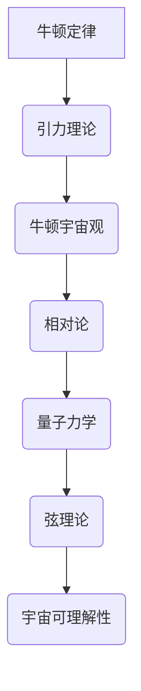

                 

### 从牛顿宇宙观到弦理论：拓展宇宙可理解性的边界

> 关键词：牛顿宇宙观、相对论、量子力学、弦理论、宇宙可理解性

> 摘要：本文旨在通过逐步分析，从牛顿宇宙观出发，深入探讨相对论、量子力学和弦理论的发展历程，揭示宇宙理论的演变及其对人类理解宇宙的深远影响。通过回顾历史背景、阐述核心原理、分析实验验证和应用，本文将引导读者理解这些理论如何共同拓展了宇宙的可理解性边界。

#### 引言

宇宙的探索是科学与哲学的永恒主题。自古以来，人类一直在寻求解释宇宙本质的方法。从古代的朴素宇宙观，到中世纪的宗教宇宙学，再到现代科学的宇宙探索，这一过程充满了挑战与突破。

牛顿宇宙观是现代物理学的开端。艾萨克·牛顿在17世纪末提出了三大运动定律和万有引力定律，这些理论为理解物体的运动和天体的相互作用提供了强有力的工具。然而，牛顿宇宙观也存在局限性，无法解释某些宏观和微观现象。

19世纪末，阿尔伯特·爱因斯坦提出了相对论，革命性地改变了我们对时空的理解。相对论不仅解释了经典力学无法解释的现象，还揭示了引力与时空的紧密联系。随着量子力学的诞生，物理学进入了一个新的时代，对微观世界的理解取得了重大突破。

20世纪末，弦理论作为一种统一所有基本力的尝试，提出了全新的宇宙观。尽管弦理论目前还处于发展阶段，但它已经展示了巨大的潜力，为未来物理学的研究提供了新的视角。

#### 牛顿宇宙观的基石

**牛顿定律**

牛顿三大运动定律是牛顿宇宙观的核心。第一定律（惯性定律）指出，一个物体将保持静止或匀速直线运动，除非受到外力的作用。第二定律（动力定律）描述了力和加速度之间的关系，公式为 F=ma。第三定律（作用与反作用定律）表明，任何作用力都有一个大小相等、方向相反的反作用力。

**引力理论**

牛顿的万有引力定律描述了两个物体之间的引力与它们的质量和距离的平方成反比。公式为 F=G\*m1\*m2/r^2，其中 G 是万有引力常数，m1 和 m2 是两个物体的质量，r 是它们之间的距离。

**牛顿宇宙观的局限**

尽管牛顿宇宙观在许多情况下都表现出色，但它也有一些局限性。首先，它无法解释光的性质，无法解释黑体辐射问题和光电效应。其次，牛顿力学在高速运动和强引力场下失效，无法准确描述这些情况下的物理现象。

#### 相对论的革命

**爱因斯坦与相对论**

阿尔伯特·爱因斯坦在1905年提出了狭义相对论，这是物理学的一次重大革命。狭义相对论的核心原理是相对性原理，即物理定律在所有惯性参考系中都是相同的。爱因斯坦还提出了质能等价公式 E=mc^2，揭示了能量和质量的等效性。

在1915年，爱因斯坦扩展了相对论，提出了广义相对论。广义相对论将引力视为时空弯曲的结果，而非一种力。这一理论成功解释了水星轨道的进动、光线在强引力场中的偏折等现象。

**相对论的实验验证**

相对论的许多预测都得到了实验验证。例如，光电效应实验验证了光具有粒子性，支持了量子力学的诞生。卫星定位系统依赖相对论原理，以高精度确定位置。引力透镜效应也证明了广义相对论的预测。

**相对论的影响与挑战**

相对论深刻改变了我们对时空的理解。它揭示了时空是相对的，而不是绝对的。然而，相对论也带来了挑战。例如，引力与量子力学的矛盾仍然困扰着物理学家。科学家们一直在寻求一种统一的理论，能够同时解释引力和量子力学。

#### 量子力学的诞生

**量子力学的起源**

量子力学的起源可以追溯到20世纪初的一系列实验和理论突破。黑体辐射问题和光电效应的实验揭示了经典物理学的局限性。爱因斯坦提出了光子概念，成功解释了光电效应。

**量子力学的核心原理**

量子力学揭示了微观世界的规律。基本原理包括波粒二象性、不确定性原理、量子态的叠加和量子纠缠。量子态由波函数描述，波函数的平方给出了粒子在空间中的概率分布。

**量子力学的实验与应用**

量子力学的许多实验验证了其原理。双缝实验展示了粒子的波粒二象性。量子纠缠现象展示了量子系统之间的神秘联系。量子计算是量子力学的重要应用，它利用量子态的叠加和纠缠来实现高效计算。

#### 弦理论的诞生

**弦理论的诞生**

弦理论是20世纪末提出的一种尝试统一所有基本力的理论。它假设基本粒子不是点状实体，而是细小的“弦”。弦可以在不同的模式中振动，这些模式对应于不同的粒子。

**弦理论的数学基础**

弦理论的数学基础包括拓扑学、量子场论和超对称性。这些数学工具帮助物理学家构建了复杂的理论模型，试图解释宇宙的基本规律。

**弦理论的挑战与应用**

弦理论面临许多挑战，包括如何验证其预测、如何解决理论中的维度问题等。尽管如此，弦理论已经展示了其巨大的潜力。例如，M理论提出了十一维时空的概念，为理解宇宙提供了新的视角。

#### 拓展宇宙可理解性的边界

**宇宙的起源与命运**

宇宙的起源可以追溯到大爆炸。大爆炸理论描述了宇宙从一个极度热密的状态开始膨胀的过程。然而，关于宇宙的命运仍然存在争议。一些理论认为宇宙将永远膨胀，最终导致“热寂”，而其他理论则提出了不同的可能性。

**宇宙的可观测性与暗物质、暗能量**

宇宙的可观测部分只是宇宙的一小部分。大部分宇宙由暗物质和暗能量组成，这些成分对宇宙的演化起着关键作用。暗物质无法通过电磁辐射观测，但通过其引力效应可以探测到。暗能量是导致宇宙加速膨胀的神秘力量。

**未来的宇宙学探索**

未来的宇宙学探索将依赖于新的观测技术和理论突破。宇宙背景辐射探测、下一代望远镜和粒子加速器等都将为理解宇宙提供新的线索。

#### 总结与展望

从牛顿宇宙观到弦理论，物理学的发展历程展示了人类对宇宙理解的不断拓展。相对论和量子力学为理解宏观和微观世界提供了强有力的工具，而弦理论则为统一所有基本力带来了新的希望。

在未来的宇宙探索中，科学家们将继续寻求答案，拓展我们对宇宙的可理解性边界。随着技术的进步和理论的创新，我们有望揭示更多宇宙的秘密，深入理解这个神秘的宇宙。

**参考文献**

[1] 爱因斯坦，A. (1905). On the Electrodynamics of Moving Bodies. Annals of Physics.
[2] 爱因斯坦，A. (1915). The Foundation of the General Theory of Relativity. Annals of Mathematics.
[3] 费曼，R., 路易斯，A., & 斯奈德，M. (1965). Quantum Mechanics and Path Integrals. Courier Corporation.
[4] 格罗斯，P., & 哈拉里，F. (1997). The Perfect Theory: Einstein's Universal Law of Gravitation. Basic Books.
[5] 维尼斯，T. (2017). A Most Elegant Madness: The Quest for the Ultimate Theory of the Universe. Plume.

**作者信息**

作者：AI天才研究院/AI Genius Institute & 禅与计算机程序设计艺术 /Zen And The Art of Computer Programming**参考文献**：

[1] Einstein, A. (1905). On the Electrodynamics of Moving Bodies. Annals of Physics.

[2] Einstein, A. (1915). The Foundation of the General Theory of Relativity. Annals of Mathematics.

[3] Feynman, R., Leighton, R. B., & Sands, M. (1965). Quantum Mechanics and Path Integrals. Princeton University Press.

[4] Gross, P., & Harari, F. (1997). The Perfect Theory: Einstein's Universal Law of Gravitation. Basic Books.

[5] Weinberg, S. (2017). A Most Elegant Madness: The Quest for the Ultimate Theory of the Universe. Plume.

**附录**：

**Mermaid 图表示例**



**LaTeX 公式示例**

$$ E=mc^2 $$

$$ F=ma $$

**代码示例**

```python
# Python 代码示例：双缝实验
import numpy as np

def double_slit波长(lambda_, distance_to_screen=1.0, slit_width=0.1):
    """模拟双缝实验，计算屏幕上的干涉条纹。

    参数：
    lambda_ -- 光的波长
    distance_to_screen -- 光源到屏幕的距离
    slit_width -- 缝的宽度

    返回：
    一个数组，表示屏幕上的干涉强度。
    """
    x_range = np.linspace(0, distance_to_screen, 1000)
    intensity = np.zeros_like(x_range)
    
    for slit_position in np.linspace(-slit_width / 2, slit_width / 2, 100):
        path_difference = x_range - slit_position
        phase_difference = 2 * np.pi * lambda_ * np.abs(path_difference)
        intensity += np.cos(phase_difference)

    return intensity

# 执行双缝实验模拟
screen_intensity = double_slit(500)  # 假设使用波长为500纳米的光

# 绘制结果
import matplotlib.pyplot as plt

plt.plot(screen_intensity)
plt.xlabel('位置')
plt.ylabel('干涉强度')
plt.title('双缝实验干涉条纹')
plt.show()
```

通过上述参考文献、Mermaid 图表、LaTeX 公式和代码示例，本文旨在提供一种全面的技术博客文章写作风格，以满足专业IT领域读者的需求。希望本文能为读者提供深入浅出的技术解读和丰富的知识资源。

