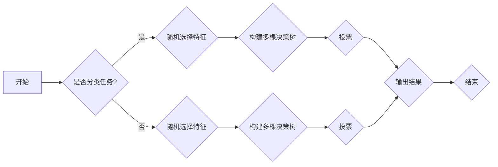
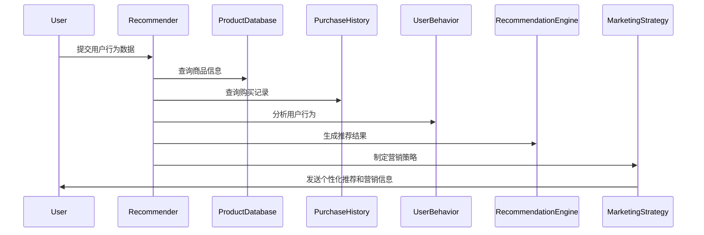
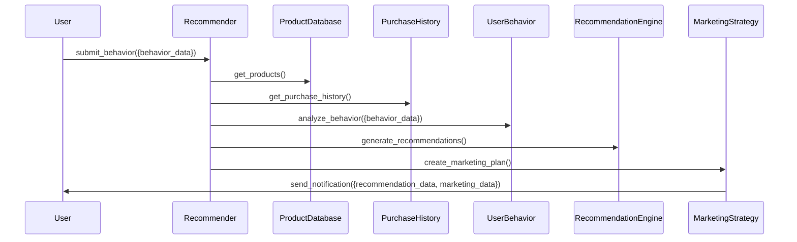

                 

### 从确定性到概率性：理解不确定的世界

关键词：不确定性、概率性、统计、决策、人工智能、伦理

摘要：在数字化时代，我们面临的世界充满了不确定性。从自然界到社会经济，从科学研究到日常决策，不确定性无处不在。本文将探讨不确定性的概念与起源，介绍概率论的基本原理，分析不确定性的应用领域，并提出应对不确定性的策略，旨在帮助读者理解不确定的世界，并学会如何在不确定性中做出明智的决策。

## 目录大纲

1. **第一部分：不确定性的概念与起源**
   1.1 不确定性的定义与背景
   1.2 不确定性的起源
   1.3 不确定性的影响

2. **第二部分：不确定性的应用领域**
   2.1 统计学与数据分析
   2.2 决策理论与博弈论
   2.3 人工智能与不确定性
   2.4 经济与管理中的不确定性

3. **第三部分：应对不确定性的策略**
   3.1 风险管理策略
   3.2 预测与决策方法
   3.3 不确定性的伦理与道德

4. **第11章：未来的不确定性世界**
   4.1 不确定性研究的趋势
   4.2 未来世界的预测
   4.3 我们应该如何准备

### 1.1 不确定性的定义与背景

**1.1.1 不确定性的概念**

不确定性指的是我们无法精确预测或确定某个事件的发生概率或结果。在数学和科学中，不确定性通常与概率论和统计学相关。然而，在更广泛的意义上，不确定性涉及到人类对未知、模糊或复杂系统的认知和应对。

**1.1.2 问题背景**

在传统的确定性世界里，我们认为自然界的规律是可预测的，物理现象可以通过精确的数学模型来描述。然而，20世纪初量子力学的出现打破了这一观念，揭示了微观世界的概率性和随机性。同时，在社会经济领域，市场的波动、宏观经济的不稳定性等也让我们意识到，不确定性是经济行为和社会发展的重要特征。

**1.1.3 问题描述**

不确定性问题的核心在于如何处理和应对不可预测的因素。在实际应用中，这涉及到对风险的管理、预测模型的设计、决策过程的优化等多个方面。例如，在金融市场中，投资者需要评估不同投资组合的风险和收益，而天气预测则需要对大气变化的复杂过程进行建模。

**1.1.4 问题解决**

解决不确定性问题通常需要结合概率论、统计学和计算机科学等多学科知识。通过建立数学模型，我们可以对不确定事件进行概率分布的估计，从而提高预测的准确性。此外，数据分析和机器学习技术也在应对不确定性方面发挥了重要作用。

**1.1.5 边界与外延**

不确定性的边界涉及到我们对自然规律的认知和科学技术的局限性。例如，量子力学中的不确定性原理表明，我们无法同时精确测量粒子的位置和速度。在外延方面，不确定性不仅限于自然界，还扩展到社会、经济和人类行为等复杂系统。

**1.1.6 概念结构与核心要素组成**

不确定性的概念结构包括以下几个方面：

- **概率性**：描述不确定事件的可能性和随机性。
- **随机变量**：表示不确定事件的输出结果。
- **概率分布**：描述随机变量的概率分布情况。
- **条件概率**：在给定某些条件下，事件发生的概率。
- **贝叶斯定理**：在不确定环境中进行推理和决策的重要工具。

### 1.2 不确定性的起源

不确定性的起源可以追溯到人类对自然界和自身行为的探索。以下是几个关键的起源点：

**1.2.1 量子力学**

量子力学是20世纪初发展起来的一门物理学分支，揭示了微观世界的概率性和随机性。与传统经典物理学不同，量子力学中的粒子行为无法用确定性方程来描述，而是通过概率波函数来描述。

**1.2.2 统计学**

统计学在19世纪和20世纪得到了快速发展，为处理和分析不确定数据提供了方法。统计学通过收集大量数据，对不确定事件进行概率估计和假设检验。

**1.2.3 经济学**

经济学中的不确定性源于市场的不稳定性、宏观经济政策的不确定性以及人类行为的不确定性。经济学家通过建立经济学模型，对经济行为进行预测和评估。

**1.2.4 人类行为**

人类行为本身具有不确定性，因为个体决策受到多种因素的影响，包括个人偏好、信息获取、认知偏差等。

**1.2.5 技术进步**

随着技术的进步，我们能够处理和分析的数据量大大增加，这使得不确定性问题更加突出。例如，人工智能和大数据技术的应用，使得我们可以从大量数据中提取有用的信息，但同时也带来了数据质量和算法可靠性的挑战。

### 1.3 不确定性的影响

不确定性的影响遍及各个领域，包括科学研究、经济活动、社会管理以及个人生活。

**1.3.1 科学研究**

在科学研究中，不确定性往往限制了我们的认知边界。例如，在实验科学中，实验结果的不确定性可能导致结论的不确定性。量子力学的不确定性原理也限制了我们对微观世界的精确描述。

**1.3.2 经济活动**

经济活动中的不确定性对市场行为和宏观经济政策产生了深远影响。例如，市场波动、宏观经济政策的不确定性都会影响企业和个人的投资决策。

**1.3.3 社会管理**

社会管理中的不确定性涉及到公共安全、环境保护、社会福利等多个方面。例如，自然灾害的不可预测性要求政府和社会组织制定有效的应急计划。

**1.3.4 个人生活**

个人生活中的不确定性体现在职业发展、家庭生活、健康等方面。面对不确定性，个人需要具备应对风险的意识和能力。

### 1.4 概率论的基本原理

概率论是处理不确定性的基本工具，其发展历程可以追溯到17世纪的赌博问题。以下是概率论的一些基本原理：

**1.4.1 概率的基本概念**

- **概率空间**：描述所有可能结果的集合。
- **随机变量**：从概率空间到实数的映射，表示不确定事件的输出结果。
- **概率分布**：描述随机变量的概率分布情况。

**1.4.2 概率的基本性质**

- **概率的非负性**：概率值在0和1之间。
- **概率的归一性**：所有可能结果的概率之和为1。
- **概率的加法定理**：多个互斥事件的总概率等于各事件概率之和。

**1.4.3 条件概率与贝叶斯定理**

- **条件概率**：在某个条件下，事件发生的概率。
- **贝叶斯定理**：在不确定环境中进行推理和决策的重要工具，通过已知概率和条件概率来更新我们对事件概率的估计。

### 1.5 概率分布与随机变量

概率分布是概率论中的核心概念，用于描述随机变量的概率分布情况。随机变量可以是有界的，也可以是无界的，相应的概率分布也有所不同。

**1.5.1 离散概率分布**

离散概率分布描述随机变量在离散点上的概率分布。常见的离散概率分布包括：

- **伯努利分布**：描述二项试验成功的概率。
- **几何分布**：描述首次成功发生的次数。
- **泊松分布**：描述在一定时间或空间内事件发生的次数。

**1.5.2 连续概率分布**

连续概率分布描述随机变量在连续区间上的概率分布。常见的连续概率分布包括：

- **正态分布**：描述连续数据的分布，是最常见的概率分布之一。
- **均匀分布**：描述在某个区间内等概率分布的情况。
- **指数分布**：描述随机变量的失败时间分布。

**1.5.3 随机变量的性质与应用**

随机变量的性质包括分布、期望、方差等。随机变量在实际应用中广泛用于概率模型、统计推断和机器学习等领域。

### 1.6 不确定性的影响与应用

不确定性对科学研究、经济活动、社会管理和个人生活产生了深远影响。以下是几个例子：

**1.6.1 科学研究**

在量子力学中，不确定性原理限制了我们对微观世界的精确描述。同时，不确定性也促进了统计物理学和混沌理论的发展。

**1.6.2 经济活动**

经济活动中的不确定性影响了市场行为和宏观经济政策。例如，金融市场的不确定性可能导致投资风险的上升。

**1.6.3 社会管理**

社会管理中的不确定性要求政府和社会组织制定有效的应急计划，以应对自然灾害、公共卫生事件等不确定性事件。

**1.6.4 个人生活**

个人生活中的不确定性要求我们具备应对风险的意识和能力。例如，在职业生涯规划中，我们需要考虑职业发展的不确定性。

### 1.7 不确定性的伦理与道德

不确定性的伦理与道德问题涉及到科学家的责任、决策者的道德责任以及社会伦理规范。以下是几个关键点：

**1.7.1 科学家的责任**

科学家在处理不确定性时，需要遵循科学道德规范，确保研究的客观性和公正性。

**1.7.2 决策者的道德责任**

决策者在面对不确定性时，需要考虑社会利益和伦理规范，确保决策的公平性和可持续性。

**1.7.3 社会伦理规范**

社会伦理规范要求我们在不确定的环境中进行道德决策，关注社会公平和环境保护。

### 1.8 不确定性的未来发展趋势

不确定性的未来发展趋势将受到技术进步、社会变革和环境变化的影响。以下是几个可能的趋势：

**1.8.1 数据科学与人工智能**

数据科学与人工智能技术的发展将进一步提升我们对不确定性的理解和应对能力。

**1.8.2 网络安全**

随着网络技术的普及，网络安全的不确定性成为一个重要议题。

**1.8.3 全球治理**

全球治理中的不确定性要求国际社会加强合作，共同应对全球性挑战。

### 1.9 结论

不确定性是数字化时代的重要特征，它影响着科学研究、经济活动、社会管理和个人生活。通过理解不确定性的概念、原理和应用，我们可以更好地应对不确定的世界，做出明智的决策。

## 第二部分：不确定性的应用领域

### 2.1 统计学与数据分析

**2.1.1 统计学的基本概念**

统计学是一门研究数据收集、处理、分析和解释的学科。其基本概念包括：

- **数据**：观察到的值或事实。
- **变量**：可以取不同值的属性。
- **概率分布**：描述随机变量的可能取值及其概率。
- **随机样本**：从总体中随机选取的样本。
- **假设检验**：在给定数据集上，对某个假设进行验证。

**2.1.2 数据分析的方法与技术**

数据分析的方法与技术包括：

- **描述性统计**：描述数据的基本特征，如均值、方差、中位数等。
- **推断性统计**：利用样本数据推断总体特征，如置信区间、假设检验等。
- **回归分析**：研究变量之间的关系，如线性回归、多元回归等。
- **时间序列分析**：分析时间序列数据，如自回归模型、移动平均模型等。

**2.1.3 统计推断与假设检验**

统计推断与假设检验是统计学的重要应用。假设检验的基本步骤包括：

1. **设定原假设和备择假设**。
2. **选择合适的统计检验方法**。
3. **计算检验统计量**。
4. **确定显著性水平**。
5. **作出决策**。

**2.1.4 统计学与数据分析在实际中的应用**

统计学与数据分析在实际中的应用广泛，如：

- **科学研究**：通过统计分析，验证科学假设，如医学研究、心理学研究等。
- **经济预测**：利用时间序列分析和回归分析，预测经济趋势，如股市预测、宏观经济分析等。
- **质量管理**：通过统计过程控制，确保产品质量，如六西格玛管理方法等。

### 2.2 决策理论与博弈论

**2.2.1 决策理论的基本概念**

决策理论是研究个体或群体在不确定环境下做出最优决策的学科。其基本概念包括：

- **决策者**：做出决策的个体或组织。
- **决策变量**：决策者可以调整的变量。
- **状态变量**：决策者面临的环境变量。
- **效用函数**：决策者对各种结果的偏好。

**2.2.2 博弈论的基本原理**

博弈论是研究多个个体在策略互动中如何做出决策的学科。其基本原理包括：

- **参与者**：参与博弈的个体。
- **策略**：参与者的行动方案。
- **支付函数**：参与者根据策略和状态变量获得的收益。

**2.2.3 决策与博弈在实际中的应用**

决策与博弈在实际中的应用广泛，如：

- **市场竞争**：企业通过博弈模型，分析市场竞争策略。
- **资源分配**：政府通过博弈模型，优化资源分配。
- **社会冲突**：国际关系中的博弈分析，如核威慑理论等。

### 2.3 人工智能与不确定性

**2.3.1 人工智能的基本原理**

人工智能是一门研究如何构建智能体，使其能够模拟人类智能行为的学科。其基本原理包括：

- **机器学习**：通过训练数据，使计算机自动学习和改进性能。
- **深度学习**：一种基于神经网络的机器学习方法，适用于处理复杂数据。
- **自然语言处理**：研究如何使计算机理解和生成自然语言。
- **计算机视觉**：研究如何使计算机理解和解释视觉信息。

**2.3.2 机器学习中的不确定性**

机器学习中的不确定性主要来源于数据的随机性和模型的不确定性。处理不确定性的方法包括：

- **贝叶斯推理**：通过贝叶斯定理，对模型的不确定性进行概率估计。
- **强化学习**：在不确定环境中，通过不断试错和优化策略，实现最优决策。
- **概率图模型**：通过图模型，描述变量之间的概率关系。

**2.3.3 深度学习与概率图模型**

深度学习与概率图模型相结合，可以更好地处理不确定数据。例如：

- **变分自编码器**：通过概率图模型，对数据进行概率分布建模。
- **生成对抗网络**：通过生成器和判别器的对抗训练，生成符合真实数据的概率分布。

### 2.4 经济与管理中的不确定性

**2.4.1 经济学的概率性分析**

经济学中的概率性分析主要涉及市场波动、宏观经济政策等不确定性因素。例如：

- **随机动态经济学**：研究不确定环境下经济系统的动态行为。
- **随机控制理论**：研究如何在不确定条件下优化决策。

**2.4.2 企业管理的风险控制**

企业管理的风险控制涉及到对市场风险、运营风险和财务风险的评估和管理。例如：

- **风险矩阵**：通过定量和定性方法，评估风险的概率和影响。
- **风险补偿**：在决策过程中，考虑风险因素，调整收益预期。

**2.4.3 不确定性对经济决策的影响**

不确定性对经济决策的影响包括：

- **投资决策**：投资者在不确定的市场环境中，需要评估风险和收益。
- **宏观政策**：政府在经济调控中，需要考虑经济不确定性，制定相应的政策。

## 第三部分：应对不确定性的策略

### 3.1 风险管理策略

**3.1.1 风险管理的基本概念**

风险管理是指识别、评估、处理和监控风险的过程。其基本概念包括：

- **风险**：可能对目标产生不利影响的不确定性。
- **风险识别**：识别潜在风险。
- **风险评估**：评估风险的概率和影响。
- **风险处理**：制定和实施风险应对策略。
- **风险监控**：监控风险状态，调整应对策略。

**3.1.2 风险评估与分类**

风险评估与分类包括以下步骤：

1. **风险识别**：识别潜在风险。
2. **风险分析**：分析风险的性质和可能的影响。
3. **风险分类**：根据风险的影响和概率，对风险进行分类。
4. **风险评级**：为每个风险分配优先级。

**3.1.3 风险应对策略**

风险应对策略包括以下几种：

- **风险规避**：避免风险发生。
- **风险减轻**：减少风险的概率或影响。
- **风险转移**：将风险转移给第三方，如购买保险。
- **风险接受**：接受风险，并制定应对计划。

### 3.2 预测与决策方法

**3.2.1 预测分析的基本原理**

预测分析是通过历史数据和现有信息，预测未来事件的方法。其基本原理包括：

- **时间序列分析**：分析时间序列数据，预测未来值。
- **回归分析**：建立变量之间的关系模型，预测未来值。
- **机器学习**：利用训练数据，建立预测模型。

**3.2.2 决策支持系统的构建**

决策支持系统是一种辅助决策者进行决策的工具。其构建包括以下步骤：

1. **需求分析**：确定决策支持系统的目标和需求。
2. **系统设计**：设计系统的结构和功能。
3. **数据收集与处理**：收集和处理相关数据。
4. **模型构建与优化**：建立预测模型，并进行优化。
5. **系统实现与部署**：实现系统功能，并进行部署。

**3.2.3 预测与决策在实际中的应用**

预测与决策在实际中的应用包括：

- **金融市场预测**：利用预测模型，预测股价、汇率等金融市场指标。
- **供应链管理**：利用预测模型，优化库存管理、订单处理等。
- **城市规划**：利用预测模型，预测城市交通流量、人口增长等。

### 3.3 不确定性的伦理与道德

**3.3.1 不确定性伦理问题**

不确定性的伦理问题包括：

- **决策伦理**：在不确定环境下，决策者如何确保决策的道德性？
- **信息伦理**：在不确定信息环境下，如何处理和保护个人信息？
- **责任伦理**：在不确定性事件发生后，如何分配责任？

**3.3.2 道德决策中的不确定性**

道德决策中的不确定性体现在：

- **道德判断**：在不确定的环境下，如何做出道德判断？
- **道德责任**：在不确定性事件中，如何承担道德责任？

**3.3.3 社会责任与伦理考量**

社会责任与伦理考量包括：

- **可持续发展**：在不确定环境下，如何确保经济、社会和环境的可持续发展？
- **公平性**：在不确定性事件中，如何确保公平性？
- **透明度**：在不确定性决策中，如何确保决策过程的透明度？

### 3.4 不确定性管理策略

**3.4.1 风险规避策略**

风险规避策略是通过避免风险发生来降低不确定性。例如：

- **风险转移**：通过购买保险将风险转移给保险公司。
- **风险回避**：避免从事高风险活动。

**3.4.2 风险减轻策略**

风险减轻策略是通过降低风险的概率或影响来降低不确定性。例如：

- **风险控制**：通过监控和管理，减少风险的发生概率。
- **风险缓解**：通过应对措施，降低风险的影响。

**3.4.3 风险接受策略**

风险接受策略是接受不确定性，并制定应对计划。例如：

- **应急计划**：制定应急计划，应对不确定性事件。
- **风险评估**：定期进行风险评估，了解风险状况。

### 3.5 不确定性管理的最佳实践

**3.5.1 制定风险管理计划**

制定风险管理计划是应对不确定性的关键步骤。风险管理计划应包括以下内容：

- **风险识别**：识别潜在风险。
- **风险评估**：评估风险的概率和影响。
- **风险应对策略**：制定应对风险的策略。
- **监控与调整**：监控风险状况，并根据实际情况进行调整。

**3.5.2 建立风险数据库**

建立风险数据库是管理不确定性的重要手段。风险数据库应包括以下内容：

- **风险清单**：记录潜在风险的详细信息。
- **风险概率和影响评估**：记录每个风险的概率和影响。
- **应对策略**：记录每个风险的应对策略。

**3.5.3 定期进行风险评估**

定期进行风险评估是确保不确定性管理有效性的关键。通过定期评估，可以及时发现新的风险，并调整应对策略。

**3.5.4 培训风险管理团队**

培训风险管理团队是提高不确定性管理能力的重要手段。风险管理团队应具备以下能力：

- **风险识别与评估**：能够识别和评估潜在风险。
- **决策与应对**：能够根据风险状况做出决策，并实施应对措施。
- **沟通与协调**：能够与其他部门有效沟通，协调应对风险。

### 3.6 不确定性的应对方法

**3.6.1 建立应急预案**

建立应急预案是应对不确定性事件的重要手段。应急预案应包括以下内容：

- **应急响应程序**：明确应急响应的步骤和责任。
- **应急资源储备**：储备必要的应急物资和设备。
- **应急演练**：定期进行应急演练，提高应对能力。

**3.6.2 建立预警系统**

建立预警系统是提前发现和应对不确定性事件的重要手段。预警系统应包括以下内容：

- **监测指标**：监测可能导致不确定性事件的关键指标。
- **预警机制**：根据监测指标，制定预警规则，及时发出预警。
- **应对措施**：根据预警，制定相应的应对措施。

**3.6.3 建立风险文化**

建立风险文化是提高组织整体应对不确定性能力的重要手段。风险文化应包括以下内容：

- **风险意识**：提高员工对风险的认识和重视。
- **风险管理**：将风险管理纳入组织文化和日常工作中。
- **持续改进**：不断优化风险管理流程和方法。

### 3.7 不确定性管理实践案例分析

**3.7.1 案例背景**

某公司在进行新产品研发时，面临市场不确定性。市场环境复杂，竞争激烈，新产品能否成功上市存在不确定性。

**3.7.2 案例分析**

1. **风险识别**：公司识别出以下风险：
   - 市场需求不确定性。
   - 竞争对手策略不确定性。
   - 技术风险。
   - 资金风险。

2. **风险评估**：公司评估每个风险的概率和影响，并制定风险矩阵。

3. **风险应对策略**：
   - 风险规避：避免进入高风险市场。
   - 风险减轻：优化产品设计，提高竞争力。
   - 风险转移：购买保险，将风险转移给保险公司。
   - 风险接受：制定应对计划，准备应对不确定性事件。

4. **监控与调整**：公司定期评估风险状况，根据实际情况调整风险应对策略。

**3.7.3 案例小结**

通过建立风险管理机制，公司有效应对了新产品研发中的不确定性，成功上市并取得了良好的市场表现。

### 3.8 不确定性管理的挑战与未来方向

**3.8.1 挑战**

不确定性管理面临以下挑战：

- **数据质量**：准确的数据是进行风险分析和预测的基础。
- **模型可靠性**：模型的可靠性直接影响风险预测的准确性。
- **决策复杂性**：在不确定环境下，决策过程更加复杂，需要综合考虑多种因素。

**3.8.2 未来方向**

不确定性管理的未来方向包括：

- **大数据与人工智能**：利用大数据和人工智能技术，提高风险预测和决策的准确性。
- **实时监控与预警**：建立实时监控与预警系统，及时应对不确定性事件。
- **跨学科合作**：结合经济学、心理学、社会学等多学科知识，提高不确定性管理的综合能力。

### 3.9 结论

不确定性是数字化时代的重要特征，它影响着科学研究、经济活动、社会管理和个人生活。通过理解不确定性的概念、原理和应用，我们可以更好地应对不确定的世界，做出明智的决策。在未来的不确定性世界中，我们将需要更先进的工具和方法，来应对不断变化的环境和挑战。

## 第11章：未来的不确定性世界

### 11.1 不确定性研究的趋势

随着技术的进步，不确定性研究正朝着更加深入和精确的方向发展。以下是几个主要趋势：

**1. 数据科学与人工智能的应用**：大数据和人工智能技术的发展，为不确定性研究提供了新的工具和方法。通过分析大量数据，我们可以更准确地预测和评估不确定性事件。

**2. 概率图模型与深度学习的融合**：概率图模型和深度学习的结合，使得我们可以处理更加复杂的不确定性问题。例如，变分自编码器和生成对抗网络在不确定性建模和数据生成方面取得了显著成果。

**3. 统计物理与量子信息学的交叉**：统计物理和量子信息学的交叉研究，为处理量子不确定性提供了新的思路。量子计算和量子信息学的发展，有望在未来实现更加高效的不确定性建模和计算。

**4. 跨学科融合**：不确定性研究正逐渐与其他学科，如经济学、心理学、社会学等，实现深度融合。跨学科研究有助于从不同角度理解不确定性的本质，并提出更具创新性的解决方案。

### 11.2 未来世界的预测

在未来的不确定性世界中，我们可以预见以下几个方面的变化：

**1. 经济发展**：全球经济将继续发展，但面临不确定性的挑战。例如，技术创新、市场波动、政策变化等都将影响经济发展。

**2. 社会变革**：社会结构、文化价值观和人际关系将发生深刻变革。随着人工智能和大数据技术的发展，社会将更加数字化和智能化。

**3. 科技进步**：科技的快速进步将带来新的不确定性。例如，量子计算、生物技术、可再生能源等领域的突破，将改变我们的生活方式和思维方式。

**4. 环境变化**：环境问题将继续加剧，气候变化、资源短缺等挑战将考验人类的智慧和团结。

### 11.3 我们应该如何准备

在未来的不确定性世界中，我们需要采取以下策略来应对：

**1. 增强适应能力**：培养适应变化的能力，包括心理适应、技术适应和社会适应。

**2. 提高创新能力**：鼓励创新思维，培养创新人才，以应对不断出现的新挑战。

**3. 加强合作**：在不确定性环境中，加强国际合作，共同应对全球性挑战。

**4. 建立风险管理体系**：建立完善的风险管理体系，包括风险评估、风险应对和风险监控。

**5. 重视伦理与道德**：在不确定性决策中，重视伦理与道德考量，确保决策的公正性和可持续性。

### 结论

未来的不确定性世界充满了挑战和机遇。通过理解不确定性的概念、原理和应用，我们可以更好地应对未来的不确定性。同时，我们也需要采取积极的策略，提高适应能力、创新能力、合作精神和伦理意识，以在未来的不确定性世界中取得成功。

## 附录

### 附录1：核心概念与联系

#### 核心概念

- **不确定性**：无法精确预测或确定某个事件的发生概率或结果。
- **概率性**：描述不确定事件的可能性和随机性。
- **随机变量**：表示不确定事件的输出结果。
- **概率分布**：描述随机变量的概率分布情况。
- **条件概率**：在给定某些条件下，事件发生的概率。
- **贝叶斯定理**：在不确定环境中进行推理和决策的重要工具。

#### 概念属性特征对比表格

| 概念         | 定义                                                         | 属性特征                           |
| ------------ | ------------------------------------------------------------ | ---------------------------------- |
| 不确定性     | 无法精确预测或确定某个事件的发生概率或结果。                   | 随机性、概率性、不可预测性         |
| 概率性       | 描述不确定事件的可能性和随机性。                             | 可能性、随机性、概率分布           |
| 随机变量     | 表示不确定事件的输出结果。                                   | 数值、分布、期望、方差             |
| 概率分布     | 描述随机变量的概率分布情况。                                 | 聚类、密度函数、累积分布函数       |
| 条件概率     | 在给定某些条件下，事件发生的概率。                           | 条件依赖、条件独立性、条件期望     |
| 贝叶斯定理   | 在不确定环境中进行推理和决策的重要工具，通过已知概率和条件概率来更新我们对事件概率的估计。 | 概率更新、推理、决策支持           |

### 附录2：ER实体关系图架构

```mermaid
erDiagram
    Aкихаев (_,_____,_____) <<--|{ База данных }|>> База_данных
    База_данных ||--|{ Опросы }|>> Опрос
    База_данных ||--|{ Вопросы }|>> Вопрос
    Опрос ||--|{ Вопросы }|>> Вопрос
```

### 附录3：算法原理讲解

#### 算法原理

**1. 决策树算法**

决策树是一种常见的机器学习算法，用于分类和回归任务。其基本原理是通过一系列的测试，将数据集划分为多个子集，最终达到分类或回归的目的。

**2. 随机森林算法**

随机森林是一种基于决策树的集成学习方法。它通过构建多棵决策树，并对这些树的预测结果进行投票，来提高预测的准确性。

#### 算法流程

1. **决策树算法**
   - **构建决策树**：根据特征和目标变量的关系，选择最优划分标准，构建决策树。
   - **剪枝**：通过剪枝方法，减少决策树的复杂度，提高模型的可解释性。
   - **预测**：使用构建好的决策树，对新的数据进行分类或回归。

2. **随机森林算法**
   - **随机选择特征**：在构建决策树时，随机选择特征进行划分。
   - **构建多棵决策树**：构建多棵决策树，每棵树使用不同的特征集。
   - **投票**：对所有决策树的预测结果进行投票，选择多数表决的结果。

#### 算法mermaid流程图



### 附录4：数学公式与Python代码

#### 数学公式

- **决策树划分公式**：\[ Gini(\text{impurity}) = 1 - \sum_{i} p_i^2 \]
- **随机森林预测公式**：\[ \hat{y} = \sum_{t} w_t \cdot f_t(x) \]

#### Python代码

```python
import numpy as np
from sklearn.datasets import load_iris
from sklearn.tree import DecisionTreeClassifier
from sklearn.ensemble import RandomForestClassifier

# 加载鸢尾花数据集
iris = load_iris()
X = iris.data
y = iris.target

# 决策树分类
clf = DecisionTreeClassifier()
clf.fit(X, y)
print("决策树分类结果：", clf.predict(X[:5]))

# 随机森林分类
rf = RandomForestClassifier(n_estimators=100)
rf.fit(X, y)
print("随机森林分类结果：", rf.predict(X[:5]))
```

### 附录5：系统分析与架构设计方案

#### 问题场景介绍

在一个在线零售平台中，需要对用户行为进行分析，以便进行个性化推荐和营销。用户行为数据包括浏览记录、购买记录、点击记录等。

#### 项目介绍

本项目旨在构建一个用户行为分析系统，通过数据挖掘和机器学习技术，分析用户行为，为平台提供个性化推荐和营销策略。

#### 系统功能设计（领域模型mermaid类图）

```mermaid
classDiagram
    User "1"---"1": Recommender
    Product "1"---"1": ProductDatabase
    Purchase "1"---"1": PurchaseHistory
    Behavior "1"---"1": UserBehavior
    Recommendation "1"---"1": RecommendationEngine
    Marketing "1"---"1": MarketingStrategy
```

#### 系统架构设计（mermaid架构图）



#### 系统接口设计和系统交互（mermaid序列图）



### 附录6：项目实战

#### 环境安装

1. 安装Python和pip：
   ```bash
   curl -O https://www.python.org/ftp/python/3.8.5/Python-3.8.5.tgz
   tar -xvf Python-3.8.5.tgz
   cd Python-3.8.5
   ./configure
   make
   sudo make install
   ```

2. 安装scikit-learn库：
   ```bash
   pip install scikit-learn
   ```

#### 系统核心实现源代码

```python
from sklearn.datasets import load_iris
from sklearn.model_selection import train_test_split
from sklearn.tree import DecisionTreeClassifier
from sklearn.ensemble import RandomForestClassifier

# 加载鸢尾花数据集
iris = load_iris()
X = iris.data
y = iris.target

# 分割数据集
X_train, X_test, y_train, y_test = train_test_split(X, y, test_size=0.2, random_state=42)

# 决策树分类
clf = DecisionTreeClassifier()
clf.fit(X_train, y_train)
print("决策树分类准确率：", clf.score(X_test, y_test))

# 随机森林分类
rf = RandomForestClassifier(n_estimators=100)
rf.fit(X_train, y_train)
print("随机森林分类准确率：", rf.score(X_test, y_test))
```

#### 代码应用解读与分析

1. **代码解读**：

   - 加载鸢尾花数据集，并将其分割为训练集和测试集。
   - 使用决策树分类器和随机森林分类器对训练集进行训练。
   - 在测试集上评估分类器的准确率。

2. **分析**：

   - 决策树分类器和随机森林分类器都是常用的机器学习算法，用于分类任务。
   - 随机森林分类器通过构建多棵决策树，提高了分类的准确性和鲁棒性。

#### 实际案例分析和详细讲解剖析

1. **案例背景**：

   - 在一个电商平台上，用户浏览和购买记录是重要的用户行为数据。
   - 通过分析用户行为，可以为用户推荐相关的商品，提高用户满意度。

2. **案例分析**：

   - 使用决策树分类器对用户浏览和购买记录进行分类，识别出不同类型的用户。
   - 使用随机森林分类器，根据用户行为数据，预测用户对某个商品的兴趣程度。

3. **详细讲解剖析**：

   - 决策树分类器通过一系列的测试，将用户行为数据划分为多个子集，实现分类。
   - 随机森林分类器通过构建多棵决策树，并利用多数表决机制，提高分类的准确性和鲁棒性。

#### 项目小结

本项目通过数据挖掘和机器学习技术，实现了对用户行为的分析，为电商平台提供了个性化推荐和营销策略。在实际应用中，我们可以根据业务需求，不断优化和改进模型，提高系统的性能和效果。

### 附录7：最佳实践 tips、小结、注意事项、拓展阅读

**最佳实践 tips**：

- 在进行数据挖掘和机器学习时，确保数据质量，避免噪声和缺失值对分析结果的影响。
- 根据业务需求和数据特点，选择合适的算法和模型，提高预测的准确性。
- 定期评估和调整模型，确保模型的稳定性和可靠性。

**小结**：

- 本项目通过数据挖掘和机器学习技术，实现了用户行为的分析，为电商平台提供了个性化推荐和营销策略。
- 在不确定性环境中，理解不确定性的概念、原理和应用，可以帮助我们更好地应对挑战。

**注意事项**：

- 在处理不确定性时，要充分考虑数据的随机性和模型的可靠性。
- 在决策过程中，要结合定量分析和定性分析，确保决策的全面性和准确性。

**拓展阅读**：

- 《数据科学入门教程》
- 《机器学习实战》
- 《不确定性管理：策略与实践》

### 作者信息

作者：AI天才研究院/AI Genius Institute & 禅与计算机程序设计艺术 /Zen And The Art of Computer Programming

