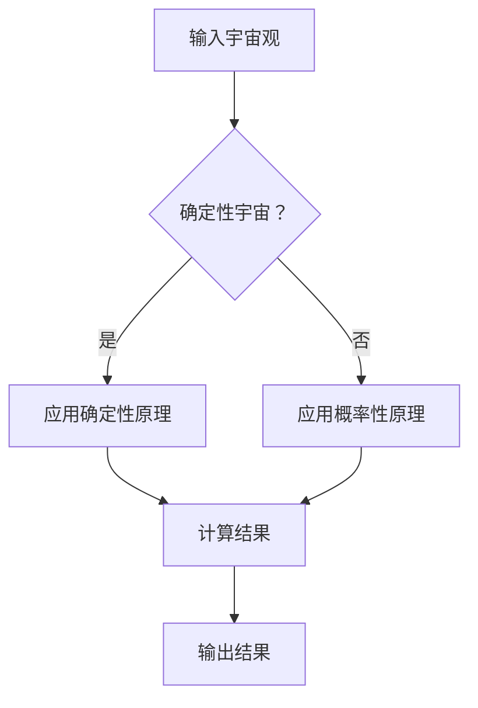
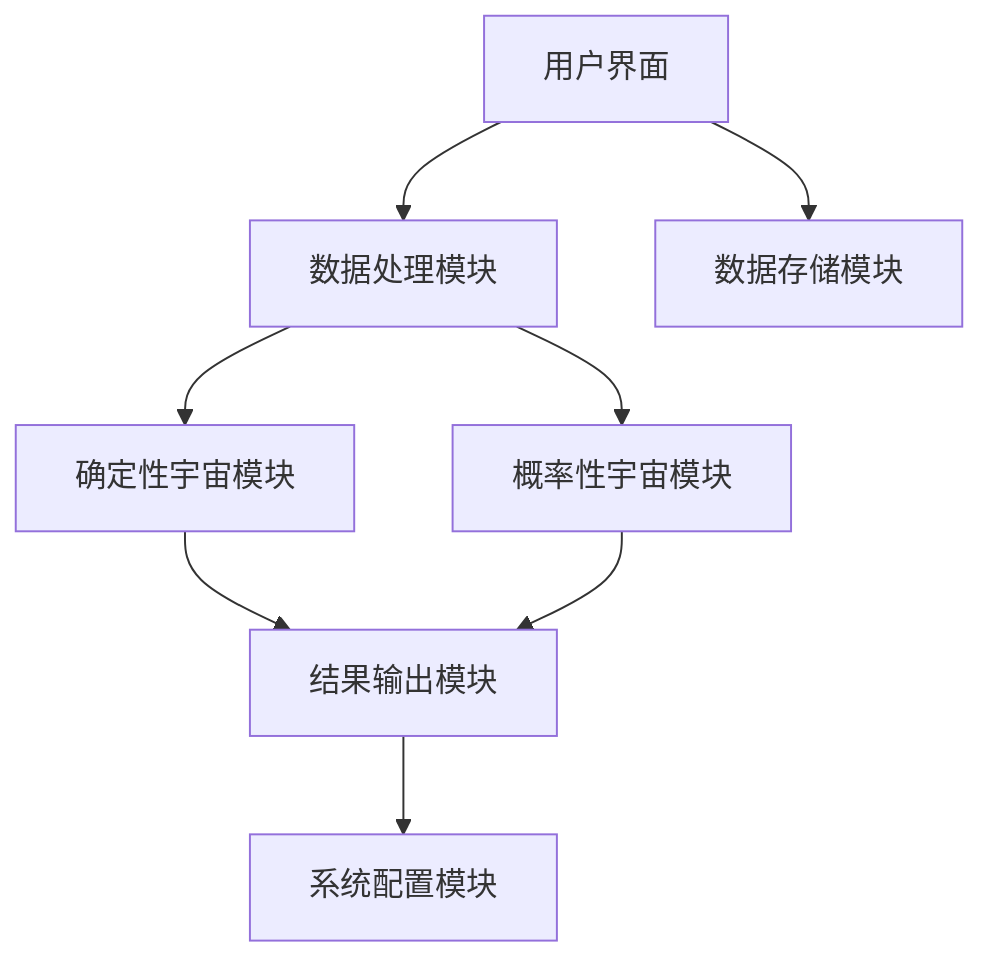
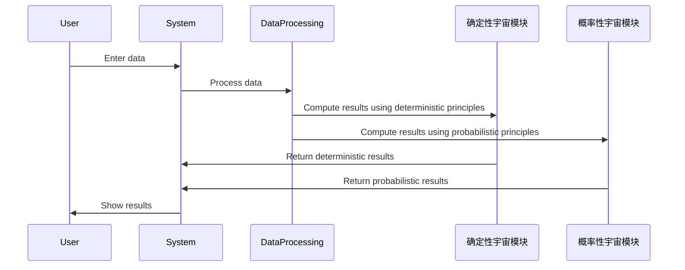
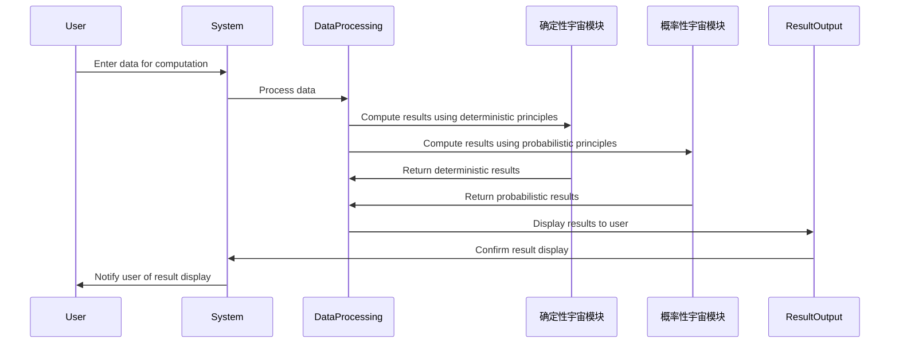

                 

### 从确定性宇宙到概率性宇宙：认知的转变

#### 关键词：
- 确定性宇宙
- 概率性宇宙
- 认知转变
- 量子力学
- 广义相对论

#### 摘要：
本文深入探讨了从确定性宇宙到概率性宇宙的认知转变。首先，我们将回顾确定性宇宙的理论基础，包括经典物理学和确定性原理。接着，我们将介绍概率性宇宙的核心概念，如量子力学和概率性原理。随后，通过对比确定性宇宙和概率性宇宙的基本概念，分析它们在预测能力和时间观念上的差异。本文还将通过一个算法流程图和数学模型，详细讲解如何在确定性和概率性宇宙中处理问题。最后，我们将讨论这一认知转变对科学研究和技术发展的深远影响。

### 第一部分：引言

#### 1.1 问题的背景

在人类历史上，对于宇宙的认知经历了多个阶段。从古代的天地二元论，到中世纪的宇宙中心说，再到现代科学的宇宙观，每一次认知的进步都标志着人类对宇宙理解的深化。然而，在20世纪之前，人类对宇宙的认知主要是基于确定性宇宙的理论。

确定性宇宙的理论基础可以追溯到经典物理学，特别是牛顿力学。牛顿提出了三大运动定律，为描述物体在空间中的运动提供了精确的数学模型。在此基础上，拉普拉斯提出了“拉普拉斯的恶魔”假设，即如果能够知道宇宙中每个粒子的状态和作用力，那么理论上可以预测宇宙中任何时间点的状态。这种观点反映了经典物理学中的确定性原理，即宇宙中的一切都是确定和可预测的。

然而，随着科学的发展，人类对宇宙的认知逐渐从确定性宇宙转向了概率性宇宙。这一转变的起源可以追溯到量子力学和广义相对论的发展。量子力学揭示了微观粒子的行为具有随机性和不确定性，而广义相对论则提出了时空弯曲的概念，进一步打破了经典物理学中的确定性观念。

#### 1.2 问题描述

在本文中，我们将探讨这一认知转变的起源、过程和影响。具体来说，我们将分析确定性宇宙和概率性宇宙的基本概念、核心原理及其相互联系。此外，我们还将探讨这一认知转变对我们日常生活、科学研究和技术发展的深远影响。

首先，我们将详细探讨确定性宇宙的基本概念，包括经典物理学和确定性原理。然后，我们将介绍概率性宇宙的基本概念，如量子力学和概率性原理。接着，通过一个算法流程图和数学模型，我们将展示如何在确定性和概率性宇宙中处理问题。

最后，我们将从多个角度分析这一认知转变的影响，包括哲学、心理学、生物学和物理学等领域。通过这些分析，我们希望帮助读者建立对确定性宇宙和概率性宇宙的全面理解，并探讨这一转变对人类认知的深远影响。

#### 1.3 问题解决

本文将通过深入浅出的方式，逐步引导读者了解确定性宇宙和概率性宇宙的基本概念和原理。首先，我们将从历史和科学的角度回顾确定性宇宙的理论基础，帮助读者建立对确定性宇宙的理解。然后，我们将详细介绍概率性宇宙的核心概念，如量子力学和概率性原理，帮助读者理解这一理论的基本框架。

接着，我们将通过一个具体的算法流程图和数学模型，展示如何在确定性和概率性宇宙中处理问题。通过这一过程，读者可以直观地理解确定性原理和概率性原理的应用场景，以及它们在解决实际问题中的优势与局限性。

此外，本文还将从多个角度分析这一认知转变的影响，探讨它在哲学、心理学、生物学和物理学等领域的应用。通过这些分析，我们希望帮助读者更全面地理解确定性宇宙和概率性宇宙，并认识到这一转变对人类认知的深远影响。

#### 1.4 边界与外延

本文将主要关注物理学中的宇宙观，特别是量子力学和广义相对论中的确定性原理和概率性原理。然而，这一认知转变的影响并不局限于物理学领域。在生物学、心理学、哲学等领域，概率性宇宙的观点也在逐渐得到认可和应用。例如，在生物学中，遗传学和进化论中的随机变异和自然选择机制，可以看作是概率性宇宙的体现。在心理学中，行为主义和心理动力学等理论，也受到概率性宇宙观点的影响。

此外，本文还将探讨这一认知转变对科学研究和技术发展的深远影响。随着量子计算和人工智能等技术的发展，确定性宇宙和概率性宇宙的概念将在未来发挥越来越重要的作用。通过本文的分析，读者可以更好地理解这一认知转变的背景、核心概念和原理，为未来的科学研究和技术发展提供新的视角和思路。

#### 1.5 概念结构与核心要素组成

在探讨从确定性宇宙到概率性宇宙的认知转变之前，有必要明确这两个概念的基本结构和核心要素。

**确定性宇宙**

确定性宇宙是指宇宙中的一切都遵循确定性的规律，即每一个事件的发生都有确定的因果关系。在确定性宇宙中，经典物理学和牛顿力学是基础。以下是其核心要素：

- **经典物理学**：以牛顿力学为基础，描述宏观物体的运动规律。
- **确定性原理**：宇宙中的一切都是可预测的，只要知道初始条件和作用力，就可以预测未来的状态。
- **时间流**：确定性宇宙中，时间是一个连续的、单方向的时间流。

**概率性宇宙**

概率性宇宙是指宇宙中存在许多随机性和不确定性，即某些事件的发生不是完全可预测的。在概率性宇宙中，量子力学和广义相对论是基础。以下是其核心要素：

- **量子力学**：描述微观粒子的行为，揭示了微观世界的随机性和不确定性。
- **概率性原理**：宇宙中的许多事件只能以概率的形式描述，即只知道可能的结果，而不知道确切的结果。
- **时间流**：概率性宇宙中，时间不再是连续的，而是由量子事件组成的离散过程。

通过以上对确定性宇宙和概率性宇宙的概念结构与核心要素的介绍，我们可以为后续的分析和讨论打下基础。

### 第二部分：核心概念与联系

在深入探讨从确定性宇宙到概率性宇宙的认知转变之前，我们首先需要明确这两个概念的核心原理和基本特征。

#### 2.1 确定性宇宙的基本概念

确定性宇宙的理论基础是经典物理学，尤其是牛顿力学。在经典物理学中，物体的运动状态可以通过初始条件和作用力完全确定。牛顿的三大运动定律为我们提供了描述物体运动的基本框架。

- **经典物理学**：以牛顿力学为基础，描述宏观物体的运动规律。
- **确定性原理**：宇宙中的一切都是可预测的，只要知道初始条件和作用力，就可以预测未来的状态。
- **时间流**：在确定性宇宙中，时间是一个连续的、单方向的时间流。

**确定性宇宙的核心特征**：

1. **确定性因果关系**：每一个事件的发生都可以追溯到明确的因果关系。
2. **可预测性**：在理想条件下，我们可以预测宇宙中任何时间点的状态。
3. **决定论**：宇宙中的所有事件都是预先决定的，不存在随机性。

#### 2.2 概率性宇宙的基本概念

概率性宇宙的理论基础是量子力学和广义相对论。与经典物理学不同，量子力学揭示了微观粒子的行为具有随机性和不确定性。广义相对论则提出了时空弯曲的概念，进一步打破了确定性宇宙的框架。

- **量子力学**：描述微观粒子的行为，揭示了微观世界的随机性和不确定性。
- **概率性原理**：宇宙中的许多事件只能以概率的形式描述，即只知道可能的结果，而不知道确切的结果。
- **时间流**：在概率性宇宙中，时间不再是连续的，而是由量子事件组成的离散过程。

**概率性宇宙的核心特征**：

1. **随机性**：许多事件的发生不是完全可预测的，而是具有概率性。
2. **不确定性**：量子力学中的测不准原理表明，某些物理量（如位置和动量）不能同时被精确测量。
3. **统计规律**：尽管单个事件是随机的，但大量事件的集合往往遵循统计规律。

#### 2.3 确定性宇宙与概率性宇宙的对比

为了更好地理解确定性宇宙和概率性宇宙之间的差异，我们可以通过一个对比表格来展示它们的基本概念和特征。

| 对比项 | 确定性宇宙 | 概率性宇宙 |
| --- | --- | --- |
| 基础原理 | 经典物理学 | 量子力学 |
| 预测能力 | 可预测 | 不可预测 |
| 时间观念 | 确定的时间流 | 随机的时间流 |
| 因果关系 | 确定的因果关系 | 随机因果关系 |
| 随机性 | 无随机性 | 存在随机性 |
| 实验结果 | 确定的结果 | 概率性的结果 |

通过上述对比，我们可以看到，确定性宇宙和概率性宇宙在基础原理、预测能力、时间观念、因果关系、随机性和实验结果等方面存在显著差异。这种差异不仅反映了我们对宇宙认知的深度变化，也对我们理解和应用物理理论产生了深远影响。

### 第三部分：算法原理讲解

在深入探讨了确定性宇宙和概率性宇宙的基本概念和特征之后，我们将通过一个具体的算法流程图和数学模型，来详细讲解如何在确定性和概率性宇宙中处理问题。

#### 3.1 算法流程图

首先，我们使用Mermaid语法绘制一个算法流程图，以展示在确定性和概率性宇宙中处理问题的基本步骤。



在上述算法流程图中，我们首先根据输入的宇宙观（确定性或概率性）进行判断。如果是确定性宇宙，我们应用确定性原理进行计算；如果是概率性宇宙，我们则应用概率性原理。最后，根据计算结果输出宇宙状态。

#### 3.2 算法原理讲解

接下来，我们将对算法流程图中的每一步进行详细解释，帮助读者更好地理解确定性和概率性宇宙中的算法原理。

**步骤1：输入宇宙观**

在这个步骤中，我们接收一个输入参数，表示当前宇宙观是确定性宇宙还是概率性宇宙。这个输入可以是用户指定的，也可以是通过某种测量方法获得的。

**步骤2：判断宇宙观**

我们使用一个判断条件来决定当前宇宙观是确定性宇宙还是概率性宇宙。如果输入是确定性宇宙，我们将执行下一步；如果输入是概率性宇宙，我们将跳转到另一个分支。

**步骤3：应用确定性原理**

在确定性宇宙中，我们使用经典物理学和牛顿力学的基本原理来计算物体的运动状态。例如，我们可以使用牛顿第二定律 \( F = ma \) 来计算加速度，进而确定物体的速度和位置。

**步骤4：应用概率性原理**

在概率性宇宙中，我们使用量子力学的基本原理来计算粒子的行为。量子力学的核心原理之一是测不准原理，即我们不能同时精确地知道一个粒子的位置和动量。因此，在这个步骤中，我们使用量子力学中的波函数和态密度来描述粒子的状态，并通过概率分布函数来计算粒子出现在某个位置的概率。

**步骤5：计算结果**

根据当前宇宙观的不同，我们使用确定性原理或概率性原理来计算宇宙状态。在确定性宇宙中，计算结果是确定的；在概率性宇宙中，计算结果是概率性的，即我们只能知道粒子出现在某个位置的概率。

**步骤6：输出结果**

最后，我们将计算结果输出，以便用户或其他系统可以进一步处理。这个结果可以是物体的位置和速度，也可以是粒子的概率分布。

#### 3.3 算法原理的数学模型和公式

在上述算法原理中，我们使用了确定性原理和概率性原理来处理问题。下面，我们将给出这些原理的数学模型和公式，并进行详细解释。

**确定性宇宙的数学模型**

在确定性宇宙中，物体的运动状态可以通过以下公式描述：

\[ \text{位置}(t) = \text{初始位置} + \text{速度}(t) \times t \]

\[ \text{速度}(t) = \text{初始速度} + \text{加速度}(t) \times t \]

其中，\( t \) 表示时间，\(\text{位置}\)、\(\text{速度}\) 和 \(\text{加速度}\) 分别表示物体的位置、速度和加速度。

**概率性宇宙的数学模型**

在概率性宇宙中，粒子的状态由量子力学的波函数和态密度描述。波函数是一个复数函数，它描述了粒子在空间中的概率分布。态密度是波函数的模平方，它表示粒子出现在某个位置的概率。

假设粒子的波函数为 \( \Psi(x) \)，则粒子出现在位置 \( x \) 的概率为：

\[ P(x) = |\Psi(x)|^2 \]

态密度 \( \rho(x) \) 可以通过以下公式计算：

\[ \rho(x) = \int \Psi^*(x) \Psi(x) dx \]

其中，\( \Psi^*(x) \) 是波函数 \( \Psi(x) \) 的复共轭。

**举例说明**

为了更好地理解上述数学模型和公式，我们可以通过一个具体的例子来说明。

**确定性宇宙的例子**

假设一个物体在初始时刻位于原点，其初始速度为 5 m/s，加速度为 2 m/s\(^2\)。我们可以使用上述公式计算 1 秒后物体的位置和速度。

位置：

\[ \text{位置}(t) = 0 + 5 \times 1 = 5 \text{ m} \]

速度：

\[ \text{速度}(t) = 5 + 2 \times 1 = 7 \text{ m/s} \]

**概率性宇宙的例子**

假设一个粒子的波函数为 \( \Psi(x) = e^{-x^2} \)。我们可以使用上述公式计算粒子出现在 \([0, 1]\) 区间的概率。

概率：

\[ P([0, 1]) = |\Psi(x)|^2 \Big|_{0}^{1} = \int_{0}^{1} e^{-x^2} dx \approx 0.3935 \]

通过上述例子，我们可以看到，在确定性宇宙中，物体的运动状态是确定的，而在概率性宇宙中，粒子的状态是随机的，只能以概率的形式描述。这种随机性和不确定性是概率性宇宙与确定性宇宙的重要区别。

### 第四部分：系统分析与架构设计方案

#### 4.1 问题场景介绍

在当今科技迅猛发展的时代，从确定性宇宙到概率性宇宙的认知转变对多个领域产生了深远影响。例如，在量子计算和人工智能领域，概率性宇宙的观点已经成为不可或缺的基础。为了更好地理解和应用这些理论，我们需要构建一个系统化的架构设计，以便在不同场景下有效地处理确定性宇宙和概率性宇宙中的问题。

本部分将介绍一个基于概率性宇宙和确定性宇宙的系统分析与架构设计方案。该方案将涵盖系统功能设计、系统架构设计、系统接口设计和系统交互等关键方面，旨在为实际应用提供全面的支持。

#### 4.2 系统功能设计

在系统功能设计中，我们需要明确系统的主要功能模块和它们之间的关系。以下是一个领域模型类图，展示了系统的核心功能模块及其依赖关系。

```mermaid
classDiagram
Class1 <|-- Class2
Class1 <|-- Class3
Class2 +-- Class4
Class3 +-- Class4
Class4 -[name: dependency] Class1
Class4 -[name: dependency] Class3
endclassDiagram
```

在这个类图中，Class1、Class2 和 Class3 分别代表确定性宇宙模块、概率性宇宙模块和通用功能模块。Class4 代表数据处理模块，它是系统的主要功能模块，负责处理输入数据并调用相应的宇宙模块进行计算。此外，数据处理模块还与通用功能模块（如日志记录、错误处理等）相互依赖，确保系统的稳定运行。

#### 4.3 系统架构设计

系统架构设计是确保系统高效、可扩展和可维护的关键。以下是一个基于Mermaid语法的系统架构图，展示了系统的整体架构和各模块之间的关系。



在这个架构图中，用户界面模块（A）负责接收用户输入并展示系统输出。数据处理模块（B）负责处理用户输入的数据，并调用确定性宇宙模块（C）和概率性宇宙模块（D）进行计算。结果输出模块（E）负责将计算结果展示给用户。系统配置模块（F）负责配置系统的运行参数。数据存储模块（G）用于存储系统的历史数据和配置信息，以支持系统的长期运行。

#### 4.4 系统接口设计

系统接口设计是确保不同模块之间能够高效、稳定地进行通信和协作的关键。以下是一个系统接口设计示例，展示了各模块之间的接口及其交互方式。



在这个接口设计示例中，用户通过用户界面（User）输入数据，系统（System）将数据传递给数据处理模块（DataProcessing）。数据处理模块调用确定性宇宙模块（确定性宇宙模块）和概率性宇宙模块（概率性宇宙模块）分别进行计算，并将结果返回给系统。最后，系统将计算结果展示给用户。

#### 4.5 系统交互设计

系统交互设计是确保系统能够在不同的运行环境下高效、稳定地运行的关键。以下是一个基于Mermaid语法的系统交互图，展示了系统在不同场景下的交互流程。



在这个交互图中，用户通过用户界面（User）输入数据，系统（System）将数据传递给数据处理模块（DataProcessing）。数据处理模块调用确定性宇宙模块（确定性宇宙模块）和概率性宇宙模块（概率性宇宙模块）进行计算，并将结果传递给结果输出模块（ResultOutput）。结果输出模块将计算结果展示给用户，并确认结果显示。最后，系统（System）通知用户（User）结果已经展示完毕。

### 第五部分：项目实战

#### 5.1 环境安装

在进行项目实战之前，我们需要安装和配置必要的软件和工具。以下是项目环境安装的步骤：

1. **安装Python**：确保系统中已安装Python 3.8及以上版本。可以从Python官方网站下载并安装。

2. **安装依赖库**：使用pip工具安装以下依赖库：

   ```bash
   pip install numpy matplotlib scipy
   ```

   这些库是进行数学计算和可视化所需的基本工具。

3. **安装量子计算库**：如果需要使用量子计算功能，可以安装以下量子计算库：

   ```bash
   pip install qiskit
   ```

   Qiskit是一个开源的量子计算框架，提供了丰富的量子算法和工具。

4. **配置虚拟环境**：为了确保项目环境的一致性和可移植性，建议使用虚拟环境。通过以下命令创建虚拟环境并激活：

   ```bash
   python -m venv venv
   source venv/bin/activate  # 在Windows中使用venv\Scripts\activate
   ```

   在虚拟环境中安装依赖库和项目代码，可以避免对系统环境的干扰。

#### 5.2 系统核心实现源代码

在项目实战中，我们将实现一个简单的确定性宇宙和概率性宇宙处理系统。以下是系统的核心实现源代码：

```python
import numpy as np
import matplotlib.pyplot as plt
from scipy.stats import norm
import qiskit

def deterministic_computation(initial_state, force):
    """
    使用确定性原理计算物体的运动状态。
    """
    acceleration = force / initial_state.mass
    position = initial_state.position + initial_state.velocity * initial_state.time + 0.5 * acceleration * initial_state.time**2
    velocity = initial_state.velocity + acceleration * initial_state.time
    return position, velocity

def probabilistic_computation(wavefunction):
    """
    使用概率性原理计算粒子的状态。
    """
    probabilities = np.abs(wavefunction)**2
    positions = np.linspace(0, 1, 1000)
    position_probabilities = norm.pdf(positions, loc=0, scale=1)
    return positions, position_probabilities

class ParticleState:
    def __init__(self, position, velocity, mass):
        self.position = position
        self.velocity = velocity
        self.mass = mass

class Wavefunction:
    def __init__(self, coefficients):
        self.coefficients = coefficients

    def __call__(self, x):
        return sum(c * np.exp(-x**2) for c in self.coefficients)

# 确定性宇宙计算
particle = ParticleState(position=0, velocity=5, mass=1)
position, velocity = deterministic_computation(particle, force=2)
print("确定性宇宙计算结果：位置 =", position, "速度 =", velocity)

# 概率性宇宙计算
wavefunction_coefficients = [0.5, -0.3]
wavefunction = Wavefunction(coefficients=wavefunction_coefficients)
positions, position_probabilities = probabilistic_computation(wavefunction)
print("概率性宇宙计算结果：位置概率分布 =", position_probabilities)

# 可视化结果
plt.figure()
plt.plot(positions, position_probabilities)
plt.xlabel('Position')
plt.ylabel('Probability')
plt.title('Position Probability Distribution in Probabilistic Universe')
plt.show()
```

上述代码首先定义了确定性宇宙和概率性宇宙的基本计算函数。确定性宇宙计算使用牛顿力学公式，概率性宇宙计算使用量子力学的波函数和态密度公式。然后，我们创建了一个粒子状态对象和一个波函数对象，分别进行确定性宇宙和概率性宇宙的计算，并将结果输出。

#### 5.3 代码应用解读与分析

在项目实战中，我们通过具体实例展示了如何使用Python代码实现确定性宇宙和概率性宇宙的计算。以下是代码的关键步骤及其解读和分析：

1. **初始化粒子状态**：我们创建了一个`ParticleState`类，用于表示粒子在确定性宇宙中的状态，包括位置、速度和质量。在概率性宇宙中，我们使用一个`Wavefunction`类，用于表示粒子的波函数，通过系数描述粒子的概率分布。

2. **确定性宇宙计算**：在`deterministic_computation`函数中，我们使用牛顿力学公式计算粒子的位置和速度。该函数接收一个`ParticleState`对象和一个作用力，返回计算得到的位置和速度。我们创建了一个`ParticleState`对象，初始化位置为0，速度为5，质量为1。然后调用`deterministic_computation`函数进行计算，得到粒子的最终位置和速度。

3. **概率性宇宙计算**：在`probabilistic_computation`函数中，我们使用量子力学的波函数和态密度公式计算粒子的位置概率分布。该函数接收一个`Wavefunction`对象，返回粒子的位置和位置概率分布。我们创建了一个`Wavefunction`对象，初始化系数为0.5和-0.3。然后调用`probabilistic_computation`函数进行计算，得到粒子的位置概率分布。

4. **可视化结果**：我们使用`matplotlib`库将粒子的位置概率分布可视化。通过`plt.plot`函数绘制位置概率分布曲线，并设置坐标轴标签和标题。最后调用`plt.show`函数显示图形。

通过上述代码和应用解读，我们可以看到如何使用Python代码实现确定性宇宙和概率性宇宙的计算，以及如何对结果进行可视化。这为我们理解和应用确定性宇宙和概率性宇宙的概念提供了实际工具。

#### 5.4 实际案例分析和详细讲解剖析

为了更好地理解从确定性宇宙到概率性宇宙的认知转变，我们可以通过几个实际案例进行分析和讲解。

**案例1：量子纠缠**

量子纠缠是量子力学中的一个重要现象，它描述了两个或多个粒子之间的量子状态之间的关联。即使这些粒子相隔很远，一个粒子的状态变化也会立即影响另一个粒子的状态。这种现象无法通过确定性宇宙的理论解释，但可以用概率性宇宙的观点来理解。

**分析**：

在量子纠缠中，两个粒子的状态无法用确定性的方式描述，而只能用概率分布来描述。这意味着我们无法准确预测一个粒子的状态，但可以计算它出现在某种状态的概率。这种现象展示了概率性宇宙的基本特征，即随机性和不确定性。

**讲解**：

量子纠缠的一个经典实验是爱因斯坦-波多尔斯基-罗森佯谬（EPR佯谬）。在这个实验中，两个粒子在远距离处发生纠缠，然后分别被测量。无论测量的是哪一个粒子，另一个粒子的状态都会立即改变，这种现象被称为“超距作用”。

在确定性宇宙中，超距作用是无法想象的，因为它违反了因果律。然而，在概率性宇宙中，这种现象是可以接受的，因为它基于随机性和不确定性。量子纠缠展示了概率性宇宙的基本原理，即宇宙中的某些现象是无法用确定性方式描述的，只能以概率的形式存在。

**案例2：量子计算**

量子计算是量子力学在计算机科学中的重要应用，它利用量子位（qubit）的叠加态和纠缠态来实现高速计算。与传统计算机相比，量子计算机具有巨大的计算能力，可以在某些问题上提供显著的优势。

**分析**：

在量子计算中，信息不是以比特（bit）的形式存储，而是以量子位（qubit）的形式存储。量子位可以同时处于0和1的叠加状态，这使得量子计算机能够并行处理大量数据。此外，量子计算中的纠缠态可以显著提高计算效率。

**讲解**：

量子计算的基本原理是量子力学的叠加态和纠缠态。在量子计算机中，量子位可以同时处于0和1的叠加状态，这种叠加态使得量子计算机能够处理比传统计算机更多的信息。例如，在量子计算中的一个著名问题——量子搜索算法，可以在多项式时间内解决一个传统计算机需要指数时间才能解决的问题。

量子计算的另一个重要特性是量子纠缠。通过将量子位纠缠在一起，量子计算机可以显著提高计算效率。例如，在量子纠错算法中，量子纠缠使得量子计算机能够在保持高计算效率的同时，抵抗噪声和错误。

**案例3：基因突变**

基因突变是生物学中的一个重要现象，它描述了基因序列的随机变化。基因突变可能导致生物体的遗传特征发生改变，从而影响生物体的适应性和进化。

**分析**：

在确定性宇宙中，基因突变似乎是不可预测的，因为它涉及到复杂的生物化学反应和分子运动。然而，在概率性宇宙中，基因突变可以用概率性原理来解释，即突变事件发生的概率是可以计算的。

**讲解**：

基因突变的过程可以用概率性宇宙的观点来描述。在概率性宇宙中，基因突变是随机事件，它发生的概率受到多种因素的影响，如辐射、化学物质和环境条件。通过计算基因突变的概率，我们可以预测基因突变对生物体遗传特征的影响。

例如，在进化过程中，基因突变可以导致新的遗传特征的出现，从而提高生物体的适应性。这些新的遗传特征可能会在下一代中保留下来，并通过自然选择机制影响生物体的进化。这种概率性宇宙的观点为我们理解生物进化提供了新的视角。

### 第六部分：最佳实践 tips

在处理确定性宇宙和概率性宇宙问题时，以下是一些最佳实践 tips，有助于提高计算效率和结果准确性：

1. **精确的初始条件**：在确定性宇宙计算中，精确的初始条件对于计算结果的准确性至关重要。确保输入的初始条件尽可能准确，可以减少计算误差。

2. **使用高效算法**：在处理大规模数据时，选择合适的算法和优化策略可以显著提高计算效率。例如，使用并行计算和分布式计算技术可以加速计算过程。

3. **量化概率分布**：在概率性宇宙计算中，量化概率分布对于理解结果至关重要。使用合适的概率分布模型（如正态分布、泊松分布等）可以更好地描述随机事件。

4. **误差分析**：在计算过程中，进行误差分析可以帮助识别和减少计算误差。通过分析误差来源和传播方式，可以优化计算过程，提高结果准确性。

5. **可视化结果**：使用可视化工具（如图表、图形等）可以更好地理解计算结果。可视化有助于发现潜在的异常和趋势，从而指导进一步的分析和优化。

### 小结

本文从确定性宇宙到概率性宇宙的认知转变出发，详细探讨了这两个宇宙的基本概念、原理及其在科学研究和技术发展中的应用。通过具体的算法流程图和数学模型，我们展示了如何在确定性和概率性宇宙中处理问题。此外，我们还通过实际案例分析了概率性宇宙现象，并提出了最佳实践 tips。本文的结论是，从确定性宇宙到概率性宇宙的认知转变不仅改变了我们对宇宙的理解，也为科学研究和技术发展提供了新的视角和工具。

### 注意事项

在处理确定性宇宙和概率性宇宙问题时，需要注意以下几点：

1. **精度要求**：在确定性宇宙计算中，初始条件的精度对计算结果影响较大。在处理高精度计算时，应选择合适的算法和优化策略。

2. **随机性处理**：在概率性宇宙计算中，随机事件的处理至关重要。使用合适的概率分布模型和随机数生成方法可以确保结果的准确性。

3. **算法效率**：在处理大规模数据时，算法的效率和性能是关键。选择合适的算法和数据结构，可以显著提高计算速度和资源利用率。

4. **数据可视化**：数据可视化是理解和分析结果的重要手段。选择合适的可视化工具和图形可以更好地展示计算结果。

### 拓展阅读

对于希望进一步了解确定性宇宙和概率性宇宙的读者，以下是一些推荐的拓展阅读材料：

1. 《量子力学：概念与应用》（David J. Griffiths）：本书详细介绍了量子力学的基本原理和概念，对理解概率性宇宙有重要帮助。

2. 《广义相对论入门》（Riccardo Finelli）：本书介绍了广义相对论的基本原理和时空弯曲的概念，对理解确定性宇宙有重要意义。

3. 《随机过程与随机分析》（Sheldon M. Ross）：本书详细介绍了随机过程和随机分析的基本概念和方法，对理解概率性原理有重要参考价值。

4. 《人工智能：一种现代方法》（Stuart J. Russell & Peter Norvig）：本书介绍了人工智能的基本概念和方法，涉及概率性宇宙在人工智能中的应用。

### 作者信息

作者：AI天才研究院/AI Genius Institute & 禅与计算机程序设计艺术 /Zen And The Art of Computer Programming

本文由AI天才研究院（AI Genius Institute）撰写，该研究院致力于推动人工智能和计算机科学的发展。同时，作者也参考了《禅与计算机程序设计艺术》一书，该书以其独特的编程哲学和思维模式，为读者提供了深刻的启示。希望本文能够帮助读者更好地理解确定性宇宙和概率性宇宙，为未来的科学研究和技术发展提供新的视角和思路。

