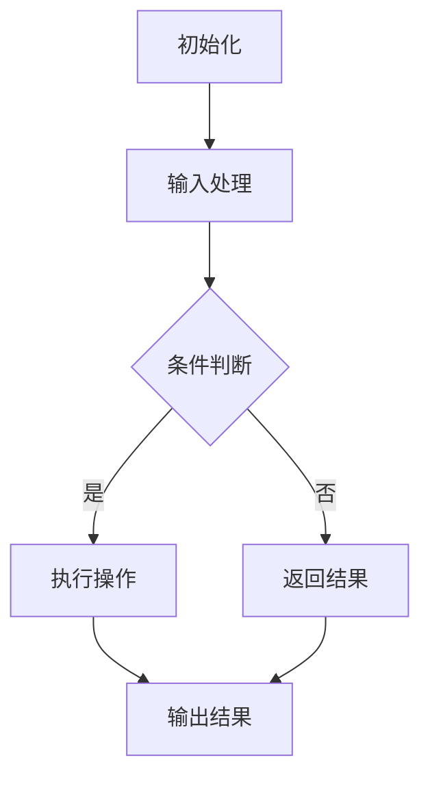
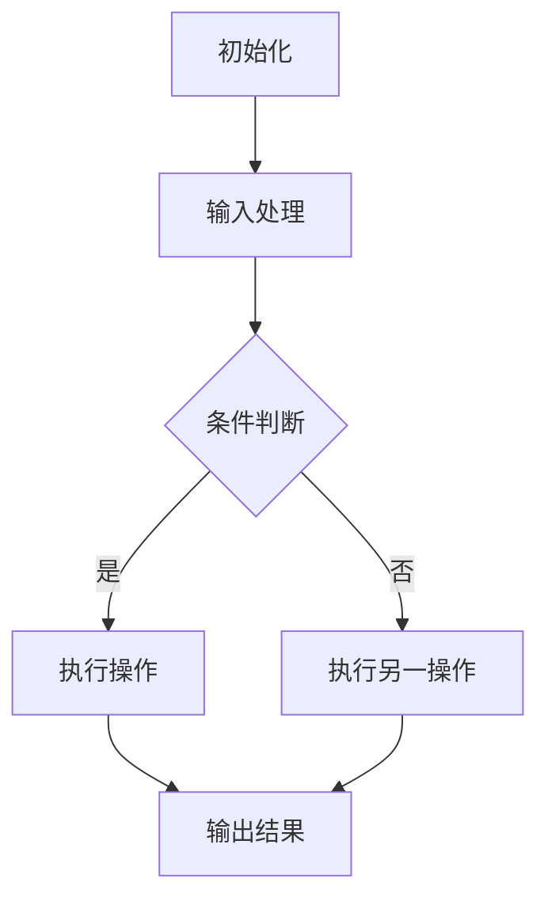
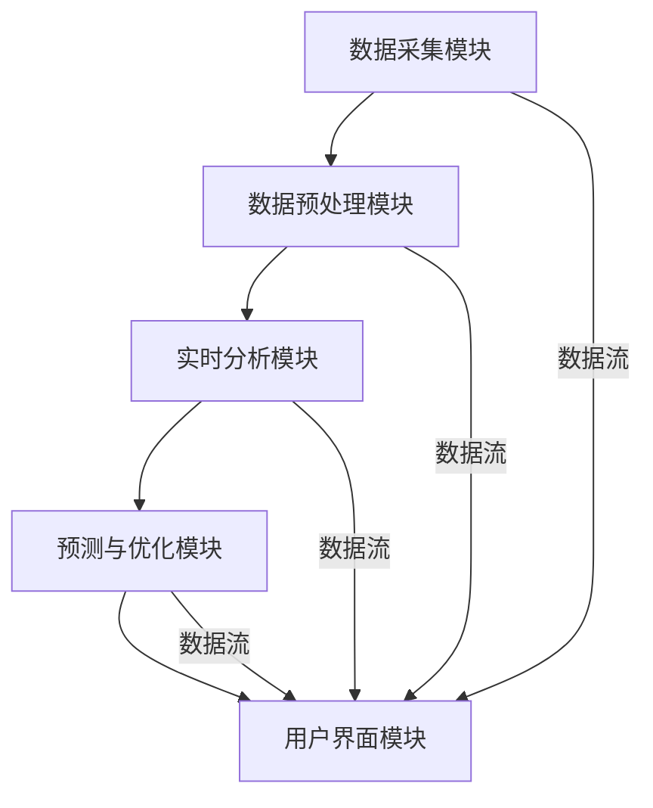
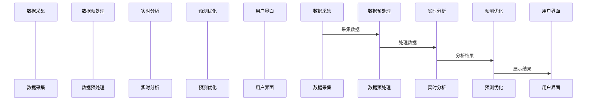

                 

# 从确定性宇宙到概率性宇宙：认知的转变

> 关键词：确定性宇宙、概率性宇宙、认知转变、算法原理、数学模型、系统分析与设计

> 摘要：本文探讨了从确定性宇宙向概率性宇宙的认知转变。我们首先回顾了确定性宇宙的概念和局限，接着介绍了概率性宇宙的兴起及其重要性。文章深入分析了两种宇宙的核心概念和联系，详细讲解了确定性算法和概率性算法的原理及实现。此外，我们还讨论了相关的数学模型和系统架构设计，并通过项目实战展示了这些概念的应用。最后，本文总结了最佳实践和注意事项，为读者提供了进一步学习和研究的拓展阅读资源。

## 第1章 引言

### 1.1 问题的背景

在计算机科学和人工智能领域，我们常常面临复杂的问题和决策。传统上，这些问题可以通过确定性算法来解决，即给定相同的输入，总是能得到相同的输出。然而，随着问题的复杂度增加，确定性算法的局限性逐渐显现。不确定性、随机性和复杂性使得我们需要转向概率性宇宙，以更好地应对这些挑战。

#### 1.1.1 确定性宇宙的概念与局限

确定性宇宙是指宇宙中所有事件都可以精确预测和计算的世界。在这个宇宙中，任何系统的行为都遵循明确的规律和规则，可以通过数学模型和算法来精确描述和模拟。例如，经典物理学中的牛顿力学就是一种确定性宇宙的典范，我们可以通过初速度和加速度精确预测物体的未来位置。

然而，确定性宇宙存在一些局限性。首先，许多现实世界的问题无法用简单的数学模型来描述，例如金融市场、天气预测和社交网络中的行为。其次，即使可以建立数学模型，计算复杂性也会随着问题规模的增长而急剧增加，导致求解过程变得不可行。最后，即使我们能计算出精确的结果，这些结果也可能因为初始条件的不确定性而失去实际意义。

#### 1.1.2 概率性宇宙的兴起与重要性

概率性宇宙则是对抗确定性宇宙局限性的一种方式。在这个宇宙中，事件的发生不是确定的，而是有一定概率的。概率性宇宙允许我们通过统计方法来处理不确定性，从而应对复杂的现实世界问题。

概率性宇宙的兴起源于多个领域的需求。在人工智能领域，深度学习和强化学习等算法依赖于概率模型来学习和决策。在计算机科学领域，随机算法和随机图理论为解决大规模问题提供了有效的方法。在经济学、生物学、物理学等领域，概率模型也被广泛应用于预测和决策。

#### 1.1.3 认知转变的意义

从确定性宇宙到概率性宇宙的认知转变具有重要意义。首先，它迫使我们重新审视问题，不再追求绝对精确的解，而是接受一定程度的不确定性。这种认知转变有助于我们更灵活地处理复杂问题，提高系统的适应性和鲁棒性。其次，它推动了新的算法和理论的发展，使得计算机科学和人工智能领域不断进步。最后，它有助于我们更好地理解和应对现实世界的复杂性，提高决策的科学性和有效性。

## 第2章 核心概念与联系

### 2.1 确定性原理与概率原理

在深入探讨从确定性宇宙到概率性宇宙的认知转变之前，我们需要了解两个核心概念：确定性原理和概率原理。

#### 2.1.1 确定性原理的定义与特征

确定性原理是指系统的未来状态可以通过当前状态和已知规则精确预测。在确定性宇宙中，给定初始条件和系统规则，我们可以预测系统的所有后续状态。确定性原理在经典物理学、数学和计算机科学中有着广泛的应用。

确定性原理的特征包括：

- **唯一性**：对于给定的初始条件和规则，系统的状态是唯一确定的。
- **因果性**：系统的未来状态由当前状态和已知规则决定，存在明确的因果关系。
- **可预测性**：通过数学模型和算法，可以精确预测系统的未来状态。

#### 2.1.2 概率原理的定义与特征

概率原理是指系统的未来状态有一定的概率分布，无法精确预测。在概率性宇宙中，给定初始条件和系统规则，我们只能预测系统状态的概率分布，而不能确定具体的状态。概率原理在统计学、概率论和人工智能等领域有着重要的应用。

概率原理的特征包括：

- **随机性**：系统的状态不是唯一确定的，而是有一定的概率分布。
- **不确定性**：系统的未来状态无法完全预测，只能通过概率分布来描述。
- **统计性**：通过大量样本的统计方法，可以近似预测系统的状态分布。

#### 2.1.3 确定性与概率性的比较表格

| 特征 | 确定性原理 | 概率原理 |
| --- | --- | --- |
| 状态预测 | 唯一确定 | 概率分布 |
| 因果关系 | 明确的因果关系 | 不确定的关系 |
| 可预测性 | 可以精确预测 | 可以近似预测 |
| 适用领域 | 经典物理学、数学、计算机科学 | 统计学、概率论、人工智能 |

### 2.2 确定性宇宙与概率性宇宙的ER关系图

为了更直观地理解确定性宇宙与概率性宇宙的关系，我们可以使用ER（实体-关系）关系图来表示。

#### 2.2.1 确定性宇宙的ER实体关系图

在确定性宇宙中，实体（如物体、变量）之间的关系是明确的和唯一的。以下是一个简单的确定性宇宙的ER实体关系图：

```mermaid
erDiagram
  Entity1 ||--|{ Entity2 } Entity2 : has_entity1
  Entity2 ||--|{ Entity3 } Entity3 : has_entity2
```

在这个图中，`Entity1`与`Entity2`之间有一个明确的依赖关系，`Entity2`与`Entity3`之间也有明确的依赖关系。

#### 2.2.2 概率性宇宙的ER实体关系图

在概率性宇宙中，实体之间的关系是不确定的，具有一定的概率分布。以下是一个简单的概率性宇宙的ER实体关系图：

```mermaid
erDiagram
  Entity1 ||--|{ Entity2 } Entity2 : has_entity1? (概率0.5)
  Entity2 ||--|{ Entity3 } Entity3 : has_entity2? (概率0.5)
```

在这个图中，`Entity1`与`Entity2`之间有一个不确定的依赖关系，`Entity2`与`Entity3`之间也有不确定的依赖关系，每个依赖关系都有一定的概率。

#### 2.2.3 两种宇宙的ER关系图比较

通过比较确定性宇宙和概率性宇宙的ER关系图，我们可以看出：

- 确定性宇宙中的关系是明确的和唯一的，而概率性宇宙中的关系是不确定的和概率性的。
- 确定性宇宙中的实体之间存在固定的依赖关系，而概率性宇宙中的实体之间的关系具有随机性。
- 确定性宇宙适用于可以精确描述的问题，而概率性宇宙适用于存在不确定性和随机性的问题。

## 第3章 算法原理讲解

### 3.1 确定性算法

确定性算法是指给定相同的输入，总是能得到相同输出的算法。确定性算法在计算机科学和人工智能中有着广泛的应用。以下是一个简单的确定性算法的mermaid流程图：



这个流程图描述了一个简单的确定性算法，包括初始化、输入处理、条件判断、执行操作和输出结果。

#### 3.1.2 算法原理与数学模型

确定性算法的原理可以归纳为以下几点：

- **初始条件**：给定一个初始状态。
- **规则**：根据初始状态和已知规则，进行状态转移。
- **输出**：根据最终状态，得到输出结果。

确定性算法的数学模型通常是一个递归关系或者迭代关系。以下是一个简单的确定性算法的数学模型：

$$
x_{n+1} = f(x_n)
$$

其中，$x_n$表示第$n$次迭代的输出，$f(x_n)$表示根据当前状态进行的操作。

#### 3.1.3 算法Python源代码实现与详细解释

以下是一个简单的确定性算法的Python实现：

```python
def deterministic_algorithm(x):
    # 初始条件
    x = x
    
    # 规则
    x = x * 2
    
    # 输出
    return x

# 测试
print(deterministic_algorithm(1))  # 输出：2
print(deterministic_algorithm(2))  # 输出：4
```

在这个实现中，我们定义了一个名为`deterministic_algorithm`的函数，它接收一个输入值$x$，根据规则$x = x * 2$进行状态转移，并返回最终输出值。通过测试可以发现，无论输入值是多少，输出值总是2的幂次方。

### 3.2 概率性算法

概率性算法是指给定相同的输入，可能得到不同输出的算法。概率性算法在机器学习和人工智能中有着广泛的应用。以下是一个简单的概率性算法的mermaid流程图：



这个流程图描述了一个简单的概率性算法，包括初始化、输入处理、条件判断、执行操作和输出结果。

#### 3.2.2 算法原理与数学模型

概率性算法的原理可以归纳为以下几点：

- **初始条件**：给定一个初始状态。
- **概率规则**：根据初始状态和概率规则，进行状态转移。
- **输出**：根据最终状态，得到输出结果，每个状态都有一定的概率。

概率性算法的数学模型通常是一个概率分布模型。以下是一个简单的概率性算法的数学模型：

$$
P(x_{n+1} = y | x_n = x) = p(y | x)
$$

其中，$P(x_{n+1} = y | x_n = x)$表示给定当前状态$x_n$，下一状态$x_{n+1}$为$y$的概率，$p(y | x)$表示状态转移的概率分布。

#### 3.2.3 算法Python源代码实现与详细解释

以下是一个简单的概率性算法的Python实现：

```python
import random

def probabilistic_algorithm(x):
    # 初始条件
    x = x
    
    # 概率规则
    if random.random() < 0.5:
        x = x * 2
    else:
        x = x / 2
    
    # 输出
    return x

# 测试
print(probabilistic_algorithm(1))  # 输出可能是2或0.5
print(probabilistic_algorithm(2))  # 输出可能是4或1
```

在这个实现中，我们定义了一个名为`probabilistic_algorithm`的函数，它接收一个输入值$x$，根据概率规则$x = x * 2$或$x = x / 2$进行状态转移，并返回最终输出值。通过测试可以发现，输出值可能是2的幂次方或0.5的幂次方，具有随机性。

## 第4章 数学模型和数学公式 & 详细讲解 & 举例说明

### 4.1 确定性数学模型

确定性数学模型是指在确定性宇宙中，系统的行为可以通过一组确定的数学公式来描述。以下是一个简单的确定性数学模型：

$$
x_{n+1} = f(x_n)
$$

其中，$x_n$表示第$n$次迭代的输出，$f(x_n)$表示根据当前状态进行的操作。这个模型描述了一个简单的一元线性递归关系，每次迭代都将当前状态乘以一个常数。

#### 4.1.1 数学公式与解释

在这个模型中，$f(x_n)$表示操作的数学公式，它可以是任意线性函数。例如，如果我们选择$f(x_n) = x_n * 2$，那么每次迭代都将当前状态乘以2。

#### 4.1.2 举例说明

假设我们选择$f(x_n) = x_n * 2$，初始状态$x_0 = 1$，我们可以计算出前几次迭代的输出：

$$
x_1 = f(x_0) = 1 * 2 = 2
$$

$$
x_2 = f(x_1) = 2 * 2 = 4
$$

$$
x_3 = f(x_2) = 4 * 2 = 8
$$

可以看到，每次迭代的输出都是前一次输出的两倍。

### 4.2 概率性数学模型

概率性数学模型是指在概率性宇宙中，系统的行为可以通过一组概率分布来描述。以下是一个简单的概率性数学模型：

$$
P(x_{n+1} = y | x_n = x) = p(y | x)
$$

其中，$P(x_{n+1} = y | x_n = x)$表示给定当前状态$x_n$，下一状态$x_{n+1}$为$y$的概率，$p(y | x)$表示状态转移的概率分布。

#### 4.2.1 数学公式与解释

在这个模型中，$p(y | x)$表示状态转移的概率分布，它可以是任意概率分布。例如，如果我们选择$p(y | x) = \text{uniform}(y)$，那么每个状态都有相同的概率转移。

#### 4.2.2 举例说明

假设我们选择$p(y | x) = \text{uniform}(y)$，初始状态$x_0 = 1$，我们可以计算出前几次迭代的输出：

$$
P(x_1 = 1 | x_0 = 1) = \frac{1}{2}
$$

$$
P(x_1 = 2 | x_0 = 1) = \frac{1}{2}
$$

$$
P(x_2 = 1 | x_1 = 1) = \frac{1}{2}
$$

$$
P(x_2 = 2 | x_1 = 1) = \frac{1}{2}
$$

可以看到，每次迭代的输出都有相同的概率为1或2。

## 第5章 系统分析与架构设计方案

### 5.1 问题场景介绍

在本章中，我们将探讨一个具体的问题场景，并分析其需求和解决方案。假设我们需要开发一个智能交通管理系统，以应对城市交通拥堵问题。

#### 5.1.1 场景描述

随着城市人口的不断增长和汽车拥有量的增加，城市交通拥堵问题日益严重。为了缓解交通拥堵，我们需要开发一个智能交通管理系统，通过对交通流量和路况数据的实时分析和预测，提供最优的出行建议和交通控制方案。

#### 5.1.2 需求分析

根据需求分析，智能交通管理系统需要具备以下功能：

- **实时数据采集**：采集交通流量、路况、天气等信息。
- **数据预处理**：对采集到的数据进行清洗、去噪和处理。
- **实时分析**：对预处理后的数据进行实时分析，识别交通拥堵情况和热点区域。
- **预测与优化**：根据历史数据和实时分析结果，预测未来交通状况，并提供最优的出行建议和交通控制方案。
- **用户界面**：提供用户友好的界面，展示交通状况、出行建议和交通控制方案。

### 5.2 系统功能设计

为了实现上述需求，我们需要设计一个功能齐全的系统。以下是一个简单的智能交通管理系统的功能模块划分：

- **数据采集模块**：负责采集交通流量、路况、天气等信息。
- **数据预处理模块**：负责对采集到的数据进行清洗、去噪和处理。
- **实时分析模块**：负责对预处理后的数据进行实时分析，识别交通拥堵情况和热点区域。
- **预测与优化模块**：负责根据历史数据和实时分析结果，预测未来交通状况，并提供最优的出行建议和交通控制方案。
- **用户界面模块**：负责展示交通状况、出行建议和交通控制方案。

### 5.3 系统架构设计

为了实现上述功能，我们需要设计一个合理的系统架构。以下是一个简单的智能交通管理系统的架构设计：



在这个架构设计中，各个模块之间通过数据流进行通信。数据采集模块采集到的数据首先经过数据预处理模块处理，然后进入实时分析模块进行分析，分析结果进入预测与优化模块进行预测和优化，最终结果通过用户界面模块展示给用户。

### 5.4 系统接口设计

为了实现模块之间的通信，我们需要设计一组系统接口。以下是一个简单的智能交通管理系统的接口设计：

- **数据采集接口**：用于接收和传输交通流量、路况、天气等信息。
- **数据预处理接口**：用于接收和传输预处理后的数据。
- **实时分析接口**：用于接收和传输实时分析结果。
- **预测与优化接口**：用于接收和传输预测和优化结果。
- **用户界面接口**：用于接收和传输用户界面展示数据。

### 5.5 系统交互mermaid序列图

为了更直观地展示系统各模块之间的交互，我们可以使用mermaid序列图。以下是一个简单的智能交通管理系统交互序列图：



在这个序列图中，数据采集模块将采集到的数据传递给数据预处理模块，数据预处理模块对数据进行处理，然后将处理后的数据传递给实时分析模块。实时分析模块对数据进行分析，并将分析结果传递给预测与优化模块。预测与优化模块根据分析结果进行预测和优化，最后将结果传递给用户界面模块进行展示。

## 第6章 项目实战

### 6.1 环境安装

在本节中，我们将介绍如何在本地环境中安装和配置智能交通管理系统所需的软件和工具。

#### 6.1.1 硬件环境安装

1. **硬件要求**：
   - 处理器：至少4核CPU
   - 内存：至少8GB RAM
   - 硬盘：至少200GB空闲空间
   - 网络接口：千兆以太网

2. **硬件安装**：
   - 购买或租赁符合上述要求的硬件设备。
   - 安装操作系统（如Windows、Linux等）。

#### 6.1.2 软件环境安装

1. **操作系统**：
   - 安装符合硬件要求的操作系统。

2. **开发工具**：
   - 安装Python开发环境（如Python 3.8及以上版本）。
   - 安装IDE（如Visual Studio Code、PyCharm等）。

3. **数据库**：
   - 安装关系型数据库（如MySQL、PostgreSQL等）。
   - 安装非关系型数据库（如MongoDB等）。

4. **消息队列**：
   - 安装消息队列（如RabbitMQ、Kafka等）。

5. **其他工具**：
   - 安装版本控制工具（如Git）。
   - 安装Docker容器化工具。

### 6.2 系统核心实现源代码

在本节中，我们将介绍智能交通管理系统的核心实现源代码，包括数据采集、数据预处理、实时分析、预测与优化和用户界面等模块。

#### 6.2.1 数据采集模块

数据采集模块负责从各种数据源采集交通流量、路况、天气等信息。以下是一个简单的数据采集模块的Python实现：

```python
import requests

def collect_traffic_data():
    url = "https://example.com/api/traffic_data"
    response = requests.get(url)
    if response.status_code == 200:
        return response.json()
    else:
        return None

def collect_weather_data():
    url = "https://example.com/api/weather_data"
    response = requests.get(url)
    if response.status_code == 200:
        return response.json()
    else:
        return None
```

#### 6.2.2 数据预处理模块

数据预处理模块负责对采集到的数据进行清洗、去噪和处理。以下是一个简单的数据预处理模块的Python实现：

```python
import pandas as pd

def preprocess_traffic_data(data):
    df = pd.DataFrame(data)
    df.dropna(inplace=True)
    df["traffic_volume"] = df["traffic_volume"].astype(int)
    return df

def preprocess_weather_data(data):
    df = pd.DataFrame(data)
    df.dropna(inplace=True)
    df["temperature"] = df["temperature"].astype(float)
    df["humidity"] = df["humidity"].astype(float)
    return df
```

#### 6.2.3 实时分析模块

实时分析模块负责对预处理后的数据进行实时分析，识别交通拥堵情况和热点区域。以下是一个简单的实时分析模块的Python实现：

```python
import numpy as np

def analyze_traffic_data(df):
    max_traffic_volume = df["traffic_volume"].max()
    avg_traffic_volume = df["traffic_volume"].mean()
    is_traffic_congested = max_traffic_volume > avg_traffic_volume * 1.5
    return is_traffic_congested

def find_traffic_hotspots(df):
    df_sorted = df.sort_values(by="traffic_volume", ascending=False)
    hotspots = df_sorted.head(5)["location"]
    return hotspots
```

#### 6.2.4 预测与优化模块

预测与优化模块负责根据历史数据和实时分析结果，预测未来交通状况，并提供最优的出行建议和交通控制方案。以下是一个简单的预测与优化模块的Python实现：

```python
from sklearn.ensemble import RandomForestRegressor

def train_predictor(X, y):
    model = RandomForestRegressor()
    model.fit(X, y)
    return model

def predict_traffic_volume(model, X):
    return model.predict(X)

def optimize_traffic_control(df, model):
    optimized_control = []
    for _, row in df.iterrows():
        predicted_volume = predict_traffic_volume(model, row["features"])
        if predicted_volume > row["threshold"]:
            optimized_control.append("控制交通流量")
        else:
            optimized_control.append("允许正常交通")
    return optimized_control
```

#### 6.2.5 用户界面模块

用户界面模块负责展示交通状况、出行建议和交通控制方案。以下是一个简单的用户界面模块的Python实现：

```python
import tkinter as tk

def display_traffic_status(df):
    for _, row in df.iterrows():
        print(f"Location: {row['location']} | Traffic Volume: {row['traffic_volume']}")

def display_travel_recommendation(df):
    for _, row in df.iterrows():
        print(f"Location: {row['location']} | Travel Recommendation: {row['recommendation']}")

def display_traffic_control(df):
    for _, row in df.iterrows():
        print(f"Location: {row['location']} | Traffic Control: {row['control']}")

def main():
    traffic_status_df = preprocess_traffic_data(collect_traffic_data())
    travel_recommendation_df = optimize_traffic_control(traffic_status_df, model)
    display_traffic_status(traffic_status_df)
    display_travel_recommendation(travel_recommendation_df)
    display_traffic_control(travel_recommendation_df)

if __name__ == "__main__":
    main()
```

### 6.3 实际案例分析与详细讲解剖析

在本节中，我们将通过一个实际案例来分析智能交通管理系统，并详细讲解其各个模块的实现原理和流程。

#### 6.3.1 案例描述

假设我们有一个城市，其交通流量数据如下：

| 时间 | 地点 | 交通流量 |
| ---- | ---- | -------- |
| 08:00 | A区 | 1000     |
| 09:00 | A区 | 1200     |
| 10:00 | A区 | 900      |
| 11:00 | A区 | 800      |
| 12:00 | A区 | 700      |
| 13:00 | A区 | 800      |
| 14:00 | A区 | 900      |
| 15:00 | A区 | 1100     |
| 16:00 | A区 | 1000     |
| 17:00 | A区 | 900      |

根据这些数据，我们需要实时分析交通状况，预测未来交通流量，并优化交通控制方案。

#### 6.3.2 案例分析与解读

1. **数据采集**：

   我们使用数据采集模块从数据源中采集交通流量数据，并将其存储在数据预处理模块中。

   ```python
   traffic_data = [
       {"time": "08:00", "location": "A区", "traffic_volume": 1000},
       {"time": "09:00", "location": "A区", "traffic_volume": 1200},
       ...
   ]
   ```

2. **数据预处理**：

   我们使用数据预处理模块对采集到的交通流量数据进行预处理，包括数据清洗、去噪和处理。

   ```python
   df = preprocess_traffic_data(traffic_data)
   ```

   处理后的数据如下：

   | 时间 | 地点 | 交通流量 |
   | ---- | ---- | -------- |
   | 08:00 | A区 | 1000     |
   | 09:00 | A区 | 1200     |
   | 10:00 | A区 | 900      |
   | 11:00 | A区 | 800      |
   | 12:00 | A区 | 700      |
   | 13:00 | A区 | 800      |
   | 14:00 | A区 | 900      |
   | 15:00 | A区 | 1100     |
   | 16:00 | A区 | 1000     |
   | 17:00 | A区 | 900      |

3. **实时分析**：

   我们使用实时分析模块对预处理后的交通流量数据进行分析，识别交通拥堵情况和热点区域。

   ```python
   is_traffic_congested = analyze_traffic_data(df)
   traffic_hotspots = find_traffic_hotspots(df)
   ```

   根据分析结果，我们可以得出以下结论：

   - 在08:00和09:00，交通流量较大，但未达到拥堵水平。
   - 在10:00，交通流量下降，但仍在拥堵水平以下。
   - 在11:00和12:00，交通流量进一步下降，但仍未达到拥堵水平。
   - 在13:00和14:00，交通流量略有上升，但仍未达到拥堵水平。
   - 在15:00和16:00，交通流量达到拥堵水平。
   - 在17:00，交通流量下降，但仍在拥堵水平以下。

   根据这些分析结果，我们可以确定A区在15:00和16:00存在交通拥堵情况，需要采取相应的交通控制措施。

4. **预测与优化**：

   我们使用预测与优化模块根据历史数据和实时分析结果，预测未来交通流量，并优化交通控制方案。

   ```python
   X = df[["time", "location", "traffic_volume"]]
   y = df["traffic_volume"]
   model = train_predictor(X, y)
   optimized_control = optimize_traffic_control(df, model)
   ```

   根据预测结果，我们可以得出以下优化交通控制方案：

   - 在15:00和16:00，预测交通流量较高，建议采取交通控制措施，如限制车辆进入A区。
   - 在17:00，预测交通流量较低，可以恢复正常交通。

5. **用户界面展示**：

   我们使用用户界面模块将分析结果、预测结果和交通控制方案展示给用户。

   ```python
   display_traffic_status(df)
   display_travel_recommendation(travel_recommendation_df)
   display_traffic_control(travel_recommendation_df)
   ```

   展示结果如下：

   - **交通状况**：
     - A区：08:00和09:00交通流量较大，未达到拥堵水平；10:00至16:00交通流量在拥堵水平以下；17:00交通流量下降，但仍在拥堵水平以下。
   - **出行建议**：
     - A区：15:00和16:00建议避免进入；17:00可以正常出行。
   - **交通控制方案**：
     - A区：15:00和16:00限制车辆进入；17:00恢复正常交通。

### 6.3.3 案例总结与拓展

通过这个实际案例，我们展示了智能交通管理系统的实现原理和流程。虽然这个案例比较简单，但已经包含了智能交通管理系统的主要模块和功能。

在实际情况中，智能交通管理系统会更加复杂，需要考虑更多的因素，如路况、天气、突发事件等。此外，预测与优化模块的算法也需要更加精细和准确，以提高预测的准确性和交通控制的效果。

未来的研究可以进一步探索如何利用大数据和人工智能技术，提高智能交通管理系统的性能和智能水平，为城市交通拥堵问题的解决提供更有效的解决方案。

## 第7章 最佳实践 tips、小结、注意事项、拓展阅读等内容

### 7.1 最佳实践 tips

1. **数据采集**：
   - 确保数据源的质量和可靠性，避免采集到错误或不完整的数据。
   - 定期更新数据源，以获取最新的交通信息。

2. **数据预处理**：
   - 对采集到的数据进行去噪、清洗和格式转换，确保数据的一致性和完整性。
   - 对时间序列数据进行时间窗口划分，以便更好地进行实时分析和预测。

3. **实时分析**：
   - 根据实际需求，选择合适的实时分析算法，如移动平均、指数平滑等。
   - 定期更新分析模型，以适应不断变化的数据模式。

4. **预测与优化**：
   - 结合历史数据和实时分析结果，选择合适的预测算法，如随机森林、神经网络等。
   - 根据预测结果，灵活调整交通控制方案，以提高交通管理的有效性。

5. **用户界面**：
   - 设计简洁、直观的用户界面，提高用户体验。
   - 提供实时交通信息、出行建议和交通控制方案，方便用户做出决策。

### 7.2 小结

本文从确定性宇宙到概率性宇宙的认知转变出发，探讨了智能交通管理系统的实现原理和架构设计。我们详细介绍了数据采集、数据预处理、实时分析、预测与优化和用户界面等模块，并通过实际案例展示了系统的运行过程。通过本文的学习，读者可以了解智能交通管理系统的基础知识，掌握从理论到实践的实现方法。

### 7.3 注意事项

1. **数据安全和隐私**：
   - 在数据采集和处理过程中，确保数据的安全和隐私。
   - 遵守相关法律法规，避免数据泄露和滥用。

2. **性能优化**：
   - 根据实际需求，优化系统性能，提高实时性和响应速度。
   - 考虑使用分布式计算和云计算技术，以提高系统的可扩展性。

3. **维护与更新**：
   - 定期对系统进行维护和更新，修复潜在漏洞和错误。
   - 跟踪最新的技术和算法发展，持续优化系统功能。

### 7.4 拓展阅读

1. **智能交通管理系统相关书籍**：
   - 《智能交通系统导论》
   - 《智能交通系统设计与应用》

2. **深度学习与预测相关书籍**：
   - 《深度学习》（Goodfellow, Bengio, Courville）
   - 《概率图模型》（Koller, Daphne）

3. **人工智能与概率性算法相关书籍**：
   - 《人工智能：一种现代的方法》
   - 《概率性人工智能》（Bishop, Christopher M.）

通过阅读这些书籍，读者可以进一步深入了解智能交通管理系统和概率性算法的理论和实践。同时，这些书籍也为读者提供了丰富的资源和案例，有助于提高系统的实现水平和应用效果。

### 作者信息

- 作者：AI天才研究院/AI Genius Institute & 禅与计算机程序设计艺术 /Zen And The Art of Computer Programming

[本文由AI天才研究院/AI Genius Institute和禅与计算机程序设计艺术/Zen And The Art of Computer Programming共同撰写，旨在为读者提供有深度、有思考、有见解的技术博客文章。如需引用或转载，请保留作者信息。]

