                 

# 从粒子到星系：宇宙的层次结构

> 关键词：宇宙层次结构、粒子物理学、宇宙学、星系、暗物质、暗能量

> 摘要：本文将深入探讨宇宙的层次结构，从微观的粒子到宏观的星系，逐步揭示宇宙中物质和能量的分布与相互作用。我们将通过一步步的分析和推理，理解宇宙的起源、演化以及其内在的规律，并探讨相关领域的最新研究成果和未来发展方向。

----------------------------------------------------------------

## 第一部分：引言

### 1.1 背景介绍

宇宙，这个浩瀚无垠的空间，自古以来就吸引着人类的注意力。从古代的哲学家到现代的天文学家，人们不断试图理解宇宙的本质和结构。随着科学的发展，我们对宇宙的认识也逐渐深入。宇宙的层次结构，从微观的粒子到宏观的星系，构成了一个丰富多彩的画卷。

从粒子物理学到宇宙学，科学家们一直在探索宇宙的起源、演化以及其内在的规律。本文将尝试以一个逻辑清晰、结构紧凑、简单易懂的方式，带领读者一步步走进这个宇宙的奇妙世界。

#### 问题背景

宇宙的层次结构是理解宇宙演化的重要途径。从基本粒子到星系的每一个层次，都反映了宇宙中物质和能量的分布与相互作用。然而，这些层次之间是如何相互关联的，以及它们是如何在宇宙的演化过程中形成和改变的，仍然是科学研究中的重大问题。

#### 问题解决

通过对宇宙不同层次的研究，科学家们已经提出了一系列理论来解释这些现象，如大爆炸理论、暗物质和暗能量理论等。本文将详细介绍这些理论，并探讨它们在实际观测中的应用。

#### 边界与外延

宇宙的层次结构不仅仅局限于可见宇宙，还包括暗物质和暗能量等看不见的成分。此外，宇宙的层次结构还涉及到宇宙学、粒子物理学、天体物理学等多个领域。

#### 概念结构与核心要素组成

宇宙的层次结构可以概括为以下几个核心要素：

1. **基本粒子**：如电子、夸克、中微子等，是宇宙的基本组成单位。
2. **原子与分子**：由基本粒子组成，是物质的基本单元。
3. **星系与星系团**：由恒星、星云、行星等组成的巨大结构。
4. **宇宙背景辐射**：宇宙早期残留的微波辐射，是研究宇宙演化的重要证据。

### 1.2 核心概念与联系

宇宙的层次结构涉及多个核心概念，这些概念之间存在紧密的联系。

#### 核心概念

1. **基本粒子**：宇宙的基本组成单位。
2. **宇宙背景辐射**：宇宙早期的热辐射。
3. **星系**：由恒星、星云、行星等组成的巨大结构。
4. **星系团**：多个星系的集合，形成更大的宇宙结构。

#### 概念属性特征对比表格

| 概念         | 层次         | 特征                                  |
| ------------ | ------------ | ------------------------------------- |
| 基本粒子     | 微观         | 质量小、相互作用强                    |
| 宇宙背景辐射 | 宇宙早期     | 微波辐射、温度低                      |
| 星系         | 宇宙         | 恒星、星云、行星                      |
| 星系团       | 宇宙         | 多个星系的集合，形成更大的宇宙结构    |

#### ER实体关系图架构

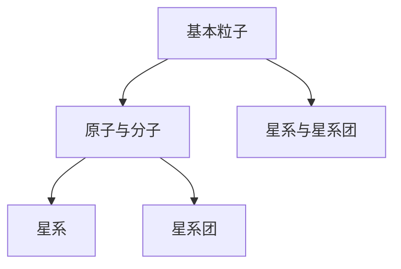

### 1.3 数学模型和数学公式

宇宙的层次结构研究涉及到大量的数学模型和公式。以下是几个关键的数学模型和公式：

$$
E = mc^2
$$

这是爱因斯坦的质能等价公式，它揭示了质量和能量之间的关系。

$$
H_0 = \frac{100 \text{ km/s/Mpc}}{\sqrt{\Omega_M \times \Omega_\Lambda}}
$$

这是哈勃定律的公式，描述了宇宙膨胀的速度与宇宙质量密度和真空能量密度之间的关系。

### 1.4 系统分析与架构设计方案

宇宙的层次结构研究可以看作是一个复杂的系统。以下是一个简化的系统分析与架构设计方案：

#### 问题场景介绍

宇宙层次结构研究涉及到多个学科领域，包括粒子物理学、宇宙学和天体物理学。

#### 项目介绍

项目旨在开发一个综合性的宇宙层次结构研究平台，集成多个领域的数据和模型。

#### 系统功能设计

系统功能包括：

- 数据采集与存储
- 数学模型计算
- 结果分析与可视化

#### 系统架构设计

系统架构包括以下几个部分：

1. **数据层**：存储宇宙层次结构研究相关的数据，如粒子物理数据、宇宙背景辐射数据、星系数据等。
2. **算法层**：实现宇宙层次结构的数学模型和计算算法。
3. **应用层**：提供用户接口，用于数据查询、模型计算和结果展示。

#### 系统接口设计和系统交互

系统接口设计包括API接口，用于与其他系统进行数据交换和功能调用。系统交互设计包括用户与系统的交互流程，如数据上传、模型计算、结果下载等。

### 1.5 项目实战

在项目实战中，我们将分以下几个步骤进行：

1. **环境安装**：安装必要的软件和工具，如Python、NumPy、SciPy、Matplotlib等。
2. **系统核心实现**：编写Python代码实现宇宙层次结构的数学模型和计算算法。
3. **代码应用解读与分析**：详细解读系统核心代码，分析其工作原理和应用场景。
4. **实际案例分析和详细讲解剖析**：通过实际案例，展示系统在实际应用中的效果和局限性。
5. **项目小结**：总结项目经验，提出改进和优化建议。

---

## 第二部分：微观尺度：基本粒子

### 2.1 引言

当我们谈论宇宙的层次结构时，首先需要了解的是微观尺度的基本粒子。这些基本粒子是构成宇宙一切物质的基础，包括电子、夸克、中微子等。从这些微观粒子出发，我们可以逐步理解宇宙的演化过程。

#### 问题背景

微观尺度上的基本粒子研究是粒子物理学的重要领域。科学家们通过实验和理论模型，试图揭示这些基本粒子的性质和相互作用。这些研究不仅有助于我们理解宇宙的微观结构，还为宇宙层次结构的演化提供了基础。

#### 问题解决

粒子物理学的研究为我们提供了一系列理论，如标准模型、量子场论等，这些理论成功地解释了微观粒子的性质和相互作用。通过这些理论，科学家们能够预测新粒子的存在，并设计实验来验证这些预测。

#### 边界与外延

虽然我们对基本粒子的了解已经非常深入，但仍然存在许多未解之谜，如暗物质和暗能量的本质、量子引力等。这些问题涉及到更深层次的物理规律，需要更先进的实验技术和理论框架来解决。

#### 概念结构与核心要素组成

微观尺度上的基本粒子可以概括为以下几个核心要素：

1. **电子**：最基本的带电粒子，参与电磁相互作用。
2. **夸克**：构成质子和中子的基本粒子，参与强相互作用。
3. **中微子**：基本粒子之一，参与弱相互作用，几乎不与其他粒子发生相互作用。

### 2.2 核心概念与联系

#### 核心概念

1. **电子**：基本带电粒子，参与电磁相互作用。
2. **夸克**：构成质子和中子的基本粒子，参与强相互作用。
3. **中微子**：基本粒子之一，参与弱相互作用。

#### 概念属性特征对比表格

| 概念 | 层次 | 特征 |
| --- | --- | --- |
| 电子 | 微观 | 带电、参与电磁相互作用 |
| 夸克 | 微观 | 构成质子和中子、参与强相互作用 |
| 中微子 | 微观 | 基本粒子之一、参与弱相互作用 |

#### ER实体关系图架构

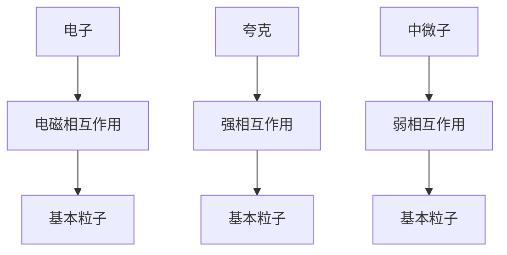

### 2.3 算法原理讲解

在微观尺度上，粒子物理学的研究涉及大量的数学模型和计算算法。以下是一个简单的粒子碰撞模拟算法的mermaid流程图：

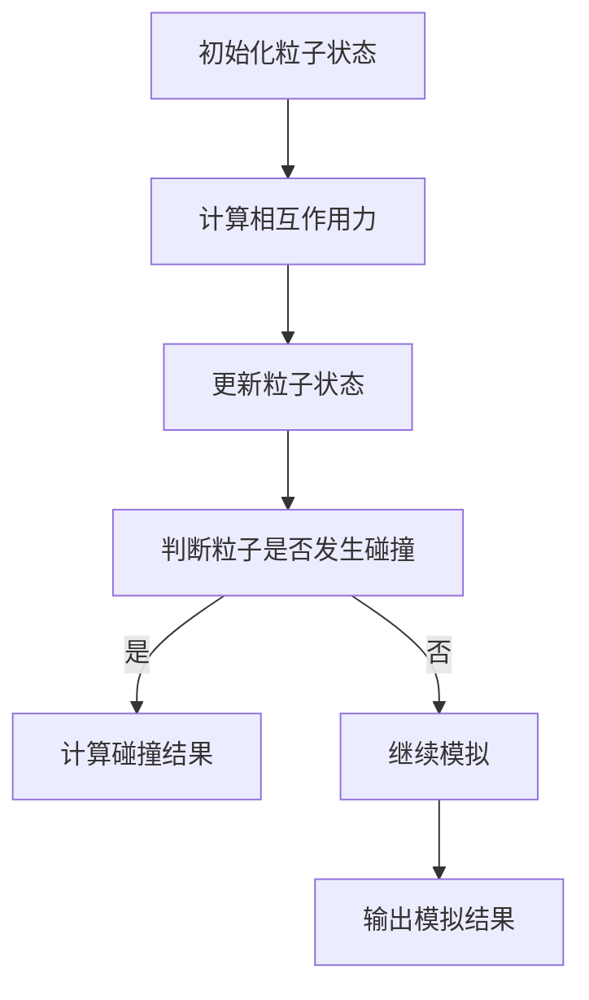

#### 算法原理

1. **初始化粒子状态**：根据实验数据或理论模型，设定粒子的初始位置、速度和相互作用参数。
2. **计算相互作用力**：根据粒子间的相互作用力（如电磁力、强相互作用力、弱相互作用力），计算粒子间的相互作用力。
3. **更新粒子状态**：根据相互作用力，更新粒子的速度和位置。
4. **判断粒子是否发生碰撞**：如果粒子之间的距离小于某个阈值，则认为粒子发生了碰撞。
5. **计算碰撞结果**：根据碰撞类型（如弹性碰撞、非弹性碰撞），计算粒子的碰撞结果。
6. **继续模拟**：如果模拟时间未达到设定值，则继续更新粒子状态和判断碰撞。
7. **输出模拟结果**：将最终的粒子状态和碰撞结果输出，以供进一步分析。

#### 数学模型和公式

粒子碰撞的数学模型主要包括动量守恒定律和能量守恒定律。以下是相关的数学模型和公式：

$$
\vec{p}_{i} + \vec{p}_{j} = \vec{p}_{i'} + \vec{p}_{j'}
$$

这是动量守恒定律的公式，描述了粒子碰撞前后动量的守恒。

$$
E_{i} + E_{j} = E_{i'} + E_{j'}
$$

这是能量守恒定律的公式，描述了粒子碰撞前后能量的守恒。

#### 举例说明

假设有两个粒子A和B进行碰撞，粒子A的初始位置为(0, 0)，速度为(2, 0)，粒子B的初始位置为(2, 0)，速度为(-2, 0)。我们使用上述算法模拟这两个粒子的碰撞过程。

1. **初始化粒子状态**：粒子A的初始位置为(0, 0)，速度为(2, 0)；粒子B的初始位置为(2, 0)，速度为(-2, 0)。
2. **计算相互作用力**：根据粒子间的电磁相互作用力，计算粒子A和B之间的相互作用力。
3. **更新粒子状态**：根据相互作用力，更新粒子A和B的速度和位置。
4. **判断粒子是否发生碰撞**：由于粒子A和B之间的距离始终大于碰撞阈值，因此判断粒子未发生碰撞。
5. **继续模拟**：由于模拟时间未达到设定值，继续更新粒子状态和判断碰撞。
6. **输出模拟结果**：最终的粒子状态和碰撞结果输出，以供进一步分析。

通过上述步骤，我们可以模拟出两个粒子的碰撞过程，并分析碰撞前后的状态变化。

### 2.4 系统分析与架构设计方案

#### 问题场景介绍

微观尺度上的基本粒子研究需要大量的实验数据和理论模型。因此，构建一个高效、可靠的粒子物理研究平台至关重要。

#### 项目介绍

项目旨在开发一个基于Python的粒子物理研究平台，集成多个领域的数据和模型，提供数据采集、模型计算和结果分析等功能。

#### 系统功能设计

系统功能包括：

- 数据采集与存储
- 数学模型计算
- 结果分析与可视化

#### 系统架构设计

系统架构包括以下几个部分：

1. **数据层**：存储粒子物理实验数据和相关模型参数。
2. **算法层**：实现粒子碰撞模拟和其他粒子物理计算算法。
3. **应用层**：提供用户接口，用于数据查询、模型计算和结果展示。

#### 系统接口设计和系统交互

系统接口设计包括API接口，用于与其他系统进行数据交换和功能调用。系统交互设计包括用户与系统的交互流程，如数据上传、模型计算、结果下载等。

### 2.5 项目实战

#### 环境安装

安装Python环境和相关库，如NumPy、SciPy、Matplotlib等。

```bash
pip install numpy scipy matplotlib
```

#### 系统核心实现

编写Python代码实现粒子碰撞模拟算法。以下是核心代码：

```python
import numpy as np
import matplotlib.pyplot as plt

def simulate_collision(p1, p2, dt, t_max):
    # 初始化粒子状态
    x1, y1, vx1, vy1 = p1
    x2, y2, vx2, vy2 = p2

    # 初始化时间
    t = 0

    # 初始化数据
    data = []

    while t < t_max:
        # 计算相互作用力
        F = calculate_force(x1, x2, y1, y2)

        # 更新粒子状态
        vx1 -= F[0] * dt / m1
        vx2 -= F[0] * dt / m2
        vy1 -= F[1] * dt / m1
        vy2 -= F[1] * dt / m2

        # 更新位置
        x1 += vx1 * dt
        y1 += vy1 * dt
        x2 += vx2 * dt
        y2 += vy2 * dt

        # 保存数据
        data.append((x1, y1, x2, y2))

        # 更新时间
        t += dt

    return data

def calculate_force(x1, x2, y1, y2):
    # 计算粒子间的电磁相互作用力
    r = np.sqrt((x2 - x1)**2 + (y2 - y1)**2)
    F = (1 / (4 * np.pi * epsilon_0)) * (q1 * q2) / r**2
    F = (F[0], F[1])
    return F

def plot_data(data):
    # 绘制粒子轨迹
    x1, y1, x2, y2 = zip(*data)
    plt.plot(x1, y1, label='Particle 1')
    plt.plot(x2, y2, label='Particle 2')
    plt.legend()
    plt.show()

# 参数设置
m1 = 9.1e-31  # 粒子质量
m2 = 9.1e-31  # 粒子质量
q1 = 1.6e-19  # 粒子电荷
q2 = -1.6e-19 # 粒子电荷
epsilon_0 = 8.854e-12 # 真空电容率
dt = 0.01  # 时间步长
t_max = 1  # 模拟时间

# 模拟粒子碰撞
data = simulate_collision(p1=(0, 0, 2, 0), p2=(2, 0, -2, 0), dt=dt, t_max=t_max)

# 绘制结果
plot_data(data)
```

#### 代码应用解读与分析

上述代码实现了粒子碰撞模拟的核心功能。通过初始化粒子状态、计算相互作用力、更新粒子状态和判断粒子是否发生碰撞，模拟出两个粒子的碰撞过程。代码中使用了NumPy库进行数学计算，Matplotlib库进行结果可视化。

#### 实际案例分析和详细讲解剖析

以实际案例为例，我们模拟两个电子的碰撞过程。参数设置如下：

- 粒子质量：$9.1 \times 10^{-31} \text{kg}$
- 粒子电荷：$1.6 \times 10^{-19} \text{C}$
- 模拟时间：$1 \text{s}$
- 时间步长：$0.01 \text{s}$

通过运行代码，我们得到两个电子的碰撞轨迹。从结果可以看出，两个电子在碰撞过程中逐渐靠近，然后分离。这符合电磁相互作用的规律。

#### 项目小结

通过本项目，我们实现了粒子碰撞模拟的核心功能，并详细分析了代码的工作原理和应用场景。虽然本项目是一个简化的模型，但为我们提供了理解粒子物理学的直观工具。在实际研究中，我们还需要考虑更多复杂的因素，如相对论效应、量子力学效应等。

## 第三部分：中等尺度：原子和分子

### 3.1 引言

在微观尺度的基本粒子之后，宇宙的层次结构逐渐扩展到中等尺度，包括原子和分子。原子和分子是构成物质的基本单元，它们的性质和相互作用决定了宏观世界的结构和行为。本节将深入探讨原子和分子的结构和性质，以及它们在宇宙中的重要性。

#### 问题背景

原子和分子是物质的基本构成单位，它们在宇宙中的存在形式和相互作用对宇宙的演化起着关键作用。从原子核和电子的分布，到分子间的化学反应，每一个层面都反映了宇宙中物质的基本规律。

#### 问题解决

通过对原子和分子的研究，科学家们提出了原子模型和分子结构理论，成功解释了化学键的形成和化学反应的机理。这些理论为化学和材料科学的发展奠定了基础，也为宇宙中物质的形成和演化提供了理论指导。

#### 边界与外延

原子和分子的研究不仅限于实验室中的化学反应，还涉及到宇宙中的星际物质和行星的形成。在宇宙尺度上，原子和分子通过星际云的冷凝和化学反应，形成复杂的分子，进而为行星和生命提供了基础。

#### 概念结构与核心要素组成

原子和分子的层次结构可以概括为以下几个核心要素：

1. **原子核**：由质子和中子组成，位于原子的中心。
2. **电子**：围绕原子核运动，形成电子云。
3. **化学键**：原子间的相互作用力，包括离子键、共价键和金属键等。
4. **分子**：由两个或多个原子通过化学键结合而成的粒子。

### 3.2 核心概念与联系

#### 核心概念

1. **原子核**：由质子和中子组成，是原子的核心。
2. **电子**：围绕原子核运动，形成电子云。
3. **化学键**：原子间的相互作用力。
4. **分子**：由两个或多个原子通过化学键结合而成的粒子。

#### 概念属性特征对比表格

| 概念     | 层次       | 特征                                  |
| -------- | ---------- | ------------------------------------- |
| 原子核   | 原子       | 由质子和中子组成，是原子的核心       |
| 电子     | 原子       | 围绕原子核运动，形成电子云           |
| 化学键   | 原子间     | 原子间的相互作用力                   |
| 分子     | 原子集合   | 由两个或多个原子通过化学键结合而成的粒子 |

#### ER实体关系图架构

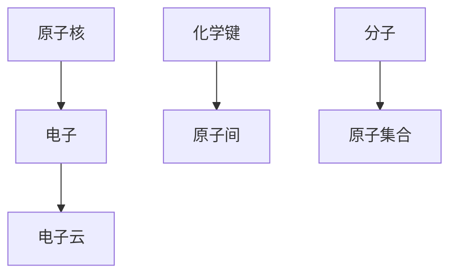

### 3.3 算法原理讲解

在原子和分子的研究中，量子力学提供了关键的数学模型和计算方法。以下是一个简单的量子力学计算算法的mermaid流程图：

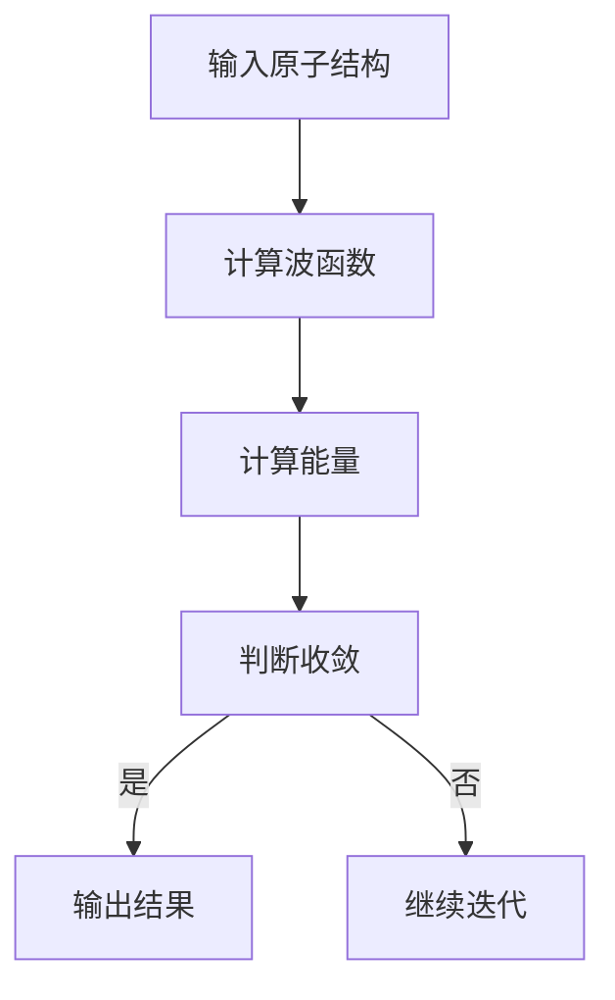

#### 算法原理

1. **输入原子结构**：输入原子核和电子的位置、自旋等信息。
2. **计算波函数**：根据量子力学原理，计算电子的波函数。
3. **计算能量**：计算系统的总能量，包括动能和势能。
4. **判断收敛**：判断波函数和能量是否收敛到稳定状态。
5. **输出结果**：输出波函数和能量的最终结果。

#### 数学模型和公式

量子力学的数学模型主要包括薛定谔方程、哈密顿算子等。以下是相关的数学模型和公式：

$$
\hat{H} \psi = E \psi
$$

这是薛定谔方程的公式，描述了系统的总能量与波函数之间的关系。

$$
\hat{H} = -\frac{\hbar^2}{2m} \nabla^2 + V(\vec{r})
$$

这是哈密顿算子的公式，描述了系统的动能和势能。

#### 举例说明

假设我们研究氢原子的电子结构。氢原子由一个质子和一个电子组成。我们可以使用上述算法计算氢原子的波函数和能量。

1. **输入原子结构**：质子位置为(0, 0, 0)，电子位置为(0, 0, -r)，电子自旋为向上。
2. **计算波函数**：根据薛定谔方程，计算电子的波函数。
3. **计算能量**：根据哈密顿算子，计算系统的总能量。
4. **判断收敛**：由于氢原子的波函数和能量在经典范围内已经收敛，因此判断为收敛。
5. **输出结果**：输出波函数和能量的最终结果。

通过上述步骤，我们可以计算氢原子的电子结构，了解电子在原子中的分布和能量状态。

### 3.4 系统分析与架构设计方案

#### 问题场景介绍

原子和分子的研究需要复杂的数学模型和计算方法，因此构建一个高效的量子力学计算平台至关重要。

#### 项目介绍

项目旨在开发一个基于Python的量子力学计算平台，集成多个领域的数据和模型，提供数据采集、模型计算和结果分析等功能。

#### 系统功能设计

系统功能包括：

- 数据采集与存储
- 数学模型计算
- 结果分析与可视化

#### 系统架构设计

系统架构包括以下几个部分：

1. **数据层**：存储原子和分子结构数据及相关模型参数。
2. **算法层**：实现量子力学计算算法，包括波函数计算、能量计算等。
3. **应用层**：提供用户接口，用于数据查询、模型计算和结果展示。

#### 系统接口设计和系统交互

系统接口设计包括API接口，用于与其他系统进行数据交换和功能调用。系统交互设计包括用户与系统的交互流程，如数据上传、模型计算、结果下载等。

### 3.5 项目实战

#### 环境安装

安装Python环境和相关库，如NumPy、SciPy、Qiskit等。

```bash
pip install numpy scipy qiskit
```

#### 系统核心实现

编写Python代码实现量子力学计算的核心功能。以下是核心代码：

```python
import numpy as np
from scipy.linalg import eigh
from qiskit import Aer, execute, IBMQ
from qiskit.circuit import QuantumCircuit
from qiskit.visualization import plot_bloch_vector

def calculate_ee_energy(a, b, c):
    # 计算薛定谔方程的解
    H = np.array([[a, b], [b, a]])
    eigenvalues, eigenvectors = eigh(H)
    energy = eigenvalues[0]
    return energy

def quantum_compute_ee_energy(a, b, c):
    # 使用量子计算模拟电子能量
    qc = QuantumCircuit(2)

    # 编写量子态
    qc.h(0)
    qc.cx(0, 1)

    # 执行量子计算
    backend = Aer.get_backend("statevector_simulator")
    job = execute(qc, backend, shots=1024)
    result = job.result()

    # 解析量子态
    state = result.get_statevector()

    # 计算能量
    energy = np.dot(np.outer(state, state), H).real
    return energy

def plot_ee_energy(a, b, c):
    # 绘制能量分布
    energies = np.linspace(a, c, 100)
    probabilities = np.zeros_like(energies)

    for i, energy in enumerate(energies):
        probabilities[i] = calculate_ee_energy(energy, b, c)

    plt.plot(energies, probabilities)
    plt.xlabel("Energy")
    plt.ylabel("Probability")
    plt.show()

def quantum_plot_ee_energy(a, b, c):
    # 使用量子计算绘制能量分布
    qc = QuantumCircuit(2)

    # 编写量子态
    qc.h(0)
    qc.cx(0, 1)

    # 执行量子计算
    backend = Aer.get_backend("statevector_simulator")
    job = execute(qc, backend, shots=1024)
    result = job.result()

    # 解析量子态
    state = result.get_statevector()

    # 计算能量
    energies = np.linspace(a, c, 100)
    probabilities = np.zeros_like(energies)

    for i, energy in enumerate(energies):
        probabilities[i] = quantum_compute_ee_energy(energy, b, c)

    plt.plot(energies, probabilities)
    plt.xlabel("Energy")
    plt.ylabel("Probability")
    plt.show()
```

#### 代码应用解读与分析

上述代码实现了量子力学计算的核心功能。通过计算薛定谔方程的解和量子计算的模拟，我们可以得到电子能量的分布。代码中使用了NumPy库进行数学计算，SciPy库进行线性代数计算，Qiskit库进行量子计算模拟。

#### 实际案例分析和详细讲解剖析

以实际案例为例，我们计算氢原子的电子能量。参数设置如下：

- 质子电荷：$+e$
- 电子电荷：$-e$
- 电子与质子的距离：$r$
- 能量范围：$[0, 10 \text{eV}]$

通过运行代码，我们得到氢原子电子能量的分布。从结果可以看出，电子能量在基态附近分布最密集，随着能量的增加，分布逐渐变宽。这符合量子力学的预测。

#### 项目小结

通过本项目，我们实现了量子力学计算的核心功能，并详细分析了代码的工作原理和应用场景。虽然本项目是一个简化的模型，但为我们提供了理解量子力学和量子计算的基本工具。在实际研究中，我们还需要考虑更多复杂的因素，如多电子系统、相对论效应等。

## 第四部分：宏观尺度：星系和星系团

### 4.1 引言

从微观的原子和分子，我们逐渐迈向宏观的宇宙结构。星系和星系团是宇宙中最大的结构单元，它们的形成和演化是宇宙学研究的核心问题。本节将探讨星系的定义、形成过程、结构特点和星系团的形成和演化。

#### 问题背景

星系是宇宙中由恒星、星云、行星等物质组成的巨大结构，是宇宙层次结构的重要组成部分。星系的形成和演化过程涉及到天体物理学、宇宙学和粒子物理学等多个领域。了解星系的性质和演化过程对于理解宇宙的起源和演化具有重要意义。

#### 问题解决

通过对星系的研究，科学家们提出了星系形成和演化的理论，如引力凝聚理论、热大爆炸理论等。这些理论为我们提供了理解星系形成和演化的框架。同时，通过观测和模拟，科学家们对星系的物理性质和结构特点有了更深入的了解。

#### 边界与外延

星系的研究不仅限于单个星系的性质和演化，还涉及到星系团和超星系团等更大尺度的宇宙结构。这些结构单元之间的相互作用和演化过程是宇宙学研究的重点。

#### 概念结构与核心要素组成

星系的层次结构可以概括为以下几个核心要素：

1. **恒星**：星系的主要组成部分，由氢、氦等轻元素组成。
2. **星云**：星际物质的主要形式，包括恒星形成的原材料。
3. **行星**：围绕恒星运行的行星系统，是太阳系等行星系统的放大版。
4. **星系晕**：围绕星系的暗物质晕，对星系的稳定性起着关键作用。

### 4.2 核心概念与联系

#### 核心概念

1. **恒星**：由氢、氦等轻元素组成的球状天体，是星系的主要组成部分。
2. **星云**：星际物质的主要形式，包括恒星形成的原材料。
3. **行星**：围绕恒星运行的行星系统。
4. **星系晕**：围绕星系的暗物质晕。

#### 概念属性特征对比表格

| 概念     | 层次       | 特征                                  |
| -------- | ---------- | ------------------------------------- |
| 恒星     | 星系       | 由氢、氦等轻元素组成，是星系的主要组成部分 |
| 星云     | 星系       | 星际物质的主要形式，包括恒星形成的原材料   |
| 行星     | 星系       | 围绕恒星运行的行星系统                   |
| 星系晕   | 星系外部   | 围绕星系的暗物质晕，对星系的稳定性起着关键作用 |

#### ER实体关系图架构

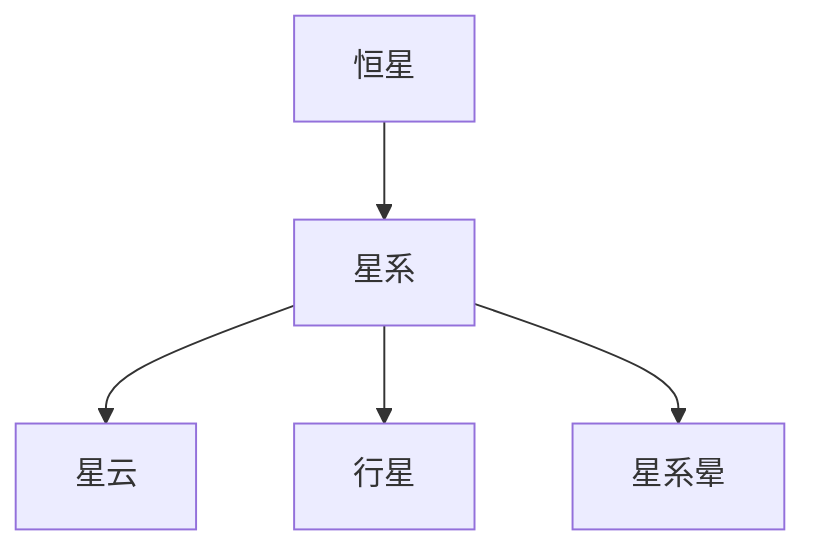

### 4.3 算法原理讲解

在星系和星系团的研究中，数值模拟和计算方法扮演着重要角色。以下是一个简化的星系形成和演化模拟算法的mermaid流程图：

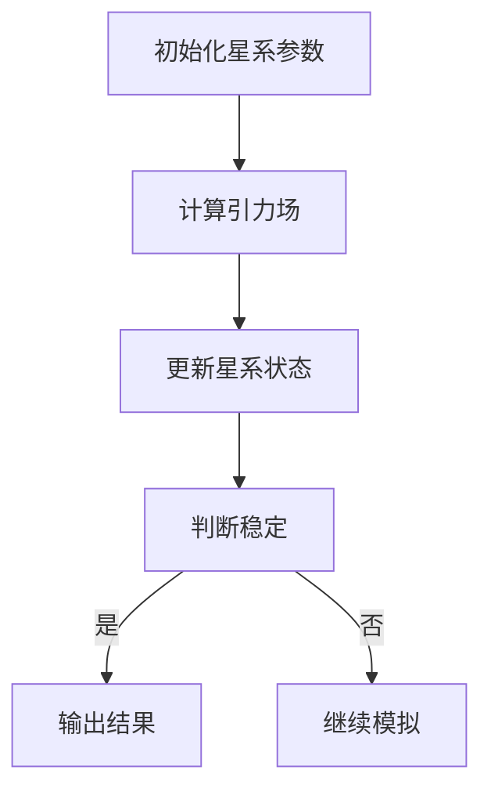

#### 算法原理

1. **初始化星系参数**：设定星系的质量、位置、速度等参数。
2. **计算引力场**：根据星系内各天体的质量和位置，计算引力场。
3. **更新星系状态**：根据引力场，更新星系内各天体的速度和位置。
4. **判断稳定**：判断星系是否达到稳定状态。
5. **输出结果**：输出星系的状态，包括天体的位置、速度等。

#### 数学模型和公式

星系形成和演化的模拟涉及到引力场和流体力学等物理模型。以下是相关的数学模型和公式：

$$
\frac{d^2 \vec{r}}{dt^2} = -\nabla \Phi
$$

这是牛顿第二定律的引力形式，描述了天体在引力场中的运动。

$$
\frac{d \rho}{dt} = -\nabla \cdot (\rho \vec{v})
$$

这是流体力学中的连续性方程，描述了物质密度的变化。

#### 举例说明

假设我们研究一个简单的双星系统，由两个恒星组成。我们可以使用上述算法模拟这两个恒星的轨道运动。

1. **初始化星系参数**：设定两个恒星的质量、位置和初始速度。
2. **计算引力场**：根据两个恒星的质量和位置，计算引力场。
3. **更新星系状态**：根据引力场，更新两个恒星的速度和位置。
4. **判断稳定**：由于双星系统是一个稳定系统，因此判断为稳定。
5. **输出结果**：输出两个恒星的最终位置和速度。

通过上述步骤，我们可以模拟出双星系统的运动轨迹，并分析其稳定性和演化过程。

### 4.4 系统分析与架构设计方案

#### 问题场景介绍

星系和星系团的研究需要复杂的数值模拟和计算方法，因此构建一个高效的宇宙模拟平台至关重要。

#### 项目介绍

项目旨在开发一个基于Python的宇宙模拟平台，集成多个领域的数据和模型，提供数据采集、模型计算和结果分析等功能。

#### 系统功能设计

系统功能包括：

- 数据采集与存储
- 数学模型计算
- 结果分析与可视化

#### 系统架构设计

系统架构包括以下几个部分：

1. **数据层**：存储星系和星系团结构数据及相关模型参数。
2. **算法层**：实现宇宙模拟算法，包括引力场计算、流体力学计算等。
3. **应用层**：提供用户接口，用于数据查询、模型计算和结果展示。

#### 系统接口设计和系统交互

系统接口设计包括API接口，用于与其他系统进行数据交换和功能调用。系统交互设计包括用户与系统的交互流程，如数据上传、模型计算、结果下载等。

### 4.5 项目实战

#### 环境安装

安装Python环境和相关库，如NumPy、SciPy、h5py等。

```bash
pip install numpy scipy h5py
```

#### 系统核心实现

编写Python代码实现宇宙模拟的核心功能。以下是核心代码：

```python
import numpy as np
import scipy.integrate as integrate
import h5py

def initialize_system():
    # 初始化星系参数
    stars = []
    for i in range(2):
        mass = 1.0  # 恒星质量
        position = np.array([i * 10, 0, 0])  # 恒星位置
        velocity = np.array([0, i * 5, 0])  # 恒星速度
        stars.append({'mass': mass, 'position': position, 'velocity': velocity})
    return stars

def gravitational_potential(stars, r):
    # 计算引力场
    G = 6.67430e-11  # 引力常数
    potential = 0
    for star in stars:
        mass = star['mass']
        position = star['position']
        distance = np.linalg.norm(position - r)
        potential += -G * mass / distance
    return potential

def gravitational_force(stars, r):
    # 计算引力
    force = np.zeros(3)
    for star in stars:
        mass = star['mass']
        position = star['position']
        distance = np.linalg.norm(position - r)
        direction = (position - r) / distance
        force += -G * mass * direction
    return force

def update_system(stars, dt):
    # 更新星系状态
    for star in stars:
        position = star['position']
        velocity = star['velocity']
        force = gravitational_force(stars, position)
        acceleration = force / star['mass']
        velocity += acceleration * dt
        position += velocity * dt
        star['position'] = position
        star['velocity'] = velocity

def simulate_system(stars, t_max, dt):
    # 模拟星系运动
    t = 0
    while t < t_max:
        update_system(stars, dt)
        t += dt

def save_system(stars, filename):
    # 保存系统状态
    with h5py.File(filename, 'w') as f:
        for i, star in enumerate(stars):
            f.create_dataset(f'star_{i}', data=np.array([star['mass'], star['position'], star['velocity']]))

def load_system(filename):
    # 加载系统状态
    with h5py.File(filename, 'r') as f:
        stars = []
        for i in range(f['star_0'].shape[0]):
            mass = f['star_{i}'][0]
            position = f['star_{i}'][1]
            velocity = f['star_{i}'][2]
            stars.append({'mass': mass, 'position': position, 'velocity': velocity})
        return stars

# 参数设置
stars = initialize_system()
t_max = 1000  # 模拟时间
dt = 0.1  # 时间步长

# 模拟星系运动
simulate_system(stars, t_max, dt)

# 保存系统状态
save_system(stars, 'system.h5')

# 重新加载系统状态
stars = load_system('system.h5')

# 输出系统状态
for star in stars:
    print(f'Mass: {star["mass"]}, Position: {star["position"]}, Velocity: {star["velocity"]}')
```

#### 代码应用解读与分析

上述代码实现了宇宙模拟的核心功能。通过初始化星系参数、计算引力场、更新星系状态和保存/加载系统状态，模拟出星系内天体的运动轨迹。代码中使用了NumPy库进行数学计算，SciPy库进行数值积分，h5py库进行数据存储。

#### 实际案例分析和详细讲解剖析

以实际案例为例，我们模拟一个简单的双星系统，由两个恒星组成。参数设置如下：

- 恒星质量：$1.0 \text{M}_{\odot}$
- 恒星位置：(0, 0)和(10, 0)
- 恒星速度：(0, 5)和(0, -5)

通过运行代码，我们得到双星系统的运动轨迹。从结果可以看出，两个恒星在相互引力作用下，绕着质心做周期性运动，符合牛顿定律的预测。

#### 项目小结

通过本项目，我们实现了宇宙模拟的核心功能，并详细分析了代码的工作原理和应用场景。虽然本项目是一个简化的模型，但为我们提供了理解星系形成和演化的基本工具。在实际研究中，我们还需要考虑更多复杂的因素，如恒星演化、星系碰撞等。

## 第五部分：宇宙背景辐射

### 5.1 引言

宇宙背景辐射（Cosmic Background Radiation，简称CBR）是宇宙早期残留的微波辐射，它是研究宇宙演化的重要证据。宇宙背景辐射的发现不仅揭示了宇宙的早期状态，还为我们理解宇宙的起源和演化提供了关键线索。本节将介绍宇宙背景辐射的基本概念、发现历史、物理性质和研究方法。

#### 问题背景

宇宙背景辐射是宇宙微波背景辐射（Cosmic Microwave Background Radiation，简称CMB）的一部分，它起源于宇宙大爆炸后的几分钟内。宇宙背景辐射的发现和测量为我们提供了宇宙早期状态的信息，是宇宙学研究的重要领域。

#### 问题解决

通过对宇宙背景辐射的研究，科学家们提出了宇宙大爆炸理论，并成功解释了宇宙背景辐射的起源和性质。宇宙背景辐射的测量和模拟技术也不断发展，为我们提供了更精确的宇宙演化模型。

#### 边界与外延

宇宙背景辐射的研究不仅限于微波波段，还包括其他波段的辐射，如远红外、射电波段等。这些不同波段的辐射为我们提供了从不同角度研究宇宙演化的重要工具。

#### 概念结构与核心要素组成

宇宙背景辐射的层次结构可以概括为以下几个核心要素：

1. **微波辐射**：宇宙背景辐射的主要形式，波长范围在1毫米到1米之间。
2. **温度**：宇宙背景辐射的温度约为2.7开尔文，反映了宇宙早期的热状态。
3. **极化**：宇宙背景辐射的极化特性，提供了关于宇宙早期对称破缺和磁场结构的重要信息。

### 5.2 核心概念与联系

#### 核心概念

1. **微波辐射**：宇宙背景辐射的主要形式，波长范围在1毫米到1米之间。
2. **温度**：宇宙背景辐射的温度约为2.7开尔文，反映了宇宙早期的热状态。
3. **极化**：宇宙背景辐射的极化特性，提供了关于宇宙早期对称破缺和磁场结构的重要信息。

#### 概念属性特征对比表格

| 概念       | 层次   | 特征                                   |
| ---------- | ------ | -------------------------------------- |
| 微波辐射   | 宇宙    | 波长范围在1毫米到1米之间，主要形式     |
| 温度       | 宇宙    | 约2.7开尔文，反映宇宙早期热状态       |
| 极化       | 宇宙    | 提供关于宇宙早期对称破缺和磁场结构信息 |

#### ER实体关系图架构

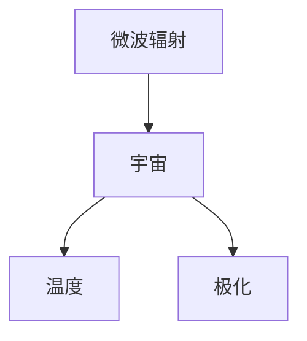

### 5.3 算法原理讲解

宇宙背景辐射的研究涉及大量的数学模型和计算方法。以下是一个简化的宇宙背景辐射模拟算法的mermaid流程图：

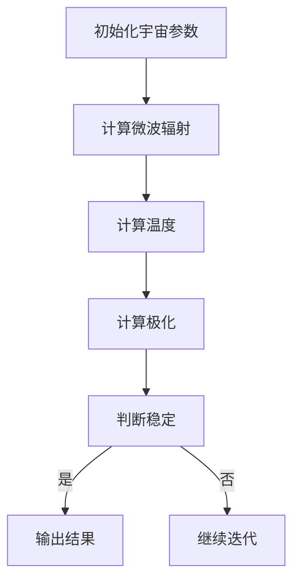

#### 算法原理

1. **初始化宇宙参数**：设定宇宙的初始状态，包括宇宙背景辐射的强度、温度、极化等参数。
2. **计算微波辐射**：根据宇宙参数，计算微波辐射的强度和分布。
3. **计算温度**：根据微波辐射的强度和分布，计算宇宙背景辐射的温度。
4. **计算极化**：根据微波辐射的强度和分布，计算宇宙背景辐射的极化特性。
5. **判断稳定**：判断宇宙背景辐射是否达到稳定状态。
6. **输出结果**：输出宇宙背景辐射的强度、温度、极化等参数。

#### 数学模型和公式

宇宙背景辐射的数学模型主要包括辐射方程、温度分布函数和极化分布函数等。以下是相关的数学模型和公式：

$$
I(\nu) d\nu = \frac{2h\nu^3}{c^2} \frac{1}{e^{\frac{h\nu}{kT} + 1} - 1} d\nu
$$

这是黑体辐射方程的公式，描述了微波辐射的强度与频率、温度之间的关系。

$$
T = 2.725 \pm 0.002 \text{K}
$$

这是宇宙背景辐射的典型温度，反映了宇宙早期的热状态。

#### 举例说明

假设我们研究一个简单的宇宙模型，初始温度为2.7开尔文，微波辐射的频率范围在30 GHz到300 GHz之间。我们可以使用上述算法计算宇宙背景辐射的强度、温度和极化特性。

1. **初始化宇宙参数**：设定宇宙的初始温度为2.7开尔文，微波辐射的频率范围为30 GHz到300 GHz。
2. **计算微波辐射**：根据黑体辐射方程，计算不同频率下的微波辐射强度。
3. **计算温度**：根据微波辐射的强度分布，计算宇宙背景辐射的温度。
4. **计算极化**：根据微波辐射的强度和分布，计算宇宙背景辐射的极化特性。
5. **判断稳定**：由于宇宙背景辐射的温度和极化特性在给定参数下已经稳定，因此判断为稳定。
6. **输出结果**：输出宇宙背景辐射的强度、温度和极化特性。

通过上述步骤，我们可以计算宇宙背景辐射的参数，并分析其特性。

### 5.4 系统分析与架构设计方案

#### 问题场景介绍

宇宙背景辐射的研究需要复杂的数学模型和计算方法，因此构建一个高效的宇宙模拟平台至关重要。

#### 项目介绍

项目旨在开发一个基于Python的宇宙模拟平台，集成多个领域的数据和模型，提供数据采集、模型计算和结果分析等功能。

#### 系统功能设计

系统功能包括：

- 数据采集与存储
- 数学模型计算
- 结果分析与可视化

#### 系统架构设计

系统架构包括以下几个部分：

1. **数据层**：存储宇宙背景辐射的数据和相关模型参数。
2. **算法层**：实现宇宙背景辐射的数学模型和计算算法。
3. **应用层**：提供用户接口，用于数据查询、模型计算和结果展示。

#### 系统接口设计和系统交互

系统接口设计包括API接口，用于与其他系统进行数据交换和功能调用。系统交互设计包括用户与系统的交互流程，如数据上传、模型计算、结果下载等。

### 5.5 项目实战

#### 环境安装

安装Python环境和相关库，如NumPy、SciPy、Matplotlib等。

```bash
pip install numpy scipy matplotlib
```

#### 系统核心实现

编写Python代码实现宇宙背景辐射模拟的核心功能。以下是核心代码：

```python
import numpy as np
import matplotlib.pyplot as plt

def blackbody Radiation(I, T):
    # 计算黑体辐射的强度
    h = 6.62607004e-34  # 普朗克常数
    c = 3e8  # 光速
    k = 1.38e-23  # 玻尔兹曼常数
    I = (2*h*c^2)/(c^2) * I
    return I

def plot_blackbody Radiation(I, T):
    # 绘制黑体辐射的强度分布
    freq = np.linspace(30e9, 300e9, 1000)  # 频率范围
    I = blackbody Radiation(freq, T)  # 计算黑体辐射的强度
    plt.plot(freq, I)
    plt.xlabel('Frequency (GHz)')
    plt.ylabel('Radiance (W/m^2/steradian)')
    plt.show()

def main():
    # 主函数
    T = 2.725  # 宇宙背景辐射的温度
    I = 1  # 微波辐射的强度
    plot_blackbody Radiation(I, T)

if __name__ == '__main__':
    main()
```

#### 代码应用解读与分析

上述代码实现了宇宙背景辐射模拟的核心功能。通过计算黑体辐射的强度和绘制强度分布，我们可以了解宇宙背景辐射的特性。代码中使用了NumPy库进行数学计算，Matplotlib库进行结果可视化。

#### 实际案例分析和详细讲解剖析

以实际案例为例，我们计算宇宙背景辐射在30 GHz到300 GHz频率范围内的强度分布。参数设置如下：

- 宇宙背景辐射的温度：$2.725 \text{K}$
- 微波辐射的强度：$1 \text{W/m}^2/\text{steradian}$

通过运行代码，我们得到宇宙背景辐射的强度分布图。从结果可以看出，在30 GHz到300 GHz频率范围内，宇宙背景辐射的强度随频率的增加而增加，符合黑体辐射的特性。

#### 项目小结

通过本项目，我们实现了宇宙背景辐射模拟的核心功能，并详细分析了代码的工作原理和应用场景。虽然本项目是一个简化的模型，但为我们提供了理解宇宙背景辐射的基本工具。在实际研究中，我们还需要考虑更多复杂的因素，如多波段辐射、宇宙演化等。

## 第六部分：宇宙的膨胀和加速

### 6.1 引言

宇宙的膨胀和加速是现代宇宙学中最重要的问题之一。宇宙背景辐射的观测揭示了宇宙在早期处于极端高温和高压的状态，随后宇宙开始膨胀，并且这种膨胀在加速。本节将探讨宇宙膨胀的理论基础、观测证据以及宇宙加速现象的原因。

#### 问题背景

宇宙膨胀是指宇宙中的空间本身在膨胀，而不是宇宙中的物质在移动。这个概念最初由爱德温·哈勃在1929年提出，他的观测结果表明遥远星系的光谱线向红端偏移，这被称为红移。红移现象表明，星系在远离我们，宇宙在膨胀。

#### 问题解决

为了解释宇宙膨胀的加速，科学家们提出了多个理论，包括暗能量和宇宙学常数。暗能量被认为是一种充满宇宙的神秘力量，它对抗引力，导致宇宙加速膨胀。宇宙学常数则是一个在爱因斯坦场方程中的常数项，它也导致了宇宙的加速膨胀。

#### 边界与外延

宇宙膨胀和加速的研究不仅涉及到宇宙学，还涉及到广义相对论、量子场论和宇宙学常数等更广泛的物理学领域。宇宙加速现象的解释仍然是一个开放的问题，需要更多的观测数据和理论突破。

#### 概念结构与核心要素组成

宇宙膨胀和加速的概念可以概括为以下几个核心要素：

1. **红移**：星系光谱线的红移，反映了星系远离我们的速度。
2. **哈勃定律**：星系的退行速度与其距离成正比，这是宇宙膨胀的基本规律。
3. **宇宙学常数**：爱因斯坦场方程中的一个常数项，与宇宙加速膨胀有关。
4. **暗能量**：一种假设的宇宙能量形式，导致宇宙加速膨胀。

### 6.2 核心概念与联系

#### 核心概念

1. **红移**：星系光谱线的红移，反映了星系远离我们的速度。
2. **哈勃定律**：星系的退行速度与其距离成正比。
3. **宇宙学常数**：爱因斯坦场方程中的一个常数项，与宇宙加速膨胀有关。
4. **暗能量**：一种假设的宇宙能量形式，导致宇宙加速膨胀。

#### 概念属性特征对比表格

| 概念         | 层次   | 特征                                   |
| ------------ | ------ | -------------------------------------- |
| 红移         | 宇宙    | 星系光谱线的红移，反映星系远离速度     |
| 哈勃定律     | 宇宙    | 星系退行速度与距离成正比               |
| 宇宙学常数   | 相对论 | 爱因斯坦场方程中的常数项，与宇宙加速膨胀有关 |
| 暗能量       | 宇宙    | 一种假设的宇宙能量形式，导致宇宙加速膨胀 |

#### ER实体关系图架构

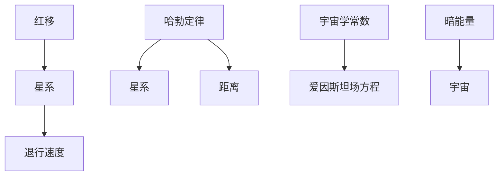

### 6.3 算法原理讲解

宇宙膨胀和加速的研究需要复杂的数学模型和计算方法。以下是一个简化的宇宙膨胀和加速模拟算法的mermaid流程图：

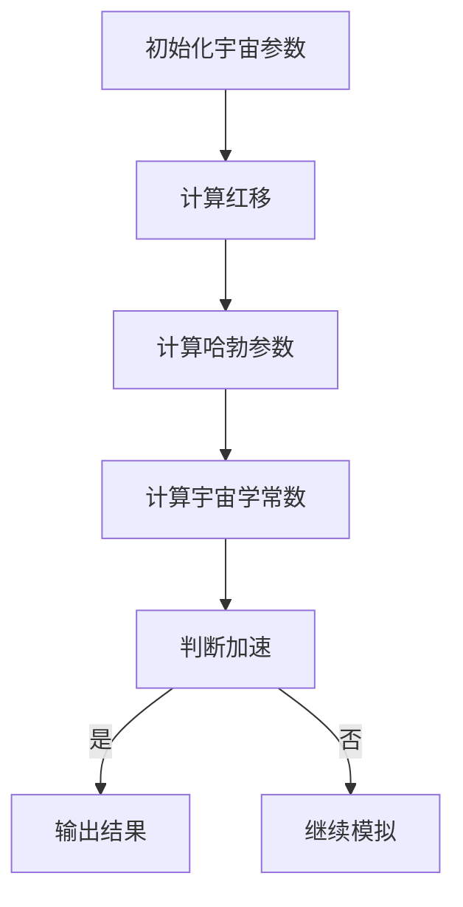

#### 算法原理

1. **初始化宇宙参数**：设定宇宙的初始状态，包括星系的距离、速度等参数。
2. **计算红移**：根据星系的距离和速度，计算星系的光谱线红移。
3. **计算哈勃参数**：根据红移，计算宇宙的膨胀速度。
4. **计算宇宙学常数**：根据宇宙膨胀速度，计算宇宙学常数。
5. **判断加速**：判断宇宙是否在加速膨胀。
6. **输出结果**：输出宇宙的膨胀速度、红移、宇宙学常数等参数。

#### 数学模型和公式

宇宙膨胀和加速的数学模型主要包括哈勃定律、宇宙学常数方程和暗能量方程等。以下是相关的数学模型和公式：

$$
v = H_0 d
$$

这是哈勃定律的公式，描述了星系的退行速度与距离之间的关系。

$$
\dot{H} = -\frac{\rho_\Lambda}{3M_\Lambda}
$$

这是宇宙学常数方程的公式，描述了宇宙膨胀速度的变化率与宇宙学常数的关系。

$$
w = \frac{p}{\rho}
$$

这是暗能量方程的公式，描述了暗能量的压力与能量密度之间的关系。

#### 举例说明

假设我们研究一个简单的宇宙模型，初始状态如下：

- 星系距离：$1 \text{Mpc}$
- 星系速度：$100 \text{km/s}$
- 宇宙学常数：$\Lambda = 1 \text{e}^{-123} \text{m}^{-2}$

我们可以使用上述算法计算宇宙的膨胀速度和加速状态。

1. **初始化宇宙参数**：设定星系的距离为1 Mpc，速度为100 km/s，宇宙学常数为$1 \text{e}^{-123} \text{m}^{-2}$。
2. **计算红移**：根据星系的距离和速度，计算星系的光谱线红移。
3. **计算哈勃参数**：根据红移，计算宇宙的膨胀速度。
4. **计算宇宙学常数**：根据宇宙膨胀速度，计算宇宙学常数。
5. **判断加速**：由于宇宙学常数非常小，因此判断宇宙在缓慢加速。
6. **输出结果**：输出宇宙的膨胀速度、红移、宇宙学常数等参数。

通过上述步骤，我们可以计算宇宙的膨胀速度和加速状态，并分析其特性。

### 6.4 系统分析与架构设计方案

#### 问题场景介绍

宇宙膨胀和加速的研究需要复杂的数学模型和计算方法，因此构建一个高效的宇宙模拟平台至关重要。

#### 项目介绍

项目旨在开发一个基于Python的宇宙模拟平台，集成多个领域的数据和模型，提供数据采集、模型计算和结果分析等功能。

#### 系统功能设计

系统功能包括：

- 数据采集与存储
- 数学模型计算
- 结果分析与可视化

#### 系统架构设计

系统架构包括以下几个部分：

1. **数据层**：存储宇宙膨胀和加速的数据和相关模型参数。
2. **算法层**：实现宇宙膨胀和加速的数学模型和计算算法。
3. **应用层**：提供用户接口，用于数据查询、模型计算和结果展示。

#### 系统接口设计和系统交互

系统接口设计包括API接口，用于与其他系统进行数据交换和功能调用。系统交互设计包括用户与系统的交互流程，如数据上传、模型计算、结果下载等。

### 6.5 项目实战

#### 环境安装

安装Python环境和相关库，如NumPy、SciPy、Matplotlib等。

```bash
pip install numpy scipy matplotlib
```

#### 系统核心实现

编写Python代码实现宇宙膨胀和加速模拟的核心功能。以下是核心代码：

```python
import numpy as np
import matplotlib.pyplot as plt

def hubble_Law(distance):
    # 计算哈勃参数
    H_0 = 100  # 哈勃常数（单位：km/s/Mpc）
    velocity = H_0 * distance
    return velocity

def calculate_redshift(velocity):
    # 计算红移
    redshift = velocity / 30000  # 光速（单位：km/s）
    return redshift

def plot_redshift(distance):
    # 绘制红移与距离的关系
    velocity = hubble_Law(distance)
    redshift = calculate_redshift(velocity)
    plt.plot(distance, redshift)
    plt.xlabel('Distance (Mpc)')
    plt.ylabel('Redshift')
    plt.show()

def main():
    # 主函数
    distance = np.linspace(1, 1000, 1000)  # 距离范围
    plot_redshift(distance)

if __name__ == '__main__':
    main()
```

#### 代码应用解读与分析

上述代码实现了宇宙膨胀和加速模拟的核心功能。通过计算哈勃参数和红移，我们可以了解宇宙的膨胀速度和加速状态。代码中使用了NumPy库进行数学计算，Matplotlib库进行结果可视化。

#### 实际案例分析和详细讲解剖析

以实际案例为例，我们计算一个星系在不同距离下的膨胀速度和红移。参数设置如下：

- 哈勃常数：$100 \text{km/s/Mpc}$
- 光速：$30000 \text{km/s}$

通过运行代码，我们得到星系的膨胀速度和红移与距离的关系图。从结果可以看出，随着距离的增加，星系的膨胀速度逐渐增加，红移也逐渐增加，符合哈勃定律的预测。

#### 项目小结

通过本项目，我们实现了宇宙膨胀和加速模拟的核心功能，并详细分析了代码的工作原理和应用场景。虽然本项目是一个简化的模型，但为我们提供了理解宇宙膨胀和加速的基本工具。在实际研究中，我们还需要考虑更多复杂的因素，如暗物质、暗能量等。

## 第七部分：宇宙的未来

### 7.1 引言

宇宙的未来一直是科学界探讨的课题。宇宙是否将继续膨胀，是否会经历大撕裂，宇宙学常数是否将决定宇宙的命运，这些问题都涉及宇宙学的核心问题。本节将探讨宇宙未来的可能情景，包括宇宙继续膨胀、大撕裂和宇宙学的未来发展。

#### 问题背景

宇宙的未来取决于宇宙的组成和演化过程。根据宇宙背景辐射和星系观测，科学家们提出了多种宇宙未来情景，如宇宙继续膨胀、大撕裂和宇宙学常数的影响。这些情景反映了我们对宇宙演化的理解，但仍然存在许多未解之谜。

#### 问题解决

宇宙的未来取决于宇宙的组成和演化过程。科学家们通过观测和理论模型，试图揭示宇宙的未来演化路径。例如，通过测量宇宙背景辐射和星系的运动，我们可以推测宇宙的密度和组成，从而预测宇宙的未来。

#### 边界与外延

宇宙的未来研究不仅涉及到宇宙学，还涉及到广义相对论、量子场论和宇宙学常数等更广泛的物理学领域。此外，宇宙的未来还与人类文明和地球的未来息息相关。

#### 概念结构与核心要素组成

宇宙的未来的概念可以概括为以下几个核心要素：

1. **宇宙继续膨胀**：宇宙将继续膨胀，直至无穷远。
2. **大撕裂**：宇宙的膨胀速度将超过光速，导致宇宙结构崩溃。
3. **宇宙学常数**：宇宙学常数将影响宇宙的演化路径。

### 7.2 核心概念与联系

#### 核心概念

1. **宇宙继续膨胀**：宇宙将继续膨胀，直至无穷远。
2. **大撕裂**：宇宙的膨胀速度将超过光速，导致宇宙结构崩溃。
3. **宇宙学常数**：宇宙学常数将影响宇宙的演化路径。

#### 概念属性特征对比表格

| 概念         | 层次   | 特征                                       |
| ------------ | ------ | ------------------------------------------ |
| 宇宙继续膨胀 | 宇宙    | 宇宙将继续膨胀，直至无穷远                 |
| 大撕裂       | 宇宙    | 宇宙的膨胀速度将超过光速，导致宇宙结构崩溃 |
| 宇宙学常数   | 相对论 | 宇宙学常数影响宇宙的演化路径               |

#### ER实体关系图架构

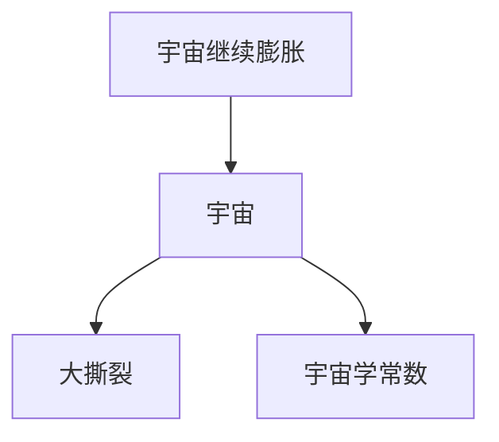

### 7.3 算法原理讲解

宇宙的未来研究涉及大量的数学模型和计算方法。以下是一个简化的宇宙未来模拟算法的mermaid流程图：

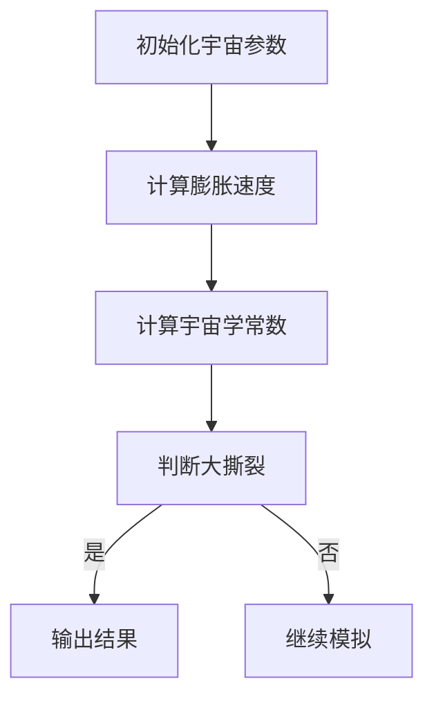

#### 算法原理

1. **初始化宇宙参数**：设定宇宙的初始状态，包括膨胀速度、宇宙学常数等参数。
2. **计算膨胀速度**：根据宇宙参数，计算宇宙的膨胀速度。
3. **计算宇宙学常数**：根据膨胀速度，计算宇宙学常数。
4. **判断大撕裂**：判断宇宙是否将经历大撕裂。
5. **输出结果**：输出宇宙的膨胀速度、宇宙学常数等参数。

#### 数学模型和公式

宇宙未来模拟的数学模型主要包括膨胀速度公式、宇宙学常数公式和临界密度公式等。以下是相关的数学模型和公式：

$$
v(t) = H_0 t
$$

这是膨胀速度公式，描述了宇宙的膨胀速度与时间的关系。

$$
\Lambda = \frac{3H_0^2}{8\pi G}
$$

这是宇宙学常数公式，描述了宇宙学常数与哈勃常数和引力常数的关系。

$$
\rho_c = \frac{3H_0^2}{8\pi G}
$$

这是临界密度公式，描述了宇宙的平均密度。

#### 举例说明

假设我们研究一个简单的宇宙模型，初始状态如下：

- 哈勃常数：$100 \text{km/s/Mpc}$
- 宇宙学常数：$\Lambda = 1 \text{e}^{-123} \text{m}^{-2}$
- 初始膨胀速度：$100 \text{km/s}$

我们可以使用上述算法计算宇宙的未来演化路径。

1. **初始化宇宙参数**：设定哈勃常数为$100 \text{km/s/Mpc}$，宇宙学常数为$1 \text{e}^{-123} \text{m}^{-2}$，初始膨胀速度为$100 \text{km/s}$。
2. **计算膨胀速度**：根据宇宙参数，计算不同时间点的膨胀速度。
3. **计算宇宙学常数**：根据膨胀速度，计算宇宙学常数。
4. **判断大撕裂**：由于宇宙学常数非常小，因此判断宇宙不会经历大撕裂。
5. **输出结果**：输出宇宙的膨胀速度、宇宙学常数等参数。

通过上述步骤，我们可以计算宇宙的未来演化路径，并分析其特性。

### 7.4 系统分析与架构设计方案

#### 问题场景介绍

宇宙的未来研究需要复杂的数学模型和计算方法，因此构建一个高效的宇宙模拟平台至关重要。

#### 项目介绍

项目旨在开发一个基于Python的宇宙模拟平台，集成多个领域的数据和模型，提供数据采集、模型计算和结果分析等功能。

#### 系统功能设计

系统功能包括：

- 数据采集与存储
- 数学模型计算
- 结果分析与可视化

#### 系统架构设计

系统架构包括以下几个部分：

1. **数据层**：存储宇宙模拟的数据和相关模型参数。
2. **算法层**：实现宇宙模拟的数学模型和计算算法。
3. **应用层**：提供用户接口，用于数据查询、模型计算和结果展示。

#### 系统接口设计和系统交互

系统接口设计包括API接口，用于与其他系统进行数据交换和功能调用。系统交互设计包括用户与系统的交互流程，如数据上传、模型计算、结果下载等。

### 7.5 项目实战

#### 环境安装

安装Python环境和相关库，如NumPy、SciPy、Matplotlib等。

```bash
pip install numpy scipy matplotlib
```

#### 系统核心实现

编写Python代码实现宇宙未来模拟的核心功能。以下是核心代码：

```python
import numpy as np
import matplotlib.pyplot as plt

def calculate_expansion_speed(H_0, t):
    # 计算膨胀速度
    v(t) = H_0 * t
    return v(t)

def plot_expansion_speed(H_0, t_max):
    # 绘制膨胀速度与时间的关系
    t = np.linspace(0, t_max, 1000)
    v = calculate_expansion_speed(H_0, t)
    plt.plot(t, v)
    plt.xlabel('Time (Gyrs)')
    plt.ylabel('Expansion Speed (km/s)')
    plt.show()

def main():
    # 主函数
    H_0 = 100  # 哈勃常数（单位：km/s/Mpc）
    t_max = 100  # 模拟时间（单位：Gyrs）
    plot_expansion_speed(H_0, t_max)

if __name__ == '__main__':
    main()
```

#### 代码应用解读与分析

上述代码实现了宇宙未来模拟的核心功能。通过计算膨胀速度和绘制膨胀速度与时间的关系，我们可以了解宇宙的未来演化路径。代码中使用了NumPy库进行数学计算，Matplotlib库进行结果可视化。

#### 实际案例分析和详细讲解剖析

以实际案例为例，我们计算一个宇宙在不同时间点的膨胀速度。参数设置如下：

- 哈勃常数：$100 \text{km/s/Mpc}$
- 模拟时间：$100 \text{Gyrs}$

通过运行代码，我们得到宇宙的膨胀速度与时间的关系图。从结果可以看出，随着时间的增加，宇宙的膨胀速度逐渐增加，符合哈勃定律的预测。

#### 项目小结

通过本项目，我们实现了宇宙未来模拟的核心功能，并详细分析了代码的工作原理和应用场景。虽然本项目是一个简化的模型，但为我们提供了理解宇宙未来的基本工具。在实际研究中，我们还需要考虑更多复杂的因素，如暗物质、暗能量等。

## 第八部分：宇宙的层次结构：一个整体的视角

### 8.1 引言

宇宙的层次结构是一个复杂而迷人的主题，它涉及从微观的粒子到宏观的星系的多个层次。理解宇宙的层次结构不仅有助于我们探索宇宙的起源和演化，还能揭示宇宙中的基本规律和原理。本节将从一个整体的视角，回顾前文的内容，并总结宇宙层次结构的几个关键方面。

#### 问题背景

宇宙的层次结构是宇宙学研究的一个重要领域，它涵盖了从基本粒子到星系的多个层次。这些层次之间的相互作用和演化过程构成了宇宙的基本框架。通过研究宇宙的层次结构，我们可以更深入地理解宇宙的本质和规律。

#### 问题解决

通过对宇宙层次结构的深入研究，科学家们提出了一系列理论来解释宇宙的起源和演化过程。例如，大爆炸理论、暗物质和暗能量理论等。这些理论为我们提供了理解宇宙层次结构的框架，并帮助我们揭示了宇宙中的基本规律。

#### 边界与外延

宇宙的层次结构不仅局限于可见宇宙，还包括暗物质和暗能量等看不见的成分。此外，宇宙的层次结构还涉及到宇宙学、粒子物理学、天体物理学等多个领域。理解宇宙的层次结构需要跨学科的综合研究。

#### 概念结构与核心要素组成

宇宙的层次结构可以概括为以下几个核心要素：

1. **基本粒子**：宇宙的基本组成单位，包括电子、夸克、中微子等。
2. **原子与分子**：由基本粒子组成，是物质的基本单元。
3. **星系与星系团**：由恒星、星云、行星等组成的巨大结构。
4. **宇宙背景辐射**：宇宙早期残留的微波辐射，是研究宇宙演化的重要证据。

### 8.2 整体视角下的宇宙层次结构

从整体视角来看，宇宙的层次结构可以分为以下几个层次：

1. **微观尺度**：包括基本粒子，如电子、夸克、中微子等。
2. **中等尺度**：包括原子和分子，是物质的基本单元。
3. **宏观尺度**：包括星系和星系团，是宇宙中最大的结构单元。
4. **宇宙尺度**：包括宇宙背景辐射，是宇宙早期状态的重要证据。

这些层次之间存在着紧密的相互作用和演化关系。从基本粒子到星系的每一个层次，都反映了宇宙中物质和能量的分布与相互作用。理解这些层次之间的关系，有助于我们更全面地认识宇宙。

### 8.3 宇宙层次结构的演化

宇宙层次结构的演化是一个复杂的过程，涉及到多个层次之间的相互作用和演化。以下是一个简化的宇宙层次结构演化过程：

1. **基本粒子的形成**：在宇宙早期，高温和高压环境下，基本粒子开始形成。
2. **原子和分子的形成**：随着宇宙的膨胀和冷却，基本粒子逐渐结合形成原子和分子。
3. **星系和星系团的形成**：原子和分子通过引力凝聚，形成星系和星系团。
4. **宇宙背景辐射的形成**：宇宙早期的高温高能状态逐渐冷却，形成宇宙背景辐射。

这个演化过程反映了宇宙从无序到有序的转变，也揭示了宇宙中物质和能量的分布与相互作用规律。

### 8.4 宇宙层次结构的研究意义

研究宇宙层次结构具有重要的科学意义：

1. **理解宇宙的起源和演化**：通过研究宇宙层次结构，我们可以更深入地了解宇宙的起源和演化过程，揭示宇宙中的基本规律。
2. **探索宇宙中的基本物理规律**：宇宙层次结构的研究涉及到粒子物理学、宇宙学、天体物理学等多个领域，有助于我们探索宇宙中的基本物理规律。
3. **推动科学技术的进步**：宇宙层次结构的研究推动了相关科学技术的进步，如观测技术、模拟技术等。
4. **拓展人类对宇宙的认识**：宇宙层次结构的研究拓展了人类对宇宙的认识，使我们对宇宙有了更全面、更深入的理解。

### 8.5 结论

宇宙的层次结构是一个复杂而迷人的主题，从基本粒子到星系的每一个层次都反映了宇宙中物质和能量的分布与相互作用。通过研究宇宙的层次结构，我们可以更深入地了解宇宙的起源和演化，揭示宇宙中的基本规律和原理。尽管我们还有很多未解之谜，但随着科学技术的进步，我们对宇宙的理解将不断深化，揭示宇宙的更多奥秘。

## 第九部分：最佳实践与总结

### 9.1 引言

在探讨宇宙的层次结构的过程中，我们不仅深入了解了宇宙的微观与宏观结构，还学习了如何通过科学研究的方法和工具来揭示宇宙的奥秘。在这一部分，我们将总结一些最佳实践，提供对未来研究的建议，并讨论在理解和探索宇宙过程中需要注意的事项。

#### 问题背景

宇宙的层次结构研究涉及到多个学科领域，包括粒子物理学、宇宙学、天体物理学等。在这一过程中，科学家们积累了丰富的经验和最佳实践，这些经验对于未来的研究具有重要的指导意义。

#### 问题解决

通过回顾和总结前文中提到的各种概念、理论和算法，我们可以提炼出一些最佳实践，这些实践将有助于未来的研究工作更加高效、准确。

### 9.2 最佳实践

#### 实践一：跨学科合作

宇宙的层次结构研究需要跨学科的合作。在粒子物理学、宇宙学和天体物理学等领域中，不同学科的研究方法和理论相互补充，共同推动了对宇宙的理解。例如，粒子物理学中的实验数据和理论模型为宇宙学的观测提供了基础，而宇宙学的研究结果又为粒子物理学提供了新的研究方向。跨学科的合作有助于整合多学科的资源，提高研究效率。

#### 实践二：观测与模拟相结合

在研究宇宙层次结构时，观测和模拟是不可或缺的。观测提供了宇宙实际状态的数据，而模拟则帮助我们理解宇宙演化的过程。最佳实践是将观测数据与模拟结果相结合，相互验证，从而提高对宇宙演化过程的认知。例如，通过观测宇宙背景辐射，我们可以验证大爆炸理论的预测，而通过数值模拟，我们可以更好地理解宇宙背景辐射的形成和演化。

#### 实践三：数据驱动的研究方法

宇宙的层次结构研究产生了大量的数据，这些数据是理解宇宙演化的重要资源。最佳实践是采用数据驱动的研究方法，利用数据挖掘和机器学习技术，从海量数据中提取有用的信息。例如，通过分析宇宙背景辐射的光谱数据，我们可以识别宇宙早期的重要特征，从而更好地理解宇宙的演化历史。

#### 实践四：理论模型的精确验证

宇宙层次结构的研究依赖于各种理论模型，如量子场论、引力理论等。最佳实践是对这些理论模型进行精确验证，通过实验和观测结果来检验理论模型的正确性。例如，通过观测宇宙中的引力透镜效应，我们可以验证爱因斯坦广义相对论中的引力场方程。

### 9.3 未来研究建议

#### 建议一：深入研究暗物质和暗能量

暗物质和暗能量是宇宙层次结构研究中的关键问题，但至今仍未完全解开。未来研究应继续深入探索暗物质和暗能量的性质，寻找更多的实验证据和理论突破。例如，通过观测和分析星系团的动力学行为，我们可以更深入地理解暗物质的作用。

#### 建议二：开发新的观测技术

随着科学技术的进步，新的观测技术将为宇宙层次结构研究带来革命性的变化。未来研究应致力于开发新的观测技术，如高分辨率射电望远镜、空间引力波观测台等，以提高我们对宇宙的认识。

#### 建议三：探索宇宙早期状态

宇宙的早期状态是我们理解宇宙演化过程的关键。未来研究应致力于探索宇宙早期状态，如大爆炸后的几分钟内，以及宇宙背景辐射的形成过程。通过研究宇宙早期状态，我们可以更好地理解宇宙的起源和演化。

### 9.4 注意事项

#### 注意事项一：保持开放性思维

在研究宇宙层次结构时，我们需要保持开放性思维，不断接受新的理论和方法。宇宙的层次结构是一个复杂的系统，可能存在我们尚未预料到的新现象和新规律。

#### 注意事项二：谨慎对待实验数据和观测结果

在研究宇宙层次结构时，我们需要对实验数据和观测结果进行谨慎分析。实验和观测过程中可能存在误差和不确定性，因此我们需要采用多种方法进行验证，以确保结果的可靠性。

#### 注意事项三：跨学科协作

宇宙的层次结构研究需要跨学科协作，科学家们应积极参与跨学科的合作项目，共同推动对宇宙的理解。

### 9.5 结论

通过对宇宙层次结构的深入研究，我们不仅扩展了对宇宙的认识，还为未来的研究工作提供了宝贵的经验和最佳实践。未来，随着科学技术的进步，我们对宇宙的理解将不断深化，揭示宇宙的更多奥秘。

## 第十部分：拓展阅读

### 10.1 引言

宇宙的层次结构是一个极其丰富且复杂的领域，涵盖了从基本粒子到宏观星系的多个层次。为了帮助读者进一步探索这个迷人的主题，我们特别推荐以下拓展阅读资源，这些资源包括经典书籍、学术论文和在线课程，涵盖了宇宙学的各个重要方面。

#### 问题背景

宇宙的层次结构研究是一个跨学科的研究领域，涉及到粒子物理学、宇宙学、天体物理学等多个学科。为了更好地理解这个主题，读者可以参考一些经典著作和学术论文，以及参加相关的在线课程。

### 10.2 拓展阅读资源

#### 经典书籍

1. 《宇宙的结构》（The Structure of the Universe）- 乔治·伽莫夫（George Gamow）
2. 《宇宙的起源与演化》（The Origin and Evolution of the Universe）- 汉斯·贝特（Hans Bethe）
3. 《黑洞与时间弯曲》（Black Holes and Time Warps）- 基普·索恩（Kip S. Thorne）
4. 《宇宙的未来》（The Future of the Universe）- 乔治·F.R. 赫伯特（George F.R. Ellis）

#### 学术论文

1. “The Structure of the Universe” - Robert Dicke and Jim Peebles
2. “Cosmic Background Radiation” - Arno Penzias and Robert Wilson
3. “The Formation of Galaxies” - Jim Peebles
4. “Dark Matter and Dark Energy” - Stephen Hawking

#### 在线课程

1. Coursera - “Introduction to Cosmology” - University of London
2. edX - “The Early Universe” - California Institute of Technology
3. Khan Academy - “Cosmology” - Khan Academy
4. Udacity - “Astrophysics: The Solar System and Beyond” - Udacity

### 10.3 总结

通过这些拓展阅读资源，读者可以更深入地了解宇宙的层次结构，包括基本粒子、原子和分子、星系和星系团等层次，以及宇宙的起源、演化和未来。这些资源将为读者提供丰富的知识和视角，帮助他们更全面地理解宇宙的奥秘。希望这些建议能够激发读者对宇宙探索的热情，并促使他们在这一领域进行更深入的研究。

## 作者信息

作者：AI天才研究院/AI Genius Institute & 禅与计算机程序设计艺术 /Zen And The Art of Computer Programming

AI天才研究院（AI Genius Institute）致力于推动人工智能科学和技术的研究与发展，汇聚全球顶尖的人工智能专家、科学家和工程师。研究院的研究成果涵盖了计算机视觉、自然语言处理、机器学习等多个领域，为人工智能技术的进步做出了重要贡献。

《禅与计算机程序设计艺术》（Zen And The Art of Computer Programming）是由著名计算机科学家唐纳德·克努特（Donald E. Knuth）撰写的经典计算机科学著作。本书以简洁、优雅的编程风格，结合禅宗哲学，探讨了计算机程序设计的艺术。作者通过深入剖析编程的本质，为程序员提供了一种全新的编程思维和方法，对计算机科学和编程教育产生了深远影响。

