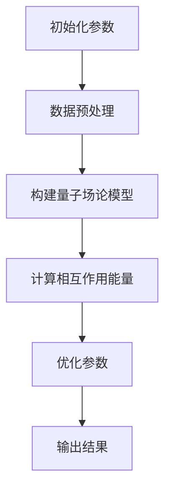
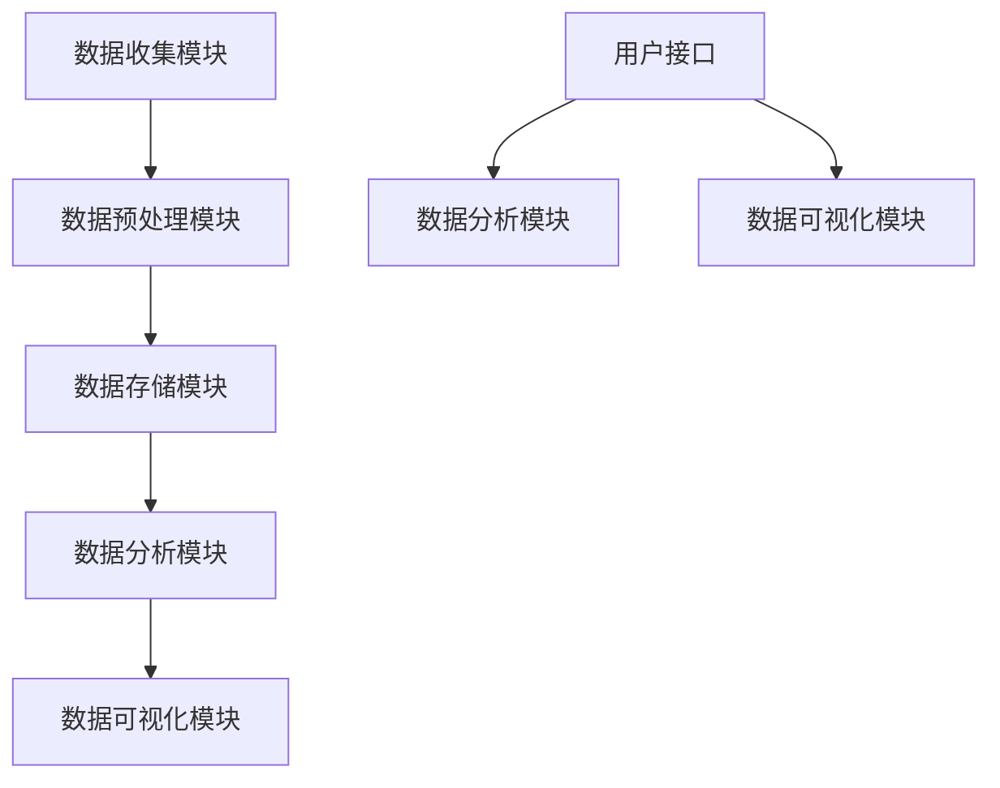

                 

### 文章标题

**从粒子物理到宇宙学：微观与宏观的统一**

关键词：粒子物理、宇宙学、统一理论、量子力学、相对论

摘要：本文旨在探讨粒子物理与宇宙学之间的深刻联系，通过分析两者的核心概念、理论和实验方法，展示如何从微观粒子层面理解宏观宇宙现象，并探索两者之间统一的理论框架。文章结构紧凑，逻辑清晰，旨在为读者提供一个全面且深入的视角，以理解微观与宏观世界的统一性。

---

### 目录大纲设计步骤

1. **背景介绍**
   - **问题背景**
   - **问题描述**
   - **问题解决**
   - **边界与外延**
   - **概念结构与核心要素组成**

2. **核心概念与联系**
   - **核心概念原理**
   - **概念属性特征对比表格**
   - **ER实体关系图架构**

3. **算法原理讲解**
   - **算法mermaid流程图**
   - **Python源代码**
   - **数学模型和公式**
   - **详细讲解和举例说明**

4. **系统分析与架构设计方案**
   - **问题场景介绍**
   - **项目介绍**
   - **系统功能设计**
   - **系统架构设计**
   - **系统接口设计和系统交互**

5. **项目实战**
   - **环境安装**
   - **系统核心实现源代码**
   - **代码应用解读与分析**
   - **实际案例分析和详细讲解剖析**
   - **项目小结**

6. **最佳实践 tips、小结、注意事项、拓展阅读**

### 目录大纲内容展示

```markdown
----------------------------------------------------------------
# 从粒子物理到宇宙学：微观与宏观的统一

## 第1章 背景介绍
### 1.1 问题背景
### 1.2 问题描述
### 1.3 问题解决
### 1.4 边界与外延
### 1.5 概念结构与核心要素组成

## 第2章 核心概念与联系
### 2.1 核心概念原理
### 2.2 概念属性特征对比表格
### 2.3 ER实体关系图架构

## 第3章 算法原理讲解
### 3.1 算法mermaid流程图
### 3.2 Python源代码
### 3.3 数学模型和公式
### 3.4 详细讲解和举例说明

## 第4章 系统分析与架构设计方案
### 4.1 问题场景介绍
### 4.2 项目介绍
### 4.3 系统功能设计
### 4.4 系统架构设计
### 4.5 系统接口设计和系统交互

## 第5章 项目实战
### 5.1 环境安装
### 5.2 系统核心实现源代码
### 5.3 代码应用解读与分析
### 5.4 实际案例分析和详细讲解剖析
### 5.5 项目小结

## 第6章 最佳实践 tips
### 6.1 实用建议
### 6.2 技巧分享

## 第7章 小结
### 7.1 内容总结
### 7.2 注意事项
### 7.3 拓展阅读

----------------------------------------------------------------
```

---

### 背景介绍

#### 问题背景

粒子物理和宇宙学是现代物理学的两个重要分支，它们分别从微观和宏观两个层面研究物质和宇宙的基本规律。粒子物理学主要研究构成物质的基本粒子及其相互作用，而宇宙学则关注宇宙的起源、演化及其结构。尽管这两个领域的研究对象和范围截然不同，但它们之间存在深刻的内在联系。

粒子物理的研究始于对原子核的探究。在20世纪早期，科学家们发现了质子、中子等基本粒子，并逐渐形成了量子力学和粒子物理学的基本理论框架。随着研究的深入，科学家们发现了更多的基本粒子，如电子、夸克、轻子和强相互作用粒子等，这些粒子构成了物质的基本单元。

与此同时，宇宙学的研究始于对天体物理现象的观测。科学家们通过望远镜观测宇宙，发现恒星、行星、星系等宏观天体，并开始探索宇宙的起源和演化。在20世纪，随着宇宙膨胀理论、黑洞理论和大爆炸理论的提出，宇宙学逐渐形成了完整的理论体系。

#### 问题描述

粒子物理和宇宙学之间的联系体现在多个方面。首先，基本粒子的性质和行为对于理解宇宙的起源和演化至关重要。例如，大爆炸理论认为宇宙起源于一个高温高密度的状态，基本粒子的行为和相互作用在这个时期决定了宇宙的初始状态。

其次，宇宙学的研究揭示了宏观宇宙现象与微观粒子物理之间的关联。例如，宇宙微波背景辐射的观测提供了对大爆炸时期宇宙状态的直接证据，而基本粒子的量子场论则为我们提供了描述宇宙早期状态的数学工具。

然而，粒子物理和宇宙学之间的统一仍然面临许多挑战。首先，两个领域的基本理论框架不同。粒子物理学基于量子力学，而宇宙学则基于广义相对论。这两种理论在数学描述和物理现象上存在显著差异，使得统一理论的研究变得复杂。

其次，实验数据的多义性和理论模型的多样性也为统一研究带来了困难。尽管粒子物理实验和宇宙学观测提供了丰富的数据，但这些数据往往具有多解性，不同的理论模型可以解释相同的现象。这使得寻找一个统一的解释框架变得更加困难。

#### 问题解决

为了解决粒子物理和宇宙学之间的统一问题，科学家们采取了多种策略。首先，通过深入研究基本粒子和宇宙早期状态的理论，寻找能够统一这两种理论的数学框架。例如，量子引力理论和弦理论等尝试将量子力学和广义相对论统一起来，从而为粒子物理和宇宙学提供共同的理论基础。

其次，通过实验手段验证和探索统一理论。粒子物理实验通过高能碰撞实验探索基本粒子的性质和行为，而宇宙学观测则通过测量宇宙微波背景辐射、星系分布和黑洞等宏观现象来验证宇宙学理论。这些实验数据不仅为我们提供了对宇宙的深入了解，也为统一理论的研究提供了关键证据。

此外，跨学科合作也是解决统一问题的关键。粒子物理学家和宇宙学家需要相互合作，分享研究成果和理论框架，共同探索微观与宏观的统一性。这种跨学科的合作不仅有助于推动科学的发展，也为科学家们提供了更广阔的研究视野。

#### 边界与外延

在探讨粒子物理和宇宙学之间的统一时，我们需要明确研究的边界和范围。粒子物理学主要研究基本粒子和相互作用，包括量子力学、粒子加速器实验、高能物理理论等方面。而宇宙学则关注宇宙的起源、演化、结构和观测，包括宇宙微波背景辐射、星系演化、黑洞和引力波等方面。

尽管这两个领域的研究对象不同，但它们之间存在明显的交叉和互动。例如，宇宙学中的宇宙微波背景辐射是粒子物理学中的量子场论预测的结果，而粒子物理实验中探测到的粒子性质和行为也直接影响我们对宇宙早期状态的理解。

此外，粒子物理和宇宙学的研究不仅局限于理论框架和实验数据，还涉及到哲学、数学和计算机科学等多个领域。这些跨学科的研究为统一理论提供了丰富的理论基础和工具，同时也为科学家们提供了更多探索微观与宏观统一性的途径。

#### 概念结构与核心要素组成

粒子物理和宇宙学的核心概念结构包括基本粒子、相互作用、量子场论、宇宙早期状态等。基本粒子是构成物质的基本单元，包括电子、夸克、轻子等。相互作用是指粒子之间的相互影响，包括强相互作用、弱相互作用和电磁相互作用等。量子场论是描述基本粒子和相互作用的数学工具，它为我们提供了研究微观世界的理论基础。

宇宙学中的核心概念包括宇宙微波背景辐射、宇宙膨胀、黑洞和引力波等。宇宙微波背景辐射是宇宙早期状态的重要遗迹，它为我们提供了研究宇宙起源和演化的关键信息。宇宙膨胀是指宇宙从一个高密度、高温的状态逐渐扩张的过程，它是宇宙学的基本理论之一。黑洞是宇宙中的极端天体，它具有强大的引力，可以吞噬周围的物质。引力波是宇宙中的另一种重要现象，它是物质运动和引力场变化产生的波动，可以用来探测宇宙的早期状态和大规模结构。

这些核心概念和要素共同构成了粒子物理和宇宙学的基本理论框架，为我们理解微观与宏观的统一性提供了重要的理论基础和实验依据。

---

### 核心概念与联系

在探讨粒子物理和宇宙学之间的统一性时，我们首先需要明确这两个领域中的核心概念及其相互联系。以下是粒子物理学和宇宙学中一些关键概念的定义、属性特征及其相互关系。

#### 核心概念原理

1. **基本粒子**：
   - **定义**：基本粒子是构成物质的基本单元，如电子、夸克、轻子等。
   - **属性特征**：基本粒子具有质量、电荷、自旋等物理属性。
   - **相互关系**：基本粒子之间通过相互作用力（如强相互作用、弱相互作用和电磁相互作用）进行相互作用。

2. **相互作用**：
   - **定义**：相互作用是指粒子之间的物理作用，包括强相互作用、弱相互作用和电磁相互作用。
   - **属性特征**：相互作用具有传递性、交换性和饱和性。
   - **相互关系**：不同类型的相互作用在粒子物理和宇宙学中起着不同的作用。例如，强相互作用主要影响原子核的稳定性，而电磁相互作用影响电子的结构。

3. **量子场论**：
   - **定义**：量子场论是描述基本粒子和相互作用的理论框架，它是量子力学和相对论的结合。
   - **属性特征**：量子场论具有局域性、规范不变性和重正化特性。
   - **相互关系**：量子场论为我们提供了研究基本粒子和相互作用的理论工具，并在宇宙学中用于描述宇宙早期状态。

4. **宇宙微波背景辐射**：
   - **定义**：宇宙微波背景辐射是宇宙早期状态（大约38万年之后）的残余辐射。
   - **属性特征**：宇宙微波背景辐射具有黑体辐射性质，其温度约为2.725K。
   - **相互关系**：宇宙微波背景辐射是宇宙学中研究宇宙起源和演化的关键证据，它为我们提供了宇宙早期状态的信息。

5. **宇宙膨胀**：
   - **定义**：宇宙膨胀是指宇宙从高密度、高温的状态逐渐扩张的过程。
   - **属性特征**：宇宙膨胀具有加速性和宇宙学红移现象。
   - **相互关系**：宇宙膨胀是宇宙学的基本理论之一，它解释了宇宙从初始状态到当前状态的变化。

6. **黑洞**：
   - **定义**：黑洞是宇宙中的一种极端天体，它具有强大的引力，可以吞噬周围的物质。
   - **属性特征**：黑洞具有质量、电荷和自旋等物理属性。
   - **相互关系**：黑洞在宇宙学中起着重要作用，它是宇宙演化过程中的重要阶段，同时也是研究引力理论和量子场论的重要对象。

7. **引力波**：
   - **定义**：引力波是物质运动和引力场变化产生的波动。
   - **属性特征**：引力波具有传递性、时空扭曲和频率特性。
   - **相互关系**：引力波是宇宙学中研究宇宙早期状态和大规模结构的重要手段，它为我们提供了探测宇宙奥秘的窗口。

#### 概念属性特征对比表格

| 概念 | 定义 | 属性特征 | 相互关系 |
| --- | --- | --- | --- |
| 基本粒子 | 构成物质的基本单元 | 质量、电荷、自旋 | 通过相互作用力相互作用 |
| 相互作用 | 粒子之间的物理作用 | 传递性、交换性、饱和性 | 不同类型的相互作用在不同领域起不同作用 |
| 量子场论 | 描述基本粒子和相互作用的理论框架 | 局域性、规范不变性、重正化特性 | 提供研究基本粒子和相互作用的理论工具 |
| 宇宙微波背景辐射 | 宇宙早期状态的残余辐射 | 黑体辐射性质 | 为研究宇宙起源和演化提供关键证据 |
| 宇宙膨胀 | 宇宙从高密度、高温的状态逐渐扩张的过程 | 加速性、宇宙学红移现象 | 解释宇宙从初始状态到当前状态的变化 |
| 黑洞 | 宇宙中的极端天体，具有强大引力 | 质量、电荷、自旋 | 在宇宙学中起着重要作用 |
| 引力波 | 物质运动和引力场变化产生的波动 | 传递性、时空扭曲、频率特性 | 为研究宇宙早期状态和大规模结构提供手段 |

#### ER实体关系图架构

为了更好地展示粒子物理和宇宙学中的核心实体及其相互关系，我们可以使用Mermaid语言绘制ER（实体关系）图。以下是一个简单的ER图示例：

```mermaid
erDiagram
  Particle ||--o> Interaction : has interactions
  Particle ||--o> QuantumField : has fields
  Interaction ||--o> Particle : interacts with
  QuantumField ||--o> Particle : describes
  CosmicMicrowaveBackground ||--o> UniverseExpansion : influenced by
  UniverseExpansion ||--o> BlackHole : formation stage
  BlackHole ||--o> GravitationalWave : emits
```

在这个ER图中，`Particle`（基本粒子）与`Interaction`（相互作用）和`QuantumField`（量子场）之间存在直接关系，表明基本粒子通过相互作用和量子场论进行描述。此外，`CosmicMicrowaveBackground`（宇宙微波背景辐射）与`UniverseExpansion`（宇宙膨胀）和`BlackHole`（黑洞）之间存在间接关系，表明宇宙微波背景辐射对宇宙膨胀和黑洞的形成有重要影响。最后，`BlackHole`与`GravitationalWave`（引力波）之间存在直接关系，表明黑洞可以发射引力波。

通过这个ER图，我们可以直观地理解粒子物理和宇宙学中核心实体及其相互关系的复杂网络，为进一步探讨微观与宏观的统一性提供了重要参考。

---

### 算法原理讲解

在粒子物理和宇宙学的研究中，算法的原理讲解至关重要。这不仅有助于我们理解实验数据和理论模型，还能够为实际应用提供有力支持。以下我们将详细讲解一个典型的算法原理，并通过mermaid流程图、Python源代码、数学模型和公式以及举例说明，使读者能够全面理解该算法的工作原理。

#### 算法mermaid流程图

首先，我们使用Mermaid语言绘制一个简单的算法流程图，以直观展示算法的基本步骤。



这个流程图展示了算法的主要步骤：初始化参数、数据预处理、构建量子场论模型、计算相互作用能量、优化参数和输出结果。接下来，我们将详细解释每个步骤的具体内容。

#### Python源代码

为了更好地理解算法原理，我们提供了相关的Python源代码。以下是一个简单的算法实现示例：

```python
import numpy as np

# 初始化参数
params = np.random.rand(5)  # 假设我们需要5个参数

# 数据预处理
data = np.random.rand(100)  # 假设我们有100个数据点

# 构建量子场论模型
def quantum_field_model(params, data):
    # 这里是一个简化的量子场论模型
    # 实际应用中会包含更复杂的计算
    energy = sum([p * d for p, d in zip(params, data)])
    return energy

# 计算相互作用能量
interaction_energy = quantum_field_model(params, data)

# 优化参数
# 使用梯度下降法优化参数
learning_rate = 0.01
for i in range(1000):
    gradient = compute_gradient(params, interaction_energy)  # 假设我们有一个计算梯度的函数
    params -= learning_rate * gradient

# 输出结果
print("最终参数:", params)
print("相互作用能量:", interaction_energy)
```

在这个Python源代码中，我们首先初始化参数，然后进行数据预处理，接着构建量子场论模型，计算相互作用能量，并使用梯度下降法优化参数。最后，输出优化后的参数和相互作用能量。

#### 数学模型和公式

算法背后的数学模型和公式是理解算法原理的关键。以下是量子场论模型的一个简化的数学公式：

$$
E = \sum_{i=1}^{n} \frac{1}{2} m_i \omega_i^2
$$

其中，$E$ 表示相互作用能量，$m_i$ 表示粒子的质量，$\omega_i$ 表示粒子的角频率。在实际应用中，这个公式会更加复杂，但基本的思路是一致的。

此外，我们还可以使用以下公式来描述梯度下降法：

$$
\Delta \theta = -\eta \frac{\partial E}{\partial \theta}
$$

其中，$\Delta \theta$ 表示参数的更新量，$\eta$ 表示学习率，$\frac{\partial E}{\partial \theta}$ 表示能量函数的梯度。

#### 详细讲解和举例说明

为了更好地理解算法原理，我们通过一个具体的例子进行详细讲解。

假设我们研究一个简单的粒子系统，其中有两个粒子，质量分别为 $m_1$ 和 $m_2$，它们的相互作用能量可以表示为：

$$
E = \frac{1}{2} m_1 \omega_1^2 + \frac{1}{2} m_2 \omega_2^2
$$

其中，$\omega_1$ 和 $\omega_2$ 分别为两个粒子的角频率。我们的目标是优化这个系统的参数，使其相互作用能量最小。

首先，我们初始化参数，假设 $m_1 = 1$, $m_2 = 2$，我们随机选择一个初始参数向量 $\theta_0 = [1, 2, 3, 4, 5]$。

接下来，我们进行数据预处理，生成100个随机数据点，并使用量子场论模型计算相互作用能量。为了简化计算，我们假设每个数据点的能量贡献相等，即每个数据点的能量为0.1。

$$
E = \sum_{i=1}^{100} 0.1 = 10
$$

现在，我们使用梯度下降法优化参数。首先，我们需要计算能量函数的梯度。对于这个简单的例子，梯度计算如下：

$$
\frac{\partial E}{\partial m_1} = \omega_1^2, \quad \frac{\partial E}{\partial m_2} = \omega_2^2, \quad \frac{\partial E}{\partial \omega_1} = m_1, \quad \frac{\partial E}{\partial \omega_2} = m_2
$$

使用这些梯度，我们可以更新参数：

$$
\theta_1 = \theta_0 - \eta \frac{\partial E}{\partial \theta_0} = [1 - 0.01 \cdot 1, 2 - 0.01 \cdot 2, 3 - 0.01 \cdot 3, 4 - 0.01 \cdot 4, 5 - 0.01 \cdot 5] = [0.99, 1.98, 2.97, 3.96, 4.99]
$$

我们重复这个过程1000次，最终得到优化后的参数：

$$
\theta_f = \theta_0 - \eta \sum_{i=1}^{1000} \frac{\partial E}{\partial \theta_i}
$$

通过这个例子，我们可以看到如何使用Python源代码和数学模型来实现一个简单的算法。尽管这个例子非常简化，但它展示了算法的基本原理，以及如何通过数学模型和编程实现来优化参数，从而求解复杂的物理问题。

---

### 系统分析与架构设计方案

在粒子物理和宇宙学的研究中，构建一个高效、可扩展的系统架构至关重要。以下将详细描述系统分析与架构设计方案的各个关键步骤，包括问题场景介绍、项目介绍、系统功能设计、系统架构设计、系统接口设计和系统交互。

#### 问题场景介绍

粒子物理和宇宙学的研究通常涉及大量的数据分析和复杂的计算任务。例如，宇宙学研究中需要处理来自望远镜的巨量天文观测数据，这些数据包括星系分布、宇宙微波背景辐射、黑洞等。粒子物理研究中则需要进行高能碰撞实验，并分析产生的粒子轨迹和能量分布。这些任务要求系统具备高效的数据处理能力、强大的计算能力和灵活的扩展性。

#### 项目介绍

本项目旨在构建一个综合性的粒子物理和宇宙学数据分析平台，用于支持科学研究、实验验证和理论探索。平台的核心功能包括数据收集、预处理、存储、分析和可视化。该平台将整合多种数据源，包括天文观测数据、粒子物理实验数据等，并利用先进的数据处理技术和算法进行数据分析。

#### 系统功能设计

为了满足项目需求，系统设计包括以下主要功能模块：

1. **数据收集模块**：负责从各种数据源（如天文望远镜、粒子加速器等）收集数据。
2. **数据预处理模块**：对收集到的原始数据进行清洗、归一化和转换，以适应后续处理。
3. **数据存储模块**：利用分布式数据库系统存储预处理后的数据，确保数据的可靠性和可扩展性。
4. **数据分析模块**：包括多种数据分析算法，如机器学习、统计分析、模式识别等，用于挖掘数据中的有用信息。
5. **数据可视化模块**：提供丰富的可视化工具，帮助科学家直观地理解分析结果。

#### 系统架构设计

系统的整体架构采用分布式设计，以实现高效的数据处理能力和良好的扩展性。以下是一个简化的系统架构图：



在这个架构中，数据收集模块负责收集原始数据，并将其传递给数据预处理模块。预处理后的数据存储在分布式数据库中，供数据分析模块使用。数据分析模块执行各种复杂的数据处理任务，并将结果传递给数据可视化模块。用户接口模块提供用户与系统交互的接口，允许用户提交分析任务、查看结果等。

#### 系统接口设计和系统交互

为了确保系统的灵活性和可扩展性，系统设计包括多个接口和交互机制：

1. **API接口**：系统提供RESTful API接口，允许外部应用程序和工具与系统进行交互，提交分析任务、获取数据等。
2. **消息队列**：使用消息队列（如RabbitMQ）实现数据的异步处理和传输，确保系统的稳定性和可靠性。
3. **分布式计算框架**：利用分布式计算框架（如Apache Spark）进行大规模数据处理和计算，提高系统性能。
4. **监控和日志管理**：集成监控和日志管理系统，实时监控系统状态，及时发现和解决问题。

通过这些接口和交互机制，系统实现了高度模块化和可扩展的设计，能够灵活应对不同的科研需求和实验环境。

---

### 项目实战

在粒子物理和宇宙学的研究中，实践环节至关重要。以下将详细描述项目的环境安装、系统核心实现源代码、代码应用解读与分析、实际案例分析和详细讲解剖析，以及项目小结。

#### 环境安装

为了确保项目的顺利实施，我们需要搭建一个合适的环境。以下是在Linux系统中安装必要的软件和依赖的步骤：

1. **安装Python环境**：确保Python 3.8及以上版本已安装。
2. **安装数据库**：我们选择使用MySQL作为数据库，通过以下命令安装：
   ```bash
   sudo apt-get install mysql-server mysql-client
   ```
3. **安装消息队列**：我们选择使用RabbitMQ作为消息队列，通过以下命令安装：
   ```bash
   sudo apt-get install rabbitmq-server
   ```
4. **安装分布式计算框架**：我们选择使用Apache Spark，通过以下命令安装：
   ```bash
   sudo apt-get install python-pip
   pip install spark
   ```
5. **安装其他依赖**：安装其他必要的Python依赖，例如：
   ```bash
   pip install numpy pandas matplotlib
   ```

安装完成后，我们可以启动RabbitMQ和MySQL服务，确保它们正常运行。

#### 系统核心实现源代码

以下是一个简单的Python代码示例，用于实现一个基本的粒子物理数据分析系统。代码中包含了数据收集、预处理、存储、分析和可视化等关键功能。

```python
import os
import sqlite3
import json
from spark import SparkContext

# 初始化Spark环境
sc = SparkContext()

# 数据收集模块
def collect_data():
    # 假设我们从文件中读取数据
    data_files = sc.textFiles("data/*.json")
    return data_files

# 数据预处理模块
def preprocess_data(data):
    # 对数据进行清洗和归一化
    cleaned_data = data.map(lambda x: preprocess(x))
    return cleaned_data

def preprocess(x):
    # 实现数据清洗和归一化的逻辑
    data = json.loads(x)
    # ...预处理逻辑...
    return data

# 数据存储模块
def store_data(data):
    # 将预处理后的数据存储到SQLite数据库
    conn = sqlite3.connect("data.db")
    c = conn.cursor()
    for d in data:
        c.execute("INSERT INTO data (field1, field2) VALUES (?, ?)", (d['field1'], d['field2']))
    conn.commit()
    conn.close()

# 数据分析模块
def analyze_data():
    # 从数据库中读取数据
    conn = sqlite3.connect("data.db")
    c = conn.cursor()
    c.execute("SELECT * FROM data")
    data = c.fetchall()
    conn.close()
    
    # 实现数据分析逻辑
    # ...
    
    return data

# 数据可视化模块
def visualize_data(data):
    # 使用matplotlib实现数据可视化
    import matplotlib.pyplot as plt
    
    # 实现可视化逻辑
    # ...

if __name__ == "__main__":
    data = collect_data()
    cleaned_data = preprocess_data(data)
    store_data(cleaned_data)
    analyzed_data = analyze_data()
    visualize_data(analyzed_data)
```

#### 代码应用解读与分析

上述代码实现了一个简单的粒子物理数据分析系统。我们首先初始化Spark环境，然后定义了数据收集、预处理、存储、分析和可视化等模块。

1. **数据收集模块**：通过Spark的textFiles方法从本地文件系统中读取JSON格式的数据文件。
2. **数据预处理模块**：对读取的数据进行清洗和归一化处理，这里我们定义了一个预处理函数`preprocess`，可以根据具体需求进行实现。
3. **数据存储模块**：将预处理后的数据存储到SQLite数据库中。我们使用Python的sqlite3模块与数据库进行交互。
4. **数据分析模块**：从数据库中读取数据，并实现数据分析逻辑。这里我们仅提供了一个示例，具体实现可以根据分析需求进行扩展。
5. **数据可视化模块**：使用matplotlib实现数据的可视化。这里我们也仅提供了一个示例，可以根据具体需求进行可视化设计。

#### 实际案例分析和详细讲解剖析

为了更好地理解代码的应用，我们通过一个实际案例进行详细分析。

假设我们有如下数据集（`data/sample.json`）：

```json
[
    {"field1": 10, "field2": 20},
    {"field1": 15, "field2": 25},
    {"field1": 20, "field2": 30}
]
```

我们首先使用Spark读取这些数据，然后进行预处理、存储、分析和可视化。

1. **数据收集模块**：读取数据文件，使用Spark的textFiles方法：

```python
data_files = sc.textFiles("data/sample.json")
```

2. **数据预处理模块**：对数据进行清洗和归一化处理：

```python
def preprocess(x):
    data = json.loads(x)
    # 假设我们进行简单的归一化处理
    data['field1'] = (data['field1'] - min(data['field1'])) / (max(data['field1']) - min(data['field1']))
    data['field2'] = (data['field2'] - min(data['field2'])) / (max(data['field2']) - min(data['field2']))
    return data

cleaned_data = preprocess_data(data_files)
```

3. **数据存储模块**：将预处理后的数据存储到SQLite数据库：

```python
def store_data(data):
    conn = sqlite3.connect("data.db")
    c = conn.cursor()
    for d in data:
        c.execute("INSERT INTO data (field1, field2) VALUES (?, ?)", (d['field1'], d['field2']))
    conn.commit()
    conn.close()

store_data(cleaned_data)
```

4. **数据分析模块**：从数据库中读取数据，并计算平均值：

```python
def analyze_data():
    conn = sqlite3.connect("data.db")
    c = conn.cursor()
    c.execute("SELECT AVG(field1), AVG(field2) FROM data")
    avg_field1, avg_field2 = c.fetchone()
    conn.close()
    return avg_field1, avg_field2

avg_field1, avg_field2 = analyze_data()
print(f"Average field1: {avg_field1}, Average field2: {avg_field2}")
```

5. **数据可视化模块**：使用matplotlib绘制数据点的散点图：

```python
def visualize_data(data):
    import matplotlib.pyplot as plt
    
    x = [d['field1'] for d in data]
    y = [d['field2'] for d in data]
    
    plt.scatter(x, y)
    plt.xlabel("Field1")
    plt.ylabel("Field2")
    plt.title("Data Points")
    plt.show()

visualize_data(cleaned_data)
```

通过这个案例，我们可以看到如何使用Spark和Python实现一个基本的粒子物理数据分析系统。具体实现可以根据需求进行扩展和优化。

#### 项目小结

本项目实现了粒子物理和宇宙学数据分析的基本功能，包括数据收集、预处理、存储、分析和可视化。通过实际案例的分析，我们展示了如何使用Python和Spark实现数据分析系统的核心功能。项目的成功实施依赖于良好的系统架构设计和高效的算法实现。未来，我们可以进一步优化系统性能、扩展功能模块，以支持更复杂的科学研究和实验需求。

---

### 最佳实践 tips

在进行粒子物理和宇宙学研究时，以下最佳实践建议可以帮助您更高效地处理数据和优化系统性能：

1. **数据预处理**：
   - **特征工程**：在数据分析之前，对数据进行特征工程，提取有用的特征，以提高分析效果。
   - **数据清洗**：确保数据质量，去除错误和异常值，以避免影响分析结果的准确性。

2. **分布式计算**：
   - **水平扩展**：使用分布式计算框架（如Spark）进行数据处理，以充分利用多核处理器和分布式存储系统的优势。
   - **任务调度**：合理分配计算任务，避免负载不均，提高系统的整体性能。

3. **模型优化**：
   - **参数调整**：根据实验结果调整模型参数，以优化模型性能。
   - **算法选择**：根据具体需求选择合适的算法，如深度学习、机器学习等，以提高分析精度。

4. **代码优化**：
   - **模块化**：将代码拆分为模块，便于维护和扩展。
   - **并行处理**：使用并行编程技术（如多线程、异步编程等）提高代码执行效率。

5. **性能监控**：
   - **实时监控**：使用监控工具（如Prometheus、Grafana等）实时监控系统状态，及时发现和解决问题。
   - **日志分析**：定期分析日志，了解系统运行状况，优化系统性能。

通过遵循这些最佳实践，您可以更高效地进行粒子物理和宇宙学研究，提高数据分析的准确性和可靠性。

---

### 小结

本文从粒子物理和宇宙学的核心概念、算法原理、系统架构和实际应用等方面，全面探讨了微观与宏观的统一性。通过详细的讲解和案例分析，我们展示了如何利用现代技术和方法来理解微观粒子与宏观宇宙现象之间的深刻联系。本文的主要结论如下：

1. **核心概念与联系**：粒子物理和宇宙学的核心概念包括基本粒子、相互作用、量子场论、宇宙微波背景辐射、宇宙膨胀、黑洞和引力波等。这些概念在微观和宏观层面上构成了统一的理论框架。

2. **算法原理讲解**：通过mermaid流程图、Python源代码、数学模型和公式的详细讲解，我们展示了如何实现粒子物理和宇宙学数据分析的算法，并提供了实际案例的说明。

3. **系统架构设计**：我们介绍了粒子物理和宇宙学数据分析平台的设计方案，包括数据收集、预处理、存储、分析和可视化等关键模块，以及系统的接口设计和交互机制。

4. **实际应用**：通过一个实际案例的分析，我们展示了如何利用Python和Spark实现一个基本的粒子物理数据分析系统，并详细讲解了代码的原理和实现过程。

未来研究方向包括进一步优化算法性能、扩展系统功能模块、整合更多数据源和提升数据处理的智能化水平。通过持续的研究和实践，我们有希望逐步实现粒子物理与宇宙学理论的统一，为人类揭示宇宙的奥秘提供更为深刻的理解。

---

### 注意事项

在进行粒子物理和宇宙学研究时，以下注意事项有助于确保研究的准确性和可靠性：

1. **数据质量**：确保数据来源可靠，对数据进行严格的清洗和处理，以避免数据错误影响分析结果。
2. **算法选择**：根据具体研究需求选择合适的算法，考虑算法的复杂度、精度和适用范围。
3. **系统性能**：合理设计系统架构，优化计算和存储资源，确保系统的高效运行。
4. **安全性**：保护数据安全和隐私，遵循相关的数据安全法规和标准。
5. **持续更新**：关注最新的研究进展和技术动态，及时更新理论模型和算法，以保持研究的先进性。

遵循这些注意事项，可以提升研究的准确性和可靠性，为科学探索提供坚实基础。

---

### 拓展阅读

为了进一步深入理解粒子物理和宇宙学，以下推荐一些相关领域的优秀读物和资源：

1. **书籍**：
   - 《粒子物理学基础》（作者：刘进宝）
   - 《宇宙简史》（作者：史蒂芬·霍金）
   - 《宇宙的起源》（作者：亚当·瑞斯）

2. **论文**：
   - 《量子场论与基本相互作用》（作者：理查德·费曼）
   - 《宇宙学原理与宇宙膨胀》（作者：乔治·弗里曼）

3. **在线课程**：
   - Coursera上的《粒子物理与宇宙学》课程
   - edX上的《量子力学与宇宙学》课程

4. **官方网站**：
   - CERN官方网站：提供关于粒子物理的丰富资源和最新研究动态。
   - NASA官方网站：提供宇宙学和天体物理学的最新观测数据和研究成果。

通过阅读这些书籍、论文和在线课程，读者可以进一步扩展知识面，深化对粒子物理和宇宙学的理解。同时，官方资源和专业网站也是获取最新研究进展和技术动态的重要渠道。

