                 

### 从粒子物理到宇宙学的探索之旅

#### 引言

粒子物理和宇宙学是现代物理学中最为引人入胜的两个领域，它们分别探索了物质的基本组成和宇宙的起源与演化。粒子物理研究的是构成物质的基本粒子及其相互作用，而宇宙学则着眼于宇宙的宏观结构、起源和最终命运。这两者在表面上看似截然不同，但实际上，它们之间存在着深刻的联系和统一的科学探索路径。

#### 粒子物理的发现与基本概念

粒子物理的起源可以追溯到20世纪初，当时科学家们开始意识到物质并非是连续的，而是由一些基本粒子组成的。通过一系列实验，如卢瑟福的α粒子散射实验，科学家们逐步揭示了原子核的结构和基本粒子的性质。这些实验成果促使了量子力学的诞生，为粒子物理的发展奠定了基础。

粒子物理的基本概念包括量子力学、相对论、标准模型等。量子力学描述了微观粒子的行为，其核心原理如波粒二象性和不确定性原理，改变了我们对物质世界的认知。相对论则提供了描述高速运动物体和引力作用的框架，爱因斯坦的质能等价公式\(E=mc^2\)更是揭示了能量和物质之间的深刻联系。标准模型是目前粒子物理的基石，它包括了所有的基本粒子和它们之间的相互作用，但仍然存在一些未解之谜。

#### 宇宙学的核心问题

宇宙学关注的是宇宙的起源、演化以及最终命运。宇宙膨胀理论、暗物质和暗能量是宇宙学的核心问题。宇宙膨胀理论认为，宇宙从一个极热、极密的状态开始扩张，这一理论得到了宇宙微波背景辐射的观测支持。暗物质是一种不发光的物质，对宇宙的引力作用有重要影响，但其本质尚未完全理解。暗能量则是推动宇宙加速膨胀的神秘力量，其性质和起源仍然是一个巨大的谜团。

#### 微观与宏观的统一探索

尽管粒子物理和宇宙学分别研究微观和宏观的物理现象，但科学家们一直在努力寻找它们之间的统一。弦理论和量子引力是这一探索的两个重要方向。弦理论试图将量子力学和广义相对论统一起来，认为基本粒子实际上是一维的“弦”。量子引力则致力于在量子力学框架下描述引力的本质，以期在微观和宏观之间建立联系。

#### 核心概念与联系

粒子物理和宇宙学的核心概念包括基本粒子、量子力学、相对论、宇宙膨胀、暗物质、暗能量等。这些概念不仅各自独立发展，还通过一系列理论和实验相互联系。例如，标准模型中的基本粒子和相互作用可以用来预测宇宙学中的现象，而宇宙微波背景辐射的观测则验证了量子力学的预测。

##### 概念属性特征对比表格

| 概念       | 粒子物理                | 宇宙学                  |
|------------|------------------------|------------------------|
| 研究对象    | 基本粒子及其相互作用   | 宇宙的起源、演化和结构  |
| 基本原理    | 量子力学、相对论        | 宇宙膨胀、暗物质、暗能量 |
| 关键问题    | 基本粒子的性质与相互作用 | 宇宙的起源与未来命运    |
| 实验工具    | 低温实验室、加速器      | 望远镜、探测器、卫星    |

##### ER实体关系图架构的Mermaid流程图

```mermaid
erDiagram
  Particle --> Interaction
  Particle --> Property
  Universe --> Expansion
  Universe --> Matter
  Dark_Matter --> Gravity
  Dark_Energy --> Expansion
```

通过以上分析，我们可以看到粒子物理和宇宙学在科学探索的道路上有着紧密的联系。未来的科学研究将继续深入这两个领域，试图揭示它们之间的统一图景。在这个过程中，我们将不断拓展我们对宇宙和自身的理解。

### 第1章：从粒子物理到宇宙学的探索之旅

粒子物理和宇宙学是现代物理学的两大重要领域，它们不仅在研究方法和实验手段上有所不同，更在科学目标和理论框架上呈现出显著的差异。然而，这两个领域之间存在着深刻的内在联系，通过科学家的不断探索，这些联系正逐渐被揭示出来。

#### 粒子物理的发现与基本概念

粒子物理的起源可以追溯到20世纪初。1905年，爱因斯坦提出了狭义相对论，揭示了能量和物质之间的等价性，这一理论为粒子物理的发展奠定了基础。随后，1909年，卢瑟福的α粒子散射实验揭示了原子核的存在，开启了粒子物理研究的先河。1911年，汤姆逊发现了电子，这是第一个被确认的基本粒子。1928年，保罗·狄拉克提出了相对论性量子力学，并预言了反粒子的存在，这些发现和理论奠定了粒子物理的基石。

在粒子物理中，核心概念包括量子力学、相对论、标准模型等。量子力学描述了微观粒子的行为，如波粒二象性和不确定性原理。相对论则提供了描述高速运动物体和引力作用的框架，如质能等价公式\(E=mc^2\)。标准模型是目前粒子物理的基石，它包括了所有的基本粒子和它们之间的相互作用，但仍然存在一些未解之谜，如暗物质和暗能量的本质。

#### 宇宙学的核心问题

宇宙学的起源和发展可以追溯到古代，当时的哲学家们开始思考宇宙的本质和起源。然而，现代宇宙学的发展始于20世纪初，特别是哈勃观测到宇宙膨胀后，宇宙学得到了迅速发展。宇宙学的主要目标是理解宇宙的起源、演化、结构及其最终命运。

宇宙学中的核心问题包括宇宙膨胀、暗物质和暗能量。宇宙膨胀理论认为，宇宙从一个极热、极密的状态开始扩张，这一理论得到了宇宙微波背景辐射的观测支持。暗物质是一种不发光的物质，对宇宙的引力作用有重要影响，但其本质尚未完全理解。暗能量则是推动宇宙加速膨胀的神秘力量，其性质和起源仍然是一个巨大的谜团。

#### 微观与宏观的统一探索

尽管粒子物理和宇宙学分别研究微观和宏观的物理现象，但科学家们一直在努力寻找它们之间的统一。弦理论和量子引力是这一探索的两个重要方向。弦理论试图将量子力学和广义相对论统一起来，认为基本粒子实际上是一维的“弦”。量子引力则致力于在量子力学框架下描述引力的本质，以期在微观和宏观之间建立联系。

弦理论的发展始于20世纪70年代，其核心思想是基本粒子不是点状实体，而是一维的“弦”。这些弦通过不同的振动模式产生不同的粒子。1984年，E. Witten等人提出了超弦理论，这是一个包含了所有已知粒子和相互作用的统一理论框架。然而，弦理论仍面临许多挑战，如如何与实验观测结果相符，以及如何处理额外的维度等。

量子引力是另一个试图统一粒子物理和宇宙学的理论方向。引力是宇宙中最强的相互作用，但在量子力学框架下，引力表现得异常弱，难以与其他基本相互作用相比。量子引力理论试图解决这一矛盾，通过量子力学和广义相对论的融合来描述引力的本质。目前，最有前景的量子引力理论是环量子引力理论，它提出了一种不同于弦理论的方法来描述量子引力。

#### 核心概念与联系

粒子物理和宇宙学的核心概念包括基本粒子、量子力学、相对论、宇宙膨胀、暗物质、暗能量等。这些概念不仅各自独立发展，还通过一系列理论和实验相互联系。例如，标准模型中的基本粒子和相互作用可以用来预测宇宙学中的现象，而宇宙微波背景辐射的观测则验证了量子力学的预测。

##### 概念属性特征对比表格

| 概念       | 粒子物理                | 宇宙学                  |
|------------|------------------------|------------------------|
| 研究对象    | 基本粒子及其相互作用   | 宇宙的起源、演化和结构  |
| 基本原理    | 量子力学、相对论        | 宇宙膨胀、暗物质、暗能量 |
| 关键问题    | 基本粒子的性质与相互作用 | 宇宙的起源与未来命运    |
| 实验工具    | 低温实验室、加速器      | 望远镜、探测器、卫星    |

##### ER实体关系图架构的Mermaid流程图

```mermaid
erDiagram
  Particle --> Interaction
  Particle --> Property
  Universe --> Expansion
  Universe --> Matter
  Dark_Matter --> Gravity
  Dark_Energy --> Expansion
```

通过以上分析，我们可以看到粒子物理和宇宙学在科学探索的道路上有着紧密的联系。未来的科学研究将继续深入这两个领域，试图揭示它们之间的统一图景。在这个过程中，我们将不断拓展我们对宇宙和自身的理解。

### 第2章：粒子物理的基本原理

粒子物理是现代物理学的一个重要分支，其基本原理和核心概念对理解物质的基本组成和相互作用具有重要意义。本章将详细介绍粒子物理的基本原理，包括量子力学、相对论和标准模型。

#### 量子力学的基石

量子力学是粒子物理的基石，它描述了微观粒子的行为。量子力学的基本原理包括：

1. **波粒二象性**：微观粒子既表现出波动性，也表现出粒子性。例如，电子既可以用波动来描述，也可以用粒子来描述。
2. **不确定性原理**：海森堡不确定性原理指出，粒子的某些属性（如位置和动量）不能同时被精确测量。具体公式为：\( \Delta x \Delta p \geq \frac{\hbar}{2} \)，其中\( \Delta x \)表示位置的不确定性，\( \Delta p \)表示动量的不确定性，\( \hbar \)是约化普朗克常数。
3. **量子态**：微观粒子存在于特定的量子态中，这些量子态可以通过波函数来描述。波函数提供了粒子在空间中的概率分布。

量子力学的数学模型包括薛定谔方程和海森堡矩阵力学。薛定谔方程是一个波动方程，用于描述量子系统的演化。其形式为：\[ i\hbar \frac{\partial \psi}{\partial t} = \hat{H} \psi \]，其中\( i \)是虚数单位，\( \hbar \)是约化普朗克常数，\( \psi \)是波函数，\( \hat{H} \)是哈密顿算符。

海森堡矩阵力学则使用矩阵运算来描述量子系统的演化，其基本方程为：\[ \frac{d}{dt} \hat{A} = \frac{i}{\hbar} [\hat{H}, \hat{A}] \]，其中\( \hat{A} \)是任意算符，\[ [\hat{H}, \hat{A}] \]是哈密顿算符和算符\( \hat{A} \)的对易子。

##### Mermaid流程图：量子力学的基本原理

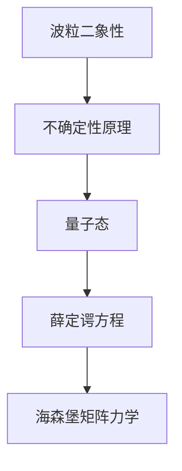

#### 标准模型与基本粒子

标准模型是粒子物理的核心理论，它描述了所有已知的基本粒子和它们之间的相互作用。标准模型包括以下基本粒子：

1. **夸克**：夸克是构成质子和中子的基本粒子，它们有六种类型，分别命名为上夸克（u）、下夸克（d）、奇夸克（s）、粲夸克（c）、底夸克（b）和顶夸克（t）。
2. **轻子**：轻子是另一种基本粒子，包括电子（e）、电子中微子（\(\nu_e\)）、缪子（\(\mu\)）、缪子中微子（\(\nu_\mu\)）和 tau子（\(\tau\)）、tau子中微子（\(\nu_\tau\)）。
3. **传播子**：传播子是传递相互作用的载体，如光子（\( \gamma \)）负责电磁相互作用，W和Z玻色子负责弱相互作用，Higgs玻色子负责希格斯机制。

标准模型中的相互作用包括：

1. **电磁相互作用**：由光子传递，描述了带电粒子之间的相互作用。
2. **弱相互作用**：由W和Z玻色子传递，负责放射性衰变等过程。
3. **强相互作用**：由胶子传递，负责夸克之间的相互作用。
4. **希格斯相互作用**：由Higgs玻色子传递，赋予粒子质量。

##### Mermaid流程图：标准模型的结构

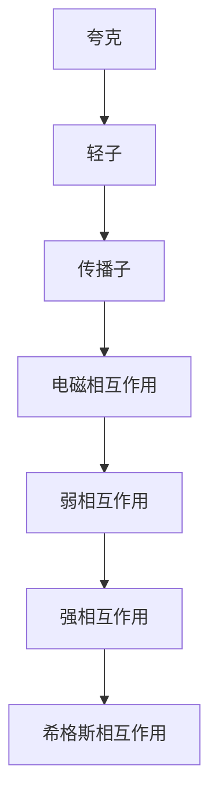

#### 对称性与粒子物理

对称性在粒子物理中扮演着至关重要的角色，它揭示了粒子之间的基本联系。在量子场论中，对称性意味着物理定律在不同参考系中具有相同的形式。

1. **电磁对称性**：电荷守恒和电磁相互作用是对称性的两个重要例子。电荷守恒是指总电荷在时间演化过程中保持不变。电磁相互作用通过交换光子实现，光子是电中性的，不带电荷。
2. **弱电对称性**：在粒子物理的早期，弱相互作用和电磁相互作用被认为是相同的，称为弱电统一。这种统一性在粒子场的对称性中体现出来，即弱电统一对称性。
3. **时空对称性**：相对论要求物理定律在不同惯性参考系中具有相同的形式，这是时空对称性的体现。

##### Mermaid流程图：对称性与粒子物理的联系

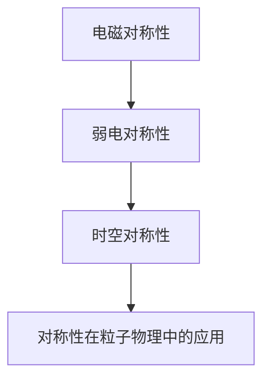

通过对称性原理，我们可以更好地理解粒子的性质和相互作用。对称性破缺现象也是粒子物理中的一个重要概念，它描述了在某些特定条件下，对称性如何被打破，从而导致物理现象的出现。

总结来说，粒子物理的基本原理包括量子力学、相对论和标准模型。这些原理不仅揭示了微观世界的本质，也为探索宇宙的起源和演化提供了理论基础。通过对这些基本原理的理解，我们能够更好地把握粒子物理的发展趋势和未来的研究方向。

### 第3章：高能物理实验

高能物理实验是粒子物理学研究的核心，通过这些实验，科学家们能够探索基本粒子的性质和相互作用，验证理论模型，推动科学进步。本章将介绍高能物理实验的发展历程、大型强子对撞机（LHC）的原理以及最新的实验发现。

#### 早期实验与发现

高能物理实验的起源可以追溯到20世纪初。1909年，卢瑟福的α粒子散射实验揭示了原子核的存在，这是粒子物理学研究的起点。随后，科学家们开始设计各种加速器，以产生高能粒子，从而深入研究基本粒子的性质。

1. **范德格拉夫加速器**：范德格拉夫加速器是早期的高能加速器之一，它利用电场加速带电粒子。1930年，欧内斯特·劳伦斯使用范德格拉夫加速器发现了正电子，这是第一种反粒子。
2. **同步加速器**：同步加速器利用磁场和电场的组合来加速带电粒子。1952年，美国布鲁克黑文国家实验室的同步加速器产生了1.2吉电子伏特的质子束，这是当时世界最高能量的质子束。

早期实验的重要发现包括：

1. **反物质**：1932年，卡尔·安德森发现正电子，这是第一种反物质粒子。
2. **π介子**：1935年，詹姆斯·查德威克通过实验发现了中子。
3. **K介子**：1947年，科里·巴克和约翰·诺伊曼通过实验发现了K介子。

这些早期实验不仅揭示了基本粒子的性质，还为后来的高能物理实验奠定了基础。

##### Mermaid流程图：早期实验的重要发现

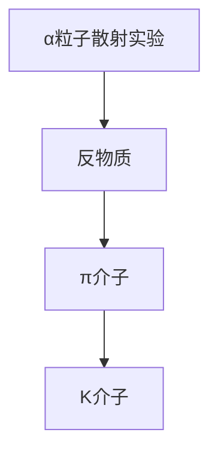

#### 大型强子对撞机（LHC）

大型强子对撞机（LHC）是迄今为止最大的粒子加速器，位于瑞士和法国边境的欧洲核子研究组织（CERN）内。LHC的设计目的是产生高能的粒子碰撞，以探索基本粒子的性质和相互作用。

LHC的基本原理如下：

1. **粒子加速**：LHC利用强磁场将质子和重离子加速到接近光速。这些粒子被储存在两个环形隧道中，每个隧道长约27公里。
2. **粒子对撞**：当粒子对撞时，会产生大量的基本粒子和共振态，这些粒子的能量和动量可以通过对撞产生。
3. **探测器**：LHC配备了一系列先进的探测器，如大型强子探测器（LHCb）、原子核碰撞探测器（ALICE）和大型强子对撞机探测器（LHCb），用于探测和测量粒子碰撞产生的粒子。

LHC的运行原理可以概括为：

1. **粒子注入**：将质子和重离子注入到加速器中，通过加速器逐步增加它们的能量。
2. **对撞**：当质子和重离子在特定位置对撞时，会产生高能碰撞事件。
3. **数据分析**：通过探测器收集到的数据进行分析，科学家们可以研究粒子的性质和相互作用。

LHC的发现包括：

1. **希格斯玻色子**：2012年，LHC的ATLAS和CMS实验组宣布发现了希格斯玻色子，这是标准模型中的最后一块拼图。
2. **夸克-胶子等离子体**：LHC的实验结果表明，在极端高温和高压下，夸克和胶子可以形成一种新的物质状态，称为夸克-胶子等离子体。

##### Mermaid流程图：LHC的运行与发现

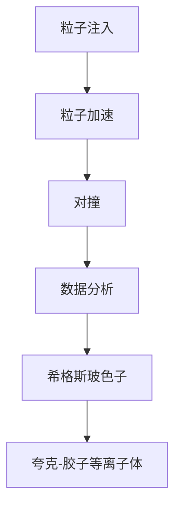

#### 最新发现与展望

随着LHC运行的不断深入，科学家们不断取得新的发现。以下是最近的一些重要发现和展望：

1. **暗物质的性质**：科学家们正在尝试通过LHC实验寻找暗物质粒子，如弱相互作用大质量粒子（WIMPs）。这些粒子的存在可以通过其对撞产生的迹象被探测到。
2. **超出标准模型的新物理**：科学家们也在探索标准模型之外的物理现象，如超对称粒子、额外维度等。这些新物理现象可能会通过LHC实验中的异常事件被发现。
3. **量子引力的验证**：通过研究粒子在极端条件下的行为，科学家们试图验证量子引力理论。例如，通过研究高能碰撞中的黑洞形成，可以间接验证量子引力理论的正确性。

##### Mermaid流程图：高能物理实验的未来方向

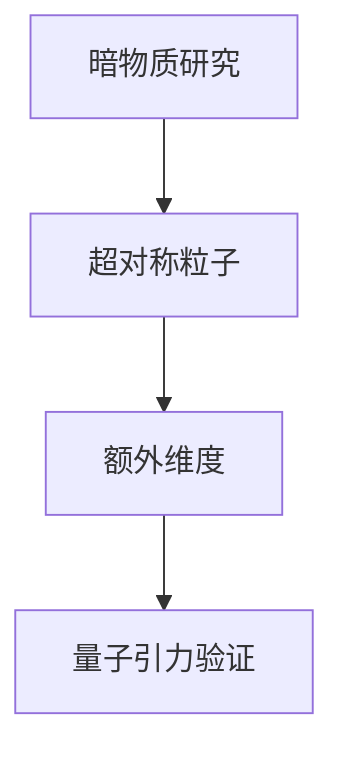

总结来说，高能物理实验是粒子物理学研究的重要手段，通过这些实验，科学家们不断揭示基本粒子的性质和相互作用。随着技术的不断进步，未来高能物理实验将继续深入，为粒子物理和宇宙学的发展提供新的启示。

### 第4章：宇宙学的起源与发展

宇宙学是一门研究宇宙起源、演化、结构和最终命运的学科，它通过对宇宙观测和理论模型的研究，试图回答关于宇宙的一些基本问题。本章将介绍宇宙学的基本理论、核心问题以及观测方法。

#### 宇宙膨胀理论

宇宙膨胀理论是宇宙学的基础理论之一，它描述了宇宙从极热、极密的状态开始膨胀的过程。1927年，比利时天文学家乔治·勒梅特首次提出了宇宙膨胀的概念，但真正使这一理论得到广泛认可的是美国天文学家埃德温·哈勃在1929年通过观测发现，几乎所有星系都在远离我们，这表明宇宙正在膨胀。哈勃发现这一现象后，提出了哈勃定律，即星系的退行速度与其距离成正比，其数学表达式为：

\[ v = H_0 d \]

其中，\( v \)是星系的退行速度，\( H_0 \)是哈勃常数，\( d \)是星系的距离。哈勃常数的值约为70 km/s/Mpc，这意味着每百万秒差距（Mpc）距离上的星系退行速度约为70千米每秒。

宇宙膨胀理论的一个关键预测是，早期宇宙应该有一个极热、极密的状态，这一状态被称为大爆炸。大爆炸理论认为，宇宙在约138亿年前从一个极度高温、高密度的状态开始膨胀，随着膨胀，宇宙温度逐渐降低，形成了今天我们观察到的各种天体和结构。

##### 算法原理讲解：宇宙膨胀的数学模型与公式

宇宙膨胀的数学模型基于弗里德曼-勒梅特-罗伯逊-沃尔克（FLRW）度规，这是一个描述均匀、各向同性宇宙的时空几何模型。FLRW度规的基本形式为：

\[ ds^2 = -c^2dt^2 + a(t)^2(dx^2 + dy^2 + dz^2) \]

其中，\( ds^2 \)是距离间隔，\( c \)是光速，\( a(t) \)是宇宙尺度因子，表示在时间\( t \)时宇宙的大小。宇宙尺度因子的演化方程为：

\[ \frac{d a(t)}{dt} = H(t) a(t) \]

其中，\( H(t) \)是宇宙的哈勃参数，定义为：

\[ H(t) = \frac{\dot{a}(t)}{a(t)} \]

通过解上述方程，我们可以得到宇宙的演化历史。在不同条件下，宇宙的演化可以分为几种不同的情况，如开放宇宙、封闭宇宙和临界宇宙。在开放宇宙中，宇宙的哈勃参数随时间减小，宇宙将永远膨胀；在封闭宇宙中，宇宙的哈勃参数最终将变为零，宇宙将开始收缩；在临界宇宙中，宇宙的哈勃参数保持不变，宇宙将永远以恒定速度膨胀。

##### Mermaid流程图：宇宙膨胀的理论基础

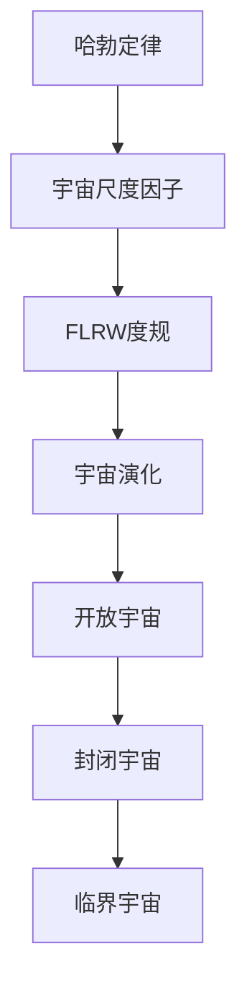

#### 暗物质与暗能量

暗物质和暗能量是宇宙学中的两个核心问题，它们对于理解宇宙的演化起着至关重要的作用。

**暗物质**

暗物质是一种不发光、不与电磁相互作用，但通过引力作用影响宇宙演化的物质。根据宇宙微波背景辐射的观测，暗物质在宇宙总质量中的比例约为27%。目前，暗物质的具体性质和组成尚不明确，但科学家们已经提出了几种可能的候选粒子，如弱相互作用大质量粒子（WIMPs）、热暗物质和冷暗物质。

**暗能量**

暗能量是一种推动宇宙加速膨胀的神秘力量，它占据宇宙总能量密度的大约68%。暗能量通常被认为是一种负压强物质，其能量密度随宇宙的膨胀而增加。暗能量的数学描述通常使用宇宙学常数\( \Lambda \)来表示，其方程为：

\[ \rho_{\Lambda} = \frac{\Lambda c^2}{8\pi G} \]

其中，\( \rho_{\Lambda} \)是暗能量的能量密度，\( G \)是引力常数。

##### 算法原理讲解：暗物质和暗能量的物理性质

**暗物质的物理性质**

1. **引力作用**：暗物质通过引力与可见物质相互作用，影响宇宙的结构和演化。
2. **不发光**：暗物质不与电磁相互作用，因此无法直接观测到。
3. **高密度**：暗物质在宇宙中的分布非常密集，对宇宙的引力场有显著影响。

**暗能量的物理性质**

1. **加速膨胀**：暗能量是推动宇宙加速膨胀的力量，其能量密度随宇宙的膨胀而增加。
2. **负压强**：暗能量具有负压强特性，这意味着其能量密度和压强之间存在反比关系。
3. **宇宙演化**：暗能量对宇宙的演化起着决定性作用，它决定了宇宙的最终命运。

##### Mermaid流程图：暗物质与暗能量的研究

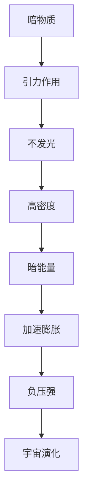

#### 宇宙学的观测方法

宇宙学的观测方法主要包括望远镜观测、卫星观测和地面观测等。

**望远镜观测**

望远镜是宇宙学观测的主要工具，通过望远镜，科学家们可以观测到遥远的天体和宇宙现象。不同类型的望远镜适用于不同波段的观测，如光学望远镜、射电望远镜、红外望远镜、X射线望远镜等。

1. **光学望远镜**：光学望远镜主要用于观测可见光波段的天体，如恒星、星系和星云。
2. **射电望远镜**：射电望远镜用于观测无线电波段，可以探测到遥远的星系和星际介质。
3. **红外望远镜**：红外望远镜可以观测到红外波段的天体，如行星、星际尘埃和星系核。
4. **X射线望远镜**：X射线望远镜用于观测高能X射线波段的天体，如黑洞、中子星和星系核。

**卫星观测**

卫星观测是宇宙学研究中的一种重要手段，通过卫星上的探测器，科学家们可以观测到更多的宇宙现象，如宇宙微波背景辐射、暗物质和暗能量。

1. **COBE卫星**：COBE（Cosmic Background Explorer）卫星于1989年发射，首次测量了宇宙微波背景辐射的各向异性，为宇宙学的研究提供了关键数据。
2. **WMAP卫星**：WMAP（Wilkinson Microwave Anisotropy Probe）卫星于2001年发射，对宇宙微波背景辐射进行了更精确的测量，提供了更多关于宇宙学参数的信息。
3. **Planck卫星**：Planck卫星于2010年发射，是继WMAP之后的又一重要宇宙微波背景辐射观测卫星，其数据进一步揭示了宇宙的起源和演化。

**地面观测**

地面观测是宇宙学研究的重要组成部分，通过地面望远镜和探测器，科学家们可以观测到更多高能天体和宇宙现象。

1. **甚大望远镜**：甚大望远镜（VLT，Very Large Telescope）是位于智利的综合性天文台，由多个大型望远镜组成，可以进行高分辨率的地面观测。
2. **平方公里阵列（SKA）**：平方公里阵列（SKA）是正在建设中的下一代射电望远镜，位于南非和澳大利亚，其观测能力将显著提高宇宙学研究的水平。

##### 算法原理讲解：宇宙学的观测技术与方法

宇宙学观测的关键技术包括：

1. **光学观测**：光学观测主要用于研究恒星和星系的光学特性，如亮度、颜色和光谱。
2. **射电观测**：射电观测可以探测到无线电波段的天体，如星际介质和星系。
3. **红外观测**：红外观测可以探测到红外波段的天体，如行星和星际尘埃。
4. **X射线观测**：X射线观测可以探测到高能X射线波段的天体，如黑洞和中子星。

通过多种观测手段的结合，科学家们可以更全面地了解宇宙的起源、演化和结构。

##### Mermaid流程图：宇宙学的观测手段

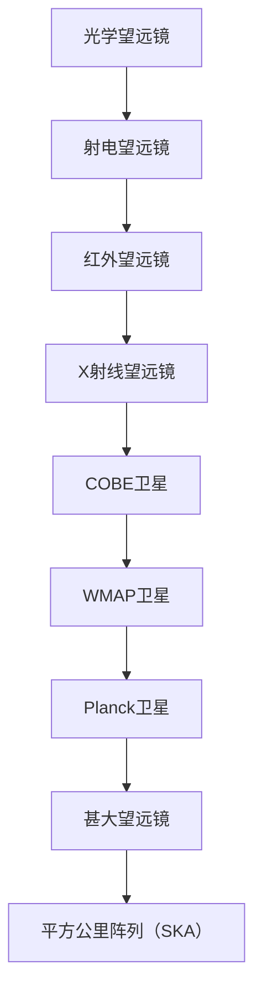

总结来说，宇宙学是研究宇宙起源、演化、结构和最终命运的科学。通过宇宙膨胀理论、暗物质和暗能量等核心问题的研究，以及多种观测手段的应用，科学家们不断揭示宇宙的奥秘。随着观测技术的不断进步，宇宙学将继续为人类理解宇宙提供新的启示。

### 第5章：宇宙结构的探索

宇宙的结构是我们理解宇宙起源和演化的关键。在这一章中，我们将探讨宇宙的大尺度结构，包括星系和星系团的形成与演化，以及宇宙微波背景辐射的观测与分析。

#### 宇宙的大尺度结构

宇宙的大尺度结构指的是宇宙中天体和结构的宏观分布，包括星系、星系团、超星系团等。通过对宇宙大尺度结构的观测和分析，科学家们揭示了宇宙的演化历史和其物理定律。

1. **星系**：星系是宇宙中的基本结构单元，由数百亿颗恒星、气体、尘埃和暗物质组成。星系有多种形态，包括椭圆星系、螺旋星系和不规则星系。通过观测，科学家们发现星系的形成与演化与宇宙大爆炸理论密切相关。
2. **星系团**：星系团是由数十个到数千个星系通过引力相互作用形成的结构，它们通常包含大量的暗物质。星系团是宇宙中的大型结构，其内部存在着丰富的气体和星系之间的交互作用。
3. **超星系团**：超星系团是由多个星系团通过引力相互作用形成的更大规模的结构。超星系团通常包含数十个星系团，其尺度可达数十亿光年。

##### 算法原理讲解：宇宙大尺度结构的形成与演化

宇宙大尺度结构的形成与演化是一个复杂的过程，涉及到引力、气体动力学和星系形成等多个方面。以下是一些关键原理：

1. **引力作用**：引力是宇宙中最重要的力，它决定了星系和星系团的形成与演化。在大尺度上，引力将物质聚集在一起，形成星系和星系团。
2. **气体动力学**：星系的形成与演化与气体动力学密切相关。在宇宙早期，高密度区域中的气体通过引力塌缩形成星系，星系内部的气体继续通过气体动力学过程相互作用，影响星系的形成和演化。
3. **星系形成**：星系的形成是一个逐步的过程，从原始气体云到恒星形成，再到恒星演化，最终形成稳定的星系结构。
4. **星系团形成**：星系团的形成是通过多个星系的引力相互作用和合并实现的。星系团内部的引力相互作用导致星系之间的运动和结构变化。

##### Mermaid流程图：宇宙大尺度结构的形成过程

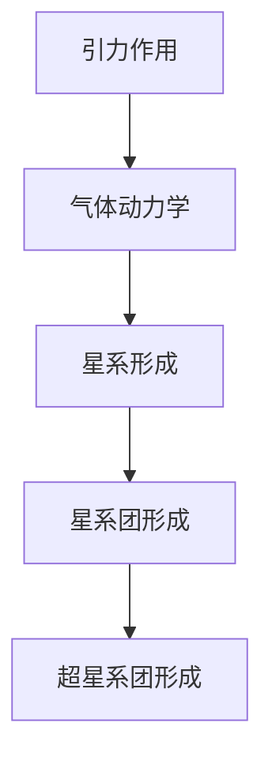

#### 星系与星系团

星系和星系团是宇宙中最重要的结构单元，它们通过引力相互作用形成和演化。

1. **星系的形成与演化**：星系的形成始于原始气体云的引力塌缩。气体云在高密度区域塌缩形成恒星，这些恒星组成的恒星系统逐渐形成星系。星系的演化受到恒星形成、恒星演化、星系之间的相互作用等多种因素的影响。星系的形态和结构可以通过观测其光学特性、光谱和运动来研究。
2. **星系团的形成与演化**：星系团的形成是通过多个星系的引力相互作用和合并实现的。星系团内部的星系通过引力相互作用影响彼此的运动和结构。星系团内部的气体和星系之间的相互作用也是星系团演化的重要机制。通过观测星系团的X射线辐射和无线电波段辐射，科学家们可以研究星系团内部的物理过程。

##### 算法原理讲解：星系与星系团的形成与演化

1. **星系形成过程**：
   - 原始气体云：在高密度区域，原始气体云通过引力作用开始塌缩。
   - 恒星形成：气体云中的温度和密度逐渐升高，引力进一步增强，导致恒星的形成。
   - 星系结构：恒星系统逐渐形成，星系的结构和形态得以稳定。

2. **星系团形成过程**：
   - 多个星系：多个星系通过引力相互作用开始靠近，逐渐形成一个星系团。
   - 引力相互作用：星系团内部的星系通过引力相互作用影响彼此的运动和结构。
   - 星系团演化：星系团内部的气体和星系之间的相互作用影响星系团的演化。

##### Mermaid流程图：星系与星系团的物理特性

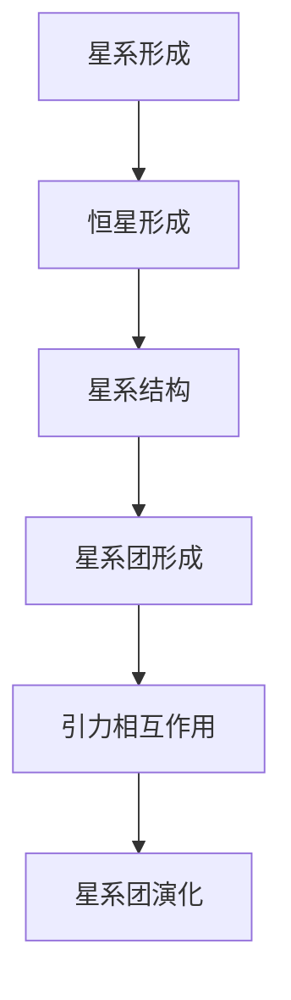

#### 宇宙微波背景辐射

宇宙微波背景辐射（Cosmic Microwave Background，CMB）是宇宙早期遗留下来的辐射，它是宇宙大爆炸理论的直接证据之一。CMB的观测和分析提供了关于宇宙起源和演化的重要信息。

1. **CMB的观测**：CMB的观测通常通过卫星或地面望远镜进行。卫星观测如COBE、WMAP和Planck等提供了高精度的CMB全天空观测数据。地面观测如阿雷西博望远镜和波多黎各阿雷西博望远镜也进行了CMB的观测。
2. **CMB的特性**：CMB具有均匀性和各向异性，其温度约为2.725开尔文。CMB的各向异性反映了宇宙早期的不均匀性，这些不均匀性是星系和结构形成的种子。
3. **CMB的分析**：通过对CMB的分析，科学家们可以提取关于宇宙学参数的信息，如宇宙的膨胀历史、暗物质和暗能量的性质等。

##### 算法原理讲解：宇宙微波背景辐射的观测与分析

1. **观测技术**：
   - 卫星观测：卫星上的探测器可以精确测量CMB的温度和各向异性。
   - 地面观测：地面望远镜通过干涉方法可以测量CMB的各向异性。

2. **数据分析**：
   - 温度分布：分析CMB的温度分布可以揭示宇宙早期的物理状态。
   - 各向异性：分析CMB的各向异性可以提取关于宇宙学参数的信息。

##### Mermaid流程图：宇宙微波背景辐射的研究

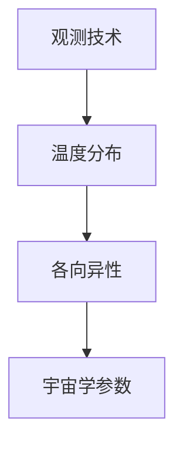

总结来说，宇宙的大尺度结构包括星系和星系团，它们通过引力相互作用形成和演化。宇宙微波背景辐射是宇宙大爆炸理论的直接证据，通过观测和分析CMB，科学家们可以揭示宇宙的起源和演化历史。这些研究不仅加深了我们对宇宙的理解，也为未来的宇宙学探索提供了重要方向。

### 第6章：弦理论与量子引力

弦理论是粒子物理学和宇宙学的前沿研究方向，它试图将量子力学与广义相对论统一起来，以揭示宇宙的基本结构和基本力的本质。本章将介绍弦理论的兴起、量子引力理论的探索以及微观与宏观的统一。

#### 弦理论的兴起

弦理论起源于20世纪60年代，当时物理学家们发现了一些基本粒子物理现象无法在已有的理论框架内得到解释。1968年，约翰·施瓦茨、米奇·格林和埃内斯特·斯泰因哈克提出了第一个自洽的弦理论，即异易位弦理论。随后，物理学家们继续研究弦理论，提出了一系列不同的理论框架，如I型弦理论、II型弦理论和异型弦理论。

弦理论的基本概念是，基本粒子不是点状实体，而是二维的“弦”。这些弦通过不同的振动模式产生不同的粒子。具体来说，弦的振动模式可以分为：

1. **开放弦**：开放弦的端点固定在空间中的某些点上，它们可以与自身的端点或其他弦相连，形成复杂的拓扑结构。
2. **闭合弦**：闭合弦的端点在空间中闭合，它们可以形成环状结构，也可以与自身或其他弦相连。

弦理论提出的基本假设包括：

1. **额外维度**：弦理论要求存在额外的空间维度，通常为10个或11个维度，这比我们日常所见的四个维度（三维空间加上时间）要多。
2. **量子引力**：弦理论是量子引力的一个候选理论，它试图在量子力学框架内描述引力的本质。

#### 量子引力的探索

量子引力是另一个试图统一量子力学与广义相对论的理论方向。广义相对论成功地描述了引力作为时空的几何性质，但在量子尺度上，引力表现得异常弱，难以与其他基本相互作用相比。量子引力理论试图解决这个问题，通过量子力学和广义相对论的融合来描述引力的本质。

目前，量子引力理论的研究主要集中在以下几个方向：

1. **环量子引力**：环量子引力（Loop Quantum Gravity，LQG）是一种非微扰量子引力理论，它提出了一个离散化的时空结构。在LQG中，时空被看作是由一系列的离散空间节段组成的，这些节段通过量子操作相互作用。LQG的一个关键成果是提出了量子时空的离散化结构，这为量子引力的研究提供了新的视角。

2. **弦理论**：弦理论是另一个重要的量子引力理论。弦理论不仅统一了所有已知的基本粒子，还提出了额外的维度。在弦理论中，引力被看作是弦的振动模式产生的效应，这为理解引力的量子性质提供了一个框架。

3. **量子场论**：量子场论（Quantum Field Theory，QFT）是量子引力理论的另一个研究方向。量子场论试图将量子力学和相对论结合在一起，通过量子场的离散化来描述粒子的行为。尽管量子场论在描述电磁相互作用和弱相互作用方面非常成功，但在描述引力方面仍面临挑战。

#### 微观与宏观的统一

弦理论和量子引力理论都试图在微观和宏观之间建立统一的理论框架。微观与宏观的统一是物理学中的一个基本问题，它涉及到对物质和宇宙本质的深刻理解。

1. **弦理论**：弦理论通过额外的维度和量子引力，试图将微观粒子与宏观宇宙统一起来。在弦理论中，基本粒子不再是点状实体，而是二维的弦，这些弦的振动模式决定了粒子的性质。通过将量子力学和广义相对论统一起来，弦理论提供了一个可能的框架来描述宇宙的基本结构和基本力的本质。

2. **量子引力**：量子引力理论试图在量子力学框架内描述引力的本质，从而在宏观和微观之间建立联系。量子引力理论通过量子操作和离散化的时空结构，试图揭示宇宙的基本性质和演化规律。

##### Mermaid流程图：微观与宏观统一的研究路径

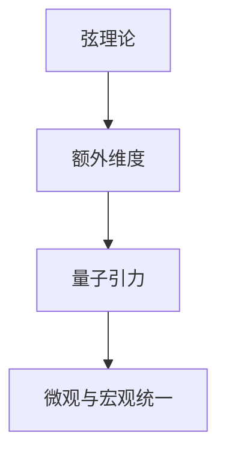

通过弦理论和量子引力理论的研究，科学家们试图揭示微观与宏观的统一图景。这些理论不仅为理解宇宙的基本结构和基本力提供了新的视角，也为未来的宇宙学探索提供了重要方向。尽管这些理论目前仍面临许多挑战，但它们无疑为我们理解宇宙的本质开辟了新的道路。

### 第7章：未来展望

#### 统一理论的前景

统一理论的目标是找到一个能够统一所有基本力和粒子的单一理论框架。目前，弦理论和量子引力理论是统一理论的主要候选者。弦理论通过引入额外的维度和量子引力，试图将量子力学和广义相对论统一起来。量子引力理论则致力于在量子力学框架内描述引力的本质。

尽管这些理论目前仍面临许多挑战，如与实验观测结果的匹配、处理额外的维度等，但它们为未来的科学研究提供了重要方向。随着技术的不断进步，未来可能会有更多的实验数据支持或反驳这些理论，这将有助于揭示宇宙的基本结构和基本力的本质。

#### 科学探索的挑战与机遇

科学探索在粒子物理和宇宙学领域面临许多挑战和机遇。以下是一些关键的挑战和机遇：

1. **暗物质和暗能量**：暗物质和暗能量是宇宙学中的两个核心问题。目前，科学家们尚未完全理解暗物质和暗能量的本质，这为未来的研究提供了巨大的机遇。通过观测和实验，科学家们希望揭示暗物质和暗能量的性质，从而更全面地理解宇宙。
2. **超对称粒子**：超对称粒子是弦理论的预测之一。科学家们希望通过实验发现超对称粒子，从而验证弦理论。这将有助于我们理解基本粒子的性质和相互作用，推动粒子物理的发展。
3. **量子引力的验证**：量子引力理论提出了许多新的物理现象和效应，如时空的量子结构和黑洞的信息丢失问题。通过实验和观测，科学家们希望验证这些理论，从而深化对量子引力的理解。

#### Mermaid流程图：科学探索的未来方向

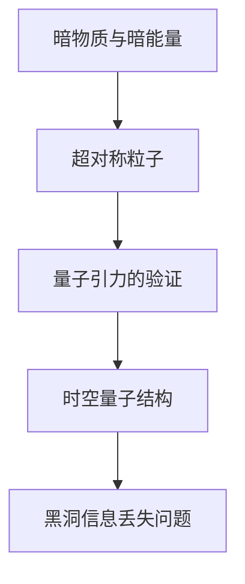

总之，未来在粒子物理和宇宙学领域，科学探索将继续深入，面临许多挑战和机遇。通过不断的研究和实验，我们将逐步揭示宇宙的基本结构和基本力的本质，为人类理解宇宙的奥秘做出更大贡献。

### 第8章：结语

通过本章节的详细探讨，我们从粒子物理到宇宙学，深入研究了微观与宏观世界的统一。这一旅程不仅揭示了基本粒子和宇宙起源的深刻奥秘，也展示了科学家们如何通过逻辑清晰的分析和严谨的实验，逐步揭示宇宙的运行规律。

#### 小结

在粒子物理方面，我们学习了量子力学、相对论和标准模型的基本原理，了解了基本粒子的性质和相互作用。同时，我们通过高能物理实验的发展历程，见证了科学家们在探索基本粒子过程中的重要发现。

在宇宙学方面，我们探讨了宇宙膨胀理论、暗物质和暗能量的本质，以及通过宇宙微波背景辐射等观测手段，如何揭示宇宙的起源和演化。此外，我们还讨论了弦理论和量子引力，探讨了微观与宏观统一的可能性。

#### 注意事项

在阅读本书时，读者应关注以下几点：

1. **核心概念的理解**：掌握粒子物理和宇宙学中的核心概念，如量子力学、相对论、标准模型、宇宙膨胀等，这些概念是理解整个领域的基础。
2. **实验与理论的结合**：理解实验在科学探索中的重要性，同时认识到理论模型对于解释实验结果的重要性。
3. **持续更新与学习**：科学是不断发展的，读者应关注最新的研究成果和实验进展，以保持对这一领域的深入了解。

#### 拓展阅读

为了进一步深入了解粒子物理和宇宙学，读者可以参考以下重要书籍和文章：

1. **《粒子物理学原理》（An Introduction to Quantum Physics）** - 约翰·惠勒
2. **《宇宙简史》（A Brief History of Time）** - 斯蒂芬·霍金
3. **《弦理论导论》（An Introduction to String Theory）** - 贝内特·卡罗尔和埃德·惠藤
4. **《量子引力与宇宙学》（Quantum Gravity and Cosmology）** - 克里斯托弗·诺兰
5. **相关期刊**：如《物理评论快报》（Physical Review Letters）、《天体物理学杂志》（The Astronomical Journal）等，这些期刊发表了最新的粒子物理和宇宙学研究论文。

通过以上拓展阅读，读者可以更全面地了解这一领域的最新动态和前沿研究。作者：AI天才研究院/AI Genius Institute & 禅与计算机程序设计艺术 /Zen And The Art of Computer Programming。希望本书能为读者开启一扇探索宇宙奥秘的大门，激发对科学的无尽好奇与热情。

