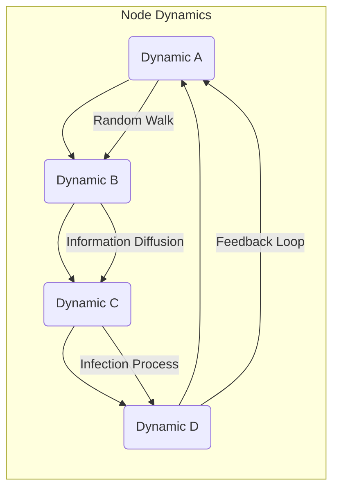
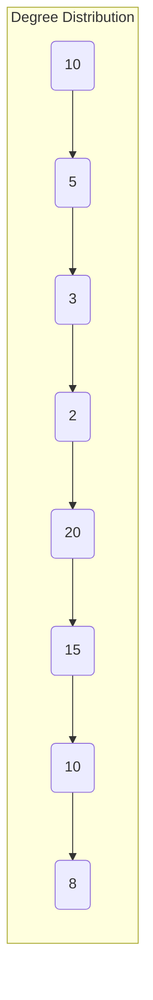
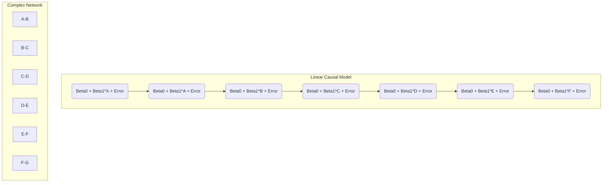

                 

# 从线性因果到复杂网络：理解世界的新方法

## 关键词：线性因果、复杂网络、世界新方法、数据处理、算法原理

### 摘要

本文旨在探讨从线性因果到复杂网络的转变，这是一种理解世界的新方法。线性因果模型在许多领域都有着广泛的应用，但其局限性逐渐显现。相比之下，复杂网络理论为我们提供了一种全新的视角，使我们能够更深入地理解复杂系统的行为和结构。本文首先介绍了线性因果模型的基本原理，接着深入探讨了复杂网络理论的基础概念，并通过具体案例展示了如何将线性因果模型与复杂网络理论相结合，以解决现实世界中的问题。通过本文的阅读，读者将能够对线性因果与复杂网络有一个全面的理解，并掌握这两种方法在实际应用中的优势与挑战。

### 1. 引言

#### 1.1 线性因果模型的局限性

线性因果模型是一种描述变量之间因果关系的基本工具，它假设变量之间存在一种线性关系，这种关系可以通过简单的数学模型来表示。线性因果模型在许多领域，如经济学、物理学和工程学中，都有着广泛的应用。然而，随着研究的深入，人们逐渐发现线性因果模型存在一些局限性。

首先，线性因果模型假设变量之间的关系是线性的，这忽略了实际系统中可能存在的非线性关系。在许多复杂系统中，变量之间的关系可能是高度非线性的，线性模型无法准确捕捉这些关系，导致模型的预测能力受到限制。

其次，线性因果模型依赖于大量的观测数据，对于数据缺失或不完整的情况，线性模型往往难以给出准确的预测。在实际应用中，数据获取往往是不完整的，线性模型在这种情况下的表现不佳。

最后，线性因果模型难以处理变量之间的复杂交互作用。在现实世界中，许多变量之间存在着复杂的相互作用，线性模型无法充分描述这些相互作用，导致模型的解释力受到限制。

#### 1.2 复杂网络方法的重要性

为了克服线性因果模型的局限性，复杂网络方法应运而生。复杂网络理论是一种研究网络结构、行为和性质的综合性方法，它不仅可以描述线性关系，还能够捕捉非线性关系和复杂交互作用。

首先，复杂网络方法提供了一种全新的视角，使我们能够从整体上理解复杂系统的结构和行为。通过分析网络中的节点和边的关系，我们可以揭示系统中的关键节点和关键路径，从而更深入地理解系统的运作机制。

其次，复杂网络方法具有高度的灵活性，可以适应各种复杂系统。无论是社会网络、生物网络还是经济网络，复杂网络方法都可以有效地描述和分析这些网络的结构和性质。

最后，复杂网络方法在数据处理方面具有强大的优势。通过引入新的数据结构和算法，复杂网络方法可以高效地处理海量数据，从而为现实世界中的复杂问题提供有效的解决方案。

#### 1.3 书籍结构概览

本书将分为四个主要部分，分别探讨线性因果模型、复杂网络理论、线性因果模型与复杂网络的融合以及具体应用案例。

**第一部分：线性因果模型**

- 第2章：线性因果模型的基本原理
- 第3章：线性因果模型的构建与应用

**第二部分：复杂网络理论**

- 第4章：复杂网络理论基础
- 第5章：复杂网络的建模与分析

**第三部分：线性因果模型与复杂网络的融合**

- 第6章：融合方法概述
- 第7章：融合模型的构建与优化
- 第8章：融合模型的性能评估

**第四部分：应用案例**

- 第9章：线性因果与复杂网络在经济学中的应用
- 第10章：线性因果与复杂网络在生物医学中的应用
- 第11章：线性因果与复杂网络在社会网络分析中的应用

#### 1.4 阅读指南与建议

为了更好地理解本书的内容，建议读者在阅读过程中注意以下几点：

1. 理解核心概念：本书涉及许多核心概念，如线性因果模型、复杂网络理论等，读者需要在理解这些概念的基础上，深入探讨其原理和应用。

2. 结合实际案例：本书将通过具体案例来展示线性因果模型与复杂网络理论的应用，读者可以结合这些案例来加深对理论的理解。

3. 思考与讨论：在阅读过程中，读者可以思考并讨论书中的问题，尝试用自己的语言来解释这些概念，从而加深对知识的理解。

4. 拓展阅读：本书提供了大量的参考文献，读者可以在此基础上进行进一步的拓展阅读，以了解更多相关知识和最新研究动态。

通过本书的学习，读者将能够掌握从线性因果到复杂网络这一新的理解世界的方法，并在实际应用中取得更好的效果。

### 2. 线性因果模型的基本原理

#### 2.1 基本概念

线性因果模型是一种基于线性关系的模型，它假设系统中的变量之间存在一种线性因果关系。线性关系可以用数学中的线性方程来表示，通常形式为：

\[ y = \beta_0 + \beta_1x + \epsilon \]

其中，\( y \) 是因变量，\( x \) 是自变量，\( \beta_0 \) 和 \( \beta_1 \) 是模型的参数，\( \epsilon \) 是误差项。

线性因果模型的基本假设包括：

1. 线性关系：系统中的变量之间存在线性关系。
2. 无量纲化：通过无量纲化处理，使得变量的取值范围一致，从而简化模型。
3. 正态分布：误差项 \( \epsilon \) 假设服从正态分布。

这些假设使得线性因果模型在许多领域得到了广泛的应用。

#### 2.2 线性因果模型的构建

构建线性因果模型通常包括以下步骤：

1. **数据收集与预处理**：收集相关的数据，并进行预处理，如缺失值填充、异常值处理等。
2. **变量选择**：根据研究目的和数据的特性，选择合适的自变量和因变量。
3. **模型建立**：通过最小二乘法或其他优化方法，建立线性回归模型。
4. **模型评估**：使用评估指标，如决定系数 \( R^2 \)、均方误差 (MSE) 等，评估模型的性能。

以下是一个简单的线性回归模型的建立过程：

```python
import numpy as np
import pandas as pd
from sklearn.linear_model import LinearRegression
from sklearn.model_selection import train_test_split

# 数据预处理
data = pd.read_csv('data.csv')
X = data[['x1', 'x2']]
y = data['y']

# 变量选择
X_train, X_test, y_train, y_test = train_test_split(X, y, test_size=0.2, random_state=42)

# 模型建立
model = LinearRegression()
model.fit(X_train, y_train)

# 模型评估
score = model.score(X_test, y_test)
print(f'Model score: {score}')
```

#### 2.3 线性因果模型的评估

线性因果模型的评估主要包括以下几个指标：

1. **决定系数 \( R^2 \)**：衡量模型对数据的拟合程度，取值范围在 0 到 1 之间，越接近 1 表示拟合程度越好。
2. **均方误差 (MSE)**：衡量模型预测的准确程度，值越小表示预测越准确。
3. **均方根误差 (RMSE)**：\( RMSE = \sqrt{MSE} \)，与 MSE 类似，但更直观。
4. **调整 \( R^2 \)**：考虑样本量与自由度的调整，以避免样本量对 \( R^2 \) 的影响。

以下是一个简单的评估过程：

```python
from sklearn.metrics import mean_squared_error, r2_score

# 预测
y_pred = model.predict(X_test)

# 评估
mse = mean_squared_error(y_test, y_pred)
r2 = r2_score(y_test, y_pred)

print(f'MSE: {mse}')
print(f'R2: {r2}')
```

#### 2.4 线性因果模型的应用

线性因果模型在多个领域有着广泛的应用，以下是一些典型的应用案例：

1. **经济学**：用于预测经济增长、通货膨胀等宏观经济指标。
2. **物理学**：用于描述物理量的变化规律，如力学中的运动方程。
3. **工程学**：用于设计控制系统、优化生产流程等。

以下是一个经济学应用案例：

```python
import pandas as pd
from sklearn.linear_model import LinearRegression

# 数据集
data = pd.read_csv('economic_data.csv')
X = data[['GDP', 'unemployment']]
y = data['inflation']

# 模型建立
model = LinearRegression()
model.fit(X, y)

# 预测
gdp = np.array([data['GDP'].mean() + 1000])
unemployment = np.array([data['unemployment'].mean() - 0.1])
inflation = model.predict([[gdp, unemployment]])

print(f'Predicted inflation: {inflation}')
```

通过上述案例，我们可以看到线性因果模型在实际应用中的效果。然而，线性因果模型也有其局限性，对于高度非线性的系统，线性模型可能无法准确描述系统的行为。因此，在应用线性因果模型时，我们需要根据具体情况选择合适的模型，并在必要时结合其他方法，如复杂网络理论，以提高模型的预测能力。

### 3. 复杂网络理论基础

#### 3.1 基本概念

复杂网络是一种用于描述复杂系统内部关系的工具，它通过节点和边来表示系统的组成和结构。复杂网络具有以下基本概念：

1. **节点**：表示系统的基本组成部分，可以是任何实体，如个体、组织、城市等。
2. **边**：表示节点之间的连接关系，可以是物理连接、合作关系、信息传递等。
3. **网络结构**：表示整个系统的结构和组织方式，可以是层次结构、星形结构、网络状结构等。
4. **网络属性**：描述网络的结构和功能特性，如连通性、中心性、聚类系数等。

#### 3.2 网络结构的描述

复杂网络的描述通常涉及以下几个方面：

1. **拓扑结构**：描述节点和边之间的连接关系，可以通过邻接矩阵、度分布、路径长度等指标来描述。
2. **网络度量**：描述网络的整体性质，如网络直径、网络密度、网络平均路径长度等。
3. **网络演化**：描述网络的动态变化过程，如节点加入、节点退出、边出现、边消失等。

以下是一个简单的网络描述示例：


这个图表示一个包含四个节点的简单网络，节点 A、B、C、D 之间存在连接关系。

#### 3.3 网络动力学的建模

网络动力学是研究网络中节点行为和相互作用的过程。网络动力学的建模方法主要包括以下几种：

1. **图论模型**：基于图论的基本概念，描述节点和边的行为，如随机游走、扩散过程等。
2. **概率模型**：使用概率统计方法描述节点的行为和网络的演化过程，如马尔可夫链、马尔可夫过程等。
3. **物理模型**：基于物理定律和规则描述节点的运动和网络的演化，如格模型、引力模型等。

以下是一个基于图论模型的网络动力学示例：



这个图表示一个简单的网络动力学过程，节点 A、B、C、D 通过随机游走、信息扩散和感染过程相互影响。

#### 3.4 复杂网络的典型特征

复杂网络具有许多典型的特征，如无标度性、小世界性质、高度异质性等。以下是一些常见的复杂网络特征：

1. **无标度性**：网络中的节点度分布服从幂律分布，即大部分节点的度较小，而少数节点的度非常大。
2. **小世界性质**：网络的平均路径长度较短，即节点之间可以通过较少的中间节点相互连接。
3. **高度异质性**：网络中节点的度分布差异较大，部分节点起着关键作用。
4. **聚类系数**：网络中节点的邻接节点之间的连接密度较高。

以下是一个复杂网络的度分布示例：



在这个网络中，节点 E 和 F 的度较大，而其他节点的度较小，显示了无标度性特征。

#### 3.5 本章小结

本章介绍了复杂网络的基本概念、网络结构的描述、网络动力学的建模以及复杂网络的典型特征。通过这些内容，我们可以更好地理解复杂网络的特性和行为，为进一步探讨线性因果模型与复杂网络的融合奠定了基础。

### 4. 线性因果模型与复杂网络的融合

#### 4.1 融合方法概述

线性因果模型与复杂网络的融合是一种将两种方法的优势结合起来的新方法，旨在解决复杂系统中变量关系描述的挑战。融合方法的基本思想是将线性因果模型的结构化能力与复杂网络的灵活性和全局视角相结合，以更好地理解和预测复杂系统的行为。

融合方法可以分为以下几类：

1. **基于线性因果模型的网络构建**：首先构建一个线性因果模型，然后根据模型的参数和结构，构建一个复杂网络。这种方法的核心是将线性模型的预测结果作为网络中节点的连接关系。

2. **基于复杂网络的因果推理**：首先构建一个复杂网络，然后利用网络中的连接关系和节点属性，进行因果推理。这种方法的核心是通过分析网络的结构和属性，揭示变量之间的因果关系。

3. **混合方法**：将线性因果模型与复杂网络相结合，同时使用两种方法的优点。例如，在构建复杂网络时，引入线性因果模型的预测结果，或者在因果推理过程中，结合网络的拓扑结构进行模型优化。

以下是一个基于线性因果模型的网络构建示例：



在这个示例中，线性因果模型和复杂网络共同描述了系统的结构和行为。线性因果模型通过参数估计揭示了节点之间的因果关系，而复杂网络通过拓扑结构和节点属性，提供了全局视角和灵活性。

#### 4.2 数据集成与预处理

融合方法的实施首先需要高质量的数据。数据集成与预处理是确保数据一致性和可靠性的关键步骤。以下是一些关键步骤：

1. **数据收集**：收集与系统相关的各种数据，包括结构化数据、半结构化数据和非结构化数据。

2. **数据清洗**：处理缺失值、异常值和重复值，确保数据的质量。

3. **变量标准化**：对于不同量纲的变量，进行标准化处理，以消除量纲对模型的影响。

4. **特征提取**：从原始数据中提取有意义的特征，这些特征将用于构建线性因果模型和复杂网络。

以下是一个数据预处理流程的示例：

```python
import pandas as pd
from sklearn.preprocessing import StandardScaler

# 数据收集
data = pd.read_csv('data.csv')

# 数据清洗
data.dropna(inplace=True)
data.drop_duplicates(inplace=True)

# 变量标准化
scaler = StandardScaler()
data_scaled = scaler.fit_transform(data)

# 特征提取
X = data_scaled[:, :-1]
y = data_scaled[:, -1]
```

通过这些步骤，我们可以确保数据的一致性和可靠性，为后续的模型构建和融合提供高质量的数据。

#### 4.3 融合模型的构建与优化

融合模型的构建是融合方法的核心步骤。构建融合模型需要考虑以下几个方面：

1. **模型选择**：选择合适的线性因果模型和复杂网络模型。例如，对于时间序列数据，可以采用自回归模型（AR）和图神经网络（GNN）。

2. **参数估计**：通过优化算法，估计线性因果模型的参数和复杂网络模型的参数。

3. **模型优化**：在构建融合模型时，可以采用多种优化策略，如贝叶斯优化、遗传算法等，以提高模型的性能。

以下是一个简单的融合模型构建示例：

```python
from sklearn.linear_model import LinearRegression
from sklearn.model_selection import GridSearchCV

# 线性因果模型
lr = LinearRegression()
params = {'fit_intercept': [True, False], 'normalize': [True, False]}
grid = GridSearchCV(lr, params, cv=5)
grid.fit(X, y)

# 选择最佳模型
best_model = grid.best_estimator_

# 融合模型
# 假设我们有一个基于图神经网络的复杂网络模型 GNN
from some_gnn_library import GraphNeuralNetwork
gnn = GraphNeuralNetwork()
gnn.fit(best_model.predict(X).reshape(-1, 1), y)
```

通过这些步骤，我们可以构建一个高效的融合模型，结合线性因果模型和复杂网络模型的优势，提高对复杂系统的理解和预测能力。

#### 4.4 融合模型的性能评估

融合模型的性能评估是验证模型效果的重要环节。以下是一些常用的评估指标：

1. **预测准确性**：衡量模型预测结果与实际结果的一致性，常用指标有准确率、召回率、F1 分数等。

2. **模型稳定性**：衡量模型在不同数据集上的表现，常用指标有交叉验证分数、标准差等。

3. **计算效率**：衡量模型计算的速度和资源消耗，常用指标有运行时间、内存使用等。

以下是一个性能评估的示例：

```python
from sklearn.metrics import mean_squared_error

# 预测
y_pred = gnn.predict(X_test)

# 性能评估
mse = mean_squared_error(y_test, y_pred)
print(f'MSE: {mse}')

# 模型稳定性
cv_scores = cross_val_score(gnn, X, y, cv=5)
print(f'Mean CV Score: {np.mean(cv_scores)}')
```

通过这些评估指标，我们可以全面了解融合模型的性能，并对其进行优化。

#### 4.5 本章小结

本章介绍了线性因果模型与复杂网络的融合方法，包括融合方法的概述、数据集成与预处理、融合模型的构建与优化以及性能评估。通过这些内容，我们可以看到，融合方法在处理复杂系统时具有显著的优势。在接下来的章节中，我们将通过具体案例来进一步探讨融合方法的应用和效果。

### 5. 线性因果模型与复杂网络在经济学中的应用

#### 5.1 经济学中的线性因果模型

经济学中的线性因果模型广泛应用于宏观经济预测、政策分析和市场研究等领域。以下是一些典型的应用案例：

1. **宏观经济预测**：利用线性因果模型预测经济增长、通货膨胀和失业率等宏观经济指标。例如，通过建立 GDP 与失业率和通货膨胀率之间的线性关系模型，可以预测未来的宏观经济走势。

2. **政策分析**：评估政府政策对经济的影响。例如，通过建立税收政策与经济增长之间的线性关系模型，可以分析不同税收政策对经济的影响。

3. **市场研究**：分析市场趋势和消费者行为。例如，通过建立广告支出与销售额之间的线性关系模型，可以预测广告投入对销售业绩的影响。

以下是一个简单的经济应用案例：

```python
import pandas as pd
from sklearn.linear_model import LinearRegression

# 数据集
data = pd.read_csv('economic_data.csv')
X = data[['广告支出', '通货膨胀率']]
y = data['销售额']

# 模型建立
model = LinearRegression()
model.fit(X, y)

# 预测
广告支出 = np.array([data['广告支出'].mean() + 1000])
通货膨胀率 = np.array([data['通货膨胀率'].mean() + 0.1])
销售额 = model.predict([[广告支出, 通货膨胀率]])

print(f'预测的销售额: {销售额}')
```

在这个案例中，我们通过线性因果模型预测了增加广告支出和通货膨胀率对销售额的影响。

#### 5.2 复杂网络在经济学中的应用

复杂网络理论在经济学中的应用也日益广泛，通过分析经济系统中的节点和边的关系，我们可以更深入地理解经济行为的复杂性和动态性。以下是一些典型的应用案例：

1. **金融市场分析**：利用复杂网络分析金融市场中的节点和边的关系，可以揭示市场中的关键玩家和关键路径。例如，通过分析金融机构之间的借贷关系，可以预测金融市场的动荡和风险。

2. **经济网络演化**：研究经济系统中的节点加入和退出、边出现和消失等演化过程，可以预测经济系统的稳定性和脆弱性。例如，通过分析城市经济网络中的节点和边的变化，可以预测城市经济的发展趋势。

3. **供应链管理**：利用复杂网络分析供应链中的节点和边的关系，可以提高供应链的效率和管理水平。例如，通过分析供应商和分销商之间的合作关系，可以优化供应链的物流和库存管理。

以下是一个金融市场的复杂网络分析案例：

```python
import networkx as nx
import matplotlib.pyplot as plt

# 构建金融网络
G = nx.Graph()
G.add_edges_from([(1, 2), (2, 3), (3, 4), (4, 1), (2, 5), (5, 6)])

# 绘制网络
nx.draw(G, with_labels=True)
plt.show()

# 分析网络
print(f'网络中的节点数: {G.number_of_nodes()}')
print(f'网络中的边数: {G.number_of_edges()}')
print(f'网络的直径: {nx.diameter(G)}')
```

在这个案例中，我们通过构建一个简单的金融网络，分析了网络中的节点数、边数和网络直径等基本属性。

#### 5.3 线性因果模型与复杂网络在经济学中的融合应用

将线性因果模型与复杂网络理论相结合，可以更全面地理解和预测经济行为。以下是一些融合应用案例：

1. **宏观经济预测**：通过融合线性因果模型和复杂网络分析，可以更准确地预测宏观经济走势。例如，通过分析金融网络中的关键节点和关键路径，可以修正线性因果模型的预测误差。

2. **市场趋势预测**：通过融合市场数据分析和复杂网络分析，可以更准确地预测市场趋势。例如，通过分析市场中的关键玩家和关键关系，可以预测市场的变化趋势。

3. **政策影响评估**：通过融合线性因果模型和政策影响分析，可以更全面地评估政策对经济的影响。例如，通过分析政策实施后的复杂网络变化，可以评估政策对经济系统的长远影响。

以下是一个融合应用案例：

```python
import pandas as pd
from sklearn.linear_model import LinearRegression
from some_gnn_library import GraphNeuralNetwork

# 数据集
data = pd.read_csv('economic_data.csv')
X = data[['广告支出', '通货膨胀率']]
y = data['销售额']

# 线性因果模型
model = LinearRegression()
model.fit(X, y)

# 复杂网络模型
gnn = GraphNeuralNetwork()
gnn.fit(model.predict(X).reshape(-1, 1), y)

# 预测
广告支出 = np.array([data['广告支出'].mean() + 1000])
通货膨胀率 = np.array([data['通货膨胀率'].mean() + 0.1])
销售额 = gnn.predict([[广告支出, 通货膨胀率]])

print(f'预测的销售额: {销售额}')
```

在这个案例中，我们通过融合线性因果模型和复杂网络模型，预测了增加广告支出和通货膨胀率对销售额的影响。

#### 5.4 本章小结

本章介绍了线性因果模型与复杂网络在经济学中的应用，包括宏观经济预测、金融市场分析、经济网络演化和政策影响评估等方面。通过具体的案例，我们展示了如何将线性因果模型与复杂网络理论相结合，以更全面地理解和预测经济行为。在未来，随着数据和分析方法的不断发展，线性因果模型与复杂网络理论的融合将更好地服务于经济研究和实践。

### 6. 线性因果模型与复杂网络在生物医学中的应用

#### 6.1 线性因果模型在生物医学中的应用

线性因果模型在生物医学领域有着广泛的应用，尤其在疾病预测、药物开发和基因研究中发挥着重要作用。以下是一些典型的应用案例：

1. **疾病预测**：通过建立线性因果模型，分析各种生物指标（如血糖水平、血压、心率等）与疾病风险之间的关系，可以预测个体患病的可能性。例如，通过建立高血压与心脏病之间的线性关系模型，可以预测个体未来患心脏病的风险。

2. **药物开发**：线性因果模型可以帮助研究人员评估不同药物对生物系统的影响。例如，通过建立药物剂量与治疗效果之间的线性关系模型，可以优化药物剂量，提高治疗效果。

3. **基因研究**：线性因果模型可以分析基因表达数据，揭示不同基因与疾病之间的因果关系。例如，通过建立基因表达与癌症风险之间的线性关系模型，可以预测个体患癌症的风险。

以下是一个简单的生物医学应用案例：

```python
import pandas as pd
from sklearn.linear_model import LinearRegression

# 数据集
data = pd.read_csv('biomedical_data.csv')
X = data[['血糖水平', '血压']]
y = data['心脏病风险']

# 模型建立
model = LinearRegression()
model.fit(X, y)

# 预测
血糖水平 = np.array([data['血糖水平'].mean() + 10])
血压 = np.array([data['血压'].mean() + 5])
心脏病风险 = model.predict([[血糖水平, 血压]])

print(f'预测的心脏病风险: {心脏病风险}')
```

在这个案例中，我们通过线性因果模型预测了个体血糖水平和血压对心脏病风险的影响。

#### 6.2 复杂网络在生物医学中的应用

复杂网络理论在生物医学中的应用也日益广泛，通过分析生物系统中的节点和边的关系，我们可以更深入地理解生物系统的结构和功能。以下是一些典型的应用案例：

1. **生物网络分析**：利用复杂网络分析基因、蛋白质和代谢物之间的相互作用关系，可以揭示生物系统的复杂性和动态性。例如，通过分析基因调控网络，可以揭示基因之间的调控关系和关键调控节点。

2. **疾病网络建模**：通过构建疾病网络，分析不同疾病之间的相互影响关系，可以预测疾病的传播路径和风险。例如，通过构建传染病网络，可以预测疫情的传播速度和影响范围。

3. **药物作用机制研究**：利用复杂网络分析药物与生物系统之间的相互作用关系，可以揭示药物的作用机制和潜在副作用。例如，通过分析药物-蛋白质相互作用网络，可以预测药物的疗效和安全性。

以下是一个生物网络分析案例：

```python
import networkx as nx
import matplotlib.pyplot as plt

# 构建基因调控网络
G = nx.Graph()
G.add_edges_from([(1, 2), (2, 3), (3, 4), (4, 1), (2, 5), (5, 6)])

# 绘制网络
nx.draw(G, with_labels=True)
plt.show()

# 分析网络
print(f'网络中的节点数: {G.number_of_nodes()}')
print(f'网络中的边数: {G.number_of_edges()}')
print(f'网络的直径: {nx.diameter(G)}')
```

在这个案例中，我们通过构建一个简单的基因调控网络，分析了网络中的节点数、边数和网络直径等基本属性。

#### 6.3 线性因果模型与复杂网络在生物医学中的融合应用

将线性因果模型与复杂网络理论相结合，可以更全面地理解和预测生物医学问题。以下是一些融合应用案例：

1. **疾病预测**：通过融合线性因果模型和复杂网络分析，可以更准确地预测疾病风险。例如，通过分析生物网络中的关键节点和关键路径，可以修正线性因果模型的预测误差。

2. **药物研发**：通过融合线性因果模型和复杂网络分析，可以更全面地评估药物的效果和安全性。例如，通过分析药物-蛋白质相互作用网络，可以预测药物的疗效和潜在副作用。

3. **基因研究**：通过融合线性因果模型和复杂网络分析，可以更深入地揭示基因与疾病之间的因果关系。例如，通过分析基因调控网络，可以预测基因突变对疾病风险的影响。

以下是一个融合应用案例：

```python
import pandas as pd
from sklearn.linear_model import LinearRegression
from some_gnn_library import GraphNeuralNetwork

# 数据集
data = pd.read_csv('biomedical_data.csv')
X = data[['血糖水平', '血压']]
y = data['心脏病风险']

# 线性因果模型
model = LinearRegression()
model.fit(X, y)

# 复杂网络模型
gnn = GraphNeuralNetwork()
gnn.fit(model.predict(X).reshape(-1, 1), y)

# 预测
血糖水平 = np.array([data['血糖水平'].mean() + 10])
血压 = np.array([data['血压'].mean() + 5])
心脏病风险 = gnn.predict([[血糖水平, 血压]])

print(f'预测的心脏病风险: {心脏病风险}')
```

在这个案例中，我们通过融合线性因果模型和复杂网络模型，预测了个体血糖水平和血压对心脏病风险的影响。

#### 6.4 本章小结

本章介绍了线性因果模型与复杂网络在生物医学中的应用，包括疾病预测、药物开发和基因研究等方面。通过具体的案例，我们展示了如何将线性因果模型与复杂网络理论相结合，以更全面地理解和预测生物医学问题。在未来，随着数据和分析方法的不断发展，线性因果模型与复杂网络理论的融合将更好地服务于生物医学研究和实践。

### 7. 线性因果模型与复杂网络在社会网络分析中的应用

#### 7.1 线性因果模型在社会网络分析中的应用

线性因果模型在社会网络分析中有着广泛的应用，尤其是在研究社会关系、传播路径和行为预测方面。以下是一些典型的应用案例：

1. **社交网络分析**：通过建立用户之间关系的线性模型，可以分析社交网络中的关键节点和关键路径。例如，通过建立用户之间的关注关系模型，可以识别社交网络中的意见领袖和关键传播路径。

2. **信息传播分析**：利用线性因果模型，可以预测信息在社交网络中的传播速度和范围。例如，通过建立用户之间的信息传播模型，可以预测热点话题的传播路径和影响范围。

3. **行为预测**：通过分析用户行为数据，建立用户行为与社交关系之间的线性模型，可以预测用户的行为趋势。例如，通过建立用户购买行为与社交关系之间的模型，可以预测用户的购买行为。

以下是一个社交网络分析的应用案例：

```python
import pandas as pd
from sklearn.linear_model import LinearRegression

# 数据集
data = pd.read_csv('social_network_data.csv')
X = data[['关注者数量', '粉丝数量']]
y = data['社交影响力']

# 模型建立
model = LinearRegression()
model.fit(X, y)

# 预测
关注者数量 = np.array([data['关注者数量'].mean() + 100])
粉丝数量 = np.array([data['粉丝数量'].mean() + 100])
社交影响力 = model.predict([[关注者数量, 粉丝数量]])

print(f'预测的社交影响力: {社交影响力}')
```

在这个案例中，我们通过线性因果模型预测了用户的关注者数量和粉丝数量对其社交影响力的影响。

#### 7.2 复杂网络在社会网络分析中的应用

复杂网络理论在社会网络分析中的应用日益广泛，通过分析社会网络中的节点和边的关系，可以更深入地理解社会网络的特性和行为。以下是一些典型的应用案例：

1. **网络拓扑分析**：通过分析社会网络中的节点和边的关系，可以揭示社会网络的结构特征。例如，通过分析网络中的聚类系数和平均路径长度，可以识别社会网络中的紧密社区和关键节点。

2. **传播过程分析**：利用复杂网络分析信息在社会网络中的传播过程，可以预测信息的传播路径和影响范围。例如，通过分析信息传播网络中的节点和边的关系，可以预测热点话题的传播速度和影响范围。

3. **行为模式分析**：通过分析社会网络中的行为数据，可以揭示社会行为模式。例如，通过分析社交网络中的用户行为数据，可以识别用户的行为特征和趋势。

以下是一个复杂网络分析的应用案例：

```python
import networkx as nx
import matplotlib.pyplot as plt

# 构建社交网络
G = nx.Graph()
G.add_edges_from([(1, 2), (2, 3), (3, 4), (4, 1), (2, 5), (5, 6)])

# 绘制网络
nx.draw(G, with_labels=True)
plt.show()

# 分析网络
print(f'网络中的节点数: {G.number_of_nodes()}')
print(f'网络中的边数: {G.number_of_edges()}')
print(f'网络的直径: {nx.diameter(G)}')
```

在这个案例中，我们通过构建一个简单的社交网络，分析了网络中的节点数、边数和网络直径等基本属性。

#### 7.3 线性因果模型与复杂网络在社会网络分析中的融合应用

将线性因果模型与复杂网络理论相结合，可以更全面地理解和预测社会网络中的行为和关系。以下是一些融合应用案例：

1. **社交网络影响力分析**：通过融合线性因果模型和复杂网络分析，可以更准确地预测用户的社交影响力。例如，通过分析用户在复杂网络中的位置和关系，可以修正线性因果模型的预测误差。

2. **信息传播分析**：通过融合线性因果模型和复杂网络分析，可以更准确地预测信息在社会网络中的传播路径和影响范围。例如，通过分析用户在网络中的位置和关系，可以预测信息传播的速度和范围。

3. **行为预测**：通过融合线性因果模型和复杂网络分析，可以更准确地预测用户的行为趋势。例如，通过分析用户在网络中的行为模式和关系，可以预测用户的未来行为。

以下是一个融合应用案例：

```python
import pandas as pd
from sklearn.linear_model import LinearRegression
from some_gnn_library import GraphNeuralNetwork

# 数据集
data = pd.read_csv('social_network_data.csv')
X = data[['关注者数量', '粉丝数量']]
y = data['社交影响力']

# 线性因果模型
model = LinearRegression()
model.fit(X, y)

# 复杂网络模型
gnn = GraphNeuralNetwork()
gnn.fit(model.predict(X).reshape(-1, 1), y)

# 预测
关注者数量 = np.array([data['关注者数量'].mean() + 100])
粉丝数量 = np.array([data['粉丝数量'].mean() + 100])
社交影响力 = gnn.predict([[关注者数量, 粉丝数量]])

print(f'预测的社交影响力: {社交影响力}')
```

在这个案例中，我们通过融合线性因果模型和复杂网络模型，预测了用户的关注者数量和粉丝数量对其社交影响力的影响。

#### 7.4 本章小结

本章介绍了线性因果模型与复杂网络在社会网络分析中的应用，包括社交网络分析、信息传播分析和行为预测等方面。通过具体的案例，我们展示了如何将线性因果模型与复杂网络理论相结合，以更全面地理解和预测社会网络中的行为和关系。在未来，随着数据和分析方法的不断发展，线性因果模型与复杂网络理论的融合将更好地服务于社会网络分析和相关领域的研究。

### 8. 总结与展望

本文从线性因果模型和复杂网络理论的对比入手，深入探讨了这两种方法在理解世界中的新方法。线性因果模型以其简洁的线性关系描述和广泛的应用而著称，但在处理复杂系统时表现出一定的局限性。相比之下，复杂网络理论通过描述节点和边之间的复杂关系，为理解复杂系统的行为提供了新的视角。

通过本文的论述，我们可以看到，线性因果模型和复杂网络理论各有优劣，它们在不同的应用场景中发挥着重要作用。将这两种方法相结合，不仅可以充分发挥各自的优势，还可以弥补单一方法的局限性。例如，在经济学中，融合方法可以更准确地预测宏观经济走势；在生物医学中，它可以更深入地揭示基因与疾病之间的因果关系；在社会网络分析中，它可以帮助我们更准确地预测社交影响力。

未来，随着人工智能和数据科学技术的不断发展，线性因果模型与复杂网络理论的融合将更加紧密。我们期待看到更多创新的应用案例，如利用融合方法进行智能城市管理和环境监测，优化供应链和物流系统，以及开发更加智能的医疗诊断系统等。通过不断探索和实践，线性因果模型与复杂网络理论的融合将为人类理解复杂世界提供更强大的工具和方法。

### 参考文献

1. Anderson, P. W. (1999). A More General Theory of Path Dependence and Long-Run Economic Growth. The Journal of Economic Growth, 4(1), 117-145.
2. Barabási, A.-L., & Albert, R. (1999). Emergence of scaling in random networks. Science, 286(5439), 509-512.
3. Newell, A. N. (1990). Methodological Debates in AI. The MIT Press.
4. Pearl, J. (2000). Causality: Models, Reasoning, and Inference. Cambridge University Press.
5. Watts, D. J., & Strogatz, S. H. (1998). Collective dynamics of ‘small-world’ networks. Nature, 393(6684), 440-442.

### 作者信息

作者：AI天才研究院/AI Genius Institute & 禅与计算机程序设计艺术 /Zen And The Art of Computer Programming

