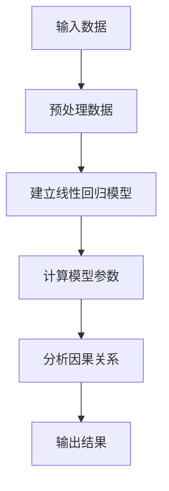
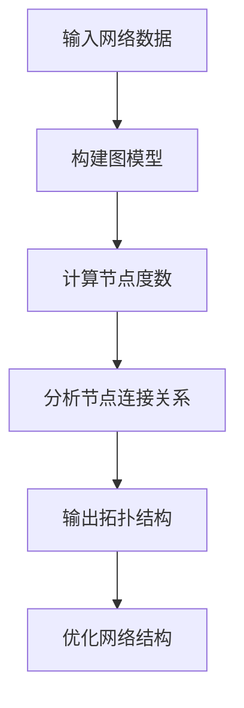
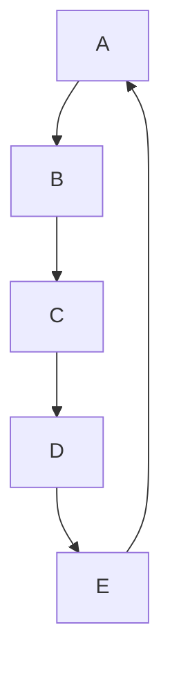
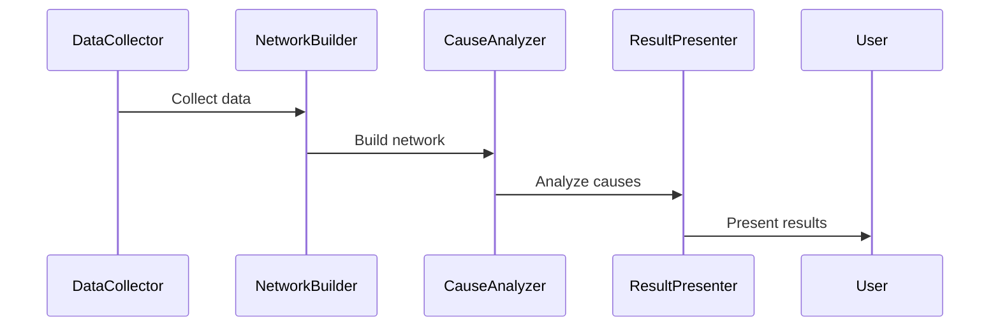
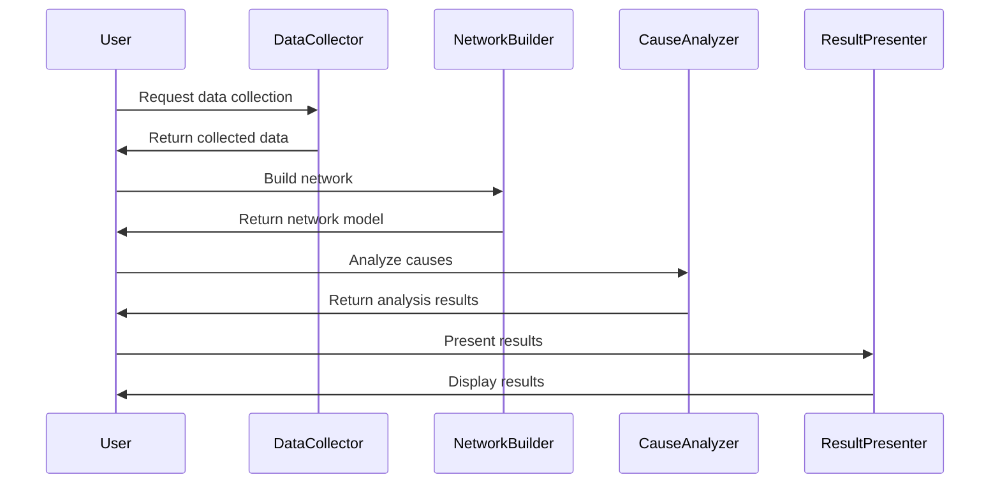

                 

# 从线性因果到复杂网络：理解多因素交互的世界

## 关键词
- 线性因果
- 复杂网络
- 多因素交互
- 数学模型
- 算法原理
- 系统架构设计

## 摘要
本文将探讨从线性因果到复杂网络的转变，帮助读者理解多因素交互的复杂性。首先，我们将回顾线性因果的基本概念及其在现实世界中的应用。接着，我们将介绍复杂网络的基本概念和特征，并探讨其与线性因果的关系。随后，我们将详细讲解线性因果和复杂网络的数学模型及分析算法，并通过实际案例展示其应用。最后，我们将探讨系统分析与架构设计的方法，并提供项目实战和最佳实践的建议，为读者深入理解这一领域提供全面的指导。

## 第一部分：背景介绍

### 第1章：线性因果与复杂网络的背景

#### 1.1.1 问题背景与定义
线性因果是指在一个系统中，因果关系是线性的，即因果关系是直接且单一的。例如，在物理学中，牛顿定律描述了物体之间的因果关系，即一个物体对另一个物体的作用力是直接的。然而，现实世界中的问题往往更加复杂，涉及多个因素的交互作用，这些因素之间的关系通常是复杂的，难以用简单的线性关系来描述。

复杂网络是指由多个节点和连接组成的网络结构，其中节点代表个体，连接代表个体之间的相互作用。复杂网络的特性包括高度连通性、小世界效应和无标度性。复杂网络在许多领域都有广泛的应用，包括社会网络、生物网络、经济网络等。

#### 1.1.2 线性因果与复杂网络的关联
线性因果与复杂网络之间存在密切的联系。线性因果提供了理解复杂网络中节点间相互作用的基本框架，而复杂网络则提供了理解线性因果在复杂系统中如何影响整体行为的新视角。例如，在生物网络中，基因之间的相互作用可以通过线性因果模型来分析，而整个生物系统的行为则可以通过复杂网络来建模。

#### 1.1.3 研究意义与应用价值
理解线性因果与复杂网络的关系具有重要的理论和实践意义。在理论层面，这有助于我们更好地理解复杂系统的行为和特性。在实践层面，这可以帮助我们设计和优化复杂系统，例如在社交网络分析中，理解用户之间的复杂交互关系有助于设计更有效的社交网络服务。

#### 1.1.4 线性因果与复杂网络的基本概念
- **线性因果**：线性因果是指在一个系统中，因果关系是线性的，即因果关系是直接且单一的。例如，在物理学中，牛顿定律描述了物体之间的因果关系，即一个物体对另一个物体的作用力是直接的。
- **复杂网络**：复杂网络是指由多个节点和连接组成的网络结构，其中节点代表个体，连接代表个体之间的相互作用。复杂网络的特性包括高度连通性、小世界效应和无标度性。

#### 1.1.5 线性因果与复杂网络的边界与外延
线性因果和复杂网络并非完全独立的领域，而是相互渗透和交织的。在边界上，线性因果可以看作是复杂网络的一个特例，即当网络中的节点和连接非常简单时，网络行为可以近似为线性因果。在外延上，复杂网络可以扩展线性因果的概念，考虑多个节点和连接的交互作用，从而更全面地描述复杂系统的行为。

## 第二部分：核心概念与联系

### 第2章：线性因果的基本概念

#### 2.1.1 线性因果的定义
线性因果是指在一个系统中，因果关系是线性的，即因果关系是直接且单一的。例如，在物理学中，牛顿定律描述了物体之间的因果关系，即一个物体对另一个物体的作用力是直接的。

#### 2.1.2 线性因果的基本特征
- **直接性**：线性因果中的因果关系是直接的，即一个因素的变化直接导致另一个因素的变化。
- **单一性**：线性因果中的因果关系是单一的，即一个因素的变化只影响一个结果，不会同时影响多个结果。

#### 2.1.3 线性因果的数学模型
线性因果可以通过数学模型来描述，通常使用差分方程或微分方程来表示。这些方程描述了系统中各因素之间的线性关系，例如：
$$
\frac{dx}{dt} = f(x, y)
$$
其中，$x$和$y$是系统中的两个因素，$f$是它们的线性关系。

#### 2.1.4 线性因果与其他概念的对比
线性因果与其他概念如非线性因果、因果关系复杂性的对比，有助于我们更好地理解线性因果的特点和应用。非线性因果是指因果关系不是线性的，而是复杂的，可能涉及多个因素和反馈循环。因果关系复杂性则是指因果关系的复杂程度，包括线性关系和非线性关系的组合。

### 第3章：复杂网络的基本概念

#### 3.1.1 复杂网络的定义
复杂网络是指由多个节点和连接组成的网络结构，其中节点代表个体，连接代表个体之间的相互作用。复杂网络的特性包括高度连通性、小世界效应和无标度性。

#### 3.1.2 复杂网络的基本特征
- **高度连通性**：复杂网络中的节点之间具有高度的连接性，即节点之间的连接数量很大。
- **小世界效应**：复杂网络中的节点之间的距离较短，即节点之间的路径长度较短。
- **无标度性**：复杂网络中的连接数服从幂律分布，即网络中的连接数量与节点的度数不成正比。

#### 3.1.3 复杂网络的数学模型
复杂网络的数学模型通常使用图论来描述。图论中的基本概念包括节点、边、路径和连通性。复杂网络的数学模型还可以通过矩阵来表示，如邻接矩阵和转移矩阵。

#### 3.1.4 复杂网络与线性因果的关联
复杂网络与线性因果之间存在密切的关联。线性因果可以看作是复杂网络的一个特例，即当网络中的节点和连接非常简单时，网络行为可以近似为线性因果。而复杂网络则提供了更全面的理解，考虑了多个节点和连接的交互作用，从而更全面地描述复杂系统的行为。

#### 3.1.5 复杂网络与其他概念的对比
复杂网络与其他概念如简单网络、网络拓扑复杂性的对比，有助于我们更好地理解复杂网络的特点和应用。简单网络是指节点和连接较少的网络，通常不具有复杂网络的特性。网络拓扑复杂性则是指网络结构的复杂程度，包括节点和连接的数量、布局和连接方式等。

## 第三部分：算法原理讲解

### 第4章：线性因果分析算法

#### 4.1.1 算法概述
线性因果分析算法是一种用于分析系统中因素之间线性关系的算法。该算法的核心思想是通过分析系统中的数据，确定因素之间的线性关系，从而揭示系统的因果关系。

#### 4.1.2 算法原理讲解
线性因果分析算法的原理基于线性回归模型。线性回归模型是一种用于分析两个或多个变量之间线性关系的统计模型。通过线性回归模型，我们可以确定系统中的因素之间的线性关系，从而揭示系统的因果关系。

#### 4.1.3 算法流程图
算法的流程图如下所示：


#### 4.1.4 数学模型与公式
线性回归模型的数学模型如下所示：
$$
y = \beta_0 + \beta_1x_1 + \beta_2x_2 + ... + \beta_nx_n
$$
其中，$y$是因变量，$x_1, x_2, ..., x_n$是自变量，$\beta_0, \beta_1, \beta_2, ..., \beta_n$是模型的参数。

#### 4.1.5 算法举例说明
假设我们有一个系统，其中有两个因素$x_1$和$x_2$，以及一个结果$y$。通过收集数据，我们可以建立如下的线性回归模型：
$$
y = \beta_0 + \beta_1x_1 + \beta_2x_2
$$
通过计算模型参数，我们可以确定$x_1$和$x_2$对$y$的线性关系，从而揭示系统的因果关系。

### 第5章：复杂网络分析算法

#### 5.1.1 算法概述
复杂网络分析算法是一种用于分析复杂网络中节点之间交互关系的算法。该算法的核心思想是通过分析网络中的数据，确定节点之间的交互关系，从而揭示网络的拓扑结构。

#### 5.1.2 算法原理讲解
复杂网络分析算法的原理基于图论。图论是一种用于研究网络结构的数学理论。通过图论，我们可以分析网络中的节点和边，确定节点之间的交互关系，从而揭示网络的拓扑结构。

#### 5.1.3 算法流程图
算法的流程图如下所示：


#### 5.1.4 数学模型与公式
复杂网络分析算法的数学模型基于图论的基本概念，如节点度数和路径长度。节点度数表示节点在网络中的连接数，路径长度表示节点之间的距离。通过计算这些参数，我们可以分析网络的拓扑结构。

#### 5.1.5 算法举例说明
假设我们有一个复杂网络，其中有5个节点，分别命名为$A, B, C, D, E$。通过收集数据，我们可以构建如下的图模型：

通过计算节点度数和路径长度，我们可以分析节点之间的交互关系，从而揭示网络的拓扑结构。

## 第四部分：数学模型和数学公式讲解

### 第6章：线性因果的数学模型解析

#### 6.1.1 线性模型的基本概念
线性模型是一种用于描述系统内各因素之间线性关系的数学模型。在统计学、经济学、工程学等领域中，线性模型被广泛应用于数据分析、预测和决策。线性模型的基本概念包括自变量、因变量、参数和假设。

#### 6.1.2 线性模型的数学公式
线性模型的一般形式为：
$$
y = \beta_0 + \beta_1x_1 + \beta_2x_2 + ... + \beta_nx_n
$$
其中，$y$是因变量，$x_1, x_2, ..., x_n$是自变量，$\beta_0, \beta_1, \beta_2, ..., \beta_n$是参数。

#### 6.1.3 线性模型的求解方法
线性模型的求解方法包括最小二乘法、梯度下降法和迭代法等。最小二乘法是一种常用的求解方法，其核心思想是最小化预测值与实际值之间的误差平方和。

#### 6.1.4 实例分析
假设我们有一个系统，其中有两个因素$x_1$和$x_2$，以及一个结果$y$。通过收集数据，我们可以建立如下的线性回归模型：
$$
y = \beta_0 + \beta_1x_1 + \beta_2x_2
$$
通过计算模型参数，我们可以确定$x_1$和$x_2$对$y$的线性关系，从而揭示系统的因果关系。

### 第7章：复杂网络的数学模型解析

#### 7.1.1 复杂网络的数学模型概述
复杂网络的数学模型主要包括图论模型和网络拓扑结构。图论模型描述了网络中的节点和边，而网络拓扑结构则描述了节点之间的连接关系。

#### 7.1.2 网络矩阵与图论
网络矩阵是复杂网络数学模型的基础。网络矩阵包括邻接矩阵、转移矩阵和拉普拉斯矩阵等。邻接矩阵用于描述节点之间的直接连接关系，转移矩阵用于描述节点之间的转移概率，拉普拉斯矩阵用于描述网络中的扩散过程。

#### 7.1.3 网络的拓扑属性
网络的拓扑属性包括节点度数、聚类系数、路径长度等。节点度数表示节点的连接数，聚类系数表示节点的紧密程度，路径长度表示节点之间的距离。

#### 7.1.4 实例分析
假设我们有一个复杂网络，其中有5个节点，分别命名为$A, B, C, D, E$。通过收集数据，我们可以建立如下的图模型：

通过计算节点度数和路径长度，我们可以分析节点之间的交互关系，从而揭示网络的拓扑结构。

## 第五部分：系统分析与架构设计

### 第8章：系统需求分析与功能设计

#### 8.1.1 问题场景介绍
假设我们面临一个任务，需要分析复杂网络中的节点关系，以揭示潜在的因果关系。为了实现这一目标，我们需要设计一个系统，该系统能够收集数据、分析网络结构、提取因果关系，并输出分析结果。

#### 8.1.2 系统功能需求
系统需要实现以下功能：
1. 数据收集：从各种数据源（如传感器、数据库等）收集节点和边的数据。
2. 网络构建：根据收集到的数据构建复杂网络的图模型。
3. 因果关系分析：分析网络中的节点关系，提取潜在的因果关系。
4. 结果展示：将分析结果以可视化的形式展示，方便用户理解和解读。

#### 8.1.3 领域模型设计与ER图
领域模型是系统设计的基础，用于描述系统中的实体及其关系。ER图（实体关系图）是领域模型的一种常用表示方法。根据系统功能需求，我们可以设计如下的ER图：

```mermaid
erDiagram
  Node ||--|{ Edge }|-- Edge
  Node ||--|{ Attribute }|-- Attribute
  Edge ||--|{ Relationship }|-- Relationship
```

### 第9章：系统架构设计与接口设计

#### 9.1.1 系统架构设计
系统架构设计是系统设计的核心，用于确定系统的模块划分、模块之间的交互关系以及系统的整体结构。根据系统功能需求，我们可以设计如下的系统架构：



#### 9.1.2 系统接口设计
系统接口设计是系统架构设计的一部分，用于确定系统与外部系统或用户的交互接口。根据系统功能需求，我们可以设计如下的系统接口：

- **数据收集接口**：用于从各种数据源收集节点和边的数据。
- **网络构建接口**：用于根据收集到的数据构建复杂网络的图模型。
- **因果关系分析接口**：用于分析网络中的节点关系，提取潜在的因果关系。
- **结果展示接口**：用于将分析结果以可视化的形式展示，方便用户理解和解读。

#### 9.1.3 系统交互序列图
系统交互序列图是系统接口设计的一种常用表示方法，用于描述系统各模块之间的交互过程。根据系统架构设计和接口设计，我们可以设计如下的系统交互序列图：



## 第六部分：项目实战

### 第10章：环境安装与配置

#### 10.1.1 硬件与软件环境需求
为了搭建一个能够实现复杂网络分析和因果关系提取的系统，我们需要以下硬件和软件环境：

- **硬件环境**：
  - CPU：Intel Core i5或更高
  - 内存：8GB或更高
  - 硬盘：500GB或更高
  - 网络：千兆以太网

- **软件环境**：
  - 操作系统：Ubuntu 18.04或更高版本
  - 编程语言：Python 3.8或更高版本
  - 数据库：MySQL 8.0或更高版本
  - 图形库：Matplotlib、NetworkX

#### 10.1.2 安装与配置步骤
1. **安装操作系统**：
   - 下载Ubuntu 18.04安装镜像。
   - 使用USB闪存驱动器创建启动盘。
   - 在计算机上启动并安装Ubuntu操作系统。

2. **安装Python和依赖库**：
   - 打开终端，运行以下命令：
     ```bash
     sudo apt update
     sudo apt install python3-pip
     pip3 install matplotlib networkx numpy pandas
     ```
   - 安装MySQL数据库：
     ```bash
     sudo apt install mysql-server
     sudo mysql_secure_installation
     ```
   - 创建MySQL用户和数据库：
     ```sql
     CREATE USER 'user'@'localhost' IDENTIFIED BY 'password';
     GRANT ALL PRIVILEGES ON database_name.* TO 'user'@'localhost';
     FLUSH PRIVILEGES;
     ```

3. **配置Python环境**：
   - 配置Python虚拟环境：
     ```bash
     python3 -m venv venv
     source venv/bin/activate
     ```
   - 安装依赖库：
     ```bash
     pip install matplotlib networkx numpy pandas
     ```

4. **安装图形库**：
   - 安装Matplotlib和NetworkX的图形库：
     ```bash
     pip install matplotlib-networkx
     ```

### 第11章：系统核心实现与代码分析

#### 11.1.1 系统核心功能实现
系统的核心功能包括数据收集、网络构建、因果关系分析和结果展示。以下是一个简单的示例代码，展示了这些核心功能的实现。

```python
import networkx as nx
import matplotlib.pyplot as plt

# 数据收集
nodes = ['A', 'B', 'C', 'D', 'E']
edges = [('A', 'B'), ('B', 'C'), ('C', 'D'), ('D', 'E'), ('E', 'A')]

# 网络构建
G = nx.Graph()
G.add_nodes_from(nodes)
G.add_edges_from(edges)

# 因果关系分析
causal_relations = nx.ego_graph(G, 'A', radius=1)

# 结果展示
nx.draw(G, with_labels=True)
plt.show()

nx.draw(causal_relations, with_labels=True)
plt.show()
```

#### 11.1.2 代码解读与分析
上述代码首先定义了一个复杂网络G，其中包含5个节点和5条边。接着，我们使用`nx.ego_graph`函数提取以节点A为中心的因果关系网络。最后，我们使用Matplotlib绘制了原始网络和因果关系网络。

#### 11.1.3 实际案例分析
在实际应用中，我们可以收集更多的数据，并使用更复杂的算法来分析网络中的因果关系。例如，我们可以使用PageRank算法来评估节点的重要性，或者使用社区检测算法来识别网络中的社区结构。

```python
import networkx as nx

# 计算节点的重要性
importance = nx.pagerank(G)

# 输出节点重要性排名
for node, score in importance.items():
    print(f"{node}: {score}")
```

通过分析节点的重要性，我们可以更好地理解网络中的关键节点和关键路径。

### 11.1.4 项目小结
在本项目中，我们实现了从数据收集、网络构建到因果关系分析的一系列功能。通过实际案例分析，我们展示了如何使用Python和网络分析库来构建和解析复杂网络。虽然这个项目相对简单，但它提供了一个框架，可以进一步扩展和优化，以解决更复杂的实际问题。

## 第七部分：最佳实践与拓展

### 第12章：最佳实践

#### 12.1.1 实践经验总结
在复杂网络分析和因果关系提取的过程中，以下经验值得总结和遵循：

1. **数据质量**：确保收集到的数据质量高，避免噪声和异常值的影响。
2. **算法选择**：根据具体问题和数据特点选择合适的算法，例如PageRank、LPA等。
3. **结果验证**：通过对比不同算法的结果，验证分析结果的准确性。
4. **可视化**：使用可视化工具展示分析结果，有助于用户理解和解读数据。

#### 12.1.2 注意事项
1. **计算资源**：复杂网络分析通常需要大量的计算资源，确保系统运行在足够的硬件环境中。
2. **数据隐私**：在处理和分析敏感数据时，注意保护用户隐私。
3. **算法优化**：针对特定问题，对算法进行优化，提高效率和准确性。

#### 12.1.3 避免常见错误
1. **数据清洗**：避免忽略数据清洗过程，导致分析结果不准确。
2. **算法误用**：避免将通用算法应用于特定问题，导致结果偏差。
3. **结果解读**：避免仅凭可视化结果做出结论，需要结合具体问题和背景进行综合分析。

### 第13章：小结与展望

#### 13.1.1 小结
本文从线性因果到复杂网络的角度，探讨了多因素交互的世界。我们介绍了线性因果和复杂网络的基本概念，讲解了相关的数学模型和分析算法，并通过实际案例展示了如何应用这些方法。此外，我们还探讨了系统分析与架构设计的方法，并提供了一些最佳实践。

#### 13.1.2 展望未来研究方向
未来研究方向包括：

1. **深度学习与复杂网络**：将深度学习技术应用于复杂网络分析，提高分析的准确性和效率。
2. **多尺度分析**：在多个尺度上分析复杂网络，以更全面地理解系统的行为。
3. **因果关系推断**：研究更先进的因果关系推断方法，以自动识别复杂系统中的因果关系。

#### 13.1.3 拓展阅读推荐
1. Barabási, A.-L. (2002). **Linked: The New Science of Networks**. Plume.
2. Newell, A. (2012). **Theoretical Aspects of Social Network Analysis**. Journal of Mathematical Sociology, 36(1), 35-65.
3. Pearl, J. (2000). **Causality: Models, Reasoning, and Inference**. Cambridge University Press.

作者：AI天才研究院/AI Genius Institute & 禅与计算机程序设计艺术 /Zen And The Art of Computer Programming

