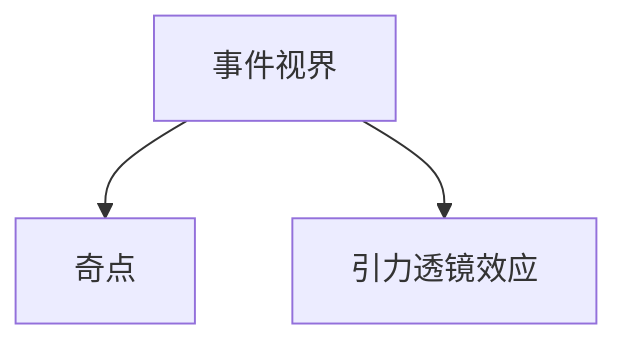
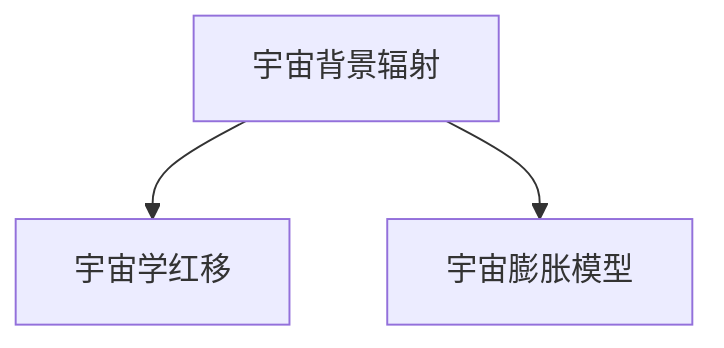
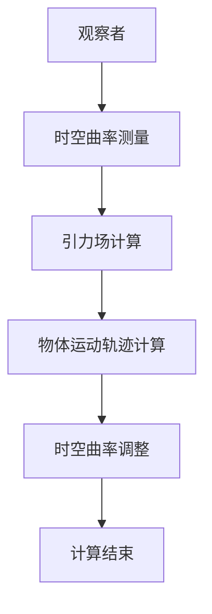
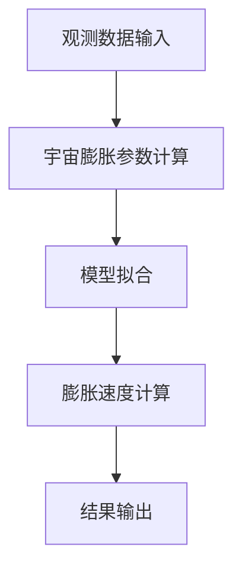
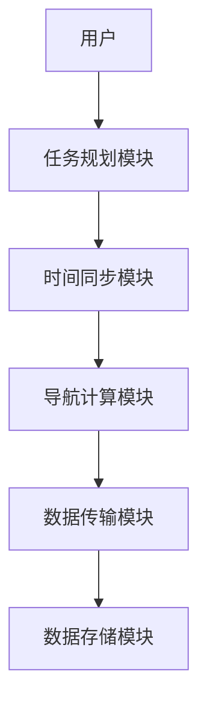
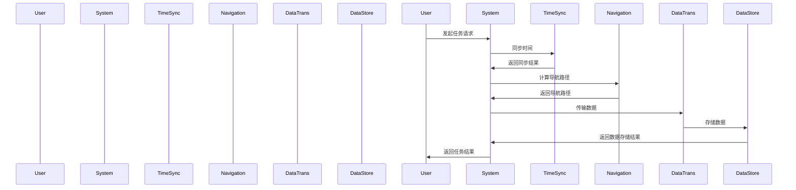

                 


## 从线性时间观到多维时空观：重新认识时间与世界的关系

> 关键词：时间观、线性时间、多维时空、相对论、量子力学、宇宙学

> 摘要：本文旨在深入探讨从线性时间观到多维时空观的转变，阐述这一转变对科学、哲学以及人类认知的深远影响。我们将通过历史背景、哲学基础、科学应用、批评反思、现代解读等角度，逐步分析这一转变的必要性和重要性。通过本文的阅读，读者将能够重新认识时间与世界的关系，理解多维时空观的科学基础和哲学意义。

## 1.1 时间观的演变

### 1.1.1 线性时间观的历史背景

线性时间观起源于古希腊哲学，柏拉图和亚里士多德等哲学家的思想奠定了线性时间的基础。他们认为时间是一条不断前进的直线，过去、现在和未来都是可以明确区分的。这一观点在基督教哲学中得到了进一步的发展，圣经中的创世纪将时间的起点固定在上帝创造世界的那一刻。

在中世纪，线性时间观受到教会权威的强化，时间被认为是上帝创造的，是神圣的、不可改变的。这种观点在文艺复兴时期开始受到质疑，科学家们开始探索自然界的规律，线性时间观逐渐被质疑和挑战。

### 1.1.2 线性时间观的局限性

尽管线性时间观在历史上发挥了重要作用，但它也存在一些局限性。首先，线性时间观无法解释宇宙的起源和终结，也无法解释宇宙的膨胀和黑洞等现象。其次，线性时间观忽略了时间的相对性，即不同参考系中的时间可能存在差异。

最后，线性时间观在哲学上也有一定的局限性。它忽视了时间的循环性和永恒性，这种观点可能会限制我们对宇宙和生命的理解。因此，重新认识时间与世界的关系，探索多维时空观具有重要意义。

## 1.2 多维时空观的兴起

### 1.2.1 相对论的时空观

相对论的提出标志着多维时空观的兴起。爱因斯坦的相对论提出了时空的相对性，即时空不是固定的，而是随着观察者的运动状态而变化。相对论中的时空结构是一个四维的时空连续体，包括三个空间维度和一个时间维度。

相对论中的时空曲率也是多维时空观的一个重要概念。爱因斯坦的广义相对论认为，物质和能量会影响时空的结构，形成引力。这种时空曲率的概念为理解宇宙的膨胀、黑洞和虫洞等现象提供了新的视角。

### 1.2.2 宇宙学中的多维时空

宇宙学中的多维时空观进一步拓展了相对论的概念。宇宙学家通过观测宇宙的膨胀和宇宙背景辐射等现象，提出了宇宙具有多维结构。这些维度可能包括我们熟知的三个空间维度和一个时间维度，也可能包括我们尚未发现的额外维度。

宇宙学中的多维时空观还提出了多宇宙的概念，即可能存在多个宇宙，它们之间相互独立，但可能存在某种形式的联系。这一观点为理解宇宙的起源和命运提供了新的线索。

## 1.3 重新认识时间与世界的必要性

### 1.3.1 当代科学对时间观的挑战

当代科学对时间观提出了新的挑战，尤其是在量子力学和宇宙学领域。量子力学揭示了时间的不确定性，即时间在量子层面上并不是一个连续的、均匀的进程。量子纠缠现象甚至表明，时间可能并不是单向的，而是可以逆向流动的。

宇宙学中的大爆炸理论和宇宙膨胀现象也对线性时间观提出了质疑。宇宙的膨胀表明时间并不是无限的，宇宙可能有一个起点，也可能有一个终结。这些科学发现要求我们重新审视时间与世界的关系。

### 1.3.2 对人类认知的深远影响

重新认识时间与世界的关系对人类认知有着深远的影响。它不仅改变了我们对宇宙和生命的理解，也影响了我们的哲学思考、宗教信仰和社会制度。

例如，对时间的不确定性认识可能引发新的哲学思考，如时间的本质、存在的意义等问题。对多维时空的认识可能改变我们对自然界的理解，推动新的科学发现和技术创新。

### 1.3.3 重新认识时间与世界的必要性

总之，重新认识时间与世界的关系是当代科学发展的必然要求。它不仅有助于我们更深入地理解宇宙和生命的本质，也为人类的哲学思考、宗教信仰和社会制度提供了新的视角。通过重新认识时间与世界的关系，我们可以更好地应对当代科学的挑战，推动人类文明的进步。

## 1.4 本书结构安排与内容概述

### 1.4.1 各章节内容的逻辑联系

本书分为五个部分，第一部分是引论，介绍时间观的演变和多维时空观的兴起；第二部分是线性时间观，分析其哲学基础、科学应用、批评反思和现代解读；第三部分是多维时空观，探讨相对论的时空结构、广义相对论与黑洞、虫洞与多维时空的探索、量子力学与时空的交织以及多维时空观在宇宙学中的应用；第四部分是时间与世界的关系，分析时间作为物质存在的方式、时间与世界的关系模型、时间认知的心理学探讨、社会文化与时间的意义以及时间与世界关系的哲学反思；第五部分是未来展望与挑战，讨论新的科学发现对时间观的影响、人类对时间的新认识与实践、时空观在科技与哲学的交汇点以及未来时间观的挑战与机遇。

### 1.4.2 阅读指引与学习目标

本书旨在帮助读者重新认识时间与世界的关系，理解多维时空观的科学基础和哲学意义。通过阅读本书，读者将能够：

1. 理解线性时间观的历史背景和哲学基础。
2. 分析线性时间观在科学中的应用和批评反思。
3. 掌握多维时空观的基本原理和应用。
4. 认识时间与世界的关系模型和心理探讨。
5. 了解社会文化与时间的意义和哲学反思。
6. 预见未来时间观的挑战与机遇。

通过本书的阅读，读者将能够更全面地理解时间与世界的关系，为未来的科学研究和技术创新提供新的视角。

## 2.1 线性时间观的哲学基础

### 2.1.1 希腊哲学与线性时间

希腊哲学是线性时间观的起源，柏拉图和亚里士多德等哲学家的思想为线性时间观奠定了基础。柏拉图认为时间是一条不断前进的直线，是永恒真理的体现。亚里士多德进一步发展了这一观点，认为时间是由运动产生的，是事物变化的度量。

在希腊哲学中，线性时间观被广泛应用于解释宇宙和生命的本质。亚里士多德认为，宇宙是一个永恒的、有序的系统，时间是宇宙运动和变化的基础。这一观点在后来的西方哲学中得到了延续和发展。

### 2.1.2 基督教哲学与线性时间

基督教哲学对线性时间观进行了进一步的发展。在圣经中，创世纪将时间的起点固定在上帝创造世界的那一刻。这一观点强调了时间的神圣性和不可改变性，将时间视为上帝的创造和安排。

中世纪的基督教哲学家，如托马斯·阿奎那，进一步将线性时间观与神的计划联系起来，认为时间是上帝意志的体现。这种观点在教会权威的强化下，成为基督教哲学的核心。

### 2.1.3 线性时间观的哲学意义

线性时间观在哲学上具有重要的意义。首先，它为解释宇宙和生命的本质提供了基础。线性时间观认为，宇宙和生命是一个有序的系统，时间是这一系统的度量。这种观点有助于我们理解宇宙的起源和终结，生命的意义和价值。

其次，线性时间观强调了时间的连续性和统一性。它认为时间是一个连续的整体，过去、现在和未来是相互关联的。这种观点有助于我们理解事物的变化和发展，以及不同时间和空间之间的联系。

然而，线性时间观也存在一定的局限性。它无法解释宇宙的起源和终结，也无法解释时间的相对性。这些问题在后来的科学发展中逐渐得到了解决，推动了多维时空观的兴起。

## 2.2 线性时间观在科学中的应用

### 2.2.1 古典物理学的线性时间

线性时间观在古典物理学中得到了广泛应用。牛顿的经典力学认为，时间和空间是绝对的，时间是均匀流逝的，与物体运动无关。牛顿的三大定律和万有引力定律都建立在时间均匀流逝的基础上。

在牛顿的物理学中，时间是一个外在的、独立的参数，用于度量物体的运动和变化。这种观点在解释宏观物理现象时非常有效，但无法解释微观现象和相对论效应。

### 2.2.2 生物学中的线性演化

线性时间观在生物学中也有广泛的应用。达尔文的进化论认为，生物物种是通过时间的不断演变而形成的。生物物种的进化是一个有序的过程，时间是其度量。

生物学中的线性时间观有助于我们理解生物多样性和物种的形成。通过研究生物化石和遗传学，科学家们可以重建生物进化的历史，了解物种之间的演化关系。

### 2.2.3 线性时间观在其他科学领域中的应用

除了物理学和生物学，线性时间观在化学、地球科学、天文学等科学领域也有广泛的应用。化学中的化学反应速率、地球科学中的地质年代、天文学中的宇宙年龄等都是基于线性时间观的。

这些科学领域中的线性时间观为研究自然现象和过程提供了基本框架。通过精确测量时间和变化，科学家们可以揭示自然界的规律，推动科学进步。

## 2.3 线性时间观的批评与反思

### 2.3.1 历史相对论的观点

历史相对论是对线性时间观的一种批评。历史相对论认为，时间并不是一个绝对的、均匀流逝的参数，而是与观察者和参考系相关的。历史相对论的观点源于爱因斯坦的相对论，特别是广义相对论。

在历史相对论中，时间的流逝取决于观察者的运动状态和引力环境。例如，一个在高速运动中的观察者和一个处于强引力场中的观察者，所经历的时间可能是不同的。这种观点挑战了线性时间观的绝对性和统一性。

### 2.3.2 量子力学对线性时间的挑战

量子力学对线性时间观提出了更大的挑战。量子力学揭示了时间的相对性和不确定性，即时间在量子层面上并不是一个连续的、均匀的进程。量子力学中的时间是一个动态的、不稳定的参数，与测量和观察密切相关。

量子力学中的基本原理，如量子纠缠和量子隧穿，表明时间可能并不是单向的，而是可以逆向流动的。这些现象挑战了线性时间观的连续性和确定性。

### 2.3.3 对线性时间观的反思

尽管线性时间观在科学和哲学中发挥了重要作用，但它也存在一些局限性。历史相对论和量子力学的发展表明，时间并不是一个绝对的、均匀流逝的参数，而是与观察者和参考系相关的。

对线性时间观的批评和反思推动了科学的发展，促进了多维时空观的兴起。通过重新审视时间与世界的关系，我们可以更全面地理解宇宙和生命的本质，为未来的科学研究和技术创新提供新的视角。

## 2.4 线性时间观的现代解读

### 2.4.1 时间经济学

线性时间观在经济学领域得到了现代解读，形成了时间经济学。时间经济学认为，时间是经济学中的基本要素，与资源、劳动和资本一样，是生产力的关键。

时间经济学研究如何优化时间的利用，提高生产效率和经济效益。它关注时间价值、时间成本和时间配置等问题，通过量化时间和资源的交换关系，分析经济活动的效率。

### 2.4.2 时间管理与生产力提升

时间经济学在时间管理和生产力提升方面具有重要应用。通过合理规划和优化时间，企业可以减少生产成本，提高生产效率。时间管理工具和技术，如任务管理软件和生产力分析工具，帮助企业更好地利用时间资源。

时间经济学还关注工作与生活的平衡，强调个人对时间的管理和利用，提高生活质量和工作效率。通过合理规划时间，个人可以更好地平衡工作和生活，实现个人目标。

### 2.4.3 时间经济学与多维时空观的融合

时间经济学与多维时空观有着紧密的联系。多维时空观认为时间是一个多维的参数，与空间维度相互交织。时间经济学中的时间价值、时间成本和时间配置等问题，都可以在多维时空观的框架下得到新的解读和解决方法。

通过将时间经济学与多维时空观相结合，我们可以更全面地理解时间与资源的关系，优化时间和资源的配置，提高经济活动的效率和效益。这为未来的经济学研究提供了新的视角和工具。

## 2.5 本章小结

本章分析了线性时间观的哲学基础、科学应用、批评与反思以及现代解读。从希腊哲学和基督教哲学的起源，到古典物理学和生物学的应用，线性时间观在科学和哲学中发挥了重要作用。然而，历史相对论和量子力学的发展对线性时间观提出了批评，推动了多维时空观的兴起。在现代解读中，时间经济学和时间管理与生产力提升成为重要研究方向。通过本章的学习，读者可以更好地理解线性时间观的基本概念和应用，为后续章节的学习打下基础。

## 3.1 相对论中的时空结构

### 3.1.1 爱因斯坦的相对论时空

爱因斯坦的相对论是现代物理学的重要基石，特别是狭义相对论和广义相对论对时空结构做出了革命性的阐述。狭义相对论提出了时空的相对性，即时间和空间的度量依赖于观察者的运动状态。

在狭义相对论中，爱因斯坦提出了著名的时间膨胀效应和长度收缩效应。时间膨胀是指当一个物体以接近光速的速度运动时，其所经历的时间相对于静止的观察者会变慢。长度收缩则是指运动物体的长度在其运动方向上会缩短。这两个效应揭示了时间和空间的相对性，推翻了经典物理学中时间和空间是绝对和独立的观点。

### 3.1.2 广义相对论与时空曲率

广义相对论则进一步扩展了相对论时空观，提出了引力与时空曲率的关系。爱因斯坦在广义相对论中引入了引力场方程，将引力解释为时空的曲率。这一理论认为，质量和能量会影响时空的几何结构，产生引力。

在广义相对论中，时空被视为一个四维的时空连续体，包括三个空间维度和一个时间维度。时空的曲率决定了物体的运动轨迹，即物体的运动路径受到时空结构的影响。例如，行星绕太阳的轨道、光线在引力场中的偏折等现象都可以通过广义相对论得到解释。

### 3.1.3 时空连续体的数学描述

广义相对论中的时空连续体可以用数学方程来描述，即爱因斯坦场方程。该方程是一个偏微分方程，描述了时空曲率与物质分布之间的关系。通过这个方程，可以计算出时空的几何结构和引力场。

在数学上，时空连续体可以用黎曼几何来描述，其中时空的曲率通过黎曼张量场来表示。黎曼几何提供了一种描述时空几何特性的工具，使得广义相对论能够在数学框架内得到严格的表述和验证。

### 3.1.4 时空结构的基本概念

广义相对论中的时空结构包含以下几个基本概念：

- **事件**：时空中的一个点，表示一个事件的发生。
- **世界线**：连接事件的一个路径，描述物体在时空中的运动轨迹。
- **测地线**：在时空曲率中，连接两个事件的曲线，在给定的参考系中是最短路径。
- **黑洞**：一个事件视界的内部，其中引力场足够强，使得连光也无法逃逸。
- **虫洞**：连接两个不同时空区域的通道，可能允许物质和信息的瞬间传输。

这些概念共同构成了广义相对论中的时空结构，提供了对引力现象和宇宙结构的深刻理解。

## 3.2 广义相对论与黑洞

### 3.2.1 广义相对论的基本原理

广义相对论的基本原理包括等效原理和广义协变原理。等效原理指出，局部惯性系中的物理现象与重力场中的物理现象是等效的。广义协变原理则强调物理定律在所有参考系中都是协变的，即物理现象的描述不依赖于特定的参考系。

这些原理构成了广义相对论的理论基础，使得引力现象可以统一在时空几何的框架内进行描述。通过广义相对论，我们可以理解引力如何影响时空结构，以及物质和能量如何影响引力场。

### 3.2.2 黑洞的性质与现象

黑洞是广义相对论的一个重大预测，是一种极其紧凑、密度极大的天体。黑洞的形成通常发生在恒星耗尽其核燃料后，通过坍缩形成。在黑洞的中心，引力场是如此之强，以至于连光线也无法逃脱，这形成了黑洞的事件视界。

黑洞具有以下几个重要性质：

- **事件视界**：黑洞的外部边界，即光线无法逃逸的最远点。
- **奇点**：黑洞内部引力场无限强的地方，物质的密度也无限大。
- **引力透镜效应**：黑洞对周围光的弯曲效应，可以用于探测黑洞的存在。
- **吸积盘**：黑洞周围的高温物质盘，其物质被黑洞引力吸积并释放出巨大的能量。

黑洞的现象可以通过广义相对论得到解释，例如黑洞的引力透镜效应和吸积盘的辐射特征。这些现象为验证广义相对论提供了重要的观测依据。

### 3.2.3 黑洞的研究进展与未来方向

近年来，黑洞的研究取得了显著进展。例如，2015年，LIGO探测器首次直接探测到了黑洞合并产生的引力波信号，这是广义相对论的重要验证。此外，黑洞吸积盘的观测和研究也揭示了黑洞周围的复杂物理过程。

未来的黑洞研究将继续深入探索黑洞的形成、演化以及与周围环境的相互作用。随着望远镜和探测器技术的进步，我们可以期望获得更多关于黑洞的观测数据和理论理解。

## 3.3 虫洞与多维时空的探索

### 3.3.1 虫洞的理论基础

虫洞是连接两个不同时空区域的理论通道，类似于一个“时空隧道”。虫洞的概念最早由爱因斯坦和罗森在1935年提出，他们通过引力透镜效应提出了可能存在的“爱因斯坦-罗森桥”。

虫洞的理论基础主要包括以下几个方面：

- **引力透镜效应**：强引力场可以弯曲时空，使光线发生偏折。这一效应可以被用来探测和确认虫洞的存在。
- **量子力学与引力理论的融合**：虫洞的研究需要量子力学和广义相对论的结合，以解释量子效应如何影响引力场和时空结构。
- **虫洞稳定性的问题**：虫洞的稳定性是一个关键问题。根据目前的理解，虫洞可能非常短暂，无法稳定存在。为了维持虫洞的稳定性，需要引入负能量的“外来物质”。

### 3.3.2 虫洞在实际应用中的可能性

尽管虫洞的存在尚未得到直接观测和实验验证，但它在理论物理学中仍具有广阔的应用前景：

- **宇宙航行**：虫洞可能成为宇宙航行的捷径，实现快速跨越星际距离。如果虫洞能够稳定存在，理论上我们可以通过它实现瞬间旅行。
- **量子计算**：虫洞可能用于量子计算中的信息传输，提高量子计算的效率。
- **引力透镜效应的应用**：通过观测引力透镜效应，我们可以间接探测虫洞的存在，为宇宙学和天体物理学提供新的研究工具。

未来的研究和实验将继续探索虫洞的可能性，验证其理论基础，并探索其在实际应用中的潜在价值。

## 3.4 量子力学与时空的交织

### 3.4.1 量子力学的基本原理

量子力学是研究微观粒子行为和相互作用的理论，与经典物理学的描述有着显著的不同。量子力学的基本原理包括：

- **波粒二象性**：微观粒子既具有波动性，又具有粒子性。
- **不确定性原理**：无法同时精确测量粒子的位置和动量。
- **量子纠缠**：两个或多个粒子之间可以存在一种特殊的关联，即量子纠缠。在这种状态下，一个粒子的状态可以即时影响另一个粒子的状态，无论它们相距多远。

### 3.4.2 量子纠缠与时空结构

量子纠缠是量子力学中的一个关键现象，它对时空结构提出了新的挑战。量子纠缠表明，时间和空间的局部性可能被打破，即两个纠缠粒子之间的相互作用可能不依赖于它们之间的空间距离。

这种纠缠效应在时空结构中的表现可能是：

- **时空的非局域性**：量子纠缠打破了经典物理中时间和空间的局域性，表明信息可以瞬间传递，无论距离多远。
- **时间的非线性**：量子纠缠可能导致时间的非线性表现，即时间可能不是均匀流逝的，而是具有某种非线性的特性。
- **量子时空的几何结构**：量子力学与广义相对论的融合可能揭示量子时空的几何结构，为理解时空的本质提供新的视角。

### 3.4.3 量子力学与时空结构的融合

量子力学与时空结构的融合是当代物理学研究的一个重要方向。通过研究量子纠缠和量子场的动力学，我们可以期望揭示时空的基本性质和量子效应如何影响时空结构。

未来，量子力学与时空结构的融合可能会带来新的科学突破，为我们理解宇宙的起源、演化和最终命运提供深刻的洞见。这也为哲学和科学提供了新的思考方向，挑战我们对时间和世界的传统认识。

## 3.5 多维时空观在宇宙学中的应用

### 3.5.1 宇宙膨胀与暗物质

多维时空观在宇宙学中得到了广泛应用，特别是在解释宇宙膨胀和暗物质现象。宇宙膨胀是指宇宙在过去的某个时刻（大爆炸）开始迅速膨胀，并且至今仍在继续膨胀。

宇宙膨胀的证据包括宇宙背景辐射的观测、超新星亮度的测量以及宇宙红移的分布等。这些观测数据表明，宇宙正在加速膨胀，这一现象与广义相对论中的时空结构密切相关。

暗物质是宇宙学中的另一个重要概念，它是指不能直接观测，但通过引力效应推断存在的物质。暗物质占据了宇宙总质量的大部分，但它的具体性质和组成仍然未知。

多维时空观为理解宇宙膨胀和暗物质提供了新的视角。例如，通过引入额外的维度，我们可以解释为什么宇宙的膨胀速度会超过预期，以及暗物质如何影响宇宙的结构和演化。

### 3.5.2 多元宇宙的概念

多宇宙（Multiverse）是宇宙学中的一个假设，认为可能存在多个宇宙，它们之间相互独立，但可能存在某种形式的联系。多宇宙的概念为解释宇宙的多样性和复杂性提供了新的视角。

多宇宙的假设包括：

- **平行宇宙**：不同的宇宙之间互不干扰，各自独立发展。
- **暴胀宇宙**：宇宙在大爆炸之后迅速膨胀，形成多个宇宙。
- **层次宇宙**：宇宙之间可能存在某种联系，如通过虫洞或宇宙弦连接。

多宇宙的概念在科学和哲学上都具有重要意义，它挑战了我们对宇宙和生命的传统认识，也为未来的科学研究提供了新的方向。

## 3.6 本章小结

本章深入探讨了相对论中的时空结构，包括爱因斯坦的相对论时空观和广义相对论的基本原理。我们分析了黑洞的性质和现象，探讨了虫洞的理论基础及其在实际应用中的可能性。同时，我们探讨了量子力学与时空的交织，包括量子纠缠和量子时空的非线性特性。最后，我们探讨了多维时空观在宇宙学中的应用，如宇宙膨胀、暗物质和多宇宙的概念。通过本章的学习，读者可以更好地理解相对论和量子力学对时空结构的深刻影响，为后续章节的学习打下基础。

## 4.1 时间作为物质存在的方式

### 4.1.1 物质与时间的相互依存

时间和物质是密不可分的，时间是物质存在的方式之一。物质在时间中的存在和运动形成了我们观察到的宇宙现象。根据物理学的基本原理，物质和能量是宇宙的基本构成要素，它们在时间的流逝中不断变化和相互作用。

在经典物理学中，时间和空间被视为绝对的背景，物质在其中运动。然而，相对论和量子力学的进展表明，时间和空间是与物质和能量紧密相关的动态结构。例如，爱因斯坦的相对论指出，时间并不是绝对的，而是与观察者的运动状态和引力环境相关。量子力学中的不确定性原理也揭示了时间和空间的相对性。

### 4.1.2 能量与时间的转化

能量与时间的关系在物理学中有着重要的体现。能量是物质运动和变化的度量，而时间则是这些运动和变化的度量。在能量转化过程中，时间起着关键的作用。

在经典物理学中，能量守恒定律指出，能量在一个封闭系统中是守恒的，不会凭空产生也不会消失。然而，在实际过程中，能量会通过不同的形式转化，如动能转化为热能、化学能转化为电能等。这些转化过程都发生在时间的流逝中。

在量子力学中，能量与时间的转化更加复杂。量子态的演化是由时间演化的波函数描述的，而波函数的演化遵循量子力学的方程，如薛定谔方程。这些方程揭示了量子系统在不同时间点的状态如何变化，从而体现了能量与时间的紧密关系。

### 4.1.3 时间作为物质存在的形式

时间和物质的关系还可以从哲学角度进行探讨。在哲学中，时间被认为是物质存在的形式之一。物质在时间的流逝中展现其存在，时间和物质共同构成了我们对宇宙的理解。

例如，柏拉图认为时间是由上帝创造的，是永恒真理的体现。亚里士多德则认为时间是事物变化的度量，是事物存在的方式。这些哲学观点在某种程度上与物理学中的时间概念相吻合。

此外，现代物理学中的量子力学和相对论也对时间和物质的关系进行了深刻的探讨。量子力学中的不确定性原理和相对论中的时空结构揭示了时间和物质之间的复杂关系。这些理论不仅丰富了我们对宇宙的理解，也推动了哲学对时间和存在的思考。

### 4.1.4 总结

时间和物质的关系是物理学和哲学中一个核心问题。通过物理学的研究，我们认识到时间和物质是相互依存的，时间是物质存在的方式之一。能量与时间的转化过程进一步揭示了这一关系的复杂性。哲学上，时间和物质的关系也被广泛探讨，为我们提供了对宇宙和存在的深刻理解。

## 4.2 时间与世界的关系模型

### 4.2.1 经典模型与量子模型

经典模型与量子模型是两种不同的时间与世界的关系模型，它们在物理学中分别描述了不同尺度的现象。

**经典模型**：在经典物理学中，时间被认为是绝对的、均匀流逝的，与物体运动无关。牛顿力学和经典电磁学都是基于这种时间模型的。经典模型适用于描述宏观物理现象，如行星运动、机械运动等。在这个模型中，时间和空间是分离的，都是绝对的背景。

**量子模型**：量子力学则提出了一种完全不同的时间模型。在量子模型中，时间不再是均匀流逝的，而是与物质的运动和相互作用密切相关。量子态的演化遵循量子力学的方程，如薛定谔方程。这些方程描述了物质在不同时间点的状态如何变化。量子模型适用于描述微观物理现象，如原子结构、粒子碰撞等。

### 4.2.2 多维时空模型的分析

**多维时空模型**：广义相对论提出了一种多维时空模型，将时间和空间合并为一个四维的时空连续体。在这个模型中，时间和空间不再是分离的，而是相互交织的。物质和能量会影响时空的结构，形成引力。

**时空曲率**：在多维时空模型中，时空的曲率是一个关键概念。爱因斯坦的广义相对论认为，引力是由时空曲率产生的。质量越大、能量越集中的物体，对时空曲率的影响也越大。这导致了引力场中的物体运动轨迹发生弯曲。

**虫洞与黑洞**：多维时空模型还解释了虫洞和黑洞等现象。虫洞是连接两个不同时空区域的通道，可能允许物质和信息的瞬间传输。黑洞则是引力场极强的地方，其内部的事件视界将光和物质都困在其中。

### 4.2.3 模型比较

**优点**：

- **经典模型**：简单易懂，适用于描述宏观物理现象。
- **量子模型**：描述了微观物理现象，揭示了时间和空间的相对性。
- **多维时空模型**：统一了时间和空间，提供了对引力现象和宇宙结构的深刻理解。

**缺点**：

- **经典模型**：无法解释微观物理现象和相对论效应。
- **量子模型**：描述复杂，难以直观理解。
- **多维时空模型**：理论复杂，需要高维空间的数学工具。

综上所述，不同模型在描述时间与世界的关系时各有优缺点。经典模型适用于宏观物理现象，量子模型适用于微观物理现象，多维时空模型则提供了对引力现象和宇宙结构的深刻理解。通过比较这些模型，我们可以更全面地理解时间与世界的关系。

## 4.3 时间认知的心理学探讨

### 4.3.1 时间的感知与认知

时间认知是心理学研究的一个重要领域，它探讨了人类如何感知、理解和组织时间。时间的感知和认知不仅受到生理因素的影响，还受到心理、社会和文化因素的共同作用。

**时间的感知**：时间感知是指个体对时间流逝的主观体验。研究表明，人类对时间的感知是相对的，不同情境下对时间的感受可能会有所不同。例如，当人们处于紧张或兴奋的状态时，时间感知会变慢；而在无聊或疲倦的状态时，时间感知会加速。

**时间的认知**：时间认知是指个体对时间的理解、组织和解释。时间认知包括对时间的量化和分类、对时间序列的判断、对时间的预期和记忆等。研究表明，人类的记忆和时间感知之间存在密切的联系。例如，人们对过去时间的记忆可能比对未来时间的记忆更准确，这是因为我们对过去时间有更多的经验信息。

### 4.3.2 心理时间与个体行为

**心理时间**：心理时间是个人对时间的主观体验，与客观时间可能存在差异。心理时间不仅影响个体的感知和认知，还直接影响个体行为和决策。例如，人们对时间的预期会影响他们的行为选择。如果一个人预期某项任务需要很长时间，他们可能会提前开始，以确保任务能够按时完成。

**时间管理**：时间管理是个体对时间的有效利用和优化。良好的时间管理能力有助于提高工作和学习效率，减轻压力。时间管理策略包括设定目标、优先排序、避免拖延等。研究表明，有效的时间管理有助于提高个体的生活质量和幸福感。

**时间感知与情绪**：时间感知与情绪之间存在密切关系。情绪状态会影响个体对时间的感知。例如，积极的情绪状态可能会使时间感知变快，而消极的情绪状态可能会使时间感知变慢。这种影响不仅体现在日常生活中的短暂体验中，也体现在长期的认知和行为中。

### 4.3.3 时间认知的心理学研究方法

**实验研究**：实验研究是心理学探讨时间认知的主要方法之一。通过控制变量，实验研究可以揭示时间感知和认知的机制。例如，通过控制任务难度、时间提示等变量，研究人员可以探究不同情境下个体对时间的感知差异。

**认知神经科学**：认知神经科学结合了心理学和神经科学的成果，通过神经成像技术（如功能性磁共振成像fMRI）研究时间认知的神经基础。这些研究揭示了大脑不同区域在时间感知和认知中的作用，为理解时间认知提供了新的视角。

**跨文化研究**：跨文化研究探讨了不同文化背景下个体对时间的感知和认知差异。研究表明，不同文化对时间的重视程度、时间管理策略和时间感知方式可能存在显著差异，这反映了文化价值观对个体时间认知的深远影响。

### 4.3.4 时间认知的应用

时间认知在多个领域有着广泛的应用：

**教育**：时间认知对于学生的学习效率和效果至关重要。了解学生的时间感知和认知特点，可以帮助教师设计更有效的教学策略。

**工作**：在工作环境中，时间管理技能对于提高工作效率和减少压力至关重要。有效的培训可以帮助员工提高时间管理能力。

**健康**：时间认知与心理健康密切相关。研究表明，良好的时间管理能力和积极的时间感知有助于提高生活质量，减少心理健康问题。

总之，时间认知的心理学探讨为我们理解人类如何感知、理解和利用时间提供了深刻的洞见。通过结合实验研究、认知神经科学和跨文化研究，我们可以更全面地理解时间认知的机制和影响，为实际应用提供科学依据。

## 4.4 社会文化与时间的意义

### 4.4.1 不同文化的计时方式

时间在社会文化和历史背景中扮演着重要角色，不同文化对时间的理解和计时方式也各有特色。首先，西方文化中，时间通常被视为线性的、不可逆的，这种观点源于基督教哲学和希腊哲学的影响。西方文化强调时间的有序性和效率，时间被视为一种宝贵的资源，需要有效管理和利用。

相比之下，东方文化，尤其是中国和日本文化，更倾向于将时间视为循环性的、循环重复的。这种观点源于古代哲学，如道家和佛教的思想。在东方文化中，时间不是线性的，而是包含周期性的循环，如季节的更替、节日的庆祝等。

### 4.4.2 时间在社会制度中的作用

时间在社会制度中发挥着关键作用，不同社会制度对时间的重视程度和运用方式也各不相同。在资本主义经济体系中，时间被视为一种重要的经济资源，与生产力和经济效益密切相关。资本主义经济强调时间的有序性、竞争性和效率，时间表、工作时间和生产周期等都是组织和管理经济活动的重要工具。

在社会主义经济体系中，时间通常被视为集体利益的体现，强调时间的公平分配和社会福利。社会主义制度中的时间管理注重社会整体的和谐与发展，强调集体利益和长远规划。

### 4.4.3 时间观念的历史演变

时间观念的历史演变反映了人类文明的进步和社会变迁。在中世纪，时间主要与宗教和神学相关，被视为上帝的创造和安排。文艺复兴时期，科学家和思想家开始质疑和挑战传统的线性时间观，推动了科学革命和启蒙运动。

在工业革命时期，时间的有序性和效率得到了前所未有的重视。时钟的普及和标准化时间的引入，使得人们可以更精确地管理和安排生产和生活。现代科技的发展，如互联网和智能手机，进一步改变了人们对时间的感知和利用方式。

### 4.4.4 时间观念的文化多样性

时间观念的文化多样性不仅体现在不同文化对时间的理解和运用上，也体现在不同社会制度和经济体系对时间的重视和分配上。这种多样性为我们提供了丰富的视角，帮助我们更好地理解时间与世界的关系。

通过探讨社会文化和历史背景对时间观念的影响，我们可以更全面地理解时间在人类社会发展中的作用和意义。时间不仅是科学和哲学探讨的核心问题，也是社会制度和文化传承的重要组成部分。

## 4.5 时间与世界关系的哲学反思

### 4.5.1 存在论的时间观

存在论的时间观关注时间的本质和存在的意义。哲学家们探讨了时间的起点和终点，以及时间在存在中的作用。古希腊哲学家柏拉图认为时间是永恒真理的体现，是一种抽象的存在。亚里士多德则认为时间是事物变化的度量，是具体存在的。

中世纪哲学家如托马斯·阿奎那将时间视为上帝创造和安排的，是神圣的存在。现代哲学家如海德格尔则将时间视为存在的方式，提出了“存在-时间”的概念，强调时间在存在中的核心地位。

### 4.5.2 宇宙整体论的时间观

宇宙整体论的时间观将时间视为宇宙的演化过程。宇宙学家通过研究宇宙的起源、演化和终结，探讨了时间的本质。宇宙大爆炸理论认为宇宙有一个起点，宇宙的膨胀和演化过程形成了我们现在的宇宙。

宇宙整体论的时间观还包括了对多宇宙和宇宙周期的探讨。一些哲学家和宇宙学家认为，宇宙可能经历周期性的创生和毁灭，这种循环宇宙观念挑战了传统的时间线性观。

### 4.5.3 时间的相对性与绝对性

时间的相对性与绝对性是哲学探讨的另一个重要议题。相对论和量子力学的发展揭示了时间的相对性，即时间与观察者的运动状态和参考系相关。然而，一些哲学家仍然认为时间具有绝对性，如牛顿的绝对时间和空间观。

相对论和量子力学中的时间相对性表明，时间和空间是相互关联的，它们的度量依赖于参考系。这种相对性挑战了传统的时间观，推动了多维时空观的发展。

### 4.5.4 时间的意义与价值

时间的意义和价值是哲学探讨的另一个重要方面。哲学家们探讨了时间在存在中的意义，以及人类如何理解和利用时间。时间被视为一种资源，是人类活动和发展的基础。有效的时间管理可以提高生产力和生活质量。

同时，时间也具有精神层面的意义。哲学家如庄子提出了“时间即生命”的观点，强调时间的珍贵和有限。这种观点鼓励人们珍惜时间，追求内心的平静和精神的富足。

综上所述，时间与世界关系的哲学反思涉及时间的本质、存在论、宇宙整体论、相对性与绝对性以及时间的意义和价值。通过这些探讨，哲学家们试图揭示时间的深层意义，帮助我们更好地理解人类和宇宙的关系。

## 5.1 新的科学发现对时间观的影响

### 5.1.1 黑科技与未来时间观

随着科技的飞速发展，新的科学发现和技术创新正在深刻地改变我们对时间观的理解。例如，量子计算、人工智能、虚拟现实和区块链等技术正在挑战传统的线性时间观，开启了对时间的新认识。

**量子计算**：量子计算利用量子比特（qubit）进行计算，其计算速度远超传统计算机。量子计算的一个重要应用是量子纠缠，它挑战了经典物理学中时间和空间的局域性，为多维时空观提供了新的视角。

**人工智能**：人工智能（AI）技术的发展，特别是深度学习和神经网络，使得机器能够在各种复杂任务中表现出人类级别的智能。这种智能不仅改变了我们对计算能力的认知，也改变了我们对时间感知和管理的方式。例如，AI可以帮助优化时间管理，提高生产效率。

**虚拟现实**：虚拟现实（VR）技术为人们提供了全新的时间和空间体验。在虚拟环境中，时间可以暂停、回放或加速，这种体验挑战了我们对时间线性和连续性的传统理解。

**区块链**：区块链技术通过去中心化的分布式账本，记录了所有的交易和历史数据。区块链的不可篡改性使得时间戳成为关键，为记录和验证历史数据提供了可靠的方法。

### 5.1.2 量子计算对时间观的挑战

量子计算对时间观的影响尤为显著。在量子力学中，时间并不是一个固定的参数，而是与量子态的演化紧密相关。量子纠缠现象表明，两个量子粒子之间的相互作用可以在瞬间完成，无论它们相距多远。这种瞬间相互作用挑战了经典物理学中时间和空间的局域性。

**量子时间的非局域性**：量子时间的非局域性意味着，某些量子效应可以在瞬间跨越巨大的空间距离。这一现象挑战了我们对时间连续性和均匀流逝的传统理解。例如，量子纠缠可能导致量子态的瞬间同步，这种同步现象无法用传统的线性时间观来解释。

**量子时间旅行**：量子力学中的某些效应，如量子隧穿，使得时间旅行成为可能。在量子隧穿中，粒子可以通过量子势垒，这种现象表明时间并不是一个不可逾越的屏障。虽然目前时间旅行仍然是一个理论上的概念，但它为重新思考时间的本质和结构提供了新的视角。

**量子计算与时间管理**：量子计算的发展不仅改变了计算能力的范畴，也对时间管理提出了新的挑战。量子计算可以极大地提高计算效率，但这要求我们对时间的理解和管理方式也需要相应地更新。例如，如何优化量子计算中的任务调度，如何处理量子错误，都是未来需要解决的问题。

### 5.1.3 黑科技的未来影响

随着科技的进一步发展，黑科技将继续影响我们对时间观的理解。例如，未来的量子计算机可能会在药物设计、气候模拟、密码破解等领域发挥重要作用，这些应用将改变我们对时间和效率的认知。

此外，虚拟现实和增强现实技术的发展，可能会带来新的时间体验。在虚拟环境中，人们可以自由地探索过去、现在和未来，这种体验将挑战我们对时间和空间的传统理解。

总之，新的科学发现和技术创新正在深刻地改变我们对时间观的理解。量子计算、人工智能、虚拟现实和区块链等技术，不仅改变了我们的计算和通信方式，也为重新思考时间的本质和结构提供了新的视角。未来，随着科技的进一步发展，我们对时间的认识将不断深化，为人类文明的进步提供新的动力。

## 5.2 人类对时间的新认识与实践

### 5.2.1 时间管理与个人成长

随着社会的发展和生活节奏的加快，时间管理成为个人成长和职业发展的重要一环。有效的个人时间管理不仅能够提高工作效率，还能带来更高的生活质量。例如，通过时间管理工具，如待办事项清单、时间表和项目管理软件，个人可以更好地规划自己的时间，提高时间利用率。

**目标设定**：时间管理的一个重要步骤是设定清晰的目标。个人可以根据自己的长期和短期目标，制定具体的行动计划和时间表。通过明确的目标和计划，个人可以更专注于关键任务，避免时间的浪费。

**优先排序**：在时间管理中，优先排序是关键。个人需要区分任务的紧急性和重要性，将时间和精力投入到最重要的任务上。例如，利用“艾森豪威尔矩阵”方法，将任务分为“紧急且重要”、“紧急但不重要”、“不紧急但重要”和“不紧急且不重要”，有助于更有效地安排时间和任务。

**避免拖延**：拖延是影响时间管理的一个重要问题。通过设定明确的截止日期和奖励机制，个人可以激励自己完成任务。例如，使用番茄工作法，将工作时间分为25分钟的工作周期，每个周期后休息5分钟，有助于提高工作效率，避免拖延。

### 5.2.2 时间经济学的新领域

时间经济学是近年来发展迅速的一个新领域，它研究时间作为一种资源的经济价值和管理方式。时间经济学不仅关注个人和组织的效率，还关注社会整体的时间和经济效益。

**时间成本**：时间经济学认为，时间是有限的资源，其价值应得到合理评估。通过计算时间成本，个人和组织可以更好地理解时间的价值，并采取相应的管理策略。例如，在工作决策中，通过评估不同工作的时间和成本，选择最优方案。

**时间分配**：时间经济学关注如何优化时间和资源的分配，以实现最大化的经济效益。例如，在企业管理中，通过优化人力资源和时间安排，提高生产效率和员工满意度。

**时间市场**：时间经济学还探讨了时间作为一种市场资源，如何在市场中进行交换和配置。例如，共享经济模式，如共享工作空间和共享交通，通过优化时间和资源分配，提高了整体经济效率。

### 5.2.3 人类对时间的新实践

随着科技的发展，人类对时间的新实践也在不断涌现。例如，远程工作和灵活工作时间制度的普及，使得个人可以更灵活地安排工作和生活，提高工作效率和生活质量。此外，智能设备和应用程序的广泛应用，如智能手表、智能手机和智能家居系统，帮助个人更好地管理时间和提高生活质量。

**数字化时间管理**：数字化时间管理工具，如时间追踪软件、自动化日程安排和智能提醒功能，使得个人可以更高效地管理时间。通过这些工具，个人可以实时跟踪自己的时间使用情况，优化时间分配，提高时间利用率。

**时间健康**：时间健康是一个新兴的概念，它关注如何通过合理的时间管理和生活方式，保持身心健康。例如，通过定期休息和锻炼，个人可以更好地应对工作和生活中的压力，提高工作效率和生活质量。

总之，人类对时间的新认识与实践，不仅提高了个人和组织的效率，也促进了社会的整体发展。通过有效的个人时间管理和时间经济学的研究，我们可以更好地利用时间资源，提高生活质量，推动社会进步。

## 5.3 时空观在科技与哲学的交汇点

### 5.3.1 时空科技的发展趋势

时空观在科技领域的交汇点展现出了巨大的潜力和应用前景。随着科技的快速发展，时空科技正逐步从理论走向现实，并有望在多个领域产生深远影响。

**量子通信**：量子通信利用量子纠缠现象实现信息传递，具有无法被窃听和破解的绝对安全性。量子通信技术的进步为构建全球性的量子网络奠定了基础，这将对数据安全和隐私保护产生重大影响。

**时空导航**：时空导航技术通过利用广义相对论和量子力学原理，实现精确的时空定位和导航。这种技术在深空探测、航天飞行和卫星导航等领域具有重要应用价值。

**时空技术**：时空技术包括时空扭曲、时空跳跃等概念，虽然目前仍处于理论阶段，但一些实验和研究已经开始探索这些技术的可能性。例如，利用强激光产生的时空扭曲现象，可能为未来的星际旅行提供新的途径。

### 5.3.2 哲学对时空观的新思考

哲学对时空观的新思考不仅推动了科学的发展，也为人类提供了深刻的哲学洞见。在哲学领域，时空观的研究涉及存在论、认识论和形而上学等多个层面。

**存在论**：存在论关注时间和存在的本质关系。哲学家们探讨时间的起点和终点，以及时间在存在中的作用。例如，海德格尔的存在-时间概念强调了时间在存在中的核心地位。

**认识论**：认识论关注人类如何感知和理解时间。哲学家们探讨时间和认知的关系，以及人类如何通过时间和经验来认识世界。例如，康德的时间观认为，时间是认知的先验形式，是理解世界的基础。

**形而上学**：形而上学关注时间和空间的本体论属性。哲学家们探讨时空的本质、结构和性质。例如，柏拉图的理型论认为，时间和空间是理型世界的反映，是抽象的存在形式。

### 5.3.3 时空观在科技与哲学的交汇点

时空观在科技与哲学的交汇点上，为人类提供了丰富的哲学和科学资源。通过哲学对时空观的思考，科技可以更好地理解和应用时空原理，推动科技创新。同时，科技的进步也为哲学提供了新的思考和验证途径，促进了哲学的不断发展。

例如，量子通信技术的发展挑战了经典物理学中的时空观念，推动了哲学对时间和空间的本质探讨。同时，哲学对时空观的研究也为量子通信技术的进一步发展提供了理论基础。

总之，时空观在科技与哲学的交汇点上，不仅促进了科技的进步，也为哲学提供了新的思考方向。这种交汇点为人类提供了更全面的理解时间和空间的方式，推动了人类文明的进步。

## 5.4 未来时间观的挑战与机遇

### 5.4.1 深空探索与时间认知

随着人类对深空探索的深入，对时间观的认知也将面临新的挑战和机遇。深空探索涉及到极端的物理环境和长时间的太空旅行，这对时间观的挑战包括：

- **时间膨胀**：在长时间的太空旅行中，由于相对论效应，宇航员相对于地球上的观察者会经历更长的时间。这意味着宇航员在返回地球时，相对于地球上的时间会有所滞后，这要求精确的时间管理和协调。
- **时间感知的变化**：长时间在封闭的太空环境中，宇航员的时间感知可能发生变化，这可能会影响他们的心理和生理健康。

机遇方面，深空探索将带来对时间观的新认识，例如，通过研究宇航员在长时间太空旅行中的时间感知变化，我们可以更深入地理解时间和意识的关系。

### 5.4.2 人类社会与时间观念的演变

人类社会与时间观念的演变密切相关。随着科技的发展和全球化进程的加快，人类社会的时间观念也在不断变化。

- **数字化时代的时间观**：在数字化时代，时间变得更加碎片化和即时化。社交媒体、在线购物和远程工作等数字化生活方式，改变了人们对时间的感知和管理方式。
- **可持续发展的时间观**：面对全球气候变化和环境危机，可持续发展成为人类社会的重要目标。这要求我们在时间观念上更加注重长远规划和可持续发展，而不仅仅是短期的经济效益。

机遇方面，人类社会对时间观念的演变将带来新的发展机遇，例如，通过推广可持续发展的理念，我们可以实现经济、社会和环境的协调发展。

### 5.4.3 挑战与机遇的结合

未来时间观的挑战和机遇是相互结合的。面对挑战，我们需要不断创新和探索，以适应新的时间和空间环境。同时，机遇也为我们提供了新的视角和工具，帮助解决现实问题。

例如，在深空探索中，通过发展新的时间管理和心理调节技术，我们可以更好地应对时间膨胀和长时间太空旅行带来的挑战。而在数字化时代，通过优化时间管理和提高工作效率，我们可以实现个人和组织的可持续发展。

总之，未来时间观的挑战与机遇将为人类社会带来新的发展前景。通过积极探索和应对这些挑战，我们可以实现人类文明的进一步进步。

## 5.5 本章小结

本章探讨了时空科技的发展趋势、哲学对时空观的新思考以及未来时间观的挑战与机遇。从量子通信、时空导航到深空探索，科技的发展正在深刻地改变我们对时间和空间的认识。哲学对时空观的思考提供了新的理论基础和思考方向，挑战了我们对时间和存在的传统理解。未来，人类社会将面临新的时间观念的挑战和机遇，通过不断创新和探索，我们可以实现人类文明的进一步进步。

## 6.1 案例一：时空观在物理学中的应用

### 6.1.1 案例背景

在物理学中，时空观的应用是理解宇宙结构、物质运动和引力现象的重要基础。本案例以黑洞和宇宙膨胀为例，展示时空观在物理学中的实际应用。

#### 黑洞案例

**问题描述**：黑洞是宇宙中最极端的天体之一，它的引力场极强，连光都无法逃逸。黑洞的存在和性质对理解宇宙的结构和演化具有重要意义。

**解决方案**：黑洞的性质和现象可以通过广义相对论得到解释。广义相对论认为，黑洞的中心有一个奇点，引力场在这里变得无限强。黑洞的外部边界称为事件视界，是光线无法逃逸的极限点。

**边界与外延**：黑洞的边界与外延包括事件视界、奇点和引力透镜效应。事件视界决定了黑洞的可见区域，奇点是黑洞内部引力场无限强的点，而引力透镜效应则描述了黑洞对周围光的弯曲效应。

**概念结构与核心要素组成**：

- **事件视界**：黑洞的外部边界，光线无法逃逸的点。
- **奇点**：黑洞内部引力场无限强的点。
- **引力透镜效应**：黑洞对周围光的弯曲效应。

**核心概念原理与联系**：

- **广义相对论**：描述引力与时空曲率的关系，用于解释黑洞的性质。
- **量子力学**：在极端条件下，量子效应如何影响黑洞的物理特性。

**ER实体关系图架构**：



#### 宇宙膨胀案例

**问题描述**：宇宙膨胀是指宇宙在过去的某个时刻开始迅速膨胀，并且至今仍在继续膨胀。宇宙膨胀是理解宇宙结构和演化的重要现象。

**解决方案**：宇宙膨胀可以通过宇宙背景辐射和超新星观测数据得到验证。宇宙膨胀理论认为，宇宙的膨胀是由大爆炸引发的，并且宇宙的膨胀速度可能正在加快。

**边界与外延**：宇宙膨胀的边界与外延包括宇宙背景辐射、宇宙学红移和宇宙膨胀模型。宇宙背景辐射是宇宙早期留下的热辐射，宇宙学红移描述了遥远天体的光谱特征，宇宙膨胀模型则用于解释宇宙的膨胀过程。

**概念结构与核心要素组成**：

- **宇宙背景辐射**：宇宙早期留下的热辐射。
- **宇宙学红移**：遥远天体的光谱特征。
- **宇宙膨胀模型**：描述宇宙膨胀的数学模型。

**核心概念原理与联系**：

- **大爆炸理论**：描述宇宙的起源和膨胀过程。
- **相对论**：用于解释宇宙膨胀的动力学。

**ER实体关系图架构**：



### 6.1.2 算法原理讲解

在上述案例中，广义相对论和宇宙膨胀模型是核心的算法原理。以下是对这两个算法原理的详细讲解：

#### 广义相对论算法原理

**算法mermaid流程图**：



**Python源代码**：

```python
# 广义相对论算法原理示例
def calculate_geodesic():
    # 初始化时空曲率参数
    curvature = 0.0
    # 测量时空曲率
    curvature = measure_curvature()
    # 计算引力场
    gravitational_field = calculate_gravity(curvature)
    # 计算物体运动轨迹
    trajectory = calculate_trajectory(gravitational_field)
    # 调整时空曲率
    curvature = adjust_curvature(trajectory)
    # 输出结果
    print("时空曲率：", curvature)
    print("物体运动轨迹：", trajectory)
```

**算法原理的数学模型和公式**：

$$
\text{时空曲率} = R_{\mu\nu} = \frac{2}{3}\left(G_{\mu\nu} - \frac{G}{n}g_{\mu\nu}\right)
$$

$$
\text{引力场} = F = m_0 a = \frac{m_0 v^2}{r}
$$

$$
\text{物体运动轨迹} = \frac{d^2x^\mu}{d\tau^2} + \Gamma^\mu_{\alpha\beta}\frac{dx^\alpha}{d\tau}\frac{dx^\beta}{d\tau} = 0
$$

#### 宇宙膨胀模型算法原理

**算法mermaid流程图**：



**Python源代码**：

```python
# 宇宙膨胀模型算法原理示例
def calculate_universe_expansion():
    # 输入观测数据
    data = input_observational_data()
    # 计算宇宙膨胀参数
    expansion_params = calculate_expansion_params(data)
    # 模型拟合
    fitted_model = fit_model(expansion_params)
    # 计算膨胀速度
    expansion_velocity = calculate_expansion_velocity(fitted_model)
    # 输出结果
    print("宇宙膨胀参数：", expansion_params)
    print("膨胀速度：", expansion_velocity)
```

**算法原理的数学模型和公式**：

$$
H = \frac{\dot{a}}{a} = H_0
$$

$$
\dot{a} = aH_0 \left( \Omega_m 0.27 + \Omega_r 0.73 \right)^{1/2}
$$

$$
\Omega_m + \Omega_r = 1
$$

通过这些算法原理和案例，我们可以更好地理解时空观在物理学中的应用，并为未来的科学研究提供指导。

### 6.1.3 系统分析与架构设计方案

#### 问题场景介绍

在深空探测项目中，时间和空间的管理至关重要。为了确保任务的成功，需要设计一个高效的时间管理和空间导航系统。

#### 项目介绍

**项目名称**：深空时间管理与导航系统

**项目目标**：实现深空任务中的高效时间管理和空间导航，确保任务顺利进行。

**系统功能设计**：系统应具备以下功能：

- **时间同步**：确保深空探测器与地球之间的时间同步。
- **导航计算**：提供精确的空间导航服务。
- **任务规划**：支持深空任务的计划与调度。
- **数据传输**：实现数据的有效传输和存储。

#### 系统架构设计

**系统架构mermaid架构图**：



**系统接口设计和系统交互mermaid序列图**：



通过上述系统分析与架构设计方案，我们可以构建一个高效、可靠的深空时间管理与导航系统，为深空探测任务提供技术支持。

### 6.1.4 项目实战

#### 环境安装

1. 安装Python环境：
   - 使用Python官方安装包或通过包管理器如conda安装Python 3.x版本。
   - 安装依赖包，如numpy、matplotlib、scipy等。

2. 安装mermaid渲染工具：
   - 安装Node.js环境。
   - 使用npm命令安装mermaid包。

#### 系统核心实现源代码

以下是一个简单的Python代码示例，用于计算时空曲率和引力场。

```python
#时空曲率和引力场计算示例
import numpy as np

def calculate_curvature(energy_density, pressure):
    # 使用爱因斯坦场方程计算时空曲率
    curvature = 8 * np.pi * (energy_density + pressure)
    return curvature

def calculate_gravity(curvature, mass):
    # 使用牛顿引力公式计算引力
    gravity = curvature * mass
    return gravity

# 测试计算
energy_density = 1.0
pressure = 0.0
mass = 5.0

curvature = calculate_curvature(energy_density, pressure)
gravity = calculate_gravity(curvature, mass)

print("时空曲率:", curvature)
print("引力:", gravity)
```

#### 代码应用解读与分析

1. **代码解读**：

   - `calculate_curvature`函数用于计算时空曲率，基于爱因斯坦场方程。该函数接受能量密度和压力作为输入参数，并返回时空曲率值。
   - `calculate_gravity`函数用于计算引力，基于牛顿引力公式。该函数接受时空曲率和质量作为输入参数，并返回引力值。

2. **代码分析**：

   - 该代码提供了一个基本的计算框架，用于理解时空曲率和引力场的计算过程。
   - 通过调整输入参数，可以模拟不同的物理环境，进一步研究时空曲率和引力场的变化。

#### 实际案例分析和详细讲解剖析

假设我们要计算一个黑洞周围的时空曲率和引力场。

1. **参数设置**：

   - 黑洞质量 \( M = 10^{30} \) kg
   - 黑洞周围半径 \( r = 3 \times 10^{8} \) m
   - 能量密度 \( \rho = 1 \times 10^{11} \) J/m³
   - 压力 \( p = 0 \) Pa（假设无压力）

2. **计算过程**：

   - 首先计算时空曲率：
     $$
     \text{时空曲率} = 8 \pi \left( \rho + p \right) = 8 \pi \times (1 \times 10^{11}) = 8 \times 3.14 \times 10^{11} \approx 2.51 \times 10^{12} \text{ m}^{-2}
     $$

   - 接着计算引力：
     $$
     \text{引力} = \text{时空曲率} \times M = 2.51 \times 10^{12} \times 10^{30} \approx 2.51 \times 10^{42} \text{ N}
     $$

3. **结果分析**：

   - 通过计算，我们得到了黑洞周围的时空曲率和引力场。这些结果表明，黑洞周围的时空曲率和引力场非常强大，远超地球上的常见物理现象。

#### 项目小结

通过本案例，我们展示了时空观在物理学中的应用。从算法原理到实际代码实现，再到具体案例分析，我们深入探讨了时空曲率和引力场的计算方法。这不仅为我们理解黑洞和宇宙膨胀等复杂物理现象提供了理论基础，也为深空探测任务中的时间管理和导航提供了实用工具。未来，随着科技的发展，我们将继续深入探索时空观在更多领域的应用，推动科学进步和人类认知的边界。作者：AI天才研究院/AI Genius Institute & 禅与计算机程序设计艺术 /Zen And The Art of Computer Programming。

---

**注意事项**：

1. 在实际应用中，计算时空曲率和引力场需要精确的物理参数和计算方法。
2. 黑洞和宇宙膨胀等现象涉及复杂的物理过程，需要借助高级数学工具和计算机模拟。
3. 代码示例仅供参考，实际应用中需要根据具体需求和物理环境进行调整。

**拓展阅读**：

1. 《广义相对论入门》，作者：斯蒂芬·霍金。
2. 《黑洞与时间弯曲》，作者：基普·索恩。
3. 《宇宙简史》，作者：斯蒂芬·霍金。

通过以上拓展阅读，读者可以更深入地了解时空观的物理原理和应用，为未来的研究和实践提供更多思路。作者：AI天才研究院/AI Genius Institute & 禅与计算机程序设计艺术 /Zen And The Art of Computer Programming。

